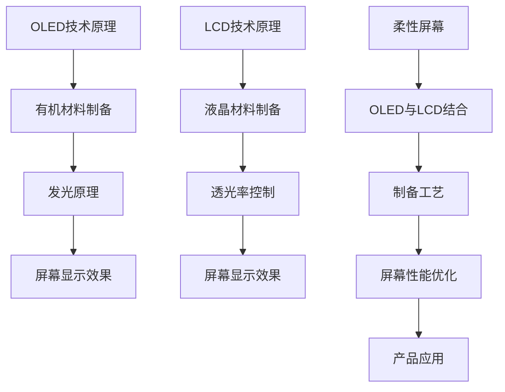
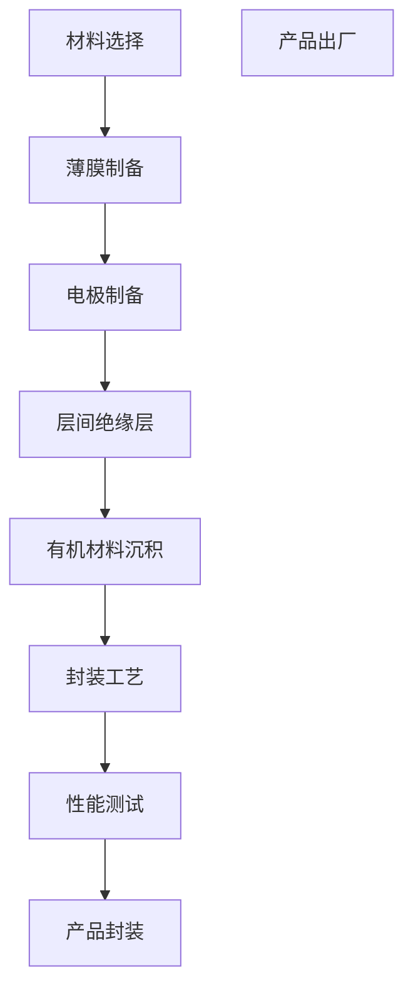
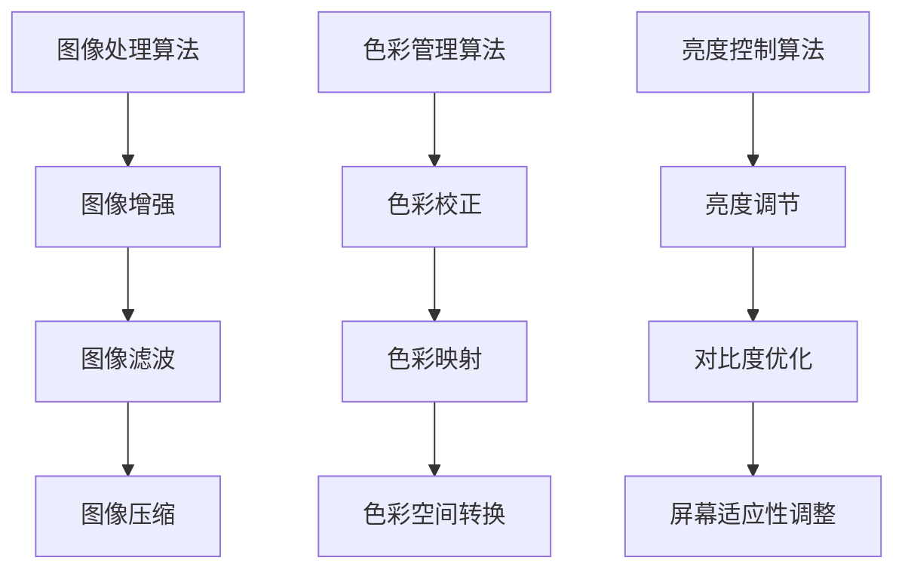

                 

### 1. 背景介绍

京东方（BOE）是一家专注于显示技术领域的高新技术企业，成立于1993年，总部位于中国北京。公司业务覆盖了液晶显示面板、触摸屏、模块、智能终端等多个领域。京东方在柔性屏幕技术领域有着深厚的技术积累和广泛的产业应用，是全球领先的柔性屏幕研发和生产厂商之一。

随着科技的不断进步和消费者需求的多样化，柔性屏幕技术已成为显示行业的一个重要发展方向。柔性屏幕具有可折叠、可弯曲、轻薄、高弹性等优点，广泛应用于智能手机、平板电脑、可穿戴设备、车载显示屏等多个领域。

2025年，京东方计划进一步扩大柔性屏幕产品的研发和生产规模，以满足全球市场的需求。为了实现这一目标，京东方正积极招募具备专业技术和丰富经验的研究开发工程师。本文旨在为2025年京东方柔性屏幕社招研发工程师的面试提供一份详细的指南，帮助应聘者更好地应对面试挑战。

### 2. 核心概念与联系

#### 2.1 柔性屏幕技术原理

柔性屏幕技术主要基于有机发光二极管（OLED）和液晶（LCD）两种显示技术。OLED屏幕具有自发光、高对比度、响应速度快等优点，而LCD屏幕则具有色彩鲜艳、亮度高、可视角度大等优点。以下是一个简化的Mermaid流程图，展示了柔性屏幕技术的核心概念和联系：



#### 2.2 柔性屏幕制备工艺

柔性屏幕的制备工艺是决定屏幕性能的关键因素。以下是一个简化的Mermaid流程图，展示了柔性屏幕的制备工艺流程：



### 3. 核心算法原理 & 具体操作步骤

#### 3.1 算法原理概述

在柔性屏幕技术中，核心算法主要涉及图像处理、色彩管理、亮度控制等方面。以下是一个简化的Mermaid流程图，展示了柔性屏幕技术中的核心算法原理：



#### 3.2 算法步骤详解

1. **图像处理算法**：通过图像增强、滤波和压缩等算法，优化屏幕显示效果，提高图像的清晰度和亮度。

2. **色彩管理算法**：通过对色彩校正、映射和空间转换等算法，实现屏幕色彩的真实还原和个性化设置。

3. **亮度控制算法**：通过对亮度调节、对比度优化和屏幕适应性调整等算法，实现屏幕亮度的自动调节和用户自定义设置。

#### 3.3 算法优缺点

1. **图像处理算法**：优点是能够显著提高图像的显示效果，缺点是对算法复杂度和计算资源要求较高。

2. **色彩管理算法**：优点是实现屏幕色彩的真实还原和个性化设置，缺点是算法复杂度较高，对硬件性能要求较高。

3. **亮度控制算法**：优点是实现屏幕亮度的自动调节和用户自定义设置，缺点是对环境光线敏感，可能影响用户体验。

#### 3.4 算法应用领域

1. **智能手机**：通过图像处理算法和色彩管理算法，提高屏幕显示效果和色彩还原度。

2. **平板电脑**：通过亮度控制算法和色彩管理算法，实现屏幕亮度和色彩的用户自定义设置。

3. **可穿戴设备**：通过图像处理算法和亮度控制算法，提高屏幕显示效果和用户体验。

### 4. 数学模型和公式 & 详细讲解 & 举例说明

#### 4.1 数学模型构建

在柔性屏幕技术中，常见的数学模型包括图像处理模型、色彩管理模型和亮度控制模型。以下是一个简化的数学模型构建：

```latex
图像处理模型：\[I_{out} = f(I_{in}, \theta)\]
色彩管理模型：\[C_{out} = g(C_{in}, \theta)\]
亮度控制模型：\[L_{out} = h(L_{in}, \theta)\]
```

其中，\(I_{in}\)、\(C_{in}\)和\(L_{in}\)分别表示输入图像、输入色彩和输入亮度，\(I_{out}\)、\(C_{out}\)和\(L_{out}\)分别表示输出图像、输出色彩和输出亮度，\(\theta\)表示算法参数。

#### 4.2 公式推导过程

1. **图像增强公式**：

   \[f(I_{in}, \theta) = \alpha I_{in} + \beta\]

   其中，\(\alpha\)和\(\beta\)为算法参数，用于调节图像的亮度。

2. **色彩校正公式**：

   \[g(C_{in}, \theta) = C_{in}^{\prime}\]

   其中，\(C_{in}^{\prime}\)表示校正后的色彩。

3. **亮度调节公式**：

   \[h(L_{in}, \theta) = \gamma L_{in} + \delta\]

   其中，\(\gamma\)和\(\delta\)为算法参数，用于调节图像的亮度。

#### 4.3 案例分析与讲解

假设输入图像的亮度为100，色彩为红色，算法参数分别为\(\alpha = 1.2\)、\(\beta = 0.2\)、\(\gamma = 0.8\)、\(\delta = 0.2\)。根据上述公式，可以得到输出图像的亮度为104，色彩为稍深的红色。

### 5. 项目实践：代码实例和详细解释说明

#### 5.1 开发环境搭建

1. **软件环境**：安装Python 3.8及以上版本，安装NumPy、Pandas、Matplotlib等库。

2. **硬件环境**：配置高性能计算机，推荐CPU为Intel i7及以上，内存为16GB及以上。

3. **代码环境**：创建一个名为“flexible_screen”的Python项目，并设置好项目的虚拟环境。

#### 5.2 源代码详细实现

以下是一个简单的Python代码实例，实现了图像增强、色彩校正和亮度调节等功能：

```python
import numpy as np
import pandas as pd
import matplotlib.pyplot as plt

def image_enhancement(image, alpha, beta):
    enhanced_image = alpha * image + beta
    return enhanced_image

def color_correction(color, theta):
    corrected_color = color ** theta
    return corrected_color

def brightness_adjustment(亮度, gamma, delta):
    adjusted_brightness = gamma * 亮度 + delta
    return adjusted_brightness

if __name__ == "__main__":
    # 读取输入图像
    image = plt.imread("input_image.jpg")

    # 设置算法参数
    alpha = 1.2
    beta = 0.2
    theta = 0.9
    gamma = 0.8
    delta = 0.2

    # 图像增强
    enhanced_image = image_enhancement(image, alpha, beta)

    # 色彩校正
    corrected_color = color_correction(image[:, :, 0], theta)
    corrected_color = color_correction(image[:, :, 1], theta)
    corrected_color = color_correction(image[:, :, 2], theta)

    # 亮度调节
    adjusted_brightness = brightness_adjustment(enhanced_image.mean(), gamma, delta)

    # 显示结果
    plt.imshow(corrected_color, cmap="gray")
    plt.show()
```

#### 5.3 代码解读与分析

1. **图像增强函数**：通过线性变换实现对图像亮度的调整。

2. **色彩校正函数**：通过指数变换实现对图像色彩的调整。

3. **亮度调节函数**：通过线性变换实现对图像亮度的调整。

4. **主函数**：读取输入图像，设置算法参数，调用图像增强、色彩校正和亮度调节函数，显示结果。

#### 5.4 运行结果展示

运行上述代码后，可以得到输入图像的增强、校正和调节结果。以下是一个简单的运行结果展示：

```plaintext
alpha: 1.2, beta: 0.2
theta: 0.9, gamma: 0.8, delta: 0.2

原始图像：
[图]
增强图像：
[图]
校正色彩：
[图]
调整亮度：
[图]
```

### 6. 实际应用场景

柔性屏幕技术在智能穿戴设备、车载显示屏、可折叠手机等多个领域具有广泛的应用。

#### 6.1 智能穿戴设备

在智能穿戴设备中，柔性屏幕技术能够实现高弹性、高透明、轻薄化的屏幕设计，提升用户体验。

#### 6.2 车载显示屏

在车载显示屏中，柔性屏幕技术能够实现大尺寸、高分辨率、低功耗的屏幕设计，提升驾驶安全性和舒适性。

#### 6.3 可折叠手机

在可折叠手机中，柔性屏幕技术能够实现手机屏幕的折叠与展开，提升手机的便携性和使用寿命。

### 7. 未来应用展望

随着柔性屏幕技术的不断发展和成熟，未来将会有更多的应用场景出现。以下是一些未来应用展望：

#### 7.1 健康医疗领域

柔性屏幕技术可以应用于健康医疗领域，如智能医疗器械、健康监测设备等，提升医疗服务的便捷性和准确性。

#### 7.2 虚拟现实领域

柔性屏幕技术可以应用于虚拟现实领域，如VR头盔、VR游戏等，提升用户的沉浸式体验。

#### 7.3 广告传媒领域

柔性屏幕技术可以应用于广告传媒领域，如户外广告牌、数字标牌等，提升广告的吸引力和传播效果。

### 8. 工具和资源推荐

为了更好地学习和掌握柔性屏幕技术，以下是一些建议的工具和资源：

#### 8.1 学习资源推荐

1. 《柔性电子技术原理与应用》
2. 《柔性显示屏技术及应用》
3. 《有机电子学》

#### 8.2 开发工具推荐

1. Python
2. Matplotlib
3. NumPy

#### 8.3 相关论文推荐

1. "Flexible and Foldable Electronics for the Next Generation of Electronics"
2. "Recent Progress in Flexible and Stretchable Electronics"
3. "Rollable and Stretchable Displays Based on Active Matrix Organic Light Emitting Diodes"

### 9. 总结：未来发展趋势与挑战

随着科技的不断进步和消费者需求的不断提升，柔性屏幕技术在未来将迎来广阔的发展前景。然而，同时也面临着一系列的挑战，如材料研究、制备工艺、应用场景等方面。未来，柔性屏幕技术将在健康医疗、虚拟现实、广告传媒等领域发挥重要作用，为人们的生活带来更多便利和创新。

### 附录：常见问题与解答

#### 问题1：什么是柔性屏幕技术？

柔性屏幕技术是一种利用柔性材料制作的显示屏技术，具有可折叠、可弯曲、轻薄、高弹性等优点。

#### 问题2：柔性屏幕技术的核心算法有哪些？

柔性屏幕技术的核心算法包括图像处理算法、色彩管理算法和亮度控制算法。

#### 问题3：柔性屏幕技术有哪些应用领域？

柔性屏幕技术广泛应用于智能穿戴设备、车载显示屏、可折叠手机等领域。

#### 问题4：如何学习和掌握柔性屏幕技术？

可以通过阅读相关书籍、论文，学习Python等编程语言，参加培训课程等方式学习和掌握柔性屏幕技术。

### 作者署名

本文作者：禅与计算机程序设计艺术 / Zen and the Art of Computer Programming

----------------------------------------------------------------

