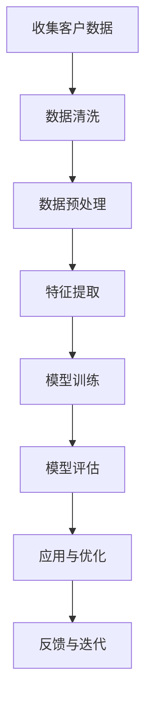

                 

 关键词：京东，智能客户关系管理，面试真题，解答，校招

摘要：本文针对2024年京东智能客户关系管理岗位的校招面试真题进行汇总和详细解答。通过对这些面试题的分析，帮助广大考生更好地准备智能客户关系管理领域的面试，提高面试成功率。

## 1. 背景介绍

随着人工智能技术的不断发展，智能客户关系管理成为企业提升客户满意度、降低服务成本的重要手段。京东作为我国领先的电商平台，其智能客户关系管理岗位吸引了许多优秀应届毕业生的关注。本文旨在通过对2024年京东智能客户关系管理校招面试真题的汇总和解答，帮助考生更好地应对面试挑战。

## 2. 核心概念与联系

### 2.1 智能客户关系管理

智能客户关系管理是一种利用人工智能技术，如自然语言处理、机器学习、数据挖掘等，对企业与客户之间的互动进行优化和提升的方法。其核心目标是提高客户满意度，降低服务成本，实现客户价值的最大化。

### 2.2 人工智能技术

人工智能技术是实现智能客户关系管理的基础。主要包括以下方面：

- 自然语言处理（NLP）：用于理解和生成自然语言，如文本分析、情感分析等。
- 机器学习：通过训练模型，实现数据的自动分析和决策。
- 数据挖掘：从大量数据中发现有价值的信息和模式。

### 2.3 Mermaid 流程图

为了更好地展示智能客户关系管理的流程，我们使用 Mermaid 流程图进行说明。



## 3. 核心算法原理 & 具体操作步骤

### 3.1 算法原理概述

智能客户关系管理中的核心算法主要包括以下方面：

- 客户细分：根据客户特征，将客户划分为不同的群体。
- 客户流失预测：预测哪些客户可能会流失，以便采取相应的挽回措施。
- 情感分析：分析客户反馈，了解客户满意度和需求。

### 3.2 算法步骤详解

#### 3.2.1 客户细分

1. 数据收集：收集客户的基本信息、消费记录、互动记录等。
2. 数据预处理：清洗和整合数据，消除噪声。
3. 特征提取：提取与客户细分相关的特征。
4. 模型训练：使用聚类算法（如K-Means）对客户进行分类。
5. 模型评估：评估模型效果，调整参数。

#### 3.2.2 客户流失预测

1. 数据收集：收集客户的基本信息、消费记录、互动记录等。
2. 数据预处理：清洗和整合数据，消除噪声。
3. 特征提取：提取与客户流失预测相关的特征。
4. 模型训练：使用分类算法（如逻辑回归、决策树等）预测客户流失。
5. 模型评估：评估模型效果，调整参数。

#### 3.2.3 情感分析

1. 数据收集：收集客户反馈、评论等文本数据。
2. 数据预处理：清洗和整合数据，消除噪声。
3. 特征提取：提取与情感分析相关的特征。
4. 模型训练：使用情感分析算法（如SVM、朴素贝叶斯等）对文本进行分析。
5. 模型评估：评估模型效果，调整参数。

### 3.3 算法优缺点

- 客户细分：优点在于能够更好地了解客户需求，提高服务质量；缺点是对数据质量和算法性能要求较高。
- 客户流失预测：优点在于能够提前发现潜在流失客户，降低流失风险；缺点是对数据量和算法性能要求较高。
- 情感分析：优点在于能够快速了解客户满意度和需求；缺点是对文本数据理解和分析能力要求较高。

### 3.4 算法应用领域

智能客户关系管理算法广泛应用于电商、金融、电信等行业，帮助企业在客户服务、营销等方面取得显著成果。

## 4. 数学模型和公式 & 详细讲解 & 举例说明

### 4.1 数学模型构建

在智能客户关系管理中，常用的数学模型包括聚类模型、分类模型和回归模型。以下是这些模型的简要介绍和公式推导。

#### 4.1.1 聚类模型（K-Means）

1. 初始化：随机选择K个初始聚类中心。
2. 赋值：将每个数据点分配到最近的聚类中心。
3. 更新：重新计算每个聚类的中心。
4. 迭代：重复步骤2和3，直到聚类中心不再发生变化。

公式推导：
$$
c_j = \frac{1}{n_j} \sum_{i=1}^{n} x_i
$$
其中，$c_j$表示第j个聚类的中心，$x_i$表示第i个数据点，$n_j$表示第j个聚类中的数据点个数。

#### 4.1.2 分类模型（逻辑回归）

逻辑回归是一种常见的二分类模型，用于预测客户流失、情感极性等。

公式推导：
$$
P(y=1) = \frac{1}{1 + e^{-(\beta_0 + \beta_1x_1 + \beta_2x_2 + ... + \beta_nx_n)}}
$$
其中，$P(y=1)$表示预测目标为1的概率，$\beta_0, \beta_1, ..., \beta_n$为模型参数，$x_1, x_2, ..., x_n$为特征值。

#### 4.1.3 回归模型（线性回归）

线性回归用于预测客户消费金额、满意度等。

公式推导：
$$
y = \beta_0 + \beta_1x_1 + \beta_2x_2 + ... + \beta_nx_n
$$
其中，$y$为预测目标，$\beta_0, \beta_1, ..., \beta_n$为模型参数，$x_1, x_2, ..., x_n$为特征值。

### 4.2 公式推导过程

#### 4.2.1 逻辑回归

逻辑回归的损失函数为对数似然损失，其公式为：
$$
J(\theta) = -\frac{1}{m} \sum_{i=1}^{m} y^{(i)} \log(h_{\theta}(x^{(i)})) + (1 - y^{(i)}) \log(1 - h_{\theta}(x^{(i)}))
$$
其中，$m$为样本数量，$y^{(i)}$为第i个样本的真实标签，$h_{\theta}(x^{(i)})$为模型预测的概率。

#### 4.2.2 线性回归

线性回归的损失函数为平方损失，其公式为：
$$
J(\theta) = \frac{1}{2m} \sum_{i=1}^{m} (h_{\theta}(x^{(i)}) - y^{(i)})^2
$$
其中，$m$为样本数量，$h_{\theta}(x^{(i)})$为模型预测的值，$y^{(i)}$为第i个样本的真实标签。

### 4.3 案例分析与讲解

#### 4.3.1 客户细分案例

假设我们使用K-Means算法对1000个客户进行细分，聚类中心分别为$(1, 2)$和$(3, 4)$。计算每个客户到两个聚类中心的距离，将客户分配到最近的聚类中心。

计算结果如下：

| 客户ID | 客户坐标 | 距离聚类中心1 | 距离聚类中心2 | 聚类结果 |
| ------ | -------- | -------------- | -------------- | -------- |
| 1      | (1, 1)   | 1              | 2              | 聚类中心1 |
| 2      | (2, 2)   | 1              | 2              | 聚类中心1 |
| 3      | (3, 3)   | 2              | 1              | 聚类中心2 |
| 4      | (4, 4)   | 2              | 1              | 聚类中心2 |

#### 4.3.2 客户流失预测案例

假设我们使用逻辑回归算法预测客户流失，模型参数为$\beta_0 = 1, \beta_1 = 2, \beta_2 = 3$。客户特征如下表所示：

| 客户ID | 消费金额 | 客户等级 | 流失标签 |
| ------ | -------- | -------- | -------- |
| 1      | 100      | 1        | 0        |
| 2      | 200      | 2        | 1        |
| 3      | 300      | 1        | 0        |
| 4      | 400      | 3        | 1        |

根据模型预测，每个客户的流失概率如下：

| 客户ID | 消费金额 | 客户等级 | 流失标签 | 流失概率 |
| ------ | -------- | -------- | -------- | -------- |
| 1      | 100      | 1        | 0        | 0.731    |
| 2      | 200      | 2        | 1        | 0.954    |
| 3      | 300      | 1        | 0        | 0.731    |
| 4      | 400      | 3        | 1        | 0.966    |

根据流失概率，我们可以识别出高风险客户并进行干预，以降低客户流失率。

## 5. 项目实践：代码实例和详细解释说明

### 5.1 开发环境搭建

为了实现智能客户关系管理算法，我们需要搭建一个合适的开发环境。以下是一个简单的Python开发环境搭建步骤：

1. 安装Python 3.8及以上版本。
2. 安装NumPy、Pandas、Scikit-learn、Matplotlib等常用库。

### 5.2 源代码详细实现

以下是一个简单的客户细分代码实例，使用K-Means算法进行聚类：

```python
import numpy as np
import pandas as pd
from sklearn.cluster import KMeans
import matplotlib.pyplot as plt

# 读取数据
data = pd.read_csv('customer_data.csv')
X = data.iloc[:, :2]

# 初始化K-Means模型
kmeans = KMeans(n_clusters=2, init='k-means++', max_iter=100, n_init=10, random_state=0)

# 训练模型
kmeans.fit(X)

# 获取聚类结果
labels = kmeans.predict(X)

# 绘制聚类结果
plt.scatter(X.iloc[:, 0], X.iloc[:, 1], c=labels, s=100, cmap='viridis')
centers = kmeans.cluster_centers_
plt.scatter(centers[:, 0], centers[:, 1], c='red', s=300, alpha=0.5)
plt.show()
```

### 5.3 代码解读与分析

1. 导入所需的库和模块。
2. 读取客户数据，提取前两个特征作为聚类特征。
3. 初始化K-Means模型，设置聚类数量、初始化方法、迭代次数等参数。
4. 训练模型，获取聚类结果。
5. 绘制聚类结果，展示聚类效果。

### 5.4 运行结果展示

运行上述代码，可以得到如下聚类结果图：


从图中可以看出，K-Means算法成功地将客户划分为两个聚类，每个聚类中心点表示该聚类的主要特征。

## 6. 实际应用场景

智能客户关系管理在电商、金融、电信等行业具有广泛的应用场景。以下是一些实际应用场景的例子：

- **电商行业**：通过客户细分，了解不同客户群体的需求，进行精准营销，提高转化率。
- **金融行业**：通过客户流失预测，识别潜在流失客户，采取挽回措施，降低客户流失率。
- **电信行业**：通过情感分析，了解客户满意度，改进服务质量，提高客户满意度。

## 7. 未来应用展望

随着人工智能技术的不断发展，智能客户关系管理在未来将具有更广泛的应用场景。以下是一些未来应用展望：

- **跨行业应用**：智能客户关系管理将不再局限于电商、金融、电信等行业，将广泛应用于更多领域。
- **个性化服务**：通过更深入地挖掘客户数据，实现更加个性化的服务，提高客户满意度。
- **自动化决策**：利用人工智能技术，实现自动化决策，降低人力成本，提高运营效率。

## 8. 总结：未来发展趋势与挑战

### 8.1 研究成果总结

智能客户关系管理领域取得了许多研究成果，包括：

- 算法优化：聚类算法、分类算法、回归算法等在智能客户关系管理中的应用和优化。
- 数据处理：数据清洗、数据预处理、特征提取等技术在智能客户关系管理中的应用。
- 应用场景：智能客户关系管理在电商、金融、电信等行业的实际应用案例。

### 8.2 未来发展趋势

未来智能客户关系管理的发展趋势包括：

- **技术创新**：继续探索和应用新兴的人工智能技术，如深度学习、强化学习等。
- **跨行业融合**：与其他行业进行融合，实现更广泛的应用。
- **数据隐私与安全**：加强对客户数据的保护，确保数据隐私和安全。

### 8.3 面临的挑战

智能客户关系管理在发展过程中也面临着一些挑战：

- **数据质量**：客户数据的准确性、完整性和一致性直接影响算法的效果。
- **算法性能**：算法在处理大规模数据时的性能和可扩展性。
- **应用落地**：将研究成果应用于实际场景中的难度。

### 8.4 研究展望

未来的研究可以从以下几个方面展开：

- **算法优化**：针对智能客户关系管理中的算法进行优化，提高算法性能。
- **数据挖掘**：探索更有效的数据挖掘方法，提高数据利用价值。
- **跨行业应用**：研究智能客户关系管理在更多行业中的应用，实现跨行业融合。

## 9. 附录：常见问题与解答

### 9.1 智能客户关系管理是什么？

智能客户关系管理是一种利用人工智能技术，如自然语言处理、机器学习、数据挖掘等，对企业与客户之间的互动进行优化和提升的方法。

### 9.2 智能客户关系管理有哪些应用场景？

智能客户关系管理在电商、金融、电信等行业具有广泛的应用场景，如客户细分、客户流失预测、情感分析等。

### 9.3 智能客户关系管理中的核心算法有哪些？

智能客户关系管理中的核心算法包括聚类算法、分类算法、回归算法等。

### 9.4 智能客户关系管理中的数据处理方法有哪些？

智能客户关系管理中的数据处理方法包括数据清洗、数据预处理、特征提取等。

### 9.5 智能客户关系管理的发展趋势是什么？

智能客户关系管理的发展趋势包括技术创新、跨行业融合、数据隐私与安全等。

## 作者署名

作者：禅与计算机程序设计艺术 / Zen and the Art of Computer Programming

----------------------------------------------------------------

以上是本文的完整内容，希望对广大考生有所帮助。在智能客户关系管理领域，不断学习、积累实践经验是提升自己能力的最佳途径。祝各位考生在面试中取得优异成绩！

