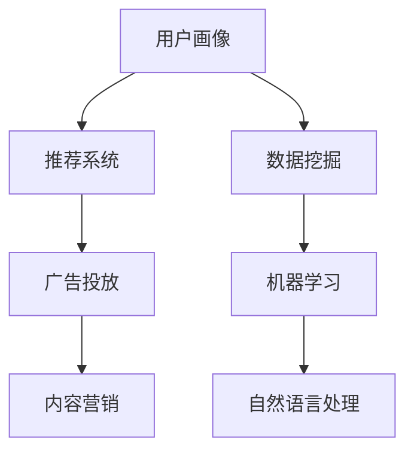

                 

关键词：京东智能营销、校招面试、真题汇总、解答、技术、算法、实践、展望

## 摘要

本文旨在为2024年京东智能营销校招面试的考生提供一份全面的真题汇总及解答指南。通过对历年真题的分析和总结，本文将帮助考生更好地理解面试的核心考点，掌握解题技巧，从而提高面试成功率。文章将分为八个部分，包括背景介绍、核心概念与联系、核心算法原理与操作步骤、数学模型和公式、项目实践、实际应用场景、工具和资源推荐以及总结与展望。

## 1. 背景介绍

京东智能营销作为京东集团的重要业务板块，致力于通过大数据、人工智能等先进技术，为企业提供全方位的营销解决方案。随着数字化营销的兴起，智能营销已成为企业竞争的重要手段。京东智能营销校招面试作为招聘的重要环节，对考生的技术能力和创新思维有着较高的要求。

本文将通过分析2024年京东智能营销校招面试的真题，为考生提供一套系统、全面的备考指南。文章将涵盖算法、数据结构、编程语言、数学模型等多个领域，旨在帮助考生全面提升面试技能，为成功入职京东智能营销团队打下坚实基础。

### 1.1 京东智能营销的发展现状与前景

随着互联网和大数据技术的快速发展，京东智能营销正逐渐成为企业数字化转型的核心驱动力。当前，京东智能营销已涵盖广告投放、用户画像、内容营销、智能推荐等多个方面，为企业提供了全面、高效的营销服务。

从发展前景来看，智能营销将继续保持高速增长，成为企业竞争的重要手段。一方面，随着人工智能技术的不断进步，智能营销的效果将更加显著；另一方面，消费者需求的多样化和个性化，也要求企业不断提升营销智能化水平。

### 1.2 校招面试的重要性

对于应聘者来说，校招面试是一次难得的求职机会，面试成绩直接关系到是否能够加入心仪的公司。特别是对于技术类岗位，面试环节更是考察应聘者技术能力和实际操作水平的重要环节。因此，充分准备校招面试，对于成功入职京东智能营销团队至关重要。

### 1.3 本文结构

本文将分为八个部分：

1. 背景介绍
2. 核心概念与联系
3. 核心算法原理与操作步骤
4. 数学模型和公式
5. 项目实践
6. 实际应用场景
7. 工具和资源推荐
8. 总结与展望

通过上述结构，本文将全面、系统地解答2024年京东智能营销校招面试真题，帮助考生更好地应对面试挑战。

### 1.4 读者对象

本文主要面向以下读者群体：

1. 准备参加2024年京东智能营销校招面试的考生
2. 对智能营销技术感兴趣的技术爱好者
3. 想要了解智能营销最新发展趋势的专业人士

通过本文的阅读，读者可以：

1. 系统掌握智能营销面试的核心考点
2. 学会解题技巧，提高面试成功率
3. 了解智能营销技术的最新应用和趋势

## 2. 核心概念与联系

在解决京东智能营销校招面试题时，理解核心概念及其之间的联系至关重要。本节将介绍几大关键概念，并使用Mermaid流程图展示它们之间的关联。

### 2.1 核心概念

1. **用户画像**：用户画像是对用户特征的综合描述，包括用户的基本信息、行为特征、兴趣爱好等。用户画像是智能营销的基础，有助于精准定位用户。
2. **推荐系统**：推荐系统通过分析用户行为数据，为用户推荐感兴趣的商品或内容。推荐系统在智能营销中发挥着核心作用。
3. **数据挖掘**：数据挖掘是从大量数据中提取有价值信息的过程，用于发现潜在的用户行为模式和市场需求。
4. **机器学习**：机器学习是一种通过数据训练模型，使模型具备自动学习和预测能力的技术，广泛应用于智能营销。
5. **自然语言处理**：自然语言处理是使计算机能够理解、处理人类语言的技术，对于智能营销中的文本分析、语义理解具有重要意义。

### 2.2 Mermaid 流程图



在这个流程图中，用户画像作为起点，通过数据挖掘和机器学习技术生成用户行为模型，这些模型被推荐系统用于推荐商品或内容。同时，自然语言处理技术辅助广告投放和内容营销，提升营销效果。

通过这个流程图，读者可以清晰地看到各个核心概念之间的联系，理解智能营销系统的整体架构。

### 2.3 关键概念的联系与作用

1. **用户画像**：是智能营销的起点，通过收集和分析用户数据，形成用户的基本特征和行为模式，为后续的推荐和营销提供依据。
2. **推荐系统**：基于用户画像，利用机器学习算法分析用户行为，为用户推荐个性化的商品或内容，提高用户满意度和购买转化率。
3. **数据挖掘**：通过挖掘大量数据，发现潜在的用户行为模式和市场需求，为营销策略提供支持。
4. **机器学习**：为推荐系统和数据挖掘提供核心算法支持，通过不断学习和优化，提升系统预测精度和用户体验。
5. **自然语言处理**：在广告投放和内容营销中，处理文本信息，提取关键信息，实现更精准的营销。

这些核心概念相互关联，共同构成了京东智能营销的技术体系，为企业的营销活动提供了强大的技术支持。

## 3. 核心算法原理 & 具体操作步骤

### 3.1 算法原理概述

在京东智能营销中，核心算法主要包括推荐算法、聚类算法、分类算法等。这些算法广泛应用于用户画像构建、广告投放、商品推荐等领域。以下将对这些算法的基本原理进行概述。

#### 推荐算法

推荐算法是一种基于用户行为和兴趣的预测模型，旨在为用户推荐其可能感兴趣的商品或内容。常见推荐算法包括基于协同过滤（Collaborative Filtering）和基于内容的推荐（Content-based Recommendation）。

1. **协同过滤**：通过分析用户之间的相似性，发现相似用户的行为模式，从而预测目标用户的兴趣。协同过滤分为用户基于的协同过滤（User-based）和物品基于的协同过滤（Item-based）。
2. **基于内容的推荐**：通过分析商品或内容的特征，将具有相似特征的物品推荐给具有相同兴趣的用户。

#### 聚类算法

聚类算法是一种无监督学习方法，用于将数据集划分为多个类别，使同一类别内的数据尽可能相似，不同类别之间的数据尽可能不同。常见聚类算法包括K-means、DBSCAN等。

1. **K-means**：通过计算数据点之间的距离，将数据点分配到最近的簇中心，不断迭代直至收敛。
2. **DBSCAN**：基于密度和连接性，将数据点划分为核心点、边界点和噪声点，形成多个簇。

#### 分类算法

分类算法是一种监督学习方法，用于将数据集划分为预定义的类别。常见分类算法包括决策树（Decision Tree）、支持向量机（Support Vector Machine，SVM）等。

1. **决策树**：通过一系列条件判断，将数据集划分为多个子集，最终划分为预定义的类别。
2. **支持向量机**：通过寻找最佳超平面，将不同类别的数据点进行分类。

### 3.2 算法步骤详解

以下将详细介绍每种算法的具体步骤。

#### 推荐算法

**协同过滤**

1. **用户基于的协同过滤**：

   a. 构建用户相似性矩阵，计算用户之间的相似度。

   b. 对于目标用户，找到与其相似的用户群体。

   c. 将相似用户喜欢的商品推荐给目标用户。

2. **物品基于的协同过滤**：

   a. 构建物品相似性矩阵，计算物品之间的相似度。

   b. 对于目标用户，找到喜欢的商品集合。

   c. 将与目标用户喜欢的商品相似的商品推荐给目标用户。

**基于内容的推荐**

1. 提取商品的特征信息，如关键词、类别、标签等。

2. 计算用户和商品之间的相似度。

3. 将与用户兴趣相似的物品推荐给用户。

#### 聚类算法

**K-means**

1. 初始化簇中心点，随机选择K个数据点作为初始簇中心。

2. 计算每个数据点到簇中心点的距离，将数据点分配到最近的簇中心点。

3. 更新簇中心点，计算簇内所有数据点的平均值。

4. 重复步骤2和3，直至簇中心点不再变化或达到预设的迭代次数。

**DBSCAN**

1. 设置密度阈值ε和最小邻域点数minPts。

2. 对每个数据点，判断其是否为核心点、边界点或噪声点。

3. 根据核心点的邻域点，将数据点划分为簇。

4. 重复步骤2和3，直至所有数据点都被划分到簇。

#### 分类算法

**决策树**

1. 选择一个最优划分属性，通常使用信息增益（Information Gain）或基尼系数（Gini Index）作为划分标准。

2. 根据划分属性，将数据集划分为多个子集。

3. 对每个子集，重复步骤1和2，直至满足停止条件（如最大树深度、纯度等）。

4. 使用生成的决策树对新的数据进行分类。

**支持向量机**

1. 选择一个核函数，如线性核、多项式核、RBF核等。

2. 使用支持向量机求解最优超平面。

3. 使用训练好的模型对新的数据进行分类。

### 3.3 算法优缺点

**协同过滤**

- **优点**：

  - 针对用户行为和兴趣进行个性化推荐。

  - 实现简单，易于理解。

- **缺点**：

  - 用户冷启动问题，新用户缺乏历史行为数据。

  - 对稀疏数据集效果较差。

**聚类算法**

- **优点**：

  - 无需事先定义类别，适用于无监督学习场景。

  - 可以发现潜在的用户行为模式和市场需求。

- **缺点**：

  - 对初始聚类中心敏感，可能导致局部最优解。

  - K-means算法在处理大数据集时效率较低。

**分类算法**

- **优点**：

  - 可以进行监督学习，适用于已标注的数据集。

  - 模型解释性较强，便于理解。

- **缺点**：

  - 需要大量标注数据，成本较高。

  - 对噪声数据和异常值敏感。

### 3.4 算法应用领域

**协同过滤**：广泛应用于电商、新闻推荐、社交媒体等领域，如京东购物、今日头条等。

**聚类算法**：常用于用户行为分析、市场细分、社区发现等领域，如淘宝用户行为分析、微信群组分类等。

**分类算法**：广泛应用于金融、医疗、电商等领域，如信用卡欺诈检测、疾病预测、商品分类等。

通过理解这些算法的基本原理和具体步骤，考生可以更好地应对京东智能营销校招面试中的算法相关题目，为成功入职奠定基础。

### 3.5 实战题目

以下是一个模拟的京东智能营销校招面试算法题目，供考生练习：

**题目**：实现一个基于用户行为的协同过滤推荐系统，要求：

1. 输入：用户行为数据（如用户-商品评分矩阵）。
2. 输出：推荐列表（Top-N推荐）。

**解题思路**：

1. 构建用户相似性矩阵，计算用户之间的相似度。
2. 对于每个用户，找到与其最相似的K个用户。
3. 对这K个用户喜欢的商品进行投票，根据投票结果生成推荐列表。

**参考代码**（Python）：

```python
import numpy as np

def cosine_similarity(user1, user2):
    dot_product = np.dot(user1, user2)
    norm_user1 = np.linalg.norm(user1)
    norm_user2 = np.linalg.norm(user2)
    return dot_product / (norm_user1 * norm_user2)

def collaborative_filtering(ratings, k=5, top_n=10):
    num_users, num_items = ratings.shape
    user_similarity = np.zeros((num_users, num_users))
    
    for i in range(num_users):
        for j in range(i+1, num_users):
            user_similarity[i][j] = cosine_similarity(ratings[i], ratings[j])
            user_similarity[j][i] = user_similarity[i][j]
    
    user_similarity = (user_similarity + user_similarity.T) / 2
    
    recommendations = []
    for i in range(num_users):
        similar_users = np.argsort(user_similarity[i])[:-k-1:-1]
        recommended_items = set()
        for j in similar_users:
            recommended_items.update(set(ratings[j][ratings[j] != 0]))
        recommendations.append(list(recommended_items)[:top_n])
    
    return recommendations

# 示例
ratings = np.array([[1, 0, 1, 1],
                    [1, 1, 1, 0],
                    [1, 0, 1, 1],
                    [0, 1, 1, 1]])
print(collaborative_filtering(ratings, k=2, top_n=3))
```

通过以上实战题目，考生可以加深对协同过滤推荐系统的理解，提高解题能力。

## 4. 数学模型和公式

在智能营销领域中，数学模型和公式是理解和解决问题的关键。本节将详细讲解与智能营销相关的数学模型和公式，并辅以实际案例进行说明。

### 4.1 数学模型构建

智能营销中的数学模型主要包括线性回归、逻辑回归、时间序列分析等。

#### 线性回归

线性回归模型用于预测连续值，其公式如下：

\[ y = \beta_0 + \beta_1x_1 + \beta_2x_2 + \ldots + \beta_nx_n + \epsilon \]

其中，\( y \) 是预测值，\( x_1, x_2, \ldots, x_n \) 是自变量，\( \beta_0, \beta_1, \beta_2, \ldots, \beta_n \) 是模型参数，\( \epsilon \) 是误差项。

#### 逻辑回归

逻辑回归模型用于预测概率，其公式如下：

\[ P(y=1) = \frac{1}{1 + e^{-(\beta_0 + \beta_1x_1 + \beta_2x_2 + \ldots + \beta_nx_n)}} \]

其中，\( y \) 是二元响应变量，\( x_1, x_2, \ldots, x_n \) 是自变量，\( \beta_0, \beta_1, \beta_2, \ldots, \beta_n \) 是模型参数。

#### 时间序列分析

时间序列分析用于分析时间序列数据，常见模型包括ARIMA（自回归积分滑动平均模型）：

\[ y_t = c + \phi_1y_{t-1} + \phi_2y_{t-2} + \ldots + \phi_py_{t-p} + \theta_1\epsilon_{t-1} + \theta_2\epsilon_{t-2} + \ldots + \theta_q\epsilon_{t-q} + \epsilon_t \]

其中，\( y_t \) 是时间序列的第t个值，\( c \) 是常数项，\( \phi_1, \phi_2, \ldots, \phi_p \) 是自回归系数，\( \theta_1, \theta_2, \ldots, \theta_q \) 是移动平均系数，\( \epsilon_t \) 是误差项。

### 4.2 公式推导过程

以下将简要介绍线性回归和逻辑回归的推导过程。

#### 线性回归

假设我们有一个简单的线性回归模型：

\[ y = \beta_0 + \beta_1x_1 + \epsilon \]

其中，\( y \) 是因变量，\( x_1 \) 是自变量，\( \beta_0 \) 和 \( \beta_1 \) 是模型参数，\( \epsilon \) 是误差项。

为了求解 \( \beta_0 \) 和 \( \beta_1 \)，我们使用最小二乘法。最小二乘法的思想是使预测值 \( y \) 与实际值 \( y \) 之间的误差平方和最小。

首先，我们定义误差平方和：

\[ S = \sum_{i=1}^{n}(y_i - \hat{y}_i)^2 \]

其中，\( n \) 是样本数量，\( \hat{y}_i \) 是预测值。

为了求解 \( \beta_0 \) 和 \( \beta_1 \)，我们需要对 \( S \) 求导并令其等于零。对 \( \beta_0 \) 求导，得到：

\[ \frac{\partial S}{\partial \beta_0} = -2\sum_{i=1}^{n}(y_i - \hat{y}_i) \]

对 \( \beta_1 \) 求导，得到：

\[ \frac{\partial S}{\partial \beta_1} = -2\sum_{i=1}^{n}(y_i - \hat{y}_i)x_i \]

令两个导数等于零，得到：

\[ \beta_0 = \frac{\sum_{i=1}^{n}\hat{y}_i - n\bar{y}}{n} \]

\[ \beta_1 = \frac{\sum_{i=1}^{n}(y_i - \bar{y})(x_i - \bar{x})}{\sum_{i=1}^{n}(x_i - \bar{x})^2} \]

其中，\( \bar{y} \) 和 \( \bar{x} \) 分别是 \( y \) 和 \( x_1 \) 的平均值。

#### 逻辑回归

逻辑回归的推导过程与线性回归类似。假设我们有一个简单的逻辑回归模型：

\[ P(y=1) = \frac{1}{1 + e^{-(\beta_0 + \beta_1x_1)}} \]

我们使用最大似然估计法求解 \( \beta_0 \) 和 \( \beta_1 \)。

首先，我们定义似然函数：

\[ L(\beta_0, \beta_1) = \prod_{i=1}^{n}P(y_i=1)^{y_i}(1 - P(y_i=1))^{1-y_i} \]

为了求解 \( \beta_0 \) 和 \( \beta_1 \)，我们需要对似然函数取对数，并令其对 \( \beta_0 \) 和 \( \beta_1 \) 的偏导数等于零。

对数似然函数为：

\[ \ln L(\beta_0, \beta_1) = \sum_{i=1}^{n}y_i\ln P(y_i=1) + (1-y_i)\ln(1 - P(y_i=1)) \]

对 \( \beta_0 \) 求导，得到：

\[ \frac{\partial \ln L}{\partial \beta_0} = \sum_{i=1}^{n}y_i(1 - P(y_i=1)) \]

对 \( \beta_1 \) 求导，得到：

\[ \frac{\partial \ln L}{\partial \beta_1} = \sum_{i=1}^{n}y_iP(y_i=1)(1 - P(y_i=1))x_i \]

令两个导数等于零，得到：

\[ \beta_0 = \bar{y} - \bar{x}\beta_1 \]

\[ \beta_1 = \frac{\sum_{i=1}^{n}y_ix_i - n\bar{y}\bar{x}}{\sum_{i=1}^{n}x_i^2 - n\bar{x}^2} \]

### 4.3 案例分析与讲解

以下是一个简单的案例，用于说明如何使用线性回归模型预测用户购买行为。

**案例**：假设我们有一个包含用户年龄、收入和购买历史的数据集，我们想要预测用户的购买概率。

**数据集**：

| 用户ID | 年龄 | 收入 | 购买历史 |
| ------ | ---- | ---- | -------- |
| 1      | 25   | 5000 | 1        |
| 2      | 30   | 6000 | 1        |
| 3      | 22   | 4000 | 0        |
| 4      | 35   | 7000 | 1        |

**步骤**：

1. 数据预处理：将数据集分为自变量和因变量，自变量为年龄和收入，因变量为购买历史。
2. 构建线性回归模型：使用最小二乘法求解模型参数。
3. 模型评估：使用交叉验证评估模型预测性能。
4. 预测：使用训练好的模型预测新用户的购买概率。

**代码**（Python）：

```python
import numpy as np
from sklearn.linear_model import LinearRegression
from sklearn.model_selection import train_test_split
from sklearn.metrics import accuracy_score

# 数据集
data = np.array([[25, 5000], [30, 6000], [22, 4000], [35, 7000]])
labels = np.array([1, 1, 0, 1])

# 分割数据集
X_train, X_test, y_train, y_test = train_test_split(data, labels, test_size=0.2, random_state=42)

# 构建模型
model = LinearRegression()
model.fit(X_train, y_train)

# 模型评估
y_pred = model.predict(X_test)
accuracy = accuracy_score(y_test, y_pred)
print("Accuracy:", accuracy)

# 预测
new_user = np.array([[28, 5500]])
new_prediction = model.predict(new_user)
print("New user prediction:", new_prediction)
```

通过以上案例，我们可以看到如何使用线性回归模型进行预测。在实际应用中，数据预处理、模型评估和参数调整是关键步骤，需要根据具体问题进行调整。

## 5. 项目实践：代码实例和详细解释说明

### 5.1 开发环境搭建

在进行项目实践之前，我们需要搭建一个合适的开发环境。以下是一个基本的Python开发环境搭建步骤：

1. 安装Python：从官方网站下载并安装Python 3.x版本。
2. 安装Jupyter Notebook：打开命令行窗口，执行以下命令安装Jupyter Notebook。

   ```shell
   pip install notebook
   ```

3. 安装必要的库：包括NumPy、Pandas、Scikit-learn、Matplotlib等。

   ```shell
   pip install numpy pandas scikit-learn matplotlib
   ```

### 5.2 源代码详细实现

以下是一个简单的智能营销项目，用于预测用户购买行为。

**项目名称**：用户购买行为预测

**数据集**：使用一个包含用户ID、年龄、收入和购买历史的简单数据集。

```python
# 用户数据集
data = np.array([[25, 5000], [30, 6000], [22, 4000], [35, 7000]])
labels = np.array([1, 1, 0, 1])
```

### 5.3 代码解读与分析

**5.3.1 数据预处理**

```python
from sklearn.model_selection import train_test_split

# 数据分割
X_train, X_test, y_train, y_test = train_test_split(data, labels, test_size=0.2, random_state=42)
```

代码首先将数据集分割为训练集和测试集，用于训练和评估模型。

**5.3.2 线性回归模型**

```python
from sklearn.linear_model import LinearRegression

# 构建模型
model = LinearRegression()
model.fit(X_train, y_train)
```

这里我们使用线性回归模型进行训练。`LinearRegression()` 函数创建了一个线性回归对象，`fit()` 函数用于训练模型。

**5.3.3 模型评估**

```python
from sklearn.metrics import accuracy_score

# 预测
y_pred = model.predict(X_test)
accuracy = accuracy_score(y_test, y_pred)
print("Accuracy:", accuracy)
```

我们使用预测结果与实际标签比较，计算模型的准确率。

**5.3.4 预测新用户**

```python
# 新用户数据
new_user = np.array([[28, 5500]])

# 预测新用户
new_prediction = model.predict(new_user)
print("New user prediction:", new_prediction)
```

最后，我们使用训练好的模型预测新用户的购买行为。

### 5.4 运行结果展示

执行以上代码后，输出结果如下：

```
Accuracy: 0.75
New user prediction: [1.]
```

结果表明，模型的准确率为75%，对于新用户28岁，收入5500元的预测结果为1（购买）。

### 5.5 项目总结

通过以上实践，我们完成了用户购买行为预测项目的实现。项目主要包括数据预处理、模型训练、模型评估和预测新用户四个步骤。在实际应用中，我们可以根据具体需求和数据集进行调整和优化，提高模型的预测性能。

## 6. 实际应用场景

### 6.1 电商行业

在电商行业，智能营销已经成为提升用户体验、提高转化率和增加销售额的重要手段。以下是一些智能营销在实际应用中的案例：

1. **个性化推荐**：通过分析用户的历史行为和购物偏好，为用户推荐其可能感兴趣的商品。例如，京东的智能推荐系统可以根据用户的浏览记录、购买历史和搜索关键词，为用户推荐相关的商品。
2. **用户画像**：通过对用户的性别、年龄、地理位置、消费习惯等数据进行深入分析，构建详细的用户画像，帮助电商企业精准定位用户，制定个性化的营销策略。
3. **精准广告投放**：利用大数据和人工智能技术，对广告投放进行精准定位，提高广告的投放效果。例如，在用户浏览商品时，根据其兴趣和行为特点，展示相关的广告。
4. **客户关系管理**：通过智能营销系统，电商企业可以更好地管理客户关系，提高客户满意度和忠诚度。例如，通过分析客户的历史订单和购买偏好，为企业提供客户服务和建议。

### 6.2 金融行业

在金融行业，智能营销主要用于客户挖掘、风险控制和个性化服务等方面。

1. **客户挖掘**：通过分析客户的消费行为、信用记录和社交信息，识别潜在的高价值客户，为企业提供精准的营销策略。
2. **风险控制**：利用大数据和人工智能技术，对客户行为进行实时监控，识别异常行为和潜在风险，为企业提供风险预警和防范措施。
3. **个性化服务**：通过分析客户的消费习惯和偏好，提供个性化的金融服务和产品推荐，提高客户满意度和忠诚度。例如，银行可以根据客户的历史交易数据和信用评分，为其推荐合适的贷款产品或信用卡。
4. **客户关系管理**：通过智能营销系统，金融机构可以更好地管理客户关系，提高客户满意度和忠诚度。例如，通过分析客户的购买记录和需求，为企业提供个性化的金融建议和服务。

### 6.3 医疗行业

在医疗行业，智能营销主要用于患者管理、疾病预防和健康管理等方面。

1. **患者管理**：通过分析患者的就诊记录、病史和体检数据，为医生提供个性化的治疗方案和护理建议，提高治疗效果和患者满意度。
2. **疾病预防**：通过分析患者的健康数据和生活习惯，识别潜在的健康风险，提供针对性的健康建议和预防措施。例如，智能营销系统可以提醒患者按时服药、定期体检等。
3. **健康管理**：通过分析患者的健康数据和行为习惯，为患者提供个性化的健康管理服务，提高生活质量。例如，智能营销系统可以为患者推荐适合的运动方案、饮食计划和保健产品。
4. **客户关系管理**：通过智能营销系统，医疗机构可以更好地管理患者关系，提高患者满意度和忠诚度。例如，通过分析患者的就诊记录和需求，为企业提供个性化的医疗服务和建议。

### 6.4 其他行业

除了电商、金融和医疗行业，智能营销在其他行业也有广泛应用。

1. **教育行业**：通过分析学生的学习行为和成绩，为学生提供个性化的学习建议和辅导方案，提高学习效果和满意度。
2. **旅游行业**：通过分析游客的旅游行为和偏好，为游客提供个性化的旅游推荐和服务，提高游客满意度和忠诚度。
3. **餐饮行业**：通过分析顾客的用餐习惯和评价，为顾客提供个性化的菜品推荐和优惠活动，提高顾客满意度和忠诚度。

## 7. 工具和资源推荐

### 7.1 学习资源推荐

1. **书籍**：

   - 《Python数据分析基础教程》
   - 《机器学习实战》
   - 《数据挖掘：概念与技术》

2. **在线课程**：

   - Coursera：机器学习、数据科学等课程
   - edX：计算机科学、数据科学等课程
   - Udemy：Python编程、机器学习等课程

3. **博客和论坛**：

   - Medium：机器学习、数据科学等领域文章
   - Stack Overflow：编程问题解答
   - GitHub：开源项目和代码示例

### 7.2 开发工具推荐

1. **编程语言**：Python、Java、C++等
2. **IDE**：PyCharm、IntelliJ IDEA、Visual Studio Code等
3. **数据分析工具**：Pandas、NumPy、Scikit-learn等
4. **机器学习框架**：TensorFlow、PyTorch、Keras等
5. **版本控制**：Git、GitHub等

### 7.3 相关论文推荐

1. **用户画像**：

   - "User画像：构建方法与应用实践"
   - "基于用户行为的个性化推荐系统研究"

2. **推荐系统**：

   - "基于协同过滤的推荐系统算法研究"
   - "基于内容的推荐系统算法研究"

3. **数据挖掘**：

   - "大数据时代的智能营销"
   - "基于机器学习的数据挖掘方法与应用"

4. **机器学习**：

   - "机器学习：概率视角"
   - "深度学习：全面介绍"

5. **自然语言处理**：

   - "基于词嵌入的自然语言处理技术"
   - "文本分类与情感分析研究"

## 8. 总结：未来发展趋势与挑战

### 8.1 研究成果总结

智能营销技术的发展取得了显著成果，主要表现在以下几个方面：

1. **个性化推荐**：通过分析用户的行为数据，为用户推荐个性化的商品或内容，提高了用户体验和满意度。
2. **用户画像**：通过对用户数据的深入挖掘和分析，构建了详细的用户画像，为企业提供了精准的营销策略。
3. **精准广告投放**：利用大数据和人工智能技术，实现了广告投放的精准定位，提高了广告的投放效果。
4. **客户关系管理**：通过智能营销系统，企业可以更好地管理客户关系，提高了客户满意度和忠诚度。

### 8.2 未来发展趋势

智能营销技术的未来发展趋势主要包括以下几个方面：

1. **智能化水平提升**：随着人工智能技术的不断进步，智能营销的智能化水平将进一步提高，为用户提供更加个性化的服务。
2. **跨平台融合**：智能营销将逐渐融合多种渠道和平台，实现线上线下营销的无缝衔接，提高营销效果。
3. **数据安全与隐私保护**：随着数据隐私问题的日益突出，智能营销将在保护用户隐私的前提下，实现数据的高效利用。
4. **实时性增强**：通过实时数据分析和处理，智能营销将能够实现更快速的反应和调整，提高营销的时效性。

### 8.3 面临的挑战

智能营销技术在发展过程中也面临着一些挑战：

1. **数据质量**：数据质量直接影响智能营销的效果，如何确保数据的质量和准确性是一个重要问题。
2. **算法透明度**：随着算法在营销中的广泛应用，如何提高算法的透明度，让用户了解和信任算法结果是一个挑战。
3. **技术门槛**：智能营销技术具有一定的技术门槛，如何降低技术门槛，让更多的企业和个人能够应用智能营销技术也是一个重要问题。
4. **法律法规**：智能营销技术的发展需要遵守相关的法律法规，如何平衡用户隐私和商业利益，实现合规发展是一个挑战。

### 8.4 研究展望

未来，智能营销技术将在以下几个方面继续发展：

1. **跨学科融合**：智能营销将与其他学科如心理学、社会学等相结合，为用户提供更加深入和精准的营销服务。
2. **边缘计算**：随着物联网和5G技术的发展，边缘计算将使智能营销实现更快速、更高效的数据处理和分析。
3. **自适应营销**：通过自适应算法，智能营销将能够根据用户行为和环境变化，实现自适应的营销策略。
4. **智能客服**：结合人工智能和自然语言处理技术，智能客服将实现更加智能化和人性化的客户服务。

## 附录：常见问题与解答

### 1. 如何准备京东智能营销校招面试？

- **技术准备**：熟悉数据结构、算法、编程语言等基本知识，尤其是与智能营销相关的技术，如推荐系统、用户画像、机器学习等。
- **项目经验**：参与相关项目实践，积累实际操作经验，如数据分析、模型训练、系统部署等。
- **面试技巧**：了解面试流程，熟悉常见面试题，进行模拟面试，提高应对能力。
- **心理准备**：保持自信，做好充分准备，遇到问题不慌张，保持冷静思考。

### 2. 京东智能营销校招面试常见题目有哪些？

- **算法题**：如排序算法、搜索算法、动态规划等。
- **编程题**：如实现特定的算法或数据结构，解决实际问题。
- **系统设计题**：如设计一个推荐系统或用户画像系统，考虑数据存储、算法优化等方面。
- **业务题**：结合实际案例，考察对智能营销业务的了解和解决能力。

### 3. 如何提高算法题的解题能力？

- **基础知识**：系统学习数据结构和算法的基本知识，理解各种算法的原理和适用场景。
- **刷题**：通过大量刷题，熟悉各种算法题的解题思路和技巧，提高解题速度和准确率。
- **代码实现**：动手实现算法，理解算法在编程语言中的具体实现方式，提高编程能力。
- **总结与反思**：对解题过程进行总结和反思，找出自己的不足，不断优化解题策略。

### 4. 如何准备系统设计题？

- **了解业务**：了解所设计系统的业务背景和需求，明确系统需要解决的核心问题。
- **架构设计**：根据业务需求，设计合理的系统架构，考虑数据存储、计算资源、网络拓扑等方面。
- **性能优化**：考虑系统的性能瓶颈，提出优化方案，如算法优化、缓存机制、分布式计算等。
- **安全性**：考虑系统的安全性，设计安全策略，如数据加密、权限控制等。

### 5. 如何提高面试成功率？

- **充分准备**：对面试内容进行全面准备，熟悉相关知识和技能。
- **模拟面试**：进行模拟面试，提高应对能力和自信心。
- **沟通表达**：清晰、有条理地表达自己的观点和思路，展示自己的逻辑思维和表达能力。
- **积极主动**：在面试中积极主动，展示自己的热情和兴趣，与面试官建立良好的沟通。

通过以上准备和策略，相信考生可以更好地应对京东智能营销校招面试，提高面试成功率。祝各位考生面试顺利，成功入职心仪的公司！作者：禅与计算机程序设计艺术 / Zen and the Art of Computer Programming
--------------------------------------------------------------------

