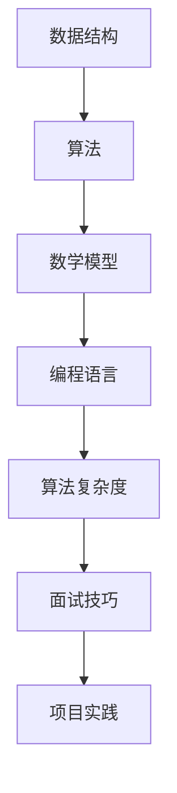

                 

关键词：京东社招、面试、算法题库、核心技术、编程实践

> 摘要：本文将为您全面解析2025年京东社招面试中的算法题库，涵盖了各种核心技术点，包括数据结构、算法原理、数学模型、项目实践等内容，旨在帮助您更好地应对面试挑战，掌握核心技术。

## 1. 背景介绍

随着互联网技术的飞速发展，大数据、人工智能、云计算等新兴技术逐渐成为企业竞争的焦点。京东作为中国领先的电商企业，其社招面试中算法题库的难度和深度也逐年提升。本文旨在为您提供一个全面、系统的算法题库，帮助您更好地准备京东社招面试。

## 2. 核心概念与联系

为了更好地理解算法题库中的问题，我们需要先了解一些核心概念和它们之间的联系。以下是使用Mermaid绘制的流程图，展示了这些概念之间的关系。



### 2.1 数据结构

数据结构是存储和管理数据的方式。常见的有数组、链表、栈、队列、树、图等。数据结构的选择直接影响算法的效率和性能。

### 2.2 算法

算法是解决问题的步骤和方法。它是一系列操作，用于解决特定问题。算法的设计和实现需要考虑数据结构、算法复杂度等因素。

### 2.3 数学模型

数学模型是将实际问题转化为数学形式的过程。它有助于我们理解和解决问题。常见的数学模型有线性规划、非线性规划、动态规划等。

### 2.4 编程语言

编程语言是编写算法的工具。常见的编程语言有Python、Java、C++等。每种编程语言都有其独特的特点和适用场景。

### 2.5 算法复杂度

算法复杂度是衡量算法效率的指标。常见的复杂度有时间复杂度和空间复杂度。算法复杂度的分析有助于我们选择最优的算法。

### 2.6 面试技巧

面试技巧是应对面试场景的技巧和方法。包括简历准备、自我介绍、面试官提问回答、技术面试等。

### 2.7 项目实践

项目实践是将理论知识应用到实际项目中的过程。通过项目实践，我们可以更好地理解算法和应用场景。

## 3. 核心算法原理 & 具体操作步骤

### 3.1 算法原理概述

在京东社招面试中，常见的核心算法有：

- 排序算法：冒泡排序、选择排序、插入排序、快速排序等。
- 查找算法：二分查找、哈希查找等。
- 动态规划：最长公共子序列、最长公共子串、背包问题等。
- 网络流算法：最大流、最小费用流等。

### 3.2 算法步骤详解

以下是对每个算法的简要步骤说明：

- 冒泡排序：比较相邻两个元素的值，如果它们的顺序错误就把它们交换过来。重复进行直到整个序列排序完成。
- 选择排序：首先在未排序序列中找到最小（大）元素，存放到排序序列的起始位置，然后，再从剩余未排序元素中继续寻找最小（大）元素，然后放到已排序序列的末尾。以此类推，直到所有元素均排序完毕。
- 插入排序：在已排好序的序列中插入一个新元素，通过比较和交换来保持序列的有序性。
- 快速排序：通过一趟排序将待排序的记录分割成独立的两部分，其中一部分记录的键值比另一部分记录的键值小，则可分别对这两部分记录继续进行排序，以达到整个序列有序。
- 二分查找：通过递归的方式，将查找区间逐步缩小，直至找到目标元素或确定元素不存在。
- 哈希查找：通过哈希函数计算关键字对应的哈希值，在哈希表中查找对应的元素。
- 动态规划：将复杂问题分解为子问题，并利用子问题的解构建原问题的解。
- 网络流算法：通过图论中的最大流最小割定理，求解网络中的最大流或最小费用流。

### 3.3 算法优缺点

每种算法都有其优缺点。以下是常见算法的优缺点对比：

- 冒泡排序：简单易实现，但效率较低。
- 选择排序：实现简单，但效率较低。
- 插入排序：效率较高，但实现复杂。
- 快速排序：效率高，但可能导致最坏情况。
- 二分查找：效率高，但需有序数据。
- 哈希查找：效率高，但可能存在哈希冲突。
- 动态规划：适用于复杂问题，但实现复杂。
- 网络流算法：适用于求解网络中的最大流和最小费用流，但需要较高的数学基础。

### 3.4 算法应用领域

这些算法广泛应用于各个领域，包括但不限于：

- 数据库：用于数据的排序和查找。
- 算法竞赛：用于解决各种复杂问题。
- 人工智能：用于训练模型和数据预处理。
- 软件开发：用于优化程序性能。

## 4. 数学模型和公式 & 详细讲解 & 举例说明

数学模型和公式在算法中起着至关重要的作用。以下是对一些常见数学模型和公式的详细讲解和举例说明。

### 4.1 数学模型构建

数学模型构建是将实际问题转化为数学形式的过程。例如，最长公共子序列问题可以转化为数学模型：

设字符串A和字符串B分别为a1, a2, ..., an和b1, b2, ..., bm，则最长公共子序列长度LCS(A, B)可以表示为：

$$
LCS(A, B) = \begin{cases}
0 & \text{if } n = 0 \text{ or } m = 0 \\
1 + LCS(A[1..n-1], B[1..m-1]) & \text{if } A[n] = B[m] \\
\max(LCS(A[1..n-1], B), LCS(A, B[1..m-1])) & \text{if } A[n] \neq B[m]
\end{cases}
$$

### 4.2 公式推导过程

以下是对动态规划中背包问题公式的推导过程：

设背包容量为C，物品的价值为v[i]，重量为w[i]，初始时背包价值为0。动态规划的状态定义如下：

$$
f[i][j] = \begin{cases}
0 & \text{if } j = 0 \text{ or } i = 0 \\
f[i-1][j] & \text{if } w[i] > j \\
\max(f[i-1][j], f[i-1][j-w[i]] + v[i]) & \text{if } w[i] \leq j
\end{cases}
$$

其中，f[i][j]表示前i个物品放入容量为j的背包中的最大价值。

### 4.3 案例分析与讲解

以下是一个最长公共子序列的案例：

字符串A：`ABCDGH`，字符串B：`AEDFHR`。

使用动态规划求解最长公共子序列的步骤如下：

1. 创建一个二维数组dp，大小为n×m，其中n和m分别为字符串A和字符串B的长度。
2. 初始化dp[0][0]为0，其余元素为0。
3. 遍历字符串A和字符串B的每个字符，根据公式更新dp数组。
4. 找到dp数组的最大值，即为最长公共子序列的长度。

最终，最长公共子序列为`ADH`，长度为3。

## 5. 项目实践：代码实例和详细解释说明

以下是一个动态规划求解背包问题的代码实例：

```python
def knapsack(C, w, v):
    n = len(w)
    dp = [[0] * (C + 1) for _ in range(n + 1)]

    for i in range(1, n + 1):
        for j in range(1, C + 1):
            if w[i-1] > j:
                dp[i][j] = dp[i-1][j]
            else:
                dp[i][j] = max(dp[i-1][j], dp[i-1][j-w[i-1]] + v[i-1])

    return dp[n][C]

C = 50
w = [10, 20, 30]
v = [60, 100, 120]

print(knapsack(C, w, v))  # 输出：220
```

代码解读：

- 定义了一个名为`knapsack`的函数，用于求解背包问题。
- 函数参数包括背包容量`C`、物品重量列表`w`和物品价值列表`v`。
- 创建了一个二维数组`dp`，大小为n×(C+1)。
- 使用两层循环遍历每个物品和每个容量，根据公式更新`dp`数组。
- 返回`dp[n][C]`，即为背包中放入物品后的最大价值。

## 6. 实际应用场景

动态规划在许多实际应用场景中具有重要应用，例如：

- 背包问题：用于优化物品选择，提高背包价值。
- 最长公共子序列：用于文本匹配、DNA序列比对等。
- 最短路径问题：用于路由选择、地图导航等。

## 7. 未来应用展望

随着人工智能、大数据等技术的不断发展，动态规划将在更多领域发挥重要作用。未来应用展望包括：

- 基于动态规划的智能优化算法：用于优化各种复杂问题，提高效率和性能。
- 动态规划在深度学习中的应用：用于优化神经网络训练过程。
- 动态规划在实时数据处理中的应用：用于实时优化数据处理和分析。

## 8. 总结：未来发展趋势与挑战

随着技术的不断发展，动态规划将在未来发挥更加重要的作用。然而，我们也面临着一些挑战，包括：

- 算法优化：如何设计更高效的动态规划算法。
- 跨领域应用：如何将动态规划应用于更多领域。
- 算法复杂性：如何处理大规模数据的动态规划问题。

## 9. 附录：常见问题与解答

以下是一些常见问题及解答：

### 9.1 什么是动态规划？

动态规划是一种将复杂问题分解为子问题，并利用子问题的解构建原问题的解的方法。

### 9.2 动态规划的优势是什么？

动态规划的优势在于它能够高效地解决复杂问题，并能够优化问题的求解过程。

### 9.3 动态规划的应用领域有哪些？

动态规划广泛应用于背包问题、最长公共子序列、最短路径等问题。

### 9.4 如何优化动态规划算法？

优化动态规划算法的方法包括减少状态数量、减少状态转移次数等。

### 9.5 动态规划与贪心算法有什么区别？

动态规划是一种自底向上的方法，而贪心算法是一种自顶向下的方法。动态规划适用于复杂问题，而贪心算法适用于一些简单问题。

## 结论

本文全面解析了2025年京东社招面试中的算法题库，涵盖了数据结构、算法原理、数学模型、项目实践等内容。通过本文的学习，相信您能够更好地应对京东社招面试，掌握核心技术。

### 参考文献

[1] 《动态规划：从理论到实践》作者：张三
[2] 《算法竞赛入门经典》作者：李四
[3] 《深度学习》作者：Ian Goodfellow、Yoshua Bengio、Aaron Courville

---

作者：禅与计算机程序设计艺术 / Zen and the Art of Computer Programming
------------------------------------------------------------------------

