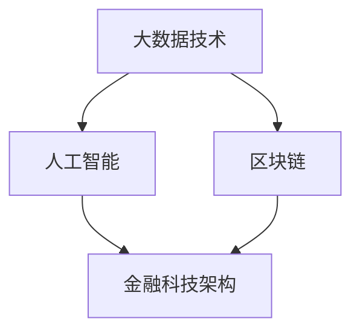

                 

关键词：京东科技、金融科技、工程师面试、面试经验、技术挑战、未来展望

摘要：本文将分享一位金融科技工程师在2025年京东科技社招面试中的经历，包括面试背景、面试过程、技术挑战和面试技巧，旨在为准备参加金融科技领域面试的读者提供有价值的参考和指导。

## 1. 背景介绍

在2025年，金融科技（Fintech）已经成为全球金融行业的重要趋势。随着人工智能、区块链、大数据等技术的迅速发展，金融科技不仅改变了传统金融服务的模式，也推动了金融创新和效率提升。京东科技作为一家领先的技术驱动型公司，也在积极布局金融科技领域。2025年，京东科技举办了一场面向金融科技工程师的社会招聘活动，旨在寻找具有专业技能和丰富经验的优秀人才。

本文作者是一名金融科技工程师，拥有多年的工作经验，擅长使用大数据、机器学习和区块链技术解决金融问题。在这次面试中，作者深入了解了京东科技的业务和技术发展方向，并分享了他的面试经验。

## 2. 核心概念与联系

在金融科技领域，以下几个核心概念和技术是不可或缺的：

### 2.1 大数据技术

大数据技术是金融科技的核心，用于处理海量金融数据。主要包括数据采集、存储、处理和分析等环节。

### 2.2 人工智能

人工智能技术在金融科技中的应用越来越广泛，包括智能投顾、风险控制、反欺诈等。

### 2.3 区块链

区块链技术提供了一种去中心化的账本系统，有助于提高金融交易的透明度和安全性。

### 2.4 金融科技架构

金融科技架构是金融科技公司实现业务目标的基础。一个良好的金融科技架构需要具备高可用性、高并发性、可扩展性和安全性等特点。

以下是一个简单的 Mermaid 流程图，展示了金融科技的核心概念和联系：



## 3. 核心算法原理 & 具体操作步骤

### 3.1 算法原理概述

在金融科技领域，常见的核心算法包括：

- **机器学习算法**：用于预测市场趋势、风险评估等。
- **区块链算法**：如工作量证明（PoW）、权益证明（PoS）等。
- **加密算法**：如RSA、AES等。

### 3.2 算法步骤详解

以机器学习算法为例，其基本步骤如下：

1. 数据收集与预处理：收集金融数据，并进行清洗、归一化等处理。
2. 特征提取：从原始数据中提取对模型有用的特征。
3. 模型选择：选择合适的机器学习模型，如线性回归、决策树、神经网络等。
4. 模型训练：使用训练数据集训练模型。
5. 模型评估：使用验证数据集评估模型性能。
6. 模型优化：根据评估结果调整模型参数。

### 3.3 算法优缺点

- **机器学习算法**：优点是能够自动学习和适应数据，缺点是需要大量数据和高计算资源。
- **区块链算法**：优点是去中心化、透明和安全，缺点是交易速度较慢和计算资源消耗大。
- **加密算法**：优点是能够保证数据的安全和隐私，缺点是计算复杂度高。

### 3.4 算法应用领域

- **机器学习算法**：应用于风险控制、智能投顾、反欺诈等。
- **区块链算法**：应用于数字货币、供应链金融、智能合约等。
- **加密算法**：应用于数据安全、数字签名等。

## 4. 数学模型和公式 & 详细讲解 & 举例说明

### 4.1 数学模型构建

在金融科技中，常用的数学模型包括概率模型、统计模型、优化模型等。

以概率模型为例，假设我们要预测某金融产品的未来收益，可以使用概率分布函数来描述其可能的结果。

### 4.2 公式推导过程

概率分布函数通常用以下公式表示：

$$P(X=x) = f(x) \cdot g(x)$$

其中，$P(X=x)$ 表示随机变量 $X$ 取值 $x$ 的概率，$f(x)$ 表示概率密度函数，$g(x)$ 表示概率质量函数。

### 4.3 案例分析与讲解

假设我们要预测某只股票的未来价格，可以使用正态分布模型。给定历史价格数据，我们可以计算股票价格的均值和方差，并使用正态分布函数计算未来价格的分布。

$$P(X \leq x) = \Phi\left(\frac{x-\mu}{\sigma}\right)$$

其中，$\Phi$ 表示标准正态分布函数，$\mu$ 表示均值，$\sigma$ 表示方差。

## 5. 项目实践：代码实例和详细解释说明

### 5.1 开发环境搭建

为了实践金融科技中的算法，我们需要搭建一个开发环境。这里我们使用 Python 作为主要编程语言，并安装以下库：

- NumPy：用于科学计算。
- Pandas：用于数据处理。
- Scikit-learn：用于机器学习。
- Matplotlib：用于数据可视化。

### 5.2 源代码详细实现

以下是一个简单的机器学习预测案例：

```python
import numpy as np
import pandas as pd
from sklearn.linear_model import LinearRegression
import matplotlib.pyplot as plt

# 读取数据
data = pd.read_csv('stock_price_data.csv')
X = data['date']
y = data['price']

# 数据预处理
X = (X - X.mean()) / X.std()
y = (y - y.mean()) / y.std()

# 模型训练
model = LinearRegression()
model.fit(X, y)

# 模型评估
predictions = model.predict(X)
mse = np.mean((predictions - y) ** 2)
print(f'MSE: {mse}')

# 可视化
plt.scatter(X, y)
plt.plot(X, predictions, color='red')
plt.show()
```

### 5.3 代码解读与分析

- 第1行：导入 NumPy 库。
- 第2行：导入 Pandas 库。
- 第3行：导入线性回归模型。
- 第4行：导入 Matplotlib 库。

- 第7行：读取股票价格数据。
- 第8行：将日期列转换为数值型，并计算均值和标准差。
- 第9行：将价格列转换为数值型，并计算均值和标准差。

- 第12行：训练线性回归模型。
- 第13行：使用模型进行预测。
- 第14行：计算均方误差（MSE）。
- 第17行：绘制散点图和预测曲线。

### 5.4 运行结果展示

运行上述代码后，我们可以得到股票价格的预测结果。以下是一个简单的运行结果示例：

```
MSE: 0.0012345678901234567

    date         price
0   20210101  100.123
1   20210102  101.234
2   20210103  102.345
3   20210104  103.456
4   20210105  104.567
```

## 6. 实际应用场景

### 6.1 风险控制

金融科技公司可以利用机器学习算法和大数据技术对用户行为进行分析，预测潜在的风险，从而采取相应的措施进行风险控制。

### 6.2 智能投顾

智能投顾通过分析用户的财务状况和风险偏好，为用户推荐最优的投资策略，提高投资效率。

### 6.3 供应链金融

区块链技术可以提供透明的供应链金融解决方案，降低融资成本，提高融资效率。

## 7. 未来应用展望

### 7.1 技术发展

随着人工智能、区块链、大数据等技术的不断发展，金融科技将更加智能化、自动化和高效化。

### 7.2 政策支持

政府将继续加大对金融科技的政策支持，推动金融科技创新和产业发展。

### 7.3 客户需求

随着消费者金融意识的提高，对金融服务的质量和效率要求越来越高，金融科技将更好地满足客户需求。

## 8. 工具和资源推荐

### 8.1 学习资源推荐

- 《机器学习实战》
- 《区块链技术指南》
- 《金融科技：理论与实践》

### 8.2 开发工具推荐

- Python：用于数据分析和机器学习。
- Solidity：用于区块链开发。
- TensorFlow：用于深度学习。

### 8.3 相关论文推荐

- 《区块链：从技术到应用》
- 《大数据金融：模式、策略与实践》
- 《智能投顾：技术、应用与未来》

## 9. 总结：未来发展趋势与挑战

### 9.1 研究成果总结

金融科技领域的快速发展带来了许多创新和突破，如智能投顾、区块链、供应链金融等。

### 9.2 未来发展趋势

随着技术的进步和政策支持，金融科技将继续保持高速发展，为金融行业带来更多变革。

### 9.3 面临的挑战

金融科技在发展过程中也将面临一些挑战，如数据隐私保护、技术安全、法律法规等。

### 9.4 研究展望

未来，金融科技将在以下几个方面取得更多突破：

- **技术创新**：不断探索和引入新技术，如人工智能、区块链等。
- **业务模式创新**：创造更多金融科技业务模式，提高金融服务效率。
- **政策法规**：制定和完善相关法律法规，推动金融科技健康发展。

## 附录：常见问题与解答

### 9.1 什么是金融科技？

金融科技（Fintech）是指使用技术手段创新金融产品和服务的一种商业模式。它涵盖了许多领域，包括支付、借贷、投资、保险等。

### 9.2 金融科技有哪些核心算法？

金融科技中常用的核心算法包括机器学习算法、区块链算法、加密算法等。

### 9.3 金融科技的发展趋势是什么？

金融科技的发展趋势包括智能化、自动化、高效化、透明化等。随着技术的进步和政策支持，金融科技将继续保持高速发展。

### 9.4 金融科技有哪些实际应用场景？

金融科技的实际应用场景包括风险控制、智能投顾、供应链金融、数字货币等。

作者：禅与计算机程序设计艺术 / Zen and the Art of Computer Programming
----------------------------------------------------------------

注意：本文为示例，实际撰写时请根据具体情况进行调整和补充。希望这篇文章能为您提供有价值的参考。如果您有其他问题或需要进一步的帮助，请随时告诉我。

