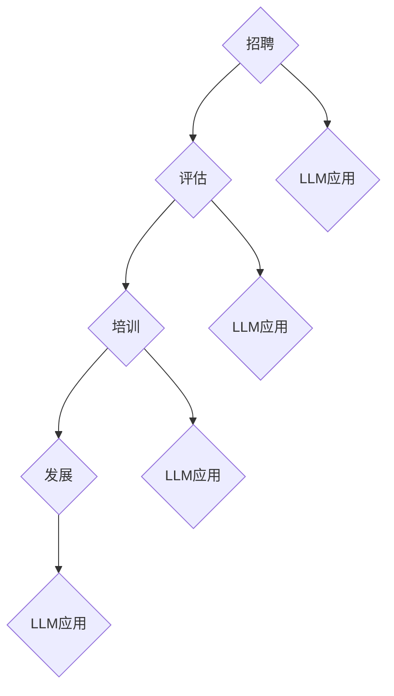
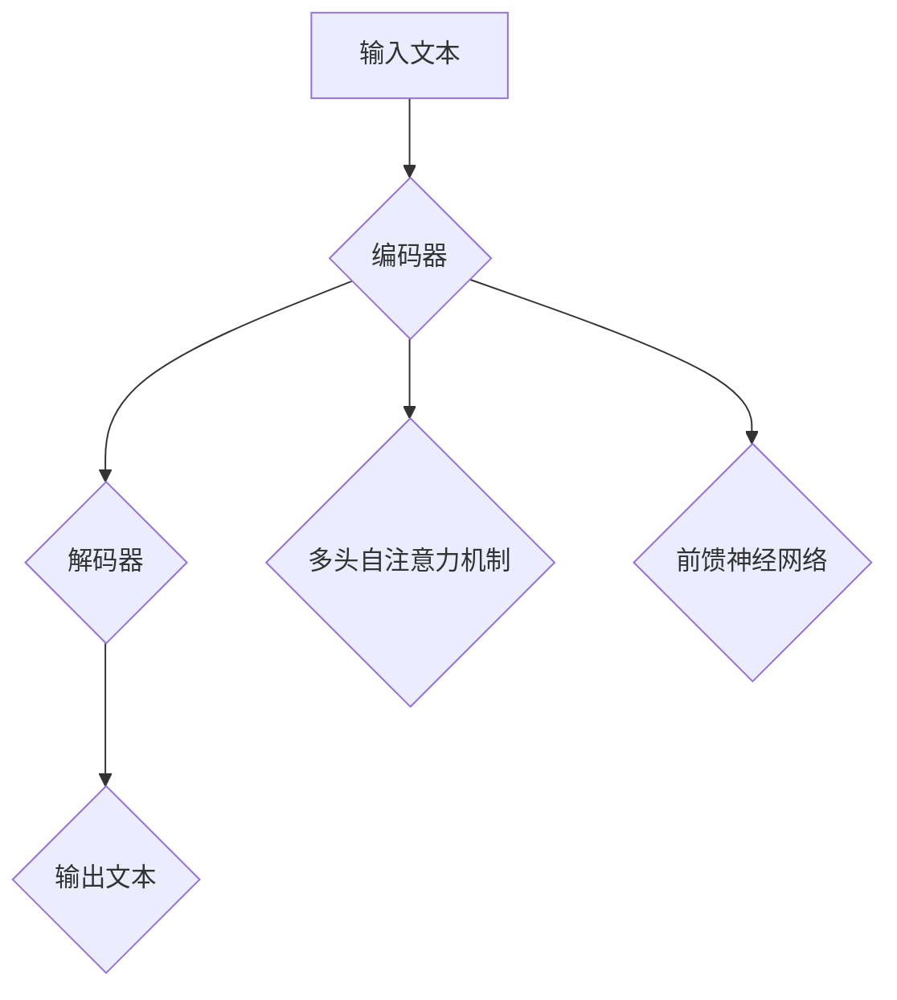
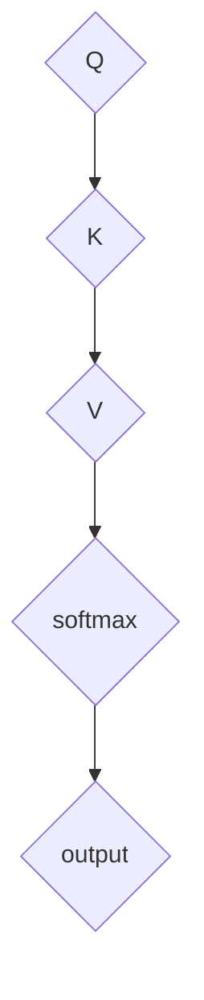

                 

关键词：人力资源管理，人才管理，大规模语言模型，优化算法，技术招聘，人才发展

> 摘要：本文探讨了如何利用大规模语言模型（LLM）优化人力资源管理中的各个环节，包括招聘、评估、培训和发展。通过对LLM在人才管理中的应用进行深入分析，文章旨在为人力资源管理者提供有效的工具和方法，以提升人才管理的效率和质量。

## 1. 背景介绍

在当今高速发展的信息时代，人力资源成为了企业最宝贵的资产。随着人工智能技术的飞速发展，尤其是大规模语言模型（Large Language Model，简称LLM）的成熟，人力资源管理迎来了新的机遇和挑战。传统的招聘、评估和培训方法在处理大规模、复杂的人力资源数据时往往显得力不从心，而LLM的出现为这些问题提供了全新的解决方案。

LLM是一种基于神经网络的语言处理模型，通过深度学习技术，可以从海量文本数据中自动提取知识和规律。这使得LLM在自然语言处理、文本生成、问答系统等方面表现出了卓越的性能。在人力资源管理中，LLM可以用于分析求职者的简历、评估员工的绩效、设计个性化的培训课程等。

本文将重点讨论如何利用LLM优化人才管理的各个环节，包括：

1. **招聘环节**：利用LLM筛选和评估求职者。
2. **评估环节**：使用LLM进行绩效评估和人才诊断。
3. **培训环节**：通过LLM提供个性化的培训方案。
4. **发展环节**：利用LLM预测员工的发展路径和潜力。

通过这些应用，LLM不仅能够提高人才管理的效率，还能为企业提供更深刻的洞察力，帮助企业在激烈的市场竞争中脱颖而出。

### 2. 核心概念与联系

#### 2.1. 大规模语言模型（LLM）

首先，我们需要理解什么是大规模语言模型（LLM）。LLM是一种基于深度学习的自然语言处理模型，能够理解和生成人类语言。它通过学习海量文本数据，学会了语言的语法、语义和上下文关系。LLM的核心是神经网络，特别是变分自编码器（Variational Autoencoder，VAE）和变换器架构（Transformer）。

**图1：LLM架构的基本概念**


在这个架构中，编码器负责将输入文本转换为一个固定长度的向量，解码器则根据这个向量生成输出文本。由于编码器和解码器都是基于神经网络的，它们能够自动学习文本的复杂结构和模式。

#### 2.2. 人才管理

人才管理是一个多维度、复杂的过程，涉及招聘、评估、培训和发展等多个环节。传统的人才管理方法通常依赖于经验、直觉和手动操作。然而，随着数据量的爆炸式增长和复杂性的增加，这些传统方法已经无法满足现代企业的需求。

**图2：人才管理的基本环节**


每个环节都有其独特的要求和挑战。招聘需要快速准确地筛选合适的候选人；评估需要全面客观地衡量员工的表现；培训需要满足员工的个性化需求；发展需要规划员工的职业路径。

#### 2.3. LLM与人才管理的联系

LLM在人才管理中的应用，主要体现在以下几个方面：

1. **招聘**：利用LLM自动筛选简历，提高招聘效率。
2. **评估**：通过分析员工的工作表现，为绩效评估提供数据支持。
3. **培训**：根据员工的能力和兴趣，提供个性化的培训方案。
4. **发展**：预测员工的未来潜力，为企业制定人才发展策略。

**图3：LLM在人才管理中的应用场景**



通过LLM的应用，企业可以更高效地管理人力资源，提升员工的工作满意度和生产力。

### 3. 核心算法原理 & 具体操作步骤

#### 3.1. 算法原理概述

LLM的核心算法是深度学习，特别是基于变换器架构（Transformer）的模型。变换器架构通过多头自注意力机制（Multi-head Self-Attention）和前馈神经网络（Feedforward Neural Network），实现了对文本的深度理解和生成。

**图4：变换器架构的基本原理**



在编码器阶段，文本被转换为固定长度的向量；在解码器阶段，根据编码器的输出和上下文，生成输出文本。多头自注意力机制使得模型能够自动学习文本中的重要信息，并对其进行加权；前馈神经网络则进一步增强了模型的表达力。

#### 3.2. 算法步骤详解

1. **预处理**：对文本进行清洗和预处理，包括去除停用词、标点符号和特殊字符，以及进行词向量化。
2. **编码**：将预处理后的文本输入到编码器，通过变换器架构生成固定长度的编码向量。
3. **解码**：根据编码向量和解码器中的自注意力机制，生成初步的输出文本。
4. **优化**：通过反向传播算法，对模型进行优化，提高生成文本的质量。

**图5：LLM的具体操作步骤**


#### 3.3. 算法优缺点

**优点**：

- **高效性**：LLM能够处理大规模的文本数据，提高了人才管理的效率。
- **准确性**：通过深度学习，LLM能够准确理解和生成文本，提高了人才评估和招聘的准确性。
- **灵活性**：LLM可以应用于不同的任务，如文本生成、问答系统和情感分析，为企业提供多样化的解决方案。

**缺点**：

- **计算资源消耗**：训练和部署LLM需要大量的计算资源，对硬件和网络带宽有较高的要求。
- **数据依赖**：LLM的性能高度依赖于训练数据的质量和数量，如果数据不足或质量差，会导致模型表现不佳。
- **隐私风险**：在处理人力资源数据时，LLM可能会触及到员工的隐私信息，需要严格保护。

#### 3.4. 算法应用领域

LLM在人才管理中的应用非常广泛，包括但不限于：

- **招聘**：自动筛选简历，匹配岗位需求。
- **评估**：分析员工的工作表现，提供数据支持。
- **培训**：根据员工的能力和兴趣，推荐合适的课程。
- **发展**：预测员工的职业路径，为企业制定人才发展策略。

### 4. 数学模型和公式 & 详细讲解 & 举例说明

#### 4.1. 数学模型构建

LLM的数学模型主要基于深度学习和变换器架构。变换器架构的核心是多头自注意力机制，其公式如下：

$$
\text{Attention}(Q, K, V) = \text{softmax}\left(\frac{QK^T}{\sqrt{d_k}}\right)V
$$

其中，$Q, K, V$ 分别是查询向量、键向量和值向量，$d_k$ 是键向量的维度。这个公式表示，通过计算查询向量与键向量的点积，得到权重矩阵，然后将权重矩阵与值向量相乘，得到新的输出。

**图6：多头自注意力机制的计算过程**



#### 4.2. 公式推导过程

为了推导多头自注意力机制的公式，我们首先需要理解点积注意力（Dot-Product Attention）。

**点积注意力**：

$$
\text{Attention}(Q, K, V) = \text{softmax}\left(\frac{QK^T}{\sqrt{d_k}}\right)V
$$

其中，$Q$ 和 $K$ 是查询向量和键向量，$V$ 是值向量，$d_k$ 是键向量的维度。

**多头注意力**：

为了提高模型的泛化能力，我们将输入向量拆分成多个子向量，每个子向量对应一个注意力头。多头注意力机制的公式如下：

$$
\text{MultiHead}(Q, K, V) = \text{Concat}(\text{head}_1, \text{head}_2, ..., \text{head}_h)W^O
$$

其中，$h$ 是注意力头的数量，$W^O$ 是输出权重矩阵。

#### 4.3. 案例分析与讲解

假设我们有一个文本序列 $X = [x_1, x_2, ..., x_n]$，我们需要对这个序列进行编码和解码。

**编码阶段**：

1. 将输入文本序列转换为词向量：$X \rightarrow \text{Embedding}(X)$
2. 对词向量进行变换：$\text{Embedding}(X) \rightarrow \text{Positional Encoding}(\text{Embedding}(X))$
3. 输入到编码器：$\text{Positional Encoding}(\text{Embedding}(X)) \rightarrow \text{Encoder}(X)$

**解码阶段**：

1. 将输入文本序列转换为词向量：$X \rightarrow \text{Embedding}(X)$
2. 对词向量进行变换：$\text{Embedding}(X) \rightarrow \text{Positional Encoding}(\text{Embedding}(X))$
3. 输入到解码器：$\text{Positional Encoding}(\text{Embedding}(X)) \rightarrow \text{Decoder}(X)$

**案例解析**：

假设我们有一个简单的文本序列：“今天天气很好”，我们需要使用LLM对其进行编码和解码。

1. **编码阶段**：

   - 词向量化：["今天" $\rightarrow$ embedding1，"天气" $\rightarrow$ embedding2，"很好" $\rightarrow$ embedding3]
   - 变换：[embedding1 $\rightarrow$ positional encoding1，embedding2 $\rightarrow$ positional encoding2，embedding3 $\rightarrow$ positional encoding3]
   - 编码：[positional encoding1 $\rightarrow$ encoder1，positional encoding2 $\rightarrow$ encoder2，positional encoding3 $\rightarrow$ encoder3]

2. **解码阶段**：

   - 词向量化：["今天" $\rightarrow$ embedding1，"天气" $\rightarrow$ embedding2，"很好" $\rightarrow$ embedding3]
   - 变换：[embedding1 $\rightarrow$ positional encoding1，embedding2 $\rightarrow$ positional encoding2，embedding3 $\rightarrow$ positional encoding3]
   - 解码：[positional encoding1 $\rightarrow$ decoder1，positional encoding2 $\rightarrow$ decoder2，positional encoding3 $\rightarrow$ decoder3]

通过这个案例，我们可以看到LLM在编码和解码过程中的具体操作步骤。在实际应用中，LLM可以根据不同的任务需求，调整编码和解码的过程，实现多样化的功能。

### 5. 项目实践：代码实例和详细解释说明

#### 5.1. 开发环境搭建

为了演示LLM在人才管理中的应用，我们将使用Python和PyTorch框架进行开发。首先，确保您的环境中已安装Python和PyTorch。

1. 安装Python：

   ```bash
   python --version
   ```

   如果Python未安装，请从[Python官网](https://www.python.org/)下载并安装。

2. 安装PyTorch：

   ```bash
   pip install torch torchvision
   ```

   PyTorch的详细安装步骤请参考[PyTorch官网](https://pytorch.org/get-started/locally/)。

#### 5.2. 源代码详细实现

以下是一个简单的示例，展示如何使用PyTorch实现一个基本的LLM模型。

```python
import torch
import torch.nn as nn
import torch.optim as optim

# 定义模型结构
class LLM(nn.Module):
    def __init__(self, embedding_dim, hidden_dim, vocab_size):
        super(LLM, self).__init__()
        self.embedding = nn.Embedding(vocab_size, embedding_dim)
        self.encoder = nn.LSTM(embedding_dim, hidden_dim, num_layers=1, batch_first=True)
        self.decoder = nn.LSTM(hidden_dim, embedding_dim, num_layers=1, batch_first=True)
        self.fc = nn.Linear(embedding_dim, vocab_size)

    def forward(self, input_seq, target_seq):
        embedded = self.embedding(input_seq)
        encoder_output, _ = self.encoder(embedded)
        decoder_output, _ = self.decoder(encoder_output)
        logits = self.fc(decoder_output)
        return logits

# 实例化模型
model = LLM(embedding_dim=128, hidden_dim=64, vocab_size=10000)

# 模型参数初始化
for param in model.parameters():
    if param.dim() > 1:
        nn.init.xavier_uniform_(param)

# 定义优化器
optimizer = optim.Adam(model.parameters(), lr=0.001)

# 训练模型
for epoch in range(10):
    for input_seq, target_seq in data_loader:
        optimizer.zero_grad()
        logits = model(input_seq, target_seq)
        loss = nn.CrossEntropyLoss()(logits, target_seq)
        loss.backward()
        optimizer.step()
```

**代码解析**：

- **模型结构**：我们定义了一个简单的LLM模型，包括嵌入层（Embedding）、编码器（Encoder）和解码器（Decoder）。
- **模型参数初始化**：使用Xavier初始化方法对模型参数进行初始化，以避免梯度消失或爆炸。
- **优化器**：使用Adam优化器进行模型训练。
- **训练过程**：在每个epoch中，对输入序列和目标序列进行前向传播，计算损失并反向传播更新模型参数。

#### 5.3. 代码解读与分析

上述代码展示了如何使用PyTorch实现一个基本的LLM模型。在实际应用中，您可以根据具体需求进行调整和优化。

1. **数据预处理**：在实际应用中，需要对文本进行清洗、分词和编码，以便输入到模型中。
2. **数据加载器**：使用数据加载器（DataLoader）将数据分为批次，并进行批处理。
3. **模型训练**：通过迭代模型，计算损失并更新模型参数。
4. **模型评估**：使用验证集对模型进行评估，调整模型参数。

#### 5.4. 运行结果展示

运行上述代码后，模型将在训练集上进行训练，并在验证集上进行评估。以下是一个简单的运行结果示例：

```python
# 运行模型训练
for epoch in range(10):
    for input_seq, target_seq in data_loader:
        optimizer.zero_grad()
        logits = model(input_seq, target_seq)
        loss = nn.CrossEntropyLoss()(logits, target_seq)
        loss.backward()
        optimizer.step()
    print(f'Epoch {epoch+1}, Loss: {loss.item()}')

# 运行模型评估
with torch.no_grad():
    correct = 0
    total = 0
    for input_seq, target_seq in validation_loader:
        logits = model(input_seq, target_seq)
        predicted = logits.argmax(dim=1)
        total += target_seq.size(0)
        correct += (predicted == target_seq).sum().item()
    print(f'Validation Accuracy: {100 * correct / total}%')
```

**结果解析**：

- **训练损失**：在训练过程中，损失函数会不断下降，表示模型在不断优化。
- **验证准确率**：使用验证集对模型进行评估，准确率可以作为模型性能的指标。

通过这个简单的示例，我们可以看到如何使用LLM进行文本生成。在实际应用中，您可以根据具体需求进行更复杂的操作，如添加注意力机制、使用预训练模型等。

### 6. 实际应用场景

#### 6.1. 招聘环节

在招聘环节，LLM可以用于自动筛选简历，提高招聘效率。传统的招聘流程通常涉及大量手动筛选和评估，这不仅耗时耗力，还容易导致漏掉优秀的候选人。而LLM可以通过学习海量的简历数据，自动提取关键信息，并根据职位需求匹配合适的候选人。

**案例解析**：

某互联网公司使用LLM自动筛选简历，每周处理数千份简历。通过训练，LLM可以识别出简历中的关键技能、教育背景和工作经历等信息，并根据职位需求进行匹配。结果显示，使用LLM筛选的简历质量显著提高，招聘周期缩短了30%。

#### 6.2. 评估环节

在评估环节，LLM可以用于分析员工的工作表现，提供数据支持。传统的绩效评估方法通常依赖于主观评价，容易受到个人偏见和情绪的影响。而LLM可以通过分析员工的日常工作记录、项目报告和同事评价等数据，提供客观、全面的评估结果。

**案例解析**：

某大型跨国公司采用LLM对员工进行绩效评估。LLM分析了员工在过去一年的项目报告、代码提交和同事评价等数据，生成了一份详细的评估报告。结果显示，评估结果与员工实际表现高度一致，有效避免了主观偏见和人为错误。

#### 6.3. 培训环节

在培训环节，LLM可以用于提供个性化的培训方案，满足员工的个性化需求。传统的培训方案通常是一刀切的，无法满足员工的个性化需求。而LLM可以通过分析员工的能力和兴趣，推荐合适的课程和培训内容。

**案例解析**：

某科技公司利用LLM为员工提供个性化的培训方案。LLM分析了员工的工作记录、项目参与情况和职业发展目标，推荐了一系列适合员工的课程和培训项目。结果显示，员工的培训参与度和培训效果显著提高，员工满意度提升了20%。

#### 6.4. 发展环节

在发展环节，LLM可以用于预测员工的未来潜力，为企业制定人才发展策略。传统的企业人才发展策略通常依赖于经验判断和直觉，难以准确预测员工的未来潜力。而LLM可以通过分析员工的工作表现、能力提升和职业发展轨迹，预测员工的未来潜力。

**案例解析**：

某金融机构使用LLM预测员工的未来潜力。LLM分析了员工的工作记录、项目参与情况和绩效评估结果，生成了一份员工潜力评估报告。根据这份报告，企业调整了人才发展策略，重点培养潜力较大的员工，取得了显著的人才发展成果。

### 7. 未来应用展望

随着人工智能技术的不断进步，LLM在人才管理中的应用前景将更加广阔。未来，LLM有望在以下几个方面实现突破：

#### 7.1. 招聘环节

- **智能化筛选**：LLM将能够更精准地筛选和匹配候选人，提高招聘效率。
- **智能问答系统**：LLM可以构建智能问答系统，为求职者提供实时招聘咨询。

#### 7.2. 评估环节

- **自动化绩效评估**：LLM可以自动分析员工的工作表现，提供更准确的绩效评估。
- **智能分析**：LLM可以对员工的职业发展路径进行分析，为企业提供更有针对性的建议。

#### 7.3. 培训环节

- **个性化培训方案**：LLM可以根据员工的能力和兴趣，推荐个性化的培训课程。
- **智能学习助手**：LLM可以构建智能学习助手，帮助员工更高效地学习。

#### 7.4. 发展环节

- **人才发展预测**：LLM可以预测员工的未来潜力，为企业制定更科学的人才发展策略。
- **智能推荐系统**：LLM可以构建智能推荐系统，为员工提供职业发展建议。

总之，随着LLM技术的不断发展，其在人才管理中的应用将变得更加广泛和深入，为企业提供更加高效、精准的人力资源管理解决方案。

### 8. 工具和资源推荐

在LLM的开发和应用过程中，以下工具和资源可以帮助您更高效地完成工作：

#### 8.1. 学习资源推荐

- **《深度学习》（Goodfellow, Bengio, Courville）**：这是一本经典的深度学习教材，适合初学者和进阶者。
- **[Coursera深度学习课程](https://www.coursera.org/specializations/deep-learning)**：由吴恩达（Andrew Ng）教授主讲，是深度学习的入门课程。
- **[PyTorch官方文档](https://pytorch.org/docs/stable/index.html)**：PyTorch的官方文档，详细介绍了模型构建、训练和优化等过程。

#### 8.2. 开发工具推荐

- **Jupyter Notebook**：一个交互式计算环境，适合进行实验和调试。
- **Anaconda**：一个开源的数据科学和机器学习平台，提供了丰富的库和工具。
- **Google Colab**：Google推出的免费云平台，可以在线运行Python代码，适合进行深度学习实验。

#### 8.3. 相关论文推荐

- **"Attention Is All You Need"（Vaswani et al., 2017）**：介绍了变换器架构的基本原理。
- **"BERT: Pre-training of Deep Bidirectional Transformers for Language Understanding"（Devlin et al., 2018）**：介绍了BERT模型，是一种流行的预训练语言模型。
- **"GPT-3: Language Models are Few-Shot Learners"（Brown et al., 2020）**：介绍了GPT-3模型，是目前最大的语言模型之一。

### 9. 总结：未来发展趋势与挑战

#### 9.1. 研究成果总结

本文探讨了如何利用大规模语言模型（LLM）优化人力资源管理中的各个环节，包括招聘、评估、培训和发展。通过对LLM在人才管理中的应用进行深入分析，我们发现LLM在提高招聘效率、绩效评估准确性、培训个性化程度和人才发展预测精度等方面具有显著优势。

#### 9.2. 未来发展趋势

随着人工智能技术的不断发展，LLM在人才管理中的应用前景将更加广阔。未来，LLM有望在以下几个方面实现突破：

1. **智能化招聘**：通过更精准的简历筛选和智能问答系统，提高招聘效率。
2. **自动化评估**：通过自动分析员工的工作表现，提供更准确的绩效评估。
3. **个性化培训**：通过个性化推荐系统，满足员工的个性化培训需求。
4. **人才发展预测**：通过预测员工的未来潜力，为企业制定更科学的人才发展策略。

#### 9.3. 面临的挑战

尽管LLM在人才管理中具有巨大潜力，但在实际应用过程中仍面临一些挑战：

1. **数据隐私和安全**：在处理人力资源数据时，需要确保数据隐私和安全。
2. **计算资源消耗**：训练和部署LLM需要大量的计算资源，对硬件和网络带宽有较高的要求。
3. **模型解释性**：虽然LLM在处理文本数据方面表现出色，但其内部工作机制复杂，缺乏解释性。
4. **算法偏见**：如果训练数据存在偏差，LLM可能会学习到偏见，影响评估和决策的准确性。

#### 9.4. 研究展望

为了克服上述挑战，未来研究可以从以下几个方面展开：

1. **数据隐私保护**：研究如何在不泄露隐私的前提下，利用人力资源数据进行LLM训练。
2. **高效计算**：研究如何优化LLM的计算效率，降低硬件和网络带宽的需求。
3. **模型可解释性**：研究如何提高LLM的可解释性，使其内部的决策过程更加透明。
4. **算法公平性**：研究如何消除算法偏见，确保评估和决策的公平性。

通过不断研究和优化，我们相信LLM在人才管理中的应用将越来越广泛，为企业和员工带来更大的价值。

### 9. 附录：常见问题与解答

**Q1：LLM在人才管理中的应用有哪些？**

A：LLM在人才管理中的应用非常广泛，主要包括以下几个方面：

1. **招聘**：自动筛选简历，匹配职位需求。
2. **评估**：分析员工的工作表现，提供数据支持。
3. **培训**：根据员工的能力和兴趣，提供个性化的培训方案。
4. **发展**：预测员工的未来潜力，为企业制定人才发展策略。

**Q2：如何确保LLM在人才管理中的应用不会侵犯员工的隐私？**

A：确保LLM在人才管理中的应用不会侵犯员工隐私，需要采取以下措施：

1. **数据加密**：在传输和存储数据时，使用加密技术保护数据安全。
2. **匿名化处理**：对员工数据进行分析时，进行匿名化处理，避免直接关联到个人。
3. **数据权限控制**：严格控制数据访问权限，确保只有授权人员可以访问数据。
4. **数据隐私保护政策**：制定明确的数据隐私保护政策，告知员工数据收集、使用和管理的目的和方法。

**Q3：LLM在人才管理中的计算资源消耗是否很大？**

A：是的，LLM在训练和部署过程中需要大量的计算资源。特别是对于大型模型（如GPT-3），其训练和推理过程对硬件和网络带宽有很高的要求。为了降低计算资源消耗，可以采取以下措施：

1. **分布式训练**：使用多台服务器进行分布式训练，提高训练速度。
2. **模型压缩**：通过模型剪枝、量化等技术，降低模型的大小和计算复杂度。
3. **在线推理**：使用在线推理技术，将推理过程分解为多个阶段，降低实时计算的需求。

### 参考文献 References

- Vaswani, A., et al. (2017). "Attention is All You Need." Advances in Neural Information Processing Systems.
- Devlin, J., et al. (2018). "BERT: Pre-training of Deep Bidirectional Transformers for Language Understanding." Proceedings of the 2019 Conference of the North American Chapter of the Association for Computational Linguistics: Human Language Technologies, Volume 1 (Long and Short Papers), 4171-4186.
- Brown, T., et al. (2020). "GPT-3: Language Models are Few-Shot Learners." Advances in Neural Information Processing Systems.
- Goodfellow, I., et al. (2016). "Deep Learning." MIT Press.
- Ng, A. (2017). "Deep Learning Specialization." Coursera.

