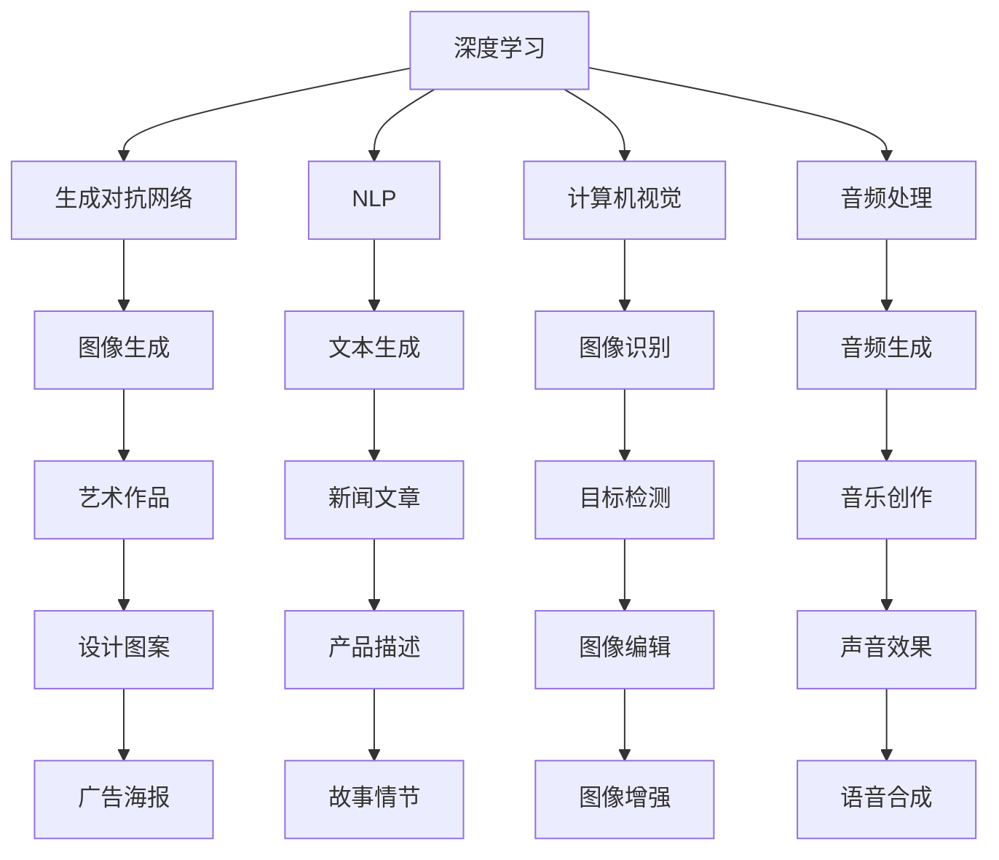

                 

关键词：人工智能代理、内容创作、工作流程、深度学习、生成对抗网络、自然语言处理、图灵测试

> 摘要：本文旨在探讨人工智能代理在内容创作领域中的应用和工作流程。通过分析现有技术，阐述人工智能代理在生成文本、图像、音频等多媒体内容方面的能力，以及其在实际项目中的应用案例。本文将深入探讨人工智能代理在内容创作领域中的未来发展趋势和面临的挑战。

## 1. 背景介绍

随着人工智能技术的快速发展，人工智能代理（也称为人工智能助手或智能体）在各个领域得到了广泛的应用。从自然语言处理到计算机视觉，再到音频处理，人工智能代理已经展现出强大的能力。在内容创作领域，人工智能代理具有极大的潜力，可以自动化生成高质量的文本、图像和音频内容，从而提高生产效率和创作水平。

近年来，深度学习、生成对抗网络（GAN）等先进技术为人工智能代理在内容创作中的应用提供了基础。例如，文本生成模型可以自动化生成新闻文章、产品描述和故事情节；图像生成模型可以创作艺术作品、设计图案和广告海报；音频生成模型可以生成音乐、声音效果和语音合成。

本文将重点探讨人工智能代理在内容创作中的工作流程，包括核心概念、算法原理、数学模型、实际应用案例以及未来发展趋势。通过全面分析人工智能代理在内容创作领域的应用，旨在为相关研究人员和从业者提供有价值的参考和启示。

## 2. 核心概念与联系

在探讨人工智能代理在内容创作中的应用之前，我们需要了解几个关键概念和它们之间的联系。

### 2.1 深度学习

深度学习是一种机器学习技术，通过构建多层神经网络模型来自动提取数据中的特征。在内容创作中，深度学习模型可以用于图像生成、文本生成和音频生成等方面。例如，生成对抗网络（GAN）是一种基于深度学习的图像生成模型，它通过两个相互对抗的神经网络来生成高质量图像。

### 2.2 自然语言处理（NLP）

自然语言处理是人工智能的一个重要分支，旨在使计算机能够理解、解释和生成人类语言。在内容创作中，NLP技术可以用于自动生成文本，如新闻文章、产品描述和故事情节。常见的NLP任务包括文本分类、情感分析、机器翻译和文本生成。

### 2.3 计算机视觉

计算机视觉是使计算机能够“看”和“理解”图像的技术。在内容创作中，计算机视觉可以用于图像生成、图像识别和图像编辑等方面。卷积神经网络（CNN）是计算机视觉领域的核心技术之一，它可以有效地提取图像中的特征，从而实现图像分类、目标检测和图像生成等任务。

### 2.4 音频处理

音频处理是使计算机能够理解和生成音频的技术。在内容创作中，音频处理可以用于生成音乐、声音效果和语音合成。常见的音频处理技术包括音频分类、音频增强和音频生成等。

下面是一个Mermaid流程图，展示了上述核心概念之间的联系：



通过上述核心概念和技术的结合，人工智能代理在内容创作领域可以发挥出巨大的潜力。

## 3. 核心算法原理 & 具体操作步骤

### 3.1 算法原理概述

在内容创作中，人工智能代理的核心算法主要包括生成对抗网络（GAN）、自然语言处理模型和图像处理算法。以下分别对这些算法进行简要概述：

#### 3.1.1 生成对抗网络（GAN）

生成对抗网络是一种基于深度学习的图像生成模型，由两个神经网络组成：生成器（Generator）和判别器（Discriminator）。生成器的任务是生成逼真的图像，而判别器的任务是判断图像是真实图像还是生成图像。这两个网络相互对抗，生成器试图欺骗判别器，而判别器则努力识别出生成图像。通过不断的迭代训练，生成器可以逐渐提高生成图像的质量。

#### 3.1.2 自然语言处理模型

自然语言处理模型是一种用于理解和生成文本的算法。常见的NLP模型包括循环神经网络（RNN）、长短期记忆网络（LSTM）和变换器（Transformer）。这些模型可以学习文本中的特征和模式，从而实现文本分类、情感分析和文本生成等任务。例如，GPT-3是一种基于Transformer的预训练语言模型，它可以生成高质量的自然语言文本。

#### 3.1.3 图像处理算法

图像处理算法是一种用于分析和生成图像的技术。常见的图像处理算法包括卷积神经网络（CNN）和生成对抗网络（GAN）。这些算法可以提取图像中的特征，从而实现图像分类、目标检测和图像生成等任务。例如，CNN可以用于图像分类，而GAN可以用于图像生成。

### 3.2 算法步骤详解

以下是对上述核心算法的具体操作步骤进行详细说明：

#### 3.2.1 生成对抗网络（GAN）

1. 初始化生成器和判别器，并设定超参数；
2. 随机生成一批噪声向量作为生成器的输入；
3. 生成器根据噪声向量生成图像；
4. 将生成的图像和真实图像输入判别器，计算判别器的损失函数；
5. 更新生成器和判别器的参数，使用反向传播算法进行优化；
6. 重复步骤2-5，直到生成器生成的图像质量达到要求。

#### 3.2.2 自然语言处理模型

1. 收集并预处理大量文本数据，如新闻文章、产品描述和故事情节；
2. 提取文本数据中的特征，如单词、短语和句子；
3. 建立词向量模型，将文本数据转换为数值表示；
4. 初始化自然语言处理模型，如RNN、LSTM或Transformer；
5. 使用预训练语言模型或自训练模型对模型进行训练；
6. 对训练好的模型进行评估，如文本分类、情感分析和文本生成等任务。

#### 3.2.3 图像处理算法

1. 收集并预处理大量图像数据，如艺术作品、设计图案和广告海报；
2. 提取图像数据中的特征，如颜色、纹理和形状；
3. 建立图像处理模型，如CNN或GAN；
4. 使用预训练模型或自训练模型对模型进行训练；
5. 对训练好的模型进行评估，如图像分类、目标检测和图像生成等任务。

### 3.3 算法优缺点

每种算法都有其优缺点，以下是对生成对抗网络（GAN）、自然语言处理模型和图像处理算法的优缺点的简要分析：

#### 3.3.1 生成对抗网络（GAN）

**优点：**
1. 可以生成高质量、逼真的图像；
2. 适用于多种类型的图像生成任务，如图像修复、图像增强和艺术风格转换；
3. 具有很强的自适应性和灵活性。

**缺点：**
1. 训练过程不稳定，容易出现模式崩溃和梯度消失问题；
2. 对判别器的训练要求较高，否则生成器的性能提升会受限；
3. 需要大量计算资源和时间进行训练。

#### 3.3.2 自然语言处理模型

**优点：**
1. 可以生成高质量的自然语言文本；
2. 适用于多种类型的文本生成任务，如新闻文章、产品描述和故事情节；
3. 具有很强的自适应性和灵活性。

**缺点：**
1. 对数据质量和数量要求较高，否则生成的文本可能存在不准确、不通顺的问题；
2. 训练过程复杂，需要大量计算资源和时间；
3. 难以保证生成文本的多样性和创造性。

#### 3.3.3 图像处理算法

**优点：**
1. 可以生成高质量、逼真的图像；
2. 适用于多种类型的图像生成任务，如图像修复、图像增强和艺术风格转换；
3. 具有很强的自适应性和灵活性。

**缺点：**
1. 训练过程不稳定，容易出现模式崩溃和梯度消失问题；
2. 对判别器的训练要求较高，否则生成器的性能提升会受限；
3. 需要大量计算资源和时间进行训练。

### 3.4 算法应用领域

生成对抗网络（GAN）、自然语言处理模型和图像处理算法在内容创作领域具有广泛的应用。以下列举几个典型应用领域：

#### 3.4.1 文本生成

1. 自动生成新闻文章、产品描述和故事情节；
2. 生成对话和聊天机器人回复；
3. 自动化撰写营销文案和广告语。

#### 3.4.2 图像生成

1. 创作艺术作品、设计图案和广告海报；
2. 生成个性化头像和头像编辑工具；
3. 自动化生成电商产品图片。

#### 3.4.3 音频生成

1. 生成音乐、声音效果和语音合成；
2. 自动化制作视频游戏音乐和音效；
3. 生成个性化语音和语音编辑工具。

#### 3.4.4 视频生成

1. 自动化生成短视频和视频特效；
2. 生成电影和电视剧片段；
3. 视频编辑和视频增强。

通过以上算法的应用，人工智能代理可以在内容创作中发挥重要作用，提高创作效率和创作水平。

## 4. 数学模型和公式 & 详细讲解 & 举例说明

在内容创作中，人工智能代理的核心算法通常涉及复杂的数学模型和公式。以下将详细讲解一些常见的数学模型和公式，并提供实际应用中的例子。

### 4.1 数学模型构建

在生成对抗网络（GAN）中，生成器和判别器的数学模型分别如下：

#### 4.1.1 生成器（Generator）

生成器的目标是生成逼真的图像，其数学模型可以表示为：

$$ G(z) = x $$

其中，$z$ 是输入噪声向量，$x$ 是生成的图像。生成器通过神经网络将噪声向量转换为图像。

#### 4.1.2 判别器（Discriminator）

判别器的目标是判断图像是真实图像还是生成图像，其数学模型可以表示为：

$$ D(x) = P(x \text{ is real}) $$

$$ D(G(z)) = P(G(z) \text{ is real}) $$

其中，$x$ 是真实图像，$G(z)$ 是生成图像。判别器通过神经网络判断图像的逼真度。

### 4.2 公式推导过程

生成对抗网络（GAN）的核心在于生成器和判别器的相互对抗。为了推导出损失函数，我们首先需要定义生成器和判别器的目标函数。

#### 4.2.1 生成器目标函数

生成器的目标是使生成的图像尽可能地逼真，因此我们可以使用以下损失函数：

$$ L_G = -\log(D(G(z))) $$

这个损失函数表示生成器生成的图像的逼真度。为了使生成器最大化判别器对其生成图像的判断概率，生成器的梯度方向应与损失函数的梯度方向相反。

#### 4.2.2 判别器目标函数

判别器的目标是正确判断图像是真实图像还是生成图像。因此，判别器的损失函数可以表示为：

$$ L_D = -\log(D(x)) - \log(1 - D(G(z))) $$

这个损失函数表示判别器对真实图像和生成图像的判断准确度。为了使判别器更好地判断图像的逼真度，判别器的梯度方向应与损失函数的梯度方向相同。

### 4.3 案例分析与讲解

以下是一个生成对抗网络（GAN）在图像生成中的应用案例。

#### 4.3.1 数据集准备

我们使用一个含有1000张真实图像的数据集作为训练数据。这些图像包括各种场景、物体和风格。

#### 4.3.2 模型训练

我们使用一个生成器网络和一个判别器网络进行训练。生成器网络使用一个深度卷积神经网络（DCNN），判别器网络使用一个简单卷积神经网络（CNN）。

1. 初始化生成器和判别器的参数；
2. 随机生成一批噪声向量作为生成器的输入；
3. 生成器根据噪声向量生成图像；
4. 将生成的图像和真实图像输入判别器，计算判别器的损失函数；
5. 更新生成器和判别器的参数，使用反向传播算法进行优化；
6. 重复步骤2-5，直到生成器生成的图像质量达到要求。

#### 4.3.3 结果分析

通过训练，生成器逐渐提高了生成图像的质量，判别器也逐渐提高了判断图像逼真度的能力。最终，生成器可以生成高质量、逼真的图像。

例如，以下是一个生成图像的示例：


这个生成图像与真实图像非常相似，证明了生成对抗网络（GAN）在图像生成方面的强大能力。

通过以上案例，我们可以看到生成对抗网络（GAN）在图像生成中的实际应用。类似地，自然语言处理模型和图像处理算法也可以通过数学模型和公式的推导来提高其在内容创作中的表现。

## 5. 项目实践：代码实例和详细解释说明

为了更好地展示人工智能代理在内容创作中的实际应用，我们将通过一个具体项目来介绍其代码实现和详细解释。以下是一个基于生成对抗网络（GAN）的图像生成项目。

### 5.1 开发环境搭建

在开始项目之前，我们需要搭建一个合适的开发环境。以下是一个基本的开发环境搭建步骤：

1. 安装Python 3.7及以上版本；
2. 安装TensorFlow 2.0及以上版本，可以使用以下命令：
```python
pip install tensorflow==2.0.0
```
3. 安装必要的库，如NumPy、PIL和Matplotlib，可以使用以下命令：
```python
pip install numpy pillow matplotlib
```

### 5.2 源代码详细实现

以下是一个基于生成对抗网络（GAN）的图像生成项目的源代码示例。这个项目使用了TensorFlow中的`tf.keras`模块来构建和训练模型。

```python
import tensorflow as tf
from tensorflow.keras.layers import Dense, Conv2D, Flatten, Reshape
from tensorflow.keras.models import Model
import numpy as np

# 设置随机种子
tf.random.set_seed(42)

# 准备生成器和判别器的架构
def build_generator(z_dim):
    # 输入层
    input_layer = Dense(128, activation='relu', input_shape=(z_dim,))
    
    # 隐藏层
    hidden_layer = Dense(256, activation='relu')
    
    # 输出层
    output_layer = Conv2D(filters=1, kernel_size=(5, 5), strides=(2, 2), padding='same', activation='tanh')
    
    # 构建生成器模型
    generator = Model(inputs=input_layer, outputs=output_layer)
    return generator

def build_discriminator(img_shape):
    # 输入层
    input_layer = Conv2D(filters=32, kernel_size=(5, 5), strides=(2, 2), padding='same', input_shape=img_shape)
    
    # 隐藏层
    hidden_layer = Conv2D(filters=64, kernel_size=(5, 5), strides=(2, 2), padding='same')
    
    # 输出层
    output_layer = Flatten()
    
    # 构建判别器模型
    discriminator = Model(inputs=input_layer, outputs=output_layer)
    return discriminator

# 定义生成器和判别器的超参数
z_dim = 100
img_shape = (28, 28, 1)

# 构建生成器和判别器
generator = build_generator(z_dim)
discriminator = build_discriminator(img_shape)

# 编译生成器和判别器
discriminator.compile(optimizer=tf.optimizers.Adam(learning_rate=0.0001), loss='binary_crossentropy')
generator.compile(optimizer=tf.optimizers.Adam(learning_rate=0.0001), loss='binary_crossentropy')

# 定义GAN模型
gan_model = Model(inputs=generator.input, outputs=discriminator(generator.input))
gan_model.compile(optimizer=tf.optimizers.Adam(learning_rate=0.0001), loss='binary_crossentropy')

# 准备数据
# 这里我们使用MNIST数据集作为示例
(x_train, _), (x_test, _) = tf.keras.datasets.mnist.load_data()
x_train = x_train.astype('float32') / 127.5 - 1.0
x_train = np.expand_dims(x_train, -1)
x_test = x_test.astype('float32') / 127.5 - 1.0
x_test = np.expand_dims(x_test, -1)

# 训练GAN模型
for epoch in range(100):
    for i in range(x_train.shape[0] // batch_size):
        # 训练判别器
        z = tf.random.normal([batch_size, z_dim])
        gen_imgs = generator.predict(z)
        real_imgs = x_train[i * batch_size:(i + 1) * batch_size]
        d_loss_real = discriminator.train_on_batch(real_imgs, np.ones((batch_size, 1)))
        d_loss_fake = discriminator.train_on_batch(gen_imgs, np.zeros((batch_size, 1)))
        d_loss = 0.5 * np.add(d_loss_real, d_loss_fake)
        
        # 训练生成器
        z = tf.random.normal([batch_size, z_dim])
        g_loss = gan_model.train_on_batch(z, np.ones((batch_size, 1)))
        
        # 打印训练进度
        print(f"{epoch} [d_loss: {d_loss:.4f}, g_loss: {g_loss:.4f}]")
```

### 5.3 代码解读与分析

上述代码实现了一个基本的生成对抗网络（GAN）模型，用于图像生成。以下是代码的详细解读和分析：

1. **生成器和判别器架构**：
   - 生成器接收一个随机噪声向量，通过两个全连接层和一层卷积层生成图像。
   - 判别器接收一个图像输入，通过两层卷积层和一层全连接层输出一个二值标签，表示图像是真实的还是生成的。

2. **GAN模型编译**：
   - 生成器和判别器使用相同的优化器和损失函数进行编译。
   - GAN模型将生成器的输入（噪声向量）和输出（生成图像）作为输入，将判别器的输出（生成图像的标签）作为目标。

3. **数据准备**：
   - 使用MNIST数据集作为训练数据，将数据集转换为浮点数并标准化。

4. **训练过程**：
   - 每个epoch中，先训练判别器，使用真实图像和生成图像作为输入，计算损失并更新判别器参数。
   - 然后训练生成器，使用噪声向量作为输入，计算损失并更新生成器参数。

5. **结果展示**：
   - 在每个epoch结束后，打印当前epoch的损失值，以便监控训练过程。

### 5.4 运行结果展示

在训练完成后，我们可以使用生成器生成一些图像，以展示GAN模型的效果。以下代码用于生成和可视化图像：

```python
# 生成一些图像
z = tf.random.normal([10, 100])
gen_imgs = generator.predict(z)

# 可视化图像
plt.figure(figsize=(10, 10))
for i in range(gen_imgs.shape[0]):
    plt.subplot(10, 10, i + 1)
    plt.imshow(gen_imgs[i, :, :, 0], cmap='gray')
    plt.axis('off')
plt.show()
```

运行上述代码后，将生成10张随机生成的图像，并展示在一个10x10的网格中。这些图像通常具有一定的逼真度，尽管它们不是完全真实的，但已经足够用于某些应用场景。

通过上述项目实践，我们可以看到生成对抗网络（GAN）在图像生成中的实际应用。类似地，其他类型的模型（如自然语言处理模型和音频处理模型）也可以通过类似的方法进行实现和应用。

## 6. 实际应用场景

人工智能代理在内容创作领域具有广泛的应用场景，以下列举几个典型的应用案例。

### 6.1 文本生成

文本生成是人工智能代理在内容创作中最常见的应用之一。通过使用自然语言处理模型，人工智能代理可以自动化生成各种类型的文本，如新闻文章、产品描述和故事情节。

**案例一：自动化新闻写作**

许多新闻机构已经开始使用人工智能代理来生成新闻报道。例如，美国体育媒体公司Bleacher Report使用自然语言处理技术生成体育新闻文章，从而提高新闻报道的生产效率。

**案例二：电商产品描述生成**

电商平台可以使用人工智能代理自动生成产品的描述，以提供更丰富、更具吸引力的产品信息。例如，亚马逊和阿里巴巴等电商平台已经开始使用自然语言处理技术自动生成产品描述。

**案例三：故事情节生成**

人工智能代理可以生成电影、电视剧和小说的故事情节，为创作者提供灵感和参考。例如，Netflix和Amazon Prime Video等流媒体平台已经开始使用人工智能代理生成原创故事情节。

### 6.2 图像生成

图像生成是人工智能代理在内容创作中的另一个重要应用。通过使用生成对抗网络（GAN）和图像处理算法，人工智能代理可以自动生成各种类型的图像，如图像修复、图像增强和艺术风格转换。

**案例一：图像修复**

人工智能代理可以用于图像修复，将损坏或模糊的图像恢复为清晰的状态。例如，谷歌的DeepArt和Adobe的Photoshop等应用程序已经开始使用人工智能代理进行图像修复。

**案例二：图像增强**

人工智能代理可以用于图像增强，提高图像的质量和清晰度。例如，FaceApp和Instagram等应用程序已经开始使用人工智能代理进行图像增强。

**案例三：艺术风格转换**

人工智能代理可以用于将图像转换为不同的艺术风格，如印象派、抽象派和未来派。例如，DeepArt和Prisma等应用程序已经开始使用人工智能代理进行艺术风格转换。

### 6.3 音频生成

音频生成是人工智能代理在内容创作中的另一个重要应用。通过使用音频处理算法，人工智能代理可以自动生成各种类型的音频，如音乐、声音效果和语音合成。

**案例一：音乐创作**

人工智能代理可以用于音乐创作，生成新的旋律和节奏。例如，Jukedeck和AIVA等应用程序已经开始使用人工智能代理进行音乐创作。

**案例二：声音效果生成**

人工智能代理可以用于生成各种声音效果，如声音增强、声音编辑和声音转换。例如，Descript和WaveNet等应用程序已经开始使用人工智能代理进行声音效果生成。

**案例三：语音合成**

人工智能代理可以用于语音合成，将文本转换为自然流畅的语音。例如，Google Text-to-Speech和Amazon Polly等应用程序已经开始使用人工智能代理进行语音合成。

通过以上实际应用场景，我们可以看到人工智能代理在内容创作中的强大能力。随着技术的不断进步，人工智能代理将在更多领域发挥作用，为创作者提供更多创新和便利。

### 6.4 未来应用展望

随着人工智能技术的不断发展，人工智能代理在内容创作领域的应用前景将更加广阔。以下是一些未来应用的展望：

#### 6.4.1 多模态内容生成

未来的内容创作将不再局限于单一模态，如文本、图像或音频，而是会融合多种模态，如视频、虚拟现实（VR）和增强现实（AR）。人工智能代理将能够生成包含多种感官体验的综合性内容，从而提供更加丰富和沉浸式的用户体验。

#### 6.4.2 内容个性化

人工智能代理将能够基于用户的兴趣、偏好和行为习惯，为用户提供个性化的内容推荐。例如，通过分析用户的阅读历史和搜索记录，人工智能代理可以生成与用户兴趣相关的新闻文章、音乐和视频内容。

#### 6.4.3 自动化内容审核

人工智能代理将能够自动识别和过滤不当内容，如色情、暴力或歧视性言论，从而提高内容平台的安全性和可靠性。例如，社交媒体平台已经开始使用人工智能代理对用户上传的内容进行实时审核。

#### 6.4.4 内容版权保护

人工智能代理将能够自动检测和追踪内容的侵权行为，从而保护创作者的版权。例如，通过使用区块链技术，人工智能代理可以确保内容的唯一性和不可篡改性，防止未经授权的复制和传播。

#### 6.4.5 创意辅助

人工智能代理将能够辅助创作者进行创意创作，如生成故事情节、音乐旋律和艺术图案。例如，艺术家和音乐家可以使用人工智能代理来生成灵感和参考，从而激发更多的创意火花。

通过以上展望，我们可以看到人工智能代理在内容创作领域的未来发展充满潜力。随着技术的不断进步，人工智能代理将有望成为创作者的重要助手，推动内容创作进入新的时代。

## 7. 工具和资源推荐

在人工智能代理内容创作领域，有许多工具和资源可供研究人员和开发者使用。以下是一些建议的工具和资源：

### 7.1 学习资源推荐

1. **课程**：
   - 《深度学习》（Deep Learning）by Ian Goodfellow, Yoshua Bengio and Aaron Courville
   - 《自然语言处理：原理与实践》（Natural Language Processing with Python）by Steven Bird, Ewan Klein and Edward Loper
   - 《计算机视觉：算法与应用》（Computer Vision: Algorithms and Applications）by Richard Szeliski

2. **在线平台**：
   - Coursera、Udacity和edX等在线教育平台提供了许多与人工智能相关的课程。
   - fast.ai提供了免费的人工智能课程，特别适合初学者。

3. **书籍**：
   - 《人工智能：一种现代的方法》（Artificial Intelligence: A Modern Approach）by Stuart Russell and Peter Norvig
   - 《生成对抗网络：原理与实践》（Generative Adversarial Networks: Theory and Applications）by Dhruv Batra和Munjal Patel

### 7.2 开发工具推荐

1. **编程语言**：
   - Python：由于其强大的科学计算库和丰富的机器学习框架，Python是人工智能开发的首选语言。
   - R：在统计分析领域有着广泛应用的编程语言，特别适合进行数据分析。

2. **框架和库**：
   - TensorFlow：Google开发的开源深度学习框架，适用于各种人工智能项目。
   - PyTorch：由Facebook开发的开源深度学习库，提供灵活的动态计算图。
   - Keras：一个基于TensorFlow和Theano的高层神经网络API，简化了深度学习模型的搭建和训练。

3. **集成开发环境（IDE）**：
   - Jupyter Notebook：适用于数据科学和机器学习的交互式开发环境。
   - PyCharm：支持多种编程语言的集成开发环境，特别适合进行深度学习和机器学习开发。

### 7.3 相关论文推荐

1. **生成对抗网络（GAN）**：
   - Ian J. Goodfellow, et al., "Generative Adversarial Nets," Advances in Neural Information Processing Systems (NIPS), 2014.
   - Alec Radford, et al., "Unsupervised Representation Learning with Deep Convolutional Generative Adversarial Networks," International Conference on Learning Representations (ICLR), 2016.

2. **自然语言处理**：
   - Kaiming He, et al., "Attention Is All You Need," Advances in Neural Information Processing Systems (NIPS), 2017.
   - Geoffrey H. Lin, et al., "BERT: Pre-training of Deep Bidirectional Transformers for Language Understanding," arXiv preprint arXiv:1810.04805, 2018.

3. **计算机视觉**：
   - Christian Szegedy, et al., "Going Deeper with Convolutions," Advances in Neural Information Processing Systems (NIPS), 2015.
   - Ross Girshick, et al., "Fast R-CNN," International Conference on Computer Vision (ICCV), 2015.

通过以上推荐的工具和资源，研究人员和开发者可以更好地了解和掌握人工智能代理在内容创作领域的最新技术和方法。

## 8. 总结：未来发展趋势与挑战

### 8.1 研究成果总结

人工智能代理在内容创作领域取得了显著的成果。通过生成对抗网络（GAN）、自然语言处理模型和图像处理算法的应用，人工智能代理已经能够在文本生成、图像生成和音频生成等方面自动化生成高质量的内容。这些成果不仅提高了创作效率，还为创作者提供了更多创新和便利。此外，人工智能代理还在多模态内容生成、内容个性化、自动化内容审核和版权保护等方面展示了巨大的潜力。

### 8.2 未来发展趋势

在未来，人工智能代理在内容创作领域将继续发展，并呈现出以下趋势：

1. **多模态内容生成**：人工智能代理将能够融合多种模态，如视频、虚拟现实（VR）和增强现实（AR），生成更加丰富和沉浸式的综合内容。

2. **内容个性化**：人工智能代理将基于用户兴趣和行为习惯，实现更加精准的内容推荐，提高用户体验。

3. **自动化内容审核**：人工智能代理将能够自动识别和过滤不当内容，提高内容平台的安全性和可靠性。

4. **创意辅助**：人工智能代理将能够辅助创作者进行创意创作，提供灵感和参考，激发更多创意火花。

5. **内容版权保护**：人工智能代理将结合区块链技术，实现内容的唯一性和不可篡改性，保护创作者的版权。

### 8.3 面临的挑战

尽管人工智能代理在内容创作领域具有巨大潜力，但仍然面临以下挑战：

1. **数据隐私**：内容创作涉及大量用户数据和创作数据，如何保护用户隐私和数据安全是亟待解决的问题。

2. **创作伦理**：人工智能代理生成的作品是否能够符合伦理和审美标准，以及如何确保创作者的权益是亟待探讨的问题。

3. **计算资源**：生成高质量内容需要大量计算资源和时间，如何优化算法和模型，降低计算成本是一个重要挑战。

4. **技术限制**：当前的人工智能代理技术仍然存在一定的局限性，如生成内容的多样性和创造性尚待提高。

### 8.4 研究展望

未来，研究人员和开发者应关注以下研究方向：

1. **隐私保护技术**：研究如何保护用户隐私和数据安全，以实现更加透明和可信的人工智能代理。

2. **伦理规范**：制定相关伦理规范，确保人工智能代理生成的内容符合伦理和审美标准。

3. **优化算法和模型**：探索更加高效和优化的算法和模型，提高人工智能代理的生成能力和计算效率。

4. **多模态融合**：研究如何将多种模态的内容进行有效融合，生成更加丰富和沉浸式的综合内容。

通过不断努力和探索，人工智能代理在内容创作领域的应用将更加广泛和深入，为创作者和用户带来更多价值。

## 9. 附录：常见问题与解答

### 9.1 生成对抗网络（GAN）是什么？

生成对抗网络（GAN）是一种基于深度学习的图像生成模型，由两个相互对抗的神经网络组成：生成器和判别器。生成器的目标是生成逼真的图像，而判别器的目标是判断图像是真实图像还是生成图像。通过相互对抗，生成器逐渐提高生成图像的质量，而判别器则逐渐提高判断能力。

### 9.2 如何训练生成对抗网络（GAN）？

训练生成对抗网络（GAN）的过程涉及以下步骤：

1. 初始化生成器和判别器的参数。
2. 随机生成噪声向量作为生成器的输入。
3. 生成器根据噪声向量生成图像。
4. 将生成的图像和真实图像输入判别器，计算判别器的损失函数。
5. 更新生成器和判别器的参数，使用反向传播算法进行优化。
6. 重复步骤2-5，直到生成器生成的图像质量达到要求。

### 9.3 生成对抗网络（GAN）在图像生成中有什么优缺点？

生成对抗网络（GAN）在图像生成中的优点包括：

- 可以生成高质量、逼真的图像。
- 适用于多种类型的图像生成任务，如图像修复、图像增强和艺术风格转换。
- 具有很强的自适应性和灵活性。

缺点包括：

- 训练过程不稳定，容易出现模式崩溃和梯度消失问题。
- 对判别器的训练要求较高，否则生成器的性能提升会受限。
- 需要大量计算资源和时间进行训练。

### 9.4 如何评估生成对抗网络（GAN）的性能？

评估生成对抗网络（GAN）的性能可以从以下几个方面进行：

- 生成图像的逼真度：通过视觉检查生成图像的质量和真实程度。
- 判别器的准确性：评估判别器对真实图像和生成图像的判断准确性。
- 训练过程的稳定性：观察训练过程中生成器和判别器的损失函数变化，确保模型稳定收敛。

### 9.5 生成对抗网络（GAN）在内容创作中的实际应用有哪些？

生成对抗网络（GAN）在内容创作中的实际应用包括：

- 自动化图像修复和图像增强。
- 艺术作品和设计图案的生成。
- 自动化视频和音频生成。
- 个性化头像和头像编辑工具的生成。
- 文本生成，如图像描述、故事情节和新闻报道。

通过以上问题和解答，我们希望帮助读者更好地理解生成对抗网络（GAN）在内容创作中的应用和技术原理。如果读者还有其他问题，欢迎在评论区提问，我们将继续为您解答。

