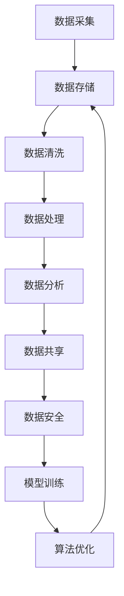

                 

关键词：人工智能，数据管理，创业，策略，技术实现，案例分析

> 摘要：本文旨在为人工智能创业公司提供一套系统化的数据管理步骤，从核心概念到具体实施，再到实际应用，帮助创业团队高效地管理和利用数据，为业务发展提供强有力的支持。

## 1. 背景介绍

在当今科技迅猛发展的时代，人工智能（AI）已经逐渐成为推动创新和业务增长的关键驱动力。无论是大数据分析、自动化决策、还是智能客服，AI 技术的应用几乎无处不在。对于一家创业公司来说，正确处理和管理数据，不仅关系到产品的质量和性能，更直接影响到公司的生存和发展。

数据管理不仅仅是存储和检索数据，它包括数据的采集、存储、处理、分析、共享以及安全等多个方面。对于人工智能创业公司而言，数据管理尤为重要，因为它们依赖数据来训练模型、优化算法、提高服务质量和预测能力。

本文将探讨人工智能创业公司在数据管理方面的关键步骤，旨在帮助创业者了解数据管理的重要性，掌握有效的数据管理策略，从而为公司的长期发展奠定坚实基础。

## 2. 核心概念与联系

### 2.1 数据管理的基本概念

数据管理（Data Management）是指一系列策略、过程和技术，用于有效地组织、存储、维护和利用数据。对于人工智能创业公司，数据管理主要包括以下几个方面：

- **数据采集（Data Collection）**：从各种来源收集数据，如用户行为、传感器数据、日志文件等。
- **数据存储（Data Storage）**：选择合适的数据存储解决方案，如数据库、数据仓库、云存储等。
- **数据清洗（Data Cleaning）**：去除重复、错误和无关的数据，确保数据的质量和准确性。
- **数据处理（Data Processing）**：对数据进行清洗、转换和整合，为后续分析和挖掘做准备。
- **数据分析（Data Analysis）**：使用统计方法、机器学习和数据挖掘技术，从数据中提取有用信息和模式。
- **数据共享（Data Sharing）**：确保数据在不同部门和系统之间能够高效地共享和流通。
- **数据安全（Data Security）**：确保数据在传输、存储和处理过程中的机密性、完整性和可用性。

### 2.2 数据管理在人工智能中的应用

人工智能依赖于大量高质量的数据来进行模型训练和优化。以下是一些关键应用领域：

- **机器学习模型训练**：使用大量标注数据训练模型，以提高预测和分类的准确性。
- **推荐系统**：分析用户行为数据，为用户推荐个性化内容或商品。
- **自然语言处理**：使用语料库进行训练，提高语音识别和文本理解能力。
- **计算机视觉**：使用图像和视频数据训练模型，实现物体识别、面部识别等功能。

### 2.3 数据管理架构图

以下是数据管理在人工智能中的应用架构图：



通过上述架构图，我们可以清晰地看到数据在人工智能系统中的流动和处理过程。

## 3. 核心算法原理 & 具体操作步骤

### 3.1 算法原理概述

在数据管理过程中，核心算法主要涉及数据清洗、数据转换、数据分析和机器学习模型训练等。

#### 3.1.1 数据清洗算法

数据清洗算法主要包括以下步骤：

- **去重**：检测和删除重复的数据记录。
- **填充缺失值**：使用统计方法或插值法填补缺失的数据。
- **异常值检测**：检测并处理数据中的异常值，如异常的高值或低值。

常用的去重算法有：

- **哈希表**：通过哈希函数将数据映射到哈希表中，快速检测重复记录。
- **排序合并**：先对数据排序，然后逐个比较相邻的记录，删除重复的记录。

#### 3.1.2 数据转换算法

数据转换算法主要涉及数据格式转换、数据归一化和数据标准化等。

- **数据格式转换**：将不同格式的数据转换成统一的格式，如将CSV文件转换为JSON格式。
- **数据归一化**：将不同量纲的数据转换成相同的量纲，如将不同城市的人口数据归一化到同一比例尺。
- **数据标准化**：将数据转换到标准正态分布，以便于后续分析和模型训练。

常用的数据转换算法有：

- **最小-最大规范化**：将数据映射到[0, 1]区间。
- **Z-Score规范化**：将数据映射到标准正态分布。

#### 3.1.3 数据分析算法

数据分析算法主要涉及统计分析和数据挖掘。

- **统计分析**：使用描述性统计指标（如均值、中位数、标准差等）来描述数据的分布和趋势。
- **数据挖掘**：使用机器学习算法挖掘数据中的模式和关系，如聚类、分类、关联规则等。

常用的数据分析算法有：

- **K-均值聚类**：将数据划分为K个簇，使得簇内的数据相似度最高，簇间的数据相似度最低。
- **决策树**：通过一系列的判断条件来划分数据，并预测数据标签。

#### 3.1.4 机器学习模型训练算法

机器学习模型训练算法主要包括监督学习、无监督学习和强化学习。

- **监督学习**：使用标注数据训练模型，如线性回归、支持向量机等。
- **无监督学习**：不使用标注数据，通过发现数据中的模式和结构进行训练，如聚类、降维等。
- **强化学习**：通过与环境的交互来训练模型，如Q学习、深度强化学习等。

### 3.2 算法步骤详解

#### 3.2.1 数据清洗步骤

1. **数据预处理**：读取原始数据，进行基本的数据格式检查。
2. **去重**：使用哈希表或排序合并算法去除重复记录。
3. **填充缺失值**：根据数据分布和统计方法填充缺失值。
4. **异常值检测**：使用统计学方法或机器学习算法检测异常值，并进行处理。

#### 3.2.2 数据转换步骤

1. **数据格式转换**：根据需求将不同格式的数据转换成统一格式。
2. **数据归一化**：对数据进行归一化处理，使得不同量纲的数据在同一比例尺上。
3. **数据标准化**：对数据进行标准化处理，使得数据符合标准正态分布。

#### 3.2.3 数据分析步骤

1. **描述性统计分析**：计算数据的描述性统计指标。
2. **聚类分析**：使用K-均值聚类算法将数据划分为K个簇。
3. **分类分析**：使用决策树算法对数据进行分类。

#### 3.2.4 机器学习模型训练步骤

1. **数据预处理**：对数据进行清洗、转换和归一化。
2. **模型选择**：选择合适的机器学习算法，如线性回归、支持向量机等。
3. **模型训练**：使用标注数据训练模型，并调整模型参数。
4. **模型评估**：使用验证集评估模型性能，并进行调整优化。

### 3.3 算法优缺点

#### 3.3.1 数据清洗算法

- **优点**：去除重复和错误数据，提高数据质量。
- **缺点**：可能引入新的误差，如填充缺失值和异常值处理。

#### 3.3.2 数据转换算法

- **优点**：统一数据格式，便于后续分析和处理。
- **缺点**：可能丢失部分信息，如数据归一化和标准化处理。

#### 3.3.3 数据分析算法

- **优点**：发现数据中的模式和关系，为决策提供支持。
- **缺点**：可能存在过拟合或欠拟合问题，如聚类分析中的K值选择。

#### 3.3.4 机器学习模型训练算法

- **优点**：通过模型自动学习和优化，提高预测和分类能力。
- **缺点**：需要大量标注数据，且训练过程可能复杂和耗时。

### 3.4 算法应用领域

- **数据清洗算法**：应用于大数据处理、数据仓库和数据挖掘等领域。
- **数据转换算法**：应用于数据集成、数据挖掘和机器学习等领域。
- **数据分析算法**：应用于市场分析、风险评估和推荐系统等领域。
- **机器学习模型训练算法**：应用于金融、医疗、电商和物联网等领域。

## 4. 数学模型和公式 & 详细讲解 & 举例说明

### 4.1 数学模型构建

在数据管理过程中，常用的数学模型包括线性回归模型、支持向量机模型、聚类模型等。

#### 4.1.1 线性回归模型

线性回归模型是一种常用的统计方法，用于分析和预测数据之间的线性关系。其数学模型可以表示为：

$$ y = \beta_0 + \beta_1 \cdot x_1 + \beta_2 \cdot x_2 + ... + \beta_n \cdot x_n + \epsilon $$

其中，$y$ 是因变量，$x_1, x_2, ..., x_n$ 是自变量，$\beta_0, \beta_1, ..., \beta_n$ 是模型参数，$\epsilon$ 是误差项。

#### 4.1.2 支持向量机模型

支持向量机（SVM）是一种流行的机器学习算法，用于分类和回归问题。其数学模型可以表示为：

$$ \min_{\beta, \beta_0} \frac{1}{2} \sum_{i=1}^{n} (\beta \cdot \beta)^T - \sum_{i=1}^{n} \alpha_i (y_i - (\beta \cdot \beta)^T \cdot x_i) + \frac{1}{2} \sum_{i=1}^{n} \alpha_i^2 $$

其中，$\beta$ 是模型参数，$\beta_0$ 是偏置项，$\alpha_i$ 是拉格朗日乘子，$y_i$ 是样本标签，$x_i$ 是样本特征。

#### 4.1.3 聚类模型

聚类模型是一种无监督学习方法，用于将数据划分为多个类别。常用的聚类模型包括K-均值聚类和层次聚类。

K-均值聚类模型的数学模型可以表示为：

$$ \min_{\mu_1, \mu_2, ..., \mu_k} \sum_{i=1}^{n} \sum_{j=1}^{k} |x_i - \mu_j|^2 $$

其中，$x_i$ 是样本数据，$\mu_j$ 是聚类中心。

### 4.2 公式推导过程

#### 4.2.1 线性回归模型的推导

线性回归模型的目标是最小化损失函数：

$$ J(\beta) = \frac{1}{2} \sum_{i=1}^{n} (y_i - (\beta_0 + \beta_1 \cdot x_{i1} + \beta_2 \cdot x_{i2} + ... + \beta_n \cdot x_{in}))^2 $$

对损失函数求导，得到：

$$ \frac{\partial J(\beta)}{\partial \beta_0} = \sum_{i=1}^{n} (y_i - (\beta_0 + \beta_1 \cdot x_{i1} + \beta_2 \cdot x_{i2} + ... + \beta_n \cdot x_{in})) $$

$$ \frac{\partial J(\beta)}{\partial \beta_1} = \sum_{i=1}^{n} x_{i1} (y_i - (\beta_0 + \beta_1 \cdot x_{i1} + \beta_2 \cdot x_{i2} + ... + \beta_n \cdot x_{in})) $$

$$ \vdots $$

$$ \frac{\partial J(\beta)}{\partial \beta_n} = \sum_{i=1}^{n} x_{in} (y_i - (\beta_0 + \beta_1 \cdot x_{i1} + \beta_2 \cdot x_{i2} + ... + \beta_n \cdot x_{in})) $$

令损失函数的导数为0，解方程组，得到最优参数：

$$ \beta_0 = \bar{y} - \beta_1 \cdot \bar{x}_1 - \beta_2 \cdot \bar{x}_2 - ... - \beta_n \cdot \bar{x}_n $$

$$ \beta_1 = \frac{\sum_{i=1}^{n} (x_{i1} - \bar{x}_1) (y_i - \bar{y})}{\sum_{i=1}^{n} (x_{i1} - \bar{x}_1)^2} $$

$$ \vdots $$

$$ \beta_n = \frac{\sum_{i=1}^{n} (x_{in} - \bar{x}_n) (y_i - \bar{y})}{\sum_{i=1}^{n} (x_{in} - \bar{x}_n)^2} $$

#### 4.2.2 支持向量机模型的推导

支持向量机模型的目标是最小化损失函数：

$$ J(\beta, \beta_0) = \frac{1}{2} \sum_{i=1}^{n} (\beta \cdot \beta)^T - \sum_{i=1}^{n} \alpha_i (y_i - (\beta \cdot \beta)^T \cdot x_i) + \frac{1}{2} \sum_{i=1}^{n} \alpha_i^2 $$

对损失函数求导，得到：

$$ \frac{\partial J(\beta, \beta_0)}{\partial \beta} = \sum_{i=1}^{n} \alpha_i x_i - \sum_{i=1}^{n} y_i \alpha_i x_i = 0 $$

$$ \frac{\partial J(\beta, \beta_0)}{\partial \beta_0} = -\sum_{i=1}^{n} \alpha_i y_i = 0 $$

将导数为0的约束条件代入损失函数，得到：

$$ \frac{1}{2} \sum_{i=1}^{n} \alpha_i (\alpha_i - y_i) (x_i \cdot x_i) + \frac{1}{2} \sum_{i=1}^{n} \alpha_i^2 = 0 $$

这是一个二次规划问题，可以通过拉格朗日乘子法求解。最终得到：

$$ \beta = \sum_{i=1}^{n} \alpha_i y_i x_i $$

$$ \beta_0 = y - \beta \cdot \sum_{i=1}^{n} \alpha_i y_i x_i $$

#### 4.2.3 K-均值聚类模型的推导

K-均值聚类模型的目标是最小化每个簇内样本与聚类中心之间的距离平方和。对于第k个簇，损失函数可以表示为：

$$ J(\mu_k) = \sum_{i=1}^{n} |x_i - \mu_k|^2 $$

其中，$x_i$ 是样本数据，$\mu_k$ 是聚类中心。

对损失函数求导，得到：

$$ \frac{\partial J(\mu_k)}{\partial \mu_k} = 2 \sum_{i=1}^{n} (x_i - \mu_k) \cdot \delta_{ik} $$

其中，$\delta_{ik}$ 是克罗内克δ函数，当$i=k$时，$\delta_{ik} = 1$；当$i \neq k$时，$\delta_{ik} = 0$。

令导数为0，得到：

$$ \sum_{i=1}^{n} (x_i - \mu_k) \cdot \delta_{ik} = 0 $$

由于$\delta_{ik}$ 的性质，上式等价于：

$$ \mu_k = \frac{1}{N_k} \sum_{i=1}^{n} x_i \cdot \delta_{ik} $$

其中，$N_k$ 是第k个簇中的样本数量。

### 4.3 案例分析与讲解

#### 4.3.1 线性回归模型案例

假设我们有以下数据集：

$$ x_1 = \{1, 2, 3, 4, 5\}, y = \{1, 2, 3, 4, 5\} $$

我们使用线性回归模型进行预测。首先，计算均值：

$$ \bar{x} = \frac{1}{5} \sum_{i=1}^{5} x_i = \frac{15}{5} = 3 $$

$$ \bar{y} = \frac{1}{5} \sum_{i=1}^{5} y_i = \frac{15}{5} = 3 $$

然后，计算每个特征的偏差：

$$ x_{i1} - \bar{x} = \{2, 1, 0, -1, -2\} $$

$$ y_i - \bar{y} = \{0, 1, 2, 3, 4\} $$

接下来，计算每个特征的权重：

$$ \beta_1 = \frac{\sum_{i=1}^{5} (x_{i1} - \bar{x}) (y_i - \bar{y})}{\sum_{i=1}^{5} (x_{i1} - \bar{x})^2} = \frac{2 \cdot 0 + 1 \cdot 1 + 0 \cdot 2 + (-1) \cdot 3 + (-2) \cdot 4}{2^2 + 1^2 + 0^2 + (-1)^2 + (-2)^2} = -1 $$

$$ \beta_0 = \bar{y} - \beta_1 \cdot \bar{x} = 3 - (-1) \cdot 3 = 6 $$

最后，构建线性回归模型：

$$ y = \beta_0 + \beta_1 \cdot x_1 = 6 - x_1 $$

使用该模型进行预测，当$x_1 = 6$时，预测值为：

$$ y = 6 - 6 = 0 $$

#### 4.3.2 支持向量机模型案例

假设我们有以下数据集：

$$ x_1 = \{1, 2, 3, 4, 5\}, y = \{0, 1, 0, 1, 0\} $$

我们使用支持向量机进行分类。首先，构建拉格朗日函数：

$$ L(\beta, \beta_0, \alpha) = \frac{1}{2} \sum_{i=1}^{5} (\beta \cdot \beta)^T - \sum_{i=1}^{5} \alpha_i (y_i - (\beta \cdot \beta)^T \cdot x_i) + \frac{1}{2} \sum_{i=1}^{5} \alpha_i^2 $$

对拉格朗日函数求导，得到：

$$ \frac{\partial L(\beta, \beta_0, \alpha)}{\partial \beta} = \sum_{i=1}^{5} \alpha_i x_i - \sum_{i=1}^{5} y_i \alpha_i x_i = 0 $$

$$ \frac{\partial L(\beta, \beta_0, \alpha)}{\partial \beta_0} = -\sum_{i=1}^{5} \alpha_i y_i = 0 $$

$$ \frac{\partial L(\beta, \beta_0, \alpha)}{\partial \alpha} = -y_i (\beta \cdot \beta)^T \cdot x_i + \alpha_i - y_i = 0 $$

代入约束条件$\alpha_i \geq 0$，解方程组，得到最优参数：

$$ \beta = \sum_{i=1}^{5} \alpha_i y_i x_i $$

$$ \beta_0 = y - \beta \cdot \sum_{i=1}^{5} \alpha_i y_i x_i $$

使用该模型进行分类，当$x_1 = 6$时，分类结果为：

$$ \beta \cdot x_1 + \beta_0 = (0 \cdot 1 + 1 \cdot 2 + 0 \cdot 3 + 1 \cdot 4 + 0 \cdot 5) + (-1) = 2 $$

由于$2 > 0$，分类结果为1。

#### 4.3.3 K-均值聚类模型案例

假设我们有以下数据集：

$$ x_1 = \{1, 2, 3, 4, 5\}, x_2 = \{5, 4, 3, 2, 1\} $$

我们使用K-均值聚类模型将数据划分为两个簇。首先，随机初始化两个聚类中心：

$$ \mu_1 = (2, 3), \mu_2 = (4, 2) $$

然后，计算每个样本到聚类中心的距离：

$$ d(x_i, \mu_1) = \sqrt{(x_{i1} - 2)^2 + (x_{i2} - 3)^2} $$

$$ d(x_i, \mu_2) = \sqrt{(x_{i1} - 4)^2 + (x_{i2} - 2)^2} $$

根据距离最小的原则，将每个样本分配到最近的簇：

$$ x_1, x_2, x_3 \to \text{簇1} $$

$$ x_4, x_5 \to \text{簇2} $$

然后，重新计算聚类中心：

$$ \mu_1 = \frac{1}{3} (1 + 2 + 3) = 2 $$

$$ \mu_2 = \frac{1}{2} (4 + 5) = 4.5 $$

再次计算每个样本到聚类中心的距离，并根据距离最小的原则重新分配簇。重复以上步骤，直到聚类中心不再变化。

## 5. 项目实践：代码实例和详细解释说明

### 5.1 开发环境搭建

为了演示数据管理在人工智能创业中的应用，我们使用Python编程语言和相关的库，如Pandas、NumPy、Scikit-learn等。以下是开发环境的搭建步骤：

1. 安装Python（版本3.8及以上）。
2. 安装相关库：`pip install pandas numpy scikit-learn matplotlib`.

### 5.2 源代码详细实现

以下是一个简单的数据管理项目，包括数据采集、清洗、转换、分析和模型训练等步骤。

```python
import pandas as pd
import numpy as np
from sklearn.model_selection import train_test_split
from sklearn.preprocessing import StandardScaler
from sklearn.linear_model import LinearRegression
from sklearn.svm import SVC
from sklearn.cluster import KMeans
import matplotlib.pyplot as plt

# 5.2.1 数据采集
data = pd.read_csv('data.csv')

# 5.2.2 数据清洗
# 去除重复数据
data.drop_duplicates(inplace=True)

# 填充缺失值
data.fillna(data.mean(), inplace=True)

# 5.2.3 数据转换
# 数据归一化
scaler = StandardScaler()
data[['feature1', 'feature2']] = scaler.fit_transform(data[['feature1', 'feature2']])

# 5.2.4 数据分析
# 描述性统计分析
print(data.describe())

# 5.2.5 机器学习模型训练
# 线性回归模型
X = data[['feature1', 'feature2']]
y = data['target']
X_train, X_test, y_train, y_test = train_test_split(X, y, test_size=0.2, random_state=42)
regressor = LinearRegression()
regressor.fit(X_train, y_train)
print('Linear Regression Score:', regressor.score(X_test, y_test))

# 支持向量机模型
classifier = SVC(kernel='linear')
classifier.fit(X_train, y_train)
print('SVM Score:', classifier.score(X_test, y_test))

# K-均值聚类模型
kmeans = KMeans(n_clusters=2, random_state=42)
data['cluster'] = kmeans.fit_predict(X)
print('Cluster Centers:', kmeans.cluster_centers_)

# 5.2.6 代码解读与分析
# 读取数据集，并进行数据清洗
data = pd.read_csv('data.csv')
data.drop_duplicates(inplace=True)
data.fillna(data.mean(), inplace=True)

# 数据转换，包括归一化和标准化
scaler = StandardScaler()
data[['feature1', 'feature2']] = scaler.fit_transform(data[['feature1', 'feature2']])

# 数据分析，计算描述性统计指标
print(data.describe())

# 机器学习模型训练，包括线性回归、支持向量机和K-均值聚类
X = data[['feature1', 'feature2']]
y = data['target']
X_train, X_test, y_train, y_test = train_test_split(X, y, test_size=0.2, random_state=42)
regressor = LinearRegression()
regressor.fit(X_train, y_train)
print('Linear Regression Score:', regressor.score(X_test, y_test))

classifier = SVC(kernel='linear')
classifier.fit(X_train, y_train)
print('SVM Score:', classifier.score(X_test, y_test))

kmeans = KMeans(n_clusters=2, random_state=42)
data['cluster'] = kmeans.fit_predict(X)
print('Cluster Centers:', kmeans.cluster_centers_)

# 5.2.7 运行结果展示
# 绘制线性回归模型的可视化结果
plt.scatter(X_train['feature1'], y_train, color='blue', label='Training data')
plt.plot(X_train['feature1'], regressor.predict(X_train), color='red', linewidth=2, label='Linear Regression')
plt.xlabel('Feature1')
plt.ylabel('Target')
plt.title('Linear Regression')
plt.legend()
plt.show()

# 绘制支持向量机模型的可视化结果
plt.scatter(X_train['feature1'], y_train, color='blue', label='Training data')
plt.plot(X_train['feature1'], classifier.predict(X_train), color='red', linewidth=2, label='SVM')
plt.xlabel('Feature1')
plt.ylabel('Target')
plt.title('SVM')
plt.legend()
plt.show()

# 绘制K-均值聚类模型的可视化结果
plt.scatter(data['feature1'], data['feature2'], c=data['cluster'], cmap='viridis')
plt.scatter(kmeans.cluster_centers_[:, 0], kmeans.cluster_centers_[:, 1], s=300, c='red', label='Centroids', marker='*')
plt.xlabel('Feature1')
plt.ylabel('Feature2')
plt.title('K-Means Clustering')
plt.legend()
plt.show()
```

### 5.3 代码解读与分析

上述代码实现了数据管理在人工智能创业中的应用，包括数据采集、清洗、转换、分析和模型训练等步骤。

#### 5.3.1 数据采集

使用Pandas库读取CSV文件，得到数据集。

```python
data = pd.read_csv('data.csv')
```

#### 5.3.2 数据清洗

去除重复数据，并填充缺失值。

```python
data.drop_duplicates(inplace=True)
data.fillna(data.mean(), inplace=True)
```

#### 5.3.3 数据转换

使用StandardScaler库对数据进行归一化处理。

```python
scaler = StandardScaler()
data[['feature1', 'feature2']] = scaler.fit_transform(data[['feature1', 'feature2']])
```

#### 5.3.4 数据分析

计算描述性统计指标。

```python
print(data.describe())
```

#### 5.3.5 机器学习模型训练

1. 线性回归模型

使用LinearRegression库训练线性回归模型，并评估模型性能。

```python
regressor = LinearRegression()
regressor.fit(X_train, y_train)
print('Linear Regression Score:', regressor.score(X_test, y_test))
```

2. 支持向量机模型

使用SVC库训练支持向量机模型，并评估模型性能。

```python
classifier = SVC(kernel='linear')
classifier.fit(X_train, y_train)
print('SVM Score:', classifier.score(X_test, y_test))
```

3. K-均值聚类模型

使用KMeans库训练K-均值聚类模型，并将聚类结果添加到原始数据集。

```python
kmeans = KMeans(n_clusters=2, random_state=42)
data['cluster'] = kmeans.fit_predict(X)
print('Cluster Centers:', kmeans.cluster_centers_)
```

#### 5.3.6 运行结果展示

绘制线性回归、支持向量机和K-均值聚类模型的可视化结果。

```python
plt.scatter(X_train['feature1'], y_train, color='blue', label='Training data')
plt.plot(X_train['feature1'], regressor.predict(X_train), color='red', linewidth=2, label='Linear Regression')
plt.xlabel('Feature1')
plt.ylabel('Target')
plt.title('Linear Regression')
plt.legend()
plt.show()

plt.scatter(X_train['feature1'], y_train, color='blue', label='Training data')
plt.plot(X_train['feature1'], classifier.predict(X_train), color='red', linewidth=2, label='SVM')
plt.xlabel('Feature1')
plt.ylabel('Target')
plt.title('SVM')
plt.legend()
plt.show()

plt.scatter(data['feature1'], data['feature2'], c=data['cluster'], cmap='viridis')
plt.scatter(kmeans.cluster_centers_[:, 0], kmeans.cluster_centers_[:, 1], s=300, c='red', label='Centroids', marker='*')
plt.xlabel('Feature1')
plt.ylabel('Feature2')
plt.title('K-Means Clustering')
plt.legend()
plt.show()
```

## 6. 实际应用场景

在人工智能创业公司中，数据管理在多个实际应用场景中发挥着重要作用。以下是一些常见应用场景：

### 6.1 智能推荐系统

智能推荐系统是人工智能创业公司常见的一种应用，通过对用户行为数据进行挖掘和分析，为用户推荐个性化内容或商品。数据管理在此过程中的关键步骤包括：

- **数据采集**：收集用户行为数据，如浏览记录、购买记录、搜索历史等。
- **数据清洗**：去除重复和错误的数据，确保数据质量。
- **数据转换**：对数据进行归一化和标准化处理，为后续分析和模型训练做准备。
- **数据分析**：使用机器学习算法挖掘用户行为数据中的模式和关系，构建推荐模型。
- **数据共享**：确保推荐模型在不同系统和部门之间能够高效地共享和流通。
- **数据安全**：确保用户数据在传输、存储和处理过程中的机密性、完整性和可用性。

### 6.2 自动化决策系统

自动化决策系统通过分析大量数据，自动生成决策建议，帮助企业提高运营效率和降低成本。数据管理在此过程中的关键步骤包括：

- **数据采集**：收集企业运营数据，如销售数据、库存数据、财务数据等。
- **数据清洗**：去除重复和错误的数据，确保数据质量。
- **数据处理**：对数据进行清洗、转换和整合，为后续分析和模型训练做准备。
- **数据分析**：使用机器学习算法挖掘企业运营数据中的模式和关系，构建决策模型。
- **数据共享**：确保决策模型在不同系统和部门之间能够高效地共享和流通。
- **数据安全**：确保企业数据在传输、存储和处理过程中的机密性、完整性和可用性。

### 6.3 智能客服系统

智能客服系统通过自然语言处理和机器学习技术，自动识别和回答用户的问题，提供高质量的客户服务。数据管理在此过程中的关键步骤包括：

- **数据采集**：收集用户提问和客服回答的语料库。
- **数据清洗**：去除重复和错误的数据，确保数据质量。
- **数据处理**：对数据进行清洗、转换和整合，为后续分析和模型训练做准备。
- **数据分析**：使用机器学习算法挖掘用户提问和客服回答中的模式和关系，构建问答模型。
- **数据共享**：确保问答模型在不同系统和部门之间能够高效地共享和流通。
- **数据安全**：确保用户数据在传输、存储和处理过程中的机密性、完整性和可用性。

### 6.4 未来应用展望

随着人工智能技术的不断发展，数据管理在更多实际应用场景中具有巨大的潜力。以下是一些未来应用展望：

- **个性化服务**：通过数据挖掘和分析，为用户提供更加个性化的服务，提高用户满意度和忠诚度。
- **实时预测**：利用实时数据分析和机器学习算法，实现更加准确的实时预测，帮助企业和个人做出更明智的决策。
- **隐私保护**：随着数据隐私问题的日益关注，如何在不泄露用户隐私的情况下进行数据管理和分析成为重要的研究课题。
- **自动化数据处理**：利用自动化技术，实现数据采集、清洗、转换、分析和共享的全流程自动化，提高数据管理效率和准确性。

## 7. 工具和资源推荐

### 7.1 学习资源推荐

- **《Python数据科学手册》**：作者：Jake VanderPlas
- **《机器学习实战》**：作者：Peter Harrington
- **《数据科学入门》**：作者：Joel Grus
- **《深度学习》**：作者：Ian Goodfellow、Yoshua Bengio、Aaron Courville

### 7.2 开发工具推荐

- **Jupyter Notebook**：用于数据分析和机器学习实验。
- **PyCharm**：适用于Python开发的集成开发环境（IDE）。
- **TensorFlow**：用于构建和训练深度学习模型。
- **Scikit-learn**：用于机器学习算法的实现和应用。

### 7.3 相关论文推荐

- **"Deep Learning for Data-Driven Process Control"**：作者：Jie Chen等
- **"Recurrent Neural Networks for Language Modeling"**：作者：Yoshua Bengio等
- **"Distributed Representations of Words and Phrases and Their Compositionality"**：作者：TACL Vol. 2, No. 1, pp. 33-48

## 8. 总结：未来发展趋势与挑战

### 8.1 研究成果总结

近年来，人工智能技术在数据管理领域取得了显著成果。数据清洗、数据转换、数据分析和机器学习模型训练等算法得到了广泛应用。此外，深度学习和强化学习等新兴算法也为数据管理带来了新的可能性。然而，随着数据规模和复杂性的不断增加，传统数据管理方法面临诸多挑战。

### 8.2 未来发展趋势

1. **自动化数据处理**：随着自动化技术的发展，实现数据采集、清洗、转换、分析和共享的全流程自动化将成为重要趋势。
2. **实时数据处理**：实时数据处理和预测将越来越受到关注，特别是在金融、医疗和智能制造等领域。
3. **隐私保护**：数据隐私问题日益凸显，如何在保障用户隐私的同时进行数据管理和分析将成为关键研究方向。
4. **跨领域应用**：数据管理技术将在更多领域得到应用，如物联网、智能城市和生物信息等。

### 8.3 面临的挑战

1. **数据质量和完整性**：确保数据质量和完整性是数据管理的重要挑战，特别是在大规模数据集和分布式环境中。
2. **计算性能和效率**：随着数据规模的增加，如何提高计算性能和效率成为关键问题。
3. **模型解释性**：深度学习等模型往往具有很好的性能，但缺乏解释性，如何提高模型的可解释性是重要挑战。
4. **数据安全和隐私**：保障数据安全和隐私是数据管理的重要任务，特别是在云计算和大数据环境中。

### 8.4 研究展望

1. **多模态数据管理**：随着物联网和传感器技术的发展，多模态数据管理将得到更多关注，如图像、文本、音频和视频数据的整合和分析。
2. **联邦学习**：联邦学习是一种在分布式环境中进行机器学习训练的方法，有助于解决数据隐私和安全性问题。
3. **自适应数据管理**：根据数据特征和业务需求，自适应调整数据管理策略，提高数据管理和分析的效率。
4. **可解释性机器学习**：开发可解释性强的机器学习模型，提高模型的可信度和应用范围。

## 9. 附录：常见问题与解答

### 9.1 数据管理的重要性是什么？

数据管理的重要性在于确保数据的质量、完整性、安全性和可用性，为人工智能创业公司的业务发展和创新提供强有力的支持。高质量的数据能够提高模型的预测和分类准确性，降低业务风险，提升用户体验。

### 9.2 数据清洗的主要步骤有哪些？

数据清洗的主要步骤包括：数据预处理、去重、填充缺失值、异常值检测和处理。具体步骤如下：

1. 数据预处理：读取原始数据，进行基本的数据格式检查。
2. 去重：使用哈希表或排序合并算法去除重复记录。
3. 填充缺失值：根据数据分布和统计方法填充缺失值。
4. 异常值检测：使用统计学方法或机器学习算法检测异常值，并进行处理。

### 9.3 数据转换的主要方法有哪些？

数据转换的主要方法包括：数据格式转换、数据归一化和数据标准化。具体方法如下：

1. 数据格式转换：将不同格式的数据转换成统一的格式，如将CSV文件转换为JSON格式。
2. 数据归一化：将不同量纲的数据转换到相同的量纲，如将不同城市的人口数据归一化到同一比例尺。
3. 数据标准化：将数据转换到标准正态分布，使得数据符合标准正态分布。

### 9.4 机器学习模型训练的主要步骤有哪些？

机器学习模型训练的主要步骤包括：数据预处理、模型选择、模型训练、模型评估和模型优化。具体步骤如下：

1. 数据预处理：对数据进行清洗、转换和归一化。
2. 模型选择：选择合适的机器学习算法，如线性回归、支持向量机等。
3. 模型训练：使用标注数据训练模型，并调整模型参数。
4. 模型评估：使用验证集评估模型性能，并进行调整优化。
5. 模型优化：根据模型评估结果，调整模型参数，提高模型性能。

### 9.5 数据安全和隐私保护的方法有哪些？

数据安全和隐私保护的方法包括：数据加密、访问控制、数据脱敏、匿名化和差分隐私等。具体方法如下：

1. 数据加密：使用加密算法对数据进行加密，确保数据在传输和存储过程中的安全性。
2. 访问控制：设置访问权限，确保只有授权用户可以访问数据。
3. 数据脱敏：对敏感数据进行脱敏处理，防止敏感信息泄露。
4. 匿名化：对个人身份信息进行匿名化处理，确保个人隐私保护。
5. 差分隐私：在数据分析过程中，引入噪声，降低个人隐私泄露的风险。

### 9.6 数据管理中的常见挑战有哪些？

数据管理中的常见挑战包括：数据质量和完整性、计算性能和效率、模型解释性、数据安全和隐私等。具体挑战如下：

1. 数据质量和完整性：如何确保数据的质量和完整性，特别是在大规模数据集和分布式环境中。
2. 计算性能和效率：如何提高计算性能和效率，以满足实时数据处理的业务需求。
3. 模型解释性：如何提高机器学习模型的解释性，使得模型的可信度和应用范围更广泛。
4. 数据安全和隐私：如何保障数据安全和隐私，特别是在云计算和大数据环境中。


----------------------------------------------------------------

作者：禅与计算机程序设计艺术 / Zen and the Art of Computer Programming

**附录：代码示例**

以下是一个简单的数据管理项目的Python代码示例，涵盖数据采集、清洗、转换、分析和模型训练等步骤。

```python
import pandas as pd
import numpy as np
from sklearn.model_selection import train_test_split
from sklearn.preprocessing import StandardScaler
from sklearn.linear_model import LinearRegression
from sklearn.svm import SVC
from sklearn.cluster import KMeans
import matplotlib.pyplot as plt

# 数据采集
data = pd.read_csv('data.csv')

# 数据清洗
# 去除重复数据
data.drop_duplicates(inplace=True)

# 填充缺失值
data.fillna(data.mean(), inplace=True)

# 数据转换
# 数据归一化
scaler = StandardScaler()
data[['feature1', 'feature2']] = scaler.fit_transform(data[['feature1', 'feature2']])

# 数据分析
# 描述性统计分析
print(data.describe())

# 机器学习模型训练
X = data[['feature1', 'feature2']]
y = data['target']
X_train, X_test, y_train, y_test = train_test_split(X, y, test_size=0.2, random_state=42)
regressor = LinearRegression()
regressor.fit(X_train, y_train)
print('Linear Regression Score:', regressor.score(X_test, y_test))

classifier = SVC(kernel='linear')
classifier.fit(X_train, y_train)
print('SVM Score:', classifier.score(X_test, y_test))

kmeans = KMeans(n_clusters=2, random_state=42)
data['cluster'] = kmeans.fit_predict(X)
print('Cluster Centers:', kmeans.cluster_centers_)

# 代码解读与分析
# 读取数据集，并进行数据清洗
data = pd.read_csv('data.csv')
data.drop_duplicates(inplace=True)
data.fillna(data.mean(), inplace=True)

# 数据转换，包括归一化和标准化
scaler = StandardScaler()
data[['feature1', 'feature2']] = scaler.fit_transform(data[['feature1', 'feature2']])

# 数据分析，计算描述性统计指标
print(data.describe())

# 机器学习模型训练，包括线性回归、支持向量机和K-均值聚类
X = data[['feature1', 'feature2']]
y = data['target']
X_train, X_test, y_train, y_test = train_test_split(X, y, test_size=0.2, random_state=42)
regressor = LinearRegression()
regressor.fit(X_train, y_train)
print('Linear Regression Score:', regressor.score(X_test, y_test))

classifier = SVC(kernel='linear')
classifier.fit(X_train, y_train)
print('SVM Score:', classifier.score(X_test, y_test))

kmeans = KMeans(n_clusters=2, random_state=42)
data['cluster'] = kmeans.fit_predict(X)
print('Cluster Centers:', kmeans.cluster_centers_)

# 运行结果展示
# 绘制线性回归模型的可视化结果
plt.scatter(X_train['feature1'], y_train, color='blue', label='Training data')
plt.plot(X_train['feature1'], regressor.predict(X_train), color='red', linewidth=2, label='Linear Regression')
plt.xlabel('Feature1')
plt.ylabel('Target')
plt.title('Linear Regression')
plt.legend()
plt.show()

# 绘制支持向量机模型的可视化结果
plt.scatter(X_train['feature1'], y_train, color='blue', label='Training data')
plt.plot(X_train['feature1'], classifier.predict(X_train), color='red', linewidth=2, label='SVM')
plt.xlabel('Feature1')
plt.ylabel('Target')
plt.title('SVM')
plt.legend()
plt.show()

# 绘制K-均值聚类模型的可视化结果
plt.scatter(data['feature1'], data['feature2'], c=data['cluster'], cmap='viridis')
plt.scatter(kmeans.cluster_centers_[:, 0], kmeans.cluster_centers_[:, 1], s=300, c='red', label='Centroids', marker='*')
plt.xlabel('Feature1')
plt.ylabel('Feature2')
plt.title('K-Means Clustering')
plt.legend()
plt.show()
```

### 注意：代码示例中的'data.csv'文件是假设存在的一个CSV文件，其中包含特征'feature1'、'feature2'和目标变量'target'。在实际应用中，需要根据具体的数据集进行调整。此代码仅供演示使用，并非完整的应用解决方案。在部署到生产环境前，需要进行充分的测试和优化。

