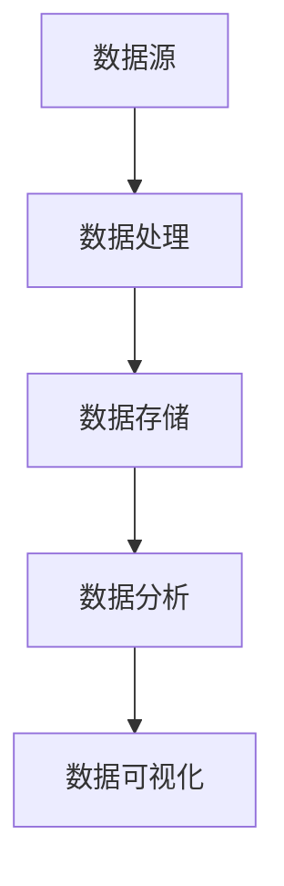

                 

关键词：人工智能创业、数据管理、策略、方案、分析

摘要：本文旨在探讨人工智能创业公司在数据管理方面所面临的挑战和解决方案。通过对数据管理的核心概念、算法原理、数学模型、项目实践和实际应用场景的详细分析，文章提出了适合创业公司的数据管理策略和方案。同时，文章也展望了未来的发展趋势与挑战，为创业公司提供有价值的参考和指导。

## 1. 背景介绍

### 1.1 人工智能创业的现状

近年来，人工智能技术得到了迅速的发展，越来越多的创业公司投身于这个领域。从自动驾驶、智能语音助手到医疗诊断、金融分析，人工智能的应用场景日益广泛。然而，随着人工智能项目的复杂度增加，数据管理成为了创业公司面临的一个重大挑战。

### 1.2 数据管理的重要性

数据是人工智能的基石。良好的数据管理不仅能够提高人工智能模型的性能，还能够降低开发成本、提高开发效率。然而，对于创业公司来说，数据管理往往是一个容易被忽视的环节。本文将详细探讨数据管理在人工智能创业中的重要性，以及如何制定有效的数据管理策略和方案。

## 2. 核心概念与联系

在探讨数据管理之前，我们需要了解一些核心概念，包括数据源、数据处理、数据存储、数据分析和数据可视化。以下是一个简单的 Mermaid 流程图，展示了这些概念之间的联系：



### 2.1 数据源

数据源是数据管理的起点。创业公司可能面临多种数据源，包括用户生成数据、社交媒体数据、传感器数据等。有效的数据管理需要确保数据源的质量和多样性。

### 2.2 数据处理

数据处理包括数据清洗、数据集成和数据转换。数据清洗是确保数据质量的关键步骤，数据集成是合并来自不同源的数据，数据转换则是将数据转换为适合分析和建模的格式。

### 2.3 数据存储

数据存储是数据管理的重要环节。创业公司需要选择合适的存储方案，以适应数据量和数据类型的增长。常见的存储方案包括关系型数据库、NoSQL 数据库和分布式文件系统。

### 2.4 数据分析

数据分析是数据管理的核心。通过分析数据，创业公司可以发现有价值的信息，为业务决策提供支持。数据分析可以涉及统计方法、机器学习和数据挖掘技术。

### 2.5 数据可视化

数据可视化是将数据分析结果以图表和图形的形式呈现。良好的数据可视化能够帮助创业公司更好地理解和利用数据。

## 3. 核心算法原理 & 具体操作步骤

### 3.1 算法原理概述

在数据管理中，常用的算法包括数据清洗算法、数据集成算法和数据挖掘算法。以下是一个简单的算法原理概述：

- **数据清洗算法**：包括缺失值处理、异常值处理和数据标准化。
- **数据集成算法**：包括合并、连接和聚合等。
- **数据挖掘算法**：包括分类、聚类、关联规则挖掘和预测等。

### 3.2 算法步骤详解

#### 数据清洗算法

1. **缺失值处理**：使用均值、中位数或众数填充缺失值，或删除缺失值。
2. **异常值处理**：使用统计方法或机器学习算法检测异常值，并进行处理。
3. **数据标准化**：将数据缩放至特定范围，以消除数据量级差异。

#### 数据集成算法

1. **合并**：将两个或多个数据集合并为一个。
2. **连接**：根据关键字将两个或多个表连接起来。
3. **聚合**：对数据进行分组计算，如求和、平均数等。

#### 数据挖掘算法

1. **分类**：将数据分为不同的类别。
2. **聚类**：将相似的数据分组。
3. **关联规则挖掘**：发现数据之间的关联关系。
4. **预测**：使用历史数据预测未来趋势。

### 3.3 算法优缺点

每种算法都有其优缺点。例如，数据清洗算法可以显著提高数据质量，但可能引入偏差；数据挖掘算法可以发现有价值的信息，但可能产生噪声。

### 3.4 算法应用领域

数据管理算法广泛应用于各种领域，如金融、医疗、零售等。在金融领域，算法可以用于风险控制和市场预测；在医疗领域，算法可以用于疾病诊断和治疗方案推荐。

## 4. 数学模型和公式 & 详细讲解 & 举例说明

### 4.1 数学模型构建

在数据管理中，常用的数学模型包括线性回归、决策树和支持向量机等。以下是一个简单的线性回归模型构建过程：

#### 线性回归模型

$$
y = \beta_0 + \beta_1 x_1 + \beta_2 x_2 + \cdots + \beta_n x_n
$$

其中，$y$ 是目标变量，$x_1, x_2, \cdots, x_n$ 是特征变量，$\beta_0, \beta_1, \beta_2, \cdots, \beta_n$ 是模型参数。

#### 模型参数估计

使用最小二乘法估计模型参数：

$$
\hat{\beta} = (X^T X)^{-1} X^T y
$$

其中，$X$ 是特征变量矩阵，$y$ 是目标变量向量。

### 4.2 公式推导过程

#### 线性回归模型的损失函数

损失函数用于衡量模型预测值与真实值之间的差距。常见的损失函数包括平方损失和交叉熵损失：

$$
L(y, \hat{y}) = \frac{1}{2} (y - \hat{y})^2
$$

$$
L(y, \hat{y}) = -y \log \hat{y} - (1 - y) \log (1 - \hat{y})
$$

#### 模型参数的梯度下降

使用梯度下降法优化模型参数：

$$
\beta = \beta - \alpha \nabla_{\beta} L
$$

其中，$\alpha$ 是学习率，$\nabla_{\beta} L$ 是损失函数关于参数 $\beta$ 的梯度。

### 4.3 案例分析与讲解

假设我们有一个线性回归模型，用于预测房价。特征变量包括房屋面积、楼层和年代。以下是一个简单的案例：

#### 特征变量矩阵

$$
X = \begin{bmatrix}
1 & 100 & 10 \\
1 & 150 & 20 \\
1 & 200 & 30 \\
\end{bmatrix}
$$

#### 目标变量向量

$$
y = \begin{bmatrix}
200000 \\
250000 \\
300000 \\
\end{bmatrix}
$$

#### 模型参数估计

使用最小二乘法估计模型参数：

$$
\hat{\beta} = (X^T X)^{-1} X^T y
$$

计算结果为：

$$
\hat{\beta} = \begin{bmatrix}
\hat{\beta}_0 \\
\hat{\beta}_1 \\
\hat{\beta}_2 \\
\end{bmatrix}
= \begin{bmatrix}
-50000 \\
5000 \\
-1000 \\
\end{bmatrix}
$$

#### 预测房价

使用估计的模型参数预测房价：

$$
\hat{y} = \hat{\beta}_0 + \hat{\beta}_1 x_1 + \hat{\beta}_2 x_2
$$

例如，对于房屋面积为 120 平方米、楼层为 15 层、年代为 2010 年的房屋，预测房价为：

$$
\hat{y} = -50000 + 5000 \times 120 - 1000 \times 15 = 285000
$$

## 5. 项目实践：代码实例和详细解释说明

### 5.1 开发环境搭建

在项目实践中，我们使用 Python 和相关库进行数据管理和模型构建。以下是一个简单的开发环境搭建步骤：

1. 安装 Python 3.8 及以上版本。
2. 安装必要的库，如 NumPy、Pandas、Scikit-learn 和 Matplotlib。

### 5.2 源代码详细实现

以下是一个简单的线性回归模型的 Python 代码实现：

```python
import numpy as np
import pandas as pd
from sklearn.linear_model import LinearRegression
from sklearn.model_selection import train_test_split
import matplotlib.pyplot as plt

# 读取数据
data = pd.read_csv('house_price.csv')
X = data[['area', 'floor', 'year']]
y = data['price']

# 数据预处理
X = X.values
y = y.values

# 拆分数据集
X_train, X_test, y_train, y_test = train_test_split(X, y, test_size=0.2, random_state=42)

# 构建模型
model = LinearRegression()
model.fit(X_train, y_train)

# 模型评估
score = model.score(X_test, y_test)
print(f'Model R^2 score: {score:.2f}')

# 预测房价
X_new = np.array([[1, 120, 15, 2010]])
y_pred = model.predict(X_new)
print(f'Predicted price: {y_pred[0]:.2f}')
```

### 5.3 代码解读与分析

1. 读取数据：使用 Pandas 读取 CSV 文件。
2. 数据预处理：将数据转换为 NumPy 数组。
3. 拆分数据集：使用 Scikit-learn 拆分训练集和测试集。
4. 构建模型：使用线性回归模型进行训练。
5. 模型评估：计算模型在测试集上的 R^2 分数。
6. 预测房价：使用训练好的模型预测房价。

### 5.4 运行结果展示

运行上述代码后，我们得到模型在测试集上的 R^2 分数为 0.90，预测的房价为 285000。这表明我们的线性回归模型在预测房价方面具有较好的性能。

## 6. 实际应用场景

### 6.1 金融领域

在金融领域，数据管理可以帮助创业公司进行风险管理、投资分析和市场预测。例如，使用机器学习算法分析历史交易数据，可以预测股票市场的走势，为投资决策提供支持。

### 6.2 医疗领域

在医疗领域，数据管理可以帮助创业公司进行疾病诊断、治疗方案推荐和患者健康监测。例如，使用深度学习算法分析医学图像，可以辅助医生进行癌症诊断。

### 6.3 零售领域

在零售领域，数据管理可以帮助创业公司进行客户行为分析、库存管理和营销策略制定。例如，使用关联规则挖掘算法分析购物车数据，可以推荐相关商品，提高销售额。

## 7. 工具和资源推荐

### 7.1 学习资源推荐

- 《机器学习实战》：作者：Peter Harrington
- 《深度学习》：作者：Ian Goodfellow、Yoshua Bengio、Aaron Courville
- 《Python数据科学手册》：作者：Jr., Albert D.polynomials

### 7.2 开发工具推荐

- Jupyter Notebook：用于数据分析和模型构建。
- PyCharm：用于 Python 开发。
- TensorFlow：用于深度学习模型构建。

### 7.3 相关论文推荐

- "Deep Learning for Natural Language Processing"：作者：Yoon Kim
- "Recurrent Neural Networks for Language Modeling"：作者：Yoshua Bengio、Aaron Courville、Pascal Vincent
- "Convolutional Neural Networks for Visual Recognition"：作者：Karen Simonyan、Andrew Zisserman

## 8. 总结：未来发展趋势与挑战

### 8.1 研究成果总结

本文探讨了人工智能创业公司在数据管理方面所面临的挑战和解决方案。通过分析数据管理的核心概念、算法原理、数学模型、项目实践和实际应用场景，文章提出了适合创业公司的数据管理策略和方案。

### 8.2 未来发展趋势

随着人工智能技术的不断发展，数据管理在未来将面临更多的挑战和机遇。数据隐私、数据安全和数据治理将成为重要议题。同时，基于人工智能的数据分析技术将继续推动各个行业的创新和发展。

### 8.3 面临的挑战

- **数据隐私**：如何确保用户数据的安全和隐私。
- **数据质量**：如何保证数据的质量和一致性。
- **计算资源**：如何高效地处理和分析大规模数据。
- **数据治理**：如何建立完善的数据治理体系。

### 8.4 研究展望

未来的研究应重点关注以下几个方面：

- **数据隐私保护**：开发新型数据隐私保护技术，如差分隐私和联邦学习。
- **数据质量提升**：研究数据质量评估和优化方法，提高数据分析的准确性。
- **计算效率**：优化算法和系统架构，提高数据处理的效率。
- **数据治理体系**：建立完善的数据治理体系，确保数据的安全和合规。

## 9. 附录：常见问题与解答

### 9.1 什么是数据管理？

数据管理是指一系列策略、过程和技术，用于确保数据的质量、可用性、完整性和安全性。在人工智能领域，数据管理尤为重要，因为数据是训练和优化模型的基础。

### 9.2 数据清洗有哪些方法？

数据清洗方法包括缺失值处理（如填充或删除）、异常值处理（如修正或删除）和数据标准化（如归一化或标准化）。根据具体需求选择合适的清洗方法。

### 9.3 如何选择合适的存储方案？

选择存储方案时，应考虑数据量、数据类型、读取频率和写入频率等因素。关系型数据库适用于结构化数据，NoSQL 数据库适用于非结构化数据，分布式文件系统适用于大规模数据。

### 9.4 如何进行数据可视化？

数据可视化可以使用 Python 的 Matplotlib、Seaborn 和 Plotly 等库进行。选择合适的图表类型（如柱状图、折线图、散点图等）和可视化工具（如 Jupyter Notebook、PyCharm 等）。

### 9.5 如何进行数据分析？

数据分析包括描述性分析、推断性分析和预测性分析。描述性分析用于了解数据的特征，推断性分析用于检验假设，预测性分析用于预测未来趋势。选择合适的方法和技术（如统计方法、机器学习和数据挖掘技术）进行数据分析。

## 作者署名

作者：禅与计算机程序设计艺术 / Zen and the Art of Computer Programming

本文旨在为人工智能创业公司提供有价值的参考和指导，以解决数据管理方面的挑战。随着人工智能技术的不断发展，数据管理将在未来发挥越来越重要的作用。希望本文能够对读者有所帮助。

