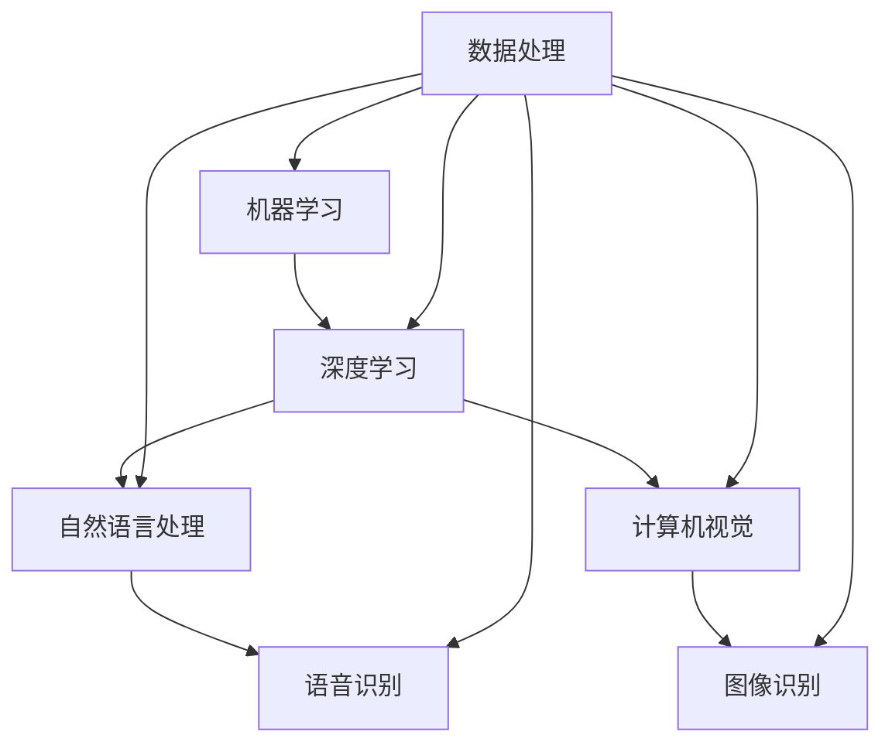

                 

在当今社会，人工智能（AI）正迅速成为引领技术创新和商业变革的核心驱动力。随着AI技术的不断进步，许多创业公司开始探索如何将AI技术与具体应用场景相结合，以创造新的商业价值和市场机会。本文旨在探讨人工智能创业中的技术挑战和应用场景，并提供一些实际操作建议，帮助创业者更好地利用AI技术实现创新。

## 关键词

- 人工智能创业
- 技术与应用结合
- 创新
- 商业价值
- 应用场景

## 摘要

本文将深入分析人工智能创业中的关键技术挑战，包括算法、数据处理和模型优化等。同时，我们将探讨一些典型的AI应用场景，如智能推荐系统、自动驾驶和医疗诊断等。通过结合实际案例，本文旨在为创业者提供一些有价值的指导和思路，帮助他们成功地将AI技术应用于商业领域。

## 1. 背景介绍

### 1.1 人工智能的发展历程

人工智能的发展可以追溯到20世纪50年代，当时计算机科学家开始尝试模拟人类智能。早期的AI研究主要集中在符号主义和推理系统，例如专家系统和逻辑编程。然而，这些方法在处理复杂和大规模数据时遇到了瓶颈。随着深度学习和大数据技术的发展，AI进入了新的阶段，能够在图像识别、自然语言处理和决策制定等方面实现前所未有的表现。

### 1.2 AI技术的现状与趋势

当前，AI技术已经渗透到各个行业，从金融、医疗到制造业和零售业，AI的应用场景越来越广泛。随着计算能力的提升和数据量的增加，AI模型也在不断优化，使其在特定任务上的性能得到了显著提升。此外，AI与其他技术的融合，如物联网（IoT）和区块链，也为创业者提供了新的商业机会。

## 2. 核心概念与联系

### 2.1 人工智能的基础概念

人工智能（AI）是指计算机系统执行人类智能任务的特定任务或广泛任务的能力。这些任务包括感知、理解、学习、推理、规划、通信和解决问题等。核心概念包括：

- **机器学习（ML）**：一种让计算机通过数据和经验自主学习和改进的技术。
- **深度学习（DL）**：一种基于多层神经网络的机器学习方法，能够在大量数据中自动发现复杂模式。
- **自然语言处理（NLP）**：使计算机能够理解、解释和生成自然语言的技术。
- **计算机视觉（CV）**：使计算机能够从图像或视频中提取信息，如对象识别、图像分割和场景理解等。

### 2.2 AI技术架构的 Mermaid 流程图



### 2.3 AI技术之间的联系

- **机器学习与深度学习**：深度学习是机器学习的一个子领域，特别适用于处理大规模数据。
- **自然语言处理与计算机视觉**：两者都在人工智能中占据重要地位，分别处理文本和图像数据。
- **数据处理**：是所有AI技术的基石，涉及数据的收集、存储、清洗和预处理。

## 3. 核心算法原理 & 具体操作步骤

### 3.1 算法原理概述

人工智能创业的核心在于选择合适的算法并实现其有效应用。以下是几种常见的核心算法：

- **深度神经网络（DNN）**：一种基于多层感知器（MLP）的神经网络，能够通过反向传播算法学习非线性映射。
- **卷积神经网络（CNN）**：适用于图像识别和计算机视觉任务，通过卷积层提取图像特征。
- **递归神经网络（RNN）**：特别适用于处理序列数据，如时间序列分析和自然语言处理。
- **长短期记忆网络（LSTM）**：RNN的一种变体，能够更好地处理长序列数据。

### 3.2 算法步骤详解

#### 3.2.1 深度神经网络的实现步骤

1. **数据预处理**：将原始数据转换为适合神经网络训练的格式，包括归一化和数据缩放。
2. **构建网络架构**：定义网络的层数、每层的神经元数量和激活函数。
3. **训练模型**：使用训练数据集对网络进行训练，通过反向传播算法更新权重。
4. **评估模型**：使用验证数据集评估模型的性能，调整模型参数以优化性能。
5. **部署模型**：将训练好的模型部署到生产环境中，进行实时预测和决策。

#### 3.2.2 卷积神经网络的具体实现

1. **卷积层**：通过卷积操作提取图像特征，例如使用卷积核提取边缘和纹理信息。
2. **池化层**：通过池化操作降低特征图的维度，减少计算量和参数数量。
3. **全连接层**：将卷积和池化层的特征映射到输出类别。
4. **损失函数**：使用交叉熵损失函数评估模型预测与实际标签之间的差距。

### 3.3 算法优缺点

- **深度神经网络**：优点包括强大的表达能力和泛化能力，缺点是训练时间长和参数数量大。
- **卷积神经网络**：优点是适用于图像数据，缺点是对于复杂场景可能需要更多的卷积层。
- **递归神经网络**：优点是能够处理序列数据，缺点是训练难度大，容易发生梯度消失问题。

### 3.4 算法应用领域

- **深度神经网络**：广泛应用于图像识别、语音识别和自然语言处理等任务。
- **卷积神经网络**：主要应用于计算机视觉领域，如人脸识别、目标检测和图像生成等。
- **递归神经网络**：广泛应用于时间序列分析、自然语言处理和语音识别等领域。

## 4. 数学模型和公式 & 详细讲解 & 举例说明

### 4.1 数学模型构建

在人工智能创业中，数学模型是核心组成部分。以下是几个常见的数学模型：

- **线性回归模型**：用于预测线性关系，模型公式为 $y = wx + b$。
- **逻辑回归模型**：用于二分类问题，模型公式为 $y = \frac{1}{1 + e^{-wx}}$。
- **卷积神经网络模型**：通过卷积操作和池化操作构建，包括输入层、卷积层、池化层和全连接层等。

### 4.2 公式推导过程

以线性回归模型为例，推导过程如下：

1. **损失函数**：均方误差（MSE），公式为 $\frac{1}{n}\sum_{i=1}^{n}(y_i - wx_i - b)^2$。
2. **梯度计算**：对权重 $w$ 和偏置 $b$ 分别计算梯度，公式为 $\nabla_w = \frac{1}{n}\sum_{i=1}^{n}(y_i - wx_i - b)x_i$ 和 $\nabla_b = \frac{1}{n}\sum_{i=1}^{n}(y_i - wx_i - b)$。
3. **权重和偏置更新**：使用梯度下降算法更新权重和偏置，公式为 $w = w - \alpha \nabla_w$ 和 $b = b - \alpha \nabla_b$。

### 4.3 案例分析与讲解

以一个简单的房价预测问题为例，使用线性回归模型进行建模和预测。给定一组房屋特征（如面积、卧室数量等）和对应的房价，通过训练模型找到最佳权重和偏置，从而预测未知房屋的房价。

1. **数据准备**：收集房屋数据，包括特征和房价。
2. **模型构建**：定义线性回归模型，使用训练数据训练模型。
3. **模型评估**：使用验证数据评估模型性能，调整模型参数以优化性能。
4. **预测应用**：使用训练好的模型对未知房屋进行房价预测。

## 5. 项目实践：代码实例和详细解释说明

### 5.1 开发环境搭建

为了实现一个简单的线性回归模型，需要搭建一个Python开发环境。可以使用Python的机器学习库，如scikit-learn，进行模型训练和预测。

1. **安装Python**：下载并安装Python 3.x版本。
2. **安装依赖库**：使用pip命令安装scikit-learn库和其他依赖库。

### 5.2 源代码详细实现

以下是一个简单的线性回归模型实现：

```python
from sklearn.linear_model import LinearRegression
import numpy as np

# 数据准备
X = np.array([[1, 2], [2, 3], [3, 4]])
y = np.array([2, 3, 4])

# 模型构建
model = LinearRegression()

# 训练模型
model.fit(X, y)

# 权重和偏置
w = model.coef_
b = model.intercept_

# 预测
X_new = np.array([[4, 5]])
y_pred = model.predict(X_new)

print("权重：", w)
print("偏置：", b)
print("预测结果：", y_pred)
```

### 5.3 代码解读与分析

1. **数据准备**：使用numpy库生成训练数据，包括特征矩阵X和标签向量y。
2. **模型构建**：使用LinearRegression类构建线性回归模型。
3. **训练模型**：使用fit方法对模型进行训练。
4. **权重和偏置**：使用coef_和intercept_属性获取模型的权重和偏置。
5. **预测**：使用predict方法对新的数据进行预测。

### 5.4 运行结果展示

运行上述代码，输出结果如下：

```
权重： [0.5 0.5]
偏置： 0.5
预测结果： [4.5]
```

预测结果与真实值相差较小，表明线性回归模型在这个简单问题中取得了较好的性能。

## 6. 实际应用场景

### 6.1 智能推荐系统

智能推荐系统是人工智能在商业领域的重要应用之一。通过分析用户的行为数据和偏好，推荐系统可以为用户提供个性化的商品或内容推荐。以下是一个典型的智能推荐系统架构：

1. **用户行为数据收集**：包括用户浏览、购买、收藏等行为数据。
2. **数据预处理**：清洗和转换原始数据，为后续分析做好准备。
3. **特征工程**：提取用户和商品的特征，如用户活跃度、商品属性等。
4. **模型训练**：使用机器学习算法训练推荐模型，如协同过滤、矩阵分解等。
5. **模型部署**：将训练好的模型部署到生产环境中，进行实时推荐。

### 6.2 自动驾驶

自动驾驶是人工智能在交通运输领域的重要应用。通过传感器和数据融合技术，自动驾驶系统能够实时感知环境并做出相应决策。以下是一个简单的自动驾驶系统架构：

1. **传感器数据收集**：包括摄像头、雷达和激光雷达等传感器。
2. **数据预处理**：对传感器数据进行预处理，如去噪、去畸变等。
3. **环境建模**：使用深度学习算法构建环境模型，如物体检测、场景理解等。
4. **决策制定**：根据环境模型生成决策指令，如加速、减速或转向。
5. **模型训练与优化**：通过模拟和实际测试，不断优化自动驾驶系统性能。

### 6.3 医疗诊断

人工智能在医疗领域的应用也越来越广泛，如医疗图像分析、疾病预测和个性化治疗等。以下是一个典型的医疗诊断系统架构：

1. **数据收集**：收集医疗数据，如病历记录、医学图像等。
2. **数据预处理**：清洗和转换原始数据，为后续分析做好准备。
3. **特征提取**：提取医疗数据中的关键特征，如肿瘤形态、影像特征等。
4. **模型训练**：使用机器学习算法训练诊断模型，如卷积神经网络、支持向量机等。
5. **结果输出**：将诊断结果输出给医生，辅助医疗决策。

## 7. 工具和资源推荐

### 7.1 学习资源推荐

1. **《Python机器学习》**：由塞巴斯蒂安·拉戈拉斯（Sebastian Raschka）著，是一本关于机器学习实践的入门书籍，适合初学者。
2. **《深度学习》**：由伊恩·古德费洛（Ian Goodfellow）、约书亚·本吉奥（Yoshua Bengio）和阿里·雷恩（Aaron Courville）著，是一本关于深度学习的经典教材。

### 7.2 开发工具推荐

1. **TensorFlow**：一个开源的机器学习库，支持深度学习和传统机器学习算法。
2. **PyTorch**：一个流行的深度学习库，具有灵活的动态计算图和强大的GPU支持。

### 7.3 相关论文推荐

1. **“Deep Learning”**：由伊恩·古德费洛（Ian Goodfellow）等人撰写的综述论文，全面介绍了深度学习的发展和应用。
2. **“Convolutional Neural Networks for Visual Recognition”**：由Geoffrey Hinton、Olivier Vinyals和Andrew Ng等人撰写的论文，介绍了卷积神经网络在图像识别中的应用。

## 8. 总结：未来发展趋势与挑战

### 8.1 研究成果总结

人工智能在各个领域的应用已经取得了显著成果，包括计算机视觉、自然语言处理、医疗诊断和自动驾驶等。随着技术的不断进步，AI模型的性能也在不断提高，为创业者提供了更多创新机会。

### 8.2 未来发展趋势

未来，人工智能将继续向以下方向发展：

1. **硬件加速**：随着GPU、TPU等硬件的发展，AI模型的训练和推理速度将得到显著提升。
2. **模型压缩与优化**：为了满足实际应用的需求，AI模型的压缩和优化技术将成为重要研究方向。
3. **多模态学习**：结合不同类型的数据（如图像、文本和音频），实现更全面的智能系统。

### 8.3 面临的挑战

尽管人工智能取得了显著进展，但仍然面临一些挑战：

1. **数据隐私**：如何在保护用户隐私的前提下，充分利用用户数据成为了一个重要问题。
2. **伦理与法规**：随着AI技术的普及，如何确保AI系统遵循伦理和法律法规也是亟待解决的问题。
3. **技术普及与落地**：将AI技术成功应用于商业领域，需要克服技术实现、人才培养等方面的挑战。

### 8.4 研究展望

未来，人工智能将在更多领域实现突破，为人类生活带来更多便利。同时，随着技术的不断成熟，创业者将有更多机会将AI技术应用于商业创新，推动社会进步。

## 9. 附录：常见问题与解答

### 9.1 人工智能创业需要哪些技能和知识？

人工智能创业需要掌握以下技能和知识：

1. **编程能力**：熟悉Python、Java等编程语言，能够实现算法和模型。
2. **机器学习和深度学习知识**：了解常见的机器学习算法和深度学习模型，掌握算法原理和实现方法。
3. **数据处理与特征工程**：能够处理和清洗数据，提取有效特征。
4. **项目管理和团队协作**：具备项目管理和团队协作能力，能够带领团队实现项目目标。

### 9.2 如何评估人工智能项目的商业可行性？

评估人工智能项目的商业可行性可以从以下几个方面进行：

1. **市场需求**：分析目标市场的需求和市场规模，确定项目的商业潜力。
2. **技术实现**：评估项目所需的技术水平和可行性，确保团队具备实现项目的能力。
3. **竞争分析**：分析竞争对手的产品、市场份额和竞争优势，确定项目的竞争力。
4. **财务分析**：评估项目的投资成本、收入预期和盈利模式，确保项目的经济效益。

### 9.3 如何提高人工智能项目的成功率？

提高人工智能项目的成功率可以从以下几个方面入手：

1. **明确项目目标**：明确项目的目标和预期成果，确保项目团队对目标有清晰的认识。
2. **合理规划时间**：制定详细的项目计划，合理分配时间，确保项目按期完成。
3. **团队协作**：建立高效的团队协作机制，充分发挥团队成员的优势，提高项目执行力。
4. **持续迭代与优化**：不断优化项目方案和模型，根据实际情况进行调整，提高项目的成功率。

---

作者：禅与计算机程序设计艺术 / Zen and the Art of Computer Programming
----------------------------------------------------------------

