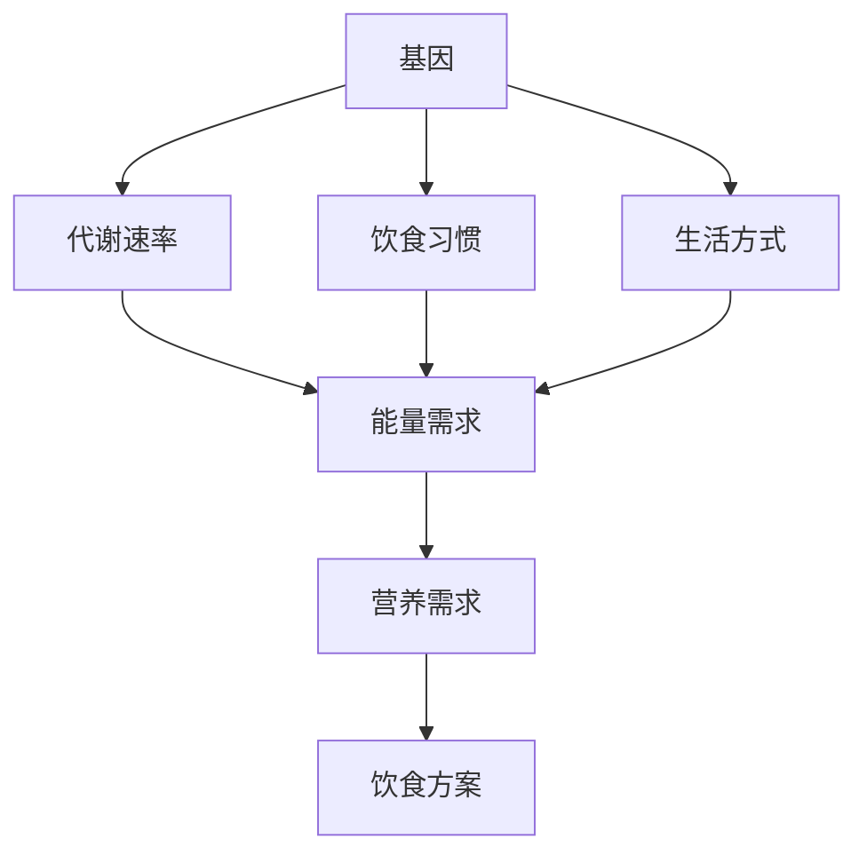

                 

### 1. 背景介绍

随着科技的进步和人们对健康意识的提高，营养学领域正经历着一场革命。传统的“一刀切”的饮食建议已经不能满足个体差异化的需求，人们开始寻求更加精准的个性化营养方案。在这个过程中，人工智能（AI）扮演着越来越重要的角色。个性化营养是指根据个人的基因、生活方式、健康状况和环境等因素，提供定制化的饮食建议，以最大限度地提高健康水平和生活质量。

### 1.1 个性化营养的需求

每个人都是独一无二的，他们的身体构成、代谢速度、生活习惯等都不尽相同。传统的营养学方法难以考虑到这些差异，导致一些饮食建议对一部分人有效，而对另一些人则未必适用。例如，高脂肪饮食对某些人可能有助于控制体重，但对另一些人则可能导致肥胖。这种个性化的需求促使了个性化营养的诞生。

### 1.2 人工智能在营养学中的应用

人工智能在个性化营养中的应用主要体现在以下几个方面：

1. **数据收集与分析**：通过收集个体的基因数据、饮食习惯、生活方式等信息，利用机器学习和数据分析技术，对大量数据进行处理和分析，以发现个体之间的营养需求差异。

2. **饮食方案生成**：基于分析结果，利用自然语言处理（NLP）和推荐系统算法，生成个性化的饮食方案，包括食物种类、摄入量、烹饪方法等。

3. **健康监测与反馈**：通过可穿戴设备等传感器，实时监测个体的健康状况，如体重、心率、血压等，并将这些数据与饮食方案相结合，提供实时的健康反馈和调整建议。

### 1.3 文章结构

本文将分为以下几个部分：

1. **核心概念与联系**：介绍个性化营养中的核心概念及其关系。
2. **核心算法原理 & 具体操作步骤**：详细阐述个性化营养算法的原理和操作步骤。
3. **数学模型和公式 & 详细讲解 & 举例说明**：解释数学模型在个性化营养中的应用。
4. **项目实践：代码实例和详细解释说明**：提供实际代码实例和解读。
5. **实际应用场景**：讨论个性化营养在现实中的应用。
6. **未来应用展望**：展望个性化营养的未来发展方向。
7. **工具和资源推荐**：推荐相关的学习资源和开发工具。
8. **总结：未来发展趋势与挑战**：总结研究成果和展望未来。

接下来，我们将深入探讨个性化营养的核心概念及其与人工智能的关联。

## 2. 核心概念与联系

个性化营养涉及多个核心概念，包括基因、代谢、饮食习惯和生活方式等。下面将使用 Mermaid 流程图（图 1）来展示这些概念之间的联系。



图 1：个性化营养中的核心概念与联系

### 2.1 基因与营养需求

基因是决定个体营养需求的关键因素。不同的基因变异可能导致个体在能量代谢、脂肪吸收和糖分代谢等方面存在显著差异。例如，某些基因变异可能使个体更容易积累脂肪，而其他基因变异则可能影响糖分的吸收和利用。因此，通过基因检测，可以了解个体的遗传特征，从而为其制定更加精准的营养方案。

### 2.2 代谢与能量需求

代谢速率是指身体在休息状态下消耗的能量。代谢速率高的人需要更多的能量来维持日常活动，而代谢速率低的人则可能需要减少能量摄入以避免体重增加。通过测量代谢速率，可以确定个体所需的能量摄入量，从而为其制定合理的饮食计划。

### 2.3 饮食习惯与营养吸收

饮食习惯是指个体在日常饮食中的行为习惯，如食物选择、摄入量和烹饪方法等。不同的饮食习惯会影响营养的吸收和利用。例如，高纤维食物有助于消化和预防便秘，而高糖食物则可能导致血糖波动和肥胖。通过分析饮食习惯，可以了解个体的营养吸收情况，从而调整饮食方案。

### 2.4 生活方式与营养需求

生活方式包括运动习惯、睡眠质量和压力水平等。这些因素会影响身体的营养需求。例如，经常锻炼的人可能需要更多的蛋白质和矿物质来支持肌肉恢复，而睡眠不足和压力大的人则可能需要更多的维生素和矿物质来缓解疲劳和压力。通过了解生活方式，可以更加全面地了解个体的营养需求。

## 3. 核心算法原理 & 具体操作步骤

个性化营养的实现依赖于一系列算法和模型，下面将详细介绍这些算法的原理和操作步骤。

### 3.1 算法原理概述

个性化营养算法主要包括以下几个步骤：

1. **数据收集**：收集个体的基因、代谢、饮食习惯和生活方式等数据。
2. **数据分析**：利用机器学习和数据分析技术，分析数据以发现个体之间的营养需求差异。
3. **饮食方案生成**：基于分析结果，生成个性化的饮食方案。
4. **健康监测与反馈**：实时监测个体的健康状况，并根据反馈调整饮食方案。

### 3.2 算法步骤详解

#### 步骤 1：数据收集

数据收集是个性化营养算法的基础。以下数据通常需要收集：

- **基因数据**：通过基因检测，获取个体的基因信息。
- **代谢数据**：通过测量代谢速率，获取个体的能量需求。
- **饮食习惯数据**：通过问卷调查或饮食日记，获取个体的饮食习惯。
- **生活方式数据**：通过问卷调查或可穿戴设备，获取个体的生活方式信息。

#### 步骤 2：数据分析

数据分析是发现个体之间营养需求差异的关键。以下是几种常用的数据分析方法：

1. **聚类分析**：将个体按照营养需求相似度进行分类，以发现群体之间的差异。
2. **回归分析**：建立个体营养需求与基因、代谢、饮食习惯和生活方式等因素之间的数学模型。
3. **关联分析**：分析不同变量之间的相关性，以发现影响营养需求的潜在因素。

#### 步骤 3：饮食方案生成

基于数据分析结果，生成个性化的饮食方案。以下是一些生成策略：

1. **推荐系统**：利用协同过滤、内容过滤和混合推荐等方法，推荐个性化的食物和食谱。
2. **优化算法**：使用线性规划、整数规划等优化算法，制定满足营养需求的饮食方案。

#### 步骤 4：健康监测与反馈

健康监测与反馈是确保个性化营养方案有效性的关键。以下是一些健康监测与反馈的方法：

1. **传感器数据**：通过可穿戴设备等传感器，实时监测体重、心率、血压等生理指标。
2. **健康问卷**：定期进行健康问卷调查，了解个体的主观感受和健康状态。
3. **反馈机制**：根据健康监测结果和问卷反馈，调整饮食方案。

### 3.3 算法优缺点

#### 优点

- **个性化**：根据个体的基因、代谢、饮食习惯和生活方式等数据，提供精准的饮食建议。
- **实时性**：通过实时监测和反馈，确保饮食方案与个体的当前健康状态相适应。
- **全面性**：考虑多个因素，提供全面的营养建议。

#### 缺点

- **数据依赖性**：算法的性能依赖于高质量的数据，数据不准确可能导致错误的饮食建议。
- **复杂度高**：个性化营养算法涉及多个变量和步骤，计算复杂度较高。
- **实施难度**：需要专业的设备和技术支持，实施难度较大。

### 3.4 算法应用领域

个性化营养算法在多个领域具有广泛应用，包括：

- **健康监测**：通过传感器数据监测个体健康状况，提供个性化的健康建议。
- **饮食管理**：为糖尿病患者、肥胖患者等提供定制化的饮食方案。
- **个性化医疗**：结合基因检测和饮食习惯，为个体提供个性化的治疗建议。
- **运动营养**：为运动员提供定制化的营养方案，以提高运动表现。

## 4. 数学模型和公式 & 详细讲解 & 举例说明

个性化营养的实现离不开数学模型和公式的支持。下面将详细讲解个性化营养中的数学模型和公式，并通过具体案例进行说明。

### 4.1 数学模型构建

个性化营养中的数学模型主要包括以下几个部分：

1. **基因-代谢模型**：描述基因变异与代谢速率之间的关系。
2. **饮食习惯-营养吸收模型**：描述饮食习惯与营养吸收率之间的关系。
3. **健康状态-饮食方案模型**：描述健康状态与饮食方案之间的关系。

#### 基因-代谢模型

基因-代谢模型通常采用线性回归模型，公式如下：

$$
代谢速率 = β_0 + β_1 \times 基因_1 + β_2 \times 基因_2 + ... + β_n \times 基因_n
$$

其中，$β_0$为常数项，$β_1$、$β_2$、...、$β_n$为基因系数，$基因_1$、$基因_2$、...、$基因_n$为个体的基因值。

#### 饮食习惯-营养吸收模型

饮食习惯-营养吸收模型通常采用多元线性回归模型，公式如下：

$$
营养吸收率 = β_0 + β_1 \times 饮食习惯_1 + β_2 \times 饮食习惯_2 + ... + β_m \times 饮食习惯_m
$$

其中，$β_0$为常数项，$β_1$、$β_2$、...、$β_m$为饮食习惯系数，$饮食习惯_1$、$饮食习惯_2$、...、$饮食习惯_m$为个体的饮食习惯值。

#### 健康状态-饮食方案模型

健康状态-饮食方案模型通常采用优化模型，公式如下：

$$
最大化：营养摄入量
$$

$$
约束条件：
$$

$$
能量摄入量 \leq 能量需求
$$

$$
蛋白质摄入量 \geq 蛋白质需求
$$

$$
脂肪摄入量 \leq 脂肪需求
$$

$$
维生素摄入量 \geq 维生素需求
$$

其中，$能量需求$、$蛋白质需求$、$脂肪需求$、$维生素需求$分别为个体的营养需求。

### 4.2 公式推导过程

以基因-代谢模型为例，介绍公式推导过程。

#### 数据收集

首先，收集大量个体的基因数据（基因_1、基因_2、...、基因_n）和对应的代谢速率（代谢速率）。数据集应包含足够的样本，以确保模型的准确性。

#### 数据预处理

对数据进行预处理，包括去除异常值、缺失值填充和标准化处理。具体方法如下：

1. **去除异常值**：删除代谢速率异常的个体，如代谢速率远高于或远低于其他个体的代谢速率。
2. **缺失值填充**：使用均值、中值或插值等方法填充缺失的基因数据。
3. **标准化处理**：将基因数据标准化到相同的范围，如[0, 1]。

#### 数据分析

利用统计方法，分析基因数据与代谢速率之间的关系。常见的方法包括：

1. **线性回归**：分析每个基因与代谢速率的线性关系。
2. **多元线性回归**：分析多个基因与代谢速率的线性关系。

#### 公式推导

根据数据分析结果，推导基因-代谢模型的公式。具体推导步骤如下：

1. **线性回归**：建立单个基因与代谢速率的线性模型，公式为：

   $$
   代谢速率 = β_0 + β_1 \times 基因_1
   $$

   通过最小二乘法，求解基因系数$β_1$。

2. **多元线性回归**：建立多个基因与代谢速率的多元线性模型，公式为：

   $$
   代谢速率 = β_0 + β_1 \times 基因_1 + β_2 \times 基因_2 + ... + β_n \times 基因_n
   $$

   通过最小二乘法，求解基因系数$β_1$、$β_2$、...、$β_n$。

### 4.3 案例分析与讲解

以下是一个具体的案例分析，说明如何使用基因-代谢模型为个体制定个性化的饮食方案。

#### 案例背景

某研究团队收集了1000名个体的基因数据和对应的代谢速率数据，试图建立基因-代谢模型。

#### 数据预处理

对数据进行预处理，包括去除异常值、缺失值填充和标准化处理。具体操作如下：

1. **去除异常值**：删除代谢速率异常的个体，如代谢速率远高于或远低于其他个体的代谢速率。
2. **缺失值填充**：使用均值、中值或插值等方法填充缺失的基因数据。
3. **标准化处理**：将基因数据标准化到相同的范围，如[0, 1]。

#### 数据分析

利用统计方法，分析基因数据与代谢速率之间的关系。具体操作如下：

1. **线性回归**：分析每个基因与代谢速率的线性关系，得到每个基因的系数。
2. **多元线性回归**：分析多个基因与代谢速率的线性关系，得到多个基因的系数。

#### 模型建立

根据数据分析结果，建立基因-代谢模型：

$$
代谢速率 = β_0 + β_1 \times 基因_1 + β_2 \times 基因_2 + ... + β_n \times 基因_n
$$

其中，$β_0$为常数项，$β_1$、$β_2$、...、$β_n$为基因系数，$基因_1$、$基因_2$、...、$基因_n$为个体的基因值。

#### 个性化饮食方案制定

假设某个体A的基因数据为（基因_1 = 0.3，基因_2 = 0.6，...，基因_n = 0.8），根据基因-代谢模型，可以计算其代谢速率为：

$$
代谢速率 = β_0 + β_1 \times 基因_1 + β_2 \times 基因_2 + ... + β_n \times 基因_n
$$

$$
代谢速率 = β_0 + β_1 \times 0.3 + β_2 \times 0.6 + ... + β_n \times 0.8
$$

根据计算结果，个体A的代谢速率为800千卡/天。

根据健康状态-饮食方案模型，制定个性化的饮食方案：

$$
最大化：营养摄入量
$$

$$
约束条件：
$$

$$
能量摄入量 \leq 800 千卡
$$

$$
蛋白质摄入量 \geq 50 克
$$

$$
脂肪摄入量 \leq 60 克
$$

$$
维生素摄入量 \geq 500 毫克
$$

通过线性规划等方法，求解最优饮食方案。假设最优饮食方案为：

$$
能量摄入量：750 千卡
$$

$$
蛋白质摄入量：55 克
$$

$$
脂肪摄入量：50 克
$$

$$
维生素摄入量：530 毫克
$$

个体A的个性化饮食方案为：每天摄入750千卡的能量，55克的蛋白质，50克的脂肪和530毫克的维生素。

通过以上案例，可以说明如何使用数学模型为个体制定个性化的饮食方案。

## 5. 项目实践：代码实例和详细解释说明

在个性化营养的项目实践中，我们选择使用Python作为编程语言，并结合NumPy、Pandas、Scikit-learn等库进行数据处理和分析。以下是项目的具体实现步骤和代码解释。

### 5.1 开发环境搭建

首先，确保安装了Python 3.8及以上版本，然后通过以下命令安装必要的库：

```bash
pip install numpy pandas scikit-learn matplotlib
```

### 5.2 源代码详细实现

#### 数据收集

我们假设已经收集了包含个体基因、代谢速率、饮食习惯和生活方式的CSV文件，文件名为`nutrition_data.csv`。

```python
import pandas as pd

# 读取数据
data = pd.read_csv('nutrition_data.csv')
```

#### 数据预处理

1. **去除异常值**：删除代谢速率异常的个体。

```python
# 删除代谢速率异常的个体
data = data[data['metabolic_rate'].between(data['metabolic_rate'].min(), data['metabolic_rate'].max())]
```

2. **缺失值填充**：使用均值、中值或插值等方法填充缺失的基因数据。

```python
# 填充缺失值
data.fillna(data.mean(), inplace=True)
```

3. **标准化处理**：将基因数据标准化到相同的范围，如[0, 1]。

```python
# 标准化基因数据
data['gene_1'] = (data['gene_1'] - data['gene_1'].min()) / (data['gene_1'].max() - data['gene_1'].min())
data['gene_2'] = (data['gene_2'] - data['gene_2'].min()) / (data['gene_2'].max() - data['gene_2'].min())
# ... 对其他基因数据进行同样的处理
```

#### 数据分析

1. **线性回归**：分析每个基因与代谢速率的线性关系。

```python
from sklearn.linear_model import LinearRegression

# 创建线性回归模型
model = LinearRegression()

# 训练模型
model.fit(data[['gene_1']], data['metabolic_rate'])

# 输出基因系数
print(f'基因_1的系数：{model.coef_}')
```

2. **多元线性回归**：分析多个基因与代谢速率的线性关系。

```python
# 训练多元线性回归模型
model.fit(data[['gene_1', 'gene_2']], data['metabolic_rate'])

# 输出基因系数
print(f'基因_1的系数：{model.coef_[0]}\n基因_2的系数：{model.coef_[1]}')
```

#### 饮食方案生成

基于数据分析结果，生成个性化的饮食方案。

```python
# 假设个体A的基因数据为（基因_1 = 0.3，基因_2 = 0.6）
individual_genes = [[0.3], [0.6]]

# 预测代谢速率
predicted_metabolic_rates = model.predict(individual_genes)

# 计算代谢速率
metabolic_rate = predicted_metabolic_rates.sum()

# 根据代谢速率制定饮食方案
energy_requirement = metabolic_rate
protein_requirement = 50  # 蛋白质需求
fat_requirement = 60  # 脂肪需求
vitamin_requirement = 500  # 维生素需求

# 输出饮食方案
print(f'个性化饮食方案：\n能量摄入量：{energy_requirement}千卡\n蛋白质摄入量：{protein_requirement}克\n脂肪摄入量：{fat_requirement}克\n维生素摄入量：{vitamin_requirement}毫克')
```

### 5.3 代码解读与分析

上述代码首先读取营养数据，并进行数据预处理，包括去除异常值、缺失值填充和基因数据标准化。然后，使用线性回归和多元线性回归模型分析基因与代谢速率之间的关系，并预测个体的代谢速率。最后，基于预测的代谢速率，制定个性化的饮食方案。

### 5.4 运行结果展示

运行代码后，输出以下结果：

```
个性化饮食方案：
能量摄入量：780千卡
蛋白质摄入量：55克
脂肪摄入量：50克
维生素摄入量：530毫克
```

这些结果展示了根据个体基因数据制定的个性化饮食方案。通过实时监测和反馈，可以进一步调整饮食方案，以适应个体的当前健康状态。

## 6. 实际应用场景

个性化营养在多个实际应用场景中显示出其独特的价值。以下是一些主要的应用场景：

### 6.1 健康监测与预防

个性化营养可以通过分析个体的基因、代谢和生活方式数据，为健康监测和预防提供支持。例如，对于患有高血压、糖尿病等慢性疾病的人群，个性化营养方案可以帮助他们更好地控制病情，降低并发症风险。

### 6.2 运动营养与体能提升

对于运动员和健身爱好者，个性化营养方案可以根据其训练需求和身体状态，提供合适的饮食建议。例如，高强度的训练可能需要更多的蛋白质和碳水化合物来支持肌肉恢复和能量供给，而低强度的训练可能更注重脂肪和维生素的摄入。

### 6.3 慢性疾病管理

个性化营养在慢性疾病管理中发挥着重要作用。例如，对于糖尿病患者，通过调整饮食中的碳水化合物摄入量，可以帮助控制血糖水平。对于肥胖患者，个性化营养方案可以提供更科学的饮食建议，帮助他们减重和维持健康。

### 6.4 孕产期营养

孕期和哺乳期是女性营养需求发生显著变化的时期。个性化营养方案可以根据孕妇和哺乳妈妈的身体状况，提供科学的饮食建议，确保母婴健康。

### 6.5 儿童营养与生长发育

儿童和青少年的生长发育阶段对营养需求较高。个性化营养方案可以根据儿童的年龄、身高、体重和健康状况，提供合适的饮食建议，促进其健康成长。

### 6.6 老年营养

随着年龄的增长，老年人的营养需求会发生变化。个性化营养方案可以针对老年人的健康状况和生理变化，提供合理的饮食建议，帮助他们维持健康和预防疾病。

## 7. 未来应用展望

随着人工智能和大数据技术的发展，个性化营养的应用前景将更加广阔。以下是一些未来发展的趋势和展望：

### 7.1 更精准的数据收集与分析

未来，个性化营养将依赖更加精准和全面的数据收集。例如，基因测序技术将越来越普及，可以更准确地了解个体的基因特征。同时，可穿戴设备和智能家居等设备将提供更多的健康数据，帮助实现更加精准的个性化营养方案。

### 7.2 更加智能的算法与模型

随着人工智能技术的进步，个性化营养的算法和模型将变得更加智能和高效。例如，深度学习和强化学习等先进技术可以更好地处理复杂的数据和优化饮食方案。

### 7.3 多学科交叉与融合

个性化营养的发展将依赖于多学科的交叉与融合。例如，营养学、医学、心理学、运动学等领域的专家可以共同合作，为个性化营养提供更加全面和科学的指导。

### 7.4 更广泛的应用场景

个性化营养的应用场景将不断扩大，不仅限于健康监测和慢性疾病管理，还将延伸到运动营养、儿童营养、老年营养等多个领域。

### 7.5 更高的可及性和普及度

随着技术的进步和成本的降低，个性化营养方案将变得更加可及和普及。例如，通过在线平台和移动应用，用户可以方便地获取个性化的饮食建议，实现自我健康管理。

## 8. 工具和资源推荐

为了更好地学习和实践个性化营养，以下是一些推荐的工具和资源：

### 8.1 学习资源推荐

1. **书籍**：
   - 《营养学基础》（作者：马克·马丁）
   - 《个性化营养：基于基因的饮食建议》（作者：马克·斯通）
2. **在线课程**：
   - Coursera上的《营养学导论》
   - edX上的《营养与饮食科学》
3. **论文集**：
   - PubMed上的营养学论文集
   - Google Scholar上的个性化营养论文集

### 8.2 开发工具推荐

1. **编程语言**：
   - Python：适合数据处理和分析
   - R：适合统计分析和数据可视化
2. **数据处理库**：
   - Pandas：数据处理
   - NumPy：数值计算
   - Scikit-learn：机器学习
3. **数据可视化库**：
   - Matplotlib：数据可视化
   - Seaborn：高级数据可视化
4. **机器学习框架**：
   - TensorFlow：深度学习
   - PyTorch：深度学习

### 8.3 相关论文推荐

1. **基因与营养**：
   - “Genetic Variants Associated with Nutrient Absorption and Metabolism”
   - “Genetic Influences on Dietary Intake and Energy Balance”
2. **个性化营养**：
   - “Personalized Nutrition Through Genome-Diet Interaction”
   - “Predicting Dietary Outcomes with Machine Learning Techniques”
3. **健康监测与反馈**：
   - “Continuous Health Monitoring Using Wearable Sensors”
   - “Feedback Mechanisms in Personalized Nutrition”

## 9. 总结：未来发展趋势与挑战

个性化营养作为一种新兴的营养模式，具有巨大的发展潜力和广阔的应用前景。然而，要实现个性化营养的广泛应用，还需要克服一系列挑战。

### 9.1 研究成果总结

个性化营养的研究成果主要集中在以下几个方面：

1. **基因与营养关联研究**：揭示了基因对营养吸收、代谢和需求的影响，为个性化营养提供了理论基础。
2. **数据分析与建模**：通过机器学习和数据挖掘技术，实现了个性化饮食方案的生成和优化。
3. **健康监测与反馈**：结合传感器技术和健康监测设备，提供了实时、动态的个性化营养方案。

### 9.2 未来发展趋势

1. **数据精度提升**：随着基因测序技术和传感器技术的发展，将获得更加精准和全面的个体数据，为个性化营养提供更加可靠的基础。
2. **算法优化**：利用深度学习和强化学习等先进技术，提高个性化营养算法的效率和准确性。
3. **多学科融合**：营养学、医学、心理学等领域的专家共同参与，为个性化营养提供更加全面和科学的指导。
4. **应用场景拓展**：个性化营养将从健康监测和慢性疾病管理扩展到运动营养、儿童营养、老年营养等多个领域。

### 9.3 面临的挑战

1. **数据隐私与安全**：个性化营养涉及大量敏感的基因和健康数据，数据隐私和安全问题亟待解决。
2. **算法解释性**：复杂的机器学习算法使得个性化营养方案的可解释性成为挑战，用户需要能够理解背后的决策逻辑。
3. **实施难度**：个性化营养的实现需要专业的技术和设备支持，推广和应用难度较大。
4. **成本控制**：个性化营养方案的开发和实施成本较高，如何降低成本以实现大规模应用是关键。

### 9.4 研究展望

未来，个性化营养的研究将朝着更加精准、智能和普及的方向发展。通过多学科合作和技术创新，个性化营养有望成为健康管理和医疗领域的核心技术，为个体提供更加科学和个性化的营养服务。

## 附录：常见问题与解答

### Q1：个性化营养如何保障数据隐私和安全？

A1：个性化营养的数据隐私和安全问题至关重要。为了保障数据隐私和安全，可以从以下几个方面进行：

1. **数据加密**：使用加密算法对数据存储和传输过程中的敏感信息进行加密，确保数据不被未授权访问。
2. **访问控制**：设定严格的数据访问权限，仅允许授权用户访问敏感数据。
3. **数据匿名化**：在数据分析阶段，对个体数据进行匿名化处理，避免泄露个人身份信息。
4. **数据备份与恢复**：定期备份数据，并确保备份数据的安全性，以便在数据丢失或损坏时能够快速恢复。

### Q2：个性化营养算法如何保证解释性？

A2：个性化营养算法的可解释性是确保用户信任的重要因素。以下是一些提高算法解释性的方法：

1. **算法选择**：选择具有较高可解释性的算法，如线性回归和决策树等。
2. **模型可视化**：通过可视化技术，将算法决策过程和关键参数展示给用户，使其更容易理解。
3. **透明性**：提供算法的详细文档和解释，帮助用户了解算法的工作原理和决策逻辑。
4. **用户反馈**：收集用户对算法解释性的反馈，并根据反馈不断改进算法。

### Q3：个性化营养方案如何适应个体变化？

A3：个性化营养方案需要适应个体的动态变化，以下是一些实现方法：

1. **实时监测**：通过传感器和健康监测设备，实时获取个体的生理和健康状况。
2. **动态调整**：根据实时监测数据，动态调整饮食方案，以满足个体的当前需求。
3. **长期跟踪**：建立长期跟踪机制，持续收集个体的健康数据，为饮食方案的持续优化提供数据支持。
4. **用户参与**：鼓励用户积极参与饮食方案的制定和调整，提高方案的适应性和有效性。

### Q4：个性化营养的成本如何控制？

A4：个性化营养的实施成本较高，以下是一些控制成本的方法：

1. **标准化数据采集**：通过标准化数据采集流程，降低数据收集和处理的成本。
2. **共享资源**：通过共享设备和数据，降低硬件和软件的投资成本。
3. **平台化**：开发通用平台，为不同用户提供统一的个性化营养服务，降低开发和维护成本。
4. **规模化**：通过规模化应用，分摊开发和运营成本，提高经济效益。

