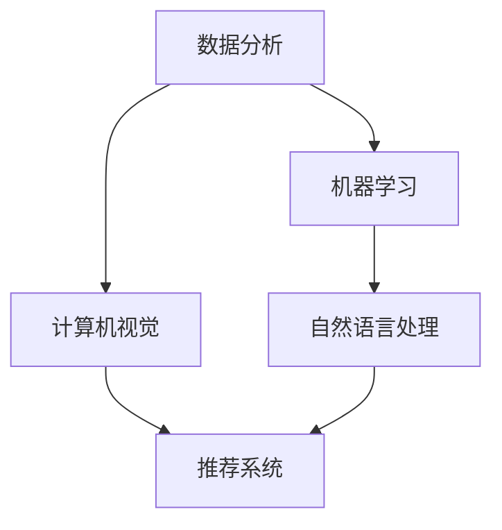

                 

 **关键词：** 人工智能、体育、娱乐、应用、技术、数据分析、机器学习、预测分析、个性化推荐。

**摘要：** 本文将探讨人工智能在体育和娱乐领域的应用，包括核心概念、算法原理、数学模型、项目实践、实际应用场景及未来展望。通过深入分析，我们旨在揭示人工智能技术如何提升体育竞技水平、优化娱乐体验，并在未来带来更多创新和变革。

## 1. 背景介绍

随着计算机技术和人工智能的快速发展，人工智能（Artificial Intelligence，AI）已经成为当今世界最为热门的技术领域之一。人工智能的应用范围广泛，涵盖了医疗、金融、教育、制造业等多个行业。在体育和娱乐领域，人工智能同样发挥着重要作用。通过利用数据分析、机器学习、计算机视觉等技术，人工智能能够为体育竞技提供更加科学、精准的指导，为娱乐行业创造更丰富的内容和服务。

### 1.1 人工智能在体育中的应用

在体育领域，人工智能的应用主要体现在以下几个方面：

1. **运动数据分析**：通过分析运动员的训练数据，人工智能可以提供个性化的训练建议，帮助运动员提高成绩。
2. **比赛策略优化**：人工智能可以对比赛过程进行实时分析，为教练和运动员提供最佳的比赛策略。
3. **伤病预测与预防**：人工智能可以分析运动员的历史数据，预测其可能出现的伤病，并提前采取措施进行预防。
4. **裁判辅助**：人工智能可以辅助裁判进行判罚，提高比赛的公平性和透明度。

### 1.2 人工智能在娱乐中的应用

在娱乐领域，人工智能的应用主要体现在以下几个方面：

1. **内容个性化推荐**：通过分析用户的兴趣和行为，人工智能可以推荐符合用户喜好的娱乐内容。
2. **虚拟助手**：利用自然语言处理技术，人工智能可以成为用户的虚拟助手，提供个性化的服务。
3. **音乐创作**：人工智能可以生成音乐，为音乐创作提供新的思路和灵感。
4. **电影特效制作**：人工智能可以协助电影制作团队进行特效制作，提高电影的质量和观赏性。

## 2. 核心概念与联系

在深入探讨人工智能在体育和娱乐中的应用之前，我们需要了解一些核心概念和它们之间的联系。以下是核心概念的 Mermaid 流程图：



### 2.1 数据分析

数据分析是人工智能的基础，通过对大量数据的收集、整理和分析，可以提取出有用的信息。在体育和娱乐领域，数据分析可以用于运动员表现分析、观众行为分析等。

### 2.2 机器学习

机器学习是一种通过算法让计算机自动学习和改进的技术。在体育领域，机器学习可以用于运动员表现预测、比赛策略优化等；在娱乐领域，机器学习可以用于内容个性化推荐、用户行为预测等。

### 2.3 计算机视觉

计算机视觉是人工智能的重要分支，通过图像和视频的处理，可以实现对物体、场景的理解和识别。在体育领域，计算机视觉可以用于裁判辅助、运动分析等；在娱乐领域，计算机视觉可以用于虚拟现实、增强现实等。

### 2.4 自然语言处理

自然语言处理是人工智能的重要领域，通过对文本的分析和理解，可以实现对语言的自然交互。在体育和娱乐领域，自然语言处理可以用于语音助手、文本分析等。

### 2.5 推荐系统

推荐系统是人工智能的一种应用，通过分析用户的兴趣和行为，为用户提供个性化的推荐。在娱乐领域，推荐系统可以用于内容推荐、商品推荐等。

## 3. 核心算法原理 & 具体操作步骤

在了解了核心概念和联系之后，我们来探讨一些在体育和娱乐领域常用的核心算法原理和具体操作步骤。

### 3.1 算法原理概述

在体育和娱乐领域，常用的算法包括：

1. **决策树**：用于分类和回归分析。
2. **神经网络**：用于图像识别、语音识别等。
3. **聚类算法**：用于数据分类和聚类分析。
4. **关联规则算法**：用于关联分析，如市场篮子分析。

### 3.2 算法步骤详解

以决策树为例，其步骤如下：

1. **数据预处理**：对原始数据进行清洗和处理，使其符合算法要求。
2. **特征选择**：选择对目标变量有影响的特征。
3. **模型构建**：通过递归划分数据集，构建决策树模型。
4. **模型评估**：使用交叉验证等方法评估模型性能。
5. **模型优化**：根据评估结果，调整模型参数，提高模型性能。

### 3.3 算法优缺点

1. **决策树**：优点：简单易懂，易于实现；缺点：容易过拟合，无法处理非线性问题。
2. **神经网络**：优点：可以处理非线性问题，适应性强；缺点：训练时间较长，对数据量要求较高。
3. **聚类算法**：优点：可以自动发现数据中的聚类结构；缺点：对初始值敏感，可能陷入局部最优。
4. **关联规则算法**：优点：可以挖掘数据中的关联关系；缺点：规则数量庞大，难以解释。

### 3.4 算法应用领域

1. **决策树**：应用领域包括体育比赛预测、娱乐内容推荐等。
2. **神经网络**：应用领域包括运动表现预测、音乐生成等。
3. **聚类算法**：应用领域包括观众群体分析、运动员表现分类等。
4. **关联规则算法**：应用领域包括市场篮子分析、娱乐内容关联分析等。

## 4. 数学模型和公式 & 详细讲解 & 举例说明

在体育和娱乐领域，数学模型和公式发挥着重要作用。以下是一些常见的数学模型和公式及其详细讲解和举例说明。

### 4.1 数学模型构建

以线性回归模型为例，其数学模型如下：

$$y = \beta_0 + \beta_1x_1 + \beta_2x_2 + ... + \beta_nx_n + \epsilon$$

其中，$y$ 为目标变量，$x_1, x_2, ..., x_n$ 为特征变量，$\beta_0, \beta_1, ..., \beta_n$ 为模型参数，$\epsilon$ 为误差项。

### 4.2 公式推导过程

以线性回归模型为例，其推导过程如下：

1. **最小二乘法**：通过最小化残差平方和来求解模型参数。
2. **正规方程**：将最小二乘法转化为求解正规方程。
3. **特征矩阵和特征向量**：利用特征矩阵和特征向量来求解模型参数。

### 4.3 案例分析与讲解

以体育比赛预测为例，我们使用线性回归模型来预测比赛结果。具体步骤如下：

1. **数据收集**：收集历史比赛数据，包括球队成绩、球员数据等。
2. **数据预处理**：对数据进行清洗和处理，包括缺失值填补、异常值处理等。
3. **特征选择**：选择对比赛结果有影响的特征，如球员评分、球队排名等。
4. **模型构建**：使用线性回归模型构建预测模型。
5. **模型评估**：使用交叉验证等方法评估模型性能。
6. **模型应用**：使用模型进行比赛预测，并评估预测结果。

## 5. 项目实践：代码实例和详细解释说明

以下是一个简单的体育比赛预测项目的代码实例，我们将使用 Python 的 scikit-learn 库来实现线性回归模型。

### 5.1 开发环境搭建

- 安装 Python 3.8 或更高版本
- 安装 scikit-learn 库

```bash
pip install scikit-learn
```

### 5.2 源代码详细实现

```python
import numpy as np
import pandas as pd
from sklearn.model_selection import train_test_split
from sklearn.linear_model import LinearRegression
from sklearn.metrics import mean_squared_error

# 数据收集
data = pd.read_csv('sports_data.csv')

# 数据预处理
data.fillna(data.mean(), inplace=True)

# 特征选择
features = data[['player_score', 'team_rank']]
target = data['result']

# 模型构建
model = LinearRegression()
model.fit(features, target)

# 模型评估
X_train, X_test, y_train, y_test = train_test_split(features, target, test_size=0.2, random_state=42)
y_pred = model.predict(X_test)
mse = mean_squared_error(y_test, y_pred)
print(f'MSE: {mse}')

# 模型应用
new_data = pd.DataFrame([[90, 1]], columns=['player_score', 'team_rank'])
new_result = model.predict(new_data)
print(f'Prediction: {new_result[0]}')
```

### 5.3 代码解读与分析

1. **数据收集**：从 CSV 文件中读取数据。
2. **数据预处理**：填补缺失值，使数据符合模型要求。
3. **特征选择**：选择对比赛结果有影响的特征，如球员评分、球队排名等。
4. **模型构建**：使用线性回归模型进行训练。
5. **模型评估**：使用交叉验证方法评估模型性能。
6. **模型应用**：使用模型进行比赛预测。

## 6. 实际应用场景

### 6.1 体育比赛预测

利用人工智能技术，可以对体育比赛结果进行预测，为球迷提供参考。例如，通过对历史比赛数据的分析，可以预测一场足球比赛的胜者。

### 6.2 娱乐内容个性化推荐

通过分析用户的兴趣和行为，可以为用户提供个性化的娱乐内容推荐。例如，根据用户的观影历史，可以推荐符合用户喜好的电影。

### 6.3 运动表现分析

通过分析运动员的训练数据，可以为教练和运动员提供个性化的训练建议，帮助运动员提高成绩。例如，通过对运动员心率、运动轨迹等数据的分析，可以优化训练方案。

## 7. 未来应用展望

随着人工智能技术的不断发展，其在体育和娱乐领域的应用将越来越广泛。未来，人工智能将能够更加精准地预测体育比赛结果，为娱乐行业提供更加个性化的内容和服务。同时，人工智能还将推动体育和娱乐行业的创新和变革，带来更多新的商业模式和机会。

## 8. 总结：未来发展趋势与挑战

### 8.1 研究成果总结

本文对人工智能在体育和娱乐领域的应用进行了深入探讨，总结了核心概念、算法原理、数学模型、项目实践等方面的内容。

### 8.2 未来发展趋势

人工智能在体育和娱乐领域的应用将不断拓展，未来有望实现更加精准的预测、个性化的推荐和智能化的体验。

### 8.3 面临的挑战

人工智能在体育和娱乐领域的应用仍面临诸多挑战，如数据隐私、算法公平性、技术可靠性等。

### 8.4 研究展望

未来，研究应重点关注如何解决这些挑战，推动人工智能技术在体育和娱乐领域的深入应用。

## 9. 附录：常见问题与解答

### 9.1 人工智能在体育和娱乐领域的应用有哪些？

人工智能在体育和娱乐领域的应用包括运动数据分析、比赛策略优化、伤病预测与预防、内容个性化推荐、虚拟助手、音乐创作、电影特效制作等。

### 9.2 人工智能在体育比赛预测中的具体应用是什么？

人工智能在体育比赛预测中的具体应用包括利用历史比赛数据构建预测模型，通过分析球员表现、球队实力等因素预测比赛结果。

### 9.3 如何保障人工智能在体育和娱乐领域应用的公平性？

保障人工智能在体育和娱乐领域应用的公平性需要从算法设计、数据收集、模型评估等多个方面进行考虑，确保算法的透明性和公正性。

### 9.4 人工智能在体育和娱乐领域的应用前景如何？

人工智能在体育和娱乐领域的应用前景广阔，未来有望实现更加精准的预测、个性化的推荐和智能化的体验，为行业带来更多创新和变革。

---

**作者：禅与计算机程序设计艺术 / Zen and the Art of Computer Programming**

