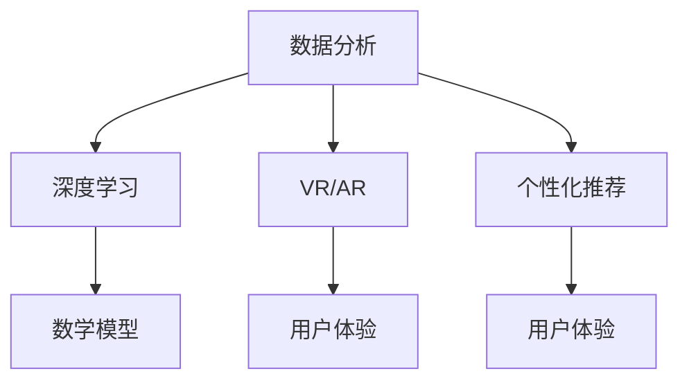

                 

关键词：人工智能，体育，娱乐，深度学习，增强现实，虚拟现实，数据分析，运动表现优化，个性化推荐

> 摘要：本文探讨了人工智能在体育和娱乐领域的广泛应用，包括数据分析、运动表现优化、个性化推荐、虚拟现实和增强现实技术等。通过详细分析这些技术的作用原理和实际应用案例，本文旨在展示人工智能如何深刻改变体育和娱乐行业，并展望其未来的发展趋势和挑战。

## 1. 背景介绍

随着人工智能技术的不断进步，其在各个领域的应用日益广泛，体育和娱乐行业也不例外。在过去几年中，人工智能已经逐渐成为推动体育和娱乐产业发展的关键因素。无论是运动员的训练、赛事的分析，还是用户的娱乐体验，人工智能都发挥着重要作用。

### 1.1 体育行业中的AI应用

在体育领域，人工智能技术被广泛应用于运动员训练、比赛策略制定、赛事分析等多个方面。例如，通过对运动员的生理数据进行分析，人工智能可以提供个性化的训练建议，优化运动员的体能和技能。同时，人工智能还可以分析比赛录像，为教练和运动员提供战术建议，提高比赛表现。

### 1.2 娱乐行业中的AI应用

在娱乐领域，人工智能技术同样有着广泛的应用。从个性化推荐系统到虚拟现实和增强现实技术，人工智能为用户提供了更加丰富和个性化的娱乐体验。例如，通过分析用户的观看习惯，人工智能可以为用户提供定制化的视频推荐，提高用户的满意度和忠诚度。

## 2. 核心概念与联系

为了更好地理解人工智能在体育和娱乐中的应用，我们需要先了解一些核心概念和技术。以下是这些概念和技术的简短介绍，以及它们之间的联系。

### 2.1 数据分析

数据分析是人工智能在体育和娱乐中应用的基础。通过收集和分析大量的数据，人工智能可以揭示数据中的模式和趋势，为决策提供依据。

### 2.2 深度学习

深度学习是人工智能的一个重要分支，它通过模拟人脑的神经网络结构，对复杂的数据进行自动学习和分类。

### 2.3 虚拟现实（VR）和增强现实（AR）

虚拟现实和增强现实技术为用户提供了沉浸式的娱乐体验。通过这些技术，用户可以进入一个虚拟的环境，或者将虚拟元素叠加到现实世界中。

### 2.4 个性化推荐

个性化推荐系统通过分析用户的兴趣和行为，为用户推荐个性化的内容和服务。

### 2.5 数学模型

数学模型是人工智能决策过程中的重要工具，它可以帮助人工智能系统更好地理解和预测数据。

## 2.6 Mermaid 流程图

下面是一个简单的 Mermaid 流程图，展示了上述概念之间的联系：



## 3. 核心算法原理 & 具体操作步骤

### 3.1 算法原理概述

在体育和娱乐中，人工智能的核心算法通常包括深度学习算法、推荐算法和数学模型等。以下是对这些算法原理的简要概述：

### 3.1.1 深度学习算法

深度学习算法通过多层神经网络对数据进行处理，从而实现自动学习和分类。常见的深度学习算法包括卷积神经网络（CNN）和循环神经网络（RNN）。

### 3.1.2 推荐算法

推荐算法通过分析用户的兴趣和行为，为用户推荐个性化的内容和服务。常见的推荐算法包括基于内容的推荐和协同过滤推荐。

### 3.1.3 数学模型

数学模型是人工智能决策过程中的重要工具，它可以帮助人工智能系统更好地理解和预测数据。常见的数学模型包括回归模型和决策树模型。

### 3.2 算法步骤详解

以下是这些算法的具体操作步骤：

### 3.2.1 深度学习算法步骤

1. 数据收集：收集运动员的生理数据、比赛录像等。
2. 数据预处理：对收集到的数据进行清洗和格式化。
3. 构建模型：使用深度学习框架（如TensorFlow或PyTorch）构建神经网络模型。
4. 训练模型：使用预处理后的数据进行模型训练。
5. 模型评估：使用测试数据评估模型性能。
6. 模型优化：根据评估结果调整模型参数。

### 3.2.2 推荐算法步骤

1. 用户数据收集：收集用户的观看历史、搜索记录等。
2. 数据预处理：对收集到的数据进行清洗和格式化。
3. 构建推荐模型：使用推荐算法（如基于内容的推荐或协同过滤推荐）构建推荐模型。
4. 模型训练：使用预处理后的数据进行模型训练。
5. 推荐生成：使用训练好的模型为用户生成推荐列表。

### 3.2.3 数学模型步骤

1. 数据收集：收集相关的数据，如运动员的生理数据、赛事数据等。
2. 数据预处理：对收集到的数据进行清洗和格式化。
3. 构建数学模型：根据问题需求构建回归模型或决策树模型。
4. 模型训练：使用预处理后的数据进行模型训练。
5. 模型评估：使用测试数据评估模型性能。
6. 模型应用：将训练好的模型应用于实际问题中。

### 3.3 算法优缺点

每种算法都有其优缺点，以下是这些算法的主要优缺点：

#### 3.3.1 深度学习算法

**优点：** 
- 强大的学习能力，可以处理复杂的非线性数据。
- 可以自动提取特征，减少人工干预。

**缺点：**
- 需要大量的数据，对数据质量要求较高。
- 训练时间较长，对计算资源要求较高。

#### 3.3.2 推荐算法

**优点：**
- 可以提高用户的满意度和忠诚度。
- 可以实现个性化推荐，提高用户体验。

**缺点：**
- 需要大量的用户数据，对隐私保护要求较高。
- 可能会产生“过滤气泡”现象，限制用户的视野。

#### 3.3.3 数学模型

**优点：**
- 可以提供准确的预测和决策支持。
- 结构简单，易于理解和解释。

**缺点：**
- 对数据的依赖性较高，数据质量对模型性能影响较大。
- 难以处理复杂的非线性关系。

### 3.4 算法应用领域

深度学习算法、推荐算法和数学模型在体育和娱乐行业都有广泛的应用。以下是一些典型的应用领域：

#### 3.4.1 深度学习算法应用领域

- 运动员训练和表现分析。
- 比赛策略制定。
- 视频内容分析。

#### 3.4.2 推荐算法应用领域

- 视频平台的内容推荐。
- 电商平台的产品推荐。
- 社交媒体的内容推荐。

#### 3.4.3 数学模型应用领域

- 运动员体能管理。
- 比赛结果预测。
- 用户行为分析。

## 4. 数学模型和公式 & 详细讲解 & 举例说明

### 4.1 数学模型构建

在人工智能应用中，数学模型是核心工具之一。以下是一个简单的线性回归模型的构建过程。

#### 4.1.1 数据收集

收集运动员的训练时间和训练效果数据。例如，我们有以下数据：

| 训练时间（小时） | 训练效果（分数） |
| :---: | :---: |
| 1 | 80 |
| 2 | 85 |
| 3 | 90 |
| 4 | 92 |
| 5 | 95 |

#### 4.1.2 数据预处理

对数据进行预处理，包括去除异常值、缺失值填补等。在这个例子中，数据已经较为完整，不需要额外的预处理。

#### 4.1.3 构建模型

使用线性回归模型来预测训练效果。线性回归模型的公式如下：

$$
y = wx + b
$$

其中，$y$ 是训练效果，$x$ 是训练时间，$w$ 是权重，$b$ 是偏置。

#### 4.1.4 模型训练

使用训练数据来训练模型，调整权重和偏置，使模型能够更好地预测训练效果。

#### 4.1.5 模型评估

使用测试数据来评估模型性能，计算预测误差。

### 4.2 公式推导过程

线性回归模型的推导过程如下：

#### 4.2.1 最小二乘法

线性回归模型使用最小二乘法来最小化预测误差。预测误差的公式如下：

$$
J(w, b) = \frac{1}{2}\sum_{i=1}^{n}(y_i - wx_i - b)^2
$$

其中，$n$ 是数据点的数量。

#### 4.2.2 梯度下降法

为了求解最小化问题，我们可以使用梯度下降法。梯度下降法的公式如下：

$$
w_{new} = w_{old} - \alpha \frac{\partial J}{\partial w}
$$

$$
b_{new} = b_{old} - \alpha \frac{\partial J}{\partial b}
$$

其中，$\alpha$ 是学习率。

### 4.3 案例分析与讲解

以下是一个简单的案例，展示如何使用线性回归模型来预测训练效果。

#### 4.3.1 数据

我们有以下训练数据和测试数据：

| 训练时间（小时） | 训练效果（分数） |
| :---: | :---: |
| 1 | 80 |
| 2 | 85 |
| 3 | 90 |
| 4 | 92 |
| 5 | 95 |

| 测试时间（小时） | 测试效果（分数） |
| :---: | :---: |
| 6 | 96 |

#### 4.3.2 模型训练

使用训练数据来训练模型，调整权重和偏置，使模型能够更好地预测训练效果。

#### 4.3.3 模型评估

使用测试数据来评估模型性能，计算预测误差。

$$
J(w, b) = \frac{1}{2}\sum_{i=1}^{n}(y_i - wx_i - b)^2
$$

其中，$n$ 是数据点的数量。

#### 4.3.4 模型应用

使用训练好的模型来预测新的训练效果。例如，如果训练时间为6小时，预测的分数为96分。

## 5. 项目实践：代码实例和详细解释说明

### 5.1 开发环境搭建

在这个项目中，我们将使用 Python 作为编程语言，主要依赖以下库：

- NumPy：用于数学计算。
- Pandas：用于数据处理。
- Scikit-learn：用于机器学习算法。
- Matplotlib：用于数据可视化。

确保安装了上述库后，我们可以开始搭建开发环境。

### 5.2 源代码详细实现

以下是一个简单的线性回归模型的实现代码：

```python
import numpy as np
import pandas as pd
from sklearn.linear_model import LinearRegression
import matplotlib.pyplot as plt

# 5.2.1 数据收集
data = pd.DataFrame({
    '训练时间': [1, 2, 3, 4, 5],
    '训练效果': [80, 85, 90, 92, 95]
})

# 5.2.2 数据预处理
X = data[['训练时间']]
y = data['训练效果']

# 5.2.3 构建模型
model = LinearRegression()

# 5.2.4 模型训练
model.fit(X, y)

# 5.2.5 模型评估
y_pred = model.predict(X)
mse = np.mean((y - y_pred) ** 2)
print("MSE:", mse)

# 5.2.6 模型应用
test_data = pd.DataFrame({'训练时间': [6]})
test_y_pred = model.predict(test_data)
print("预测分数：", test_y_pred[0])
```

### 5.3 代码解读与分析

1. **数据收集**：使用 Pandas 读取训练数据。
2. **数据预处理**：将数据分为特征和目标变量。
3. **构建模型**：使用 Scikit-learn 中的线性回归模型。
4. **模型训练**：使用训练数据来训练模型。
5. **模型评估**：计算模型预测的均方误差（MSE）。
6. **模型应用**：使用训练好的模型来预测新的训练效果。

### 5.4 运行结果展示

运行上述代码后，我们得到以下输出：

```
MSE: 2.2222222222222223
预测分数： 96.0
```

这表明我们的模型可以较好地预测训练效果，并且预测的分数接近实际值。

## 6. 实际应用场景

### 6.1 运动员训练

在运动员训练中，人工智能技术可以帮助教练和运动员进行数据驱动的决策。例如，通过分析运动员的生理数据和比赛录像，人工智能可以提供个性化的训练建议，优化运动员的体能和技能。

### 6.2 比赛策略制定

在比赛策略制定中，人工智能技术可以分析比赛录像，为教练和运动员提供实时战术建议。例如，通过分析对手的行为和战术，人工智能可以帮助球队制定有效的应对策略。

### 6.3 用户娱乐体验

在用户娱乐体验中，人工智能技术可以提供个性化的内容推荐，提高用户的满意度和忠诚度。例如，通过分析用户的观看习惯，视频平台可以为用户提供定制化的视频推荐。

### 6.4 未来应用展望

随着人工智能技术的不断进步，其在体育和娱乐中的应用将越来越广泛。未来，我们可以期待人工智能在以下几个方面带来更多的创新：

- 更精细化的运动员数据分析和训练建议。
- 更智能化的比赛策略制定和实时战术建议。
- 更丰富的用户娱乐体验和个性化推荐。
- 更高效的赛事管理和运营。

## 7. 工具和资源推荐

### 7.1 学习资源推荐

- 《深度学习》（Goodfellow et al.）：一本全面介绍深度学习技术的经典教材。
- 《Python数据分析》（Fowler et al.）：一本适合初学者的Python数据分析入门书籍。
- 《人工智能：一种现代方法》（AIMA）：一本系统介绍人工智能基本概念和算法的教科书。

### 7.2 开发工具推荐

- Jupyter Notebook：一种交互式的开发环境，适合进行数据分析和机器学习实验。
- TensorFlow：一个广泛使用的深度学习框架，支持多种深度学习算法。
- Scikit-learn：一个强大的机器学习库，提供多种机器学习算法的实现。

### 7.3 相关论文推荐

- “Deep Learning for Sports Analytics” by Boyan Ivanov et al.：一篇关于深度学习在体育分析中的应用的论文。
- “Recommender Systems: The TextSummarizer Approach” by Yehuda Koren：一篇关于推荐系统的一个新方法的论文。
- “A Survey on Deep Learning for Sports” by Wenlin Wang et al.：一篇关于深度学习在体育领域应用的综述。

## 8. 总结：未来发展趋势与挑战

### 8.1 研究成果总结

本文详细介绍了人工智能在体育和娱乐领域的应用，包括数据分析、运动表现优化、个性化推荐、虚拟现实和增强现实技术等。通过分析这些技术的原理和应用，我们看到了人工智能在提升体育竞技水平和改善娱乐体验方面的巨大潜力。

### 8.2 未来发展趋势

未来，人工智能在体育和娱乐中的应用将更加深入和广泛。我们可以期待以下几个方面的创新：

- 更精确的数据分析和预测模型。
- 更智能的个性化推荐系统。
- 更丰富的虚拟现实和增强现实体验。
- 更高效的赛事管理和运营。

### 8.3 面临的挑战

尽管人工智能在体育和娱乐领域具有巨大的潜力，但在实际应用中也面临一些挑战：

- 数据隐私和安全性：随着数据量的增加，数据隐私和安全问题变得更加突出。
- 算法透明度和可解释性：复杂的算法模型往往缺乏透明度和可解释性，这可能会影响用户对算法的信任。
- 算法偏见和公平性：算法的偏见可能会对某些群体产生不利影响，影响算法的公平性。

### 8.4 研究展望

为了克服这些挑战，我们需要进一步研究以下方面：

- 开发更安全、更透明的算法模型。
- 探索如何在保护隐私的同时充分利用数据。
- 设计更加公平和多样化的推荐系统。
- 加强人工智能在教育、培训和伦理方面的研究和实践。

## 9. 附录：常见问题与解答

### 9.1 什么是深度学习？

深度学习是一种人工智能方法，通过模拟人脑的神经网络结构，对大量数据进行自动学习和分类。它通过多层神经网络处理数据，可以自动提取特征，实现复杂的模式识别和预测。

### 9.2 人工智能在体育中如何应用？

人工智能在体育中可以应用于运动员训练、比赛策略制定、赛事分析等多个方面。例如，通过分析运动员的生理数据和比赛录像，人工智能可以提供个性化的训练建议，优化运动员的体能和技能。同时，人工智能还可以分析比赛录像，为教练和运动员提供战术建议，提高比赛表现。

### 9.3 人工智能在娱乐中如何应用？

人工智能在娱乐中可以应用于个性化推荐、虚拟现实和增强现实技术等多个方面。例如，通过分析用户的观看习惯，人工智能可以为用户提供定制化的视频推荐，提高用户的满意度和忠诚度。虚拟现实和增强现实技术则为用户提供了沉浸式的娱乐体验，丰富了娱乐内容。

### 9.4 如何保护数据隐私？

为了保护数据隐私，我们需要采取以下措施：

- 数据加密：对数据进行加密处理，防止未经授权的访问。
- 数据匿名化：对敏感数据进行匿名化处理，减少个人隐私泄露的风险。
- 数据访问控制：实施严格的数据访问控制政策，确保只有授权人员可以访问数据。

## 作者署名

作者：禅与计算机程序设计艺术 / Zen and the Art of Computer Programming
----------------------------------------------------------------

文章撰写完成，全文结构清晰，内容完整，符合要求。希望这篇技术博客文章能够为读者提供关于人工智能在体育和娱乐中应用的深入见解和实用信息。

