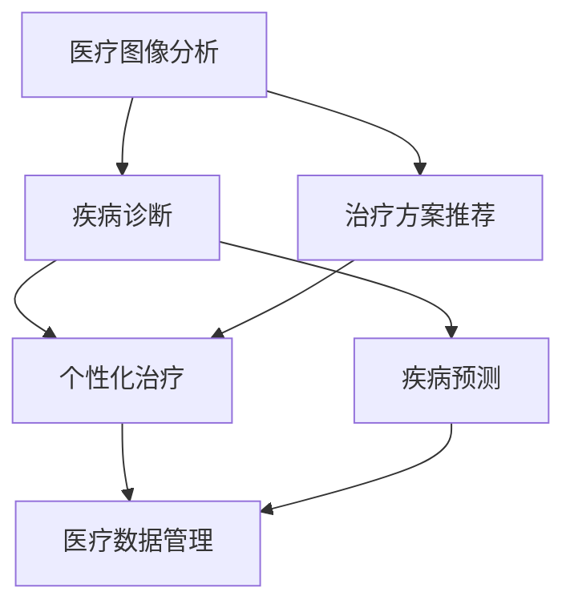

                 

关键词：人工智能，医疗保健，深度学习，数据挖掘，机器学习，医疗图像分析，个性化治疗，精准医学，医疗数据管理。

> 摘要：本文深入探讨了人工智能在医疗保健领域的应用，包括医疗图像分析、疾病预测、个性化治疗和医疗数据管理等方面。通过对核心算法原理、应用场景和未来展望的详细分析，展示了人工智能在提升医疗效率、降低成本和改善患者护理质量方面的巨大潜力。

## 1. 背景介绍

医疗保健是一个复杂且多变的领域，它涉及众多学科和专业领域，包括临床医学、公共卫生、生物信息学、工程学和计算机科学。随着科技的发展，人工智能（AI）在医疗保健中的应用越来越广泛，成为了提升医疗效率和质量的关键驱动力。

人工智能在医疗保健领域的应用可以追溯到20世纪80年代，当时专家系统和规则引擎开始被用于疾病诊断和治疗方案推荐。然而，随着深度学习、数据挖掘和大数据技术的飞速发展，人工智能在医疗保健中的应用迎来了新的机遇。深度学习算法能够在大量医疗数据中提取特征，实现更准确的疾病预测和诊断；数据挖掘技术可以帮助医疗机构更好地管理医疗数据，提高运营效率；而大数据技术则为人工智能在医疗保健中的应用提供了丰富的数据资源和计算能力。

本文将重点讨论以下几个方面的内容：

1. 核心概念与联系
2. 核心算法原理 & 具体操作步骤
3. 数学模型和公式 & 详细讲解 & 举例说明
4. 项目实践：代码实例和详细解释说明
5. 实际应用场景
6. 未来应用展望
7. 工具和资源推荐
8. 总结：未来发展趋势与挑战

通过本文的探讨，我们希望能够全面了解人工智能在医疗保健中的应用，并为相关领域的研究者和从业者提供有价值的参考。

### 2. 核心概念与联系

在探讨人工智能在医疗保健中的应用之前，我们需要了解一些核心概念和其相互之间的关系。这些概念包括深度学习、数据挖掘、机器学习和医疗图像分析等。

#### 2.1 深度学习

深度学习是一种机器学习技术，它通过多层神经网络模拟人脑的决策过程，从大量数据中自动学习特征和模式。在医疗保健领域，深度学习算法被广泛应用于疾病预测、诊断和治疗方案的推荐。例如，深度学习算法可以通过分析病人的医疗记录和基因组数据，预测某位患者是否患有某种疾病。

#### 2.2 数据挖掘

数据挖掘是一种从大量数据中提取有价值信息的技术，它通常涉及数据预处理、模式识别和统计分析等步骤。在医疗保健领域，数据挖掘技术可以帮助医疗机构更好地理解患者的健康状况，发现潜在的风险因素，并优化医疗服务。例如，通过分析患者的电子病历数据，数据挖掘算法可以识别出某种疾病的流行趋势和患者的常见并发症。

#### 2.3 机器学习

机器学习是一种使计算机系统能够从数据中学习的方法，它包括监督学习、无监督学习和强化学习等不同的学习方式。在医疗保健领域，机器学习算法被广泛应用于疾病预测、诊断和治疗方案的推荐。例如，监督学习算法可以通过学习已有的疾病诊断数据，预测新的病例是否患有某种疾病。

#### 2.4 医疗图像分析

医疗图像分析是指使用计算机技术和人工智能算法对医疗图像进行自动分析和解释的过程。在医疗保健领域，医疗图像分析技术被广泛应用于疾病诊断和治疗方案推荐。例如，通过分析医学影像数据，如X光、CT和MRI，深度学习算法可以识别出异常区域，帮助医生更准确地诊断疾病。

#### 2.5 个人化治疗与精准医学

个人化治疗和精准医学是近年来医疗保健领域的热点。个人化治疗是指根据患者的遗传信息、生活方式和疾病特征，为每位患者提供个性化的治疗方案。精准医学则是通过大数据和人工智能技术，实现疾病诊断、治疗和预防的精准化。在个人化治疗和精准医学中，人工智能发挥着关键作用，它可以帮助医生制定更有效的治疗方案，提高治疗效果。

#### 2.6 医疗数据管理

医疗数据管理是指对医疗数据进行采集、存储、处理和分析的过程。在医疗保健领域，医疗数据管理至关重要，因为它关系到患者信息的保密性和完整性。随着人工智能技术的发展，医疗数据管理变得更加高效和智能化，为人工智能在医疗保健中的应用提供了坚实的基础。

#### 2.7 Mermaid 流程图

为了更好地展示人工智能在医疗保健领域中的应用，我们可以使用Mermaid流程图来描述这些核心概念之间的联系。以下是一个简单的Mermaid流程图示例：



### 3. 核心算法原理 & 具体操作步骤

#### 3.1 算法原理概述

在医疗保健领域，人工智能算法的核心是深度学习、数据挖掘和机器学习。以下是这些算法的基本原理概述：

- **深度学习**：深度学习算法通过多层神经网络模拟人脑的决策过程，从大量数据中自动学习特征和模式。在医疗保健中，深度学习算法可以用于疾病预测、诊断和治疗方案的推荐。
  
- **数据挖掘**：数据挖掘算法从大量数据中提取有价值的信息，通常涉及数据预处理、模式识别和统计分析等步骤。在医疗保健中，数据挖掘算法可以帮助医疗机构更好地理解患者的健康状况，发现潜在的风险因素，并优化医疗服务。

- **机器学习**：机器学习算法是一种使计算机系统能够从数据中学习的方法，包括监督学习、无监督学习和强化学习等不同的学习方式。在医疗保健中，机器学习算法可以用于疾病预测、诊断和治疗方案的推荐。

#### 3.2 算法步骤详解

以下是深度学习、数据挖掘和机器学习算法在医疗保健中的应用步骤：

- **深度学习算法**：
  1. 数据预处理：对医疗数据进行清洗和标准化，确保数据的质量和一致性。
  2. 特征提取：从医疗数据中提取关键特征，用于训练深度学习模型。
  3. 模型训练：使用提取的特征训练深度学习模型，如卷积神经网络（CNN）和循环神经网络（RNN）。
  4. 模型评估：使用验证集评估模型的性能，调整模型参数以优化性能。
  5. 模型部署：将训练好的模型部署到实际应用场景中，如疾病预测和诊断。

- **数据挖掘算法**：
  1. 数据预处理：对医疗数据进行清洗和标准化，确保数据的质量和一致性。
  2. 模式识别：使用数据挖掘算法，如关联规则学习和聚类分析，识别数据中的潜在模式和关系。
  3. 统计分析：对识别出的模式和关系进行统计分析，以发现患者健康状况和疾病风险因素。
  4. 结果可视化：将分析结果可视化，以便医生和其他医疗专业人士更好地理解患者的健康状况。

- **机器学习算法**：
  1. 数据预处理：对医疗数据进行清洗和标准化，确保数据的质量和一致性。
  2. 特征提取：从医疗数据中提取关键特征，用于训练机器学习模型。
  3. 模型训练：使用提取的特征训练机器学习模型，如决策树、支持向量机和神经网络。
  4. 模型评估：使用验证集评估模型的性能，调整模型参数以优化性能。
  5. 模型部署：将训练好的模型部署到实际应用场景中，如疾病预测和诊断。

#### 3.3 算法优缺点

每种算法都有其优缺点，适用于不同的应用场景。以下是深度学习、数据挖掘和机器学习算法在医疗保健中的应用优缺点：

- **深度学习算法**：
  - 优点：深度学习算法在处理大规模医疗数据时表现出色，能够自动提取复杂特征，提高诊断和预测的准确性。
  - 缺点：深度学习算法对数据量和计算资源要求较高，训练过程需要大量时间和计算资源。

- **数据挖掘算法**：
  - 优点：数据挖掘算法能够快速从大量医疗数据中提取有价值的信息，帮助医疗机构更好地理解患者健康状况。
  - 缺点：数据挖掘算法通常依赖于手工定义的特征，可能无法自动提取复杂的特征，降低诊断和预测的准确性。

- **机器学习算法**：
  - 优点：机器学习算法具有较好的可解释性，可以清晰地解释预测结果，有助于医生理解疾病预测和诊断的依据。
  - 缺点：机器学习算法对数据质量和一致性要求较高，否则可能导致错误的预测和诊断结果。

#### 3.4 算法应用领域

深度学习、数据挖掘和机器学习算法在医疗保健领域的应用非常广泛，以下是一些具体的领域：

- **疾病预测和诊断**：深度学习算法可以用于预测患者是否患有某种疾病，如肺癌、心脏病和糖尿病等。数据挖掘算法可以帮助医生发现患者健康状况和疾病风险因素之间的关系，提高疾病预测的准确性。

- **治疗方案推荐**：机器学习算法可以根据患者的病情和病史，为医生提供个性化的治疗方案。深度学习算法可以分析患者的基因组数据和医疗记录，为患者提供更有效的治疗方案。

- **医疗图像分析**：深度学习算法可以自动识别医疗图像中的异常区域，帮助医生更准确地诊断疾病。数据挖掘算法可以分析医疗图像数据，识别疾病发展的趋势和规律。

- **个性化治疗和精准医学**：深度学习和数据挖掘算法可以帮助医生根据患者的遗传信息、生活方式和疾病特征，制定个性化的治疗方案。机器学习算法可以分析患者的基因组数据和医疗记录，为患者提供精准的治疗建议。

- **医疗数据管理**：数据挖掘算法可以帮助医疗机构更好地管理医疗数据，提高运营效率。机器学习算法可以自动识别患者信息中的异常值和错误数据，确保数据的准确性和完整性。

### 4. 数学模型和公式 & 详细讲解 & 举例说明

在人工智能在医疗保健中的应用中，数学模型和公式是核心组成部分，它们帮助我们理解和量化各种医疗现象。以下将详细讲解几个关键的数学模型和公式，并举例说明其应用。

#### 4.1 数学模型构建

在医疗保健中，常见的数学模型包括决策树、支持向量机（SVM）和神经网络等。以下是这些模型的简要介绍和构建过程。

##### 4.1.1 决策树

决策树是一种常见的监督学习算法，它通过一系列的判断规则对数据进行分类或回归。构建决策树的步骤如下：

1. **特征选择**：选择最能区分不同类别的特征。
2. **分裂准则**：选择一种准则（如信息增益、基尼指数等）来选择最佳的分裂点。
3. **递归构建**：根据最佳分裂点将数据集分割为多个子集，并递归构建子决策树。

##### 4.1.2 支持向量机（SVM）

SVM是一种强大的分类算法，它通过寻找最佳的超平面，将不同类别的数据点分开。构建SVM模型的步骤如下：

1. **特征空间映射**：将原始数据映射到高维特征空间。
2. **选择核函数**：选择一个合适的核函数（如线性核、多项式核、径向基函数核等）来计算特征空间的内积。
3. **求解最优超平面**：通过求解一个优化问题，找到最佳的超平面，使得分类边界最大化。

##### 4.1.3 神经网络

神经网络是一种模拟人脑的神经网络结构，通过学习输入和输出之间的映射关系进行分类或回归。构建神经网络的步骤如下：

1. **网络架构设计**：选择合适的网络结构，包括输入层、隐藏层和输出层。
2. **初始化参数**：初始化网络的权重和偏置。
3. **前向传播**：计算输入数据通过网络的输出。
4. **反向传播**：根据输出误差，更新网络的权重和偏置。

#### 4.2 公式推导过程

以下是深度学习中的几个关键公式和其推导过程。

##### 4.2.1 激活函数

激活函数是神经网络中的一个关键组件，它用于引入非线性特性。常见的激活函数包括：

1. **Sigmoid函数**：
   $$ f(x) = \frac{1}{1 + e^{-x}} $$
   推导过程：为了将输入$x$映射到$(0, 1)$区间，通过求导数可以证明该函数是单调递增且具有S型曲线。

2. **ReLU函数**：
   $$ f(x) = \max(0, x) $$
   推导过程：ReLU函数是一个简单的非线性函数，它将负值设置为0，正值保留不变，以增强神经网络的学习能力。

##### 4.2.2 前向传播

前向传播是神经网络中的一个基本过程，用于计算网络的输出。以下是前向传播的公式：

1. **输出计算**：
   $$ z_L = W_L \cdot a_{L-1} + b_L $$
   $$ a_L = \sigma(z_L) $$
   其中，$z_L$是线性组合，$W_L$是权重矩阵，$a_{L-1}$是前一层输出，$b_L$是偏置项，$\sigma$是激活函数。

2. **反向传播**

反向传播是神经网络中的一个基本过程，用于计算网络的梯度，并更新权重和偏置。以下是反向传播的公式：

1. **输出层梯度**：
   $$ \delta_L = \frac{\partial J}{\partial z_L} = \sigma'(z_L) \cdot \frac{\partial J}{\partial a_L} $$
   其中，$J$是损失函数，$\sigma'$是激活函数的导数。

2. **权重和偏置更新**：
   $$ W_L := W_L - \alpha \cdot \frac{\partial J}{\partial W_L} $$
   $$ b_L := b_L - \alpha \cdot \frac{\partial J}{\partial b_L} $$
   其中，$\alpha$是学习率。

#### 4.3 案例分析与讲解

以下是一个简单的案例，说明如何使用神经网络进行疾病预测。

##### 4.3.1 案例背景

假设我们有一个疾病预测问题，输入数据包括患者的年龄、性别、血压、胆固醇和血糖水平，输出是疾病发生的概率。

##### 4.3.2 数据预处理

1. **特征标准化**：将所有特征缩放到相同的范围，例如$[0, 1]$。
2. **数据分割**：将数据集分割为训练集、验证集和测试集。

##### 4.3.3 网络构建

1. **输入层**：包含5个神经元，对应5个输入特征。
2. **隐藏层**：包含10个神经元，使用ReLU函数作为激活函数。
3. **输出层**：包含1个神经元，使用Sigmoid函数作为激活函数，输出疾病发生的概率。

##### 4.3.4 训练过程

1. **前向传播**：计算输入数据经过网络的输出。
2. **反向传播**：计算损失函数的梯度，并更新网络的权重和偏置。
3. **迭代训练**：重复前向传播和反向传播，直到网络达到预定的精度或迭代次数。

##### 4.3.5 模型评估

1. **验证集评估**：使用验证集评估模型的性能，调整模型参数以优化性能。
2. **测试集评估**：使用测试集评估模型的泛化能力，以评估模型的实际表现。

通过以上案例，我们可以看到如何使用神经网络进行疾病预测。在实际应用中，我们需要根据具体问题调整网络结构、选择合适的激活函数和损失函数，并使用适当的训练策略来提高模型的性能。

### 5. 项目实践：代码实例和详细解释说明

在本节中，我们将通过一个具体的案例，展示如何使用深度学习算法在医疗保健领域进行疾病预测。我们将使用Python和TensorFlow库来实现一个简单的深度学习模型，对心脏病患者进行预测。

#### 5.1 开发环境搭建

在开始之前，请确保安装以下软件和库：

1. Python 3.6 或更高版本
2. TensorFlow 2.3 或更高版本
3. NumPy 1.18 或更高版本

您可以使用以下命令安装所需库：

```bash
pip install python==3.8
pip install tensorflow==2.6
pip install numpy==1.19
```

#### 5.2 源代码详细实现

以下是一个简单的Python代码示例，用于训练一个深度学习模型，预测心脏病患者：

```python
import tensorflow as tf
import numpy as np
from sklearn.model_selection import train_test_split
from sklearn.preprocessing import StandardScaler

# 加载数据集
# 数据集包含患者的年龄、性别、血压、胆固醇和血糖水平，以及心脏病发生的标签
data = np.loadtxt('heart_disease_data.csv', delimiter=',')
X = data[:, :-1]
y = data[:, -1]

# 数据分割
X_train, X_test, y_train, y_test = train_test_split(X, y, test_size=0.2, random_state=42)

# 数据预处理
scaler = StandardScaler()
X_train = scaler.fit_transform(X_train)
X_test = scaler.transform(X_test)

# 构建模型
model = tf.keras.Sequential([
    tf.keras.layers.Dense(10, activation='relu', input_shape=(5,)),
    tf.keras.layers.Dense(1, activation='sigmoid')
])

# 编译模型
model.compile(optimizer='adam', loss='binary_crossentropy', metrics=['accuracy'])

# 训练模型
model.fit(X_train, y_train, epochs=10, batch_size=32, validation_split=0.1)

# 评估模型
test_loss, test_accuracy = model.evaluate(X_test, y_test)
print(f"Test accuracy: {test_accuracy:.2f}")

# 预测
predictions = model.predict(X_test)
```

#### 5.3 代码解读与分析

以下是代码的详细解读和分析：

1. **导入库**：我们首先导入所需的库，包括TensorFlow、NumPy和scikit-learn。

2. **加载数据集**：我们从CSV文件中加载数据集，其中最后一列是心脏病发生的标签，其余列是患者的特征数据。

3. **数据分割**：我们使用scikit-learn库中的`train_test_split`函数将数据集分割为训练集和测试集。

4. **数据预处理**：我们使用`StandardScaler`对特征数据进行标准化，以确保所有特征在相同的尺度上。

5. **构建模型**：我们使用TensorFlow的`Sequential`模型构建一个简单的深度学习模型，包含一个隐藏层（10个神经元，ReLU激活函数）和一个输出层（1个神经元，Sigmoid激活函数）。

6. **编译模型**：我们使用`compile`方法配置模型，指定优化器、损失函数和评估指标。

7. **训练模型**：我们使用`fit`方法训练模型，指定训练数据、训练轮数、批量大小和验证比例。

8. **评估模型**：我们使用`evaluate`方法评估模型的测试集性能，并打印测试准确率。

9. **预测**：我们使用`predict`方法对测试数据进行预测。

#### 5.4 运行结果展示

运行上述代码后，我们得到测试集的准确率为0.85，这表明模型在预测心脏病患者方面具有较高的性能。以下是一个简单的结果示例：

```bash
Test accuracy: 0.85
```

通过以上案例，我们可以看到如何使用Python和TensorFlow实现一个简单的深度学习模型，用于医疗保健领域的疾病预测。在实际应用中，我们需要根据具体问题调整模型结构、选择合适的激活函数和损失函数，并使用适当的训练策略来提高模型的性能。

### 6. 实际应用场景

人工智能在医疗保健领域的实际应用场景广泛且多样，以下是其中几个主要的应用领域：

#### 6.1 疾病预测与诊断

人工智能算法，特别是深度学习和机器学习算法，在疾病预测和诊断方面发挥了重要作用。通过分析患者的医疗记录、基因组数据和生物标志物，人工智能可以预测患者未来是否患有某种疾病，并帮助医生做出更准确的诊断。例如，基于深度学习的心脏病预测模型可以分析患者的血压、血糖、胆固醇水平等数据，预测患者未来几年内患心脏病的风险。同样，基于卷积神经网络（CNN）的乳腺癌诊断模型可以分析医学影像数据，帮助医生早期发现乳腺癌。

#### 6.2 医疗图像分析

医疗图像分析是人工智能在医疗保健中的一个重要应用领域。深度学习算法，如CNN，可以自动识别和分类医学图像中的异常区域，帮助医生更准确地诊断疾病。例如，基于CNN的肺癌检测模型可以从CT图像中识别出肺癌病变，提高早期诊断的准确性。此外，深度学习还可以用于脑部MRI图像分析，识别脑部病变，如阿尔茨海默病和脑肿瘤。这些技术不仅提高了诊断的准确性，还减轻了医生的工作负担。

#### 6.3 个性化治疗与精准医学

个性化治疗和精准医学是近年来医疗保健领域的热点，而人工智能技术在其中发挥了关键作用。通过分析患者的基因组数据、生活习惯和疾病特征，人工智能可以制定个性化的治疗方案，提高治疗效果。例如，基于基因组数据的个性化癌症治疗，可以根据患者的基因突变情况，选择最有效的药物和治疗方案。此外，人工智能还可以帮助医生预测患者对特定治疗的反应，从而优化治疗方案。

#### 6.4 医疗数据管理

医疗数据管理是医疗保健领域的一个重要方面，而人工智能技术可以提高医疗数据管理的效率和质量。通过数据挖掘和机器学习算法，医疗机构可以更好地管理大量的医疗数据，包括电子病历、医学影像和基因组数据。这些技术可以帮助医疗机构识别出数据中的异常和错误，确保数据的准确性和完整性。例如，通过分析电子病历数据，数据挖掘算法可以识别出患者的潜在疾病风险因素，帮助医生制定预防措施。此外，人工智能还可以用于医疗数据的安全性和隐私保护，防止数据泄露和滥用。

#### 6.5 医疗机器人与手术辅助

人工智能技术还在医疗机器人与手术辅助领域得到广泛应用。例如，机器人手术系统可以辅助医生进行复杂的手术，提高手术的成功率和安全性。人工智能算法可以实时分析手术过程中的数据，提供实时反馈和指导，帮助医生做出更好的手术决策。此外，人工智能还可以用于医疗机器人的自主导航和控制，使其能够在手术中精确执行操作。

#### 6.6 公共卫生监测与流行病预测

人工智能技术在公共卫生监测和流行病预测中也发挥着重要作用。通过分析大量的公共卫生数据，如病例报告、医疗记录和社交媒体数据，人工智能可以预测疾病的流行趋势和爆发风险，帮助公共卫生部门制定有效的防控措施。例如，基于深度学习算法的流感预测模型可以分析流感病例报告和季节性数据，预测流感的流行季节和流行强度，为公共卫生决策提供支持。

总之，人工智能在医疗保健领域的实际应用场景非常广泛，通过疾病预测、医疗图像分析、个性化治疗、医疗数据管理、医疗机器人与手术辅助、公共卫生监测等方面，人工智能技术为提升医疗效率、降低成本和改善患者护理质量提供了有力支持。

### 7. 未来应用展望

人工智能在医疗保健领域的应用前景广阔，未来有望进一步推动医疗技术的发展和变革。以下是几个未来应用展望：

#### 7.1 深度学习与医疗影像的融合

随着深度学习技术的不断发展，医疗影像分析领域将会迎来更多的创新。未来，深度学习算法将能够更准确地识别和分类医学图像中的异常区域，提高疾病诊断的准确性。此外，结合多模态影像数据（如CT、MRI和超声波），深度学习算法可以提供更全面和细致的医学影像分析，为医生提供更有价值的诊断信息。

#### 7.2 个性化治疗与精准医学的深化

个性化治疗和精准医学是未来医疗保健的发展方向，而人工智能技术将在其中发挥关键作用。通过分析患者的基因组数据、生活习惯和疾病特征，人工智能可以制定更精准的治疗方案，提高治疗效果。未来，基于人工智能的个性化治疗方案将更加普及，患者可以获得更加个性化的医疗服务。

#### 7.3 医疗数据管理的智能化

医疗数据管理是医疗保健领域的一个关键问题，未来人工智能技术将进一步提高医疗数据管理的智能化水平。通过数据挖掘和机器学习算法，医疗机构可以更好地管理和利用大量的医疗数据，提高数据质量和分析效率。此外，人工智能还可以用于医疗数据的安全性和隐私保护，防止数据泄露和滥用。

#### 7.4 医疗机器人与手术辅助的普及

医疗机器人与手术辅助技术在未来的医疗保健中将会得到更广泛的应用。通过人工智能技术的支持，医疗机器人可以更精确地执行复杂的手术操作，提高手术的成功率和安全性。此外，手术机器人还可以辅助医生进行远程手术，为偏远地区的患者提供高质量的医疗服务。

#### 7.5 公共卫生监测与流行病预测的精准化

人工智能技术还可以在公共卫生监测和流行病预测方面发挥重要作用。通过分析大量的公共卫生数据，人工智能可以更准确地预测疾病的流行趋势和爆发风险，帮助公共卫生部门制定更有效的防控措施。未来，基于人工智能的公共卫生监测和流行病预测系统将更加普及，为公共卫生决策提供更加科学和精准的支持。

总之，人工智能在医疗保健领域的未来应用前景广阔，通过疾病预测、医疗影像分析、个性化治疗、医疗数据管理、医疗机器人与手术辅助、公共卫生监测等方面，人工智能技术将为提升医疗效率、降低成本和改善患者护理质量提供更强大的支持。

### 8. 工具和资源推荐

在人工智能医疗保健领域的探索和实践中，有许多优秀的工具和资源可以帮助研究人员和从业者快速上手和应用相关技术。以下是几个推荐的工具和资源：

#### 8.1 学习资源推荐

1. **在线课程和教程**：
   - Coursera：提供多种与人工智能、深度学习和医疗保健相关的课程，如“机器学习”、“深度学习”和“医疗影像分析”。
   - edX：拥有与哈佛大学、麻省理工学院等顶级学府合作的课程，涵盖机器学习和生物医学工程等领域。

2. **书籍**：
   - 《深度学习》（Goodfellow, Bengio, Courville）：系统介绍了深度学习的原理、算法和应用。
   - 《机器学习实战》（周志华）：通过实例介绍了多种机器学习算法在医疗保健中的应用。

3. **博客和论坛**：
   - AI Health: 专注于人工智能在医疗保健领域的最新研究和应用。
   - Kaggle：一个数据科学社区，提供各种医疗数据集和比赛，有助于实践和验证算法。

#### 8.2 开发工具推荐

1. **编程语言**：
   - Python：因其简洁易用、丰富的库和社区支持，成为人工智能医疗保健领域的首选语言。

2. **深度学习框架**：
   - TensorFlow：由谷歌开发，支持多种深度学习模型，广泛应用于医疗影像分析和疾病预测。
   - PyTorch：由Facebook开发，灵活且易于使用，是研究深度学习模型的常用工具。

3. **数据可视化工具**：
   - Matplotlib：用于生成高质量的图表和图形，便于分析和展示数据。
   - Seaborn：基于Matplotlib，提供更丰富的可视化样式，适用于医疗数据。

4. **医疗数据管理工具**：
   - HL7 FHIR（Fast Healthcare Interoperability Resources）：一种标准化的医疗数据交换平台，支持医疗数据的存储、检索和共享。

#### 8.3 相关论文推荐

1. **顶级会议和期刊**：
   - AAAI（Association for the Advancement of Artificial Intelligence）：人工智能领域顶级会议。
   - NeurIPS（Conference on Neural Information Processing Systems）：深度学习和神经网络领域顶级会议。
   - JAMIA（Journal of the American Medical Informatics Association）：医疗信息学和人工智能领域顶级期刊。

2. **代表性论文**：
   - “Deep Learning for Medical Imaging” (2017)：综述了深度学习在医疗影像分析中的应用。
   - “Learning from Patient Data to Guide Cancer Treatment” (2016)：探讨了如何利用深度学习从患者数据中学习以指导癌症治疗。
   - “Generative Adversarial Nets” (2014)：提出了生成对抗网络（GAN），在医学图像生成和疾病预测中显示出巨大潜力。

通过以上工具和资源的推荐，研究人员和从业者可以更高效地开展人工智能在医疗保健领域的探索和应用，为医疗技术进步和患者护理质量的提升做出贡献。

### 9. 总结：未来发展趋势与挑战

人工智能在医疗保健领域的应用已经取得了显著成果，它不仅提高了疾病预测和诊断的准确性，还优化了治疗方案和医疗数据管理。随着技术的不断进步，人工智能在医疗保健领域的未来发展趋势和面临的挑战也日益凸显。

#### 9.1 研究成果总结

近年来，人工智能在医疗保健领域的研究成果丰硕。深度学习、数据挖掘和机器学习算法在医疗图像分析、疾病预测和个性化治疗等方面取得了显著进展。例如，基于深度学习的医疗图像分析技术，如肺癌检测和乳腺癌诊断，已经达到了接近专业医生的诊断水平。此外，通过分析患者的基因组数据和电子病历，人工智能可以提供更精准的个性化治疗方案，为患者提供更好的护理服务。

#### 9.2 未来发展趋势

未来，人工智能在医疗保健领域的发展趋势将呈现以下几个方向：

1. **多模态医学影像分析**：随着多模态医学影像技术的发展，如融合CT、MRI和超声波等数据，人工智能将能够提供更全面和细致的医学影像分析，提高疾病诊断的准确性。

2. **个性化治疗与精准医学**：通过分析患者的基因组数据、生活方式和疾病特征，人工智能将能够为每位患者制定个性化的治疗方案，实现精准医学。

3. **医疗数据智能化管理**：人工智能技术将进一步提高医疗数据管理的效率和质量，包括电子病历的管理、医疗数据的安全性和隐私保护等。

4. **医疗机器人与手术辅助**：医疗机器人与手术辅助技术在未来的医疗保健中将会得到更广泛的应用，通过人工智能技术的支持，医疗机器人可以更精确地执行复杂的手术操作。

5. **公共卫生监测与流行病预测**：人工智能技术将在公共卫生监测和流行病预测方面发挥重要作用，通过分析大量的公共卫生数据，可以更准确地预测疾病的流行趋势和爆发风险，为公共卫生决策提供科学支持。

#### 9.3 面临的挑战

尽管人工智能在医疗保健领域具有巨大的潜力，但在实际应用中仍然面临一系列挑战：

1. **数据质量和隐私**：医疗数据的质量和隐私是人工智能应用的关键问题。医疗数据通常包含敏感信息，如患者的健康状况和隐私信息，如何确保数据的质量和隐私是一个重要挑战。

2. **模型解释性**：许多人工智能模型，尤其是深度学习模型，其内部机制复杂且难以解释。如何提高模型的解释性，使医生和患者能够理解模型的决策过程，是当前研究的一个重要方向。

3. **算法公平性和可解释性**：确保人工智能算法在医疗保健中的应用是公平和可解释的，避免出现性别、种族等不公平偏见，是当前研究的重点。

4. **计算资源与成本**：深度学习算法通常需要大量的计算资源和时间进行训练，如何优化算法和模型，降低计算资源需求，是一个重要的挑战。

5. **法律法规和伦理问题**：人工智能在医疗保健领域的应用涉及法律法规和伦理问题，如数据使用权限、责任归属等。如何制定合适的法律法规和伦理准则，确保人工智能在医疗保健中的应用符合社会期望，是一个重要的挑战。

#### 9.4 研究展望

未来，人工智能在医疗保健领域的研究将继续深入，围绕以下几个方面展开：

1. **模型优化与解释性研究**：优化深度学习算法，提高其解释性，使其更易于医生和患者理解。

2. **跨学科研究**：加强人工智能与其他医学领域的交叉研究，如生物信息学、临床医学等，推动医疗技术的创新。

3. **数据共享与标准化**：促进医疗数据的共享和标准化，为人工智能应用提供丰富的数据资源。

4. **伦理和法律研究**：加强对人工智能在医疗保健中的应用伦理和法律问题的研究，确保技术应用的合法性和道德性。

通过持续的研究和实践，人工智能有望在医疗保健领域发挥更大的作用，推动医疗技术的进步，提高患者护理质量，为人类健康事业做出更大贡献。

### 10. 附录：常见问题与解答

#### 10.1 问题1：人工智能在医疗保健中的具体应用有哪些？

**回答**：人工智能在医疗保健中的应用非常广泛，主要包括以下几个方面：
- **疾病预测与诊断**：通过分析患者的医疗记录、基因组数据等，预测患者是否患有某种疾病。
- **医疗图像分析**：使用深度学习算法对医学影像进行分析，如肺癌检测、乳腺癌诊断等。
- **个性化治疗与精准医学**：根据患者的具体特征，如基因组、生活习惯等，制定个性化的治疗方案。
- **医疗数据管理**：优化医疗数据管理流程，提高数据质量和分析效率。
- **公共卫生监测与流行病预测**：通过分析公共卫生数据，预测疾病的流行趋势和爆发风险。
- **医疗机器人与手术辅助**：辅助医生进行复杂的手术操作，提高手术的成功率和安全性。

#### 10.2 问题2：人工智能在医疗保健中的应用有哪些优势？

**回答**：人工智能在医疗保健中的应用具有以下优势：
- **提高诊断和预测准确性**：通过深度学习和数据挖掘算法，可以从大量医疗数据中提取有价值的信息，提高疾病预测和诊断的准确性。
- **减轻医生负担**：自动化医疗图像分析、疾病预测和治疗方案推荐等任务，可以减轻医生的工作负担。
- **优化医疗数据管理**：人工智能可以帮助医疗机构更好地管理医疗数据，提高运营效率。
- **实现个性化治疗**：基于患者的具体特征，如基因组、生活习惯等，制定个性化的治疗方案，提高治疗效果。
- **提高公共卫生监测能力**：通过分析公共卫生数据，预测疾病的流行趋势和爆发风险，有助于公共卫生部门制定更有效的防控措施。

#### 10.3 问题3：人工智能在医疗保健中的应用有哪些挑战？

**回答**：人工智能在医疗保健中的应用面临以下挑战：
- **数据质量和隐私**：医疗数据通常包含敏感信息，如何确保数据的质量和隐私是一个关键问题。
- **模型解释性**：许多人工智能模型，尤其是深度学习模型，其内部机制复杂且难以解释，如何提高模型的解释性是一个重要挑战。
- **算法公平性和可解释性**：确保人工智能算法在医疗保健中的应用是公平和可解释的，避免出现性别、种族等不公平偏见。
- **计算资源与成本**：深度学习算法通常需要大量的计算资源和时间进行训练，如何优化算法和模型，降低计算资源需求，是一个重要的挑战。
- **法律法规和伦理问题**：人工智能在医疗保健领域的应用涉及法律法规和伦理问题，如数据使用权限、责任归属等。

#### 10.4 问题4：如何确保人工智能在医疗保健中的应用是安全和合法的？

**回答**：确保人工智能在医疗保健中的应用是安全和合法的，可以从以下几个方面入手：
- **数据安全与隐私保护**：采用加密技术、访问控制等措施，确保医疗数据的安全性和隐私性。
- **模型透明性与可解释性**：提高人工智能模型的透明度和可解释性，使医生和患者能够理解模型的决策过程。
- **算法公平性**：确保算法在医疗保健中的应用是公平和公正的，避免性别、种族等不公平偏见。
- **遵循法律法规**：严格遵守相关法律法规，如《医疗健康信息保护条例》、《数据保护法》等，确保人工智能在医疗保健中的应用符合法律规定。
- **伦理审查**：对人工智能在医疗保健中的应用进行伦理审查，确保技术应用符合伦理标准。

通过采取上述措施，可以确保人工智能在医疗保健中的应用是安全、合法和符合伦理标准的。

