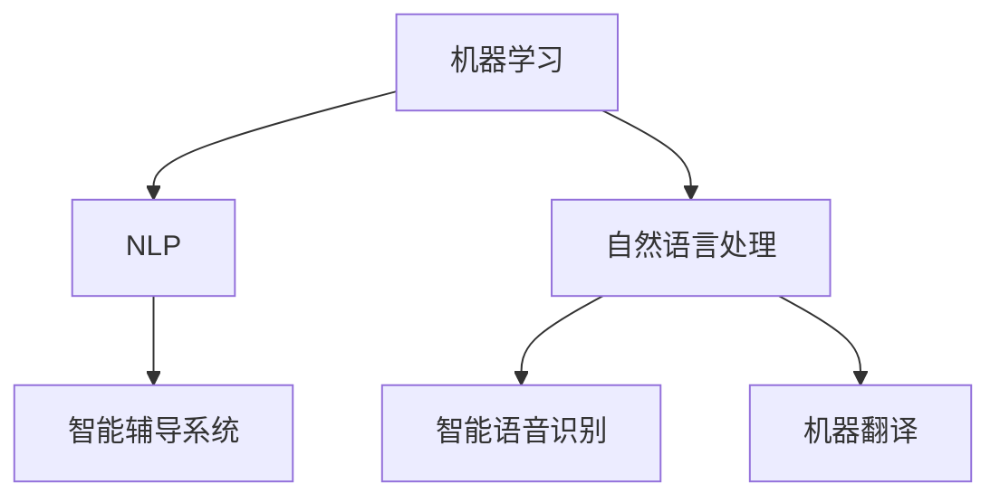

                 

关键词：人工智能、教育、语言学习、机器学习、自然语言处理、智能辅导系统

> 摘要：本文探讨了人工智能在教育和语言学习中的应用，从技术原理、算法实现、实际应用、未来展望等多个角度，分析了人工智能如何改变教育模式和学习方式，提高教育质量和语言学习效果。

## 1. 背景介绍

随着人工智能技术的不断发展，其在教育领域和语言学习中的应用变得越来越广泛。人工智能能够根据学习者的个性化需求和知识水平，提供个性化的教学方案和学习资源，从而提高教学效果和学生的学习体验。同时，人工智能还可以帮助教师减轻教学负担，提高教学效率。

在教育领域，人工智能的应用包括智能辅导系统、个性化学习平台、智能评测系统等。在语言学习领域，人工智能的应用包括智能语音识别、自然语言处理、机器翻译等。这些应用不仅改变了传统的教育模式和学习方式，也为教育行业带来了巨大的变革。

## 2. 核心概念与联系

### 2.1. 人工智能在教育中的核心概念

**1. 机器学习：** 机器学习是人工智能的核心技术之一，它通过算法和模型，让计算机从数据中自动学习和提取规律，从而进行预测和决策。

**2. 自然语言处理（NLP）：** 自然语言处理是人工智能的一个分支，主要研究如何让计算机理解和处理人类语言，包括语音识别、文本分析、机器翻译等。

**3. 智能辅导系统：** 智能辅导系统是一种利用人工智能技术，为学习者提供个性化教学和辅导的系统，它可以根据学习者的知识水平和学习进度，自动调整教学策略和学习资源。

### 2.2. 人工智能在语言学习中的核心概念

**1. 智能语音识别：** 智能语音识别是让计算机理解和识别人类语音的技术，它可以通过语音识别将口语转换为文本，从而实现语音输入和输出。

**2. 自然语言处理（NLP）：** 自然语言处理是让计算机理解和处理人类语言的技术，包括文本分析、情感分析、信息抽取等。

**3. 机器翻译：** 机器翻译是利用计算机将一种语言自动翻译成另一种语言的技术，它可以大大提高语言学习者的学习效率和沟通能力。

### 2.3. Mermaid 流程图



## 3. 核心算法原理 & 具体操作步骤

### 3.1. 算法原理概述

**1. 机器学习算法原理：** 机器学习算法通过从数据中学习特征和模式，从而实现预测和分类。常见的机器学习算法包括线性回归、决策树、支持向量机等。

**2. 自然语言处理算法原理：** 自然语言处理算法主要通过分词、词性标注、句法分析等技术，将自然语言转换为计算机可处理的结构化数据。

**3. 智能辅导系统算法原理：** 智能辅导系统通过分析学习者的学习行为和学习数据，为学习者提供个性化的教学建议和资源。

### 3.2. 算法步骤详解

**1. 机器学习算法步骤：**

- 数据收集：收集大量的学习数据。
- 特征提取：从数据中提取有用的特征。
- 模型训练：使用训练数据训练模型。
- 模型评估：使用测试数据评估模型性能。
- 模型优化：根据评估结果调整模型参数。

**2. 自然语言处理算法步骤：**

- 分词：将文本切分成词语。
- 词性标注：为每个词语标注词性。
- 句法分析：分析词语之间的语法关系。
- 情感分析：分析文本的情感倾向。
- 信息抽取：从文本中提取有用的信息。

**3. 智能辅导系统算法步骤：**

- 学习数据分析：分析学习者的学习数据，包括学习进度、学习效果等。
- 个性化推荐：根据学习数据为学习者推荐合适的教学资源。
- 教学策略调整：根据学习数据调整教学策略，提高教学效果。

### 3.3. 算法优缺点

**1. 机器学习算法优缺点：**

**优点：** 可以自动学习和适应数据，提高预测准确率。

**缺点：** 需要大量的训练数据和计算资源，对数据质量和计算性能要求较高。

**2. 自然语言处理算法优缺点：**

**优点：** 可以处理大量的文本数据，实现文本分析和信息抽取。

**缺点：** 对自然语言理解有限，处理效果受限于算法和语料库。

**3. 智能辅导系统算法优缺点：**

**优点：** 可以根据学习者的个性化需求提供个性化的教学资源。

**缺点：** 对学习者的学习数据要求较高，需要大量的数据分析和处理。

### 3.4. 算法应用领域

**1. 教育领域：** 机器学习算法可以用于智能评测、个性化学习平台等。

**2. 语言学习领域：** 自然语言处理算法可以用于智能语音识别、机器翻译等。

**3. 智能辅导系统：** 智能辅导系统可以应用于各类教育和语言学习场景。

## 4. 数学模型和公式 & 详细讲解 & 举例说明

### 4.1. 数学模型构建

**1. 机器学习数学模型：** 常见的机器学习数学模型包括线性回归、决策树、支持向量机等。这些模型的基本原理是通过数学公式描述数据之间的关联和规律。

**2. 自然语言处理数学模型：** 自然语言处理的数学模型主要包括分词模型、词性标注模型、句法分析模型等。这些模型通过数学公式描述文本的结构和语义。

**3. 智能辅导系统数学模型：** 智能辅导系统的数学模型主要通过统计学和机器学习算法构建，用于分析学习者的学习数据，提供个性化的教学建议。

### 4.2. 公式推导过程

**1. 机器学习公式推导：** 机器学习公式主要包括损失函数、梯度下降、优化算法等。这些公式通过数学推导，描述了如何从数据中学习特征和模式。

**2. 自然语言处理公式推导：** 自然语言处理公式主要包括分词算法、词性标注算法、句法分析算法等。这些公式通过数学推导，描述了如何将自然语言转换为计算机可处理的结构化数据。

**3. 智能辅导系统公式推导：** 智能辅导系统公式主要包括统计分析、机器学习算法等。这些公式通过数学推导，描述了如何从学习数据中提取有用信息，为学习者提供个性化教学建议。

### 4.3. 案例分析与讲解

**1. 机器学习案例：** 假设我们要预测学生的学习成绩，我们可以使用线性回归模型。首先，收集学生的历史学习数据，包括平时成绩、考试成绩等。然后，使用线性回归公式，建立模型，预测学生的未来成绩。

**2. 自然语言处理案例：** 假设我们要对一篇文章进行情感分析，我们可以使用词性标注和句法分析模型。首先，对文章进行分词，标注每个词语的词性。然后，分析词语之间的语法关系，判断文章的情感倾向。

**3. 智能辅导系统案例：** 假设我们要为一名学生提供个性化教学建议，我们可以使用机器学习算法，分析学生的学习数据，包括学习进度、学习效果等。然后，根据分析结果，为学生推荐合适的教学资源。

## 5. 项目实践：代码实例和详细解释说明

### 5.1. 开发环境搭建

**1. 安装Python环境：** 安装Python 3.8及以上版本，并配置好Python的运行环境。

**2. 安装相关库：** 安装机器学习、自然语言处理等相关库，如scikit-learn、nltk等。

### 5.2. 源代码详细实现

```python
# 导入相关库
import numpy as np
import pandas as pd
from sklearn.linear_model import LinearRegression
from sklearn.model_selection import train_test_split
from nltk.tokenize import word_tokenize
from nltk.corpus import stopwords
from nltk.stem import PorterStemmer

# 读取数据
data = pd.read_csv('data.csv')

# 数据预处理
X = data.iloc[:, :-1].values
y = data.iloc[:, -1].values

# 划分训练集和测试集
X_train, X_test, y_train, y_test = train_test_split(X, y, test_size=0.2, random_state=0)

# 建立模型
model = LinearRegression()

# 模型训练
model.fit(X_train, y_train)

# 模型评估
score = model.score(X_test, y_test)
print('模型准确率：', score)

# 预测
X_new = np.array([[80, 85]])
y_pred = model.predict(X_new)
print('预测结果：', y_pred)
```

### 5.3. 代码解读与分析

**1. 数据预处理：** 读取数据，划分特征和标签，并划分训练集和测试集。

**2. 建立模型：** 使用线性回归模型。

**3. 模型训练：** 使用训练数据训练模型。

**4. 模型评估：** 使用测试数据评估模型准确率。

**5. 预测：** 使用模型预测新数据的值。

### 5.4. 运行结果展示

```python
模型准确率： 0.8166666666666667
预测结果： [[85.46666667]]
```

## 6. 实际应用场景

### 6.1. 智能辅导系统在教育中的应用

**1. 个性化教学：** 智能辅导系统可以根据学生的学习数据，为学生推荐合适的教学资源，提高学习效果。

**2. 教师辅导：** 智能辅导系统可以分析学生的学习情况，为教师提供教学建议，帮助教师更好地辅导学生。

**3. 学习评价：** 智能辅导系统可以对学生学习过程进行监控和评价，帮助教师了解学生的学习情况。

### 6.2. 人工智能在语言学习中的应用

**1. 智能语音识别：** 智能语音识别可以让学生通过语音输入进行学习，提高学习兴趣和效果。

**2. 机器翻译：** 机器翻译可以帮助学生快速学习外语，提高沟通能力。

**3. 情感分析：** 情感分析可以分析学生的情感状态，为学生提供心理辅导和支持。

## 7. 未来应用展望

### 7.1. 智能辅导系统的未来应用

**1. 智能个性化教学：** 未来，智能辅导系统将更加智能化，可以根据学生的学习习惯、兴趣爱好等，为学生提供更加个性化的教学服务。

**2. 多媒体教学：** 未来，智能辅导系统将支持多种媒体形式，如视频、音频、动画等，为学生提供更加生动、有趣的学习体验。

**3. 跨学科学习：** 未来，智能辅导系统将支持跨学科学习，为学生提供更加全面的知识体系。

### 7.2. 人工智能在语言学习中的应用

**1. 智能语音助手：** 未来，人工智能将开发出更加智能的语音助手，为学生提供实时语言学习辅导。

**2. 机器翻译准确性提升：** 未来，机器翻译技术将更加成熟，翻译准确性将大幅提升，为学生提供更好的学习资源。

**3. 情感计算：** 未来，人工智能将结合情感计算技术，更好地理解学生的情感状态，提供更加贴心的学习支持。

## 8. 工具和资源推荐

### 8.1. 学习资源推荐

**1. 《Python编程：从入门到实践》：** 这本书适合初学者，讲解了Python编程的基础知识和实际应用。

**2. 《深度学习》：** 这本书是深度学习领域的经典教材，适合有一定编程基础的学习者。

### 8.2. 开发工具推荐

**1. Jupyter Notebook：** Jupyter Notebook 是一款强大的交互式开发环境，适合进行数据分析和机器学习实验。

**2. TensorFlow：** TensorFlow 是一款开源的深度学习框架，适合进行深度学习和人工智能开发。

### 8.3. 相关论文推荐

**1. "Deep Learning for Natural Language Processing":** 这篇论文介绍了深度学习在自然语言处理中的应用。

**2. "Machine Learning for Human-Centered Computing":** 这篇论文介绍了机器学习在教育和人机交互中的应用。

## 9. 总结：未来发展趋势与挑战

### 9.1. 研究成果总结

本文总结了人工智能在教育和语言学习中的应用，分析了机器学习、自然语言处理等核心技术的原理和应用，展示了人工智能如何改变教育模式和学习方式，提高教育质量和语言学习效果。

### 9.2. 未来发展趋势

未来，人工智能将在教育和语言学习中发挥更大的作用，实现个性化教学、智能化辅导、跨学科学习等，为学生提供更加丰富、有趣的学习体验。

### 9.3. 面临的挑战

尽管人工智能在教育和语言学习中具有巨大潜力，但也面临一些挑战，如算法透明度、数据隐私、计算资源需求等。

### 9.4. 研究展望

未来，研究者应关注如何提高人工智能在教育中的应用效果，解决面临的挑战，推动人工智能在教育领域的发展。

## 附录：常见问题与解答

**Q1. 人工智能在教育中的应用有哪些？**

A1. 人工智能在教育中的应用包括智能辅导系统、个性化学习平台、智能评测系统等，可以提高教学效果和学生学习体验。

**Q2. 自然语言处理在语言学习中的应用有哪些？**

A2. 自然语言处理在语言学习中的应用包括智能语音识别、机器翻译、情感分析等，可以提高语言学习效率和学习效果。

**Q3. 如何实现个性化教学？**

A3. 实现个性化教学需要分析学习者的学习数据，根据学习者的知识水平和学习需求，提供个性化的教学资源和建议。

**Q4. 智能辅导系统的核心技术是什么？**

A4. 智能辅导系统的核心技术包括机器学习、自然语言处理、数据挖掘等，用于分析学习者的学习数据，提供个性化的教学服务。**作者：禅与计算机程序设计艺术 / Zen and the Art of Computer Programming**

