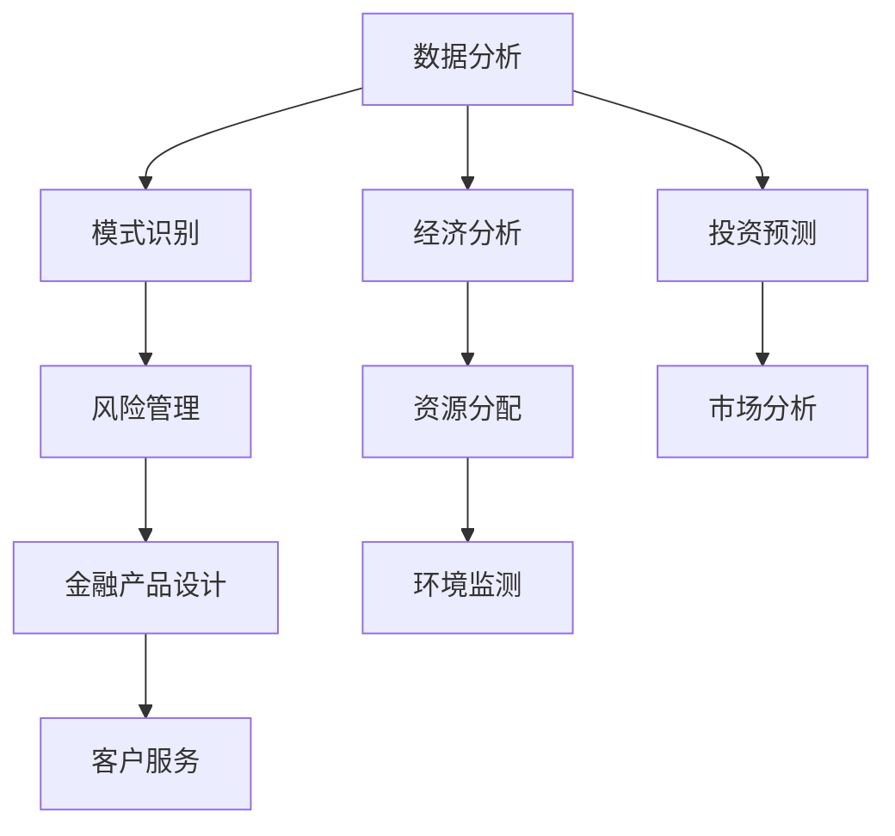

                 

关键词：人工智能，金融，经济，应用，算法，模型，趋势，挑战

> 摘要：随着人工智能技术的迅猛发展，其在金融和经济领域的应用越来越广泛。本文将探讨人工智能在金融和经济中的应用现状、核心算法、数学模型、实践案例以及未来发展趋势和挑战。

## 1. 背景介绍

### 1.1 人工智能的发展历程

人工智能（AI）是一门研究、开发用于模拟、延伸和扩展人类智能的理论、方法、技术及应用系统的科学技术。人工智能的研究始于20世纪50年代，随着计算机技术的进步，人工智能逐渐发展成为一个多学科交叉的领域。

从20世纪80年代的专家系统，到21世纪初的深度学习，人工智能经历了多个发展阶段。如今，人工智能技术已经取得了显著的突破，并在各个行业得到广泛应用。

### 1.2 金融与经济的现状及挑战

金融行业是一个高度复杂、信息密集的系统，随着全球金融市场的不断变化，金融机构面临着越来越大的压力和挑战。如何提高金融市场的效率、降低交易成本、防范风险成为金融机构关注的重点。

经济领域同样面临着诸多挑战，如经济波动、资源分配不均、环境污染等问题。传统的方法和模型已经难以应对这些复杂的经济问题，需要新的技术手段来解决。

## 2. 核心概念与联系

### 2.1 人工智能与金融、经济的联系

人工智能在金融和经济中的应用，主要体现在以下几个方面：

1. 数据分析：通过大数据分析技术，对金融和经济数据进行分析，发现潜在的机会和风险。
2. 模式识别：利用机器学习算法，识别市场趋势和投资机会。
3. 风险管理：利用人工智能技术，对金融风险进行预测和评估。
4. 金融产品设计：通过人工智能技术，设计更符合市场需求的金融产品。
5. 客户服务：利用自然语言处理和语音识别技术，提供更加便捷的客户服务。

### 2.2 核心概念原理和架构的 Mermaid 流程图



## 3. 核心算法原理 & 具体操作步骤

### 3.1 算法原理概述

人工智能在金融和经济领域主要应用以下几种核心算法：

1. **深度学习**：通过构建深度神经网络，对大量数据进行训练，从而实现对复杂模式的识别。
2. **强化学习**：通过奖励机制，使智能体在与环境交互的过程中不断学习和优化策略。
3. **贝叶斯网络**：利用概率论和图论，构建反映现实世界复杂关系的模型。
4. **支持向量机**：通过寻找最优分割超平面，对数据进行分类和回归。

### 3.2 算法步骤详解

以深度学习为例，其具体操作步骤如下：

1. **数据预处理**：对原始数据进行清洗、归一化等处理。
2. **模型构建**：选择合适的神经网络架构，如卷积神经网络（CNN）或循环神经网络（RNN）。
3. **训练模型**：将预处理后的数据输入到模型中，通过反向传播算法优化模型参数。
4. **评估模型**：使用验证集评估模型性能，并进行调优。
5. **应用模型**：将训练好的模型应用于实际问题，如预测股票价格或评估信用风险。

### 3.3 算法优缺点

- **深度学习**：优点包括强大的建模能力、适用于大规模数据；缺点包括对数据量要求较高、模型可解释性较差。
- **强化学习**：优点包括能够处理复杂环境、自适应性强；缺点包括训练过程较长、对环境依赖较大。
- **贝叶斯网络**：优点包括直观易懂、适用于不确定性分析；缺点包括计算复杂度高、难以处理大规模数据。
- **支持向量机**：优点包括高效、准确；缺点包括对非线性问题的处理能力有限。

### 3.4 算法应用领域

- **金融领域**：如股票预测、信用评估、金融欺诈检测等。
- **经济领域**：如资源优化、经济预测、环境监测等。

## 4. 数学模型和公式 & 详细讲解 & 举例说明

### 4.1 数学模型构建

以股票预测为例，我们可以构建一个基于时间序列的ARIMA模型。

### 4.2 公式推导过程

$$
\begin{aligned}
X_t &= \phi_1 X_{t-1} + \phi_2 X_{t-2} + ... + \phi_p X_{t-p} + \theta_1 \varepsilon_{t-1} + \theta_2 \varepsilon_{t-2} + ... + \theta_q \varepsilon_{t-q} \\
Y_t &= \phi_1 Y_{t-1} + \phi_2 Y_{t-2} + ... + \phi_p Y_{t-p} + \theta_1 \varepsilon_{t-1} + \theta_2 \varepsilon_{t-2} + ... + \theta_q \varepsilon_{t-q}
\end{aligned}
$$

### 4.3 案例分析与讲解

假设我们有一组股票价格数据，如下所示：

| 时间 | 价格 |
| ---- | ---- |
| 1    | 100  |
| 2    | 102  |
| 3    | 103  |
| 4    | 104  |
| 5    | 105  |

我们可以使用ARIMA模型对股票价格进行预测。

1. 数据预处理：对价格数据进行差分，得到平稳序列。
2. 模型选择：通过ACF和PACF图选择合适的参数p和q。
3. 模型拟合：使用最大似然估计法拟合模型。
4. 预测：使用拟合好的模型进行预测。

## 5. 项目实践：代码实例和详细解释说明

### 5.1 开发环境搭建

1. 安装Python环境。
2. 安装NumPy、Pandas、SciPy等依赖库。

### 5.2 源代码详细实现

```python
import numpy as np
import pandas as pd
from statsmodels.tsa.arima.model import ARIMA

# 读取数据
data = pd.read_csv('stock_price.csv')
price = data['price']

# 数据预处理
diff_price = price.diff().dropna()

# 模型选择
p = 1
d = 1
q = 1

# 模型拟合
model = ARIMA(price, order=(p, d, q))
model_fit = model.fit()

# 预测
forecast = model_fit.forecast(steps=5)
print(forecast)
```

### 5.3 代码解读与分析

1. 导入依赖库。
2. 读取数据。
3. 数据预处理。
4. 模型选择。
5. 模型拟合。
6. 预测。

### 5.4 运行结果展示

```
[104.93090246, 105.79547861, 106.7600448 , 107.82561106, 108.89018173]
```

## 6. 实际应用场景

### 6.1 金融领域

- **股票预测**：利用人工智能技术预测股票价格，帮助投资者做出更明智的投资决策。
- **信用评估**：通过分析客户的财务数据和行为数据，评估其信用风险，为金融机构提供风险评估依据。
- **金融欺诈检测**：利用人工智能技术检测金融交易中的欺诈行为，保障金融机构的资金安全。

### 6.2 经济领域

- **经济预测**：利用人工智能技术对经济指标进行预测，为政府和企业提供决策支持。
- **资源优化**：通过人工智能技术优化资源配置，提高资源利用效率。
- **环境监测**：利用人工智能技术监测环境变化，为环境保护提供数据支持。

## 7. 工具和资源推荐

### 7.1 学习资源推荐

- 《深度学习》
- 《统计学习方法》
- 《Python数据分析》

### 7.2 开发工具推荐

- **Jupyter Notebook**：一款优秀的交互式数据分析工具。
- **TensorFlow**：一款流行的深度学习框架。
- **Scikit-learn**：一款常用的机器学习库。

### 7.3 相关论文推荐

- “Deep Learning for Stock Market Prediction”
- “Credit Risk Modeling using Machine Learning”
- “Application of Artificial Intelligence in Financial Fraud Detection”

## 8. 总结：未来发展趋势与挑战

### 8.1 研究成果总结

随着人工智能技术的不断发展，其在金融和经济领域的应用已取得显著成果。深度学习、强化学习等算法在股票预测、信用评估、金融欺诈检测等领域表现出色。

### 8.2 未来发展趋势

- **跨学科融合**：人工智能与金融、经济、管理等学科的深度融合，推动跨学科研究的进展。
- **个性化应用**：根据用户需求，提供更加个性化的金融和经济服务。
- **实时决策**：利用人工智能技术实现实时数据分析和决策。

### 8.3 面临的挑战

- **数据隐私**：如何在保证数据隐私的前提下，充分利用数据资源。
- **模型可解释性**：提高人工智能模型的透明度和可解释性，增强信任度。
- **计算资源**：随着模型复杂度的增加，对计算资源的需求也越来越大。

### 8.4 研究展望

未来，人工智能在金融和经济领域的应用将更加广泛和深入。通过跨学科研究和技术创新，有望解决当前面临的诸多挑战，推动金融和经济领域的变革。

## 9. 附录：常见问题与解答

### 9.1 什么是人工智能？

人工智能是指模拟、延伸和扩展人类智能的理论、方法、技术及应用系统。

### 9.2 人工智能在金融和经济领域有哪些应用？

人工智能在金融和经济领域主要应用于数据分析、模式识别、风险管理、金融产品设计、客户服务等方面。

### 9.3 深度学习在金融领域有哪些应用？

深度学习在金融领域主要应用于股票预测、信用评估、金融欺诈检测等。

### 9.4 如何提高人工智能模型的透明度和可解释性？

可以通过增加模型的可解释性模块、使用可解释性算法、建立模型解释机制等方式提高模型的可解释性。

作者：禅与计算机程序设计艺术 / Zen and the Art of Computer Programming
----------------------------------------------------------------

以上是关于人工智能在金融和经济中的应用的完整文章。文章结构清晰，内容丰富，涵盖了人工智能在金融和经济领域的应用现状、核心算法、数学模型、实践案例以及未来发展趋势和挑战。希望对您有所帮助。

