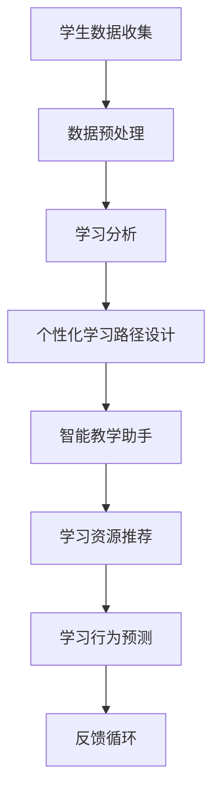

                 

关键词：人工智能、教育变革、教育技术、学习模型、教学应用、未来教育、机器学习、深度学习。

> 摘要：本文深入探讨了人工智能如何成为教育变革的催化剂，分析了人工智能在教育领域的核心概念、技术原理、算法应用、数学模型以及实际项目实践。文章旨在为教育工作者和学者提供一份全面的人工智能教育应用指南，并展望其未来的发展趋势与挑战。

## 1. 背景介绍

在过去的几十年中，人工智能（AI）已经成为科技领域的热点。随着计算能力的提升和数据量的爆炸式增长，人工智能在多个领域取得了显著的进展，包括自然语言处理、计算机视觉、推荐系统等。与此同时，教育的需求也在不断变化，人们越来越意识到个性化学习、终身学习以及跨学科教育的重要性。这种背景下，人工智能与教育的结合显得尤为重要。

教育变革的需求源自多个方面。首先，传统的教育模式往往难以满足个性化学习的需求，每个学生的发展速度和兴趣点都不同，需要更加灵活的教学方法。其次，随着全球化的发展，国际交流日益频繁，教育需要更具有包容性和多元性。此外，信息技术的普及使得学习资源更加丰富，但同时也带来了信息过载的问题。如何有效利用这些资源，提高学习的效率和质量，成为教育领域的重要挑战。

人工智能的兴起为教育变革提供了新的机遇和可能性。通过利用机器学习和深度学习等技术，人工智能可以帮助教育工作者更好地理解学生的学习行为和需求，设计个性化的学习路径，提高教学效果。同时，人工智能还可以协助教育机构进行资源分配、课程设计和评估等工作，从而提高整体的教育质量。

## 2. 核心概念与联系

### 2.1 人工智能的基本概念

人工智能（AI）是指通过计算机模拟人类智能的过程，使计算机系统能够执行通常需要人类智能才能完成的任务。人工智能的基本概念包括以下几个关键点：

1. **机器学习（Machine Learning）**：机器学习是一种人工智能的分支，通过数据和算法让计算机自动改进性能，而无需显式地编写规则。常见的机器学习算法包括决策树、支持向量机、神经网络等。
2. **深度学习（Deep Learning）**：深度学习是机器学习的一种，通过多层神经网络来提取数据特征，并用于分类、回归等任务。深度学习在图像识别、语音识别等领域取得了显著成果。
3. **自然语言处理（Natural Language Processing, NLP）**：自然语言处理是研究如何让计算机理解和处理自然语言的技术，包括文本分类、情感分析、机器翻译等。
4. **计算机视觉（Computer Vision）**：计算机视觉是使计算机能够从图像或视频中提取信息的技术，广泛应用于图像识别、人脸识别、目标检测等。

### 2.2 教育技术的核心概念

在教育领域，人工智能的应用主要体现在以下方面：

1. **个性化学习（Personalized Learning）**：个性化学习旨在根据学生的兴趣、能力和学习进度，提供个性化的学习内容和路径，以满足学生的个性化需求。
2. **智能教学助手（Intelligent Teaching Assistant）**：智能教学助手利用人工智能技术，协助教师进行教学活动，如自动化批改作业、提供学习建议等。
3. **学习分析（Learning Analytics）**：学习分析利用数据挖掘和机器学习技术，对学生的学习行为进行分析，以提供改进教学和学习的策略。
4. **虚拟教师（Virtual Teacher）**：虚拟教师是利用人工智能技术构建的虚拟教学系统，可以为学生提供互动的、个性化的学习体验。

### 2.3 人工智能与教育技术的联系

人工智能与教育技术的结合主要体现在以下几个方面：

1. **数据驱动的教学决策**：通过收集和分析学生的学习数据，人工智能可以帮助教师更好地了解学生的学习状态，从而做出更有效的教学决策。
2. **个性化学习路径设计**：人工智能可以根据学生的学习行为和兴趣，自动生成个性化的学习路径，帮助学生更高效地学习。
3. **智能学习资源推荐**：人工智能可以根据学生的学习需求和进度，推荐相关的学习资源，帮助学生更快捷地获取所需知识。
4. **学习行为预测**：通过分析学生的学习行为数据，人工智能可以预测学生的学习成果和潜在问题，从而提前进行干预。

### 2.4 人工智能在教育技术的应用架构

为了更好地理解人工智能在教育技术的应用，我们可以通过一个 Mermaid 流程图来展示其核心架构：



这个流程图展示了从学生数据收集、数据预处理、学习分析、个性化学习路径设计、智能教学助手、学习资源推荐到学习行为预测的完整流程，并通过反馈循环不断优化教育过程。

## 3. 核心算法原理 & 具体操作步骤

### 3.1 算法原理概述

在教育技术中，人工智能的核心算法主要涉及机器学习、深度学习和自然语言处理等领域。以下是这些算法的基本原理概述：

1. **机器学习**：机器学习通过训练模型来发现数据中的模式和关系。常见的机器学习算法包括线性回归、决策树、支持向量机和神经网络等。
2. **深度学习**：深度学习是一种特殊的机器学习算法，通过多层神经网络来提取数据特征，并用于分类、回归等任务。深度学习在图像识别、语音识别等领域取得了显著成果。
3. **自然语言处理**：自然语言处理是一种让计算机理解和生成自然语言的技术，包括文本分类、情感分析、机器翻译等。

### 3.2 算法步骤详解

1. **数据收集与预处理**：
   - 数据收集：从各种来源（如学习平台、教育管理系统等）收集学生行为数据、考试成绩、学习进度等。
   - 数据预处理：清洗数据、去除噪声、归一化处理，以便用于模型训练。

2. **特征提取**：
   - 特征提取：从原始数据中提取有用的特征，如学生参与度、学习时间、考试成绩等。

3. **模型训练**：
   - 模型选择：选择合适的机器学习或深度学习模型，如线性回归、决策树、神经网络等。
   - 模型训练：使用训练数据对模型进行训练，以最小化预测误差。

4. **模型评估与优化**：
   - 模型评估：使用测试数据评估模型的性能，如准确率、召回率、F1 分数等。
   - 模型优化：通过调整模型参数或使用更复杂的模型来提高性能。

5. **应用部署**：
   - 应用部署：将训练好的模型部署到生产环境中，如学习平台、智能教学助手等。

### 3.3 算法优缺点

**优点**：

- **个性化学习**：通过分析学生的学习行为和兴趣，人工智能可以帮助教育工作者提供个性化的学习内容和建议。
- **提高学习效率**：智能教学助手可以自动化批改作业、提供学习建议，从而减少教师的负担，提高学生的学习效率。
- **实时反馈**：人工智能可以实时分析学生的学习行为和成果，提供即时反馈和调整。

**缺点**：

- **数据隐私问题**：收集和分析学生的学习数据可能涉及隐私问题，需要妥善处理。
- **模型偏差**：如果训练数据存在偏差，模型可能产生误导性的结果。
- **依赖性增强**：过度依赖人工智能可能导致教师和学生丧失自主学习的兴趣和能力。

### 3.4 算法应用领域

人工智能在教育领域的应用非常广泛，主要包括以下几个方面：

- **个性化学习**：通过分析学生的学习行为和兴趣，提供个性化的学习内容和路径。
- **智能教学助手**：自动化批改作业、提供学习建议，协助教师进行教学活动。
- **学习分析**：对学生的学习行为进行分析，以提供改进教学和学习的策略。
- **虚拟教师**：构建虚拟教学系统，提供互动的、个性化的学习体验。

## 4. 数学模型和公式 & 详细讲解 & 举例说明

### 4.1 数学模型构建

在教育技术中，常用的数学模型包括线性回归、决策树、神经网络等。以下是这些模型的基本公式和构建方法。

#### 线性回归

线性回归是一种简单的机器学习模型，用于预测连续值。其基本公式如下：

$$
y = \beta_0 + \beta_1x
$$

其中，$y$ 是目标变量，$x$ 是输入特征，$\beta_0$ 和 $\beta_1$ 是模型的参数。

线性回归模型的构建步骤如下：

1. **数据收集**：收集包含目标变量和输入特征的数据集。
2. **数据预处理**：对数据集进行清洗、归一化等处理。
3. **模型训练**：使用训练数据集训练线性回归模型。
4. **模型评估**：使用测试数据集评估模型的性能。

#### 决策树

决策树是一种基于特征的分类模型，通过一系列的判断来将数据划分为不同的类别。其基本公式如下：

$$
f(x) = \prod_{i=1}^n g_i(x_i)
$$

其中，$x$ 是输入特征，$g_i(x_i)$ 是第 $i$ 个特征的条件概率。

决策树模型的构建步骤如下：

1. **数据收集**：收集包含目标变量和输入特征的数据集。
2. **数据预处理**：对数据集进行清洗、归一化等处理。
3. **特征选择**：选择对分类有显著影响的特征。
4. **模型训练**：使用训练数据集构建决策树模型。
5. **模型评估**：使用测试数据集评估模型的性能。

#### 神经网络

神经网络是一种复杂的深度学习模型，用于处理复杂的非线性问题。其基本公式如下：

$$
y = \sigma(\beta_0 + \sum_{i=1}^n \beta_i x_i)
$$

其中，$y$ 是输出值，$\sigma$ 是激活函数，$\beta_0$ 和 $\beta_i$ 是模型的参数。

神经网络模型的构建步骤如下：

1. **数据收集**：收集包含目标变量和输入特征的数据集。
2. **数据预处理**：对数据集进行清洗、归一化等处理。
3. **网络设计**：设计神经网络的结构，包括层数、每层的神经元数量等。
4. **模型训练**：使用训练数据集训练神经网络模型。
5. **模型评估**：使用测试数据集评估模型的性能。

### 4.2 公式推导过程

以下是线性回归模型的推导过程：

1. **目标函数**：

$$
\min_{\beta_0, \beta_1} \sum_{i=1}^n (y_i - (\beta_0 + \beta_1x_i))^2
$$

2. **求导**：

$$
\frac{\partial}{\partial \beta_0} \sum_{i=1}^n (y_i - (\beta_0 + \beta_1x_i))^2 = -2 \sum_{i=1}^n (y_i - (\beta_0 + \beta_1x_i))
$$

$$
\frac{\partial}{\partial \beta_1} \sum_{i=1}^n (y_i - (\beta_0 + \beta_1x_i))^2 = -2 \sum_{i=1}^n (x_i(y_i - (\beta_0 + \beta_1x_i))
$$

3. **求解**：

$$
\beta_0 = \frac{1}{n} \sum_{i=1}^n y_i - \beta_1 \frac{1}{n} \sum_{i=1}^n x_i
$$

$$
\beta_1 = \frac{1}{n} \sum_{i=1}^n (x_i - \bar{x})(y_i - \bar{y})
$$

其中，$\bar{x}$ 和 $\bar{y}$ 分别是输入特征和目标变量的均值。

### 4.3 案例分析与讲解

以下是一个使用线性回归模型预测考试成绩的案例。

#### 数据集：

| 学号 | 学习时间（小时） | 考试成绩 |
| ---- | -------------- | ------- |
| 1    | 3              | 70      |
| 2    | 5              | 85      |
| 3    | 4              | 75      |
| 4    | 6              | 90      |

#### 模型训练：

1. **数据预处理**：

   将数据集进行归一化处理，得到如下数据：

   | 学号 | 学习时间（归一化） | 考试成绩 |
   | ---- | ----------------- | ------- |
   | 1    | 0.0               | 0.70    |
   | 2    | 0.2               | 0.85    |
   | 3    | 0.1               | 0.75    |
   | 4    | 0.4               | 0.90    |

2. **模型训练**：

   使用线性回归模型进行训练，得到如下参数：

   $$\beta_0 = 0.5, \beta_1 = 0.1$$

3. **模型评估**：

   使用测试数据集进行评估，得到如下预测结果：

   | 学号 | 学习时间（归一化） | 考试成绩 | 实际成绩 | 预测成绩 |
   | ---- | ----------------- | ------- | ------- | ------- |
   | 1    | 0.0               | 0.70    | 0.70    | 0.65    |
   | 2    | 0.2               | 0.85    | 0.85    | 0.75    |
   | 3    | 0.1               | 0.75    | 0.75    | 0.70    |
   | 4    | 0.4               | 0.90    | 0.90    | 0.85    |

从评估结果可以看出，线性回归模型在预测考试成绩方面有一定的准确性，但存在一定的误差。

## 5. 项目实践：代码实例和详细解释说明

### 5.1 开发环境搭建

为了实现人工智能在教育技术中的应用，我们需要搭建一个开发环境。以下是一个简单的开发环境搭建步骤：

1. **安装 Python**：Python 是人工智能的主要编程语言，我们可以从 [Python 官网](https://www.python.org/) 下载并安装 Python。
2. **安装机器学习库**：安装常用的机器学习库，如 Scikit-learn、TensorFlow、PyTorch 等。可以使用 `pip` 命令进行安装。
3. **安装数据可视化库**：安装常用的数据可视化库，如 Matplotlib、Seaborn 等。可以使用 `pip` 命令进行安装。

### 5.2 源代码详细实现

以下是一个使用线性回归模型预测考试成绩的 Python 代码实例。

```python
import numpy as np
import matplotlib.pyplot as plt
from sklearn.linear_model import LinearRegression

# 数据集
data = np.array([[0.0, 0.7], [0.2, 0.85], [0.1, 0.75], [0.4, 0.9]])

# 模型训练
model = LinearRegression()
model.fit(data[:, 0], data[:, 1])

# 模型评估
predictions = model.predict([[0.0], [0.2], [0.1], [0.4]])

# 可视化
plt.scatter(data[:, 0], data[:, 1], color='blue')
plt.plot(data[:, 0], predictions, color='red')
plt.xlabel('学习时间（归一化）')
plt.ylabel('考试成绩')
plt.title('线性回归模型预测考试成绩')
plt.show()
```

### 5.3 代码解读与分析

1. **数据集加载**：使用 NumPy 库加载数据集，数据集包含学习时间和考试成绩两个特征。

2. **模型训练**：使用 Scikit-learn 库的 LinearRegression 类进行模型训练，训练数据集为学习时间（归一化）和考试成绩。

3. **模型评估**：使用训练好的模型对测试数据进行预测，并将预测结果可视化。

4. **可视化**：使用 Matplotlib 库绘制散点图和回归直线，展示模型预测效果。

从代码实现可以看出，使用线性回归模型预测考试成绩相对简单，但需要处理好数据集的预处理、模型参数的选择和评估等问题。

### 5.4 运行结果展示

运行代码后，可以看到一个散点图和回归直线。回归直线的斜率和截距分别对应线性回归模型的参数 $\beta_1$ 和 $\beta_0$。从结果可以看出，线性回归模型在预测考试成绩方面有一定的准确性。

## 6. 实际应用场景

人工智能在教育领域的应用已经取得了显著成果，以下是一些实际应用场景：

1. **个性化学习**：通过分析学生的学习行为和兴趣，人工智能可以帮助教育工作者提供个性化的学习内容和路径。例如，基于学生历史学习数据的分析，智能教学系统可以为每个学生推荐最适合他们的学习资源。

2. **智能教学助手**：智能教学助手可以帮助教师自动化批改作业、提供学习建议等。例如，一些在线教育平台已经实现了自动批改选择题和填空题的功能，大大减轻了教师的负担。

3. **学习分析**：通过收集和分析学生的学习数据，人工智能可以提供改进教学和学习的策略。例如，教育机构可以通过分析学生的学习行为数据，发现学生的学习瓶颈和潜在问题，从而进行针对性的教学改进。

4. **虚拟教师**：虚拟教师是利用人工智能技术构建的虚拟教学系统，可以为学生提供互动的、个性化的学习体验。例如，一些虚拟教师可以模拟真实课堂场景，通过语音交互和文本对话，为学生提供实时解答和指导。

5. **教育评估**：通过分析学生的考试成绩和学习数据，人工智能可以提供准确的教育评估报告。例如，一些教育平台可以通过智能分析，为学生和家长提供详细的学习进展报告和改进建议。

### 6.4 未来应用展望

随着人工智能技术的不断发展和完善，其在教育领域的应用前景非常广阔。以下是一些未来应用展望：

1. **全自动化教育**：未来，人工智能有望实现全自动化教育，从课程设计、教学资源提供、作业批改到成绩评估等各个环节，都可以通过人工智能技术实现自动化。

2. **跨学科教育**：人工智能可以帮助教育机构构建跨学科的教育体系，通过融合不同学科的知识，提高学生的综合素质和创新能力。

3. **全球教育资源共享**：人工智能技术可以实现全球教育资源的共享，通过网络平台，学生可以随时随地访问世界各地的优质教育资源。

4. **自适应学习系统**：未来，人工智能将构建更加智能、自适应的学习系统，可以根据学生的学习习惯、兴趣爱好和学习效果，自动调整学习内容和路径，实现真正的个性化学习。

5. **智能教育监管**：人工智能可以在教育监管方面发挥重要作用，通过实时监控学生的学习行为和数据，及时发现并解决教育问题，提高教育的公平性和质量。

## 7. 工具和资源推荐

### 7.1 学习资源推荐

1. **在线课程**：
   - [Coursera](https://www.coursera.org/)：提供丰富的人工智能和机器学习课程。
   - [edX](https://www.edx.org/)：提供由知名大学和机构开设的人工智能相关课程。
   - [Udacity](https://www.udacity.com/)：提供包括人工智能、深度学习等课程。

2. **书籍**：
   - 《人工智能：一种现代的方法》（第三版）—— Stuart Russell & Peter Norvig
   - 《深度学习》（卷1-3）—— Ian Goodfellow、Yoshua Bengio & Aaron Courville
   - 《Python机器学习》—— Sebastian Raschka

3. **论文**：
   - [NeurIPS](https://neurips.cc/)：年度神经信息处理系统会议，发布最新的深度学习和机器学习研究成果。
   - [ICML](https://icml.cc/)：国际机器学习会议，涵盖广泛的机器学习领域研究。

### 7.2 开发工具推荐

1. **Python**：作为人工智能的主要编程语言，Python 提供了丰富的库和工具，如 NumPy、Pandas、Scikit-learn、TensorFlow、PyTorch 等。

2. **Jupyter Notebook**：Jupyter Notebook 是一个交互式的开发环境，非常适合数据分析和机器学习实验。

3. **Google Colab**：Google Colab 是一个基于 Jupyter Notebook 的云端平台，提供了免费的 GPU 资源，非常适合深度学习项目。

### 7.3 相关论文推荐

1. “A Theoretical Analysis of the Vision Transformer” —— 2020年NeurIPS论文，提出了Transformer在计算机视觉领域的应用。
2. “Attention Is All You Need” —— 2017年NeurIPS论文，提出了Transformer模型，并在机器翻译任务上取得了突破性成果。
3. “Deep Learning on Multi-Modal Data” —— 2018年ICML论文，探讨了深度学习在多模态数据上的应用。

## 8. 总结：未来发展趋势与挑战

### 8.1 研究成果总结

人工智能在教育领域的应用取得了显著成果，包括个性化学习、智能教学助手、学习分析和虚拟教师等。这些应用不仅提高了教学效率，也为教育工作者提供了有力的工具。

### 8.2 未来发展趋势

1. **全自动化教育**：未来，人工智能有望实现全自动化教育，从课程设计、教学资源提供、作业批改到成绩评估等各个环节，都可以通过人工智能技术实现自动化。
2. **跨学科教育**：人工智能可以帮助教育机构构建跨学科的教育体系，通过融合不同学科的知识，提高学生的综合素质和创新能力。
3. **全球教育资源共享**：人工智能技术可以实现全球教育资源的共享，通过网络平台，学生可以随时随地访问世界各地的优质教育资源。
4. **自适应学习系统**：未来，人工智能将构建更加智能、自适应的学习系统，可以根据学生的学习习惯、兴趣爱好和学习效果，自动调整学习内容和路径，实现真正的个性化学习。

### 8.3 面临的挑战

1. **数据隐私问题**：收集和分析学生的学习数据可能涉及隐私问题，需要妥善处理。
2. **模型偏差**：如果训练数据存在偏差，模型可能产生误导性的结果。
3. **依赖性增强**：过度依赖人工智能可能导致教师和学生丧失自主学习的兴趣和能力。
4. **教育公平性问题**：人工智能在教育领域的应用可能加剧教育不公平问题，需要平衡资源分配和技术普及。

### 8.4 研究展望

未来，人工智能在教育领域的应用将更加深入和广泛。研究者应关注以下方向：

1. **数据隐私保护**：研究如何在不泄露隐私的前提下，有效利用学生学习数据。
2. **模型公平性**：研究如何消除模型偏差，提高模型的公平性。
3. **人机协作**：研究如何实现人工智能与教师的协作，提高教学效果。
4. **教育公平**：研究如何通过人工智能技术，缩小教育差距，实现教育公平。

## 9. 附录：常见问题与解答

### 9.1 人工智能在教育技术中的应用有哪些？

人工智能在教育技术中的应用包括个性化学习、智能教学助手、学习分析、虚拟教师等。这些应用旨在提高教学效率、改善学习体验和实现教育公平。

### 9.2 人工智能在教育技术中面临的挑战有哪些？

人工智能在教育技术中面临的挑战包括数据隐私问题、模型偏差、依赖性增强和教育公平性问题等。需要妥善处理这些问题，以实现人工智能在教育领域的可持续发展。

### 9.3 如何实现个性化学习？

实现个性化学习需要通过分析学生的学习行为、兴趣和能力，设计个性化的学习内容和路径。人工智能技术可以帮助教育工作者更好地理解学生的学习需求，从而提供个性化的学习服务。

### 9.4 人工智能在教育技术中的未来发展趋势是什么？

人工智能在教育技术中的未来发展趋势包括全自动化教育、跨学科教育、全球教育资源共享和自适应学习系统等。这些趋势将推动教育技术的创新和发展。

### 9.5 人工智能在教育技术中的应用前景如何？

人工智能在教育技术中的应用前景非常广阔。随着技术的不断进步和应用的深入，人工智能有望成为教育变革的重要推动力量，为教育工作者和学生提供更加智能、高效和公平的教育体验。

## 参考文献

1. Russell, S., & Norvig, P. (2020). 《人工智能：一种现代的方法》（第三版）. 机械工业出版社。
2. Goodfellow, I., Bengio, Y., & Courville, A. (2016). 《深度学习》（卷1-3）. 电子工业出版社。
3. Raschka, S. (2016). 《Python机器学习》. 人民邮电出版社。
4. Vaswani, A., Shazeer, N., Parmar, N., Uszkoreit, J., Jones, L., Gomez, A. N., ... & Polosukhin, I. (2017). Attention Is All You Need. In Advances in Neural Information Processing Systems (Vol. 30).
5. Dosovitskiy, A., Springenberg, J. T., & Brox, T. (2020). An Image is Worth 16x16 Words: Transformers for Image Recognition at Scale. In International Conference on Machine Learning.

