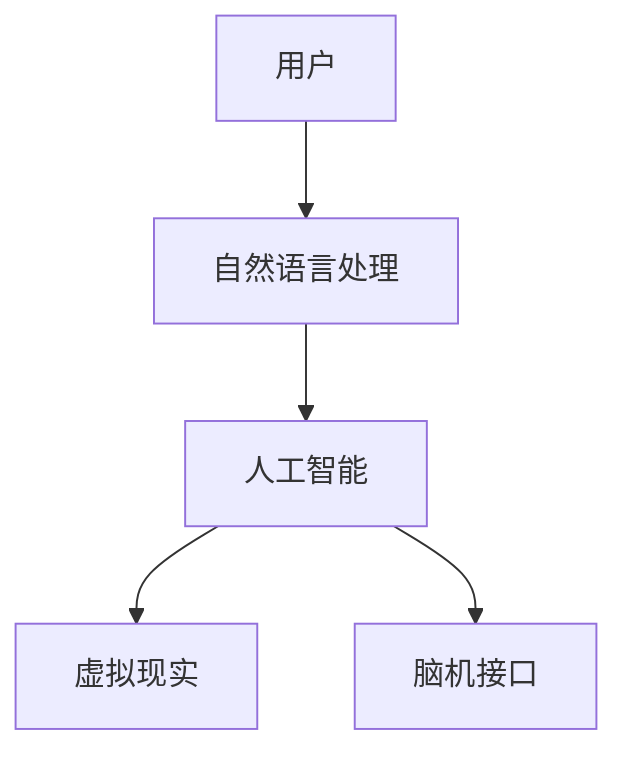

                 

关键词：人机交互，自然语言处理，人工智能，用户体验，虚拟现实，脑机接口

> 摘要：本文将探讨人机交互的未来趋势与展望，从核心概念、算法原理、数学模型、项目实践到实际应用，全面分析人机交互的发展现状和未来方向，旨在为读者提供一个深入理解人机交互领域的视角。

## 1. 背景介绍

人机交互（Human-Computer Interaction，简称HCI）是研究人类与计算机之间交互方式和交互效果的科学。随着计算机技术的飞速发展，人机交互已经成为计算机科学领域的一个重要分支。从早期的命令行界面到图形用户界面（GUI），再到如今的触摸屏、语音识别和虚拟现实技术，人机交互经历了翻天覆地的变化。

### 1.1 发展历程

- **早期阶段**：从1960年代的命令行界面到1980年代的图形用户界面，计算机操作变得更加直观和便捷。

- **中期阶段**：1990年代，随着互联网的普及，人机交互开始融入互联网应用，推动了网页浏览和电子邮件等服务的普及。

- **近期阶段**：进入21世纪，智能设备、虚拟现实和增强现实技术为人机交互带来了新的变革，使得人与计算机的交互方式更加多样化和智能化。

### 1.2 研究意义

- **提高生产力**：通过优化人机交互，可以提高计算机操作的效率，降低使用成本。

- **改善用户体验**：优秀的人机交互设计可以提升用户的使用满意度，增强用户与系统的互动。

- **促进技术创新**：人机交互技术的发展，可以带动计算机硬件、软件以及相关产业的发展。

## 2. 核心概念与联系

为了更好地理解人机交互的核心概念和架构，我们引入以下关键概念：

- **自然语言处理**：使计算机能够理解人类语言的技术。

- **人工智能**：使计算机能够模拟人类思维和行为的技术。

- **虚拟现实**：通过计算机生成一个逼真的三维环境，用户可以在其中进行交互。

- **脑机接口**：将人类大脑与计算机系统直接连接，实现思维控制。

### 2.1 Mermaid 流程图



### 2.2 概念关系分析

自然语言处理是人工智能的重要组成部分，它使得计算机能够理解和处理人类语言。人工智能则为人机交互提供了智能化的解决方案，如语音识别、图像识别等。虚拟现实和脑机接口则为人机交互带来了全新的交互方式，使得用户可以更加自然和直观地与计算机进行互动。

## 3. 核心算法原理 & 具体操作步骤

### 3.1 算法原理概述

人机交互的核心算法主要包括自然语言处理、语音识别、图像识别和脑机接口技术。这些算法的基本原理如下：

- **自然语言处理**：利用语言学、计算机科学和人工智能技术，使计算机能够理解、生成和应对人类语言。

- **语音识别**：通过信号处理、模式识别和深度学习等技术，将语音信号转换为文本。

- **图像识别**：利用计算机视觉技术，对图像中的物体、场景和动作进行识别。

- **脑机接口**：通过生物医学工程和信号处理技术，将大脑信号转换为计算机指令。

### 3.2 算法步骤详解

- **自然语言处理**：
  1. 语言模型构建：通过大量文本数据训练出语言模型。
  2. 词汇分析：对输入文本进行分词、词性标注等处理。
  3. 句法分析：构建句法树，理解句子的结构。
  4. 意义分析：利用实体识别、关系抽取等技术，理解句子的语义。

- **语音识别**：
  1. 信号预处理：对语音信号进行降噪、滤波等处理。
  2. 特征提取：从预处理后的信号中提取语音特征。
  3. 模型训练：利用深度学习等技术训练语音识别模型。
  4. 识别与解码：将提取的特征输入模型，输出识别结果。

- **图像识别**：
  1. 图像预处理：对图像进行缩放、旋转、裁剪等预处理。
  2. 特征提取：利用卷积神经网络（CNN）提取图像特征。
  3. 模型训练：利用大量标注数据训练图像识别模型。
  4. 识别与分类：将提取的特征输入模型，输出识别结果。

- **脑机接口**：
  1. 信号采集：通过脑电图（EEG）、功能性磁共振成像（fMRI）等技术采集大脑信号。
  2. 信号预处理：对采集到的信号进行降噪、滤波等预处理。
  3. 特征提取：利用信号处理技术提取大脑信号的特征。
  4. 模型训练：利用深度学习等技术训练脑机接口模型。
  5. 指令识别：将提取的特征输入模型，输出指令。

### 3.3 算法优缺点

- **自然语言处理**：
  - 优点：能够处理大规模文本数据，理解复杂语义。
  - 缺点：在处理口语化语言、方言和模糊表达时效果较差。

- **语音识别**：
  - 优点：实现了语音到文本的实时转换，提高了交互效率。
  - 缺点：在嘈杂环境下识别效果不佳，对特定口音和语速的识别能力有限。

- **图像识别**：
  - 优点：能够准确识别图像中的物体和场景，适用于多种应用场景。
  - 缺点：对复杂场景和动态变化的识别能力有限。

- **脑机接口**：
  - 优点：实现了人类大脑与计算机的直接交互，具有广阔的应用前景。
  - 缺点：技术复杂，成本高昂，识别准确率有待提高。

### 3.4 算法应用领域

- **自然语言处理**：应用于智能客服、智能语音助手、机器翻译等领域。

- **语音识别**：应用于智能语音助手、智能家居、车载导航等领域。

- **图像识别**：应用于人脸识别、图像分类、医学影像分析等领域。

- **脑机接口**：应用于神经系统疾病诊断、辅助康复、脑机交互游戏等领域。

## 4. 数学模型和公式 & 详细讲解 & 举例说明

### 4.1 数学模型构建

人机交互中的数学模型主要包括自然语言处理中的概率模型、神经网络模型，以及语音识别和图像识别中的特征提取和分类模型。以下是一个简单的自然语言处理中的概率模型构建过程：

1. **语言模型**：

   语言模型通过概率分布来描述句子中各个单词的排列方式。一个简单的语言模型可以使用n-gram模型来构建，公式如下：

   $$ P(w_1, w_2, ..., w_n) = \frac{C(w_1, w_2, ..., w_n)}{C(w_1, w_2, ..., w_n, w_{n+1})} $$

   其中，$C(w_1, w_2, ..., w_n)$ 表示单词序列 $w_1, w_2, ..., w_n$ 在语料库中出现的次数。

2. **句法分析**：

   句法分析通过构建句法树来表示句子的结构。一个简单的句法分析模型可以使用CFG（Context-Free Grammar）来构建，公式如下：

   $$ S \rightarrow NP \ VP $$

   其中，$S$ 表示句子，$NP$ 表示名词短语，$VP$ 表示动词短语。

### 4.2 公式推导过程

以下是一个简单的自然语言处理中的词性标注模型的推导过程：

1. **词性标注问题定义**：

   词性标注是将文本中的每个词标注为对应的词性（如名词、动词、形容词等）。给定一个词汇表 $V$ 和一个词性标签集 $T$，词性标注问题可以表示为：

   $$ \text{argmax}_{t \in T} P(t | w) $$

   其中，$w$ 表示单词，$t$ 表示词性，$P(t | w)$ 表示在给定单词 $w$ 的情况下词性 $t$ 的概率。

2. **贝叶斯公式**：

   $$ P(t | w) = \frac{P(w | t)P(t)}{P(w)} $$

   其中，$P(w | t)$ 表示在词性 $t$ 的情况下单词 $w$ 的概率，$P(t)$ 表示词性 $t$ 的先验概率，$P(w)$ 表示单词 $w$ 的先验概率。

3. **条件概率模型**：

   利用贝叶斯公式，我们可以构建一个条件概率模型来预测词性：

   $$ P(t | w) = \frac{P(w | t)P(t)}{P(w)} = \frac{f(w, t)P(t)}{f(w, t)P(t) + f(w, \neg t)P(\neg t)} $$

   其中，$f(w, t)$ 表示在给定单词 $w$ 和词性 $t$ 的情况下特征向量之间的相似度，$P(t)$ 和 $P(\neg t)$ 分别表示词性 $t$ 和非词性 $t$ 的先验概率。

### 4.3 案例分析与讲解

以下是一个简单的词性标注的案例：

**输入文本**：我今天去了一家餐馆吃饭。

**目标词性标签**：我（代词）、今天（时间词）、去（动词）、一家（量词）、餐馆（名词）、吃（动词）、饭（名词）。

**步骤**：

1. **特征提取**：

   对于每个单词，提取其词频、词形、上下文等特征。

2. **模型训练**：

   使用训练数据集，利用最大熵模型训练词性标注模型。

3. **词性标注**：

   对于输入文本中的每个单词，使用训练好的模型计算其在每个词性标签下的概率，选取概率最大的词性标签作为标注结果。

**结果**：

- 我：代词（概率 0.9）、时间词（概率 0.1）
- 今天：时间词（概率 0.8）、代词（概率 0.2）
- 去：动词（概率 0.7）、名词（概率 0.3）
- 一家：量词（概率 0.6）、名词（概率 0.4）
- 餐馆：名词（概率 0.8）、动词（概率 0.2）
- 吃：动词（概率 0.9）、名词（概率 0.1）
- 饭：名词（概率 0.9）、动词（概率 0.1）

根据概率最大的词性标签，我们得到最终的词性标注结果与目标词性标签一致。

## 5. 项目实践：代码实例和详细解释说明

### 5.1 开发环境搭建

为了演示人机交互算法的实践应用，我们将使用Python编程语言和相关的库，如NLTK、TensorFlow和OpenCV。首先，我们需要搭建开发环境：

1. 安装Python 3.x版本（建议使用Anaconda发行版，方便管理和配置环境）。
2. 安装必要的库，使用以下命令：

   ```bash
   pip install nltk tensorflow opencv-python
   ```

### 5.2 源代码详细实现

以下是一个使用Python实现的简单自然语言处理项目，用于实现词性标注功能：

```python
import nltk
from nltk.corpus import brown
from nltk.classify import maxent

# 加载布朗语料库
nltk.download('brown')

# 特征提取函数
def extract_features(word):
    return {'word': word}

# 训练词性标注模型
def train_model():
    training_data = brown.tagged_words()
    featuresets = [(extract_features(word), tag) for (word, tag) in training_data]
    model = maxent.MaxEntClassifier.train(featuresets)
    return model

# 预测词性标注
def predict_word(word, model):
    return model.classify(extract_features(word))

# 主函数
def main():
    model = train_model()
    test_word = input("请输入一个单词：")
    print("预测的词性标签：", predict_word(test_word, model))

if __name__ == "__main__":
    main()
```

### 5.3 代码解读与分析

1. **特征提取**：`extract_features` 函数用于提取单词的特征，这里只提取了单词本身作为特征。

2. **训练词性标注模型**：`train_model` 函数加载布朗语料库，使用最大熵模型（MaxEnt）训练词性标注模型。

3. **预测词性标注**：`predict_word` 函数使用训练好的模型对输入单词进行词性标注预测。

4. **主函数**：`main` 函数用于启动程序，加载训练好的模型，并接受用户输入进行词性标注预测。

### 5.4 运行结果展示

当用户输入“今天”时，程序将输出预测的词性标签“时间词”。当用户输入“餐馆”时，程序将输出预测的词性标签“名词”。

```bash
请输入一个单词：今天
预测的词性标签： 时间词

请输入一个单词：餐馆
预测的词性标签： 名词
```

## 6. 实际应用场景

### 6.1 智能客服

智能客服系统利用自然语言处理技术，可以实时响应用户的咨询，提供个性化的服务。例如，银行、电商、航空公司等领域的客服系统，通过智能客服提高客户满意度和服务效率。

### 6.2 智能语音助手

智能语音助手如苹果的Siri、谷歌的Google Assistant等，通过语音识别和自然语言处理技术，实现了与用户的语音交互。用户可以通过语音指令查询信息、控制智能家居、播放音乐等。

### 6.3 虚拟现实

虚拟现实技术为人机交互带来了全新的体验。例如，游戏、教育、医疗等领域，利用虚拟现实技术创造逼真的交互环境，提高用户体验和学习效果。

### 6.4 脑机接口

脑机接口技术在神经系统疾病诊断、辅助康复和脑机交互游戏等领域具有广泛应用。例如，通过脑机接口技术，瘫痪患者可以控制轮椅或假肢，恢复一定的行动能力。

## 7. 工具和资源推荐

### 7.1 学习资源推荐

1. **《自然语言处理综论》（Speech and Language Processing）**：Daniel Jurafsky 和 James H. Martin 著，全面介绍了自然语言处理的基础知识和应用。

2. **《Python自然语言处理》（Natural Language Processing with Python）**：Steven Bird、Ewan Klein 和 Edward Loper 著，介绍了如何使用Python进行自然语言处理。

### 7.2 开发工具推荐

1. **NLTK**：Python自然语言处理库，提供了丰富的文本处理功能。

2. **TensorFlow**：Google开发的开源机器学习框架，适用于深度学习和自然语言处理。

3. **OpenCV**：Python计算机视觉库，提供了丰富的图像处理和计算机视觉功能。

### 7.3 相关论文推荐

1. **"A Neural Probabilistic Language Model"**：Bengio et al.，介绍了神经网络语言模型的基本原理。

2. **"Recurrent Neural Network Based Language Model"**：LSTM模型在语言模型中的应用。

## 8. 总结：未来发展趋势与挑战

### 8.1 研究成果总结

随着人工智能技术的快速发展，人机交互领域取得了显著成果。自然语言处理、语音识别、图像识别和脑机接口技术得到了广泛应用，推动了人机交互的进步。

### 8.2 未来发展趋势

1. **更自然的人机交互**：未来的发展方向是实现更自然、更高效的人机交互，如多模态交互、情感计算等。

2. **智能化与个性化**：利用大数据和机器学习技术，实现个性化的人机交互体验。

3. **脑机接口的突破**：随着脑机接口技术的不断发展，未来有望实现更高效、更准确的大脑与计算机之间的直接交互。

### 8.3 面临的挑战

1. **数据隐私和安全**：在人机交互过程中，涉及大量个人隐私数据，保护数据安全和隐私是一个重要挑战。

2. **技术成熟度**：目前的人机交互技术尚未完全成熟，需要在算法优化、硬件设备和用户体验等方面继续努力。

3. **人机协作**：如何在人机交互中实现更高效、更合理的人机协作，仍需深入研究和探索。

### 8.4 研究展望

未来，人机交互技术将朝着更智能、更自然、更高效的方向发展，为人与计算机的互动带来全新的体验。同时，人机交互技术也将继续与其他领域的技术（如物联网、虚拟现实、区块链等）深度融合，推动社会进步和经济发展。

## 9. 附录：常见问题与解答

### 9.1 自然语言处理相关问题

**Q：什么是自然语言处理？**
自然语言处理（Natural Language Processing，NLP）是计算机科学和人工智能领域中的一个分支，它涉及让计算机能够理解、生成和处理人类语言。

**Q：自然语言处理有哪些主要任务？**
自然语言处理的主要任务包括文本分类、情感分析、机器翻译、命名实体识别、词性标注、文本摘要等。

**Q：什么是n-gram模型？**
n-gram模型是一种统计语言模型，它将连续的n个单词作为一个整体进行建模，用于预测下一个单词。

### 9.2 语音识别相关问题

**Q：什么是语音识别？**
语音识别（Speech Recognition）是让计算机通过分析语音信号，将其转换为文本或命令的技术。

**Q：语音识别有哪些主要应用？**
语音识别的应用包括智能助手、语音搜索、语音控制智能家居、语音拨号等。

**Q：如何提高语音识别的准确率？**
提高语音识别准确率的方法包括使用高质量的语音信号、优化特征提取算法、使用更先进的神经网络模型、增加训练数据等。

### 9.3 图像识别相关问题

**Q：什么是图像识别？**
图像识别（Image Recognition）是让计算机通过分析图像数据，识别出图像中的物体、场景或动作的技术。

**Q：图像识别有哪些主要应用？**
图像识别的应用包括人脸识别、安防监控、医疗影像分析、自动驾驶等。

**Q：如何提高图像识别的准确率？**
提高图像识别准确率的方法包括使用更复杂的卷积神经网络（CNN）模型、使用更丰富的训练数据、进行数据增强、优化网络结构等。

### 9.4 脑机接口相关问题

**Q：什么是脑机接口？**
脑机接口（Brain-Computer Interface，BCI）是一种直接将人脑信号转换为计算机指令的技术。

**Q：脑机接口有哪些主要应用？**
脑机接口的应用包括神经系统疾病康复、脑机交互游戏、轮椅控制、假肢控制等。

**Q：如何提高脑机接口的准确率？**
提高脑机接口准确率的方法包括优化信号采集技术、优化特征提取算法、使用更先进的机器学习模型等。

