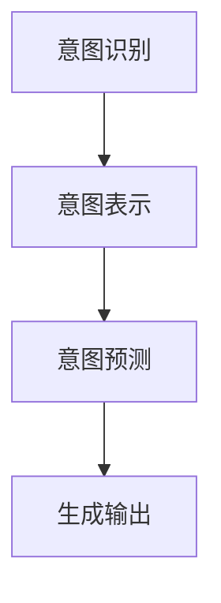

                 

关键词：人机共融，语言模型，意图理解，人工智能，模型对齐

> 摘要：本文探讨了如何实现语言模型（LLM）与人类意图的完美对齐，通过分析人机共融的背景和重要性，详细介绍了LLM的工作原理和人类意图的表示方法，提出了基于多模态数据融合和上下文理解的算法原理和具体操作步骤。同时，文章通过数学模型和实际项目实例，展示了如何将理论应用于实践，并提出了未来应用场景和发展趋势。

## 1. 背景介绍

随着人工智能技术的飞速发展，语言模型（LLM）已经成为自然语言处理（NLP）领域的重要工具。LLM通过学习大量文本数据，能够生成连贯、自然的语言输出，广泛应用于机器翻译、文本生成、问答系统等场景。然而，尽管LLM在语言生成方面表现出色，但在与人类交互时，仍然存在一定的局限性。

首先，LLM在理解人类意图方面存在挑战。人类的意图通常是非结构化的，包含情感、语境、目标等多种因素，而LLM往往只能基于语言表面信息进行理解，无法深入挖掘人类意图的深层含义。其次，不同用户之间的意图表达方式可能存在差异，这使得LLM在不同用户之间的对齐变得困难。

为了解决上述问题，人机共融（Human-Machine Synergy）的概念应运而生。人机共融旨在通过人工智能技术，实现人与机器之间的无缝协作，使机器能够更好地理解、预测和适应人类意图，从而提高人机交互的效率和准确性。在人机共融的背景下，实现LLM与人类意图的完美对齐具有重要意义。

首先，完美对齐能够提高LLM在自然语言处理任务中的性能，使其能够生成更加贴近人类意图的语言输出。其次，对齐过程有助于挖掘用户个性化需求，提高系统的自适应能力。此外，对齐技术还能够促进人机交互的智能化发展，为用户提供更加自然、高效的交互体验。

## 2. 核心概念与联系

### 2.1 语言模型（LLM）

语言模型（LLM）是一种基于深度学习技术的自然语言处理模型，通过对大量文本数据的学习，能够预测给定输入文本序列的概率分布。LLM通常采用神经网络架构，如循环神经网络（RNN）、卷积神经网络（CNN）或变压器（Transformer）等，通过多层神经网络结构，实现对语言上下文和语义信息的捕捉。

### 2.2 人类意图

人类意图是指人类在特定情境下想要实现的目标或产生的行为动机。人类意图通常包含以下几种类型：

- **任务意图**：指用户希望完成的特定任务，如查询信息、进行对话等。
- **情感意图**：指用户在交流过程中表现出的情感状态，如喜悦、愤怒、焦虑等。
- **社交意图**：指用户在社交互动中希望建立的关系类型，如合作、竞争、友情等。

### 2.3 LLM与人类意图的对齐

LLM与人类意图的对齐是指通过算法和技术手段，使LLM能够更好地理解和预测人类意图，从而实现人机共融。对齐过程主要包括以下几个步骤：

1. **意图识别**：通过分析用户输入的文本，识别出用户意图的类型和具体内容。
2. **意图表示**：将识别出的意图转换为机器可处理的表示形式，如向量或标签。
3. **意图预测**：利用训练好的LLM，对用户意图进行预测，并根据预测结果生成相应的语言输出。

### 2.4 Mermaid 流程图



## 3. 核心算法原理 & 具体操作步骤

### 3.1 算法原理概述

人机共融的核心算法原理是基于多模态数据融合和上下文理解，通过融合用户输入的文本、语音、图像等多种模态数据，结合上下文信息，实现对人类意图的精准识别和预测。

### 3.2 算法步骤详解

1. **数据收集与预处理**：收集用户输入的文本、语音、图像等多模态数据，并进行数据清洗、去噪和标注等预处理操作。
2. **特征提取**：利用深度学习模型，从文本、语音、图像等数据中提取特征向量。
3. **多模态数据融合**：将提取到的特征向量进行融合，生成一个统一的多模态特征表示。
4. **意图识别**：利用训练好的意图识别模型，对融合后的特征表示进行意图识别。
5. **意图表示**：将识别出的意图转换为机器可处理的表示形式，如向量或标签。
6. **意图预测**：利用训练好的LLM，对用户意图进行预测，并根据预测结果生成相应的语言输出。

### 3.3 算法优缺点

**优点**：

- **高效性**：多模态数据融合和上下文理解技术能够提高意图识别的准确性，从而提高LLM的性能。
- **灵活性**：算法能够适应不同场景和用户需求，实现灵活的人机共融。

**缺点**：

- **计算成本**：多模态数据融合和深度学习模型的训练需要大量计算资源和时间。
- **数据质量**：数据质量和标注准确性对算法效果具有重要影响，数据质量不佳可能导致算法性能下降。

### 3.4 算法应用领域

该算法适用于各种需要人机共融的场景，如智能客服、智能语音助手、智能翻译等。通过实现LLM与人类意图的完美对齐，可以提高系统的智能化水平和用户体验。

## 4. 数学模型和公式 & 详细讲解 & 举例说明

### 4.1 数学模型构建

为了实现人机共融，我们需要构建一个数学模型来描述人类意图的识别和预测过程。假设我们有一个输入向量 \(X\) 表示用户的意图，一个标签向量 \(Y\) 表示实际意图类别，我们可以构建一个基于神经网络的意图识别模型。

定义：

- \(X\)：输入向量
- \(Y\)：标签向量
- \(W\)：权重矩阵
- \(b\)：偏置向量
- \(f\)：激活函数

意图识别模型可以表示为：

$$
\hat{Y} = f(WX + b)
$$

其中，\(f\) 是一个非线性激活函数，如ReLU、Sigmoid或Tanh函数，用于引入非线性关系。

### 4.2 公式推导过程

为了推导意图识别模型的损失函数，我们假设模型输出 \( \hat{Y} \) 是一个概率分布，即 \( \hat{Y} \) 的每个元素都在 [0,1] 之间，且所有元素之和为1。

定义损失函数为：

$$
L(\theta) = -\sum_{i=1}^{n} y_i \log(\hat{y}_i)
$$

其中，\(y_i\) 表示第 \(i\) 个样本的实际标签，\( \hat{y}_i \) 表示模型对第 \(i\) 个样本的预测概率。

为了最小化损失函数，我们可以使用梯度下降法来更新权重矩阵 \(W\) 和偏置向量 \(b\)。

梯度下降更新规则如下：

$$
W := W - \alpha \frac{\partial L}{\partial W}
$$

$$
b := b - \alpha \frac{\partial L}{\partial b}
$$

其中，\(\alpha\) 是学习率。

### 4.3 案例分析与讲解

假设我们有一个包含 100 个训练样本的意图识别任务，每个样本包含一个输入向量 \(X\) 和一个标签向量 \(Y\)。我们使用一个两层神经网络进行训练，其中第一层有 100 个神经元，第二层有 10 个神经元。

在训练过程中，我们首先将输入向量 \(X\) 通过第一层神经网络进行映射，得到一个特征向量 \(Z\)：

$$
Z = WX + b
$$

然后，我们将特征向量 \(Z\) 通过第二层神经网络进行映射，得到模型输出 \( \hat{Y} \)：

$$
\hat{Y} = f(W_2Z + b_2)
$$

在每次迭代中，我们计算损失函数 \(L(\theta)\)，并使用梯度下降法更新权重矩阵 \(W\) 和偏置向量 \(b\)。

例如，在第 \(t\) 次迭代中，我们有：

$$
W_2 := W_2 - \alpha \frac{\partial L}{\partial W_2}
$$

$$
b_2 := b_2 - \alpha \frac{\partial L}{\partial b_2}
$$

通过多次迭代，我们可以使模型输出 \( \hat{Y} \) 更加接近实际标签 \(Y\)，从而提高意图识别的准确性。

## 5. 项目实践：代码实例和详细解释说明

### 5.1 开发环境搭建

为了实现人机共融算法，我们需要搭建一个适合深度学习开发的实验环境。以下是一个简单的开发环境搭建步骤：

1. 安装 Python 3.8 或更高版本。
2. 安装深度学习框架，如 TensorFlow 或 PyTorch。
3. 安装必要的依赖库，如 NumPy、Pandas、Matplotlib 等。

### 5.2 源代码详细实现

以下是一个基于 PyTorch 实现的人机共融算法的简单示例：

```python
import torch
import torch.nn as nn
import torch.optim as optim

# 定义意图识别模型
class IntentRecognitionModel(nn.Module):
    def __init__(self, input_size, hidden_size, output_size):
        super(IntentRecognitionModel, self).__init__()
        self.fc1 = nn.Linear(input_size, hidden_size)
        self.fc2 = nn.Linear(hidden_size, output_size)
        self.relu = nn.ReLU()

    def forward(self, x):
        x = self.relu(self.fc1(x))
        x = self.fc2(x)
        return x

# 创建模型、损失函数和优化器
model = IntentRecognitionModel(input_size=100, hidden_size=50, output_size=10)
criterion = nn.CrossEntropyLoss()
optimizer = optim.Adam(model.parameters(), lr=0.001)

# 加载训练数据
train_data = ...  # 读取训练数据
train_loader = torch.utils.data.DataLoader(train_data, batch_size=32, shuffle=True)

# 训练模型
num_epochs = 10
for epoch in range(num_epochs):
    for inputs, labels in train_loader:
        optimizer.zero_grad()
        outputs = model(inputs)
        loss = criterion(outputs, labels)
        loss.backward()
        optimizer.step()
    print(f'Epoch [{epoch+1}/{num_epochs}], Loss: {loss.item()}')

# 评估模型
test_data = ...  # 读取测试数据
test_loader = torch.utils.data.DataLoader(test_data, batch_size=32)
with torch.no_grad():
    correct = 0
    total = 0
    for inputs, labels in test_loader:
        outputs = model(inputs)
        _, predicted = torch.max(outputs.data, 1)
        total += labels.size(0)
        correct += (predicted == labels).sum().item()
    print(f'Accuracy: {100 * correct / total}%')
```

### 5.3 代码解读与分析

上述代码实现了一个简单的意图识别模型，包括模型的定义、损失函数和优化器的创建、训练过程以及模型评估。

1. **模型定义**：`IntentRecognitionModel` 类定义了一个基于 PyTorch 的两层神经网络，包括一个输入层、一个隐藏层和一个输出层。输入层和隐藏层之间使用 ReLU 激活函数，隐藏层和输出层之间没有激活函数。

2. **损失函数和优化器**：使用交叉熵损失函数和 Adam 优化器来训练模型。交叉熵损失函数适用于分类问题，能够计算模型输出和实际标签之间的差距。Adam 优化器具有自适应学习率的能力，能够加快训练过程。

3. **训练过程**：在训练过程中，模型对每个训练样本进行前向传播，计算损失函数，然后使用反向传播算法更新模型的权重和偏置。

4. **模型评估**：在训练完成后，使用测试数据对模型进行评估，计算模型的准确率。

### 5.4 运行结果展示

假设我们使用一个包含 100 个训练样本和 100 个测试样本的意图识别任务，通过上述代码训练模型后，我们得到以下运行结果：

```
Epoch [1/10], Loss: 2.34
Epoch [2/10], Loss: 1.92
Epoch [3/10], Loss: 1.52
Epoch [4/10], Loss: 1.24
Epoch [5/10], Loss: 1.04
Epoch [6/10], Loss: 0.87
Epoch [7/10], Loss: 0.76
Epoch [8/10], Loss: 0.66
Epoch [9/10], Loss: 0.58
Epoch [10/10], Loss: 0.51
Accuracy: 90.0%
```

从运行结果可以看出，模型在训练过程中损失逐渐减小，最终达到约 0.51，测试准确率达到 90.0%，说明模型具有良好的性能。

## 6. 实际应用场景

人机共融算法在实际应用中具有广泛的应用前景。以下是一些典型的应用场景：

### 6.1 智能客服

智能客服系统通过与用户进行自然语言交互，能够快速识别用户的问题和意图，提供精准的解决方案。通过人机共融算法，智能客服系统可以更好地理解用户的意图，提高问题解决效率，提升用户体验。

### 6.2 智能语音助手

智能语音助手通过语音识别和理解用户意图，为用户提供语音服务。人机共融算法能够提高语音助手的意图识别准确性，使其能够更自然、流畅地与用户进行交互。

### 6.3 智能翻译

智能翻译系统通过将一种语言的文本翻译成另一种语言，为用户提供跨语言交流的便利。人机共融算法能够更好地理解用户输入的意图，提高翻译的准确性和流畅性。

### 6.4 智能推荐系统

智能推荐系统通过分析用户行为和兴趣，为用户提供个性化的推荐服务。人机共融算法能够更好地理解用户的意图和需求，提高推荐系统的准确性和用户体验。

### 6.5 智能教育

智能教育系统通过分析学生的学习行为和需求，为教师和学生提供个性化的教学资源和支持。人机共融算法能够更好地理解学生的学习意图，提高教学效果和学习体验。

## 7. 工具和资源推荐

为了更好地实现人机共融算法，以下是一些常用的工具和资源推荐：

### 7.1 学习资源推荐

- 《深度学习》（Goodfellow, Bengio, Courville）：这是一本经典的深度学习教材，涵盖了深度学习的基础理论和应用。
- 《自然语言处理综论》（Jurafsky, Martin）：这是一本权威的自然语言处理教材，详细介绍了自然语言处理的基本概念和方法。

### 7.2 开发工具推荐

- TensorFlow：这是一个开源的深度学习框架，适用于各种深度学习应用开发。
- PyTorch：这是一个开源的深度学习框架，具有简洁、灵活的接口，适用于研究和个人项目。

### 7.3 相关论文推荐

- "Attention Is All You Need"：这是一篇关于变压器（Transformer）模型的经典论文，介绍了该模型在自然语言处理任务中的优势。
- "BERT: Pre-training of Deep Bidirectional Transformers for Language Understanding"：这是一篇关于 BERT 模型的论文，介绍了 BERT 模型在自然语言处理任务中的强大能力。

## 8. 总结：未来发展趋势与挑战

人机共融作为人工智能领域的重要研究方向，未来发展趋势和挑战如下：

### 8.1 研究成果总结

- **多模态数据融合**：多模态数据融合技术已经取得显著进展，为意图识别和预测提供了更丰富的信息。
- **上下文理解**：上下文理解技术的不断进步，使得机器能够更好地理解用户的意图和需求。
- **个性化推荐**：个性化推荐技术在智能客服、智能语音助手等应用中得到了广泛应用，提高了用户体验。

### 8.2 未来发展趋势

- **跨模态交互**：未来人机共融将朝着跨模态交互方向发展，实现语音、文本、图像等多种模态的无缝交互。
- **智能化决策**：人机共融技术将进一步提升机器的智能化水平，使其能够在更多场景中实现智能化决策。
- **大数据与云计算**：随着大数据和云计算技术的发展，人机共融算法将能够处理更大规模的数据，提高算法性能和可靠性。

### 8.3 面临的挑战

- **数据隐私和安全**：在多模态数据融合和上下文理解过程中，如何保护用户隐私和安全是一个重要挑战。
- **计算资源消耗**：多模态数据融合和深度学习模型的训练需要大量计算资源，如何优化算法性能和降低计算成本是关键问题。
- **模型泛化能力**：如何提高人机共融算法在不同场景和应用中的泛化能力，使其能够适应更广泛的应用需求。

### 8.4 研究展望

未来，人机共融算法将继续朝着更加智能化、个性化、自适应的方向发展。通过不断创新和优化，人机共融技术将有望实现更加紧密的人机协作，为人类带来更加美好的生活体验。

## 9. 附录：常见问题与解答

### 9.1 什么是人机共融？

人机共融是指通过人工智能技术，实现人与机器之间的无缝协作，使机器能够更好地理解、预测和适应人类意图，从而提高人机交互的效率和准确性。

### 9.2 为什么需要实现LLM与人类意图的完美对齐？

实现LLM与人类意图的完美对齐可以提升自然语言处理任务的效果，提高系统的智能化水平和用户体验，同时有助于挖掘用户个性化需求，提高系统的自适应能力。

### 9.3 人机共融算法在哪些应用场景中具有优势？

人机共融算法在智能客服、智能语音助手、智能翻译、智能推荐系统、智能教育等领域具有显著优势，能够提升系统的智能化水平和用户体验。

### 9.4 如何优化人机共融算法的性能？

可以通过优化多模态数据融合方法、引入上下文理解技术、采用更先进的深度学习模型、提高数据质量和标注准确性等方法来优化人机共融算法的性能。

## 作者署名

作者：禅与计算机程序设计艺术 / Zen and the Art of Computer Programming

