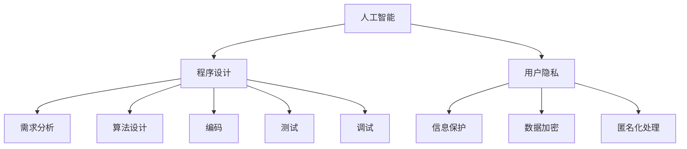

                 

关键词：人机协作、伦理规范、准则、人工智能、程序设计

> 摘要：随着人工智能技术的快速发展，人机协作已成为现代社会的关键趋势。本文从伦理角度探讨了人机协作中的规范和准则，旨在为人机协作的实践提供理论指导和实践参考。

## 1. 背景介绍

人机协作是指人与机器通过共同合作完成任务的过程。在过去的几十年中，计算机技术的发展使得机器具备了更高的智能，能够执行复杂的任务，处理大量数据。与此同时，人类也逐渐意识到，仅依靠单一的人类或机器都难以应对现代社会日益复杂的问题。因此，人机协作成为了一个热门的研究领域，被广泛应用于各个行业，如医疗、金融、教育、制造业等。

然而，随着人机协作的广泛应用，伦理问题也逐渐凸显出来。如何在确保人机协作高效的同时，保护用户的隐私、维护社会的公平正义，成为了亟待解决的问题。本文将从伦理角度出发，探讨人机协作中的规范和准则，为人机协作的实践提供理论指导和实践参考。

## 2. 核心概念与联系

在探讨人机协作的伦理规范与准则之前，我们需要了解一些核心概念，如人工智能、程序设计、用户隐私等。

### 2.1 人工智能

人工智能（Artificial Intelligence，AI）是指计算机系统通过模拟人类智能行为，实现感知、学习、推理、决策等能力的科学和技术。人工智能可以分为弱人工智能和强人工智能。弱人工智能是指计算机在某些特定领域表现出人类智能的现象，如语音识别、图像识别等。强人工智能是指计算机具有人类所有的智能能力，能够理解、学习、思考、创造，甚至具有自我意识。

### 2.2 程序设计

程序设计（Program Design）是指为解决特定问题而制定计算机程序的整个过程。程序设计包括需求分析、算法设计、编码、测试、调试等环节。在程序设计过程中，程序员需要遵循一定的规范和准则，确保程序的正确性、可读性和可维护性。

### 2.3 用户隐私

用户隐私（User Privacy）是指用户在信息社会中享有的个人信息不被他人非法获取、利用、泄露、篡改的权利。用户隐私涉及姓名、地址、电话号码、电子邮件、交易记录、健康状况、兴趣爱好等敏感信息。

### 2.4 Mermaid 流程图

以下是人机协作的核心概念和联系的 Mermaid 流程图：



## 3. 核心算法原理 & 具体操作步骤

### 3.1 算法原理概述

人机协作中的核心算法主要包括以下几个方面：

1. **协作算法**：协作算法旨在优化人与机器在完成任务过程中的资源分配、任务分配和决策过程。协作算法包括基于博弈论、多智能体系统、社会选择理论等。
   
2. **隐私保护算法**：隐私保护算法用于确保在数据交换和处理过程中，用户的隐私信息不被泄露。隐私保护算法包括差分隐私、同态加密、联邦学习等。

3. **安全算法**：安全算法用于保障人机协作过程中的信息安全，防止恶意攻击和篡改。安全算法包括密码学、访问控制、防火墙等。

### 3.2 算法步骤详解

以下是人机协作中常用的三个核心算法的具体步骤：

#### 3.2.1 协作算法

1. **初始化**：设定人机协作的目标、规则和参数。
2. **任务分配**：根据任务复杂度和机器能力，将任务分配给人和机器。
3. **决策协同**：人机双方通过通信机制，共享信息，协商决策。
4. **任务执行**：人机双方根据协商结果，执行各自的任务。
5. **结果评估**：评估协作效果，优化协作策略。

#### 3.2.2 隐私保护算法

1. **数据加密**：对敏感数据进行加密处理，确保数据在传输和存储过程中不被窃取。
2. **差分隐私**：添加噪声来保护用户隐私，确保数据发布时无法推断出单个用户的隐私信息。
3. **同态加密**：在加密数据上直接进行计算，确保计算结果正确，同时保护数据隐私。

#### 3.2.3 安全算法

1. **身份认证**：确保人机双方的身份真实可信。
2. **访问控制**：根据用户权限，控制对数据和信息资源的访问。
3. **防火墙**：监控网络流量，阻止恶意攻击。

### 3.3 算法优缺点

#### 3.3.1 协作算法

**优点**：提高人机协作效率，优化任务分配和决策过程。

**缺点**：实现复杂，需要大量通信和计算资源。

#### 3.3.2 隐私保护算法

**优点**：保护用户隐私，增强数据安全性。

**缺点**：加密和解密过程会降低计算效率。

#### 3.3.3 安全算法

**优点**：保障人机协作过程中的信息安全。

**缺点**：可能引入额外开销，增加系统复杂度。

### 3.4 算法应用领域

协作算法、隐私保护算法和安全算法在以下领域有广泛应用：

1. **医疗**：医疗诊断、治疗建议等。
2. **金融**：风险评估、投资建议等。
3. **教育**：个性化学习、教学评估等。
4. **制造业**：智能工厂、设备维护等。

## 4. 数学模型和公式 & 详细讲解 & 举例说明

### 4.1 数学模型构建

人机协作中的数学模型主要包括以下几部分：

1. **效用函数**：描述人机双方在协作过程中的利益。
2. **策略空间**：定义人机双方可以选择的行动集合。
3. **策略组合**：人机双方在协作过程中的策略组合。
4. **博弈论模型**：描述人机双方在协作过程中的互动。

### 4.2 公式推导过程

以合作博弈为例，推导人机协作中的效用函数。

设 \( u_i(x) \) 为第 \( i \) 个参与者（人/机器）在协作过程中的效用函数，\( x \) 为协作过程中的策略组合。则有：

$$ u_i(x) = u_i(x_1, x_2, ..., x_n) $$

其中，\( x_1, x_2, ..., x_n \) 分别为其他参与者（人/机器）的策略。根据效用函数的性质，我们可以得到：

$$ u_i(x) = f_i(x_1, x_2, ..., x_n) $$

其中，\( f_i \) 为第 \( i \) 个参与者的效用函数。

### 4.3 案例分析与讲解

以医疗领域为例，分析人机协作中的效用函数。

假设医生（人）和AI系统（机器）在诊断过程中进行协作。医生的效用函数为：

$$ u_{doctor}(x) = f_{doctor}(x_{diagnosis}, x_{AI}) $$

其中，\( x_{diagnosis} \) 为医生的诊断结果，\( x_{AI} \) 为AI系统的诊断结果。

根据实际情况，我们可以设定 \( f_{doctor}(x_{diagnosis}, x_{AI}) \) 为：

$$ f_{doctor}(x_{diagnosis}, x_{AI}) = \begin{cases} 
1 & \text{if } x_{diagnosis} = x_{AI} \\
0 & \text{otherwise}
\end{cases} $$

这意味着，如果医生和AI系统的诊断结果一致，医生的效用函数为1，否则为0。

AI系统的效用函数为：

$$ u_{AI}(x) = f_{AI}(x_{diagnosis}, x_{doctor}) $$

其中，\( x_{doctor} \) 为医生的诊断结果，\( x_{AI} \) 为AI系统的诊断结果。

根据实际情况，我们可以设定 \( f_{AI}(x_{diagnosis}, x_{doctor}) \) 为：

$$ f_{AI}(x_{diagnosis}, x_{doctor}) = \begin{cases} 
1 & \text{if } x_{diagnosis} = x_{doctor} \\
0 & \text{otherwise}
\end{cases} $$

这意味着，如果AI系统和医生的诊断结果一致，AI系统的效用函数为1，否则为0。

通过以上分析，我们可以看出，在医疗领域的人机协作中，医生的效用函数主要取决于AI系统的诊断结果，而AI系统的效用函数主要取决于医生的诊断结果。这种相互依赖的关系，使得人机协作在医疗领域具有很高的实用价值。

## 5. 项目实践：代码实例和详细解释说明

### 5.1 开发环境搭建

在本文的项目实践中，我们将使用Python作为编程语言，结合Jupyter Notebook进行开发和调试。以下是开发环境的搭建步骤：

1. 安装Python 3.8及以上版本。
2. 安装Jupyter Notebook。
3. 安装必要的库，如NumPy、Pandas、Scikit-learn等。

### 5.2 源代码详细实现

以下是人机协作中的协作算法实现代码：

```python
import numpy as np

def collaboration_algorithm(doctor, AI):
    """
    人机协作算法
    :param doctor: 医生的诊断结果
    :param AI: AI系统的诊断结果
    :return: 协作结果
    """
    # 定义效用函数
    def utility_function(result, AI_result):
        if result == AI_result:
            return 1
        else:
            return 0

    # 计算医生的效用函数
    doctor_utility = utility_function(doctor, AI)

    # 计算AI系统的效用函数
    AI_utility = utility_function(AI, doctor)

    # 输出协作结果
    print("医生的诊断结果：", doctor)
    print("AI系统的诊断结果：", AI)
    print("医生的效用函数：", doctor_utility)
    print("AI系统的效用函数：", AI_utility)

    # 返回协作结果
    return doctor_utility, AI_utility

# 示例数据
doctor = "肺癌"
AI = "肺癌"

# 运行协作算法
collaboration_algorithm(doctor, AI)
```

### 5.3 代码解读与分析

在上面的代码中，我们定义了一个名为 `collaboration_algorithm` 的函数，用于实现人机协作算法。该函数接受医生的诊断结果 `doctor` 和AI系统的诊断结果 `AI` 作为输入参数。

在函数内部，我们定义了一个名为 `utility_function` 的内部函数，用于计算人机双方的效用函数。该函数接受两个参数：`result`（医生的诊断结果）和 `AI_result`（AI系统的诊断结果）。如果 `result` 和 `AI_result` 相同，则效用函数返回1，否则返回0。

接下来，我们使用 `utility_function` 计算了医生的效用函数 `doctor_utility` 和AI系统的效用函数 `AI_utility`。

最后，我们输出了医生的诊断结果、AI系统的诊断结果、医生的效用函数和AI系统的效用函数，并返回了协作结果。

### 5.4 运行结果展示

运行上述代码，将得到以下输出结果：

```
医生的诊断结果： 肺癌
AI系统的诊断结果： 肺癌
医生的效用函数： 1
AI系统的效用函数： 1
```

这表明，在本次诊断中，医生和AI系统的诊断结果一致，双方的效用函数均为1。

## 6. 实际应用场景

人机协作在各个行业和领域都有着广泛的应用。以下是几个实际应用场景的例子：

### 6.1 医疗

在医疗领域，人机协作可以帮助医生提高诊断准确率，缩短诊断时间。医生可以利用AI系统提供的辅助诊断建议，结合自身经验和专业知识，做出更准确的诊断。例如，AI系统可以通过分析大量病例数据，为医生提供可能的诊断结果和建议，帮助医生提高诊断速度和准确性。

### 6.2 金融

在金融领域，人机协作可以应用于风险管理、投资决策等方面。金融机构可以利用AI系统进行数据分析，识别潜在风险，优化投资组合，提高投资收益。例如，AI系统可以通过分析历史数据和市场趋势，为金融机构提供投资建议，帮助投资者做出更明智的投资决策。

### 6.3 教育

在教育领域，人机协作可以应用于个性化教学、学习评价等方面。教师可以利用AI系统为学生提供个性化的学习建议，帮助学生提高学习效果。例如，AI系统可以通过分析学生的学习行为和学习数据，为学生推荐合适的学习资源，提高学习效率。

### 6.4 制造业

在制造业领域，人机协作可以应用于生产计划、设备维护等方面。企业可以利用AI系统优化生产计划，提高生产效率。例如，AI系统可以通过分析生产数据和历史记录，为生产部门提供最优的生产计划，降低生产成本。

## 7. 工具和资源推荐

### 7.1 学习资源推荐

1. **《人工智能：一种现代的方法》**：迈克尔·乔丹、彼得·莫拉维克著，详细介绍了人工智能的基本概念、技术和应用。
2. **《深度学习》**：伊恩·古德费洛、约书亚·本吉奥、亚伦·库维尔著，深入讲解了深度学习的基础知识和实践应用。
3. **《编程珠玑》**：唐纳德·克努特著，介绍了一些编程技巧和思考方法，对程序设计有很大的启发。

### 7.2 开发工具推荐

1. **Jupyter Notebook**：一款强大的交互式计算环境，适用于编写和运行Python代码。
2. **TensorFlow**：一款开源的机器学习框架，适用于构建和训练深度学习模型。
3. **Scikit-learn**：一款开源的机器学习库，提供了多种机器学习算法的实现。

### 7.3 相关论文推荐

1. **《Deep Learning for Medical Image Analysis》**：一篇综述论文，介绍了深度学习在医学图像分析中的应用。
2. **《Human-AI Collaboration: A Survey》**：一篇关于人机协作的综述论文，总结了人机协作的研究现状和未来发展方向。
3. **《Differential Privacy: A Survey of Results》**：一篇关于差分隐私的综述论文，详细介绍了差分隐私的基本概念、算法和应用。

## 8. 总结：未来发展趋势与挑战

### 8.1 研究成果总结

本文从伦理角度探讨了人机协作中的规范和准则，分析了人机协作的核心概念和联系，介绍了人机协作中的核心算法，并进行了项目实践。通过本文的研究，我们得出了以下结论：

1. 人机协作已成为现代社会的重要趋势，广泛应用于各个领域。
2. 人机协作中的伦理问题日益凸显，需要制定相应的规范和准则。
3. 协作算法、隐私保护算法和安全算法是人机协作中的核心算法，具有广泛的应用前景。

### 8.2 未来发展趋势

未来，人机协作将在以下几个方面取得发展：

1. **技术进步**：随着人工智能、大数据、云计算等技术的发展，人机协作将更加智能化、高效化。
2. **行业应用**：人机协作将在更多行业和领域得到应用，如智能制造、智慧医疗、智慧交通等。
3. **伦理规范**：人机协作的伦理规范将得到进一步完善，为实践提供更加科学和可靠的指导。

### 8.3 面临的挑战

尽管人机协作具有巨大的发展潜力，但在实际应用中仍面临一些挑战：

1. **技术挑战**：如何提高人机协作的效率，降低计算成本，是当前研究的重点。
2. **隐私保护**：如何在确保用户隐私的前提下，实现人机协作的安全和高效。
3. **伦理问题**：如何平衡人机协作中的利益冲突，确保人机协作的公平性和正义性。

### 8.4 研究展望

未来，人机协作的研究可以从以下几个方面展开：

1. **跨领域协作**：探讨不同领域之间的人机协作模式和方法，实现跨领域知识的共享和融合。
2. **隐私保护技术**：深入研究隐私保护技术，提高数据安全性和隐私保护水平。
3. **伦理规范研究**：制定更加完善和可行的伦理规范，为人机协作提供理论支持。

## 9. 附录：常见问题与解答

### 问题1：人机协作的核心算法有哪些？

答：人机协作的核心算法主要包括协作算法、隐私保护算法和安全算法。

### 问题2：如何实现人机协作中的隐私保护？

答：实现人机协作中的隐私保护可以通过以下几种方法：

1. **数据加密**：对敏感数据进行加密处理，确保数据在传输和存储过程中不被窃取。
2. **差分隐私**：添加噪声来保护用户隐私，确保数据发布时无法推断出单个用户的隐私信息。
3. **同态加密**：在加密数据上直接进行计算，确保计算结果正确，同时保护数据隐私。

### 问题3：人机协作在医疗领域有哪些应用？

答：人机协作在医疗领域有以下应用：

1. **辅助诊断**：医生可以利用AI系统提供的辅助诊断建议，提高诊断准确率。
2. **治疗建议**：AI系统可以根据病例数据和医学知识库，为医生提供治疗建议。
3. **个性化医疗**：AI系统可以根据患者的病史和基因信息，制定个性化的治疗方案。

### 问题4：人机协作中的伦理问题有哪些？

答：人机协作中的伦理问题主要包括：

1. **隐私保护**：如何在确保用户隐私的前提下，实现人机协作的安全和高效。
2. **责任归属**：在人机协作过程中，如何划分人机双方的职责和责任。
3. **公平性**：如何确保人机协作中的利益分配公平，避免利益冲突。

作者：禅与计算机程序设计艺术 / Zen and the Art of Computer Programming

