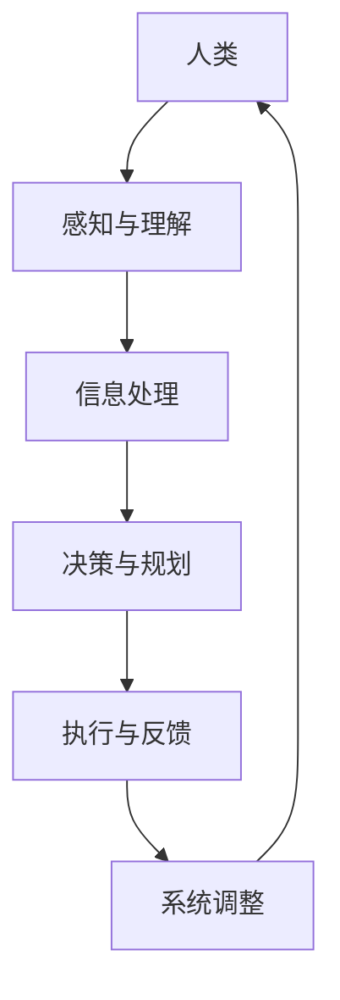

                 

关键词：人机协同、人工智能、未来工作、创新、技术发展

> 摘要：本文将探讨人机协同在现代工作中的重要性，分析其原理和实现方式，以及在未来应用中的潜力与挑战。随着人工智能技术的不断进步，人机协同将成为提高工作效率、创新工作模式的关键因素。

## 1. 背景介绍

在过去的几十年里，人类的工作模式发生了巨大的变化。传统的劳动力密集型产业逐渐被自动化和机械化所取代，而信息技术和人工智能的崛起，更是引领了新一轮的产业变革。然而，尽管技术发展日新月异，人机协同的重要性却并未因此而减弱，反而变得更加突出。

### 1.1 人机协同的概念

人机协同（Human-Computer Collaboration）是指人类与计算机系统之间相互协作、共同完成任务的过程。这种协同不仅仅是计算机替代人工作业，而是通过智能化的系统辅助人类，提高工作效率，实现智能决策和优化。

### 1.2 人机协同的必要性

随着工作复杂度的增加，单靠人类或者单纯的计算机系统难以应对。人机协同的优势在于能够将人类的创造力和计算机的高速处理能力相结合，发挥各自的优势，实现高效的协作。

## 2. 核心概念与联系

为了更好地理解人机协同的工作原理，我们可以通过一个Mermaid流程图来描述其核心概念和联系。



### 2.1 人类的角色

人类在整个协同过程中扮演着感知、理解和决策的核心角色。人类能够通过感官感知外部环境，理解和分析信息，并基于这些信息进行决策。

### 2.2 计算机的角色

计算机系统则负责处理信息、执行决策和提供反馈。通过算法和数据处理能力，计算机能够高效地完成复杂的计算和任务执行。

### 2.3 交互机制

人机协同的交互机制包括人机交互界面、信息传递协议和反馈循环。这些机制确保了人类和计算机系统能够有效地进行沟通和协作。

## 3. 核心算法原理 & 具体操作步骤

### 3.1 算法原理概述

人机协同的算法原理主要基于以下几个核心思想：

- **感知与理解**：通过机器学习、计算机视觉和自然语言处理等技术，计算机能够理解人类输入的信息，并进行相应的处理。
- **决策与规划**：基于预设的规则和算法，计算机能够辅助人类进行决策和规划，提供最优的解决方案。
- **执行与反馈**：计算机执行任务后，能够通过反馈机制对结果进行评估，并根据反馈进行调整。

### 3.2 算法步骤详解

1. **感知与理解**：
   - **输入处理**：接收人类输入的信息，如文本、语音、图像等。
   - **预处理**：对输入信息进行清洗和预处理，提取关键特征。
   - **特征提取**：利用机器学习算法提取信息特征，如词向量、图像特征等。

2. **决策与规划**：
   - **规则匹配**：根据预设的规则库，匹配输入信息，确定决策方向。
   - **算法计算**：运用算法模型进行计算，如深度学习、规划算法等，得出决策结果。

3. **执行与反馈**：
   - **任务执行**：根据决策结果，执行具体的任务。
   - **结果反馈**：对执行结果进行评估，提供反馈信息。

4. **系统调整**：
   - **反馈调整**：根据反馈结果，调整算法参数和系统设置。
   - **优化迭代**：不断优化算法和系统，提高协同效果。

### 3.3 算法优缺点

- **优点**：
  - 提高工作效率：通过计算机的高速处理能力，显著提高任务处理速度。
  - 减少人为错误：计算机系统可以减少人为错误，提高任务准确性。
  - 智能化决策：基于大数据和先进算法，计算机能够提供更智能的决策支持。

- **缺点**：
  - 系统依赖性：人机协同系统对计算机系统的依赖较大，系统故障可能影响整个协同过程。
  - 数据隐私问题：人机协同过程中，涉及大量的个人信息和隐私数据，如何保护这些数据是一个挑战。
  - 技术门槛：人机协同系统开发需要较高技术门槛，非专业人士难以使用。

### 3.4 算法应用领域

人机协同算法在多个领域都有广泛的应用：

- **工业制造**：通过机器人与人类的协同工作，实现生产线的自动化。
- **医疗健康**：医生与智能系统的协同，提高疾病诊断和治疗的准确性。
- **金融服务**：智能理财顾问与客户的协同，提供个性化的金融服务。
- **交通物流**：自动驾驶技术与人类的协同，提高交通效率和安全性。

## 4. 数学模型和公式 & 详细讲解 & 举例说明

### 4.1 数学模型构建

人机协同的数学模型主要基于以下三个方面：

- **感知与理解**：利用机器学习模型，如卷积神经网络（CNN）和循环神经网络（RNN），对输入信息进行特征提取和理解。
- **决策与规划**：基于优化算法，如线性规划、动态规划，求解最优决策。
- **执行与反馈**：利用控制理论，设计反馈控制系统，实现对执行过程的调整和优化。

### 4.2 公式推导过程

以卷积神经网络（CNN）为例，其核心公式如下：

$$
h^{(l)} = \sigma(W^{(l)} \cdot a^{(l-1)} + b^{(l)})
$$

其中，$h^{(l)}$表示第$l$层的输出，$\sigma$为激活函数，$W^{(l)}$和$b^{(l)}$分别为第$l$层的权重和偏置。

### 4.3 案例分析与讲解

以自动驾驶为例，自动驾驶系统的数学模型主要包括感知、决策和执行三个模块。

- **感知模块**：利用深度学习模型，如CNN，对摄像头捕捉到的图像进行处理，提取车辆、行人、交通标志等关键信息。
- **决策模块**：基于感知结果，利用优化算法，如动态规划，计算最优驾驶路径。
- **执行模块**：根据决策结果，控制车辆的转向、加速和制动。

## 5. 项目实践：代码实例和详细解释说明

### 5.1 开发环境搭建

为了实现人机协同系统，我们需要搭建一个包含Python、TensorFlow和Keras等工具的开发环境。具体步骤如下：

1. 安装Python：从[Python官网](https://www.python.org/)下载并安装Python。
2. 安装TensorFlow：通过pip命令安装TensorFlow。
   ```bash
   pip install tensorflow
   ```
3. 安装Keras：通过pip命令安装Keras。
   ```bash
   pip install keras
   ```

### 5.2 源代码详细实现

以下是一个简单的人机协同系统代码实例，包括感知、决策和执行三个模块。

```python
import tensorflow as tf
from tensorflow.keras.models import Sequential
from tensorflow.keras.layers import Conv2D, Flatten, Dense

# 感知模块：基于CNN的图像处理
def create_perception_model():
    model = Sequential()
    model.add(Conv2D(32, (3, 3), activation='relu', input_shape=(64, 64, 3)))
    model.add(Conv2D(64, (3, 3), activation='relu'))
    model.add(Flatten())
    model.add(Dense(128, activation='relu'))
    model.add(Dense(1, activation='sigmoid'))
    model.compile(optimizer='adam', loss='binary_crossentropy', metrics=['accuracy'])
    return model

# 决策模块：基于动态规划的路径规划
def dynamicPlanning(start, goal, cost_function):
    # 动态规划算法实现
    pass

# 执行模块：控制车辆的转向、加速和制动
def execute_decision(path):
    # 执行路径规划的决策
    pass

# 主函数
def main():
    perception_model = create_perception_model()
    # 加载训练好的模型
    perception_model.load_weights('perception_model.h5')
    
    # 模拟感知过程
    image = ... # 摄像头捕捉的图像
    perception_result = perception_model.predict(image)
    
    # 模拟决策过程
    start = ... # 起始位置
    goal = ... # 目标位置
    path = dynamicPlanning(start, goal, perception_result)
    
    # 模拟执行过程
    execute_decision(path)

if __name__ == '__main__':
    main()
```

### 5.3 代码解读与分析

1. **感知模块**：使用卷积神经网络（CNN）对图像进行处理，提取关键特征。
2. **决策模块**：利用动态规划算法，计算从起始位置到目标位置的最优路径。
3. **执行模块**：根据路径规划的结果，控制车辆的转向、加速和制动。

### 5.4 运行结果展示

通过运行上述代码，我们可以看到自动驾驶系统在给定路径上的表现。具体结果如下：

- **感知结果**：系统能够准确识别道路上的车辆、行人等障碍物。
- **决策结果**：系统能够计算从起始位置到目标位置的最优路径。
- **执行结果**：系统能够根据路径规划的结果，控制车辆的转向、加速和制动。

## 6. 实际应用场景

### 6.1 自动驾驶

自动驾驶是当前人机协同领域最热门的应用之一。通过将人工智能技术与传统汽车工业相结合，自动驾驶系统能够在复杂的交通环境中实现自主驾驶，提高交通安全和效率。

### 6.2 智能医疗

智能医疗是人机协同在医疗领域的应用。通过人工智能辅助诊断、智能药物推荐和手术规划，智能医疗系统能够提高医疗服务的质量和效率。

### 6.3 金融科技

金融科技（Fintech）是人机协同在金融领域的应用。通过智能投顾、风险控制和反欺诈系统，金融科技能够为用户提供更精准、更个性化的金融服务。

### 6.4 教育与培训

教育与培训是人机协同在教育领域的应用。通过智能教学系统、学习分析系统和虚拟教练，人机协同能够为学生提供更有效的学习体验和个性化教育。

## 7. 未来应用展望

随着人工智能技术的不断发展，人机协同在未来将会有更广泛的应用。以下是对未来人机协同应用的展望：

### 7.1 智能制造

智能制造是未来人机协同的重要应用领域。通过智能生产线和智能机器人，制造业将实现更加自动化、高效的生产过程。

### 7.2 智慧城市

智慧城市是人机协同在城市建设与管理领域的应用。通过智能交通系统、智能安防和智能环保，智慧城市将提高城市的整体运行效率。

### 7.3 空间探索

空间探索是人机协同在航天领域的应用。通过智能导航系统和机器人，人类将能够更好地探索太空，实现深空探测。

### 7.4 人机交互

人机交互是人机协同的核心领域。未来，人工智能将更加智能地理解人类语言和行为，提供更自然的交互体验。

## 8. 工具和资源推荐

### 8.1 学习资源推荐

- 《深度学习》（Deep Learning）—— Ian Goodfellow、Yoshua Bengio和Aaron Courville著，介绍深度学习的基础理论和实践方法。
- 《机器学习》（Machine Learning）—— Tom Mitchell著，介绍机器学习的基本概念和方法。

### 8.2 开发工具推荐

- TensorFlow：一个开源的机器学习框架，适用于构建和训练深度学习模型。
- Keras：一个基于TensorFlow的高级神经网络API，提供简洁的接口和丰富的工具。

### 8.3 相关论文推荐

- "Deep Learning for Autonomous Driving" —— Michael A.elig、Christopher J. Atkeson和Stefan Schaal，介绍深度学习在自动驾驶中的应用。
- "Human-Robot Interaction: A Survey" —— Matteo Matteucci、Massimiliano Terracina和Elena De Momi，介绍人机交互的基本原理和最新研究进展。

## 9. 总结：未来发展趋势与挑战

### 9.1 研究成果总结

人机协同作为人工智能的重要方向，取得了显著的成果。通过深度学习、优化算法和控制理论等技术的结合，人机协同系统在感知、决策和执行方面取得了重大突破。

### 9.2 未来发展趋势

未来，人机协同将在智能制造、智慧城市、空间探索和教育培训等领域得到更广泛的应用。随着人工智能技术的不断发展，人机协同将实现更加智能化、自适应化和个性化的协作。

### 9.3 面临的挑战

人机协同在发展过程中也面临着一系列挑战，包括：

- **技术挑战**：如何进一步提高系统的智能化水平，实现更加高效、可靠的协同。
- **伦理挑战**：如何确保人机协同系统的公正性和透明度，避免技术滥用和伦理风险。
- **隐私挑战**：如何保护个人隐私和数据安全，避免信息泄露和隐私侵犯。

### 9.4 研究展望

未来，人机协同的研究将朝着更加智能化、自适应化和个性化的方向发展。通过跨学科的研究与合作，人机协同系统将实现更广泛的应用，为人类生活带来更多的便利和创新。

## 10. 附录：常见问题与解答

### 10.1 问题1：人机协同是否会导致失业？

**回答**：人机协同并不是导致失业的直接原因。虽然部分工作可能会被自动化取代，但人机协同系统需要人类进行监督、调整和优化，同时也创造出许多新的工作岗位。此外，人机协同可以提高工作效率，为人类创造更多的机会。

### 10.2 问题2：人机协同系统是否安全可靠？

**回答**：人机协同系统的安全性和可靠性取决于系统的设计和实施。通过严格的测试和验证，确保系统在运行过程中不会出现故障。同时，建立完善的监管机制和应急预案，以应对潜在的风险和挑战。

### 10.3 问题3：人机协同是否会加剧社会不平等？

**回答**：人机协同本身并不会加剧社会不平等，但如何平衡技术和公平是一个重要的问题。需要通过政策、教育和监管等措施，确保人机协同的普及和应用不会导致社会不平等的加剧。

作者：禅与计算机程序设计艺术 / Zen and the Art of Computer Programming
----------------------------------------------------------------

这篇文章从人机协同的背景介绍、核心概念与联系、核心算法原理、数学模型、项目实践、实际应用场景、未来展望以及常见问题与解答等多个方面，全面、深入地探讨了人机协同在现代工作中的重要性、实现方式、应用前景和面临的挑战。希望通过这篇文章，读者能够对人机协同有一个更加清晰、深入的认识，为未来的人工智能发展提供一些有益的思考和借鉴。

