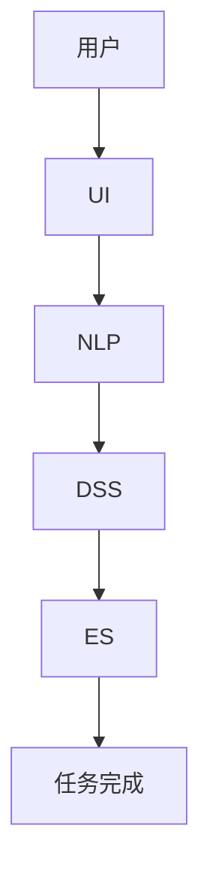

                 

关键词：人机协同，未来工作，人工智能，生产力，效率，职业转型

> 摘要：随着人工智能技术的快速发展，人机协同正逐渐成为未来工作的核心竞争力。本文旨在探讨人机协同的背景、核心概念、算法原理、实际应用、未来发展，以及面临的挑战和机遇。

## 1. 背景介绍

随着科技的飞速发展，人工智能（AI）已经成为改变各行各业的强大力量。从自动化生产线到智能客服，从图像识别到自然语言处理，AI的应用已经深入到我们生活的方方面面。然而，AI的迅猛发展也带来了一系列挑战，比如职业转型、技能要求的变化、伦理和法律问题等。因此，如何实现人机协同，提高工作效率，成为企业和个人都需要面对的课题。

人机协同指的是人与机器之间通过合作、交互、融合来实现更高效、更智能的工作方式。在未来的职场中，人机协同不仅能够提高生产力，还能够激发人类的创造力和创新能力。

## 2. 核心概念与联系

### 2.1. 人机协同的定义

人机协同是指人类与机器通过特定的方式相互配合，实现优势互补，共同完成任务的过程。在这一过程中，人类负责创造性思维、决策和复杂的情感交互，而机器则负责高效、精确的计算和重复性工作。

### 2.2. 人机协同的架构


在人机协同的架构中，主要包括以下几个部分：

- **用户界面（UI）**：用户通过UI与系统进行交互，输入指令或获取信息。
- **自然语言处理（NLP）**：负责理解和生成自然语言，实现人与机器之间的语言交流。
- **决策支持系统（DSS）**：利用数据和算法为人类决策提供支持。
- **执行系统（ES）**：根据决策支持系统的指令执行具体任务。

### 2.3. Mermaid 流程图



## 3. 核心算法原理 & 具体操作步骤

### 3.1. 算法原理概述

人机协同的核心算法主要涉及机器学习、深度学习和自然语言处理等技术。这些算法通过大量的数据和复杂的模型，使机器能够理解人类的意图，并自动执行任务。

### 3.2. 算法步骤详解

1. **数据收集**：收集用户行为数据、任务需求数据等。
2. **数据预处理**：对数据进行清洗、归一化等处理。
3. **特征提取**：从预处理后的数据中提取特征。
4. **模型训练**：利用提取的特征训练机器学习模型。
5. **模型评估**：评估模型的准确性和性能。
6. **模型部署**：将训练好的模型部署到生产环境中。
7. **用户交互**：通过UI与用户进行交互，获取指令。
8. **任务执行**：根据用户指令执行任务。

### 3.3. 算法优缺点

- **优点**：提高工作效率，减少人力成本，实现精确化、自动化。
- **缺点**：对数据和算法质量要求高，初期投入成本较大。

### 3.4. 算法应用领域

人机协同算法广泛应用于金融、医疗、制造、零售等多个行业，如智能客服、自动驾驶、医疗诊断等。

## 4. 数学模型和公式 & 详细讲解 & 举例说明

### 4.1. 数学模型构建

在人机协同中，常用的数学模型包括机器学习模型、神经网络模型等。以下是一个简单的神经网络模型：

$$
y = f(z)
$$

其中，$y$ 是输出，$z$ 是输入，$f$ 是激活函数。

### 4.2. 公式推导过程

神经网络的推导过程涉及大量的数学知识，如微积分、线性代数等。这里简要介绍一下：

1. **前向传播**：计算输入层到隐藏层的输出。
2. **反向传播**：计算误差，并更新权重和偏置。

### 4.3. 案例分析与讲解

假设我们要构建一个简单的神经网络模型，用于分类任务。输入层有3个神经元，隐藏层有2个神经元，输出层有1个神经元。我们使用 sigmoid 函数作为激活函数。输入数据为 [1, 0, 1]，目标输出为 [1]。

- **前向传播**：
$$
z_1 = 1 \cdot w_{11} + 0 \cdot w_{12} + 1 \cdot w_{13} = w_{11} + w_{13}
$$
$$
z_2 = 1 \cdot w_{21} + 0 \cdot w_{22} + 1 \cdot w_{23} = w_{21} + w_{23}
$$
$$
a_1 = f(z_1) = \frac{1}{1 + e^{-z_1}}
$$
$$
a_2 = f(z_2) = \frac{1}{1 + e^{-z_2}}
$$
$$
z_3 = a_1 \cdot w_{31} + a_2 \cdot w_{32} = a_1w_{31} + a_2w_{32}
$$
$$
y = f(z_3) = \frac{1}{1 + e^{-z_3}}
$$

- **反向传播**：
计算误差 $e = y - t$，然后更新权重和偏置。

## 5. 项目实践：代码实例和详细解释说明

### 5.1. 开发环境搭建

- Python 3.8及以上版本
- TensorFlow 2.6及以上版本

### 5.2. 源代码详细实现

```python
import tensorflow as tf

# 定义模型
model = tf.keras.Sequential([
    tf.keras.layers.Dense(2, activation='sigmoid', input_shape=(3,)),
    tf.keras.layers.Dense(1, activation='sigmoid')
])

# 编译模型
model.compile(optimizer='adam', loss='binary_crossentropy', metrics=['accuracy'])

# 训练模型
model.fit(x_train, y_train, epochs=1000, verbose=0)

# 预测
predictions = model.predict(x_test)
```

### 5.3. 代码解读与分析

- **模型定义**：定义了一个简单的神经网络模型，包含一个输入层、一个隐藏层和一个输出层。
- **编译模型**：设置优化器和损失函数。
- **训练模型**：使用训练数据训练模型。
- **预测**：使用训练好的模型进行预测。

## 6. 实际应用场景

### 6.1. 智能客服

智能客服是AI技术在人机协同领域的典型应用。通过NLP技术，智能客服能够理解用户的提问，并提供合适的答复。这不仅提高了客服效率，还降低了人力成本。

### 6.2. 自动驾驶

自动驾驶是AI和计算机视觉技术的结合。通过摄像头和传感器收集环境信息，自动驾驶系统能够实时分析路况，并做出相应的驾驶决策。这种人机协同的方式极大地提高了驾驶安全性。

### 6.3. 医疗诊断

在医疗领域，AI可以帮助医生进行诊断。通过深度学习算法，AI能够从大量医疗数据中识别出疾病特征，辅助医生做出诊断。这种人机协同的方式有助于提高诊断的准确性。

### 6.4. 未来应用展望

随着AI技术的不断进步，人机协同将在更多领域得到应用。例如，智能制造、智能家居、智慧城市等。未来，人机协同将成为提升生产力、改善生活质量的重要手段。

## 7. 工具和资源推荐

### 7.1. 学习资源推荐

- 《深度学习》（Ian Goodfellow、Yoshua Bengio、Aaron Courville 著）
- 《机器学习》（周志华 著）
- 《自然语言处理综论》（Daniel Jurafsky、James H. Martin 著）

### 7.2. 开发工具推荐

- TensorFlow：用于构建和训练机器学习模型的强大工具。
- PyTorch：一个易于使用且灵活的深度学习框架。
- Keras：一个高层神经网络API，易于快速构建和迭代深度学习模型。

### 7.3. 相关论文推荐

- "Deep Learning for Natural Language Processing"（2018）
- "Generative Adversarial Networks"（2014）
- "Residual Networks"（2015）

## 8. 总结：未来发展趋势与挑战

### 8.1. 研究成果总结

人机协同技术已经在多个领域取得了显著的成果。随着算法的进步和计算能力的提升，人机协同有望在未来发挥更大的作用。

### 8.2. 未来发展趋势

- **算法精度提升**：随着算法的改进，人机协同的准确性和效率将进一步提高。
- **应用领域拓展**：人机协同将在更多领域得到应用，如教育、金融、医疗等。
- **个性化服务**：人机协同将更加注重个性化服务，满足不同用户的需求。

### 8.3. 面临的挑战

- **数据隐私和安全**：如何确保用户数据的安全和隐私是一个重要挑战。
- **伦理和法律问题**：如何确保AI技术的伦理和法律合规性，也是一个亟待解决的问题。

### 8.4. 研究展望

未来，人机协同技术将在算法、硬件、应用等多个方面取得突破。研究者和开发者需要共同努力，推动人机协同技术走向成熟。

## 9. 附录：常见问题与解答

### 9.1. 什么是人机协同？

人机协同是指人类与机器通过合作、交互、融合来实现更高效、更智能的工作方式。

### 9.2. 人机协同有哪些应用场景？

人机协同广泛应用于智能客服、自动驾驶、医疗诊断、智能制造等领域。

### 9.3. 人机协同有哪些优势？

人机协同可以提高工作效率，降低人力成本，实现精确化、自动化。

### 9.4. 人机协同有哪些挑战？

人机协同面临的挑战包括数据隐私和安全、伦理和法律问题等。

## 作者署名

作者：禅与计算机程序设计艺术 / Zen and the Art of Computer Programming
----------------------------------------------------------------

这篇文章详细探讨了人机协同的背景、核心概念、算法原理、实际应用、未来发展，以及面临的挑战和机遇。通过详细的数学模型和公式讲解、项目实践代码实例，以及丰富的实际应用场景分析，文章全面展现了人机协同的广阔前景和重要性。希望这篇文章能对读者在理解人机协同技术、把握未来发展趋势方面有所启发和帮助。

