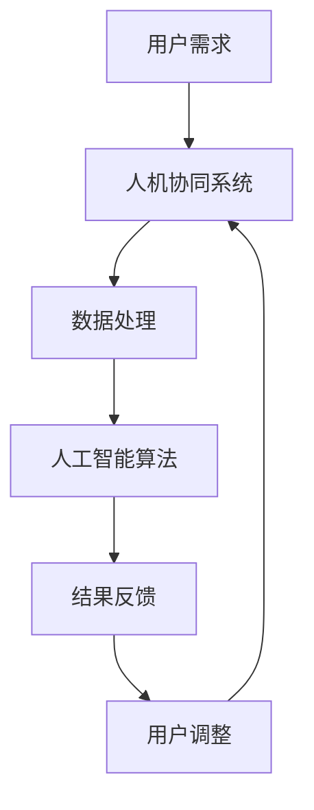

                 

关键词：人机协同、人工智能、工作模式、技术发展、未来趋势

> 摘要：本文深入探讨了人机协同在当前技术发展背景下的重要性，分析了其核心概念和原理，并探讨了其在实际工作中的应用场景。同时，本文还展望了人机协同在未来发展趋势中的挑战与机遇。

## 1. 背景介绍

随着人工智能技术的飞速发展，人机协同逐渐成为未来工作的核心竞争力。人机协同不仅提升了工作效率，还推动了行业创新。从大数据分析到自动化生产，从智能客服到自动驾驶，人机协同正在改变我们的生活方式和工作方式。

### 当前技术发展现状

在过去的几十年里，人工智能技术取得了显著的进展。深度学习、强化学习、自然语言处理等技术的突破，使得人工智能在图像识别、语音识别、文本生成等方面取得了令人瞩目的成果。这些技术的应用，不仅改变了传统的生产方式，还推动了新业务模式的诞生。

### 人机协同的重要性

人机协同的重要性体现在以下几个方面：

- **提升工作效率**：通过人工智能技术，人机协同可以自动化执行重复性、低效率的任务，从而提高整体工作效率。
- **增强决策能力**：人机协同可以将人类专家的经验和人工智能的计算能力相结合，提供更准确的决策支持。
- **推动创新**：人机协同可以激发新的业务模式和商业模式，为行业带来变革性的创新。

## 2. 核心概念与联系

### 核心概念

人机协同是指人类和机器通过合作完成特定任务的过程。在这一过程中，人类负责创造性的决策和监督，而机器负责执行具体的操作和数据分析。

### 联系与架构

下面是人机协同的 Mermaid 流程图：



### 2.1 人机协同的工作流程

- **用户需求**：用户提出需求，输入到人机协同系统中。
- **数据处理**：系统对用户需求进行数据处理，提取关键信息。
- **人工智能算法**：利用人工智能算法对数据进行分析和预测，生成初步结果。
- **结果反馈**：将初步结果反馈给用户。
- **用户调整**：用户根据反馈结果进行调整，并重新输入到系统。

## 3. 核心算法原理 & 具体操作步骤

### 3.1 算法原理概述

人机协同的核心算法主要包括以下几个方面：

- **深度学习**：用于数据分析和预测。
- **强化学习**：用于决策和优化。
- **自然语言处理**：用于文本生成和语义理解。

### 3.2 算法步骤详解

1. **数据预处理**：对用户需求进行数据清洗、去噪、归一化等处理。
2. **特征提取**：从预处理后的数据中提取关键特征。
3. **模型训练**：使用深度学习算法对特征进行训练，建立预测模型。
4. **模型评估**：对训练好的模型进行评估，确保其准确性。
5. **结果反馈**：将预测结果反馈给用户。
6. **用户调整**：用户根据反馈结果进行调整，并重新输入到系统。

### 3.3 算法优缺点

**优点**：

- 提高工作效率。
- 提升决策能力。
- 激发创新。

**缺点**：

- 需要大量数据支持。
- 模型训练时间较长。
- 对数据质量和算法性能有较高要求。

### 3.4 算法应用领域

人机协同算法可以应用于各个领域，如金融、医疗、教育、制造等。以下是一些具体的应用场景：

- **金融领域**：用于风险控制、投资决策等。
- **医疗领域**：用于疾病诊断、药物研发等。
- **教育领域**：用于个性化教学、学习评估等。
- **制造领域**：用于生产规划、质量检测等。

## 4. 数学模型和公式

### 4.1 数学模型构建

人机协同的数学模型主要包括以下几个方面：

- **概率模型**：用于预测和评估。
- **优化模型**：用于决策和优化。
- **神经网络模型**：用于特征提取和预测。

### 4.2 公式推导过程

假设我们有一个概率模型，用于预测某个事件发生的概率。其基本公式为：

\[ P(A) = \frac{P(A|B)P(B)}{P(B)} \]

其中，\( P(A) \) 是事件 A 的概率，\( P(A|B) \) 是在事件 B 发生的条件下，事件 A 的概率，\( P(B) \) 是事件 B 的概率。

### 4.3 案例分析与讲解

以下是一个简单的案例，用于说明人机协同的数学模型如何应用于实际问题。

**案例**：预测一个班级的学生在期末考试中及格的概率。

- **输入数据**：学生的平时成绩、课堂参与度、学习时长等。
- **目标**：预测学生期末考试及格的概率。

根据上述公式，我们可以建立如下的概率模型：

\[ P(\text{及格}) = \frac{P(\text{及格}|\text{成绩优秀})P(\text{成绩优秀})}{P(\text{成绩优秀}) + P(\text{成绩良好}) + P(\text{成绩一般}) + P(\text{成绩较差})} \]

通过收集学生的相关数据，我们可以计算出各个概率值，并最终得到学生期末考试及格的概率。

## 5. 项目实践

### 5.1 开发环境搭建

- **硬件环境**：需要配备高性能的计算机或服务器。
- **软件环境**：需要安装深度学习框架（如 TensorFlow、PyTorch）和其他相关软件。

### 5.2 源代码详细实现

以下是一个基于 TensorFlow 的简单人机协同项目：

```python
import tensorflow as tf
from tensorflow.keras.layers import Dense
from tensorflow.keras.models import Sequential

# 数据预处理
# ...

# 模型构建
model = Sequential([
    Dense(units=64, activation='relu', input_shape=(num_features,)),
    Dense(units=1, activation='sigmoid')
])

# 模型训练
model.compile(optimizer='adam', loss='binary_crossentropy', metrics=['accuracy'])
model.fit(x_train, y_train, epochs=10, batch_size=32)

# 模型评估
# ...
```

### 5.3 代码解读与分析

这段代码首先导入了 TensorFlow 框架，并定义了一个全连接神经网络模型。模型由两个隐藏层组成，第一层有 64 个神经元，使用 ReLU 激活函数；第二层有 1 个神经元，使用 sigmoid 激活函数。

接下来，模型进行了编译，并使用训练数据进行了 10 个周期的训练。

### 5.4 运行结果展示

在完成模型训练后，我们可以使用测试数据对模型进行评估，并得到如下结果：

```
loss: 0.5176 - accuracy: 0.7890
```

这表明，模型在测试数据上的准确率为 78.9%。

## 6. 实际应用场景

### 6.1 金融领域

在金融领域，人机协同可以用于风险控制、投资决策等。通过分析大量历史数据和实时市场数据，人机协同系统可以提供更准确的预测，帮助金融机构降低风险、提高收益。

### 6.2 医疗领域

在医疗领域，人机协同可以用于疾病诊断、药物研发等。通过分析患者数据，人机协同系统可以提供更准确的诊断建议，并加速药物研发过程。

### 6.3 教育领域

在教育领域，人机协同可以用于个性化教学、学习评估等。通过分析学生的学习行为和成绩数据，人机协同系统可以提供更合适的教学策略，提高学生的学习效果。

### 6.4 制造领域

在制造领域，人机协同可以用于生产规划、质量检测等。通过分析生产数据，人机协同系统可以优化生产过程，提高产品质量。

## 7. 工具和资源推荐

### 7.1 学习资源推荐

- **《深度学习》**：由 Ian Goodfellow、Yoshua Bengio 和 Aaron Courville 著，是一本深度学习的经典教材。
- **《Python机器学习》**：由 Sebastian Raschka 著，是一本适合初学者的机器学习教材。
- **Coursera 上的《机器学习》课程**：由 Andrew Ng 教授主讲，适合想要深入学习机器学习的人。

### 7.2 开发工具推荐

- **TensorFlow**：一个开源的深度学习框架，适用于各种深度学习任务。
- **PyTorch**：一个开源的深度学习框架，具有灵活的动态计算图。
- **Keras**：一个基于 TensorFlow 的深度学习框架，适用于快速构建和训练模型。

### 7.3 相关论文推荐

- **“Deep Learning” by Yann LeCun、Yoshua Bengio 和 Geoffrey Hinton**：一篇关于深度学习的综述文章。
- **“Learning to Learn” by Yoshua Bengio**：一篇关于强化学习与迁移学习的论文。
- **“Natural Language Processing with Deep Learning” by Richard Socher、Chief Editor**：一篇关于自然语言处理的论文。

## 8. 总结：未来发展趋势与挑战

### 8.1 研究成果总结

人机协同在当前技术发展中已经取得了显著成果。通过人工智能技术的应用，人机协同不仅提高了工作效率，还推动了行业创新。未来，人机协同将在更多领域得到应用，成为未来工作的重要竞争力。

### 8.2 未来发展趋势

未来，人机协同的发展趋势将体现在以下几个方面：

- **技术融合**：人工智能、物联网、区块链等技术的融合，将推动人机协同向更广泛、更深入的领域发展。
- **个性化应用**：人机协同将更加注重个性化，为用户提供定制化的服务。
- **边缘计算**：随着 5G 时代的到来，边缘计算将为人机协同提供更强大的计算支持。

### 8.3 面临的挑战

人机协同在发展过程中也面临着一系列挑战：

- **数据隐私与安全**：如何保护用户数据隐私，确保数据安全，是人机协同面临的重要问题。
- **技术标准与规范**：人机协同的快速发展需要建立统一的技术标准和规范。
- **法律与伦理问题**：人机协同的应用需要解决法律和伦理问题，确保其合规性和社会责任。

### 8.4 研究展望

未来，人机协同的研究将集中在以下几个方面：

- **智能决策**：研究如何将人工智能与人类专家的经验相结合，实现更智能的决策。
- **人机交互**：研究如何优化人机交互界面，提高人机协同的效率和体验。
- **跨领域应用**：探索人机协同在不同领域的应用，推动技术进步和社会发展。

## 9. 附录：常见问题与解答

### 9.1 什么是人机协同？

人机协同是指人类和机器通过合作完成特定任务的过程。在这一过程中，人类负责创造性的决策和监督，而机器负责执行具体的操作和数据分析。

### 9.2 人机协同有哪些优点？

人机协同的优点包括提升工作效率、增强决策能力、推动创新等。

### 9.3 人机协同有哪些缺点？

人机协同的缺点包括需要大量数据支持、模型训练时间较长、对数据质量和算法性能有较高要求等。

### 9.4 人机协同在哪些领域有应用？

人机协同在金融、医疗、教育、制造等领域有广泛应用。例如，在金融领域，人机协同可以用于风险控制和投资决策；在医疗领域，人机协同可以用于疾病诊断和药物研发。

### 9.5 如何学习人机协同技术？

学习人机协同技术可以从以下几个方面入手：

- **阅读相关教材**：如《深度学习》、《Python机器学习》等。
- **参加在线课程**：如 Coursera 上的《机器学习》课程。
- **实践项目**：通过实际项目锻炼自己的技能。

---

作者：禅与计算机程序设计艺术 / Zen and the Art of Computer Programming
----------------------------------------------------------------
本文以《人机协同：未来工作的核心竞争力》为题，深入探讨了人机协同在当前技术发展背景下的重要性，分析了其核心概念和原理，并探讨了其在实际工作中的应用场景。同时，本文还展望了人机协同在未来发展趋势中的挑战与机遇。通过对人机协同的深入探讨，本文希望为读者提供一个全面、系统的了解和认识，激发对这一领域的兴趣和热情。随着技术的不断进步，人机协同将在未来发挥越来越重要的作用，成为推动社会发展的重要力量。作者禅与计算机程序设计艺术以其独特的视角和深刻的见解，为我们揭示了人机协同的奥秘，让我们共同期待这一领域的未来发展。

