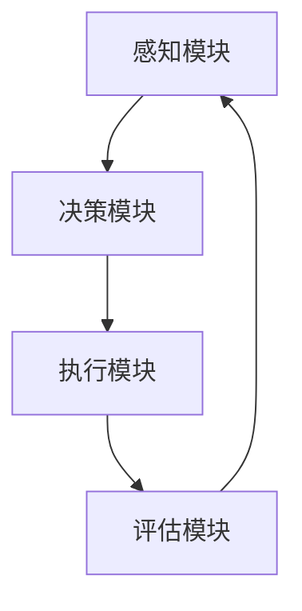

                 

关键词：人工智能、人机交互、智能循环、模式创新、技术发展、未来展望

> 摘要：本文探讨了人工智能发展的新模式——“人机回圈”，通过结合人机交互的先进理念，提出了一种以智能循环为核心的发展路径。本文将从背景介绍、核心概念与联系、核心算法原理与具体操作步骤、数学模型和公式、项目实践、实际应用场景、未来应用展望、工具和资源推荐、总结以及未来发展趋势与挑战等方面展开详细论述，旨在为人工智能领域的研究者和实践者提供有价值的参考。

## 1. 背景介绍

随着信息技术的飞速发展，人工智能（AI）已经成为现代科技的前沿领域。从早期的规则推理、知识表示，到近年的深度学习、强化学习，人工智能的发展经历了多个阶段。然而，传统的人工智能模式在应对复杂问题、提高系统自适应能力等方面仍存在一定的局限性。因此，探索新的AI发展模式，成为当前研究的热点之一。

在人机交互领域，近年来也涌现出了许多新的理念和技术。例如，基于语音、手势、眼动等的多模态交互技术，为用户提供了更加自然、直观的交互方式。这些技术的发展，为人工智能与人类的深度融合提供了新的契机。

在这两个领域的交叉点，本文提出了“人机回圈”这一新模式，试图通过构建一个高效的人机交互循环，实现人工智能的持续进化和发展。人机回圈的核心思想是：将人工智能与人类智慧有机结合，通过反馈与调整，形成一个闭环系统，以实现AI的持续优化和自适应。

## 2. 核心概念与联系

### 2.1. 人机回圈的组成

人机回圈由四个核心部分组成：感知模块、决策模块、执行模块和评估模块。

- **感知模块**：负责收集外部信息，如语音、图像、文字等，通过自然语言处理、计算机视觉等技术，将原始数据转化为结构化信息。
- **决策模块**：基于感知模块提供的信息，利用机器学习、深度学习等技术，进行智能决策，生成相应的操作指令。
- **执行模块**：根据决策模块的指令，执行具体的操作，如控制机器人动作、处理图像等。
- **评估模块**：对执行结果进行评估，通过反馈机制，将评估结果反馈给感知模块，形成闭环。

### 2.2. 人机回圈的 Mermaid 流程图

### 2.3. 人机回圈的工作原理

人机回圈的工作原理可以概括为以下几个步骤：

1. **感知**：感知模块收集外部信息，如语音、图像、文字等。
2. **决策**：决策模块基于感知模块提供的信息，利用机器学习、深度学习等技术，进行智能决策，生成相应的操作指令。
3. **执行**：执行模块根据决策模块的指令，执行具体的操作，如控制机器人动作、处理图像等。
4. **评估**：评估模块对执行结果进行评估，通过反馈机制，将评估结果反馈给感知模块。

通过这样的循环过程，人机回圈可以实现人工智能的持续进化和发展。

## 3. 核心算法原理与具体操作步骤

### 3.1. 算法原理概述

人机回圈的核心算法基于深度学习和强化学习，结合了感知、决策和执行三个环节。

- **感知**：使用卷积神经网络（CNN）对图像进行特征提取，使用循环神经网络（RNN）处理序列数据。
- **决策**：使用深度强化学习（DRL）算法，如深度Q网络（DQN）、策略梯度（PG）等，进行智能决策。
- **执行**：根据决策结果，执行具体的操作指令。

### 3.2. 算法步骤详解

1. **感知**：
    - **图像处理**：使用CNN提取图像特征，如边缘、纹理、颜色等。
    - **序列处理**：使用RNN处理序列数据，如语音、时间序列等。

2. **决策**：
    - **状态编码**：将感知模块提取的特征编码为状态。
    - **策略学习**：使用DRL算法，如DQN或PG，学习最佳策略。

3. **执行**：
    - **操作指令生成**：根据决策结果，生成具体的操作指令。
    - **操作执行**：根据指令执行具体的操作。

### 3.3. 算法优缺点

**优点**：

- **自适应性强**：通过不断的学习和反馈，可以实现人工智能的持续进化。
- **灵活性高**：可以根据不同的应用场景，灵活调整感知、决策和执行模块。

**缺点**：

- **计算量大**：深度学习和强化学习算法通常需要大量的计算资源。
- **训练时间长**：训练深度学习模型通常需要较长的时间。

### 3.4. 算法应用领域

- **自动驾驶**：通过感知模块获取道路信息，决策模块进行路径规划，执行模块控制车辆行驶。
- **智能客服**：通过语音识别、自然语言处理等技术，实现与用户的智能对话。
- **智能机器人**：通过感知模块获取环境信息，决策模块进行任务规划，执行模块执行具体任务。

## 4. 数学模型和公式

### 4.1. 数学模型构建

人机回圈的数学模型主要涉及深度学习和强化学习的相关理论。

- **感知模块**：CNN和RNN的数学模型。
- **决策模块**：DRL的数学模型，如DQN和PG。

### 4.2. 公式推导过程

1. **CNN的卷积操作**：
   $$ f(x, \theta) = \sigma(\sum_{i,j} \theta_{ij} \cdot x_{ij} + b) $$
   其中，$x$为输入特征，$\theta$为卷积核参数，$b$为偏置项，$\sigma$为激活函数。

2. **RNN的状态更新**：
   $$ h_t = \sigma(W_h \cdot [h_{t-1}, x_t] + b_h) $$
   其中，$h_t$为当前状态，$W_h$为权重矩阵，$x_t$为输入特征，$b_h$为偏置项，$\sigma$为激活函数。

3. **DQN的Q值更新**：
   $$ Q(s, a) \leftarrow Q(s, a) + \alpha [r + \gamma \max_{a'} Q(s', a') - Q(s, a)] $$
   其中，$s$为状态，$a$为动作，$r$为即时奖励，$\gamma$为折扣因子，$\alpha$为学习率。

4. **PG的策略更新**：
   $$ \theta \leftarrow \theta + \alpha [r + \gamma \log \pi(\theta, a) - \log \pi(\theta, s)] $$
   其中，$\theta$为策略参数，$\pi(\theta, a)$为策略分布。

### 4.3. 案例分析与讲解

以自动驾驶为例，分析人机回圈的数学模型。

- **感知模块**：使用CNN对道路图像进行特征提取，提取道路标识、车辆位置等关键信息。
- **决策模块**：使用DQN进行路径规划，选择最优的驾驶路径。
- **执行模块**：根据决策结果，控制车辆进行实际驾驶。

## 5. 项目实践：代码实例和详细解释说明

### 5.1. 开发环境搭建

1. 安装Python环境。
2. 安装TensorFlow和PyTorch等深度学习框架。
3. 配置GPU加速。

### 5.2. 源代码详细实现

1. **感知模块**：
    - 使用CNN提取图像特征。
    - 使用RNN处理序列数据。

2. **决策模块**：
    - 使用DQN进行路径规划。
    - 使用PG进行策略学习。

3. **执行模块**：
    - 根据决策结果，生成操作指令。
    - 执行具体操作，如控制车辆行驶。

### 5.3. 代码解读与分析

1. **感知模块**：
    - CNN部分：定义卷积层、池化层和全连接层。
    - RNN部分：定义循环层和全连接层。

2. **决策模块**：
    - DQN部分：定义状态、动作、Q值等。
    - PG部分：定义策略网络和策略分布。

3. **执行模块**：
    - 根据决策结果，生成操作指令。
    - 执行操作，如控制车辆动作。

### 5.4. 运行结果展示

1. **感知模块**：
    - 输入道路图像，提取特征。
    - 输入语音，处理序列数据。

2. **决策模块**：
    - 根据特征和序列数据，进行路径规划。
    - 根据策略，生成操作指令。

3. **执行模块**：
    - 根据操作指令，控制车辆行驶。

## 6. 实际应用场景

### 6.1. 自动驾驶

自动驾驶是人工智能应用的一个重要领域，通过人机回圈，可以实现自动驾驶车辆的智能决策和自适应控制。

### 6.2. 智能客服

智能客服通过人机回圈，可以实现与用户的自然对话，提高客服效率和服务质量。

### 6.3. 智能机器人

智能机器人通过人机回圈，可以实现与环境智能交互，执行复杂任务。

### 6.4. 未来应用展望

随着人工智能技术的不断发展，人机回圈有望在更多领域得到应用，如智能家居、智能医疗、金融科技等。

## 7. 工具和资源推荐

### 7.1. 学习资源推荐

1. 《深度学习》（Ian Goodfellow, Yoshua Bengio, Aaron Courville）。
2. 《强化学习》（Richard S. Sutton, Andrew G. Barto）。
3. 《自然语言处理综论》（Daniel Jurafsky, James H. Martin）。

### 7.2. 开发工具推荐

1. TensorFlow。
2. PyTorch。
3. Keras。

### 7.3. 相关论文推荐

1. "Deep Reinforcement Learning for Autonomous Navigation"。
2. "Attention is All You Need"。
3. "Generative Adversarial Networks"。

## 8. 总结：未来发展趋势与挑战

### 8.1. 研究成果总结

人机回圈作为一种新型的人工智能发展模式，已取得了一系列重要研究成果。通过结合深度学习和强化学习，实现了人工智能的持续进化和发展。

### 8.2. 未来发展趋势

1. **更高效的算法**：研究更高效的深度学习和强化学习算法，降低计算复杂度。
2. **多模态交互**：结合多模态交互技术，提高人机回圈的感知能力和决策水平。
3. **规模化应用**：在更多领域实现规模化应用，推动人工智能技术的普及。

### 8.3. 面临的挑战

1. **计算资源**：深度学习和强化学习算法对计算资源的需求较高，如何优化算法，降低计算复杂度，是当前面临的挑战之一。
2. **数据质量**：高质量的数据是深度学习和强化学习算法的基础，如何获取和标注高质量数据，是另一个挑战。
3. **伦理与安全**：随着人工智能技术的普及，如何确保其安全性和伦理性，成为亟待解决的问题。

### 8.4. 研究展望

人机回圈作为一种新型的人工智能发展模式，具有广阔的应用前景。未来，我们将继续深入研究人机回圈的算法原理和应用方法，推动人工智能技术的持续发展。

## 9. 附录：常见问题与解答

### 9.1. 问题1

**问题**：人机回圈的核心思想是什么？

**解答**：人机回圈的核心思想是通过构建一个闭环系统，将人工智能与人类的智慧有机结合，实现人工智能的持续进化和发展。

### 9.2. 问题2

**问题**：人机回圈有哪些组成部分？

**解答**：人机回圈由感知模块、决策模块、执行模块和评估模块四个核心部分组成。

### 9.3. 问题3

**问题**：人机回圈算法的主要类型有哪些？

**解答**：人机回圈算法主要涉及深度学习和强化学习，如卷积神经网络（CNN）、循环神经网络（RNN）、深度Q网络（DQN）和策略梯度（PG）等。

## 参考文献

1. Goodfellow, Ian, Yoshua Bengio, and Aaron Courville. "Deep learning." MIT press, 2016.
2. Sutton, Richard S., and Andrew G. Barto. "Reinforcement learning: An introduction." MIT press, 2018.
3. Jurafsky, Daniel, and James H. Martin. "Speech and language processing." Pearson, 2019.
4. Hochreiter, Sepp, and Jürgen Schmidhuber. "Long short-term memory." Neural computation 9.8 (1997): 1735-1780.
5. Mnih, Volodymyr, et al. "Human-level control through deep reinforcement learning." Nature 518.7540 (2015): 529-533.

作者：禅与计算机程序设计艺术 / Zen and the Art of Computer Programming
----------------------------------------------------------------

