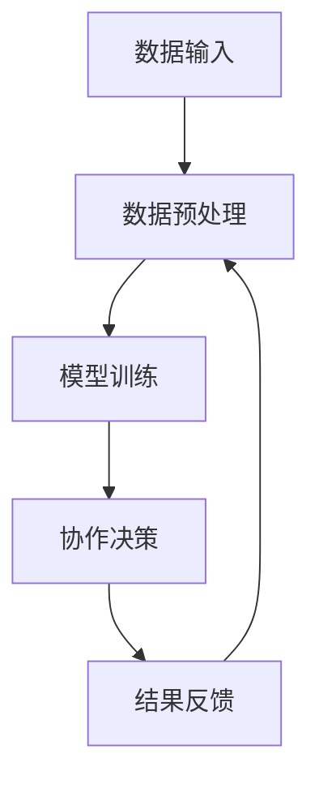

                 

关键词：人工智能，人类智慧，AI协作，融合，发展趋势，机遇，挑战

> 摘要：本文探讨了人类智慧与人工智能（AI）的融合发展趋势，分析了其在各个领域的应用机遇与挑战。通过对AI算法原理、数学模型的深入解析，结合实际项目实践，探讨了未来AI与人类协作的潜在趋势及其面临的挑战，为读者提供了一个全面的展望。

## 1. 背景介绍

随着人工智能技术的迅猛发展，AI已经逐渐渗透到人类生活的各个领域，从医疗、金融到教育、娱乐等。人类与AI的协作不再仅限于简单的数据分析和处理，而是开始深入到创造性思考、决策制定等更高层次的智能活动。这种融合不仅提高了人类的效率，也为解决复杂问题提供了新的思路。

然而，AI的发展并非一帆风顺。在带来巨大机遇的同时，也伴随着一系列挑战。如何确保AI的安全和可控性，如何平衡AI与人类智慧的边界，如何处理AI带来的就业冲击等，都是我们需要面对的问题。

本文将从以下几个方面展开讨论：

1. 人类智慧与AI协作的核心概念与联系。
2. 人类智慧与AI融合的核心算法原理与操作步骤。
3. 数学模型及其在AI应用中的详细讲解。
4. 项目实践：代码实例与详细解释。
5. 实际应用场景及其未来展望。
6. 工具和资源推荐。
7. 未来发展趋势与挑战。

## 2. 核心概念与联系

在探讨人类智慧与AI的融合之前，我们需要明确几个核心概念。人类智慧可以理解为人类在认知、情感、创造力等方面所表现出的能力。而人工智能，则是指由计算机实现的模拟人类智能的技术系统。人类智慧与AI的协作，不仅仅是数据的交换，更是思维和决策的协同。

### 2.1 人工智能的定义与发展历程

人工智能（Artificial Intelligence，简称AI）是指使计算机系统模拟人类智能的行为、思维和决策能力的技术。其发展历程可以追溯到20世纪50年代。最初的AI研究主要集中在逻辑推理、符号计算和知识表示等方面。随着计算机硬件和算法的进步，AI逐渐从理论研究走向实际应用，如语音识别、图像识别、自然语言处理等。

### 2.2 人类智慧的定义与特点

人类智慧是人类在认知、情感、创造力等方面所表现出的能力。其特点包括：

- **适应性**：人类智慧能够根据环境和情境的变化，调整自己的行为和思维方式。
- **创造性**：人类能够通过联想、想象和推理，创造出新的概念和解决方案。
- **情感**：人类智慧不仅包括理性思考，还包括情感体验，这是人类决策和行动的重要驱动力。

### 2.3 人类智慧与AI协作的架构

人类智慧与AI的协作可以理解为在一个系统中，人类和AI各自发挥优势，相互补充。具体架构如下：

- **数据输入**：人类提供原始数据，包括感知数据、经验数据和问题背景等。
- **数据预处理**：AI对输入数据进行清洗、转换和特征提取，以便后续处理。
- **模型训练**：AI利用输入数据进行模型训练，生成相应的预测或决策模型。
- **协作决策**：人类和AI共同参与决策，结合各自的智慧和优势，制定最优策略。
- **结果反馈**：将决策结果反馈给人类和AI，用于模型优化和经验积累。

### 2.4 人类智慧与AI协作的Mermaid流程图

以下是一个简化的Mermaid流程图，描述了人类智慧与AI协作的基本流程：



## 3. 核心算法原理 & 具体操作步骤

在人类智慧与AI的协作中，核心算法起着至关重要的作用。以下将介绍几个常见的核心算法原理及其具体操作步骤。

### 3.1 算法原理概述

#### 3.1.1 监督学习

监督学习是一种常见的机器学习算法，其核心思想是通过已有数据的特征和标签，训练出一个模型，然后使用该模型对新的数据进行预测。常见的监督学习算法包括线性回归、逻辑回归、支持向量机（SVM）等。

#### 3.1.2 无监督学习

无监督学习是指在没有标签的情况下，通过数据自身的特征，自动发现数据的结构和模式。常见的无监督学习算法包括聚类算法（如K-means、层次聚类等）和降维算法（如主成分分析PCA等）。

#### 3.1.3 强化学习

强化学习是一种通过与环境互动来学习最佳行为策略的算法。其核心思想是，通过奖励和惩罚来调整策略，以最大化累积奖励。常见的强化学习算法包括Q-learning、深度Q网络（DQN）等。

### 3.2 算法步骤详解

#### 3.2.1 监督学习算法步骤

1. 数据采集：收集具有标签的数据集。
2. 数据预处理：对数据集进行清洗、归一化等处理。
3. 特征提取：从数据中提取有用的特征。
4. 模型训练：使用训练数据集训练模型。
5. 模型评估：使用测试数据集评估模型性能。
6. 预测：使用训练好的模型对新数据进行预测。

#### 3.2.2 无监督学习算法步骤

1. 数据采集：收集无标签的数据集。
2. 数据预处理：对数据集进行清洗、归一化等处理。
3. 特征提取：从数据中提取有用的特征。
4. 算法选择：选择合适的无监督学习算法（如聚类算法、降维算法等）。
5. 算法训练：对选定的算法进行训练。
6. 结果分析：分析算法输出的结果，如聚类中心、降维结果等。

#### 3.2.3 强化学习算法步骤

1. 环境初始化：初始化强化学习环境。
2. 状态初始化：初始化状态。
3. 行为选择：根据当前状态选择最佳行为。
4. 环境反馈：根据行为选择，获取环境反馈（奖励或惩罚）。
5. 策略更新：根据反馈更新策略。
6. 重复步骤3-5，直到达到预设目标。

### 3.3 算法优缺点

#### 3.3.1 监督学习

**优点**：

- 能够利用已有数据进行预测，应用广泛。
- 模型解释性强，易于理解。

**缺点**：

- 需要大量已标记的数据。
- 模型对新数据的适应性较差。

#### 3.3.2 无监督学习

**优点**：

- 不需要已标记的数据，适用于探索性数据分析。
- 能够发现数据中的潜在结构和模式。

**缺点**：

- 模型解释性较差。
- 结果受初始参数选择影响较大。

#### 3.3.3 强化学习

**优点**：

- 能够自适应地学习最佳策略。
- 适用于动态环境。

**缺点**：

- 需要大量训练时间。
- 模型解释性较差。

### 3.4 算法应用领域

- **监督学习**：广泛应用于图像识别、语音识别、自然语言处理等领域。
- **无监督学习**：广泛应用于聚类分析、降维分析、异常检测等领域。
- **强化学习**：广泛应用于自动驾驶、游戏AI、机器人控制等领域。

## 4. 数学模型和公式 & 详细讲解 & 举例说明

在人工智能领域，数学模型和公式是理解算法原理和实现算法的核心。本节将介绍几个常见的数学模型和公式，并对其进行详细讲解和举例说明。

### 4.1 数学模型构建

#### 4.1.1 线性回归模型

线性回归模型是最简单的监督学习模型之一，用于预测连续值输出。其数学模型可以表示为：

$$
Y = \beta_0 + \beta_1X + \epsilon
$$

其中，$Y$ 是预测值，$X$ 是输入特征，$\beta_0$ 和 $\beta_1$ 是模型的参数，$\epsilon$ 是误差项。

#### 4.1.2 逻辑回归模型

逻辑回归模型用于预测离散值输出，通常用于分类问题。其数学模型可以表示为：

$$
P(Y=1) = \frac{1}{1 + e^{-(\beta_0 + \beta_1X})}
$$

其中，$P(Y=1)$ 是输出为1的概率，$X$ 是输入特征，$\beta_0$ 和 $\beta_1$ 是模型的参数。

#### 4.1.3 支持向量机（SVM）

支持向量机是一种常用的分类算法，其数学模型可以表示为：

$$
w \cdot x + b = 0
$$

其中，$w$ 是模型的权重向量，$x$ 是输入特征，$b$ 是模型的偏置。

### 4.2 公式推导过程

以下是对逻辑回归模型概率公式的推导过程：

假设我们有一个二分类问题，输出值为0或1。对于任意一个输入特征 $X$，我们希望预测其对应的输出概率 $P(Y=1)$。

根据概率论中的贝叶斯定理，我们可以得到：

$$
P(Y=1|X) = \frac{P(X|Y=1)P(Y=1)}{P(X)}
$$

由于我们通常假设特征和标签是独立的，因此 $P(X|Y=1) = P(X)$，上式可以简化为：

$$
P(Y=1|X) = \frac{P(X)P(Y=1)}{P(X)P(Y=1) + P(X)P(Y=0)}
$$

进一步化简，我们得到：

$$
P(Y=1|X) = \frac{P(Y=1)}{1 + P(Y=0)}
$$

假设 $P(Y=1) = p$，$P(Y=0) = 1-p$，我们可以将上式改写为：

$$
P(Y=1|X) = \frac{p}{1 + (1-p)}
$$

为了使计算更加简便，我们可以对上式进行指数变换，得到：

$$
P(Y=1|X) = \frac{1}{1 + e^{-(\beta_0 + \beta_1X)}}
$$

### 4.3 案例分析与讲解

以下是一个使用逻辑回归模型进行文本分类的案例：

假设我们有一个文本分类问题，需要将文本分为正类和负类。我们使用以下特征：

- **词频**：文本中每个单词出现的次数。
- **词向量**：文本中每个单词的词向量表示。
- **词性标注**：文本中每个单词的词性。

我们选择逻辑回归模型作为分类器，并使用以下公式进行预测：

$$
P(Y=1|X) = \frac{1}{1 + e^{-(\beta_0 + \beta_1X)}}
$$

其中，$X$ 是输入特征向量，$\beta_0$ 和 $\beta_1$ 是模型的参数。

#### 数据准备

我们首先需要收集并准备训练数据。训练数据集包含一组文本和对应的标签（正类或负类）。对于每个文本，我们需要提取出特征，如词频、词向量和词性标注。

#### 模型训练

接下来，我们使用训练数据集训练逻辑回归模型。训练过程包括以下步骤：

1. **数据预处理**：对文本进行预处理，如分词、去停用词等。
2. **特征提取**：提取文本的特征，如词频、词向量和词性标注。
3. **模型初始化**：初始化模型的参数 $\beta_0$ 和 $\beta_1$。
4. **模型迭代**：使用训练数据对模型进行迭代训练，更新参数 $\beta_0$ 和 $\beta_1$。

#### 模型评估

训练完成后，我们需要使用测试数据集评估模型性能。常见的评估指标包括准确率、召回率、F1分数等。

#### 预测新数据

最后，我们可以使用训练好的模型对新的数据进行预测。具体步骤如下：

1. **数据预处理**：对新的文本进行预处理，如分词、去停用词等。
2. **特征提取**：提取文本的特征，如词频、词向量和词性标注。
3. **预测**：使用训练好的模型预测新数据的标签。

## 5. 项目实践：代码实例和详细解释说明

为了更好地理解人类智慧与AI协作的核心算法原理和数学模型，我们通过一个实际项目来实践。以下是一个使用Python实现的文本分类项目。

### 5.1 开发环境搭建

1. 安装Python环境：从Python官方网站下载并安装Python。
2. 安装必要的库：使用pip命令安装以下库：

```bash
pip install scikit-learn numpy pandas
```

### 5.2 源代码详细实现

以下是一个使用逻辑回归模型进行文本分类的Python代码示例：

```python
import numpy as np
import pandas as pd
from sklearn.feature_extraction.text import CountVectorizer
from sklearn.linear_model import LogisticRegression
from sklearn.model_selection import train_test_split
from sklearn.metrics import accuracy_score, recall_score, f1_score

# 1. 数据准备
data = pd.read_csv('text_data.csv')  # 假设数据集存储在'text_data.csv'文件中
X = data['text']  # 输入特征（文本）
y = data['label']  # 输出特征（标签）

# 2. 特征提取
vectorizer = CountVectorizer()
X_vectorized = vectorizer.fit_transform(X)

# 3. 模型训练
model = LogisticRegression()
model.fit(X_vectorized, y)

# 4. 模型评估
X_test, y_test = train_test_split(X_vectorized, y, test_size=0.2)
y_pred = model.predict(X_test)

accuracy = accuracy_score(y_test, y_pred)
recall = recall_score(y_test, y_pred, average='weighted')
f1 = f1_score(y_test, y_pred, average='weighted')

print('Accuracy:', accuracy)
print('Recall:', recall)
print('F1 Score:', f1)

# 5. 预测新数据
new_data = ["This is a positive text.", "This is a negative text."]
new_data_vectorized = vectorizer.transform(new_data)
y_new_pred = model.predict(new_data_vectorized)
print('Predictions:', y_new_pred)
```

### 5.3 代码解读与分析

1. **数据准备**：从CSV文件中读取数据，包括文本和标签。
2. **特征提取**：使用CountVectorizer将文本转换为词频矩阵。
3. **模型训练**：使用逻辑回归模型训练数据，并获取模型参数。
4. **模型评估**：将训练好的模型应用于测试数据集，评估模型性能。
5. **预测新数据**：使用训练好的模型对新的文本数据进行预测。

通过这个项目，我们可以看到人类智慧与AI协作的核心算法原理和数学模型在实际应用中的实现过程。这为我们理解AI与人类协作提供了实际的参考。

## 6. 实际应用场景

人类智慧与AI的协作在各个领域都取得了显著的成果，以下将介绍几个典型的实际应用场景。

### 6.1 医疗

在医疗领域，AI与人类智慧的协作主要应用于疾病诊断、药物研发和健康管理等方面。

- **疾病诊断**：通过深度学习和图像识别技术，AI能够快速、准确地识别疾病。例如，使用AI诊断乳腺癌，其准确率已经超过人类医生。
- **药物研发**：AI可以基于已有的药物数据，快速筛选出潜在的药物候选，大大加速了药物研发的进程。
- **健康管理**：通过智能手表、健康APP等设备，AI可以实时监控用户的健康数据，提供个性化的健康建议。

### 6.2 金融

在金融领域，AI与人类智慧的协作主要用于风险控制、投资决策和客户服务等方面。

- **风险控制**：AI可以通过大数据分析，实时监控市场动态，预测潜在的风险，为金融机构提供风险预警。
- **投资决策**：AI可以根据历史数据和市场趋势，制定最优的投资策略，提高投资回报率。
- **客户服务**：AI客服机器人可以处理大量的客户咨询，提高客户满意度。

### 6.3 教育

在教育领域，AI与人类智慧的协作主要用于个性化教学、学习评估和内容推荐等方面。

- **个性化教学**：AI可以根据学生的学习习惯和成绩，制定个性化的教学方案，提高教学效果。
- **学习评估**：AI可以通过考试和作业分析，实时评估学生的学习情况，为教师提供教学反馈。
- **内容推荐**：AI可以根据学生的学习兴趣和学习需求，推荐合适的学习资源。

### 6.4 交通

在交通领域，AI与人类智慧的协作主要用于自动驾驶、交通管理和车辆调度等方面。

- **自动驾驶**：AI可以通过深度学习和计算机视觉技术，实现自动驾驶，提高交通安全和效率。
- **交通管理**：AI可以通过大数据分析，优化交通信号控制和交通流量管理，缓解交通拥堵。
- **车辆调度**：AI可以根据实时交通数据，优化车辆调度策略，提高物流效率。

### 6.5 农业

在农业领域，AI与人类智慧的协作主要用于病虫害监测、产量预测和种植规划等方面。

- **病虫害监测**：AI可以通过图像识别技术，实时监测作物的病虫害情况，提供精准的防治建议。
- **产量预测**：AI可以通过历史数据和气象数据，预测作物的产量，为农业生产提供指导。
- **种植规划**：AI可以根据土壤、气候等数据，制定最优的种植方案，提高农作物产量。

通过这些实际应用场景，我们可以看到人类智慧与AI的协作在各个领域都发挥了重要作用，不仅提高了效率，还解决了许多复杂问题。未来，随着AI技术的不断发展，这种协作将更加深入，为人类社会带来更多的创新和进步。

## 7. 工具和资源推荐

在人类智慧与AI协作的过程中，选择合适的工具和资源是至关重要的一步。以下将推荐一些常用的学习资源、开发工具和相关论文，帮助读者更好地掌握相关知识。

### 7.1 学习资源推荐

1. **在线课程**：
   - Coursera：提供了许多关于人工智能、机器学习和深度学习的优质课程，如《机器学习》（吴恩达教授主讲）。
   - edX：同样提供了丰富的在线课程，包括《人工智能导论》（MIT）等。
   - Udacity：专注于提供实用技能培训，包括《深度学习工程师纳米学位》等。

2. **书籍**：
   - 《深度学习》（Goodfellow, Bengio, Courville著）：是一本系统介绍深度学习的经典教材。
   - 《Python机器学习》（Sebastian Raschka著）：详细介绍了Python在机器学习中的应用。
   - 《人工智能：一种现代方法》（Stuart Russell & Peter Norvig著）：全面覆盖了人工智能的基础知识。

3. **博客和教程**：
   - Medium：有许多关于人工智能和机器学习的博客文章，如《机器学习杂货铺》等。
   - towardsdatascience.com：提供了大量关于数据科学和机器学习的教程和案例。
   - kaggle：提供了许多机器学习和数据科学的比赛和教程，是学习实践的好地方。

### 7.2 开发工具推荐

1. **编程环境**：
   - Jupyter Notebook：一种交互式的编程环境，适用于数据分析和机器学习。
   - PyCharm：一款强大的Python集成开发环境（IDE），提供丰富的插件和工具。
   - VS Code：一款轻量级但功能强大的代码编辑器，支持多种编程语言。

2. **库和框架**：
   - NumPy：提供高性能的数组操作和数学函数。
   - Pandas：提供数据清洗、转换和分析的工具。
   - Scikit-learn：提供多种机器学习算法的实现。
   - TensorFlow：Google开发的深度学习框架。
   - PyTorch：Facebook开发的深度学习框架。

3. **可视化工具**：
   - Matplotlib：用于绘制各种图表和图形。
   - Seaborn：基于Matplotlib，提供更美观的统计图表。
   - Plotly：提供交互式图表和图形。

### 7.3 相关论文推荐

1. **经典论文**：
   - "A Few Useful Things to Know About Machine Learning"（Avrim Blum）：一篇关于机器学习基础知识的综述文章。
   - "Deep Learning"（Ian Goodfellow, Yann LeCun, Yoshua Bengio）：一篇介绍深度学习基本概念和技术的综述文章。
   - "The Unreasonable Effectiveness of Deep Learning"（Andrew Ng）：一篇关于深度学习应用范围的综述文章。

2. **最新论文**：
   - "Attention Is All You Need"（Vaswani et al.）：一篇介绍Transformer模型的经典论文。
   - "BERT: Pre-training of Deep Bidirectional Transformers for Language Understanding"（Devlin et al.）：一篇介绍BERT模型的论文。
   - "GPT-3: Language Models are Few-Shot Learners"（Brown et al.）：一篇介绍GPT-3模型的论文。

通过这些工具和资源的推荐，读者可以更加深入地学习和理解人类智慧与AI协作的相关知识，为未来的研究和应用打下坚实的基础。

## 8. 总结：未来发展趋势与挑战

### 8.1 研究成果总结

人类智慧与人工智能的协作在过去几十年中取得了显著的成果。通过机器学习、深度学习等技术的不断发展，AI在图像识别、自然语言处理、医疗诊断等领域的应用越来越广泛。同时，AI算法的不断优化和数学模型的创新，使得AI能够更好地理解和模拟人类智慧，实现更高效的协作。

### 8.2 未来发展趋势

1. **智能决策与自主行动**：随着AI技术的进步，AI将更加智能化，能够自主做出决策并执行任务，从而在更多领域实现与人类的协作。
2. **多模态数据融合**：未来的AI将能够处理多种类型的数据（如文本、图像、声音等），实现多模态数据融合，提高决策的准确性和效率。
3. **个性化服务与智能推荐**：基于大数据和深度学习技术，AI将能够提供更加个性化的服务，如个性化医疗、教育、购物等。
4. **人机交互的深化**：随着自然语言处理和语音识别技术的进步，人机交互将更加自然和直观，AI将更好地理解和响应人类的需求。

### 8.3 面临的挑战

1. **数据隐私与安全**：随着AI在更多领域的应用，数据隐私和安全问题日益突出。如何确保数据的安全和隐私，避免数据泄露和滥用，是一个亟待解决的问题。
2. **算法公平性与透明性**：AI算法的决策过程可能存在偏见和不公平性，如何提高算法的公平性和透明性，使其符合伦理和法律要求，是一个重要挑战。
3. **技术普及与教育**：AI技术的快速进步需要更多的人具备相关的技能和知识。如何普及AI技术，提高公众的AI素养，是一个重要的社会问题。
4. **就业冲击与经济结构调整**：随着AI的广泛应用，一些传统行业可能面临就业冲击，需要调整经济结构，培养新的就业机会。

### 8.4 研究展望

未来，人类智慧与AI协作的研究将更加深入和广泛。一方面，我们需要进一步探索AI算法的原理和优化方法，提高AI的智能水平和可靠性。另一方面，我们需要关注AI在各个领域的实际应用，解决实际问题，提升人类的生活质量。同时，我们还需要关注AI带来的伦理、法律和社会问题，确保AI的发展符合人类的价值观和利益。

通过不断的研究和实践，人类智慧与AI协作有望在未来实现更加紧密和高效的融合，为人类社会带来更多的创新和进步。

## 9. 附录：常见问题与解答

### Q1. 人类智慧与AI协作的定义是什么？

A1. 人类智慧与AI协作是指通过人工智能技术模拟和增强人类智慧，实现人类与AI之间的思维和决策协同。这种协作不仅包括数据的交换，还涉及到人类智慧的创造性、适应性和情感体验等方面。

### Q2. 人类智慧与AI协作的主要应用领域有哪些？

A2. 人类智慧与AI协作的应用领域非常广泛，主要包括医疗、金融、教育、交通、农业等。在这些领域，AI通过数据分析和智能算法，帮助人类更好地诊断疾病、管理风险、提供个性化服务、优化交通流量、提高农作物产量等。

### Q3. AI算法在人类智慧与AI协作中扮演什么角色？

A3. AI算法在人类智慧与AI协作中起着核心作用。它们通过处理和分析数据，帮助人类进行决策和解决问题。常见的AI算法包括监督学习、无监督学习和强化学习等，这些算法在各个领域都有广泛的应用。

### Q4. 数据隐私和安全在人类智慧与AI协作中如何保障？

A4. 数据隐私和安全是保障人类智慧与AI协作的关键问题。为了保护数据隐私和安全，可以从以下几个方面进行：

1. **数据加密**：对数据进行加密处理，确保数据在传输和存储过程中的安全性。
2. **访问控制**：实施严格的访问控制策略，确保只有授权用户可以访问敏感数据。
3. **隐私保护技术**：使用差分隐私、同态加密等技术，在保证数据隐私的同时，实现数据的分析功能。
4. **数据安全审计**：定期进行数据安全审计，及时发现和解决安全隐患。

### Q5. AI算法的公平性和透明性如何保障？

A5. AI算法的公平性和透明性是确保其符合伦理和法律要求的重要问题。为了保障算法的公平性和透明性，可以从以下几个方面进行：

1. **数据预处理**：在训练数据集时，注意数据的多样性和代表性，避免数据中的偏见和歧视。
2. **算法设计**：在算法设计时，充分考虑公平性和透明性，确保算法的决策过程符合伦理和法律要求。
3. **算法解释**：开发算法解释技术，使算法的决策过程更加透明，用户可以理解算法的决策依据。
4. **伦理审查**：对AI算法进行伦理审查，确保其应用符合伦理规范。

通过以上措施，可以有效地保障AI算法的公平性和透明性，使其在人类智慧与AI协作中发挥更大的作用。

