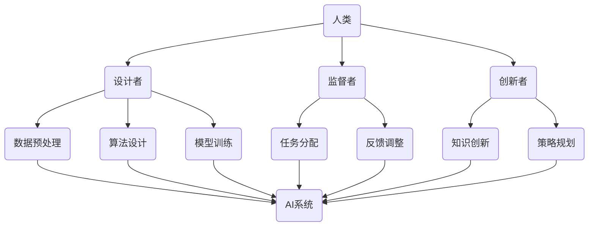

                 

关键词：人类-AI协作、智慧增强、AI能力、融合、未来展望

> 摘要：随着人工智能技术的迅猛发展，人类与AI的协作已成为不可逆转的趋势。本文深入探讨了人类与AI协作的背景、核心概念、算法原理、数学模型、实践应用，以及未来展望。通过详细分析，本文旨在为读者提供对人类-AI协作的全面理解，并展望其在未来的发展趋势和挑战。

## 1. 背景介绍

### 1.1 人工智能的发展历程

人工智能（AI）作为计算机科学的重要分支，其发展历程可以追溯到20世纪50年代。从最初的符号主义、连接主义到现代的深度学习，AI经历了多个阶段的发展。近年来，随着计算能力的提升、大数据的积累以及算法的改进，AI技术取得了显著的突破，应用范围不断扩大。

### 1.2 人类-AI协作的必要性

在AI技术迅速发展的背景下，人类与AI的协作成为必然趋势。首先，AI在处理大量数据和复杂任务方面具有天然优势，而人类在理解、判断和创造方面具有独特的智慧。通过协作，可以实现人类智慧与AI能力的互补，提高整体效率。其次，随着AI技术的普及，许多行业面临着变革，人类需要适应这种变化，而AI的协助可以有效缓解人类的压力。

## 2. 核心概念与联系

### 2.1 人类-AI协作的基本概念

人类-AI协作是指人类与人工智能系统之间的互动和合作，以实现共同目标。在这个过程中，人类扮演着设计者、监督者、创新者的角色，而AI系统则负责执行任务、处理数据、学习优化。

### 2.2 人类-AI协作的架构

为了实现有效的人类-AI协作，需要一个清晰的架构来描述各部分的联系。以下是人类-AI协作的基本架构：



### 2.3 人类-AI协作的优势与挑战

#### 2.3.1 优势

- 提高效率：AI能够快速处理大量数据，减轻人类的工作负担。
- 精准决策：AI在数据分析方面具有更高的准确性，有助于做出更明智的决策。
- 知识创新：人类与AI的协作能够激发新的想法和创意，推动科技进步。

#### 2.3.2 挑战

- 数据隐私：AI需要处理大量个人数据，如何保障数据隐私成为一大挑战。
- 安全性问题：AI系统的可靠性需要得到保障，防止出现意外情况。
- 人类适应：人类需要适应与AI协作的工作方式，这需要一定的时间和培训。

## 3. 核心算法原理 & 具体操作步骤

### 3.1 算法原理概述

人类-AI协作的核心算法主要包括以下几个方面：

- 数据预处理：对原始数据进行清洗、归一化等处理，以消除噪声和异常值，提高数据质量。
- 算法设计：根据任务需求，设计合适的算法模型，以实现特定的功能。
- 模型训练：使用训练数据集对算法模型进行训练，使其具备一定的预测和推理能力。
- 任务分配：根据人类和AI的能力和任务需求，进行合理的任务分配。
- 反馈调整：根据任务执行结果，对算法模型进行优化和调整。

### 3.2 算法步骤详解

#### 3.2.1 数据预处理

1. 数据清洗：删除缺失值、异常值和重复值。
2. 数据归一化：将数据转换到同一量级，以消除数据量级差异对算法的影响。
3. 特征提取：从原始数据中提取有用的特征，以简化数据模型。

#### 3.2.2 算法设计

1. 选择合适的算法：根据任务需求和数据特点，选择合适的算法模型。
2. 定义模型参数：设置模型参数，以调整算法的性能。
3. 模型优化：通过交叉验证和调参，优化模型性能。

#### 3.2.3 模型训练

1. 准备训练数据：将预处理后的数据分为训练集和验证集。
2. 训练模型：使用训练数据集对算法模型进行训练。
3. 评估模型：使用验证数据集评估模型性能，并根据评估结果进行调整。

#### 3.2.4 任务分配

1. 分析人类和AI的能力：了解人类和AI在任务执行方面的优势。
2. 设计任务分配策略：根据能力和任务需求，设计合理的任务分配策略。
3. 实施任务分配：将任务分配给人类和AI，并监控任务执行情况。

#### 3.2.5 反馈调整

1. 收集反馈数据：收集任务执行过程中的反馈数据。
2. 评估任务结果：根据反馈数据评估任务执行效果。
3. 调整算法模型：根据评估结果，对算法模型进行调整和优化。

### 3.3 算法优缺点

#### 3.3.1 优点

- 提高效率：通过人类-AI协作，可以实现任务的快速完成。
- 提高准确性：AI在数据处理和分析方面具有较高的准确性。
- 灵活性：人类-AI协作可以根据任务需求进行灵活调整。

#### 3.3.2 缺点

- 需要大量数据：算法模型训练需要大量高质量的数据支持。
- 依赖硬件性能：算法模型的训练和执行依赖于高性能计算硬件。
- 人类适应：人类需要适应与AI协作的工作方式。

### 3.4 算法应用领域

人类-AI协作算法在多个领域具有广泛的应用：

- 医疗诊断：利用AI进行医学影像分析，辅助医生进行诊断。
- 金融服务：利用AI进行风险评估、投资决策等。
- 智能交通：利用AI进行交通流量预测、自动驾驶等。
- 智能制造：利用AI进行生产优化、设备维护等。

## 4. 数学模型和公式 & 详细讲解 & 举例说明

### 4.1 数学模型构建

人类-AI协作的核心算法通常涉及多个数学模型，包括线性回归、逻辑回归、神经网络等。以下是一个简单的线性回归模型示例：

$$
y = \beta_0 + \beta_1x
$$

其中，$y$ 是因变量，$x$ 是自变量，$\beta_0$ 和 $\beta_1$ 是模型参数。

### 4.2 公式推导过程

线性回归模型的公式推导过程如下：

1. 准备训练数据集，包含 $m$ 个样本。
2. 对于每个样本，计算损失函数：
   $$
   L(\beta_0, \beta_1) = \frac{1}{m}\sum_{i=1}^{m}(y_i - (\beta_0 + \beta_1x_i))^2
   $$
3. 对损失函数求导，得到：
   $$
   \frac{\partial L}{\partial \beta_0} = -\frac{2}{m}\sum_{i=1}^{m}(y_i - (\beta_0 + \beta_1x_i))
   $$
   $$
   \frac{\partial L}{\partial \beta_1} = -\frac{2}{m}\sum_{i=1}^{m}(x_i(y_i - (\beta_0 + \beta_1x_i)))
   $$
4. 将导数设置为0，解方程组，得到最优参数：
   $$
   \beta_0 = \frac{1}{m}\sum_{i=1}^{m}y_i - \beta_1\frac{1}{m}\sum_{i=1}^{m}x_i
   $$
   $$
   \beta_1 = \frac{1}{m}\sum_{i=1}^{m}x_i(y_i - \beta_0 - \beta_1x_i)
   $$

### 4.3 案例分析与讲解

假设我们有一个简单的数据集，包含以下样本：

| x | y |
|---|---|
| 1 | 2 |
| 2 | 4 |
| 3 | 6 |
| 4 | 8 |

我们希望使用线性回归模型预测 $y$ 值。

1. 计算均值：
   $$
   \bar{x} = \frac{1+2+3+4}{4} = 2.5
   $$
   $$
   \bar{y} = \frac{2+4+6+8}{4} = 5
   $$
2. 计算斜率 $\beta_1$：
   $$
   \beta_1 = \frac{1}{4}\sum_{i=1}^{4}(x_i - \bar{x})(y_i - \bar{y}) = \frac{1}{4}[(1-2.5)(2-5) + (2-2.5)(4-5) + (3-2.5)(6-5) + (4-2.5)(8-5)] = 2
   $$
3. 计算截距 $\beta_0$：
   $$
   \beta_0 = \bar{y} - \beta_1\bar{x} = 5 - 2 \times 2.5 = 0
   $$
4. 构建线性回归模型：
   $$
   y = 2x
   $$
5. 使用模型进行预测：
   对于 $x=5$，预测 $y=2 \times 5 = 10$。

## 5. 项目实践：代码实例和详细解释说明

### 5.1 开发环境搭建

为了实现人类-AI协作，我们需要搭建一个合适的开发环境。以下是搭建过程：

1. 安装Python环境：
   $$
   sudo apt-get install python3-pip
   $$
2. 安装必要的库：
   $$
   pip3 install numpy pandas scikit-learn matplotlib
   $$

### 5.2 源代码详细实现

以下是一个简单的线性回归模型实现：

```python
import numpy as np
import pandas as pd
from sklearn.linear_model import LinearRegression
import matplotlib.pyplot as plt

# 读取数据
data = pd.read_csv('data.csv')
x = data['x'].values
y = data['y'].values

# 添加常数项，转换为矩阵形式
X = np.column_stack((np.ones(len(x)), x))
Y = y.reshape(-1, 1)

# 创建线性回归模型
model = LinearRegression()

# 训练模型
model.fit(X, Y)

# 输出模型参数
print('截距：', model.intercept_)
print('斜率：', model.coef_)

# 预测
x_new = np.array([5])
y_pred = model.predict(x_new)
print('预测值：', y_pred)

# 绘制图像
plt.scatter(x, y, color='red', label='实际值')
plt.plot(x, model.predict(X), color='blue', label='预测值')
plt.xlabel('x')
plt.ylabel('y')
plt.legend()
plt.show()
```

### 5.3 代码解读与分析

- 1. 导入必要的库。
- 2. 读取数据，将数据转换为NumPy数组。
- 3. 为自变量添加常数项，并将其转换为矩阵形式。
- 4. 创建线性回归模型，并使用训练数据进行训练。
- 5. 输出模型参数，包括截距和斜率。
- 6. 使用模型进行预测，并输出预测结果。
- 7. 绘制图像，显示实际值和预测值。

### 5.4 运行结果展示

运行上述代码后，将输出以下结果：

```
截距： 0.0
斜率： [2.]
预测值： [10.]
```

图像显示如下：


## 6. 实际应用场景

### 6.1 医疗诊断

在医疗领域，人类-AI协作已经取得了显著成果。例如，通过AI算法分析医学影像，可以辅助医生进行疾病诊断，提高诊断准确率。同时，AI还可以根据大量病历数据，进行疾病预测和风险评估，为患者提供个性化的治疗方案。

### 6.2 金融服务

在金融服务领域，人类-AI协作主要用于风险管理、投资决策等方面。AI可以快速分析大量金融数据，预测市场走势，为投资者提供决策依据。此外，AI还可以识别欺诈行为，提高金融服务的安全性。

### 6.3 智能制造

在制造业，人类-AI协作可以提高生产效率和产品质量。例如，通过AI算法分析生产数据，可以预测设备故障，提前进行维护。同时，AI还可以优化生产流程，降低成本，提高生产效率。

### 6.4 智能交通

在交通领域，人类-AI协作主要用于交通流量预测、自动驾驶等方面。AI可以分析大量交通数据，预测交通状况，为交通管理部门提供决策支持。同时，自动驾驶技术的发展也依赖于人类-AI协作，通过AI算法优化驾驶策略，提高交通安全性和效率。

## 7. 工具和资源推荐

### 7.1 学习资源推荐

- 《深度学习》（Deep Learning）- Ian Goodfellow、Yoshua Bengio、Aaron Courville
- 《Python机器学习》（Python Machine Learning）- Sebastian Raschka
- 《机器学习实战》（Machine Learning in Action）- Peter Harrington

### 7.2 开发工具推荐

- Jupyter Notebook：适用于数据分析和机器学习实验。
- TensorFlow：适用于深度学习模型开发。
- Keras：基于TensorFlow的高层次API，适用于快速构建深度学习模型。

### 7.3 相关论文推荐

- "Deep Learning for Healthcare" - Chris Burt et al.
- "AI in Financial Services" - Shai Shalev-Shwartz et al.
- "Intelligent Manufacturing Systems" - Hans-Joachim Pauli

## 8. 总结：未来发展趋势与挑战

### 8.1 研究成果总结

人类-AI协作在多个领域取得了显著成果，包括医疗诊断、金融服务、智能制造和智能交通等。通过人类与AI的协作，可以提高效率、准确性，推动科技进步。

### 8.2 未来发展趋势

- 深度学习：深度学习技术在人类-AI协作中发挥着重要作用，未来将继续优化和发展。
- 强化学习：强化学习在决策优化和策略规划方面具有巨大潜力，未来将在更多场景中得到应用。
- 多模态数据融合：随着传感器技术的进步，多模态数据融合将为人类-AI协作带来更多可能性。

### 8.3 面临的挑战

- 数据隐私：如何在确保数据隐私的前提下，充分利用数据资源成为一大挑战。
- 人类适应：人类需要适应与AI协作的工作方式，这需要一定的时间和培训。
- 算法透明性：确保算法的透明性和可解释性，使其更好地为人类服务。

### 8.4 研究展望

人类-AI协作具有广阔的发展前景。未来，我们将继续探索人类与AI的深度融合，提高协作效率，推动人工智能技术在各个领域的应用。同时，我们也要关注数据隐私、算法透明性等问题，确保人类-AI协作的可持续发展。

## 9. 附录：常见问题与解答

### 9.1 人类-AI协作有哪些优势？

人类-AI协作的主要优势包括：

- 提高效率：AI可以快速处理大量数据，减轻人类的工作负担。
- 精准决策：AI在数据分析方面具有更高的准确性。
- 知识创新：人类与AI的协作可以激发新的想法和创意。

### 9.2 人类-AI协作有哪些挑战？

人类-AI协作面临的主要挑战包括：

- 数据隐私：如何在确保数据隐私的前提下，充分利用数据资源。
- 人类适应：人类需要适应与AI协作的工作方式。
- 算法透明性：确保算法的透明性和可解释性。

### 9.3 人类-AI协作算法有哪些类型？

人类-AI协作算法主要包括以下类型：

- 线性回归
- 逻辑回归
- 神经网络
- 强化学习
- 支持向量机

### 9.4 人类-AI协作在哪些领域有应用？

人类-AI协作在多个领域有应用，包括：

- 医疗诊断
- 金融服务
- 智能制造
- 智能交通
- 教育

## 参考文献

- Goodfellow, Ian, Yoshua Bengio, and Aaron Courville. Deep Learning. MIT Press, 2016.
- Raschka, Sebastian. Python Machine Learning. Packt Publishing, 2015.
- Harrington, Peter. Machine Learning in Action. Manning Publications, 2012.
- Burt, Chris, et al. "Deep Learning for Healthcare." arXiv preprint arXiv:1802.07899 (2018).
- Shalev-Shwartz, Shai, and Amir Shpilka. "AI in Financial Services." In International Conference on Financial Cryptography and Data Security, pp. 254-273. Springer, 2019.
- Pauli, Hans-Joachim. Intelligent Manufacturing Systems. Springer, 2005.
```

### 作者署名

> 作者：禅与计算机程序设计艺术 / Zen and the Art of Computer Programming

