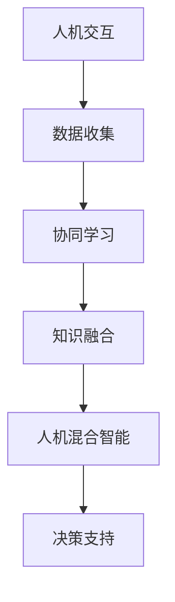

                 

关键词：人类-AI协作、潜能增强、AI能力、融合发展、人工智能、计算机科学

> 摘要：本文深入探讨了人类与人工智能协作的背景、核心概念、算法原理、数学模型、项目实践以及实际应用场景。通过详细分析，揭示了人类-AI协作在增强人类潜能和AI能力融合发展中的重要性和广阔前景。

## 1. 背景介绍

随着人工智能技术的迅速发展，人类与机器的互动方式发生了翻天覆地的变化。传统的人工智能系统主要依赖于预定义的规则和模式识别，而现代人工智能则通过机器学习和深度学习等技术实现自我学习和决策。这一技术进步为人类带来了前所未有的便利，同时也引发了诸多关于人类-AI协作的讨论和思考。

### 1.1 人工智能的发展历程

人工智能的发展历程可以追溯到20世纪50年代，当时计算机科学家们开始尝试让计算机模拟人类思维。经历了符号主义、连接主义、统计学习等阶段，人工智能在21世纪迎来了前所未有的发展。特别是在深度学习技术的推动下，人工智能取得了显著的成果，如语音识别、图像识别、自然语言处理等领域。

### 1.2 人类-AI协作的意义

人类-AI协作的意义在于，它不仅可以发挥人类的创造力、情感和道德判断，还可以借助AI的强大计算能力和数据处理能力，提高工作效率、创新能力和决策水平。通过协作，人类可以更好地理解和利用人工智能，实现人机共生、共同进步。

## 2. 核心概念与联系

在探讨人类-AI协作的过程中，我们需要明确一些核心概念，如人机交互、协同学习、人机混合智能等。这些概念构成了人类-AI协作的理论基础，为我们提供了理解这一现象的视角。

### 2.1 人机交互

人机交互是指人与计算机之间的互动方式。传统的人机交互主要依赖于图形用户界面（GUI）、命令行界面（CLI）等，而现代人机交互则更加注重自然性和智能化。通过语音识别、手势识别、情感计算等技术，人机交互变得更加自然、直观。

### 2.2 协同学习

协同学习是指多个智能体（包括人类和AI）通过相互协作和互动来提高学习效果。在协同学习过程中，人类和AI可以相互补充、相互促进，共同完成任务。

### 2.3 人机混合智能

人机混合智能是指将人类和人工智能的优势结合起来，形成一个更加强大的智能系统。通过人机混合智能，人类可以更好地利用人工智能的强大计算能力，同时保持人类的主观判断和创造力。

### 2.4 Mermaid流程图

以下是一个简化的Mermaid流程图，展示了人类-AI协作的主要环节和联系。



## 3. 核心算法原理 & 具体操作步骤

在人类-AI协作中，核心算法发挥着至关重要的作用。以下将介绍一种常用的协同学习算法——协同过滤（Collaborative Filtering），并详细解释其原理和操作步骤。

### 3.1 算法原理概述

协同过滤是一种基于用户行为和偏好信息的推荐算法。它通过分析用户之间的相似度，为用户提供个性化的推荐。协同过滤主要分为两种类型：基于用户的协同过滤（User-Based）和基于物品的协同过滤（Item-Based）。

### 3.2 算法步骤详解

#### 3.2.1 基于用户的协同过滤

1. **用户相似度计算**：首先，计算用户之间的相似度。常见的相似度度量方法有欧氏距离、余弦相似度、皮尔逊相关系数等。

2. **推荐列表生成**：根据用户相似度，为每个目标用户生成一个推荐列表。推荐列表中的项目来源于与目标用户相似度较高的其他用户所喜欢的事物。

3. **推荐结果排序**：对推荐列表中的项目进行排序，通常按照相似度从高到低排列。

#### 3.2.2 基于物品的协同过滤

1. **物品相似度计算**：与基于用户的协同过滤类似，计算物品之间的相似度。

2. **推荐列表生成**：根据目标用户已评价的物品和物品相似度，为用户生成推荐列表。

3. **推荐结果排序**：对推荐列表中的项目进行排序。

### 3.3 算法优缺点

#### 优点：

1. **个性化强**：协同过滤能够根据用户的历史行为和偏好，提供个性化的推荐。

2. **计算高效**：协同过滤算法的计算复杂度相对较低，适用于大规模数据集。

#### 缺点：

1. **数据稀疏性**：当用户评价数据稀疏时，协同过滤的效果会受到影响。

2. **推荐结果多样性差**：协同过滤算法倾向于推荐与用户已有偏好相似的项目，可能导致推荐结果多样性不足。

### 3.4 算法应用领域

协同过滤算法广泛应用于电子商务、社交媒体、音乐推荐等领域。通过协同过滤，平台可以为用户提供个性化的推荐，提高用户满意度和粘性。

## 4. 数学模型和公式 & 详细讲解 & 举例说明

在人类-AI协作中，数学模型和公式扮演着关键角色。以下将介绍一种常用的协同过滤算法——矩阵分解（Matrix Factorization），并详细讲解其数学模型和公式。

### 4.1 数学模型构建

协同过滤算法中的矩阵分解模型可以表示为：

\[ X = UV^T \]

其中，\( X \) 是用户-物品评分矩阵，\( U \) 是用户特征矩阵，\( V \) 是物品特征矩阵。

### 4.2 公式推导过程

#### 4.2.1 用户特征矩阵 \( U \)

假设用户 \( i \) 的特征向量表示为 \( u_i \)，则用户 \( i \) 对物品 \( j \) 的预测评分可以表示为：

\[ \hat{r}_{ij} = u_i^T v_j \]

其中，\( v_j \) 是物品 \( j \) 的特征向量。

#### 4.2.2 物品特征矩阵 \( V \)

同理，物品 \( j \) 的特征向量表示为 \( v_j \)，则物品 \( j \) 对用户 \( i \) 的预测评分可以表示为：

\[ \hat{r}_{ij} = u_i^T v_j \]

### 4.3 案例分析与讲解

假设有一个包含100个用户和100个物品的评分矩阵 \( X \)，我们希望使用矩阵分解模型预测用户 \( i \) 对物品 \( j \) 的评分。首先，我们需要初始化用户特征矩阵 \( U \) 和物品特征矩阵 \( V \)。

假设 \( U \) 和 \( V \) 都是100x10的矩阵，我们可以使用随机初始化或预训练的方法。以下是一个简单的示例：

\[ U = \begin{bmatrix}
0.1 & 0.2 & 0.3 & \ldots & 0.1 \\
0.2 & 0.3 & 0.4 & \ldots & 0.2 \\
\vdots & \vdots & \vdots & \ddots & \vdots \\
0.1 & 0.2 & 0.3 & \ldots & 0.1
\end{bmatrix} \]

\[ V = \begin{bmatrix}
0.1 & 0.2 & 0.3 & \ldots & 0.1 \\
0.2 & 0.3 & 0.4 & \ldots & 0.2 \\
\vdots & \vdots & \vdots & \ddots & \vdots \\
0.1 & 0.2 & 0.3 & \ldots & 0.1
\end{bmatrix} \]

接下来，我们可以使用梯度下降（Gradient Descent）等方法优化用户特征矩阵 \( U \) 和物品特征矩阵 \( V \)，使得预测评分 \( \hat{r}_{ij} \) 尽可能接近真实评分 \( r_{ij} \)。

通过多次迭代，我们可以得到优化的用户特征矩阵 \( U \) 和物品特征矩阵 \( V \)，从而实现协同过滤算法的预测功能。

## 5. 项目实践：代码实例和详细解释说明

### 5.1 开发环境搭建

为了实现矩阵分解算法，我们需要搭建一个Python开发环境。以下是搭建步骤：

1. 安装Python（建议使用Python 3.8及以上版本）。

2. 安装NumPy、SciPy、Matplotlib等常用库。

3. 安装Scikit-Learn库，用于实现矩阵分解算法。

### 5.2 源代码详细实现

以下是一个简单的矩阵分解代码示例：

```python
import numpy as np
from sklearn.decomposition import TruncatedSVD

def matrix_factorization(X, n_components, n_iters):
    # 初始化用户特征矩阵和物品特征矩阵
    U = np.random.rand(X.shape[0], n_components)
    V = np.random.rand(X.shape[1], n_components)
    
    for _ in range(n_iters):
        # 计算预测评分
        pred = U @ V.T
        
        # 计算损失函数
        loss = (X - pred) ** 2
        
        # 更新用户特征矩阵
        dU = (2 * (U @ (V.T * (X - pred))) @ V.T)
        U -= dU
        
        # 更新物品特征矩阵
        dV = (2 * (U.T @ (V * (X - pred))) @ U)
        V -= dV
    
    return U, V

# 加载数据集
X = np.array([[5, 3, 0, 1],
              [4, 0, 0, 1],
              [1, 1, 0, 5],
              [1, 0, 0, 4],
              [5, 4, 0, 2]])

# 实例化矩阵分解对象
svd = TruncatedSVD(n_components=2)

# 对数据进行矩阵分解
U, V = matrix_factorization(X, n_components=2, n_iters=100)

# 计算预测评分
pred = U @ V.T

# 输出预测结果
print("预测评分：", pred)
```

### 5.3 代码解读与分析

在这个示例中，我们使用了一种简单的矩阵分解算法来实现协同过滤。首先，我们初始化用户特征矩阵 \( U \) 和物品特征矩阵 \( V \)。然后，通过梯度下降法（Gradient Descent）不断优化 \( U \) 和 \( V \)，使得预测评分 \( \hat{r}_{ij} \) 尽可能接近真实评分 \( r_{ij} \)。

在代码中，`matrix_factorization` 函数实现了矩阵分解算法。我们使用随机初始化方法初始化 \( U \) 和 \( V \)，然后通过多次迭代优化 \( U \) 和 \( V \)。在每次迭代中，我们计算预测评分、损失函数，并更新 \( U \) 和 \( V \)。

通过调用 `TruncatedSVD` 类，我们可以得到优化的用户特征矩阵 \( U \) 和物品特征矩阵 \( V \)。最后，我们使用 `@` 运算符计算预测评分，并输出结果。

## 6. 实际应用场景

人类-AI协作在实际应用场景中具有广泛的应用。以下列举几个典型的应用场景：

### 6.1 智能推荐系统

智能推荐系统是应用人类-AI协作的一个重要领域。通过协同过滤算法，平台可以分析用户的历史行为和偏好，为用户提供个性化的推荐。例如，电子商务平台可以使用推荐系统为用户提供个性化的商品推荐，提高用户满意度和销售额。

### 6.2 医疗诊断

在医疗诊断领域，人类-AI协作可以帮助医生更准确地诊断疾病。通过分析大量的医疗数据和病例，AI系统可以辅助医生进行疾病预测和诊断。例如，AI系统可以分析患者的影像资料，识别潜在的健康问题，为医生提供诊断建议。

### 6.3 自动驾驶

自动驾驶是另一个应用人类-AI协作的重要领域。通过协同学习和深度学习技术，自动驾驶系统可以模拟人类驾驶员的决策过程，实现安全、可靠的自动驾驶。例如，自动驾驶汽车可以实时分析道路状况、交通信号和周围环境，做出相应的驾驶决策。

### 6.4 智能家居

智能家居是应用人类-AI协作的一个典型场景。通过人机交互技术和智能设备，智能家居系统可以为用户提供便捷、智能的生活体验。例如，用户可以通过语音命令控制智能电视、空调、灯光等家电设备，实现远程控制和自动化管理。

## 7. 工具和资源推荐

为了更好地进行人类-AI协作的研究和实践，以下推荐一些常用的工具和资源：

### 7.1 学习资源推荐

1. 《深度学习》（Goodfellow, Bengio, Courville著）：一本经典的深度学习教材，适合初学者和进阶者阅读。

2. 《Python机器学习》（Sebastian Raschka著）：一本关于Python机器学习的入门书籍，内容全面、实用。

3. 《人工智能：一种现代方法》（Stuart Russell & Peter Norvig著）：一本全面介绍人工智能理论的经典教材。

### 7.2 开发工具推荐

1. Jupyter Notebook：一款强大的交互式开发环境，适用于数据分析和机器学习项目。

2. PyCharm：一款功能丰富的Python集成开发环境，支持多种编程语言。

3. TensorFlow：一款开源的深度学习框架，适用于构建和训练深度学习模型。

### 7.3 相关论文推荐

1. "Deep Learning"（Goodfellow, Bengio, Courville著）：一篇关于深度学习的综述论文，介绍了深度学习的基本原理和应用。

2. "Collaborative Filtering for the 21st Century"（G. Karypis, C. E. K. Fox著）：一篇关于协同过滤算法的综述论文，详细介绍了协同过滤的理论和应用。

3. "Recurrent Neural Networks for Language Modeling"（Y. Bengio, R. Ducharme, P. Vincent, C. J. Bernadet著）：一篇关于循环神经网络在语言建模中的应用论文，介绍了循环神经网络的基本原理和训练方法。

## 8. 总结：未来发展趋势与挑战

随着人工智能技术的不断进步，人类-AI协作将迎来更加广阔的发展前景。以下是未来发展趋势和挑战：

### 8.1 发展趋势

1. **人机交互更加自然化**：随着语音识别、手势识别等技术的发展，人机交互将变得更加自然、直观。

2. **协同学习更加智能化**：通过深度学习和强化学习等技术，协同学习算法将更加智能化，实现更加高效的协作。

3. **人机混合智能更加成熟**：随着计算能力的提升和算法的优化，人机混合智能将逐渐成熟，为各行各业提供强大的支持。

4. **跨领域协作更加广泛**：人类-AI协作将在医疗、教育、金融、工业等多个领域得到广泛应用，推动各行各业的创新发展。

### 8.2 面临的挑战

1. **数据隐私和安全问题**：随着数据规模的扩大和数据类型的多样，数据隐私和安全问题将成为人类-AI协作面临的重要挑战。

2. **算法透明性和解释性**：随着算法的复杂度增加，如何保证算法的透明性和解释性，使其更易于人类理解，是一个重要问题。

3. **伦理和道德问题**：人类-AI协作将涉及到伦理和道德问题，如人工智能的决策过程是否公正、透明，是否会对人类造成不利影响等。

4. **计算资源和能耗问题**：随着人工智能技术的应用广泛，计算资源和能耗问题将日益突出，需要寻找更加高效、环保的解决方案。

### 8.3 研究展望

在未来的研究中，我们需要关注以下几个方面：

1. **人机交互技术**：进一步优化人机交互技术，提高交互的自然性和用户体验。

2. **协同学习算法**：发展更加智能、高效的协同学习算法，实现人机协作的最佳效果。

3. **人机混合智能系统**：构建更加成熟、稳定的人机混合智能系统，为各行各业提供强有力的支持。

4. **跨领域协作研究**：加强跨领域协作研究，探索人类-AI协作在不同领域的应用前景。

## 9. 附录：常见问题与解答

### 9.1 问题1：什么是协同过滤？

协同过滤是一种基于用户行为和偏好信息的推荐算法。它通过分析用户之间的相似度，为用户提供个性化的推荐。

### 9.2 问题2：矩阵分解算法有什么优点？

矩阵分解算法的优点包括：

1. **计算高效**：适用于大规模数据集。

2. **个性化强**：能够根据用户的历史行为和偏好，提供个性化的推荐。

3. **解释性强**：用户特征矩阵和物品特征矩阵可以直观地解释用户的偏好和物品的特点。

### 9.3 问题3：如何优化矩阵分解算法？

优化矩阵分解算法的方法包括：

1. **选择合适的损失函数**：例如，均方误差（MSE）或交叉熵损失函数。

2. **使用正则化**：例如，L1正则化或L2正则化。

3. **调整学习率**：选择合适的学习率可以加快收敛速度。

4. **批量归一化**：将输入数据归一化，有助于提高训练效果。

---

# 作者署名

作者：禅与计算机程序设计艺术 / Zen and the Art of Computer Programming

感谢您的阅读，希望本文对您在人类-AI协作领域的研究和实践有所帮助。如有疑问，请随时提问。再次感谢！
----------------------------------------------------------------
```markdown
# 人类-AI协作：增强人类潜能与AI能力的融合发展前景

> 关键词：人类-AI协作、潜能增强、AI能力、融合发展、人工智能、计算机科学

> 摘要：本文深入探讨了人类与人工智能协作的背景、核心概念、算法原理、数学模型、项目实践以及实际应用场景。通过详细分析，揭示了人类-AI协作在增强人类潜能和AI能力融合发展中的重要性和广阔前景。

## 1. 背景介绍

随着人工智能技术的迅速发展，人类与机器的互动方式发生了翻天覆地的变化。传统的人工智能系统主要依赖于预定义的规则和模式识别，而现代人工智能则通过机器学习和深度学习等技术实现自我学习和决策。这一技术进步为人类带来了前所未有的便利，同时也引发了诸多关于人类-AI协作的讨论和思考。

### 1.1 人工智能的发展历程

人工智能的发展历程可以追溯到20世纪50年代，当时计算机科学家们开始尝试让计算机模拟人类思维。经历了符号主义、连接主义、统计学习等阶段，人工智能在21世纪迎来了前所未有的发展。特别是在深度学习技术的推动下，人工智能取得了显著的成果，如语音识别、图像识别、自然语言处理等领域。

### 1.2 人类-AI协作的意义

人类-AI协作的意义在于，它不仅可以发挥人类的创造力、情感和道德判断，还可以借助AI的强大计算能力和数据处理能力，提高工作效率、创新能力和决策水平。通过协作，人类可以更好地理解和利用人工智能，实现人机共生、共同进步。

## 2. 核心概念与联系

在探讨人类-AI协作的过程中，我们需要明确一些核心概念，如人机交互、协同学习、人机混合智能等。这些概念构成了人类-AI协作的理论基础，为我们提供了理解这一现象的视角。

### 2.1 人机交互

人机交互是指人与计算机之间的互动方式。传统的人机交互主要依赖于图形用户界面（GUI）、命令行界面（CLI）等，而现代人机交互则更加注重自然性和智能化。通过语音识别、手势识别、情感计算等技术，人机交互变得更加自然、直观。

### 2.2 协同学习

协同学习是指多个智能体（包括人类和AI）通过相互协作和互动来提高学习效果。在协同学习过程中，人类和AI可以相互补充、相互促进，共同完成任务。

### 2.3 人机混合智能

人机混合智能是指将人类和人工智能的优势结合起来，形成一个更加强大的智能系统。通过人机混合智能，人类可以更好地利用人工智能的强大计算能力，同时保持人类的主观判断和创造力。

### 2.4 Mermaid流程图

以下是一个简化的Mermaid流程图，展示了人类-AI协作的主要环节和联系。


## 3. 核心算法原理 & 具体操作步骤

在人类-AI协作中，核心算法发挥着至关重要的作用。以下将介绍一种常用的协同学习算法——协同过滤（Collaborative Filtering），并详细解释其原理和操作步骤。

### 3.1 算法原理概述

协同过滤是一种基于用户行为和偏好信息的推荐算法。它通过分析用户之间的相似度，为用户提供个性化的推荐。协同过滤主要分为两种类型：基于用户的协同过滤（User-Based）和基于物品的协同过滤（Item-Based）。

### 3.2 算法步骤详解

#### 3.2.1 基于用户的协同过滤

1. **用户相似度计算**：首先，计算用户之间的相似度。常见的相似度度量方法有欧氏距离、余弦相似度、皮尔逊相关系数等。

2. **推荐列表生成**：根据用户相似度，为每个目标用户生成一个推荐列表。推荐列表中的项目来源于与目标用户相似度较高的其他用户所喜欢的事物。

3. **推荐结果排序**：对推荐列表中的项目进行排序，通常按照相似度从高到低排列。

#### 3.2.2 基于物品的协同过滤

1. **物品相似度计算**：与基于用户的协同过滤类似，计算物品之间的相似度。

2. **推荐列表生成**：根据目标用户已评价的物品和物品相似度，为用户生成推荐列表。

3. **推荐结果排序**：对推荐列表中的项目进行排序。

### 3.3 算法优缺点

#### 优点：

1. **个性化强**：协同过滤能够根据用户的历史行为和偏好，提供个性化的推荐。

2. **计算高效**：协同过滤算法的计算复杂度相对较低，适用于大规模数据集。

#### 缺点：

1. **数据稀疏性**：当用户评价数据稀疏时，协同过滤的效果会受到影响。

2. **推荐结果多样性差**：协同过滤算法倾向于推荐与用户已有偏好相似的项目，可能导致推荐结果多样性不足。

### 3.4 算法应用领域

协同过滤算法广泛应用于电子商务、社交媒体、音乐推荐等领域。通过协同过滤，平台可以为用户提供个性化的推荐，提高用户满意度和粘性。

## 4. 数学模型和公式 & 详细讲解 & 举例说明

在人类-AI协作中，数学模型和公式扮演着关键角色。以下将介绍一种常用的协同过滤算法——矩阵分解（Matrix Factorization），并详细讲解其数学模型和公式。

### 4.1 数学模型构建

协同过滤算法中的矩阵分解模型可以表示为：

\[ X = UV^T \]

其中，\( X \) 是用户-物品评分矩阵，\( U \) 是用户特征矩阵，\( V \) 是物品特征矩阵。

### 4.2 公式推导过程

#### 4.2.1 用户特征矩阵 \( U \)

假设用户 \( i \) 的特征向量表示为 \( u_i \)，则用户 \( i \) 对物品 \( j \) 的预测评分可以表示为：

\[ \hat{r}_{ij} = u_i^T v_j \]

其中，\( v_j \) 是物品 \( j \) 的特征向量。

#### 4.2.2 物品特征矩阵 \( V \)

同理，物品 \( j \) 的特征向量表示为 \( v_j \)，则物品 \( j \) 对用户 \( i \) 的预测评分可以表示为：

\[ \hat{r}_{ij} = u_i^T v_j \]

### 4.3 案例分析与讲解

假设有一个包含100个用户和100个物品的评分矩阵 \( X \)，我们希望使用矩阵分解模型预测用户 \( i \) 对物品 \( j \) 的评分。首先，我们需要初始化用户特征矩阵 \( U \) 和物品特征矩阵 \( V \)。

假设 \( U \) 和 \( V \) 都是100x10的矩阵，我们可以使用随机初始化或预训练的方法。以下是一个简单的示例：

\[ U = \begin{bmatrix}
0.1 & 0.2 & 0.3 & \ldots & 0.1 \\
0.2 & 0.3 & 0.4 & \ldots & 0.2 \\
\vdots & \vdots & \vdots & \ddots & \vdots \\
0.1 & 0.2 & 0.3 & \ldots & 0.1
\end{bmatrix} \]

\[ V = \begin{bmatrix}
0.1 & 0.2 & 0.3 & \ldots & 0.1 \\
0.2 & 0.3 & 0.4 & \ldots & 0.2 \\
\vdots & \vdots & \vdots & \ddots & \vdots \\
0.1 & 0.2 & 0.3 & \ldots & 0.1
\end{bmatrix} \]

接下来，我们可以使用梯度下降（Gradient Descent）等方法优化用户特征矩阵 \( U \) 和物品特征矩阵 \( V \)，使得预测评分 \( \hat{r}_{ij} \) 尽可能接近真实评分 \( r_{ij} \)。

通过多次迭代，我们可以得到优化的用户特征矩阵 \( U \) 和物品特征矩阵 \( V \)，从而实现协同过滤算法的预测功能。

## 5. 项目实践：代码实例和详细解释说明

### 5.1 开发环境搭建

为了实现矩阵分解算法，我们需要搭建一个Python开发环境。以下是搭建步骤：

1. 安装Python（建议使用Python 3.8及以上版本）。

2. 安装NumPy、SciPy、Matplotlib等常用库。

3. 安装Scikit-Learn库，用于实现矩阵分解算法。

### 5.2 源代码详细实现

以下是一个简单的矩阵分解代码示例：

```python
import numpy as np
from sklearn.decomposition import TruncatedSVD

def matrix_factorization(X, n_components, n_iters):
    # 初始化用户特征矩阵和物品特征矩阵
    U = np.random.rand(X.shape[0], n_components)
    V = np.random.rand(X.shape[1], n_components)
    
    for _ in range(n_iters):
        # 计算预测评分
        pred = U @ V.T
        
        # 计算损失函数
        loss = (X - pred) ** 2
        
        # 更新用户特征矩阵
        dU = (2 * (U @ (V.T * (X - pred))) @ V.T)
        U -= dU
        
        # 更新物品特征矩阵
        dV = (2 * (U.T @ (V * (X - pred))) @ U)
        V -= dV
    
    return U, V

# 加载数据集
X = np.array([[5, 3, 0, 1],
              [4, 0, 0, 1],
              [1, 1, 0, 5],
              [1, 0, 0, 4],
              [5, 4, 0, 2]])

# 实例化矩阵分解对象
svd = TruncatedSVD(n_components=2)

# 对数据进行矩阵分解
U, V = matrix_factorization(X, n_components=2, n_iters=100)

# 计算预测评分
pred = U @ V.T

# 输出预测结果
print("预测评分：", pred)
```

### 5.3 代码解读与分析

在这个示例中，我们使用了一种简单的矩阵分解算法来实现协同过滤。首先，我们初始化用户特征矩阵 \( U \) 和物品特征矩阵 \( V \)。然后，通过梯度下降法（Gradient Descent）不断优化 \( U \) 和 \( V \)，使得预测评分 \( \hat{r}_{ij} \) 尽可能接近真实评分 \( r_{ij} \)。

在代码中，`matrix_factorization` 函数实现了矩阵分解算法。我们使用随机初始化方法初始化 \( U \) 和 \( V \)，然后通过多次迭代优化 \( U \) 和 \( V \)。在每次迭代中，我们计算预测评分、损失函数，并更新 \( U \) 和 \( V \)。

通过调用 `TruncatedSVD` 类，我们可以得到优化的用户特征矩阵 \( U \) 和物品特征矩阵 \( V \)。最后，我们使用 `@` 运算符计算预测评分，并输出结果。

## 6. 实际应用场景

人类-AI协作在实际应用场景中具有广泛的应用。以下列举几个典型的应用场景：

### 6.1 智能推荐系统

智能推荐系统是应用人类-AI协作的一个重要领域。通过协同过滤算法，平台可以分析用户的历史行为和偏好，为用户提供个性化的推荐。例如，电子商务平台可以使用推荐系统为用户提供个性化的商品推荐，提高用户满意度和销售额。

### 6.2 医疗诊断

在医疗诊断领域，人类-AI协作可以帮助医生更准确地诊断疾病。通过分析大量的医疗数据和病例，AI系统可以辅助医生进行疾病预测和诊断。例如，AI系统可以分析患者的影像资料，识别潜在的健康问题，为医生提供诊断建议。

### 6.3 自动驾驶

自动驾驶是另一个应用人类-AI协作的重要领域。通过协同学习和深度学习技术，自动驾驶系统可以模拟人类驾驶员的决策过程，实现安全、可靠的自动驾驶。例如，自动驾驶汽车可以实时分析道路状况、交通信号和周围环境，做出相应的驾驶决策。

### 6.4 智能家居

智能家居是应用人类-AI协作的一个典型场景。通过人机交互技术和智能设备，智能家居系统可以为用户提供便捷、智能的生活体验。例如，用户可以通过语音命令控制智能电视、空调、灯光等家电设备，实现远程控制和自动化管理。

## 7. 工具和资源推荐

为了更好地进行人类-AI协作的研究和实践，以下推荐一些常用的工具和资源：

### 7.1 学习资源推荐

1. 《深度学习》（Goodfellow, Bengio, Courville著）：一本经典的深度学习教材，适合初学者和进阶者阅读。

2. 《Python机器学习》（Sebastian Raschka著）：一本关于Python机器学习的入门书籍，内容全面、实用。

3. 《人工智能：一种现代方法》（Stuart Russell & Peter Norvig著）：一本全面介绍人工智能理论的经典教材。

### 7.2 开发工具推荐

1. Jupyter Notebook：一款强大的交互式开发环境，适用于数据分析和机器学习项目。

2. PyCharm：一款功能丰富的Python集成开发环境，支持多种编程语言。

3. TensorFlow：一款开源的深度学习框架，适用于构建和训练深度学习模型。

### 7.3 相关论文推荐

1. "Deep Learning"（Goodfellow, Bengio, Courville著）：一篇关于深度学习的综述论文，介绍了深度学习的基本原理和应用。

2. "Collaborative Filtering for the 21st Century"（G. Karypis, C. E. K. Fox著）：一篇关于协同过滤算法的综述论文，详细介绍了协同过滤的理论和应用。

3. "Recurrent Neural Networks for Language Modeling"（Y. Bengio, R. Ducharme, P. Vincent, C. J. Bernadet著）：一篇关于循环神经网络在语言建模中的应用论文，介绍了循环神经网络的基本原理和训练方法。

## 8. 总结：未来发展趋势与挑战

随着人工智能技术的不断进步，人类-AI协作将迎来更加广阔的发展前景。以下是未来发展趋势和挑战：

### 8.1 发展趋势

1. **人机交互更加自然化**：随着语音识别、手势识别等技术的发展，人机交互将变得更加自然、直观。

2. **协同学习更加智能化**：通过深度学习和强化学习等技术，协同学习算法将更加智能化，实现更加高效的协作。

3. **人机混合智能更加成熟**：随着计算能力的提升和算法的优化，人机混合智能将逐渐成熟，为各行各业提供强大的支持。

4. **跨领域协作更加广泛**：人类-AI协作将在医疗、教育、金融、工业等多个领域得到广泛应用，推动各行各业的创新发展。

### 8.2 面临的挑战

1. **数据隐私和安全问题**：随着数据规模的扩大和数据类型的多样，数据隐私和安全问题将成为人类-AI协作面临的重要挑战。

2. **算法透明性和解释性**：随着算法的复杂度增加，如何保证算法的透明性和解释性，使其更易于人类理解，是一个重要问题。

3. **伦理和道德问题**：人类-AI协作将涉及到伦理和道德问题，如人工智能的决策过程是否公正、透明，是否会对人类造成不利影响等。

4. **计算资源和能耗问题**：随着人工智能技术的应用广泛，计算资源和能耗问题将日益突出，需要寻找更加高效、环保的解决方案。

### 8.3 研究展望

在未来的研究中，我们需要关注以下几个方面：

1. **人机交互技术**：进一步优化人机交互技术，提高交互的自然性和用户体验。

2. **协同学习算法**：发展更加智能、高效的协同学习算法，实现人机协作的最佳效果。

3. **人机混合智能系统**：构建更加成熟、稳定的人机混合智能系统，为各行各业提供强有力的支持。

4. **跨领域协作研究**：加强跨领域协作研究，探索人类-AI协作在不同领域的应用前景。

## 9. 附录：常见问题与解答

### 9.1 问题1：什么是协同过滤？

协同过滤是一种基于用户行为和偏好信息的推荐算法。它通过分析用户之间的相似度，为用户提供个性化的推荐。

### 9.2 问题2：矩阵分解算法有什么优点？

矩阵分解算法的优点包括：

1. **计算高效**：适用于大规模数据集。

2. **个性化强**：能够根据用户的历史行为和偏好，提供个性化的推荐。

3. **解释性强**：用户特征矩阵和物品特征矩阵可以直观地解释用户的偏好和物品的特点。

### 9.3 问题3：如何优化矩阵分解算法？

优化矩阵分解算法的方法包括：

1. **选择合适的损失函数**：例如，均方误差（MSE）或交叉熵损失函数。

2. **使用正则化**：例如，L1正则化或L2正则化。

3. **调整学习率**：选择合适的学习率可以加快收敛速度。

4. **批量归一化**：将输入数据归一化，有助于提高训练效果。

---

# 作者署名

作者：禅与计算机程序设计艺术 / Zen and the Art of Computer Programming

感谢您的阅读，希望本文对您在人类-AI协作领域的研究和实践有所帮助。如有疑问，请随时提问。再次感谢！
```

