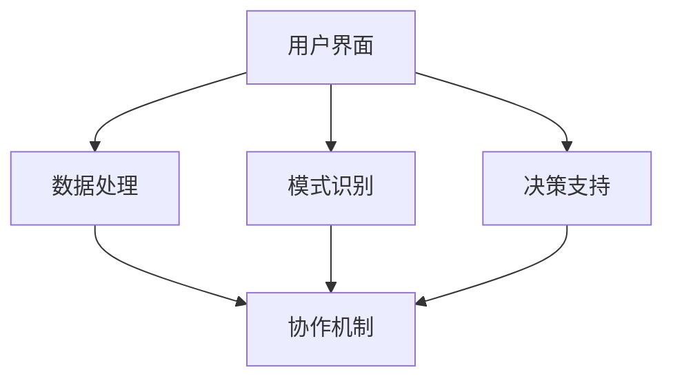

                 

关键词：人类-AI协作、AI能力增强、协同工作、未来发展、挑战与展望

> 摘要：本文从多个角度探讨了人类与AI协作的潜在价值，分析了AI如何通过技术手段和策略增强人类的潜能，并探讨了这一领域在未来的发展趋势、面临的挑战以及可能的研究方向。文章旨在为读者提供一个全面而深入的理解，以便更好地把握AI时代的人类未来发展前景。

## 1. 背景介绍

### 1.1 人类潜能与AI能力的现状

随着人工智能技术的飞速发展，AI已逐渐成为增强人类能力的重要工具。然而，尽管AI在处理大量数据和复杂计算任务方面展现出巨大的优势，但人类的创造力和直觉等潜能仍然难以被完全替代。在这种背景下，人类-AI协作成为一种自然且必要的选择。

### 1.2 人类-AI协作的历史与发展

回顾历史，人类-AI协作的构想可以追溯到早期的计算机辅助系统。随着技术的进步，AI从简单的自动化工具逐渐演变为具备自主学习、决策和问题解决能力的智能系统。当前，人类与AI的协作已不仅限于特定领域，而是逐渐渗透到生活的方方面面。

## 2. 核心概念与联系

### 2.1 人类潜能与AI能力的关系

人类与AI的协作并非简单的叠加，而是互相补充和协同。人类的优势在于创造力、直觉、道德判断等方面，而AI的优势在于数据处理、模式识别、计算效率等方面。两者之间的有机结合，可以创造出更强大、更高效的人类-AI协作体系。

### 2.2 人类-AI协作的架构

为了实现人类与AI的深度协作，需要构建一个高效的协作架构。该架构包括以下几个关键组件：

- **用户界面**：提供人类与AI交互的接口。
- **AI模块**：包括数据处理、模式识别、决策支持等功能。
- **协作机制**：确保人类与AI之间的信息流畅和高效沟通。

下面是这一协作架构的Mermaid流程图表示：



## 3. 核心算法原理 & 具体操作步骤

### 3.1 算法原理概述

在人类-AI协作中，核心算法的设计至关重要。这些算法主要包括以下几个方面：

- **数据预处理**：对输入数据进行清洗、归一化等预处理操作，以提高数据质量和算法性能。
- **模式识别**：利用机器学习算法，从数据中提取特征，进行分类和聚类等操作。
- **决策支持**：基于模式识别的结果，提供人类决策的支持，包括预测、优化等。

### 3.2 算法步骤详解

#### 3.2.1 数据预处理

数据预处理是任何机器学习任务的基础。具体步骤如下：

1. 数据清洗：去除缺失值、异常值等。
2. 数据归一化：将数据缩放到一个统一的范围内。
3. 特征提取：从原始数据中提取对问题解决有帮助的特征。

#### 3.2.2 模式识别

模式识别是机器学习的重要任务，具体步骤如下：

1. 选择合适的模型：如神经网络、决策树、支持向量机等。
2. 训练模型：使用预处理后的数据进行模型训练。
3. 测试模型：使用未参与训练的数据对模型进行评估。

#### 3.2.3 决策支持

决策支持的具体步骤如下：

1. 预测：根据模型对新的数据进行预测。
2. 优化：基于预测结果，对决策过程进行优化。
3. 反馈：将决策结果反馈给用户，进行迭代改进。

### 3.3 算法优缺点

#### 优点：

- **高效性**：AI可以在短时间内处理大量数据，提高工作效率。
- **准确性**：AI能够通过学习提高决策的准确性。
- **扩展性**：AI可以适应各种复杂场景，具有较强的扩展性。

#### 缺点：

- **局限性**：AI难以理解人类的主观判断和情感因素。
- **数据依赖**：AI的性能很大程度上取决于数据的质量和数量。
- **隐私和安全**：在数据传输和处理过程中可能涉及隐私和安全问题。

### 3.4 算法应用领域

人类-AI协作算法在多个领域都有广泛的应用，包括但不限于：

- **医疗**：辅助诊断、个性化治疗等。
- **金融**：风险管理、投资决策等。
- **教育**：个性化学习、智能评测等。
- **工业**：自动化生产、优化调度等。

## 4. 数学模型和公式 & 详细讲解 & 举例说明

### 4.1 数学模型构建

在人类-AI协作中，常用的数学模型包括：

- **线性回归模型**：用于预测连续值。
- **逻辑回归模型**：用于预测离散值。
- **神经网络模型**：用于复杂模式识别。

### 4.2 公式推导过程

以线性回归模型为例，其公式推导如下：

1. **假设**：我们假设目标变量 \(y\) 与特征 \(x\) 之间存在线性关系：
   \[ y = \beta_0 + \beta_1 x + \epsilon \]

2. **最小二乘法**：为了最小化预测误差，我们使用最小二乘法求解回归系数 \(\beta_0\) 和 \(\beta_1\)：
   \[ \beta_0 = \frac{\sum_{i=1}^{n} (y_i - \beta_1 x_i)}{n} \]
   \[ \beta_1 = \frac{\sum_{i=1}^{n} (x_i - \bar{x}) (y_i - \bar{y})}{\sum_{i=1}^{n} (x_i - \bar{x})^2} \]

### 4.3 案例分析与讲解

#### 案例背景：

一家公司想要预测其下月的产品销售量，基于过去三个月的销售数据。

#### 数据处理：

1. 数据清洗：去除缺失值和异常值。
2. 数据归一化：将数据缩放到 \([0, 1]\) 范围内。

#### 模型训练：

1. 选择线性回归模型。
2. 使用最小二乘法求解回归系数。

#### 模型评估：

1. 使用测试集对模型进行评估。
2. 计算预测误差。

## 5. 项目实践：代码实例和详细解释说明

### 5.1 开发环境搭建

1. 安装Python环境。
2. 安装相关依赖库，如NumPy、Pandas、scikit-learn等。

### 5.2 源代码详细实现

```python
import numpy as np
import pandas as pd
from sklearn.linear_model import LinearRegression
from sklearn.metrics import mean_squared_error

# 数据处理
data = pd.read_csv('sales_data.csv')
data.dropna(inplace=True)
data['sales'] = (data['sales'] - data['sales'].min()) / (data['sales'].max() - data['sales'].min())

# 模型训练
model = LinearRegression()
model.fit(data[['month']], data['sales'])

# 模型评估
predictions = model.predict(data[['month']])
mse = mean_squared_error(data['sales'], predictions)
print(f'MSE: {mse}')

# 预测下月销售量
next_month = np.array([[13]])
predicted_sales = model.predict(next_month)
print(f'Predicted sales for next month: {predicted_sales[0][0]}')
```

### 5.3 代码解读与分析

1. **数据读取与处理**：首先从CSV文件中读取数据，并去除缺失值。然后，将销售数据归一化，以便于后续的线性回归模型训练。
2. **模型训练**：使用`LinearRegression`类创建线性回归模型，并使用`fit`方法进行训练。
3. **模型评估**：使用`mean_squared_error`函数计算预测误差，并打印结果。
4. **预测下月销售量**：使用训练好的模型对下月销售量进行预测，并打印结果。

## 6. 实际应用场景

### 6.1 医疗领域

在医疗领域，人类-AI协作可以通过智能诊断系统提高诊断的准确性和效率。例如，通过分析患者的病历、检查报告和基因组数据，AI可以协助医生进行诊断，并给出治疗建议。

### 6.2 金融领域

在金融领域，人类-AI协作可以用于风险管理、投资决策和客户服务等方面。例如，通过分析市场数据、经济指标和客户行为，AI可以协助金融专家进行投资决策，并优化风险管理策略。

### 6.3 教育领域

在教育领域，人类-AI协作可以提供个性化学习体验和智能评测。例如，通过分析学生的学习数据和行为，AI可以为学生提供个性化的学习路径，并实时评估学习效果。

### 6.4 工业领域

在工业领域，人类-AI协作可以用于自动化生产、优化调度和质量检测等方面。例如，通过分析生产数据、设备状态和供应链信息，AI可以协助工厂管理人员进行生产调度和质量管理。

## 7. 工具和资源推荐

### 7.1 学习资源推荐

- 《Python机器学习》（作者：塞巴斯蒂安·拉斯泰利）。
- 《深度学习》（作者：伊恩·古德费洛等）。

### 7.2 开发工具推荐

- Jupyter Notebook：用于编写和运行代码。
- TensorFlow：用于构建和训练深度学习模型。

### 7.3 相关论文推荐

- "Human-AI Collaboration: A Theoretical Framework and Research Directions"。
- "A Survey on Human-AI Collaboration in Intelligent Systems"。

## 8. 总结：未来发展趋势与挑战

### 8.1 研究成果总结

人类-AI协作在近年来取得了显著进展，无论是在理论还是实践层面，都展现出巨大的潜力。然而，这一领域仍然面临许多挑战，需要进一步的研究和探索。

### 8.2 未来发展趋势

- **跨学科融合**：人类-AI协作将更加注重跨学科的研究，如心理学、认知科学、计算机科学等。
- **个性化定制**：AI将更加注重根据个人需求和特点提供个性化的协作服务。
- **伦理与法律**：随着人类-AI协作的普及，伦理和法律问题将变得更加重要。

### 8.3 面临的挑战

- **技术挑战**：如何设计出更加智能、高效、安全的协作算法。
- **伦理挑战**：如何平衡AI与人类之间的利益和责任。
- **隐私挑战**：如何保护用户数据隐私，避免信息泄露。

### 8.4 研究展望

人类-AI协作将是一个持续发展的领域，未来有望在更多领域实现深度协作。同时，我们也将看到更多关于伦理、法律和社会影响的深入研究。

## 9. 附录：常见问题与解答

### 9.1 什么是人类-AI协作？

人类-AI协作是指人类与人工智能系统通过技术手段和策略进行协同工作，以实现更好的决策和任务执行。

### 9.2 人类-AI协作有哪些应用领域？

人类-AI协作在医疗、金融、教育、工业等多个领域都有广泛应用，如智能诊断、投资决策、个性化学习、自动化生产等。

### 9.3 人类-AI协作的算法原理是什么？

人类-AI协作的算法原理主要包括数据预处理、模式识别、决策支持等。这些算法通过机器学习、深度学习等技术，实现数据的自动化处理和决策支持。

### 9.4 人类-AI协作有哪些挑战和问题？

人类-AI协作面临的技术挑战、伦理挑战、隐私挑战等，如算法的可解释性、数据隐私保护、伦理责任分配等。

### 9.5 人类-AI协作的未来发展趋势是什么？

未来，人类-AI协作将更加注重个性化定制、跨学科融合、伦理与法律等方面，实现更加智能、高效、安全的协作服务。

---

作者：禅与计算机程序设计艺术 / Zen and the Art of Computer Programming
----------------------------------------------------------------

[END]

