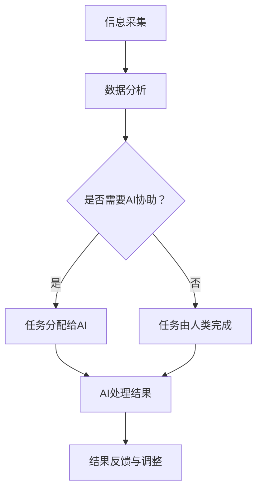

                 

关键词：人类-AI协作、潜能、AI能力、融合、发展趋势

> 摘要：随着人工智能技术的快速发展，人类与AI的协作模式正在发生深刻变革。本文探讨了人类与AI协作的背景、核心概念、算法原理、数学模型、项目实践、应用场景及未来展望，旨在揭示人类-AI协作的发展趋势，为相关领域的研究和实践提供参考。

## 1. 背景介绍

随着大数据、云计算、深度学习等技术的不断发展，人工智能（AI）已经渗透到社会的各个领域，从医疗、金融到教育、制造，AI正在改变着我们的生活方式和工作方式。然而，人工智能并非取代人类，而是与人类协作，共同推动社会进步。人类-AI协作模式的核心在于发挥人类与AI各自的优势，实现优势互补，提升整体效能。

### 1.1 人工智能发展的现状

人工智能已经取得了显著的成果。以深度学习为代表的机器学习技术在图像识别、自然语言处理等领域取得了突破性进展。例如，在图像识别领域，卷积神经网络（CNN）已经达到了甚至超越人类水平；在自然语言处理领域，循环神经网络（RNN）和Transformer模型等新一代算法取得了前所未有的效果。

### 1.2 人类-AI协作的意义

人类-AI协作具有深远的意义。首先，AI可以帮助人类处理复杂的任务，提高工作效率。例如，在医疗领域，AI可以辅助医生进行疾病诊断，提高诊断准确率。其次，AI可以为人类提供新的认知工具，拓展人类的认知边界。例如，通过大数据分析和机器学习，AI可以为科学研究提供新的视角和方法。最后，人类-AI协作可以推动社会创新，催生新的产业和就业机会。

## 2. 核心概念与联系

### 2.1 人类潜能

人类潜能是指人类在认知、情感、行为等方面具备的潜在能力。这些能力包括逻辑思维、创造力、情感共鸣等。人类潜能的实现受到多种因素的影响，如教育、环境、个人努力等。

### 2.2 AI能力

AI能力是指人工智能系统在特定任务上表现出的智能水平。AI能力主要包括数据采集、数据处理、模式识别、决策制定等。AI能力的实现依赖于算法、计算能力和数据资源。

### 2.3 人类与AI协作的架构

人类与AI协作的架构包括以下几个方面：

1. **信息交流**：人类与AI通过自然语言处理、语音识别等技术进行信息交流。
2. **任务分配**：人类根据自身优势，将任务分配给AI或自身完成。
3. **协作决策**：人类与AI共同参与决策过程，实现最优结果。
4. **反馈与调整**：人类与AI根据任务执行结果进行反馈和调整，以提升协作效能。

下面是一个Mermaid流程图，展示了人类与AI协作的基本流程：



## 3. 核心算法原理 & 具体操作步骤

### 3.1 算法原理概述

人类-AI协作的核心算法原理主要包括机器学习、深度学习、自然语言处理等。这些算法通过数据驱动的方式，使AI能够自动从数据中学习并改进自身性能。

### 3.2 算法步骤详解

1. **数据采集**：从各种来源收集数据，如文本、图像、音频等。
2. **数据预处理**：对数据进行清洗、归一化等处理，以便后续训练。
3. **模型选择**：根据任务需求选择合适的模型，如卷积神经网络（CNN）、循环神经网络（RNN）、Transformer等。
4. **模型训练**：使用训练数据对模型进行训练，通过反向传播算法不断调整模型参数。
5. **模型评估**：使用验证数据对模型进行评估，确保模型性能满足要求。
6. **模型部署**：将训练好的模型部署到生产环境中，供人类与AI协作使用。
7. **持续优化**：根据实际应用效果，不断调整和优化模型，以提升协作效能。

### 3.3 算法优缺点

#### 优点：

1. **高效性**：AI能够快速处理大量数据，提高工作效率。
2. **准确性**：AI通过大量训练数据，能够达到甚至超越人类在特定领域的准确性。
3. **泛化能力**：AI能够从数据中学习并应用到不同场景，具有较好的泛化能力。

#### 缺点：

1. **数据依赖性**：AI的性能受训练数据质量的影响较大，数据质量差可能导致模型性能下降。
2. **解释性不足**：许多深度学习模型具有黑盒特性，难以解释其决策过程。
3. **伦理风险**：AI在处理敏感数据时，可能存在隐私泄露等伦理风险。

### 3.4 算法应用领域

人类-AI协作算法在各个领域具有广泛的应用前景：

1. **医疗**：AI可以辅助医生进行疾病诊断、药物研发等。
2. **金融**：AI可以用于风险控制、投资策略制定等。
3. **教育**：AI可以辅助教师进行教学、个性化学习推荐等。
4. **制造**：AI可以用于质量检测、设备维护等。

## 4. 数学模型和公式 & 详细讲解 & 举例说明

### 4.1 数学模型构建

人类-AI协作的数学模型主要包括线性模型、神经网络模型等。以下以神经网络模型为例进行讲解。

### 4.2 公式推导过程

神经网络模型的核心公式为：

\[ z = x \cdot w + b \]

\[ a = \sigma(z) \]

其中，\( x \) 为输入特征，\( w \) 为权重，\( b \) 为偏置，\( z \) 为线性组合，\( a \) 为激活函数输出。

### 4.3 案例分析与讲解

以一个简单的神经网络为例，解释其工作原理。

假设我们有一个输入特征 \( x = [1, 2, 3] \)，权重 \( w = [0.5, 0.5, 0.5] \)，偏置 \( b = 1 \)，激活函数为 \( \sigma \)（Sigmoid函数）。

首先，计算线性组合：

\[ z = x \cdot w + b = [1, 2, 3] \cdot [0.5, 0.5, 0.5] + 1 = [1.5, 2.5, 3.5] \]

然后，计算激活函数输出：

\[ a = \sigma(z) = \frac{1}{1 + e^{-z}} \]

假设我们取 \( z = 3.5 \) 时的激活函数输出为 \( a = 0.9 \)。

这意味着，该神经元的输出为0.9，表示该输入特征的重要程度。

通过层层叠加这样的神经元，神经网络可以实现对复杂函数的拟合和预测。

## 5. 项目实践：代码实例和详细解释说明

### 5.1 开发环境搭建

为了进行人类-AI协作项目实践，我们需要搭建一个合适的开发环境。以下是搭建步骤：

1. 安装Python环境：在官方网站下载Python安装包并安装。
2. 安装依赖库：使用pip命令安装必要的依赖库，如NumPy、TensorFlow等。
3. 配置Jupyter Notebook：安装Jupyter Notebook，以便进行交互式编程。

### 5.2 源代码详细实现

以下是一个简单的人类-AI协作项目示例，实现一个基于神经网络的分类任务。

```python
import numpy as np
import tensorflow as tf

# 搭建神经网络模型
model = tf.keras.Sequential([
    tf.keras.layers.Dense(64, activation='relu', input_shape=[784]),
    tf.keras.layers.Dense(10, activation='softmax')
])

# 编译模型
model.compile(optimizer='adam',
              loss='categorical_crossentropy',
              metrics=['accuracy'])

# 加载数据集
(x_train, y_train), (x_test, y_test) = tf.keras.datasets.mnist.load_data()

# 预处理数据
x_train = x_train / 255.0
x_test = x_test / 255.0
x_train = x_train.reshape(-1, 784)
x_test = x_test.reshape(-1, 784)

# 转换为one-hot编码
y_train = tf.keras.utils.to_categorical(y_train, 10)
y_test = tf.keras.utils.to_categorical(y_test, 10)

# 训练模型
model.fit(x_train, y_train, epochs=5, batch_size=64)

# 评估模型
model.evaluate(x_test, y_test)
```

### 5.3 代码解读与分析

该代码实现了一个简单的神经网络模型，用于MNIST手写数字识别任务。以下是代码的解读和分析：

1. **模型搭建**：使用`tf.keras.Sequential`搭建模型，包含一个全连接层（Dense）和一个softmax输出层。
2. **编译模型**：设置优化器、损失函数和评估指标。
3. **加载数据集**：使用`tf.keras.datasets.mnist.load_data()`加载MNIST数据集。
4. **预处理数据**：将图像数据归一化，并reshape为模型所需的形状。
5. **转换为one-hot编码**：将标签转换为one-hot编码，以便进行分类任务。
6. **训练模型**：使用`model.fit()`训练模型，指定训练轮数和批量大小。
7. **评估模型**：使用`model.evaluate()`评估模型在测试集上的性能。

通过这个简单的示例，我们可以看到人类-AI协作在具体项目中的应用过程。

## 6. 实际应用场景

### 6.1 医疗

在医疗领域，人类-AI协作已经成为提高诊断准确率和治疗效率的重要手段。例如，AI可以通过分析医疗影像数据，辅助医生进行疾病诊断，如肺癌、乳腺癌等。同时，AI还可以为患者提供个性化的治疗方案，提高治疗效果。

### 6.2 金融

在金融领域，人类-AI协作可以帮助金融机构进行风险评估、投资策略制定等。例如，AI可以分析大量市场数据，为投资者提供投资建议，提高投资收益。此外，AI还可以识别异常交易行为，预防金融欺诈。

### 6.3 教育

在教育领域，人类-AI协作可以为学生提供个性化的学习体验。例如，AI可以根据学生的学习情况，推荐合适的学习资源和练习题，提高学习效果。同时，AI还可以辅助教师进行教学管理和学生评估，减轻教师的工作负担。

### 6.4 制造

在制造领域，人类-AI协作可以提升生产效率和产品质量。例如，AI可以实时监控生产线设备状态，预测设备故障，进行预防性维护。同时，AI还可以优化生产流程，提高生产效率。

## 7. 工具和资源推荐

### 7.1 学习资源推荐

1. **《深度学习》（Goodfellow, Bengio, Courville著）**：一本经典的深度学习入门书籍，涵盖了深度学习的理论基础和实践应用。
2. **吴恩达的《深度学习专项课程》**（Udacity）：一门在线课程，适合初学者系统学习深度学习知识。

### 7.2 开发工具推荐

1. **TensorFlow**：一款开源的深度学习框架，适用于各种深度学习任务。
2. **PyTorch**：另一款流行的深度学习框架，具有灵活的动态图模型。
3. **Jupyter Notebook**：一款交互式的编程环境，方便进行数据分析和模型训练。

### 7.3 相关论文推荐

1. **“Deep Learning”**（Goodfellow, Bengio, Courville著）：一篇综述文章，介绍了深度学习的发展历程和应用场景。
2. **“A Theoretical Framework for Backpropagation”**（Rumelhart, Hinton, Williams著）：一篇关于反向传播算法的论文，详细阐述了神经网络训练的理论基础。

## 8. 总结：未来发展趋势与挑战

### 8.1 研究成果总结

人类-AI协作在人工智能、认知科学、教育学等多个领域取得了显著的研究成果。例如，深度学习算法在图像识别、自然语言处理等任务上取得了突破性进展；认知科学揭示了人类与AI协作的心理机制；教育学探索了人类-AI协作在教育领域的应用。

### 8.2 未来发展趋势

未来，人类-AI协作将呈现以下发展趋势：

1. **智能化**：AI将更加智能化，具备更强的自主学习和决策能力。
2. **个性化**：AI将更加关注个体差异，为用户提供个性化的服务。
3. **人机共生**：人类与AI将实现更紧密的协作，共同推动社会进步。

### 8.3 面临的挑战

然而，人类-AI协作也面临一系列挑战：

1. **数据隐私**：在处理敏感数据时，需要确保数据隐私和安全。
2. **伦理问题**：需要制定相应的伦理规范，确保AI的发展符合人类利益。
3. **技术门槛**：AI技术的普及和应用仍需降低技术门槛，使更多领域受益。

### 8.4 研究展望

未来，我们期待人类-AI协作能够实现以下目标：

1. **提升人类生活质量**：通过AI的协助，提高工作效率、生活质量。
2. **促进社会进步**：推动教育、医疗、金融等领域的创新和变革。
3. **实现可持续发展**：通过AI的助力，实现资源优化、环境保护等目标。

## 9. 附录：常见问题与解答

### 9.1 什么是人类-AI协作？

人类-AI协作是指人类与人工智能系统共同参与任务，通过信息交流、任务分配、协作决策等方式，实现优势互补，提升整体效能。

### 9.2 人类-AI协作有哪些应用领域？

人类-AI协作在医疗、金融、教育、制造等领域具有广泛的应用。例如，AI可以辅助医生进行疾病诊断，为投资者提供投资建议，为学生提供个性化学习体验等。

### 9.3 人类-AI协作是否会取代人类？

人类-AI协作并非取代人类，而是与人类共同推动社会进步。AI可以处理复杂任务，拓展人类认知边界，但无法完全替代人类的情感、创造力等特质。

### 9.4 人类-AI协作如何确保数据隐私和安全？

在人类-AI协作中，确保数据隐私和安全至关重要。可以通过数据加密、访问控制、隐私保护算法等技术手段，确保数据在传输和处理过程中的安全。

## 结语

人类-AI协作是未来社会发展的重要趋势。通过深入研究和实践，我们有望实现人类潜能与AI能力的完美融合，共同推动社会进步。让我们携手共进，迎接这个充满机遇和挑战的时代。

### 作者署名

本文作者：禅与计算机程序设计艺术 / Zen and the Art of Computer Programming。感谢您的阅读，期待与您共同探索人类-AI协作的无限可能。

