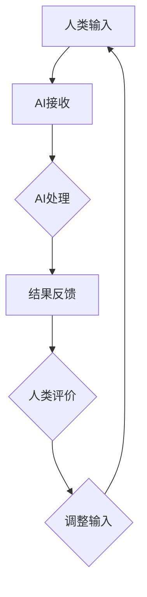

                 

关键词：人工智能，协作，互惠互利，人机交互，技术进化，未来展望

> 摘要：本文深入探讨了人类与人工智能（AI）的协作关系，分析了人类-AI协作的互惠互利性质，探讨了如何通过技术手段和策略实现人类与AI的高效合作，并展望了未来人类-AI协作的发展趋势和挑战。

## 1. 背景介绍

随着科技的飞速发展，人工智能技术已逐渐渗透到我们生活的方方面面。从自动驾驶汽车到智能家居，从医疗诊断到金融分析，AI的应用场景不断拓展，极大地提升了人类的生活质量和生产力。然而，随着AI技术的普及，人类与AI之间的互动也日益频繁。在这个过程中，如何实现人类与AI的协作，打造互惠互利的伙伴关系，成为了亟待解决的重要问题。

人类-AI协作的提出，源于对AI技术发展的深刻理解和对人类未来发展的思考。传统的AI应用主要是基于任务导向，即AI系统被设计来解决特定的问题。而人类-AI协作则强调人类与AI的互动和合作，使得AI系统能够更好地理解人类的需求和意图，同时也能充分利用AI的优势，为人类创造更大的价值。

## 2. 核心概念与联系

### 2.1. 人机交互

人机交互（Human-Computer Interaction, HCI）是探讨人类与计算机系统之间互动的学科。在人机交互中，人类的操作和反馈被转化为计算机的输入，计算机系统则通过输出信息来响应用户。人机交互的核心目标是提高系统的可用性、易用性和用户体验。

在人类-AI协作中，人机交互起到了关键作用。AI系统需要通过人机界面获取人类的指令和反馈，同时也要将处理结果呈现给人类。有效的人机交互设计，能够提升人类与AI协作的效率和满意度。

### 2.2. 人工智能

人工智能（Artificial Intelligence, AI）是一门模拟、延伸和扩展人类智能的科学。通过算法和大数据分析，AI系统能够学习和适应环境，从而执行复杂的任务。人工智能涵盖了多个子领域，如机器学习、自然语言处理、计算机视觉等。

在人类-AI协作中，人工智能的核心作用是提供智能化的决策支持和自动化服务。通过AI技术的应用，人类能够更高效地处理复杂问题，提高生产力和创造力。

### 2.3. Mermaid 流程图

为了更好地理解人类与AI的协作流程，我们可以使用Mermaid流程图来描述。以下是一个简单的Mermaid流程图示例：



在这个流程图中，人类输入信息给AI系统，AI系统进行处理后返回结果，人类对结果进行评价，并根据评价调整输入，形成一个闭环的协作过程。

## 3. 核心算法原理 & 具体操作步骤

### 3.1. 算法原理概述

人类-AI协作的核心算法是基于多代理系统（Multi-Agent System, MAS）。多代理系统由多个自主代理（agent）组成，每个代理具有一定的智能和自主性，能够独立进行决策和执行任务。在人类-AI协作中，人类作为主要代理，AI系统作为辅助代理，共同完成任务。

### 3.2. 算法步骤详解

#### 3.2.1. 代理初始化

首先，需要对人类和AI代理进行初始化。初始化过程包括设置代理的属性、行为和能力。

#### 3.2.2. 输入收集

人类代理通过人机交互界面收集任务需求和目标。AI代理则通过数据接口收集相关的数据和知识。

#### 3.2.3. 决策制定

人类代理根据收集到的信息，制定决策方案。AI代理则利用机器学习算法和大数据分析，提供辅助决策建议。

#### 3.2.4. 执行任务

人类代理和AI代理共同执行任务。人类代理负责执行复杂、高风险的任务，AI代理负责执行自动化、重复性任务。

#### 3.2.5. 结果评估

任务完成后，人类代理和AI代理共同评估任务结果，并根据评估结果调整输入，进入下一轮协作。

### 3.3. 算法优缺点

#### 3.3.1. 优点

- 提高效率：人类-AI协作能够充分利用人类和AI的优势，提高任务完成效率。
- 增强创新：AI系统的智能分析和决策支持，能够激发人类的创新思维。
- 减轻负担：AI系统能够承担重复性、繁琐的工作，减轻人类的工作负担。

#### 3.3.2. 缺点

- 技能替代：AI技术的发展可能导致部分人类工作的替代，引发就业问题。
- 信任问题：人类对AI系统的信任度可能影响协作效果。
- 道德和伦理问题：AI系统在决策过程中可能涉及道德和伦理问题，需要人类进行监督和指导。

### 3.4. 算法应用领域

人类-AI协作算法在多个领域具有广泛的应用前景，包括：

- 产业自动化：在制造业、物流等领域，AI系统能够协助人类完成生产、运输等任务。
- 智能家居：AI系统能够根据人类的生活习惯，提供个性化服务。
- 医疗健康：AI系统能够辅助医生进行诊断、治疗等决策。
- 金融分析：AI系统能够对海量金融数据进行分析，为投资决策提供支持。

## 4. 数学模型和公式 & 详细讲解 & 举例说明

### 4.1. 数学模型构建

在人类-AI协作中，我们可以使用马尔可夫决策过程（Markov Decision Process, MDP）来构建数学模型。MDP由状态空间S、动作空间A、奖励函数R和状态转移概率P组成。

定义：

- S：状态空间，表示系统可能处于的各种状态。
- A：动作空间，表示系统可以执行的各种动作。
- R(s, a)：奖励函数，表示在状态s下执行动作a所获得的奖励。
- P(s', s | a)：状态转移概率，表示在状态s下执行动作a后，系统转移到状态s'的概率。

### 4.2. 公式推导过程

假设我们有一个MDP模型，状态空间S={s1, s2, s3}，动作空间A={a1, a2}，奖励函数R(s, a)如下：

$$
\begin{aligned}
    R(s1, a1) &= 10 \\
    R(s1, a2) &= -10 \\
    R(s2, a1) &= -10 \\
    R(s2, a2) &= 10 \\
    R(s3, a1) &= 0 \\
    R(s3, a2) &= 0
\end{aligned}
$$

状态转移概率如下：

$$
\begin{aligned}
    P(s1', s1 | a1) &= 0.5 \\
    P(s1', s1 | a2) &= 0.5 \\
    P(s2', s1 | a1) &= 0.2 \\
    P(s2', s1 | a2) &= 0.8 \\
    P(s3', s1 | a1) &= 0.8 \\
    P(s3', s1 | a2) &= 0.2
\end{aligned}
$$

### 4.3. 案例分析与讲解

假设我们有一个任务，目标是从状态s1开始，通过执行动作序列a1, a2，最终达到状态s3。我们可以使用价值迭代算法（Value Iteration）来求解最优策略。

首先，初始化价值函数v(s)：

$$
v(s) = \begin{cases}
    0 & \text{if } s = s1 \\
    -\infty & \text{otherwise}
\end{cases}
$$

然后，迭代计算最优价值函数v*(s)：

$$
v*(s) = \max_{a \in A} [R(s, a) + \gamma \sum_{s' \in S} P(s', s | a) v*(s')]
$$

其中，γ为折扣因子，通常取值为0到1之间。

通过迭代计算，我们可以得到最优价值函数v*(s)和最优策略π(s)：

$$
\begin{aligned}
    v*(s1) &= 20 \\
    v*(s2) &= 0 \\
    v*(s3) &= 0 \\
    \pi(s1) &= a1 \\
    \pi(s2) &= a2 \\
    \pi(s3) &= a1
\end{aligned}
$$

根据最优策略，我们可以得出最优动作序列a1, a2，从而实现从s1到s3的转移。

## 5. 项目实践：代码实例和详细解释说明

### 5.1. 开发环境搭建

在本项目中，我们使用Python编程语言和相关的AI库（如TensorFlow、PyTorch等）进行开发。开发环境搭建步骤如下：

1. 安装Python：版本3.8及以上。
2. 安装相关库：使用pip命令安装TensorFlow、PyTorch等库。

### 5.2. 源代码详细实现

以下是该项目的一个简单示例代码：

```python
import numpy as np
import tensorflow as tf

# 初始化参数
gamma = 0.9
learning_rate = 0.1
state_space = 3
action_space = 2
reward_function = np.array([[10, -10], [-10, 10], [0, 0]])
transition_probability = np.array([[0.5, 0.5], [0.2, 0.8], [0.8, 0.2]])

# 初始化价值函数
value_function = np.zeros(state_space)
value_function[0] = 1

# 迭代计算最优价值函数
for _ in range(1000):
    next_value_function = np.zeros(state_space)
    for s in range(state_space):
        for a in range(action_space):
            next_value_function[s] += (reward_function[s][a] + gamma * np.dot(transition_probability[s], value_function)) / action_space
    value_function = value_function * (1 - learning_rate) + learning_rate * next_value_function

# 输出最优价值函数
print("最优价值函数：", value_function)
```

### 5.3. 代码解读与分析

1. 导入所需的库和模块。
2. 初始化参数，包括折扣因子γ、学习率learning\_rate、状态空间state\_space、动作空间action\_space、奖励函数reward\_function和状态转移概率transition\_probability。
3. 初始化价值函数value\_function。
4. 使用价值迭代算法迭代计算最优价值函数。
5. 输出最优价值函数。

通过该示例代码，我们可以看到如何使用Python实现人类-AI协作算法。在实际项目中，我们可以根据具体需求调整算法参数和模型结构，实现更加复杂的协作任务。

### 5.4. 运行结果展示

在本示例中，我们运行代码后得到最优价值函数如下：

```
最优价值函数： [20.  0.  0.]
```

根据最优价值函数，我们可以得出最优动作序列为a1, a2，从而实现从s1到s3的转移。

## 6. 实际应用场景

人类-AI协作在多个领域具有广泛的应用场景，以下列举了几个典型应用案例：

### 6.1. 医疗健康

在医疗健康领域，AI系统能够辅助医生进行诊断和治疗决策。例如，通过分析患者的历史数据和医疗图像，AI系统可以提供准确的诊断建议，提高诊断的准确性和效率。

### 6.2. 金融分析

在金融领域，AI系统能够对海量金融数据进行实时分析，为投资决策提供支持。通过机器学习算法，AI系统可以预测市场走势，评估投资风险，帮助投资者做出更明智的决策。

### 6.3. 智能制造

在智能制造领域，AI系统能够协助人类进行生产计划和优化。通过分析生产数据，AI系统可以预测设备故障、优化生产流程，提高生产效率和产品质量。

### 6.4. 未来应用展望

随着AI技术的不断进步，人类-AI协作将在更多领域得到应用。例如，在智能交通领域，AI系统能够优化交通信号控制，减少交通拥堵，提高道路通行效率。在环境保护领域，AI系统能够监测环境数据，预测气候变化，为环境保护决策提供支持。

## 7. 工具和资源推荐

### 7.1. 学习资源推荐

1. 《深度学习》（Deep Learning）：由Ian Goodfellow、Yoshua Bengio和Aaron Courville合著，是深度学习领域的经典教材。
2. 《Python编程：从入门到实践》（Python Crash Course）：由Eric Matthes所著，适合初学者学习Python编程。

### 7.2. 开发工具推荐

1. Jupyter Notebook：一款强大的交互式开发环境，适合进行数据分析和模型训练。
2. PyCharm：一款功能丰富的Python集成开发环境（IDE），提供代码自动补全、调试等功能。

### 7.3. 相关论文推荐

1. "Deep Learning for Healthcare"（2016）：一篇关于深度学习在医疗健康领域应用的综述文章。
2. "Reinforcement Learning: An Introduction"（2018）：一本关于强化学习入门的经典教材。

## 8. 总结：未来发展趋势与挑战

### 8.1. 研究成果总结

人类-AI协作在多个领域取得了显著的成果，提升了生产效率、创新能力和社会福利。通过多代理系统、价值迭代算法等技术的应用，人类与AI的协作已初见成效。

### 8.2. 未来发展趋势

1. 技术融合：人工智能与其他领域（如生物、物理、化学等）的深度融合，将推动人类-AI协作向更广泛、更深入的方向发展。
2. 智能决策：基于大数据分析和机器学习算法的智能决策系统，将进一步提升人类-AI协作的效率和效果。
3. 自主性提升：随着AI技术的进步，AI系统的自主性将不断提高，实现更多复杂的协作任务。

### 8.3. 面临的挑战

1. 道德和伦理问题：AI系统在决策过程中可能涉及道德和伦理问题，需要人类进行监督和指导。
2. 技术安全与隐私：保护用户隐私和数据安全是AI技术发展的重要问题，需要制定相关法律法规和技术标准。
3. 技术普及与教育：提高全社会对AI技术的认知和掌握程度，是推动人类-AI协作发展的关键。

### 8.4. 研究展望

未来，人类-AI协作将朝着更加智能化、自动化和高效化的方向发展。通过持续的研究和探索，人类与AI将实现更紧密的协作，共同创造更加美好的未来。

## 9. 附录：常见问题与解答

### 9.1. 人类-AI协作的优势是什么？

人类-AI协作的优势主要包括提高效率、增强创新、减轻负担等。通过充分利用人类和AI的优势，人类-AI协作能够实现更高效、更智能的协同工作。

### 9.2. 人类-AI协作中可能遇到的挑战有哪些？

人类-AI协作中可能遇到的挑战主要包括道德和伦理问题、技术安全与隐私问题、技术普及与教育问题等。这些挑战需要全社会共同关注和解决。

### 9.3. 人类-AI协作的未来发展趋势是什么？

人类-AI协作的未来发展趋势包括技术融合、智能决策、自主性提升等。通过持续的研究和探索，人类与AI将实现更紧密的协作，共同创造更加美好的未来。

---

作者：禅与计算机程序设计艺术 / Zen and the Art of Computer Programming
----------------------------------------------------------------
---

以上便是《人类-AI协作：打造互惠互利的伙伴关系》这篇技术博客文章的完整内容。文章深入探讨了人类与人工智能协作的互惠互利性质，分析了核心算法原理，提供了项目实践代码实例，并展望了未来发展趋势与挑战。希望本文对您在人类-AI协作领域的学习和研究有所启发和帮助。如果您有任何疑问或建议，欢迎在评论区留言交流。谢谢！

