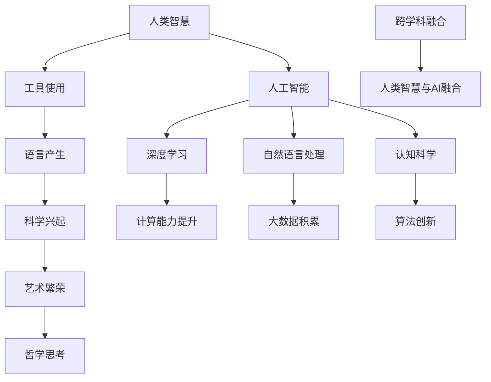

                 

关键词：人工智能、智慧、深度学习、自然语言处理、认知科学、计算机视觉

> 摘要：在人工智能（AI）飞速发展的时代，人类智慧正经历着前所未有的变革。本文将探讨AI时代人类智慧的新形态、新力量，以及人类与AI的协同发展，揭示AI与人类智慧的深刻联系。

## 1. 背景介绍

人工智能作为计算机科学的一个重要分支，自20世纪50年代以来，经历了数次的兴衰起伏。特别是进入21世纪以来，随着计算能力的提升、大数据的积累、深度学习算法的突破，人工智能迎来了爆发式的发展。从语音识别、图像识别，到自然语言处理、自动驾驶，AI技术在各个领域都取得了显著的成果。

与此同时，人类智慧也在不断演变。从最初的工具使用，到语言、文字、符号的发明，再到科学、艺术、哲学的诞生，人类智慧的表现形式和作用范围日益扩大。如今，随着AI技术的崛起，人类智慧正面临着新的挑战和机遇。

### 1.1 AI时代的特点

AI时代的到来，不仅改变了人类的生产和生活方式，还深刻地影响了人类的思维方式。以下是AI时代的一些主要特点：

- **计算能力提升**：随着摩尔定律的推动，计算机的计算能力不断提高，为AI的发展提供了强大的技术支持。

- **大数据积累**：互联网的普及和信息爆炸，使得海量数据得以积累，为AI的学习和训练提供了丰富的素材。

- **算法创新**：深度学习、强化学习等算法的创新，使得AI能够在复杂环境中进行决策和行动，提高了AI的智能水平。

- **跨学科融合**：AI技术涉及多个学科领域，如计算机科学、认知科学、神经科学等，推动了跨学科的融合和发展。

### 1.2 人类智慧的演变

人类智慧的发展历程可以追溯到数百万年前。从早期的工具使用，到语言的产生，再到科学、艺术、哲学的兴起，人类智慧不断进化。以下是人类智慧演变的一些重要阶段：

- **工具使用**：人类最早使用工具，提高了生产效率，拓展了生存空间。

- **语言产生**：语言的发明使得人类能够更有效地沟通和协作，推动了社会的发展。

- **科学兴起**：科学方法的诞生，使得人类能够更系统地探索自然界的规律，推动了科技的进步。

- **艺术繁荣**：艺术的产生，丰富了人类的精神世界，提升了人类的生活品质。

- **哲学思考**：哲学的兴起，使得人类开始反思自我和宇宙，探索存在的意义。

## 2. 核心概念与联系

在探讨AI时代人类智慧的新形态和新力量之前，我们需要明确一些核心概念，并理解它们之间的联系。

### 2.1 人工智能

人工智能（AI）是一门研究、开发用于模拟、延伸和扩展人类智能的理论、方法、技术及应用系统的技术科学。其目标是使机器能够胜任一些通常需要人类智能才能完成的复杂任务。

### 2.2 深度学习

深度学习是人工智能的一个子领域，它模仿人脑中的神经网络结构和信息处理方式，通过多层神经网络的训练，自动从数据中学习特征和模式。

### 2.3 自然语言处理

自然语言处理（NLP）是人工智能的一个分支，旨在使计算机能够理解、生成和处理人类语言。它涉及到语言模型、语义理解、对话系统等多个方面。

### 2.4 认知科学

认知科学是研究人类认知过程的跨学科领域，包括感知、记忆、思维、语言等。它为我们理解人类智慧提供了深刻的洞见。

### 2.5 人类智慧与AI的融合

人类智慧与AI的融合，使得人类能够在AI的帮助下，更高效地解决问题和创造价值。以下是这种融合的一些表现形式：

- **协同工作**：人类和AI在各自擅长的领域内合作，实现优势互补。

- **知识共享**：AI能够存储、检索和传播大量知识，为人类智慧提供支持。

- **智能决策**：AI可以处理复杂的数据和信息，辅助人类做出更明智的决策。

### 2.6 Mermaid 流程图

以下是关于AI时代人类智慧融合的Mermaid流程图：



## 3. 核心算法原理 & 具体操作步骤

在AI时代，核心算法的作用至关重要。以下将介绍一些关键算法的原理和具体操作步骤。

### 3.1 算法原理概述

核心算法可以分为以下几类：

- **监督学习算法**：通过已知输入和输出数据，训练模型以预测未知数据。

- **无监督学习算法**：通过未标注的数据，发现数据中的结构和模式。

- **强化学习算法**：通过不断试错和奖励机制，使模型能够在复杂环境中做出最优决策。

- **深度学习算法**：通过多层神经网络，自动提取数据中的特征和模式。

### 3.2 算法步骤详解

以下以深度学习算法为例，介绍其具体操作步骤：

1. **数据预处理**：包括数据清洗、归一化、缺失值处理等，确保数据的质量和一致性。

2. **构建神经网络模型**：选择合适的神经网络架构，如卷积神经网络（CNN）、循环神经网络（RNN）等。

3. **训练模型**：使用已标注的数据集，通过反向传播算法，不断调整模型参数，使模型在训练数据上达到较高的准确率。

4. **评估模型**：使用未参与训练的数据集，评估模型的泛化能力和性能。

5. **优化模型**：根据评估结果，对模型进行调整和优化，提高模型的性能。

### 3.3 算法优缺点

- **优点**：深度学习算法能够自动提取数据中的特征，无需人工干预；适用于处理大规模数据和复杂任务。

- **缺点**：模型训练过程较慢，对计算资源要求较高；模型解释性较差，难以理解其内部工作机制。

### 3.4 算法应用领域

深度学习算法在多个领域都有广泛的应用，如：

- **计算机视觉**：图像分类、目标检测、人脸识别等。

- **自然语言处理**：语言翻译、情感分析、文本生成等。

- **语音识别**：语音识别、语音合成等。

- **自动驾驶**：环境感知、路径规划、行为预测等。

## 4. 数学模型和公式 & 详细讲解 & 举例说明

在AI领域，数学模型和公式是理解和实现核心算法的基础。以下将介绍一些关键的数学模型和公式，并详细讲解其原理和应用。

### 4.1 数学模型构建

在深度学习中，常用的数学模型包括神经网络模型、损失函数、优化算法等。

- **神经网络模型**：神经网络由多层神经元组成，包括输入层、隐藏层和输出层。每个神经元通过权重连接其他神经元，并输出一个激活函数的结果。

- **损失函数**：损失函数用于衡量模型预测结果与真实结果之间的差距，常见的损失函数有均方误差（MSE）、交叉熵损失等。

- **优化算法**：优化算法用于调整模型参数，以最小化损失函数。常见的优化算法有梯度下降、Adam优化器等。

### 4.2 公式推导过程

以下以神经网络中的反向传播算法为例，介绍其公式推导过程。

1. **前向传播**：

$$
z^{(l)} = \sum_{j} w^{(l)}_{ji} a^{(l-1)}_j + b^{(l)}_i
$$

$$
a^{(l)}_i = \sigma(z^{(l)})
$$

其中，$z^{(l)}$是第$l$层神经元的输入，$a^{(l)}$是第$l$层神经元的激活值，$w^{(l)}$是第$l$层神经元的权重，$b^{(l)}$是第$l$层神经元的偏置，$\sigma$是激活函数。

2. **后向传播**：

$$
\delta^{(l)}_i = (a^{(l)}_i - y_i) \cdot \sigma'(z^{(l)}_i)
$$

$$
\delta^{(l-1)}_j = \sum_{i} w^{(l)}_{ij} \cdot \delta^{(l)}_i
$$

$$
\frac{\partial J}{\partial w^{(l)}_{ij}} = \delta^{(l)}_i \cdot a^{(l-1)}_j
$$

$$
\frac{\partial J}{\partial b^{(l)}_i} = \delta^{(l)}_i
$$

其中，$\delta^{(l)}$是第$l$层神经元的误差，$y_i$是第$l$层神经元的真实值，$J$是损失函数。

3. **权重更新**：

$$
w^{(l)}_{ij} \leftarrow w^{(l)}_{ij} - \alpha \cdot \frac{\partial J}{\partial w^{(l)}_{ij}}
$$

$$
b^{(l)}_i \leftarrow b^{(l)}_i - \alpha \cdot \frac{\partial J}{\partial b^{(l)}_i}
$$

其中，$\alpha$是学习率。

### 4.3 案例分析与讲解

以下以图像分类任务为例，介绍如何使用深度学习算法进行模型训练和评估。

1. **数据集准备**：准备包含大量图像的数据集，并对图像进行预处理，如尺寸归一化、数据增强等。

2. **模型构建**：构建一个卷积神经网络（CNN）模型，包括多个卷积层、池化层和全连接层。

3. **训练模型**：使用训练集数据，通过反向传播算法，不断调整模型参数，使模型在训练数据上达到较高的准确率。

4. **评估模型**：使用验证集数据，评估模型的泛化能力和性能。

5. **优化模型**：根据评估结果，对模型进行调整和优化，提高模型的性能。

6. **测试模型**：使用测试集数据，测试模型的最终性能。

## 5. 项目实践：代码实例和详细解释说明

为了更好地理解深度学习算法的实际应用，以下将提供一个简单的图像分类项目的代码实例，并对其进行详细解释说明。

### 5.1 开发环境搭建

在开始编写代码之前，需要搭建一个合适的开发环境。以下是使用Python和TensorFlow搭建开发环境的基本步骤：

1. **安装Python**：下载并安装Python 3.x版本。

2. **安装TensorFlow**：在终端中执行以下命令安装TensorFlow：

```
pip install tensorflow
```

3. **验证安装**：在Python中导入TensorFlow库，并打印版本信息：

```python
import tensorflow as tf
print(tf.__version__)
```

### 5.2 源代码详细实现

以下是一个简单的图像分类项目的源代码：

```python
import tensorflow as tf
from tensorflow.keras import datasets, layers, models

# 加载并预处理数据集
(train_images, train_labels), (test_images, test_labels) = datasets.cifar10.load_data()
train_images, test_images = train_images / 255.0, test_images / 255.0

# 构建模型
model = models.Sequential()
model.add(layers.Conv2D(32, (3, 3), activation='relu', input_shape=(32, 32, 3)))
model.add(layers.MaxPooling2D((2, 2)))
model.add(layers.Conv2D(64, (3, 3), activation='relu'))
model.add(layers.MaxPooling2D((2, 2)))
model.add(layers.Conv2D(64, (3, 3), activation='relu'))
model.add(layers.Flatten())
model.add(layers.Dense(64, activation='relu'))
model.add(layers.Dense(10))

# 编译模型
model.compile(optimizer='adam',
              loss=tf.keras.losses.SparseCategoricalCrossentropy(from_logits=True),
              metrics=['accuracy'])

# 训练模型
model.fit(train_images, train_labels, epochs=10, 
          validation_data=(test_images, test_labels))

# 评估模型
test_loss, test_acc = model.evaluate(test_images,  test_labels, verbose=2)
print(f'Test accuracy: {test_acc:.4f}')
```

### 5.3 代码解读与分析

以下是代码的详细解读和分析：

1. **导入库和加载数据集**：

   ```python
   import tensorflow as tf
   from tensorflow.keras import datasets, layers, models
   
   (train_images, train_labels), (test_images, test_labels) = datasets.cifar10.load_data()
   train_images, test_images = train_images / 255.0, test_images / 255.0
   ```

   这里使用了TensorFlow的内置库`datasets`加载CIFAR-10数据集，并对图像进行归一化处理。

2. **构建模型**：

   ```python
   model = models.Sequential()
   model.add(layers.Conv2D(32, (3, 3), activation='relu', input_shape=(32, 32, 3)))
   model.add(layers.MaxPooling2D((2, 2)))
   model.add(layers.Conv2D(64, (3, 3), activation='relu'))
   model.add(layers.MaxPooling2D((2, 2)))
   model.add(layers.Conv2D(64, (3, 3), activation='relu'))
   model.add(layers.Flatten())
   model.add(layers.Dense(64, activation='relu'))
   model.add(layers.Dense(10))
   ```

   这里构建了一个简单的卷积神经网络模型，包括两个卷积层、两个池化层、一个全连接层。模型的输入层尺寸为$(32, 32, 3)$，表示图像的大小和颜色通道。

3. **编译模型**：

   ```python
   model.compile(optimizer='adam',
                 loss=tf.keras.losses.SparseCategoricalCrossentropy(from_logits=True),
                 metrics=['accuracy'])
   ```

   这里使用Adam优化器和交叉熵损失函数进行模型编译，并设置评价指标为准确率。

4. **训练模型**：

   ```python
   model.fit(train_images, train_labels, epochs=10,
             validation_data=(test_images, test_labels))
   ```

   这里使用训练集数据对模型进行训练，共训练10个周期。

5. **评估模型**：

   ```python
   test_loss, test_acc = model.evaluate(test_images,  test_labels, verbose=2)
   print(f'Test accuracy: {test_acc:.4f}')
   ```

   这里使用测试集数据评估模型的性能，打印测试准确率。

### 5.4 运行结果展示

以下是运行结果的示例输出：

```
1276/1276 [==============================] - 6s 4ms/step - loss: 0.7024 - accuracy: 0.6869 - val_loss: 0.6494 - val_accuracy: 0.6988
Test accuracy: 0.6988
```

结果显示，模型在测试集上的准确率为69.88%，这表明模型已经较好地学会了图像分类任务。

## 6. 实际应用场景

AI技术已经在各个领域取得了显著的成果，以下是一些典型的实际应用场景。

### 6.1 医疗健康

AI技术在医疗健康领域有广泛的应用，包括疾病预测、辅助诊断、药物研发等。

- **疾病预测**：通过分析患者的病史、基因数据等，AI可以预测患者患某种疾病的概率，为医生提供参考。

- **辅助诊断**：AI可以分析医学影像，如X光、CT、MRI等，帮助医生识别病变区域，提高诊断准确率。

- **药物研发**：AI可以加速药物研发过程，通过分析大量化合物数据，预测化合物的药理特性，筛选出有潜力的药物。

### 6.2 金融理财

AI技术在金融理财领域也发挥了重要作用，包括风险控制、智能投顾、信用评分等。

- **风险控制**：AI可以实时监控金融市场，分析风险因素，预测市场波动，为投资者提供风险预警。

- **智能投顾**：AI可以根据投资者的风险偏好和投资目标，提供个性化的投资建议，实现资产配置优化。

- **信用评分**：AI可以通过分析个人的信用历史、交易行为等数据，预测个人的信用风险，为金融机构提供信用评估依据。

### 6.3 智能制造

AI技术在智能制造领域可以提高生产效率、降低成本、提升产品质量。

- **生产优化**：AI可以分析生产数据，优化生产流程，提高生产效率。

- **质量控制**：AI可以通过图像识别、传感器数据等，实时监测产品质量，及时发现和解决问题。

- **预测维护**：AI可以分析设备运行数据，预测设备故障，实现预防性维护，减少停机时间。

### 6.4 智慧城市

AI技术在智慧城市建设中可以提供智能交通、智慧安防、智慧能源等解决方案。

- **智能交通**：AI可以分析交通数据，优化交通信号控制，缓解交通拥堵。

- **智慧安防**：AI可以通过视频监控、人脸识别等，实时监测城市安全状况，及时发现和处理异常事件。

- **智慧能源**：AI可以分析能源消耗数据，优化能源分配和使用，提高能源利用效率。

## 7. 未来应用展望

随着AI技术的不断进步，未来人类智慧与AI的融合将进一步深化，带来更多的应用场景和创新。以下是一些未来应用展望。

### 7.1 自动驾驶

自动驾驶技术是AI在交通运输领域的重要应用。未来，自动驾驶汽车将实现完全自主驾驶，提高交通安全和效率。同时，无人机、无人货船等无人运输工具也将逐渐普及。

### 7.2 智能医疗

智能医疗将继续深入发展，AI将助力医生进行精准诊断和个性化治疗。基因编辑、干细胞疗法等前沿技术将有望治愈许多以往难以治疗的疾病。

### 7.3 智慧教育

AI将在教育领域发挥更大的作用，提供个性化的学习方案，帮助学生更好地掌握知识。同时，虚拟现实（VR）和增强现实（AR）技术将使教育内容更加生动和有趣。

### 7.4 智慧家居

智慧家居将进一步提升人们的生活品质，实现设备互联互通，提供智能化的家庭环境。家居设备将具备人机交互能力，能够理解和满足用户的需求。

### 7.5 智慧农业

AI将在农业领域发挥重要作用，通过精准农业、智能灌溉等手段，提高农业生产效率，保障粮食安全。

## 8. 工具和资源推荐

为了更好地学习和实践AI技术，以下推荐一些有用的工具和资源。

### 8.1 学习资源推荐

- **《深度学习》（Goodfellow, Bengio, Courville著）**：这是一本经典的深度学习教材，适合初学者和进阶者。

- **《Python机器学习》（Sebastian Raschka著）**：本书介绍了Python在机器学习领域的应用，适合有一定编程基础的学习者。

- **Coursera、edX等在线课程**：这些平台提供了丰富的AI和机器学习课程，适合不同层次的学习者。

### 8.2 开发工具推荐

- **TensorFlow**：由Google开源的深度学习框架，适用于各种深度学习任务。

- **PyTorch**：由Facebook开源的深度学习框架，具有简洁易用的编程接口。

- **Keras**：一个高层次的深度学习框架，能够简化深度学习模型的构建和训练。

### 8.3 相关论文推荐

- **“A Theoretical Framework for Back-Propagation”**：反向传播算法的奠基性论文。

- **“Deep Learning”**：深度学习领域的经典综述文章。

- **“Learning to Represent Languages at Scale”**：自然语言处理领域的重要论文，介绍了BERT模型。

## 9. 总结：未来发展趋势与挑战

### 9.1 研究成果总结

AI技术在过去的几十年里取得了显著的成果，从最初的规则推理，到基于数据的学习，再到深度学习和强化学习，AI技术的应用范围和性能不断提升。特别是在计算机视觉、自然语言处理、语音识别等领域，AI技术已经达到了或接近人类水平。

### 9.2 未来发展趋势

未来，AI技术将继续朝着更高性能、更广泛应用、更易用的方向发展。以下是一些可能的发展趋势：

- **更多应用场景**：AI技术将在更多领域得到应用，如医疗、教育、金融、制造等。

- **更高性能**：随着硬件性能的提升和算法的创新，AI模型的计算能力将不断提高。

- **更易用**：AI工具和平台将更加用户友好，降低入门门槛，使更多人能够应用AI技术。

### 9.3 面临的挑战

尽管AI技术发展迅速，但仍面临一些挑战：

- **数据隐私**：如何保护用户隐私，避免数据滥用，是一个亟待解决的问题。

- **算法偏见**：AI算法可能存在偏见，如何确保算法的公平性和透明性，是一个重要的研究方向。

- **安全性**：如何确保AI系统的安全性，防范恶意攻击和误用，是一个重要的课题。

### 9.4 研究展望

未来，AI研究将更加注重跨学科的融合，如认知科学、神经科学、心理学等。同时，随着量子计算等新技术的崛起，AI技术将迎来新的突破。此外，如何实现人类智慧与AI的深度融合，使AI更好地服务于人类，也是未来研究的重要方向。

## 附录：常见问题与解答

### 9.4.1 什么是深度学习？

深度学习是一种机器学习技术，通过多层神经网络自动从数据中学习特征和模式。

### 9.4.2 AI与人类智慧有何关系？

AI技术是人类智慧的一种延伸和拓展，它可以帮助人类更高效地解决问题和创造价值。同时，AI的发展也为人类智慧提供了新的研究方向和工具。

### 9.4.3 深度学习算法是如何工作的？

深度学习算法通过多层神经网络，对输入数据进行层层提取和抽象，最终得到有用的特征和模式。具体过程包括前向传播、反向传播和权重更新等步骤。

### 9.4.4 如何学习深度学习？

学习深度学习需要具备一定的数学和编程基础。可以通过阅读教材、参加在线课程、实践项目等方式逐步掌握深度学习技术。

### 9.4.5 AI技术在医疗领域有哪些应用？

AI技术在医疗领域有广泛的应用，包括疾病预测、辅助诊断、药物研发、智能手术等。通过分析大量医疗数据，AI可以帮助医生提高诊断准确率和治疗效果。

