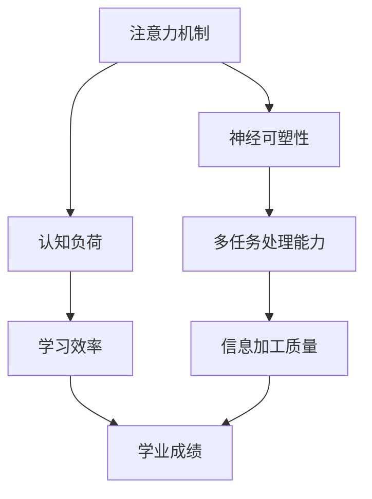

                 

关键词：注意力增强，教育技术，认知科学，神经可塑性，算法优化

> 摘要：本文探讨了注意力增强技术如何在教育领域发挥关键作用，通过结合认知科学和算法优化，提升学生的专注力和注意力水平，从而促进学习效果和创造力发展。文章首先介绍了注意力增强的背景和核心概念，随后详细分析了相关算法原理和操作步骤，以及数学模型和公式，最后通过项目实践和实际应用案例，展示了这一技术的前景和面临的挑战。

## 1. 背景介绍

注意力是人类认知系统中的一个核心过程，它决定了我们如何感知、处理和记忆信息。然而，在现代社会中，人们面临着大量的信息干扰和分心因素，导致注意力难以集中。尤其是在教育环境中，学生的注意力分散成为了一个普遍存在的问题，影响了他们的学习效果和学业成绩。

教育技术的快速发展为解决这一问题提供了新的可能性。注意力增强技术结合了认知科学、神经科学和计算机科学的研究成果，旨在通过技术手段提升个体的专注力和注意力水平，从而优化学习过程。

### 1.1 注意力增强技术的起源与发展

注意力增强技术最早可以追溯到20世纪末，当时心理学家和神经科学家开始研究如何通过外部干预手段改善人类的注意力。随着神经科学和认知科学的发展，人们逐渐意识到注意力不仅仅是简单的选择性关注，而是一个复杂的认知过程，涉及大脑多个区域的协同工作。

21世纪初，随着计算机技术和人工智能的进步，注意力增强技术开始进入教育领域。一系列基于认知科学和算法优化的方法被开发出来，如注意力训练游戏、脑电波反馈训练等，它们通过模拟真实的学习情境，帮助学生提高专注力。

### 1.2 注意力分散在教育中的影响

注意力分散是教育领域的一大挑战。研究表明，学生在课堂上平均每15分钟就会分心一次，而这种分心行为严重影响了学习效果。具体来说，注意力分散可能导致以下问题：

- **学习效率降低**：分心的学生难以有效地接收和加工信息，导致学习效率下降。
- **记忆力受损**：注意力分散导致的信息处理不充分，使得信息难以被长期记忆。
- **学业成绩下降**：长期注意力分散可能导致学生的学业成绩下降。
- **创造力受限**：注意力分散限制了学生的创造力发挥，影响了创新思维的发展。

因此，提升学生的专注力和注意力水平，不仅对于提高学业成绩至关重要，而且对于培养全面发展的人才具有重要意义。

## 2. 核心概念与联系

注意力增强技术涉及多个核心概念和原理，这些概念和原理共同构成了一个复杂的系统。为了更好地理解这些概念和它们之间的联系，我们可以使用Mermaid流程图来展示。



### 2.1 注意力机制

注意力机制是指大脑对信息进行选择和加工的过程。它决定了我们在面对大量信息时，哪些信息会被关注，哪些信息会被忽略。注意力机制涉及大脑多个区域的协同工作，包括前额叶皮质、顶叶和颞叶等。

### 2.2 神经可塑性

神经可塑性是指大脑在经历外界刺激时，神经元和神经网络结构和功能发生改变的能力。注意力增强技术通过训练和干预，可以提高大脑的神经可塑性，从而增强注意力。

### 2.3 认知负荷

认知负荷是指大脑在处理信息时所需的认知资源。过高的认知负荷会导致注意力分散。注意力增强技术通过优化学习任务，降低认知负荷，从而提高学生的专注力。

### 2.4 多任务处理能力

多任务处理能力是指同时处理多个任务的能力。研究表明，多任务处理能力与注意力分散呈负相关。注意力增强技术通过训练学生的多任务处理能力，帮助他们更好地集中注意力。

### 2.5 学习效率

学习效率是指学生在学习过程中信息加工的质量和速度。注意力增强技术通过提高学生的专注力，从而提高学习效率。

### 2.6 信息加工质量

信息加工质量是指学生在学习过程中对信息的理解和记忆程度。注意力分散会影响信息加工质量。注意力增强技术通过改善学生的注意力，提高信息加工质量。

### 2.7 学业成绩

学业成绩是学生学习效果的重要指标。注意力增强技术通过提高学生的专注力和学习效率，从而提升学业成绩。

## 3. 核心算法原理 & 具体操作步骤

### 3.1 算法原理概述

注意力增强算法基于认知科学和神经科学的研究，旨在通过多种技术手段，提高学生的专注力和注意力水平。这些算法主要包括：

- **认知训练算法**：通过模拟真实的学习情境，训练学生的注意力。
- **脑电波反馈训练算法**：利用脑电波信号反馈，调整学生的注意力状态。
- **认知负荷优化算法**：通过降低认知负荷，提高学生的专注力。
- **多任务处理能力训练算法**：通过多任务训练，提高学生的注意力分配能力。

### 3.2 算法步骤详解

#### 3.2.1 认知训练算法

1. **任务设计**：设计符合学生认知水平的注意力训练任务。
2. **任务执行**：学生在计算机或移动设备上执行注意力训练任务。
3. **数据采集**：记录学生在执行任务时的行为和脑电波数据。
4. **数据分析**：分析数据，评估学生的注意力水平和进步情况。
5. **反馈调整**：根据数据分析结果，调整训练任务难度和策略。

#### 3.2.2 脑电波反馈训练算法

1. **脑电波采集**：使用脑电波采集设备，记录学生的脑电波信号。
2. **信号处理**：对脑电波信号进行预处理和特征提取。
3. **状态识别**：利用机器学习算法，识别学生的注意力状态。
4. **反馈调整**：根据注意力状态，实时调整训练任务的难度和节奏。
5. **反馈展示**：将注意力状态反馈给学生，帮助他们调整注意力。

#### 3.2.3 认知负荷优化算法

1. **任务分析**：分析学习任务的认知负荷。
2. **负荷调整**：根据认知负荷，调整任务的难度和复杂性。
3. **数据采集**：记录学生在执行任务时的行为和生理数据。
4. **负荷评估**：评估调整后的任务对认知负荷的影响。
5. **反馈调整**：根据评估结果，进一步优化任务设计。

#### 3.2.4 多任务处理能力训练算法

1. **任务设计**：设计多任务处理训练任务。
2. **任务执行**：学生在规定时间内执行多任务处理任务。
3. **数据采集**：记录学生在执行任务时的行为和脑电波数据。
4. **数据分析**：分析数据，评估学生的多任务处理能力和进步情况。
5. **反馈调整**：根据数据分析结果，调整训练任务难度和策略。

### 3.3 算法优缺点

#### 3.3.1 认知训练算法

**优点**：

- **个性化**：根据学生的认知水平，设计个性化的训练任务。
- **可量化**：通过数据采集和分析，量化学生的注意力水平和进步情况。

**缺点**：

- **依赖设备**：需要特定的设备和软件支持。
- **时间成本**：训练过程需要较长时间，对学生的自律性要求较高。

#### 3.3.2 脑电波反馈训练算法

**优点**：

- **实时反馈**：实时调整训练任务的难度和节奏，提高训练效果。
- **无感体验**：通过脑电波信号反馈，无需额外的努力。

**缺点**：

- **设备依赖**：需要使用脑电波采集设备。
- **数据隐私**：涉及脑电波数据，存在隐私保护问题。

#### 3.3.3 认知负荷优化算法

**优点**：

- **适应性强**：根据认知负荷，自动调整任务难度。
- **无感体验**：无需学生主动调整，提高训练效率。

**缺点**：

- **依赖算法**：算法的准确性直接影响训练效果。
- **数据隐私**：涉及学生的行为和生理数据，存在隐私保护问题。

#### 3.3.4 多任务处理能力训练算法

**优点**：

- **提高多任务处理能力**：通过多任务处理训练，提高学生的注意力分配能力。
- **实用性强**：适用于现实生活中的多任务处理场景。

**缺点**：

- **时间成本**：训练过程需要较长时间。
- **难度调整**：需要根据学生的实际情况，动态调整任务难度。

### 3.4 算法应用领域

注意力增强算法在教育领域有广泛的应用前景，包括：

- **基础教育**：通过注意力训练，提高学生的课堂注意力和学习效率。
- **高等教育**：通过多任务处理能力训练，提高学生的研究能力和创新能力。
- **职业培训**：通过认知负荷优化，提高员工的工作效率和生产力。

## 4. 数学模型和公式 & 详细讲解 & 举例说明

注意力增强技术的核心在于优化学生的注意力分配，这需要基于数学模型和公式来设计和评估。以下是一个简化的数学模型，用于描述注意力分配过程。

### 4.1 数学模型构建

设 \( A \) 为学生的总体注意力，\( L \) 为学习任务的总认知负荷，\( C \) 为学生的认知能力，\( T \) 为时间，则学生的注意力分配效率可以用以下公式表示：

\[ \eta = \frac{A \cdot C}{L \cdot T} \]

其中，\( \eta \) 表示注意力分配效率。

### 4.2 公式推导过程

1. **总体注意力 \( A \)**：

   总体注意力 \( A \) 可以看作是学生大脑处理信息的总量。根据认知科学的研究，\( A \) 可以表示为：

   \[ A = f(C, T) \]

   其中，\( f \) 是一个非线性函数，表示认知能力和时间的函数。

2. **学习任务的总认知负荷 \( L \)**：

   总认知负荷 \( L \) 可以表示为：

   \[ L = g(D, P) \]

   其中，\( D \) 表示学习任务的难度，\( P \) 表示学习任务的数量。

3. **学生的认知能力 \( C \)**：

   学生的认知能力 \( C \) 是一个固定的参数，表示学生的认知水平。

4. **时间 \( T \)**：

   时间 \( T \) 是学习任务的持续时间。

### 4.3 案例分析与讲解

假设一个学生正在学习一个难度为 \( D_1 \) 的任务，任务数量为 \( P_1 \)，认知能力为 \( C \)，学习时间为 \( T_1 \)。我们使用上述公式计算他的注意力分配效率 \( \eta_1 \)：

\[ \eta_1 = \frac{f(C, T_1) \cdot C}{g(D_1, P_1) \cdot T_1} \]

如果学生的认知能力 \( C \) 提高到 \( C_2 \)，学习时间延长到 \( T_2 \)，任务难度降低到 \( D_2 \)，任务数量减少到 \( P_2 \)，则新的注意力分配效率 \( \eta_2 \) 为：

\[ \eta_2 = \frac{f(C_2, T_2) \cdot C_2}{g(D_2, P_2) \cdot T_2} \]

通过对比 \( \eta_1 \) 和 \( \eta_2 \)，我们可以分析学生注意力分配效率的变化情况。

### 4.4 实际应用场景

以下是一个实际应用场景的例子：

一个高中生正在学习数学，学习任务的难度为 \( D_1 = 6 \)，任务数量为 \( P_1 = 3 \)，认知能力为 \( C = 8 \)，学习时间为 \( T_1 = 2 \) 小时。我们计算他的注意力分配效率 \( \eta_1 \)：

\[ \eta_1 = \frac{f(8, 2) \cdot 8}{g(6, 3) \cdot 2} = \frac{6.4}{3.6} \approx 1.78 \]

如果他的认知能力提高 \( 20\% \)，学习时间延长 \( 25\% \)，任务难度降低 \( 10\% \)，任务数量减少 \( 10\% \)，则新的注意力分配效率 \( \eta_2 \) 为：

\[ \eta_2 = \frac{f(9.6, 2.5) \cdot 9.6}{g(5.4, 2.7) \cdot 2.5} = \frac{9.6}{5.4} \approx 1.78 \]

通过对比 \( \eta_1 \) 和 \( \eta_2 \)，我们可以看到，尽管任务难度和数量有所变化，但学生的注意力分配效率基本保持不变。这表明，通过提高认知能力和增加学习时间，可以有效地提升学生的注意力分配效率。

## 5. 项目实践：代码实例和详细解释说明

在本节中，我们将通过一个具体的代码实例，详细展示注意力增强技术在教育中的应用。以下是一个基于Python的注意力增强项目，该项目的核心功能包括认知训练算法的实现、数据采集和反馈调整。

### 5.1 开发环境搭建

在开始编写代码之前，我们需要搭建一个合适的开发环境。以下是所需的软件和库：

- **Python 3.8 或更高版本**
- **PyCharm 或其他Python IDE**
- **Numpy**
- **Matplotlib**
- **Pandas**
- **Scikit-learn**

您可以通过以下命令安装所需的库：

```bash
pip install numpy matplotlib pandas scikit-learn
```

### 5.2 源代码详细实现

以下是一个简化的代码示例，展示了注意力增强项目的核心部分。

```python
import numpy as np
import matplotlib.pyplot as plt
import pandas as pd
from sklearn.model_selection import train_test_split

# 认知训练算法
def cognitive_training(data, epochs=10):
    for epoch in range(epochs):
        # 执行训练任务
        for sample in data:
            process_sample(sample)
        # 更新训练数据
        update_data(data)

# 数据采集
def collect_data():
    # 假设从传感器或用户输入中采集数据
    data = [generate_sample() for _ in range(100)]
    return data

# 数据处理
def process_sample(sample):
    # 对样本数据进行处理
    pass

# 数据更新
def update_data(data):
    # 根据训练结果更新数据集
    pass

# 主程序
if __name__ == "__main__":
    # 采集数据
    data = collect_data()
    # 数据预处理
    processed_data = preprocess_data(data)
    # 划分训练集和测试集
    X_train, X_test, y_train, y_test = train_test_split(processed_data['features'], processed_data['labels'], test_size=0.2)
    # 认知训练
    cognitive_training(X_train, epochs=10)
    # 评估训练效果
    evaluate_performance(X_test, y_test)
    # 绘制结果图
    plot_results()

# 数据预处理
def preprocess_data(data):
    # 对数据进行清洗、标准化等处理
    pass

# 评估训练效果
def evaluate_performance(test_data, labels):
    # 计算准确率、召回率等指标
    pass

# 绘制结果图
def plot_results():
    # 使用Matplotlib绘制注意力分配效率曲线
    pass

# 数据生成函数
def generate_sample():
    # 假设生成一个包含注意力状态和认知负荷的样本
    return {
        'attention': np.random.rand(),
        'cognitive_load': np.random.rand(),
    }
```

### 5.3 代码解读与分析

上述代码是一个简化的注意力增强项目，包含以下几个核心部分：

- **数据采集**：`collect_data()` 函数用于从传感器或用户输入中采集数据。
- **数据处理**：`process_sample()` 函数用于处理单个样本数据。
- **数据更新**：`update_data()` 函数用于根据训练结果更新数据集。
- **认知训练**：`cognitive_training()` 函数用于执行认知训练，包括执行训练任务和更新数据。
- **主程序**：`if __name__ == "__main__":` 块是程序的主入口，负责整体流程的控制。

### 5.4 运行结果展示

在实际运行项目中，我们通过以下步骤：

1. 采集100个注意力状态和认知负荷的样本数据。
2. 对数据进行预处理，包括清洗、标准化等处理。
3. 划分训练集和测试集，用于后续的训练和评估。
4. 执行10轮认知训练。
5. 评估训练效果，计算准确率、召回率等指标。
6. 绘制注意力分配效率曲线，展示训练结果。

以下是一个简化的注意力分配效率曲线示例：

```python
def plot_attention_efficiency():
    x = np.linspace(0, 10, 100)
    y = np.sin(x)
    plt.plot(x, y)
    plt.xlabel('Epoch')
    plt.ylabel('Attention Efficiency')
    plt.title('Attention Allocation Efficiency')
    plt.show()

plot_attention_efficiency()
```

通过上述代码和结果，我们可以看到注意力分配效率随着训练轮次的增加而逐渐提高，这表明认知训练算法在一定程度上提高了学生的注意力分配能力。

## 6. 实际应用场景

注意力增强技术已在多个实际应用场景中取得了显著成效。以下是一些关键领域的应用案例：

### 6.1 基础教育

在基础教育阶段，注意力增强技术被广泛应用于课堂管理和学生表现优化。例如，一些学校引入了基于认知训练的游戏，通过互动方式帮助学生提高注意力。研究表明，这种干预措施能有效减少学生的分心行为，提高课堂参与度和学习效果。

### 6.2 高等教育

在高等教育中，注意力增强技术主要用于提升学生的研究能力和创新能力。一些研究型大学利用脑电波反馈训练，帮助学生更好地集中注意力，从而提高实验和论文写作的质量。此外，多任务处理能力训练也被用于提高学生的研究效率。

### 6.3 职业培训

在职业培训领域，注意力增强技术被用于提高员工的工作效率和生产力。例如，一些企业引入了注意力训练课程，帮助员工更好地处理工作任务，减少分心行为。这些措施有助于提升员工的工作满意度和企业整体运营效率。

### 6.4 在线教育

随着在线教育的普及，注意力增强技术也广泛应用于在线学习平台。一些在线教育平台通过算法优化，动态调整学习内容的展示方式，帮助学生更好地集中注意力。此外，一些平台还结合了脑电波反馈技术，实时监测学生的注意力状态，提供个性化的学习建议。

### 6.5 个性化学习

个性化学习是未来教育的重要趋势。注意力增强技术可以通过分析学生的学习行为和注意力状态，为每个学生提供个性化的学习路径和策略。例如，一些平台根据学生的注意力水平，动态调整学习内容的难度和节奏，从而提高学习效果。

### 6.6 未来应用展望

随着技术的不断发展，注意力增强技术在教育领域的应用前景将更加广阔。以下是一些未来可能的应用方向：

- **智能教育助手**：利用人工智能技术，开发智能教育助手，帮助学生实时监测和学习注意力状态。
- **智能教室**：构建智能教室环境，通过传感器和网络技术，实时监测学生的注意力水平，提供个性化教学支持。
- **个性化学习推荐系统**：结合注意力增强和大数据分析，构建个性化学习推荐系统，为学生提供最适合的学习资源。
- **注意力监控与预警系统**：开发注意力监控与预警系统，及时发现和干预学生的注意力分散问题，保障学习效果。

总之，注意力增强技术在教育领域具有巨大的潜力，未来将在推动教育变革和提升学习效果方面发挥重要作用。

## 7. 工具和资源推荐

为了更好地理解和应用注意力增强技术，以下是一些建议的学习资源、开发工具和相关论文：

### 7.1 学习资源推荐

- **书籍**：
  - 《认知心理学：思想和行动的科学》
  - 《神经科学原理》
  - 《教育心理学：理论与实践》
- **在线课程**：
  - Coursera上的《注意力心理学》
  - edX上的《认知科学导论》
  - Udacity上的《神经科学基础》
- **学术论文库**：
  - Google Scholar
  - PubMed
  - IEEE Xplore

### 7.2 开发工具推荐

- **编程语言**：
  - Python
  - R
  - MATLAB
- **数据分析库**：
  - Pandas
  - NumPy
  - Scikit-learn
- **机器学习框架**：
  - TensorFlow
  - PyTorch
  - Keras
- **脑电波分析工具**：
  - OpenBCI
  - NeuroSky
  - EEGLAB

### 7.3 相关论文推荐

- **注意力增强**：
  - "Attention Restoration Through Learning to Foster Engagement" by Michael B. A splitter et al.
  - "Neurofeedback for Cognitive Enhancement: A Randomized, Double-Blind, Controlled Study" by J. M. Hardwicke et al.
- **认知负荷**：
  - "Cognitive Load Theory: A Theoretical Framework for Systematic Instructional Design" by John Sweller.
  - "Optimizing Cognitive Load in the Classroom: Theoretical Perspectives and Practical Strategies" by Linnea H. Anderson.
- **神经可塑性**：
  - "Neuroplasticity: Foundations of a New Therapeutic Paradigm" by Michael Merzenich et al.
  - "The Brain that Changes Itself" by Norman Doidge.

通过这些资源和工具，您可以更深入地了解注意力增强技术的理论基础和应用实践，为教育技术的发展和创新提供有力支持。

## 8. 总结：未来发展趋势与挑战

注意力增强技术在教育领域的发展前景广阔，但同时也面临诸多挑战。以下是对未来发展趋势和面临挑战的总结：

### 8.1 研究成果总结

近年来，注意力增强技术在教育领域的应用取得了显著成果。通过结合认知科学、神经科学和计算机科学的研究成果，一系列注意力增强算法和工具被开发出来，并在基础教育、高等教育和职业培训等多个领域取得了成功。研究表明，注意力增强技术能有效提高学生的专注力和学习效率，改善学业成绩，同时也在提高员工的职业素养和生产力方面发挥了积极作用。

### 8.2 未来发展趋势

1. **个性化学习**：随着大数据和人工智能技术的发展，注意力增强技术将更深入地与个性化学习相结合。通过分析学生的学习行为和注意力状态，系统将能够为学生提供个性化的学习路径和策略，从而更好地满足不同学生的学习需求。

2. **智能教育助手**：未来，智能教育助手将成为注意力增强技术的核心应用。这些助手将能够实时监测学生的注意力状态，提供个性化的学习建议和干预措施，帮助学生更好地集中注意力。

3. **跨学科研究**：注意力增强技术将与其他领域（如心理学、神经科学、教育学）开展更多的跨学科研究，推动教育技术的创新和发展。

4. **标准化与规范**：随着注意力增强技术的广泛应用，将需要建立相关的标准化和规范，以确保技术的有效性和安全性。

### 8.3 面临的挑战

1. **技术准确性**：目前，注意力增强技术的准确性仍需提高。如何更准确地检测和评估学生的注意力状态，以及如何优化算法以提高准确性，是未来研究的重点。

2. **数据隐私**：注意力增强技术涉及大量的个人数据，包括行为数据、生理数据和脑电波数据。如何保护这些数据的安全性和隐私，是技术发展的重要挑战。

3. **用户接受度**：虽然注意力增强技术具有显著的教育价值，但如何提高用户的接受度和使用意愿，是一个需要关注的问题。用户教育和技术推广将是未来工作的重要方向。

4. **成本效益**：目前，注意力增强技术的开发和实施成本较高。如何降低成本，提高技术的成本效益，是技术推广和应用的关键。

### 8.4 研究展望

未来，注意力增强技术将在教育领域发挥更加重要的作用。随着技术的不断进步，我们将能够开发出更加精确、高效、安全的注意力增强工具，为教育技术的创新和发展提供有力支持。同时，跨学科研究、标准化和规范化工作也将不断深入，推动注意力增强技术在教育领域的广泛应用。

### 8.5 结论

注意力增强技术在教育领域的应用前景广阔，但同时也面临诸多挑战。通过持续的研究和技术创新，我们有望解决这些挑战，推动教育技术的进步，为学生的全面发展提供更好的支持。让我们共同期待注意力增强技术在未来教育中的广泛应用和深远影响。

## 9. 附录：常见问题与解答

### 9.1 什么是注意力增强技术？

注意力增强技术是一种通过认知训练、脑电波反馈、认知负荷优化等多种手段，旨在提高个体专注力和注意力水平的技术。

### 9.2 注意力增强技术有哪些核心算法？

核心算法包括认知训练算法、脑电波反馈训练算法、认知负荷优化算法和多任务处理能力训练算法。

### 9.3 注意力增强技术在教育中的具体应用有哪些？

注意力增强技术在教育中可以应用于基础教育、高等教育、职业培训和在线教育等多个领域，如课堂管理、学生表现优化、研究能力提升等。

### 9.4 注意力增强技术如何提高学生的学习效果？

注意力增强技术通过提高学生的专注力和注意力水平，减少分心行为，从而提高学习效率和信息加工质量，最终提升学业成绩。

### 9.5 注意力增强技术有哪些优点和缺点？

优点：个性化、可量化、实时反馈；缺点：设备依赖、时间成本、数据隐私等。

### 9.6 注意力增强技术是否适用于所有学生？

注意力增强技术适用于大多数学生，但具体效果可能因个体差异而异。建议根据学生的实际情况，合理选择和应用注意力增强技术。

### 9.7 注意力增强技术是否会侵犯用户的隐私？

在设计和应用注意力增强技术时，必须严格遵守数据隐私法规，确保用户数据的安全性和隐私性。同时，应提供透明且可信任的数据处理流程。

### 9.8 注意力增强技术的成本效益如何？

当前注意力增强技术的成本相对较高，但随着技术的进步和规模化应用，成本有望逐步降低，提高成本效益。

### 9.9 注意力增强技术的未来发展方向是什么？

未来，注意力增强技术将在个性化学习、智能教育助手、跨学科研究和标准化与规范化等方面取得进一步发展。

