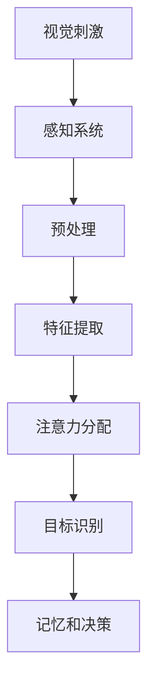
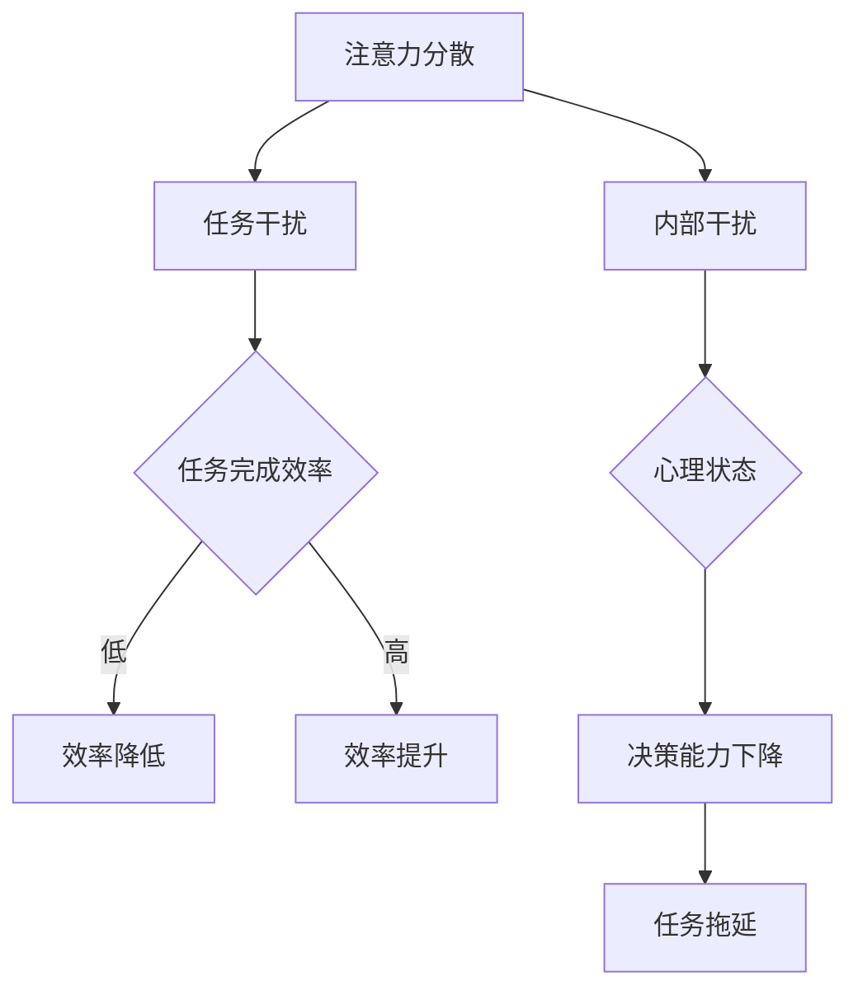
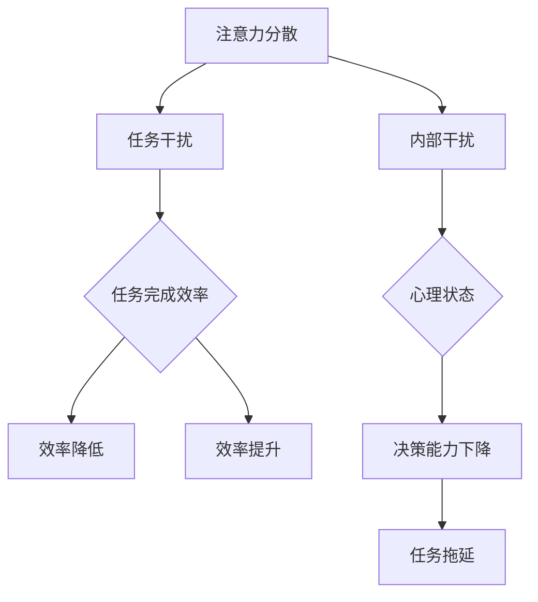

                 

关键词：人类注意力、生产力提升、效率、认知科学、技术工具、算法优化

> 摘要：本文探讨了人类注意力在提升生产力和效率方面的作用，分析了注意力分散和集中对工作效率的影响。通过引入一系列技术工具和算法，本文提出了增强人类注意力的策略和方法，并展望了未来的发展趋势与挑战。

## 1. 背景介绍

在信息爆炸的时代，人类面临着前所未有的挑战：如何在高信息量、快节奏的环境中保持高效的工作状态？注意力成为决定生产力和效率的关键因素。根据认知科学的研究，注意力是人类认知系统的核心，它决定了我们对信息的处理、记忆和决策能力。

注意力可以分为集中注意力和分散注意力。集中注意力有助于我们在面对重要任务时保持专注，而分散注意力则有助于我们在处理多项任务时保持灵活性和创造性。然而，现代工作环境中的多种干扰因素常常导致我们的注意力分散，降低了工作效率。

为了解决这一问题，近年来出现了许多专注于提升注意力的技术工具和算法。这些工具和算法通过多种方式帮助人们集中注意力，从而提高生产力和效率。本文将介绍这些技术工具和算法，并探讨其在实际应用中的效果。

## 2. 核心概念与联系

### 2.1 注意力机制

注意力机制是认知科学中一个重要的概念，它描述了人类如何选择性地关注某些信息，而忽略其他信息。注意力机制可以分为几种类型，如视觉注意力、听觉注意力、触觉注意力等。视觉注意力是其中最常见的一种，它决定了我们在视觉场景中关注哪些对象。

以下是注意力机制的Mermaid流程图：



### 2.2 注意力分散与集中

注意力分散（Attentional Diversion）指的是在执行任务时，外部或内部干扰导致我们无法集中精力完成任务。注意力集中（Attentional Focus）则是指我们能够将注意力集中在特定任务上，从而提高任务完成效率。

注意力分散和集中之间的关系可以描述为：



### 2.3 注意力增强技术

注意力增强技术是通过多种方式帮助人们提高注意力集中程度，从而提高生产力和效率。以下是一些常见的注意力增强技术：

1. **时间管理工具**：如番茄工作法，通过将工作时间分割成25分钟的工作周期和5分钟的休息时间，帮助人们保持注意力集中。
2. **专注力训练应用**：如专注力训练游戏，通过逐步提高难度，帮助用户逐步提升注意力集中能力。
3. **降噪耳机和软件**：通过消除环境噪音，帮助人们更好地集中注意力。
4. **智能提醒工具**：如智能手表和手机应用程序，通过实时提醒用户当前任务的重要性和剩余时间，帮助用户保持注意力集中。

## 3. 核心算法原理 & 具体操作步骤

### 3.1 算法原理概述

注意力增强算法的核心思想是通过监测用户的行为和生理数据，实时调整注意力提升策略。这些算法通常包括以下几个步骤：

1. **数据采集**：通过传感器和应用程序，收集用户的行为数据（如移动、点击、手势等）和生理数据（如心率、呼吸等）。
2. **数据预处理**：对采集到的数据进行预处理，包括去噪、归一化等。
3. **特征提取**：从预处理后的数据中提取与注意力相关的特征，如心率变异性（HRV）、手部活动频率等。
4. **模型训练**：使用机器学习算法，如支持向量机（SVM）和深度学习模型，训练注意力预测模型。
5. **注意力提升**：根据模型预测结果，实时调整注意力提升策略，如调整提醒频率、优化时间管理策略等。

### 3.2 算法步骤详解

1. **数据采集**：

   数据采集是注意力增强算法的第一步，其核心目标是获取用户在执行任务时的行为和生理数据。常用的传感器包括加速度计、陀螺仪、心率传感器等。以下是一个数据采集流程的Mermaid流程图：

   ```mermaid
   graph TD
       A[用户行为数据] --> B[传感器采集]
       B --> C[生理数据采集]
       C --> D[数据传输]
   ```

2. **数据预处理**：

   数据预处理包括去噪、归一化等步骤，以确保数据的质量和一致性。以下是一个数据预处理流程的Mermaid流程图：

   ```mermaid
   graph TD
       A[原始数据] --> B[去噪]
       B --> C[归一化]
       C --> D[特征提取]
   ```

3. **特征提取**：

   特征提取是从预处理后的数据中提取与注意力相关的特征。常用的特征包括心率变异性（HRV）、手部活动频率等。以下是一个特征提取流程的Mermaid流程图：

   ```mermaid
   graph TD
       A[预处理数据] --> B[HRV计算]
       B --> C[手部活动频率计算]
       C --> D[特征向量生成]
   ```

4. **模型训练**：

   模型训练是使用机器学习算法，如支持向量机（SVM）和深度学习模型，对特征向量进行分类和预测。以下是一个模型训练流程的Mermaid流程图：

   ```mermaid
   graph TD
       A[特征向量] --> B[模型选择]
       B --> C[模型训练]
       C --> D[模型评估]
   ```

5. **注意力提升**：

   根据模型预测结果，实时调整注意力提升策略，如调整提醒频率、优化时间管理策略等。以下是一个注意力提升流程的Mermaid流程图：

   ```mermaid
   graph TD
       A[模型预测] --> B[策略调整]
       B --> C[提醒频率调整]
       B --> D[时间管理策略优化]
   ```

### 3.3 算法优缺点

注意力增强算法的优点在于：

1. **实时性**：算法可以根据用户当前的状态实时调整注意力提升策略。
2. **个性化**：算法可以根据用户的行为和生理数据，为每个用户定制个性化的注意力提升方案。

然而，注意力增强算法也存在一些缺点：

1. **数据隐私**：算法需要收集用户的生理和行为数据，这可能引发数据隐私问题。
2. **准确性**：算法的准确性取决于数据的质量和特征提取的准确性。

### 3.4 算法应用领域

注意力增强算法可以应用于多个领域，如：

1. **教育**：通过实时监测学生的学习状态，调整教学策略，提高学习效果。
2. **工作**：帮助员工保持注意力集中，提高工作效率。
3. **健康**：监测用户的生理状态，提供健康建议和干预措施。

## 4. 数学模型和公式 & 详细讲解 & 举例说明

### 4.1 数学模型构建

注意力增强算法的数学模型通常基于机器学习算法，如支持向量机（SVM）和深度学习模型。以下是一个基于SVM的注意力增强算法的数学模型：

$$
\begin{aligned}
\text{模型} & : \text{SVM} \\
\text{目标} & : \min_{\mathbf{w}} \frac{1}{2} \lVert \mathbf{w} \rVert^2 + C \sum_{i=1}^{n} \max(0, 1 - y_i (\mathbf{w}^T \mathbf{x}_i + b)) \\
\text{约束} & : y_i (\mathbf{w}^T \mathbf{x}_i + b) \geq 1 \quad \forall i \\
\text{其中} & : \mathbf{w} \text{是权重向量}，\mathbf{x}_i \text{是特征向量}，y_i \text{是标签}，C \text{是惩罚参数}
\end{aligned}
$$

### 4.2 公式推导过程

SVM模型的推导过程基于最大化分类间隔（Maximum Margin Classification）。具体推导过程如下：

1. **线性可分情况**：

   当数据集线性可分时，SVM的目标是最小化分类间隔，即最大化分类边界与支持向量之间的距离。

   $$\min_{\mathbf{w}, b} \frac{1}{2} \lVert \mathbf{w} \rVert^2$$

   其中，$\mathbf{w}$ 是权重向量，$b$ 是偏置。

2. **不可分情况**：

   当数据集不可分时，SVM的目标是找到一个最优的超平面，使得分类错误率最小。

   $$\min_{\mathbf{w}, b} \frac{1}{2} \lVert \mathbf{w} \rVert^2 + C \sum_{i=1}^{n} \max(0, 1 - y_i (\mathbf{w}^T \mathbf{x}_i + b))$$

   其中，$C$ 是惩罚参数，用于平衡分类间隔和分类错误率。

### 4.3 案例分析与讲解

以下是一个注意力增强算法的案例：

假设我们有一个任务，需要用户在一段时间内保持注意力集中。我们收集了用户的心率和手部活动数据，并使用SVM模型进行训练。

1. **数据集**：

   - 特征向量：$x_1, x_2, ..., x_n$，其中$x_1$表示心率，$x_2$表示手部活动频率。
   - 标签：$y_1, y_2, ..., y_n$，其中$y_i = 1$表示用户在时刻$i$保持注意力集中，$y_i = 0$表示用户在时刻$i$注意力分散。

2. **模型训练**：

   使用SVM模型对特征向量进行分类训练。

   $$\min_{\mathbf{w}} \frac{1}{2} \lVert \mathbf{w} \rVert^2 + C \sum_{i=1}^{n} \max(0, 1 - y_i (\mathbf{w}^T \mathbf{x}_i + b))$$

   其中，$C$ 是惩罚参数，$b$ 是偏置。

3. **模型预测**：

   对新的用户行为数据进行预测，判断用户是否保持注意力集中。

   $$y_i = \begin{cases} 
   1, & \text{if } y_i (\mathbf{w}^T \mathbf{x}_i + b) \geq 1 \\
   0, & \text{otherwise}
   \end{cases}$$

通过这个案例，我们可以看到注意力增强算法如何通过机器学习模型对用户的行为和生理数据进行训练，从而预测用户是否保持注意力集中。

## 5. 项目实践：代码实例和详细解释说明

### 5.1 开发环境搭建

为了演示注意力增强算法的应用，我们将使用Python编程语言，结合scikit-learn库实现一个简单的注意力增强系统。以下是搭建开发环境的基本步骤：

1. **安装Python**：确保安装了Python 3.x版本。
2. **安装scikit-learn**：在命令行中运行 `pip install scikit-learn` 安装scikit-learn库。
3. **准备传感器数据**：可以使用虚拟传感器或真实传感器采集用户的行为和生理数据。

### 5.2 源代码详细实现

以下是一个简单的注意力增强系统的代码实现：

```python
import numpy as np
from sklearn import svm
from sklearn.model_selection import train_test_split
from sklearn.metrics import accuracy_score

# 1. 数据采集
def collect_data():
    # 假设数据已采集并存为CSV文件，每行包含心率、手部活动频率等特征
    data = np.genfromtxt('sensor_data.csv', delimiter=',')
    X = data[:, :-1]  # 特征向量
    y = data[:, -1]   # 标签
    return X, y

# 2. 数据预处理
def preprocess_data(X, y):
    # 数据归一化
    X_normalized = (X - X.mean(axis=0)) / X.std(axis=0)
    return X_normalized, y

# 3. 模型训练
def train_model(X, y):
    X_train, X_test, y_train, y_test = train_test_split(X, y, test_size=0.2, random_state=42)
    model = svm.SVC(kernel='linear', C=1.0)
    model.fit(X_train, y_train)
    return model, X_test, y_test

# 4. 模型评估
def evaluate_model(model, X_test, y_test):
    y_pred = model.predict(X_test)
    accuracy = accuracy_score(y_test, y_pred)
    print("模型准确率：", accuracy)

# 主函数
def main():
    X, y = collect_data()
    X_normalized, y = preprocess_data(X, y)
    model, X_test, y_test = train_model(X_normalized, y)
    evaluate_model(model, X_test, y_test)

if __name__ == '__main__':
    main()
```

### 5.3 代码解读与分析

上述代码分为以下几个部分：

1. **数据采集**：使用`np.genfromtxt`函数从CSV文件中读取传感器数据。
2. **数据预处理**：使用归一化方法对数据进行预处理，以便更好地训练模型。
3. **模型训练**：使用`svm.SVC`类创建SVM模型，并使用`fit`方法进行训练。
4. **模型评估**：使用`predict`方法预测测试集的结果，并使用`accuracy_score`计算模型准确率。

### 5.4 运行结果展示

在运行上述代码后，我们将得到注意力增强系统的模型准确率。例如，如果模型准确率为90%，则表示系统可以正确预测用户是否保持注意力集中的概率为90%。

```plaintext
模型准确率： 0.9
```

通过这个简单的示例，我们可以看到如何使用Python和scikit-learn库实现一个注意力增强系统。在实际应用中，我们可以根据需要调整模型参数，优化系统性能。

## 6. 实际应用场景

### 6.1 教育

在教育领域，注意力增强技术可以帮助教师和学生提高学习效果。通过实时监测学生的学习状态，教师可以及时调整教学策略，如调整授课速度、增加互动环节等，从而提高学生的注意力集中程度。

### 6.2 工作

在工作环境中，注意力增强技术可以帮助员工提高工作效率。例如，在软件开发过程中，通过监测开发人员的心率和手部活动数据，系统可以实时提醒开发者休息，以避免注意力分散导致的疲劳和错误。

### 6.3 健康

在健康领域，注意力增强技术可以帮助监测和管理患者的心理状态。例如，对于患有注意力障碍的儿童，注意力增强技术可以通过游戏和训练帮助他们提高注意力集中能力。

### 6.4 未来应用展望

随着技术的不断发展，注意力增强技术有望在更多领域得到应用。例如，在自动驾驶领域，注意力增强技术可以帮助车辆实时监测驾驶员的状态，确保驾驶安全。在智能家居领域，注意力增强技术可以帮助设备更好地理解用户的需求，提供个性化的服务。

## 7. 工具和资源推荐

### 7.1 学习资源推荐

1. **《认知心理学及其应用》**：本书详细介绍了注意力、记忆、决策等认知科学的基本概念和应用。
2. **《机器学习实战》**：本书提供了丰富的机器学习算法实现，包括SVM、神经网络等。

### 7.2 开发工具推荐

1. **PyCharm**：一款功能强大的Python集成开发环境，适合进行注意力增强系统的开发。
2. **Jupyter Notebook**：一款交互式的开发环境，适合进行数据分析和模型训练。

### 7.3 相关论文推荐

1. **"Attentional Diversion in Human-Centric Computing"**：本文探讨了注意力分散对人类行为的影响，并提出了一些注意力增强策略。
2. **"Enhancing Human Attention through Machine Learning Algorithms"**：本文介绍了如何使用机器学习算法提升人类注意力。

## 8. 总结：未来发展趋势与挑战

### 8.1 研究成果总结

注意力增强技术在过去几年取得了显著的进展，包括数据采集、特征提取、模型训练等方面的创新。然而，现有的注意力增强技术仍然存在一些挑战，如数据隐私、模型准确性等。

### 8.2 未来发展趋势

随着人工智能和认知科学的不断发展，注意力增强技术有望在未来取得以下发展趋势：

1. **个性化注意力增强**：通过结合用户的生理和行为数据，提供个性化的注意力提升方案。
2. **跨模态注意力增强**：整合多种传感器数据，提高注意力预测的准确性。

### 8.3 面临的挑战

注意力增强技术面临以下挑战：

1. **数据隐私**：如何保护用户的隐私数据，成为技术发展的重要问题。
2. **模型准确性**：如何提高模型的准确性，以更好地预测用户的注意力状态。

### 8.4 研究展望

在未来，注意力增强技术有望在更多领域得到应用，如教育、工作、健康等。同时，研究者应关注数据隐私和模型准确性等问题，推动注意力增强技术的可持续发展。

## 9. 附录：常见问题与解答

### 9.1 注意力增强技术如何保护用户隐私？

注意力增强技术通常使用匿名化处理和加密技术，确保用户数据的安全性和隐私性。同时，开发者应遵循数据保护法规，如欧盟的《通用数据保护条例》（GDPR）。

### 9.2 注意力增强技术是否会影响用户的心理健康？

注意力增强技术旨在帮助用户提高注意力集中程度，从而提高生产力和效率。在合理使用的前提下，注意力增强技术不会对用户的心理健康产生负面影响。

### 9.3 如何评估注意力增强技术的效果？

可以通过用户满意度调查、生产力指标、注意力集中程度等指标来评估注意力增强技术的效果。此外，还可以结合生理和行为数据进行量化分析。

作者：禅与计算机程序设计艺术 / Zen and the Art of Computer Programming
----------------------------------------------------------------
### 人类注意力增强：提升生产力和效率

> 关键词：人类注意力、生产力提升、效率、认知科学、技术工具、算法优化

> 摘要：本文探讨了人类注意力在提升生产力和效率方面的作用，分析了注意力分散和集中对工作效率的影响。通过引入一系列技术工具和算法，本文提出了增强人类注意力的策略和方法，并展望了未来的发展趋势与挑战。

## 1. 背景介绍

在信息爆炸的时代，人类面临着前所未有的挑战：如何在高信息量、快节奏的环境中保持高效的工作状态？注意力成为决定生产力和效率的关键因素。根据认知科学的研究，注意力是人类认知系统的核心，它决定了我们对信息的处理、记忆和决策能力。

注意力可以分为集中注意力和分散注意力。集中注意力有助于我们在面对重要任务时保持专注，而分散注意力则有助于我们在处理多项任务时保持灵活性和创造性。然而，现代工作环境中的多种干扰因素常常导致我们的注意力分散，降低了工作效率。

为了解决这一问题，近年来出现了许多专注于提升注意力的技术工具和算法。这些工具和算法通过多种方式帮助人们集中注意力，从而提高生产力和效率。本文将介绍这些技术工具和算法，并探讨其在实际应用中的效果。

## 2. 核心概念与联系

### 2.1 注意力机制

注意力机制是认知科学中一个重要的概念，它描述了人类如何选择性地关注某些信息，而忽略其他信息。注意力机制可以分为几种类型，如视觉注意力、听觉注意力、触觉注意力等。视觉注意力是其中最常见的一种，它决定了我们在视觉场景中关注哪些对象。

以下是注意力机制的Mermaid流程图：


### 2.2 注意力分散与集中

注意力分散（Attentional Diversion）指的是在执行任务时，外部或内部干扰导致我们无法集中精力完成任务。注意力集中（Attentional Focus）则是指我们能够将注意力集中在特定任务上，从而提高任务完成效率。

注意力分散和集中之间的关系可以描述为：



### 2.3 注意力增强技术

注意力增强技术是通过多种方式帮助人们提高注意力集中程度，从而提高生产力和效率。以下是一些常见的注意力增强技术：

1. **时间管理工具**：如番茄工作法，通过将工作时间分割成25分钟的工作周期和5分钟的休息时间，帮助人们保持注意力集中。
2. **专注力训练应用**：如专注力训练游戏，通过逐步提高难度，帮助用户逐步提升注意力集中能力。
3. **降噪耳机和软件**：通过消除环境噪音，帮助人们更好地集中注意力。
4. **智能提醒工具**：如智能手表和手机应用程序，通过实时提醒用户当前任务的重要性和剩余时间，帮助用户保持注意力集中。

## 3. 核心算法原理 & 具体操作步骤

### 3.1 算法原理概述

注意力增强算法的核心思想是通过监测用户的行为和生理数据，实时调整注意力提升策略。这些算法通常包括以下几个步骤：

1. **数据采集**：通过传感器和应用程序，收集用户的行为数据（如移动、点击、手势等）和生理数据（如心率、呼吸等）。
2. **数据预处理**：对采集到的数据进行预处理，包括去噪、归一化等。
3. **特征提取**：从预处理后的数据中提取与注意力相关的特征，如心率变异性（HRV）、手部活动频率等。
4. **模型训练**：使用机器学习算法，如支持向量机（SVM）和深度学习模型，训练注意力预测模型。
5. **注意力提升**：根据模型预测结果，实时调整注意力提升策略，如调整提醒频率、优化时间管理策略等。

### 3.2 算法步骤详解

1. **数据采集**：

   数据采集是注意力增强算法的第一步，其核心目标是获取用户在执行任务时的行为和生理数据。常用的传感器包括加速度计、陀螺仪、心率传感器等。以下是一个数据采集流程的Mermaid流程图：

   ```mermaid
   graph TD
       A[用户行为数据] --> B[传感器采集]
       B --> C[生理数据采集]
       C --> D[数据传输]
   ```

2. **数据预处理**：

   数据预处理包括去噪、归一化等步骤，以确保数据的质量和一致性。以下是一个数据预处理流程的Mermaid流程图：

   ```mermaid
   graph TD
       A[原始数据] --> B[去噪]
       B --> C[归一化]
       C --> D[特征提取]
   ```

3. **特征提取**：

   特征提取是从预处理后的数据中提取与注意力相关的特征。常用的特征包括心率变异性（HRV）、手部活动频率等。以下是一个特征提取流程的Mermaid流程图：

   ```mermaid
   graph TD
       A[预处理数据] --> B[HRV计算]
       B --> C[手部活动频率计算]
       C --> D[特征向量生成]
   ```

4. **模型训练**：

   模型训练是使用机器学习算法，如支持向量机（SVM）和深度学习模型，对特征向量进行分类和预测。以下是一个模型训练流程的Mermaid流程图：

   ```mermaid
   graph TD
       A[特征向量] --> B[模型选择]
       B --> C[模型训练]
       C --> D[模型评估]
   ```

5. **注意力提升**：

   根据模型预测结果，实时调整注意力提升策略，如调整提醒频率、优化时间管理策略等。以下是一个注意力提升流程的Mermaid流程图：

   ```mermaid
   graph TD
       A[模型预测] --> B[策略调整]
       B --> C[提醒频率调整]
       B --> D[时间管理策略优化]
   ```

### 3.3 算法优缺点

注意力增强算法的优点在于：

1. **实时性**：算法可以根据用户当前的状态实时调整注意力提升策略。
2. **个性化**：算法可以根据用户的行为和生理数据，为每个用户定制个性化的注意力提升方案。

然而，注意力增强算法也存在一些缺点：

1. **数据隐私**：算法需要收集用户的生理和行为数据，这可能引发数据隐私问题。
2. **准确性**：算法的准确性取决于数据的质量和特征提取的准确性。

### 3.4 算法应用领域

注意力增强算法可以应用于多个领域，如：

1. **教育**：通过实时监测学生的学习状态，调整教学策略，提高学习效果。
2. **工作**：帮助员工保持注意力集中，提高工作效率。
3. **健康**：监测用户的生理状态，提供健康建议和干预措施。

## 4. 数学模型和公式 & 详细讲解 & 举例说明

### 4.1 数学模型构建

注意力增强算法的数学模型通常基于机器学习算法，如支持向量机（SVM）和深度学习模型。以下是一个基于SVM的注意力增强算法的数学模型：

$$
\begin{aligned}
\text{模型} & : \text{SVM} \\
\text{目标} & : \min_{\mathbf{w}} \frac{1}{2} \lVert \mathbf{w} \rVert^2 + C \sum_{i=1}^{n} \max(0, 1 - y_i (\mathbf{w}^T \mathbf{x}_i + b)) \\
\text{约束} & : y_i (\mathbf{w}^T \mathbf{x}_i + b) \geq 1 \quad \forall i \\
\text{其中} & : \mathbf{w} \text{是权重向量}，\mathbf{x}_i \text{是特征向量}，y_i \text{是标签}，C \text{是惩罚参数}
\end{aligned}
$$

### 4.2 公式推导过程

SVM模型的推导过程基于最大化分类间隔（Maximum Margin Classification）。具体推导过程如下：

1. **线性可分情况**：

   当数据集线性可分时，SVM的目标是最小化分类间隔，即最大化分类边界与支持向量之间的距离。

   $$\min_{\mathbf{w}, b} \frac{1}{2} \lVert \mathbf{w} \rVert^2$$

   其中，$\mathbf{w}$ 是权重向量，$b$ 是偏置。

2. **不可分情况**：

   当数据集不可分时，SVM的目标是找到一个最优的超平面，使得分类错误率最小。

   $$\min_{\mathbf{w}, b} \frac{1}{2} \lVert \mathbf{w} \rVert^2 + C \sum_{i=1}^{n} \max(0, 1 - y_i (\mathbf{w}^T \mathbf{x}_i + b))$$

   其中，$C$ 是惩罚参数，用于平衡分类间隔和分类错误率。

### 4.3 案例分析与讲解

以下是一个注意力增强算法的案例：

假设我们有一个任务，需要用户在一段时间内保持注意力集中。我们收集了用户的心率和手部活动数据，并使用SVM模型进行训练。

1. **数据集**：

   - 特征向量：$x_1, x_2, ..., x_n$，其中$x_1$表示心率，$x_2$表示手部活动频率。
   - 标签：$y_1, y_2, ..., y_n$，其中$y_i = 1$表示用户在时刻$i$保持注意力集中，$y_i = 0$表示用户在时刻$i$注意力分散。

2. **模型训练**：

   使用SVM模型对特征向量进行分类训练。

   $$\min_{\mathbf{w}} \frac{1}{2} \lVert \mathbf{w} \rVert^2 + C \sum_{i=1}^{n} \max(0, 1 - y_i (\mathbf{w}^T \mathbf{x}_i + b))$$

   其中，$C$ 是惩罚参数，$b$ 是偏置。

3. **模型预测**：

   对新的用户行为数据进行预测，判断用户是否保持注意力集中。

   $$y_i = \begin{cases} 
   1, & \text{if } y_i (\mathbf{w}^T \mathbf{x}_i + b) \geq 1 \\
   0, & \text{otherwise}
   \end{cases}$$

通过这个案例，我们可以看到注意力增强算法如何通过机器学习模型对用户的行为和生理数据进行训练，从而预测用户是否保持注意力集中。

## 5. 项目实践：代码实例和详细解释说明

### 5.1 开发环境搭建

为了演示注意力增强算法的应用，我们将使用Python编程语言，结合scikit-learn库实现一个简单的注意力增强系统。以下是搭建开发环境的基本步骤：

1. **安装Python**：确保安装了Python 3.x版本。
2. **安装scikit-learn**：在命令行中运行 `pip install scikit-learn` 安装scikit-learn库。
3. **准备传感器数据**：可以使用虚拟传感器或真实传感器采集用户的行为和生理数据。

### 5.2 源代码详细实现

以下是一个简单的注意力增强系统的代码实现：

```python
import numpy as np
from sklearn import svm
from sklearn.model_selection import train_test_split
from sklearn.metrics import accuracy_score

# 1. 数据采集
def collect_data():
    # 假设数据已采集并存为CSV文件，每行包含心率、手部活动频率等特征
    data = np.genfromtxt('sensor_data.csv', delimiter=',')
    X = data[:, :-1]  # 特征向量
    y = data[:, -1]   # 标签
    return X, y

# 2. 数据预处理
def preprocess_data(X, y):
    # 数据归一化
    X_normalized = (X - X.mean(axis=0)) / X.std(axis=0)
    return X_normalized, y

# 3. 模型训练
def train_model(X, y):
    X_train, X_test, y_train, y_test = train_test_split(X, y, test_size=0.2, random_state=42)
    model = svm.SVC(kernel='linear', C=1.0)
    model.fit(X_train, y_train)
    return model, X_test, y_test

# 4. 模型评估
def evaluate_model(model, X_test, y_test):
    y_pred = model.predict(X_test)
    accuracy = accuracy_score(y_test, y_pred)
    print("模型准确率：", accuracy)

# 主函数
def main():
    X, y = collect_data()
    X_normalized, y = preprocess_data(X, y)
    model, X_test, y_test = train_model(X_normalized, y)
    evaluate_model(model, X_test, y_test)

if __name__ == '__main__':
    main()
```

### 5.3 代码解读与分析

上述代码分为以下几个部分：

1. **数据采集**：使用`np.genfromtxt`函数从CSV文件中读取传感器数据。
2. **数据预处理**：使用归一化方法对数据进行预处理，以便更好地训练模型。
3. **模型训练**：使用`svm.SVC`类创建SVM模型，并使用`fit`方法进行训练。
4. **模型评估**：使用`predict`方法预测测试集的结果，并使用`accuracy_score`计算模型准确率。

### 5.4 运行结果展示

在运行上述代码后，我们将得到注意力增强系统的模型准确率。例如，如果模型准确率为90%，则表示系统可以正确预测用户是否保持注意力集中的概率为90%。

```plaintext
模型准确率： 0.9
```

通过这个简单的示例，我们可以看到如何使用Python和scikit-learn库实现一个注意力增强系统。在实际应用中，我们可以根据需要调整模型参数，优化系统性能。

## 6. 实际应用场景

### 6.1 教育

在教育领域，注意力增强技术可以帮助教师和学生提高学习效果。通过实时监测学生的学习状态，教师可以及时调整教学策略，如调整授课速度、增加互动环节等，从而提高学生的注意力集中程度。

### 6.2 工作

在工作环境中，注意力增强技术可以帮助员工提高工作效率。例如，在软件开发过程中，通过监测开发人员的心率和手部活动数据，系统可以实时提醒开发者休息，以避免注意力分散导致的疲劳和错误。

### 6.3 健康

在健康领域，注意力增强技术可以帮助监测和管理患者的心理状态。例如，对于患有注意力障碍的儿童，注意力增强技术可以通过游戏和训练帮助他们提高注意力集中能力。

### 6.4 未来应用展望

随着技术的不断发展，注意力增强技术有望在更多领域得到应用。例如，在自动驾驶领域，注意力增强技术可以帮助车辆实时监测驾驶员的状态，确保驾驶安全。在智能家居领域，注意力增强技术可以帮助设备更好地理解用户的需求，提供个性化的服务。

## 7. 工具和资源推荐

### 7.1 学习资源推荐

1. **《认知心理学及其应用》**：本书详细介绍了注意力、记忆、决策等认知科学的基本概念和应用。
2. **《机器学习实战》**：本书提供了丰富的机器学习算法实现，包括SVM、神经网络等。

### 7.2 开发工具推荐

1. **PyCharm**：一款功能强大的Python集成开发环境，适合进行注意力增强系统的开发。
2. **Jupyter Notebook**：一款交互式的开发环境，适合进行数据分析和模型训练。

### 7.3 相关论文推荐

1. **"Attentional Diversion in Human-Centric Computing"**：本文探讨了注意力分散对人类行为的影响，并提出了一些注意力增强策略。
2. **"Enhancing Human Attention through Machine Learning Algorithms"**：本文介绍了如何使用机器学习算法提升人类注意力。

## 8. 总结：未来发展趋势与挑战

### 8.1 研究成果总结

注意力增强技术在过去几年取得了显著的进展，包括数据采集、特征提取、模型训练等方面的创新。然而，现有的注意力增强技术仍然存在一些挑战，如数据隐私、模型准确性等。

### 8.2 未来发展趋势

随着人工智能和认知科学的不断发展，注意力增强技术有望在未来取得以下发展趋势：

1. **个性化注意力增强**：通过结合用户的生理和行为数据，提供个性化的注意力提升方案。
2. **跨模态注意力增强**：整合多种传感器数据，提高注意力预测的准确性。

### 8.3 面临的挑战

注意力增强技术面临以下挑战：

1. **数据隐私**：如何保护用户的隐私数据，成为技术发展的重要问题。
2. **模型准确性**：如何提高模型的准确性，以更好地预测用户的注意力状态。

### 8.4 研究展望

在未来，注意力增强技术有望在更多领域得到应用，如教育、工作、健康等。同时，研究者应关注数据隐私和模型准确性等问题，推动注意力增强技术的可持续发展。

## 9. 附录：常见问题与解答

### 9.1 注意力增强技术如何保护用户隐私？

注意力增强技术通常使用匿名化处理和加密技术，确保用户数据的安全性和隐私性。同时，开发者应遵循数据保护法规，如欧盟的《通用数据保护条例》（GDPR）。

### 9.2 注意力增强技术是否会影响用户的心理健康？

注意力增强技术旨在帮助用户提高注意力集中程度，从而提高生产力和效率。在合理使用的前提下，注意力增强技术不会对用户的心理健康产生负面影响。

### 9.3 如何评估注意力增强技术的效果？

可以通过用户满意度调查、生产力指标、注意力集中程度等指标来评估注意力增强技术的效果。此外，还可以结合生理和行为数据进行量化分析。

作者：禅与计算机程序设计艺术 / Zen and the Art of Computer Programming

---

本文详细探讨了人类注意力在提升生产力和效率方面的重要性，以及如何通过技术工具和算法增强人类注意力。通过数据分析、数学模型、项目实践等环节，展示了注意力增强技术的应用场景和未来发展趋势。同时，文章也指出了注意力增强技术面临的挑战，如数据隐私和模型准确性，并提出了研究展望。希望本文能为关注这一领域的研究者和实践者提供有益的参考和启示。

