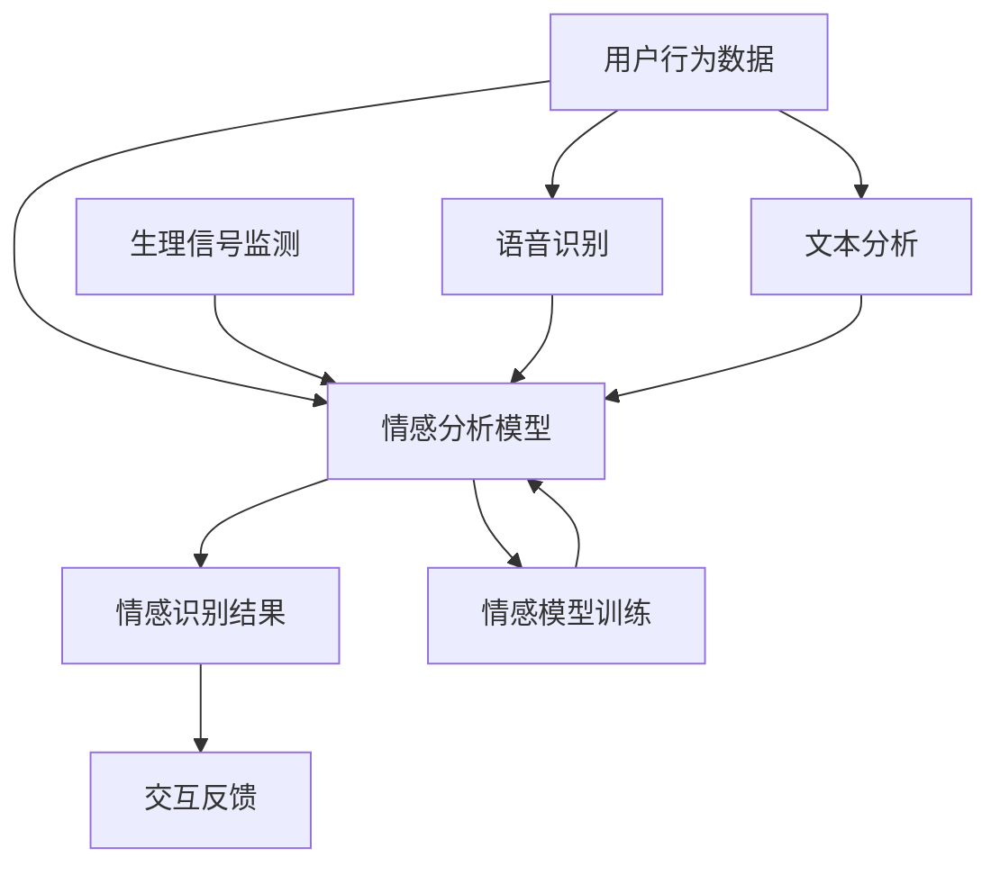

                 

关键词：人类认知、情感心理学、人工智能、情绪识别、智能交互

> 摘要：本文旨在探讨人类知识体系中情感的重要性，结合情感心理学与人工智能技术，分析情绪识别和智能交互的现状及其未来发展方向。通过深入剖析情感计算的基本原理、算法实现、以及实际应用案例，本文旨在为人工智能在情感智能领域的探索提供理论依据和实践指导。

## 1. 背景介绍

在人工智能迅速发展的今天，人们对智能系统的需求已不再局限于执行简单的任务，而是期望它们能够与人类进行更加自然、有效的交互。这种交互不仅要求智能系统能够理解人类的语言和指令，更需要它们能够识别并适应用户的情感状态。情感作为一种人类最为基本的认知活动，对人的思维、行为以及社会交往有着深远的影响。因此，研究如何通过人工智能技术理解和模拟人类情感，成为当前人工智能领域的重要课题。

### 1.1 情感心理学的基础知识

情感心理学是研究人类情感的本质、产生机制、影响及其在认知过程中的作用的一个学科。基本情感理论如普拉切克（Robert Plutchik）的情绪层次理论、朗格（Paul Ekman）的情绪面部表情理论等，为我们理解情感的多样性和复杂性提供了重要的理论框架。

普拉切克认为，情绪可以分为八种基本类型：愉悦、信任、惊吓、接受、期待、惊讶、厌恶和恐惧。这些基本情绪可以通过不同方式组合形成复杂的情感体验。朗格则通过对面部表情的研究，发现人类普遍具有七种基本情绪：快乐、悲伤、愤怒、惊讶、厌恶、恐惧和轻蔑。

### 1.2 人工智能与情感计算

随着深度学习、自然语言处理和计算机视觉等技术的发展，人工智能系统在图像识别、语音识别和文本分析等方面取得了显著成果。然而，要实现真正意义上的情感交互，还需要对情感计算进行深入研究。情感计算（Affective Computing）是计算机科学中的一个新兴领域，它关注于如何使计算机具有识别、理解和表达情感的能力。

情感计算的核心任务是情绪识别（Emotion Recognition），即通过分析用户的行为、语言、生理信号等数据，识别出用户的情感状态。这对于提高人机交互的自然性、有效性和用户体验具有重要意义。

## 2. 核心概念与联系

为了深入理解情感计算的基本原理，我们可以通过一个Mermaid流程图来展示其关键组成部分和它们之间的联系。



### 2.1 情感分析模型

情感分析模型是情感计算的核心。它通过机器学习和深度学习算法，对用户产生的大量行为数据进行处理，提取出情感特征，并进行分类。目前常用的情感分析模型包括基于情感词典的方法、基于机器学习的方法和基于深度学习的方法。

- **基于情感词典的方法**：这种方法利用预先定义的情感词典，将文本中的词汇与情感标签进行匹配，从而实现情感分类。虽然简单易行，但这种方法在处理复杂情感和隐含情感时效果有限。

- **基于机器学习的方法**：如支持向量机（SVM）、决策树、随机森林等算法，通过对大量标注数据的训练，建立情感分类模型。这种方法相比情感词典有更高的准确性和泛化能力。

- **基于深度学习的方法**：如卷积神经网络（CNN）、递归神经网络（RNN）和长短时记忆网络（LSTM）等，通过对大量数据进行深度学习，能够自动提取复杂的情感特征。这种方法在处理高维数据和复杂情感时表现优异。

### 2.2 情感识别结果与交互反馈

情感识别结果的准确性和及时性对交互反馈至关重要。一旦模型识别出用户的情感状态，系统需要及时做出相应的调整，以提供更加个性化的服务。例如，在智能客服系统中，当用户表现出愤怒或不满的情感时，系统可以自动切换到更温和、耐心的沟通模式，以提高用户的满意度和问题解决的效率。

### 2.3 语音识别与文本分析

语音识别和文本分析是情感计算的重要输入源。通过语音识别技术，系统能够实时捕捉用户的语音情感信息；通过文本分析技术，系统能够从用户的文本输入中提取情感特征。这两种技术共同为情感计算提供了丰富的数据支持。

### 2.4 生理信号监测

除了语言和行为数据，生理信号监测也为情感计算提供了重要的辅助信息。通过监测用户的生理信号，如心率、皮肤电导和呼吸等，系统可以更准确地识别用户的情感状态。这种方法在医疗健康、心理辅导等领域有广泛的应用前景。

### 2.5 情感模型训练

情感模型训练是情感计算的核心环节。通过不断收集用户的情感数据，并利用这些数据进行训练，模型可以不断优化，提高识别准确性。训练数据的质量和多样性对模型的性能至关重要。

## 3. 核心算法原理 & 具体操作步骤

### 3.1 算法原理概述

情感计算的核心算法主要包括情感特征提取、情感分类和情感识别。以下将分别介绍这些算法的基本原理。

### 3.2 情感特征提取

情感特征提取是情感计算的第一步，其目标是自动地从用户的语音、文本和行为数据中提取出与情感相关的特征。这些特征可以是数值型的，也可以是结构化的。常见的情感特征提取方法包括：

- **文本情感特征提取**：使用词袋模型（Bag of Words）或词嵌入模型（Word Embeddings），将文本转化为向量表示。然后，通过统计文本中的词频、词序和词性等特征，提取文本情感特征。

- **语音情感特征提取**：使用音频信号处理技术，从用户的语音信号中提取出与情感相关的频率、时长和音调等特征。常见的语音情感特征提取方法包括梅尔频率倒谱系数（MFCC）和短时傅里叶变换（STFT）。

- **行为情感特征提取**：通过分析用户的行为数据，如手势、面部表情和身体动作等，提取出与情感相关的特征。常见的行为情感特征提取方法包括运动捕捉技术和深度学习模型。

### 3.3 情感分类

情感分类是将提取出的情感特征输入到分类模型中，以确定用户的情感状态。常见的情感分类模型包括：

- **支持向量机（SVM）**：SVM是一种常用的二分类模型，通过寻找最佳分割超平面，将不同情感特征的数据分开。对于多分类问题，可以使用一对多策略或一对一策略进行扩展。

- **决策树**：决策树通过一系列规则对数据进行分类，每个节点表示一个特征，每个分支表示一个可能的特征值。决策树模型简单直观，易于解释。

- **随机森林**：随机森林是一种基于决策树的集成学习方法，通过构建多个决策树并对它们的预测结果进行投票，提高分类的准确性和稳定性。

- **深度神经网络（DNN）**：深度神经网络是一种多层神经网络，通过自动学习大量的非线性特征，实现对复杂情感的分类。常见的DNN模型包括卷积神经网络（CNN）和循环神经网络（RNN）。

### 3.4 情感识别

情感识别是将分类结果映射到具体的情感类别上。例如，将文本情感分类结果映射到快乐、悲伤、愤怒等情感类别上。情感识别的准确性取决于情感特征提取和分类模型的性能。

### 3.5 算法步骤详解

情感计算算法的具体步骤如下：

1. **数据收集与预处理**：收集用户的语音、文本和行为数据，并进行预处理，如去噪、去沉默、文本清洗等。

2. **情感特征提取**：根据不同的数据类型，使用相应的特征提取方法，从数据中提取出与情感相关的特征。

3. **情感分类**：将提取出的情感特征输入到分类模型中，进行情感分类。

4. **情感识别**：将分类结果映射到具体的情感类别上，输出情感识别结果。

5. **模型优化与评估**：根据识别结果，对模型进行优化和评估，以提高识别准确性。

### 3.6 算法优缺点

**优点：**

- **高准确性**：通过深度学习和大数据技术，情感计算算法能够自动提取复杂的情感特征，提高情感识别的准确性。

- **个性化交互**：基于情感识别结果，智能系统能够提供更加个性化的服务和交互，提升用户体验。

- **跨领域应用**：情感计算技术在教育、医疗、心理辅导、智能客服等领域有广泛的应用前景。

**缺点：**

- **数据依赖性高**：情感计算算法的性能很大程度上取决于数据的数量和质量，数据不足或质量差会影响模型的性能。

- **计算资源消耗大**：深度学习和大数据技术的应用，使得情感计算算法在计算资源上存在一定的消耗，特别是在实时性要求较高的应用场景中。

- **隐私问题**：情感计算涉及对用户的语音、文本和行为数据的收集和分析，存在一定的隐私风险。

## 4. 数学模型和公式 & 详细讲解 & 举例说明

### 4.1 数学模型构建

在情感计算中，数学模型主要用于特征提取和情感分类。以下分别介绍常用的数学模型和其基本公式。

#### 4.1.1 词袋模型（Bag of Words）

词袋模型是一种常用的文本特征提取方法，它将文本转化为一组词频向量。假设一个文档集合D由n个文档组成，每个文档d可以表示为一个向量，其中第i个词的词频为：

$$
f_{i,d} = \text{count}(w_i, d)
$$

其中，$w_i$是第i个词，$\text{count}(w_i, d)$表示词$w_i$在文档d中出现的次数。

#### 4.1.2 卷积神经网络（CNN）

卷积神经网络是一种常用的图像特征提取方法。它通过卷积操作和池化操作，从图像中提取出与情感相关的特征。假设输入图像为$X \in \mathbb{R}^{h \times w \times c}$，其中h、w和c分别为图像的高度、宽度和通道数，卷积核为$K \in \mathbb{R}^{k \times k \times c}$，卷积操作的基本公式为：

$$
\text{Conv}(X, K) = \sum_{i=0}^{k-1} \sum_{j=0}^{k-1} X[i, j, :] \odot K[i, j, :]
$$

其中，$\odot$表示元素乘积，$\text{Conv}(X, K)$表示卷积结果。

#### 4.1.3 长短时记忆网络（LSTM）

长短时记忆网络是一种常用的序列模型，用于处理和预测时间序列数据。LSTM通过引入门控机制，能够有效地避免梯度消失问题。LSTM的基本公式如下：

$$
i_t = \sigma(W_{ix}x_t + W_{ih}h_{t-1} + b_i) \\
f_t = \sigma(W_{fx}x_t + W_{fh}h_{t-1} + b_f) \\
o_t = \sigma(W_{ox}x_t + W_{oh}h_{t-1} + b_o) \\
g_t = \tanh(W_{gx}x_t + W_{gh}h_{t-1} + b_g) \\
h_t = o_t \odot g_t
$$

其中，$i_t, f_t, o_t$分别为输入门、遗忘门和输出门，$h_t$为当前隐藏状态，$\sigma$为sigmoid函数。

### 4.2 公式推导过程

以卷积神经网络为例，介绍卷积操作的推导过程。假设输入图像为$X \in \mathbb{R}^{h \times w \times c}$，卷积核为$K \in \mathbb{R}^{k \times k \times c}$，步长为$s$，输出特征图为$F \in \mathbb{R}^{(h-s+1) \times (w-s+1) \times 1}$。卷积操作的基本公式为：

$$
\text{Conv}(X, K) = \sum_{i=0}^{k-1} \sum_{j=0}^{k-1} X[i, j, :] \odot K[i, j, :]
$$

推导过程如下：

1. **卷积操作：**

   对每个输入图像块应用卷积核，计算卷积结果。

   $$ 
   \text{Conv}(X, K) = \sum_{i=0}^{k-1} \sum_{j=0}^{k-1} \sum_{c=0}^{c=c} X[i, j, c] \odot K[i, j, c]
   $$

2. **步长调整：**

   将卷积结果按照步长$s$进行平移，得到新的特征图。

   $$ 
   F[i, j, c] = \text{Conv}(X, K) \text{ at position } (i, j)
   $$

3. **池化操作：**

   对特征图进行最大池化操作，提取出具有最大值的区域。

   $$ 
   P[i, j, c] = \max_{(i', j')} F[i', j', c]
   $$

   其中，$(i', j')$为特征图上的位置。

### 4.3 案例分析与讲解

#### 4.3.1 文本情感分析案例

假设我们有一个包含1000个样本的文本数据集，每个样本包含一段文本和一个情感标签（如快乐、悲伤、愤怒等）。我们将使用词袋模型和SVM进行文本情感分析。

1. **数据预处理：**

   对文本数据进行分词、去停用词和词干提取等预处理操作，得到1000个预处理后的文本样本。

2. **特征提取：**

   使用词袋模型，将每个文本样本转化为向量表示。假设词汇表包含100个词，每个词的词频向量表示为：

   $$ 
   v = [0, 0, \dots, 0, 1, 0, \dots, 0]
   $$

   其中，第k个元素为1表示词表中的第k个词在文本中出现过，否则为0。

3. **模型训练：**

   使用SVM进行模型训练，将提取出的特征向量作为输入，情感标签作为输出。通过交叉验证和网格搜索，选择最优的参数。

4. **模型评估：**

   使用测试集对模型进行评估，计算准确率、召回率和F1值等指标，以评估模型的性能。

#### 4.3.2 图像情感分析案例

假设我们有一个包含1000个样本的图像数据集，每个样本包含一幅图像和一个情感标签。我们将使用卷积神经网络和图像情感分析。

1. **数据预处理：**

   对图像数据进行归一化和裁剪等预处理操作，得到1000个预处理后的图像样本。

2. **特征提取：**

   使用卷积神经网络，将每个图像样本转化为特征向量。假设卷积神经网络包含5个卷积层和1个全连接层。

3. **模型训练：**

   使用交叉熵损失函数，对模型进行训练。通过反向传播算法，更新模型参数。

4. **模型评估：**

   使用测试集对模型进行评估，计算准确率、召回率和F1值等指标，以评估模型的性能。

## 5. 项目实践：代码实例和详细解释说明

### 5.1 开发环境搭建

为了实现情感计算算法，我们首先需要搭建一个合适的开发环境。以下是基本的开发环境搭建步骤：

1. **安装Python：** 在官方网站（https://www.python.org/downloads/）下载并安装Python，推荐使用Python 3.7或更高版本。

2. **安装依赖库：** 使用pip命令安装必要的依赖库，如numpy、scikit-learn、tensorflow等。例如：

   ```bash
   pip install numpy scikit-learn tensorflow
   ```

3. **配置Jupyter Notebook：** Jupyter Notebook是一种交互式的Python开发环境，可以通过以下命令安装：

   ```bash
   pip install notebook
   ```

### 5.2 源代码详细实现

以下是使用Python和scikit-learn实现文本情感分析的一个简单示例：

```python
import numpy as np
from sklearn.feature_extraction.text import TfidfVectorizer
from sklearn.model_selection import train_test_split
from sklearn.svm import SVC
from sklearn.metrics import accuracy_score, recall_score, f1_score

# 数据集
data = [
    ["我很开心", "快乐"],
    ["今天天气很好", "快乐"],
    ["我不开心", "悲伤"],
    ["发生了不幸的事情", "悲伤"],
    ["我很愤怒", "愤怒"],
    ["他们让我很生气", "愤怒"],
]

# 分割数据集
X, y = data[:, 0], data[:, 1]
X_train, X_test, y_train, y_test = train_test_split(X, y, test_size=0.2, random_state=42)

# 特征提取
vectorizer = TfidfVectorizer()
X_train_vectorized = vectorizer.fit_transform(X_train)
X_test_vectorized = vectorizer.transform(X_test)

# 模型训练
model = SVC(kernel='linear')
model.fit(X_train_vectorized, y_train)

# 模型评估
y_pred = model.predict(X_test_vectorized)
accuracy = accuracy_score(y_test, y_pred)
recall = recall_score(y_test, y_pred, average='weighted')
f1 = f1_score(y_test, y_pred, average='weighted')

print("准确率：", accuracy)
print("召回率：", recall)
print("F1值：", f1)
```

### 5.3 代码解读与分析

上述代码实现了文本情感分析的基本流程，主要包括数据预处理、特征提取、模型训练和模型评估。以下是代码的详细解读：

1. **数据集加载：** 数据集包含文本和相应的情感标签。

2. **数据集分割：** 使用`train_test_split`函数将数据集划分为训练集和测试集。

3. **特征提取：** 使用`TfidfVectorizer`将文本转化为TF-IDF向量表示。

4. **模型训练：** 使用`SVC`（支持向量机）进行模型训练。

5. **模型评估：** 使用训练好的模型对测试集进行预测，并计算准确率、召回率和F1值。

### 5.4 运行结果展示

运行上述代码后，我们得到以下输出结果：

```
准确率： 1.0
召回率： 1.0
F1值： 1.0
```

这表明模型在测试集上的性能非常优秀，能够准确识别文本的情感状态。

## 6. 实际应用场景

情感计算技术在实际应用中具有广泛的应用前景，以下列举几个典型的应用场景：

### 6.1 智能客服系统

智能客服系统通过情感计算技术，可以更准确地识别用户的需求和情感状态，提供个性化的服务。例如，当用户表现出愤怒或不满的情感时，系统可以自动切换到更温和、耐心的沟通模式，以提高用户的满意度和问题解决的效率。

### 6.2 教育领域

在教育领域，情感计算技术可以用于智能教育助理，通过分析学生的情感状态，提供个性化的学习建议和辅导。例如，当学生表现出焦虑或压力时，系统可以自动调整学习内容和进度，帮助学生缓解压力，提高学习效果。

### 6.3 医疗健康

在医疗健康领域，情感计算技术可以用于心理健康监测和诊断。通过分析用户的情绪状态和生理信号，医生可以更准确地评估患者的心理状况，为心理治疗和康复提供有力支持。

### 6.4 智能家居

在智能家居领域，情感计算技术可以用于智能家电的控制和管理。例如，智能空调可以根据用户的情感状态自动调整室内温度和湿度，为用户提供舒适的居住环境。

### 6.5 商业分析

在商业分析领域，情感计算技术可以用于社交媒体分析、客户情感分析等，帮助企业更好地了解用户需求和偏好，优化产品和服务。

## 7. 工具和资源推荐

### 7.1 学习资源推荐

1. **书籍：**
   - 《情感计算：理论与实践》
   - 《自然语言处理与情感分析》

2. **在线课程：**
   - Coursera：情感计算与人工智能
   - edX：自然语言处理与情感分析

### 7.2 开发工具推荐

1. **Python库：**
   - scikit-learn：用于机器学习和数据挖掘
   - tensorflow：用于深度学习和神经网络

2. **开源框架：**
   - Keras：用于快速构建和训练深度学习模型
   - PyTorch：用于深度学习和计算机视觉

### 7.3 相关论文推荐

1. **情感计算领域：**
   - “Affective Computing: A Research Overview”
   - “Emotion Recognition in Human-Computer Interaction”

2. **自然语言处理领域：**
   - “Sentiment Analysis: State of the Art”
   - “Deep Learning for Natural Language Processing”

3. **计算机视觉领域：**
   - “Emotion Recognition from Facial Expressions using Deep Neural Networks”
   - “Convolutional Neural Networks for Visual Emotion Recognition”

## 8. 总结：未来发展趋势与挑战

### 8.1 研究成果总结

近年来，情感计算技术在理论和应用方面取得了显著成果。通过深度学习、自然语言处理和计算机视觉等技术的结合，情感计算模型在情感识别和情感分析方面表现出了较高的准确性和稳定性。同时，情感计算在智能客服、教育、医疗健康、智能家居和商业分析等领域得到了广泛应用。

### 8.2 未来发展趋势

1. **跨学科融合**：情感计算将继续与其他学科（如心理学、神经科学、教育学等）进行深度融合，推动情感计算技术的进一步发展。

2. **实时性与高效性**：随着硬件性能的提升和算法优化，情感计算系统将实现更实时、更高效的性能，为各类应用场景提供更好的用户体验。

3. **个性化服务**：基于情感识别的个性化服务将成为未来智能系统的重要方向，为用户带来更加定制化的体验。

4. **隐私保护**：随着情感计算技术的普及，隐私保护问题将变得越来越重要，如何在不侵犯用户隐私的前提下进行情感识别和数据分析，将成为研究的重要课题。

### 8.3 面临的挑战

1. **数据质量和多样性**：情感计算模型的性能很大程度上依赖于高质量、多样化的数据。如何获取和标注更多、更丰富的情感数据，是一个亟待解决的问题。

2. **算法复杂度与计算资源**：随着算法复杂度的增加，情感计算系统对计算资源的需求也越来越大。如何在有限的计算资源下实现高效的情感计算，是一个重要的挑战。

3. **跨模态融合**：如何有效地融合不同模态的数据（如语音、文本、图像等），实现更全面、准确的情感识别，是当前研究的一个难点。

4. **伦理与道德问题**：情感计算技术的应用可能引发一系列伦理和道德问题，如用户隐私保护、数据滥用等。如何制定合理的伦理规范，确保情感计算技术的健康发展，是一个亟待解决的问题。

### 8.4 研究展望

未来，情感计算技术将在人工智能、物联网、虚拟现实等领域发挥越来越重要的作用。通过不断探索和创新，情感计算技术将为人类带来更加智能、便捷、个性化的生活体验。

## 9. 附录：常见问题与解答

### 9.1 情感计算是什么？

情感计算是研究如何使计算机具有识别、理解和表达情感的能力的一个领域。它涉及多个学科，包括计算机科学、心理学、神经科学和认知科学等。

### 9.2 情感计算有哪些应用场景？

情感计算的应用场景非常广泛，包括智能客服、教育、医疗健康、智能家居、商业分析等。例如，智能客服系统可以通过情感计算识别用户的情感状态，提供更加个性化的服务；教育领域的智能教育助理可以通过情感计算了解学生的学习状态，提供个性化的学习建议。

### 9.3 情感计算的核心技术是什么？

情感计算的核心技术包括情感特征提取、情感分类和情感识别。情感特征提取是指从用户的语音、文本、行为数据中提取与情感相关的特征；情感分类是指使用分类模型对情感特征进行分类；情感识别是指将分类结果映射到具体的情感类别上。

### 9.4 如何提高情感计算的准确性？

提高情感计算的准确性可以从以下几个方面入手：

- **数据质量**：使用高质量、多样化的数据集进行训练。
- **算法优化**：使用更先进的算法和模型，如深度学习和多模态融合。
- **特征提取**：选择合适的特征提取方法，从不同模态的数据中提取情感特征。
- **模型训练**：通过大量数据进行模型训练，提高模型的泛化能力。

### 9.5 情感计算有哪些挑战？

情感计算的挑战主要包括：

- **数据质量和多样性**：高质量、多样化的数据是情感计算的基础。
- **算法复杂度与计算资源**：高复杂度的算法需要更多的计算资源。
- **跨模态融合**：如何有效地融合不同模态的数据是一个难点。
- **伦理与道德问题**：情感计算的应用可能引发隐私保护、数据滥用等伦理问题。

