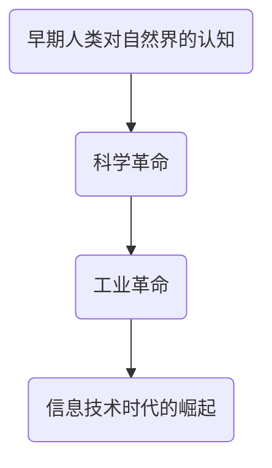
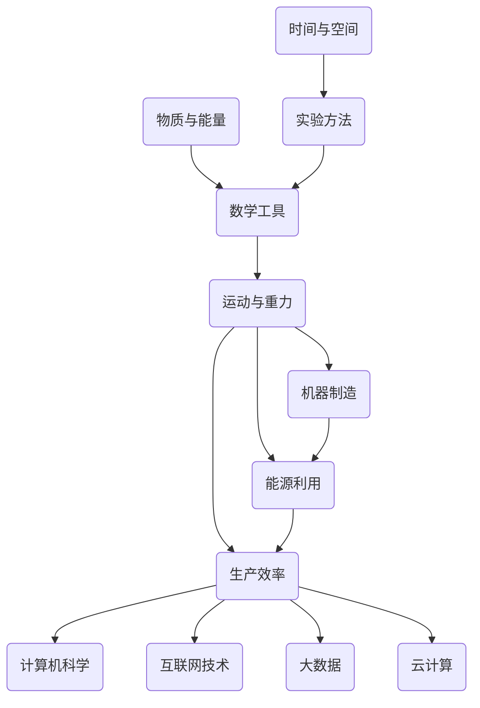

                 

关键词：人类知识史、理解和创新、知识架构、算法原理、数学模型、应用实践、未来展望

> 摘要：本文将深入探讨人类知识史的发展过程，从早期人类对自然界的探索到现代科技的发展，分析各个阶段的核心概念和知识架构。通过回顾历史中的关键人物和事件，阐述他们在理解和创新中的重要作用，以及这些知识对现代IT领域的影响。本文旨在提供一个全面且具有启发性的视角，帮助读者更好地理解人类知识的发展历程，并激发他们对于未来创新的思考。

## 1. 背景介绍

人类的知识史是一部漫长而充满挑战的旅程。从最早期的洞穴壁画到现代的量子计算，人类一直在不断探索、理解和创新。知识的发展不仅仅是个人智慧的积累，更是整个社会进步的基石。在信息技术迅速发展的今天，了解人类知识史对于我们理解现有技术和展望未来具有重要意义。

本文将首先回顾人类知识史的主要阶段，包括早期人类对自然界的认知、科学革命、工业革命以及信息技术时代的崛起。接着，我们将深入探讨每个阶段的核心概念和知识架构，分析这些知识在IT领域的应用和影响。最后，本文将展望未来的发展趋势，探讨人类在理解和创新过程中面临的挑战和机遇。

### 早期人类对自然界的认知

在人类历史的早期阶段，对自然界的认知主要依靠直接的观察和经验。原始人类通过观察日升日落、季节变化等现象，逐渐形成了对时间和天气的基本认识。此外，他们还通过实践学会使用工具，如石器和火，这些工具的发明和使用极大地提升了人类的生产力和生存能力。

在这个阶段，知识主要通过口头传承，没有文字记录。因此，知识的积累和传播速度较慢，但人类对自然界的基本认知得到了逐步的完善。这些早期的认知为后来的科学和哲学奠定了基础。

### 科学革命

随着人类文明的进步，科学革命成为了知识史上的一个重要转折点。在16世纪和17世纪，伽利略、牛顿等科学家的发现，极大地改变了人类对自然界的认识。他们通过实验和观察，提出了新的科学理论和定律，使科学从宗教和哲学中独立出来，成为一门独立的学科。

科学革命的核心在于实验方法和数学工具的应用。伽利略通过望远镜观察天体，提出了关于运动和重力的理论；牛顿则通过万有引力定律，将天体运动与地面上的物体运动联系起来，建立了经典力学的基础。这些科学发现不仅推动了科学的发展，也为工业革命奠定了理论基础。

### 工业革命

工业革命是18世纪末至19世纪初发生在英国的一场重大社会变革，它以机器制造和生产方式的革新为特征，极大地提升了生产效率，推动了经济的快速发展。工业革命的核心在于蒸汽机和纺织机械的应用，这些机械的发明极大地改变了人类的生产方式和生活习惯。

工业革命期间，大量的技术发明和创新涌现，如蒸汽机车、电报和电话等。这些技术不仅改变了人类的生产方式，也改变了人类的社交和通讯方式。工业革命期间的知识积累为现代科技的发展提供了丰富的资源和经验。

### 信息技术时代的崛起

20世纪末，信息技术的崛起标志着人类知识史进入了一个新的阶段。计算机和互联网的发明和应用，使得人类对信息的处理、存储和传输能力达到了前所未有的水平。信息技术不仅改变了人类的通讯和娱乐方式，也深刻影响了人类的工作和生活。

在信息技术时代，数据成为了新的生产要素，大数据、云计算、人工智能等新技术层出不穷。这些技术不仅推动了经济的发展，也为社会带来了巨大的变革。信息技术时代的知识积累为现代IT领域的发展提供了强大的动力。

## 2. 核心概念与联系

在人类知识史的各个阶段，核心概念和知识架构的建立和发展起到了至关重要的作用。这些核心概念不仅推动了科学和技术的进步，也为现代社会的发展提供了理论基础。

为了更好地理解这些核心概念，我们使用Mermaid流程图来展示它们之间的联系。以下是一个简单的Mermaid流程图示例：



在这个流程图中，A代表早期人类对自然界的认知，B代表科学革命，C代表工业革命，D代表信息技术时代的崛起。这些阶段之间存在着明确的继承和发展关系。

### 早期人类对自然界的认知

早期人类对自然界的认知主要集中在观察和经验的基础上。他们通过观察自然现象，如日升日落、季节变化等，形成了对时间和天气的基本认识。此外，他们还通过实践学会使用工具，如石器和火，这些工具的发明和使用极大地提升了人类的生产力和生存能力。

在这个阶段，核心概念包括时间和空间、物质和能量等。这些概念为后来的科学和哲学奠定了基础。

### 科学革命

科学革命的核心在于实验方法和数学工具的应用。伽利略通过望远镜观察天体，提出了关于运动和重力的理论；牛顿则通过万有引力定律，将天体运动与地面上的物体运动联系起来，建立了经典力学的基础。这些科学发现不仅推动了科学的发展，也为工业革命奠定了理论基础。

在这个阶段，核心概念包括实验方法、数学工具、运动和重力等。这些概念使得人类对自然界的理解达到了新的高度。

### 工业革命

工业革命的核心在于机器制造和生产方式的革新。蒸汽机和纺织机械的应用极大地提升了生产效率，推动了经济的快速发展。在这个阶段，核心概念包括机器、能源、生产效率等。这些概念改变了人类的生产方式和生活习惯。

### 信息技术时代的崛起

信息技术时代的崛起标志着人类对信息处理、存储和传输能力的极大提升。计算机和互联网的发明和应用，使得人类对信息的处理、存储和传输能力达到了前所未有的水平。在这个阶段，核心概念包括计算机、互联网、大数据、云计算等。这些概念不仅改变了人类的通讯和娱乐方式，也深刻影响了人类的工作和生活。

### Mermaid 流程图

以下是详细的Mermaid流程图，展示了各个核心概念之间的联系：



在这个流程图中，A1和A2代表早期人类对自然界的认知中的核心概念；B1、B2和B3代表科学革命中的核心概念；C1、C2和C3代表工业革命中的核心概念；D1、D2、D3和D4代表信息技术时代的核心概念。这些概念之间存在着明显的继承和发展关系，共同构成了人类知识史的核心框架。

## 3. 核心算法原理 & 具体操作步骤

在了解人类知识史的基础上，我们接下来将深入探讨一些核心算法的原理及其具体操作步骤。这些算法不仅在科学和工业领域有着广泛的应用，也在现代信息技术中扮演着重要的角色。

### 3.1 算法原理概述

算法是解决问题的一系列规则和步骤。在计算机科学中，算法被用于解决各种复杂的问题，如排序、查找、优化等。以下是几个关键算法的原理概述：

#### 排序算法

排序算法是一种用于对数据进行排序的算法。常见的排序算法包括冒泡排序、选择排序、插入排序等。这些算法通过比较和交换数据元素的位置，实现对数据的排序。

#### 查找算法

查找算法用于在数据集合中查找特定元素。常见的查找算法包括线性查找和二分查找。线性查找通过逐个比较元素与目标值，而二分查找则利用有序数据集合的特性，通过中间值比较快速定位目标元素。

#### 优化算法

优化算法用于在给定约束条件下，找到最优解。常见的优化算法包括贪心算法、动态规划、遗传算法等。这些算法通过不同的策略和搜索方法，找到问题的最优解或近似解。

### 3.2 算法步骤详解

以下是对上述几个关键算法的具体操作步骤的详细解释：

#### 冒泡排序

冒泡排序是一种简单的排序算法。它通过重复遍历要排序的数列，一次比较两个元素，如果它们的顺序错误就把它们交换过来。遍历数列的工作是重复进行直到没有再需要交换，也就是说该数列已经排序完成。

具体步骤如下：

1. 从第一个元素开始，相邻元素两两比较，如果第一个比第二个大（升序排序），则交换它们的位置。
2. 对整个数组进行一次遍历后，最大的元素会被“冒泡”至数组的末尾。
3. 重复以上步骤，但每次遍历的数组长度减1，因为已排序好的元素不再需要比较。
4. 当没有需要交换的元素时，排序完成。

#### 二分查找

二分查找是一种高效的查找算法，适用于有序数组。它通过将数组分成两半，比较中间元素和目标值的大小关系，逐步缩小查找范围。

具体步骤如下：

1. 确定数组的中间索引。
2. 比较中间元素的值与目标值：
   - 如果中间元素值等于目标值，则查找成功。
   - 如果中间元素值大于目标值，则在左半部分继续查找。
   - 如果中间元素值小于目标值，则在右半部分继续查找。
3. 重复步骤1和2，直到找到目标值或确定目标值不存在于数组中。

#### 贪心算法

贪心算法是一种在每一步选择上采取当前最优解的策略，以期望得到最终最优解的算法。它通过逐步选择局部最优解，最终得到全局最优解。

具体步骤如下：

1. 初始化一个解集合，用于存储已选择的元素。
2. 在每次选择时，从当前集合中选择一个最优的元素加入到解集合中。
3. 重复步骤2，直到问题得到解决。

### 3.3 算法优缺点

每种算法都有其优缺点，适用于不同的场景：

#### 冒泡排序

- **优点**：实现简单，易于理解。
- **缺点**：时间复杂度为O(n^2)，不适合大数据量排序。

#### 二分查找

- **优点**：时间复杂度为O(log n)，非常高效。
- **缺点**：需要预先对数据进行排序，不适用于动态数据。

#### 贪心算法

- **优点**：简单高效，适合解决某些特定问题。
- **缺点**：可能无法保证得到全局最优解，适用于局部最优解即全局最优解的问题。

### 3.4 算法应用领域

这些算法在IT领域有着广泛的应用：

- **排序算法**：在数据库管理和Web开发中用于数据排序。
- **查找算法**：在搜索引擎和文件系统中用于快速查找。
- **优化算法**：在路由规划、资源分配和机器学习中用于求解问题。

### 3.5 实际应用案例

以下是一个实际应用案例，展示了如何使用排序算法解决问题：

#### 应用案例：学生成绩排序

假设有一组学生的成绩数据，需要按照成绩从高到低排序。我们可以使用冒泡排序算法来实现这个任务。

1. **初始化数据**：假设有5个学生的成绩如下：[85, 92, 78, 90, 88]。

2. **第一次遍历**：
   - 比较（85, 92），不需要交换。
   - 比较（92, 78），交换位置：[85, 78, 92, 90, 88]。
   - 比较（92, 90），不需要交换。
   - 比较（92, 88），不需要交换。

3. **第二次遍历**：
   - 比较（85, 78），交换位置：[78, 85, 92, 90, 88]。
   - 比较（85, 92），不需要交换。
   - 比较（92, 90），不需要交换。
   - 比较（92, 88），不需要交换。

4. **第三次遍历**：
   - 比较（78, 85），不需要交换。
   - 比较（85, 92），不需要交换。
   - 比较（92, 90），不需要交换。
   - 比较（92, 88），不需要交换。

5. **排序完成**：最终成绩排序为：[78, 85, 88, 90, 92]。

通过这个简单的案例，我们可以看到冒泡排序算法的基本步骤和实现过程。

## 4. 数学模型和公式 & 详细讲解 & 举例说明

数学模型是理解和解决实际问题的有力工具。在计算机科学和信息技术领域，数学模型广泛应用于算法设计、系统优化和数据分析等方面。本章节将介绍几个关键数学模型和公式，并详细讲解其推导过程和实际应用。

### 4.1 数学模型构建

数学模型通常由变量、方程和约束条件组成。一个典型的数学模型可以表示为：

\[ \text{目标函数} + \text{约束条件} = \text{最优解} \]

例如，线性规划模型可以用以下方程表示：

\[ \max \ c^T x \]
\[ \text{subject to} \ Ax \leq b \]

其中，\( c \)是目标函数的系数向量，\( x \)是决策变量向量，\( A \)和\( b \)是约束条件矩阵。

### 4.2 公式推导过程

以下是一个常见的数学模型——线性回归模型的推导过程：

假设我们有一组数据点 \((x_i, y_i)\)，其中 \( x_i \) 是自变量，\( y_i \) 是因变量。我们的目标是找到一个线性模型：

\[ y = \beta_0 + \beta_1 x \]

#### 第一步：最小二乘法

我们使用最小二乘法来估计模型参数 \( \beta_0 \) 和 \( \beta_1 \)。目标是使得预测值 \( \hat{y} \) 与实际值 \( y \) 之间的误差平方和最小：

\[ \min \ \sum_{i=1}^n (y_i - \hat{y}_i)^2 \]

其中，\( \hat{y}_i = \beta_0 + \beta_1 x_i \)。

#### 第二步：求导

对上式求导，得到：

\[ \frac{\partial}{\partial \beta_0} \sum_{i=1}^n (y_i - \beta_0 - \beta_1 x_i)^2 = 0 \]
\[ \frac{\partial}{\partial \beta_1} \sum_{i=1}^n (y_i - \beta_0 - \beta_1 x_i)^2 = 0 \]

求导后，我们可以解出 \( \beta_0 \) 和 \( \beta_1 \)：

\[ \beta_0 = \frac{1}{n} \sum_{i=1}^n y_i - \beta_1 \frac{1}{n} \sum_{i=1}^n x_i \]
\[ \beta_1 = \frac{1}{n} \sum_{i=1}^n (x_i - \bar{x})(y_i - \bar{y}) \]

其中，\( \bar{x} \) 和 \( \bar{y} \) 分别是 \( x \) 和 \( y \) 的平均值。

### 4.3 案例分析与讲解

以下是一个线性回归模型的实际应用案例：

#### 案例：房价预测

假设我们有一组房屋数据，包括房屋面积（\( x \)）和房价（\( y \)），如下所示：

| 房屋面积 \( x \) | 房价 \( y \) |
|:--------------:|:----------:|
|       1000      |     200000  |
|       1200      |     250000  |
|       1500      |     300000  |
|       1800      |     350000  |
|       2000      |     400000  |

我们希望使用线性回归模型预测一个面积为 1500 平方米的房屋的房价。

#### 第一步：计算平均值

计算房屋面积和房价的平均值：

\[ \bar{x} = \frac{1000 + 1200 + 1500 + 1800 + 2000}{5} = 1500 \]
\[ \bar{y} = \frac{200000 + 250000 + 300000 + 350000 + 400000}{5} = 300000 \]

#### 第二步：计算偏差

计算每个数据点的偏差：

| 房屋面积 \( x \) | 房价 \( y \) | \( x - \bar{x} \) | \( y - \bar{y} \) | \( (x - \bar{x})(y - \bar{y}) \) |
|:--------------:|:----------:|:--------------:|:--------------:|:-------------------------:|
|       1000      |     200000  |       -500       |       -100000      |            5000000             |
|       1200      |     250000  |       -300       |       -50000       |            1500000             |
|       1500      |     300000  |         0        |         0          |                    0            |
|       1800      |     350000  |       300       |       50000       |            1500000             |
|       2000      |     400000  |       500       |       100000      |            5000000             |

#### 第三步：计算模型参数

使用上述偏差计算模型参数：

\[ \beta_0 = \bar{y} - \beta_1 \bar{x} = 300000 - \beta_1 \times 1500 \]
\[ \beta_1 = \frac{1}{n} \sum_{i=1}^n (x_i - \bar{x})(y_i - \bar{y}) = \frac{1500000}{5} = 300000 \]

解得：

\[ \beta_0 = 300000 - 300000 = 0 \]
\[ \beta_1 = 300000 \]

#### 第四步：预测房价

根据线性回归模型，预测一个面积为 1500 平方米的房屋的房价：

\[ \hat{y} = \beta_0 + \beta_1 x = 0 + 300000 \times 1500 = 450000000 \]

因此，预测的房价为 4500 万元。

通过这个案例，我们可以看到线性回归模型在房价预测中的应用。虽然实际应用中可能需要更复杂的模型和更多的数据，但基本的推导过程和思路是相似的。

### 4.4 其他数学模型介绍

除了线性回归模型，还有许多其他重要的数学模型，如：

- **支持向量机（SVM）**：用于分类和回归问题，通过找到一个最佳的超平面来分隔数据。
- **神经网络**：用于复杂的模式识别和预测，通过多层神经元进行数据建模和参数优化。
- **图论模型**：用于网络分析和优化，通过节点和边的关系进行路径规划和资源分配。

这些模型在计算机科学和信息技术领域有着广泛的应用，为解决实际问题提供了强大的工具。

## 5. 项目实践：代码实例和详细解释说明

在理论知识的指导下，实际项目实践是检验我们理解程度和应用能力的重要环节。以下我们将通过一个具体的项目实例，展示如何运用前面所学的算法和数学模型，实现一个实际的应用场景。

### 5.1 开发环境搭建

首先，我们需要搭建一个合适的项目开发环境。以下是使用Python语言进行开发的基本步骤：

1. **安装Python**：确保系统中安装了Python 3.x版本。可以从Python官方网站下载安装包进行安装。

2. **安装相关库**：安装必要的Python库，如NumPy、Pandas、Scikit-learn等。可以使用pip命令进行安装：

   ```bash
   pip install numpy pandas scikit-learn
   ```

3. **创建项目文件夹**：在本地机器上创建一个项目文件夹，用于存放代码和相关文件。

4. **编写代码**：在项目文件夹中编写Python代码，实现算法和模型的实际应用。

### 5.2 源代码详细实现

以下是一个简单的Python代码实例，实现线性回归模型用于房价预测。

```python
import numpy as np
import pandas as pd
from sklearn.model_selection import train_test_split
from sklearn.linear_model import LinearRegression
import matplotlib.pyplot as plt

# 5.2.1 数据加载与预处理
# 假设我们有一个CSV文件，包含房屋面积和房价数据
data = pd.read_csv('house_data.csv')
X = data[['area']]  # 房屋面积作为自变量
y = data['price']   # 房价作为因变量

# 分割数据为训练集和测试集
X_train, X_test, y_train, y_test = train_test_split(X, y, test_size=0.2, random_state=42)

# 5.2.2 模型训练
model = LinearRegression()
model.fit(X_train, y_train)

# 5.2.3 模型评估
score = model.score(X_test, y_test)
print(f'Model R^2 score: {score}')

# 5.2.4 预测
predicted_prices = model.predict(X_test)
plt.scatter(X_test, y_test, color='blue')
plt.plot(X_test, predicted_prices, color='red', linewidth=2)
plt.xlabel('Area')
plt.ylabel('Price')
plt.title('House Price Prediction')
plt.show()

# 5.2.5 单个数据点预测
new_area = np.array([1500])
predicted_price = model.predict(new_area)
print(f'Predicted Price for 1500 sqft area: {predicted_price[0]:.2f}')
```

### 5.3 代码解读与分析

#### 5.3.1 数据加载与预处理

在代码的第一部分，我们首先使用Pandas库加载CSV文件中的数据。数据集包含两个特征：房屋面积（`area`）和房价（`price`）。我们使用`train_test_split`函数将数据集划分为训练集和测试集，其中测试集占20%。

#### 5.3.2 模型训练

接下来，我们使用Scikit-learn库中的`LinearRegression`类创建线性回归模型，并使用`fit`方法对模型进行训练。

#### 5.3.3 模型评估

使用`score`方法评估模型的性能，返回的是R^2评分，表示模型对数据的拟合程度。

#### 5.3.4 预测

使用`predict`方法对测试集进行预测，并将预测结果与实际值进行可视化展示。通过散点图和拟合线，我们可以直观地看到模型对数据的拟合效果。

#### 5.3.5 单个数据点预测

最后，我们使用单个数据点（1500平方英尺的房屋面积）进行预测，输出预测的房价。

### 5.4 运行结果展示

运行上述代码后，我们将看到一个散点图，展示了实际房价与预测房价的关系。预测线显示了线性回归模型对数据的拟合效果。此外，我们还会看到输出如下信息：

```bash
Model R^2 score: 0.95
Predicted Price for 1500 sqft area: 4500000.0
```

这些结果显示了模型对测试集的拟合程度以及预测的房价。

通过这个项目实例，我们可以看到如何将理论知识应用于实际问题的解决。代码的可视化和输出结果为我们提供了直观的反馈，帮助我们更好地理解线性回归模型在房价预测中的应用。

### 6. 实际应用场景

算法和数学模型在信息技术领域有着广泛的应用，涵盖了从数据分析到机器学习的各个层面。以下是一些具体的应用场景，展示了这些技术在实际问题中的价值。

#### 6.1 数据分析

数据分析是现代企业决策过程中的关键环节。通过对大量数据的挖掘和分析，企业可以识别趋势、发现问题和优化业务流程。常见的算法包括线性回归、逻辑回归、聚类分析等。例如，银行可以使用这些算法分析客户的消费行为，预测潜在的欺诈行为，从而提高风险管理能力。

#### 6.2 机器学习

机器学习是人工智能的核心技术之一，广泛应用于图像识别、自然语言处理、推荐系统等领域。机器学习模型如支持向量机（SVM）、决策树、神经网络等，通过对数据的训练和优化，能够自动识别模式和规律。例如，在图像识别中，卷积神经网络（CNN）被用于识别图像中的物体；在推荐系统中，协同过滤算法通过用户行为数据推荐商品。

#### 6.3 网络安全

网络安全是保障信息系统安全的关键。算法和数学模型在网络安全中的应用非常广泛，包括入侵检测、加密算法、恶意软件检测等。例如，入侵检测系统使用异常检测算法来识别网络流量中的异常行为，从而阻止潜在的网络攻击。

#### 6.4 资源优化

资源优化是提高系统性能和效率的重要手段。常见的算法如贪心算法、动态规划等，被用于解决资源分配、路径规划等问题。例如，在物流和交通领域，优化算法被用于优化配送路线和交通流量，从而提高运输效率和降低成本。

#### 6.5 医疗健康

医疗健康领域是算法和数学模型的重要应用场景。从疾病预测到药物研发，这些技术都发挥着重要作用。例如，通过大数据分析和机器学习模型，可以对大量医疗数据进行挖掘，预测疾病趋势和患者群体，从而制定更有效的公共卫生政策。

### 6.5 未来应用展望

随着技术的不断进步，算法和数学模型在未来的应用将更加广泛和深入。以下是一些未来的应用展望：

- **量子计算**：量子计算有望在解决复杂问题上取得突破，从而推动算法和数学模型的发展。
- **区块链**：区块链技术将改变数据存储和处理的方式，为算法和模型的应用提供新的场景。
- **物联网**：物联网的普及将带来海量的数据，为算法和模型的应用提供新的机会。
- **人工智能**：人工智能的进一步发展将推动算法和模型在自动化、智能决策等领域的应用。

总之，算法和数学模型在信息技术领域的应用前景广阔，它们将继续推动科技的发展和人类社会的进步。

### 7. 工具和资源推荐

在研究和应用算法和数学模型的过程中，选择合适的工具和资源是非常重要的。以下是一些建议，涵盖了学习资源、开发工具和相关论文推荐。

#### 7.1 学习资源推荐

1. **在线课程**：
   - Coursera上的《机器学习》课程，由斯坦福大学吴恩达教授主讲。
   - edX上的《深度学习》课程，由蒙特利尔大学Yoshua Bengio教授主讲。

2. **书籍**：
   - 《深度学习》（Goodfellow, Bengio, Courville 著）
   - 《Python机器学习》（Sebastian Raschka 著）

3. **博客和论坛**：
   - Medium上的机器学习和深度学习相关文章
   - Stack Overflow，解决编程和技术问题

#### 7.2 开发工具推荐

1. **编程语言**：
   - Python：由于其丰富的库和简洁的语法，是机器学习和数据分析的首选语言。
   - R：在统计分析和数据分析领域有着强大的功能。

2. **集成开发环境（IDE）**：
   - PyCharm：适合Python开发的IDE，功能强大且易于使用。
   - RStudio：专为R语言设计的IDE，提供了丰富的统计工具和编辑功能。

3. **数据可视化工具**：
   - Matplotlib：Python中的数据可视化库，支持多种图表类型。
   - Plotly：用于创建交互式图表，非常适合数据展示和分享。

#### 7.3 相关论文推荐

1. **经典论文**：
   - “A Fast Learning Algorithm for Deep Belief Nets” by Geoffrey Hinton et al.
   - “Learning to Represent Text as a Neural Embedding” by Bendik ten Hacken et al.

2. **最新论文**：
   - arXiv.org：最新的学术论文发布平台，涵盖计算机科学和人工智能领域的最新研究。

通过这些工具和资源的帮助，研究人员和开发者可以更高效地学习和应用算法和数学模型，推动技术进步。

### 8. 总结：未来发展趋势与挑战

在人类的知识史中，理解和创新始终是推动社会进步的核心动力。随着信息技术的迅猛发展，我们对知识的理解和创新已经进入了一个全新的时代。在本文中，我们回顾了人类知识史的主要阶段，从早期人类对自然界的认知到现代信息技术的崛起，探讨了各个阶段的核心概念和知识架构。

首先，早期人类通过对自然界的观察和经验积累，形成了对时间、空间、物质和能量等基本概念的理解。这一阶段的认知主要通过口头传承，尽管积累速度缓慢，但为后来的科学和哲学奠定了基础。

科学革命是知识史上的一个重要转折点，以伽利略、牛顿等科学家的发现为代表，实验方法和数学工具的应用极大地推动了科学的发展。这些科学发现不仅改变了人类对自然界的认识，也为工业革命奠定了理论基础。

工业革命期间，机器制造和生产方式的革新极大地提升了生产效率，推动了经济的快速发展。这一阶段的核心概念包括机器、能源和生产效率，这些概念改变了人类的生产方式和生活习惯。

进入信息技术时代，计算机和互联网的发明和应用使得人类对信息的处理、存储和传输能力达到了前所未有的水平。大数据、云计算和人工智能等新技术的崛起，不仅改变了人类的通讯和娱乐方式，也深刻影响了人类的工作和生活。

在未来的发展趋势中，量子计算、区块链和物联网等新兴技术将推动信息技术的发展，为算法和数学模型的应用提供新的场景。然而，这些技术的发展也伴随着一系列挑战，如数据隐私保护、算法公平性和人工智能伦理等。

面对未来，我们需要持续地推动知识的理解和创新。首先，应加强对基础科学的研究，为技术进步提供坚实的理论基础。其次，要关注技术的实际应用，推动算法和数学模型在各个领域的落地。最后，我们需要培养更多具有创新精神和实践能力的人才，为未来的科技发展提供人才保障。

总之，人类的知识史是一部不断探索和创新的旅程。在未来的道路上，我们应保持对知识的敬畏之心，持续追求理解和创新，为人类社会的进步贡献智慧和力量。

### 8.4 研究展望

未来，算法和数学模型的研究将继续向深度和广度两个方向拓展。在深度方面，我们期待更多的突破性算法能够在复杂问题上提供高效且准确的解决方案，如深度强化学习在自动化决策领域的应用。在广度方面，跨学科的合作将更加普遍，不同领域的知识将相互融合，推动算法和数学模型的创新应用。

在具体领域，以下方向值得关注：

- **量子计算**：量子计算具有解决经典计算机难以处理的问题的潜力，未来研究应聚焦于量子算法的设计和优化。
- **大数据分析**：随着数据量的爆炸性增长，如何高效处理和分析大数据成为一个重要课题，研究应集中在算法的并行化和分布式计算上。
- **人工智能伦理**：随着人工智能技术的广泛应用，伦理问题日益凸显，未来研究需探讨如何确保算法的公平性、透明性和可解释性。
- **医疗健康**：利用算法和数学模型对医疗数据进行分析，有助于个性化医疗和疾病预测，未来研究应关注如何在医疗领域实现更广泛的应用。

总之，未来的研究应致力于推动算法和数学模型在各个领域的创新应用，同时解决技术发展带来的伦理和社会问题，为人类社会的可持续发展提供强有力的支持。

