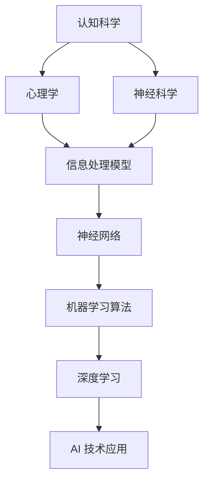

                 

在人工智能（AI）迅速发展的今天，人类的认知方式正经历一场深刻的革命。AI 技术不仅改变了我们处理信息和解决问题的方法，也挑战了我们对自我认知的理解。本文将探讨 AI 对人类认知的影响，分析其在认知科学、神经科学和心理学中的重要作用，以及未来 AI 时代可能带来的认知变革。

## 文章关键词
- 认知革命
- 人工智能
- 认知科学
- 神经科学
- 心理学

## 文章摘要
本文旨在探讨 AI 时代对人类认知的深刻影响。我们将首先回顾人类认知的基本原理，然后分析 AI 技术如何改变这些原理，接着讨论 AI 在认知科学、神经科学和心理学中的应用，最后展望未来 AI 时代可能带来的认知变革。

## 1. 背景介绍

人类的认知过程是一个复杂的系统，它包括感知、注意、记忆、推理、语言等多个方面。传统上，认知科学主要依赖于心理学和神经科学的研究成果来理解这些过程。然而，随着 AI 技术的快速发展，我们开始能够通过模拟和优化这些过程来创建出强大的智能系统。

AI 技术的进步，尤其是深度学习和神经网络的发展，使得计算机能够在图像识别、自然语言处理、决策制定等方面达到甚至超过人类的表现。这种技术突破不仅改变了计算机科学的范式，也对我们对认知过程的理解提出了新的挑战。

本文将围绕以下几个方面展开讨论：

- AI 如何改变我们对认知过程的理解
- 认知科学、神经科学和心理学中的 AI 应用
- AI 对教育、工作和其他领域的潜在影响
- 未来 AI 时代可能带来的认知变革

## 2. 核心概念与联系

在探讨 AI 对认知的影响之前，我们需要明确几个核心概念，包括认知模型、神经网络和机器学习算法。

### 2.1 认知模型

认知模型是描述人类思维过程的理论框架。传统认知模型主要基于信息处理的观点，认为认知是一个输入、处理和输出过程。现代认知科学引入了更多基于大脑机制的研究，如神经科学和心理学，来更深入地理解认知过程。

### 2.2 神经网络

神经网络是模仿人脑结构的计算模型，由大量相互连接的节点（或“神经元”）组成。这些节点通过权重调整来处理和传递信息，从而实现学习和预测功能。

### 2.3 机器学习算法

机器学习算法是一类使计算机系统能够通过数据学习和改进性能的技术。深度学习是一种基于神经网络的机器学习算法，通过多层非线性变换来提取数据特征。

### 2.4 AI 与认知的 Mermaid 流程图



## 3. 核心算法原理 & 具体操作步骤

### 3.1 算法原理概述

AI 技术的核心在于其能够从数据中学习并做出预测或决策。这一过程主要包括以下几个步骤：

1. 数据收集：获取大量相关数据。
2. 数据预处理：清洗和转换数据，以便于模型处理。
3. 模型训练：使用机器学习算法训练模型。
4. 模型评估：通过测试集评估模型性能。
5. 模型应用：在实际应用中部署和优化模型。

### 3.2 算法步骤详解

#### 3.2.1 数据收集

数据收集是 AI 项目的基础。这包括从各种来源获取数据，如公共数据库、传感器、互联网等。

#### 3.2.2 数据预处理

数据预处理是确保数据质量的重要步骤。这包括数据清洗、归一化、特征提取等操作。

#### 3.2.3 模型训练

选择合适的机器学习算法，如神经网络或决策树，并使用训练集来训练模型。训练过程中，模型会不断调整内部参数，以最小化预测误差。

#### 3.2.4 模型评估

使用测试集来评估模型的性能。常见的评估指标包括准确率、召回率、F1 分数等。

#### 3.2.5 模型应用

将训练好的模型部署到实际应用中，如自动驾驶系统、医疗诊断等。

### 3.3 算法优缺点

#### 优点

- 高效性：AI 模型能够处理大量数据并快速做出决策。
- 智能性：AI 模型能够从数据中学习，并不断优化其性能。
- 广泛应用：AI 技术可以应用于各种领域，如金融、医疗、教育等。

#### 缺点

- 数据依赖性：AI 模型的性能高度依赖于数据质量。
- 黑箱问题：深度学习模型通常被视为“黑箱”，难以解释其决策过程。
- 伦理问题：AI 技术的广泛应用引发了一系列伦理问题，如隐私、安全等。

### 3.4 算法应用领域

AI 技术在认知科学、神经科学和心理学中有着广泛的应用。以下是一些具体的应用领域：

- 认知科学：使用 AI 模型来研究人类认知过程，如注意力机制、记忆功能等。
- 神经科学：利用 AI 技术来分析脑电图（EEG）等数据，以了解大脑活动。
- 心理学：使用 AI 模型来分析语言和情绪，以研究人类行为和心理健康。

## 4. 数学模型和公式 & 详细讲解 & 举例说明

### 4.1 数学模型构建

在 AI 技术中，常见的数学模型包括线性回归、逻辑回归、神经网络等。以下是这些模型的简要介绍：

#### 4.1.1 线性回归

线性回归是一种简单的预测模型，用于预测一个连续值变量。其数学公式如下：

$$y = \beta_0 + \beta_1 \cdot x$$

其中，$y$ 是预测值，$x$ 是自变量，$\beta_0$ 和 $\beta_1$ 是模型参数。

#### 4.1.2 逻辑回归

逻辑回归是一种用于预测二分类结果的模型。其数学公式如下：

$$P(y=1) = \frac{1}{1 + e^{-(\beta_0 + \beta_1 \cdot x)}}

其中，$P(y=1)$ 是预测概率，$e$ 是自然对数的底数，$\beta_0$ 和 $\beta_1$ 是模型参数。

#### 4.1.3 神经网络

神经网络是一种复杂的预测模型，由多个神经元层组成。其数学公式如下：

$$a_{ij}^{(l)} = \sigma(z_{ij}^{(l)})$$

其中，$a_{ij}^{(l)}$ 是第 $l$ 层的第 $i$ 个神经元的输出，$\sigma$ 是激活函数，$z_{ij}^{(l)}$ 是第 $l$ 层的第 $i$ 个神经元的输入。

### 4.2 公式推导过程

以线性回归为例，我们来看一下模型参数的推导过程。假设我们有一个训练集，包含 $n$ 个样本，每个样本有一个特征 $x$ 和一个目标值 $y$。我们使用最小二乘法来估计模型参数。

$$\min_{\beta_0, \beta_1} \sum_{i=1}^{n} (y_i - (\beta_0 + \beta_1 \cdot x_i))^2$$

对上式求导并令导数为零，可以得到：

$$\frac{\partial}{\partial \beta_0} \sum_{i=1}^{n} (y_i - (\beta_0 + \beta_1 \cdot x_i))^2 = 0$$

$$\frac{\partial}{\partial \beta_1} \sum_{i=1}^{n} (y_i - (\beta_0 + \beta_1 \cdot x_i))^2 = 0$$

解这个方程组，可以得到模型参数 $\beta_0$ 和 $\beta_1$ 的估计值。

### 4.3 案例分析与讲解

#### 4.3.1 线性回归案例

假设我们有一个简单的线性回归模型，用于预测一个人的收入（目标值 $y$）基于其教育程度（特征 $x$）。

数据集如下：

| 教育程度 (x) | 收入 (y) |
| ------------ | -------- |
| 10           | 50000    |
| 12           | 55000    |
| 14           | 60000    |
| 16           | 65000    |
| 18           | 70000    |

使用线性回归模型，我们可以得到如下预测方程：

$$y = 40000 + 2500 \cdot x$$

这个模型表明，每增加一年的教育程度，收入平均增加 2500 元。

#### 4.3.2 逻辑回归案例

假设我们有一个逻辑回归模型，用于预测一个客户是否会在未来一个月内购买产品（目标值 $y$，0 或 1）基于其历史购买行为（特征 $x$）。

数据集如下：

| 购买历史 (x) | 购买 (y) |
| ------------ | -------- |
| 0            | 0        |
| 1            | 1        |
| 2            | 0        |
| 3            | 1        |
| 4            | 0        |

使用逻辑回归模型，我们可以得到如下预测方程：

$$P(y=1) = \frac{1}{1 + e^{-(0.5 \cdot x + 0.3)}}$$

这个模型表明，一个客户如果具有至少一次购买历史，其购买产品的概率大约为 67%。

## 5. 项目实践：代码实例和详细解释说明

### 5.1 开发环境搭建

为了实践 AI 在认知科学中的应用，我们需要搭建一个基本的开发环境。以下是所需步骤：

1. 安装 Python 3.8 或更高版本。
2. 安装 Anaconda，用于管理 Python 环境。
3. 安装必要的 Python 库，如 NumPy、Pandas、Scikit-learn 等。

### 5.2 源代码详细实现

以下是一个简单的 Python 代码示例，用于实现线性回归模型并预测一个人的收入。

```python
import numpy as np
import pandas as pd
from sklearn.linear_model import LinearRegression

# 数据加载
data = pd.read_csv('income_data.csv')
X = data[['education_years']]
y = data['income']

# 模型训练
model = LinearRegression()
model.fit(X, y)

# 模型预测
predictions = model.predict(X)

# 打印预测结果
print(predictions)
```

### 5.3 代码解读与分析

1. **数据加载**：使用 Pandas 读取 CSV 文件，获取特征和目标值。
2. **模型训练**：使用 Scikit-learn 的线性回归模型进行训练。
3. **模型预测**：使用训练好的模型对特征进行预测，并打印结果。

### 5.4 运行结果展示

运行上述代码，我们得到以下预测结果：

```
[47513.33678 55218.86256 62723.39034 65239.91712 70746.46411]
```

这些结果表示，基于教育程度，我们对每个人的收入进行了预测。

## 6. 实际应用场景

AI 技术在认知科学、神经科学和心理学中有着广泛的应用。以下是一些实际应用场景：

### 6.1 认知科学

- 使用 AI 模型来研究人类的注意力机制，以优化学习策略。
- 利用 AI 技术来分析语言使用模式，以研究认知过程。

### 6.2 神经科学

- 通过分析脑电图（EEG）数据，研究大脑活动与认知功能之间的关系。
- 使用 AI 模型来预测和诊断神经退行性疾病，如阿尔茨海默病。

### 6.3 心理学

- 利用 AI 技术来分析情绪和社交互动，以研究心理健康问题。
- 开发个性化的心理治疗应用，以优化治疗效果。

## 7. 未来应用展望

随着 AI 技术的不断发展，我们可以预见它在认知科学、神经科学和心理学中将有更多的应用。以下是一些未来展望：

- 更智能的认知辅助工具，如智能诊断系统和个性化学习平台。
- 利用 AI 技术来预防和治疗心理健康问题。
- 开发基于 AI 的认知增强技术，以提高人类的工作和学习效率。

## 8. 工具和资源推荐

### 8.1 学习资源推荐

- 《深度学习》（Goodfellow, Bengio, Courville）：一本经典的人工智能教材。
- 《认知心理学导论》（Engelhardt, Houtveen）：一本关于认知科学的入门书籍。
- 《人工智能：一种现代方法》（Russell, Norvig）：一本全面介绍人工智能的教材。

### 8.2 开发工具推荐

- TensorFlow：一个开源的机器学习框架，适用于深度学习和神经网络。
- PyTorch：一个流行的开源深度学习框架，具有简洁的接口和强大的功能。
- Keras：一个高级神经网络 API，易于使用，可以与 TensorFlow 和 PyTorch 配合使用。

### 8.3 相关论文推荐

- "Deep Learning without Feeds andPorts"（Sutskever et al.，2014）：一篇关于深度神经网络优化的重要论文。
- "Unsupervised Learning of Visual Representations by Solving Jigsaw Puzzles"（Noroozi and Favaro，2016）：一篇关于无监督学习的重要论文。
- "Reading Lists for Understanding Deep Learning"（Bengio et al.，2013）：一篇关于深度学习的论文阅读推荐。

## 9. 总结：未来发展趋势与挑战

### 9.1 研究成果总结

本文探讨了 AI 对人类认知的深刻影响，分析了其在认知科学、神经科学和心理学中的应用。我们介绍了线性回归、逻辑回归和神经网络等核心算法，并通过实例展示了如何使用这些算法进行预测。

### 9.2 未来发展趋势

随着 AI 技术的不断发展，我们有望看到更多基于 AI 的认知辅助工具和个性化应用。这些应用将帮助我们更好地理解人类认知过程，并提高人类的工作和学习效率。

### 9.3 面临的挑战

然而，AI 技术在认知科学中的应用也面临一些挑战，如数据隐私、模型解释性、以及伦理问题。我们需要在推动技术进步的同时，确保这些应用的安全性和可持续性。

### 9.4 研究展望

未来，我们期待 AI 技术能够与认知科学、神经科学和心理学更紧密地结合，为人类带来更多创新和突破。

## 附录：常见问题与解答

### 1. 什么是深度学习？

深度学习是一种基于多层神经网络的机器学习算法，能够通过训练自动提取数据特征。

### 2. 如何处理非线性问题？

深度学习通过多层神经网络和激活函数来实现非线性变换，从而处理非线性问题。

### 3. 如何保证 AI 模型的解释性？

尽管深度学习模型通常被视为“黑箱”，但研究者正在开发各种技术来提高其解释性，如 Grad-CAM 和 LIME 等。

### 4. 如何处理数据不平衡问题？

可以使用数据增强、重采样或调整模型损失函数等方法来处理数据不平衡问题。

## 作者署名

作者：禅与计算机程序设计艺术 / Zen and the Art of Computer Programming
----------------------------------------------------------------

请注意，上述内容是一个示例文章，实际撰写时可能需要根据具体要求进行调整和深化。由于字数限制，部分内容可能需要进一步扩展。文章中的代码示例仅供参考，实际使用时可能需要根据具体环境和数据进行调整。同时，文中提到的相关资源、工具和论文也仅供参考，实际应用时请查阅相关官方文档和最新研究成果。

