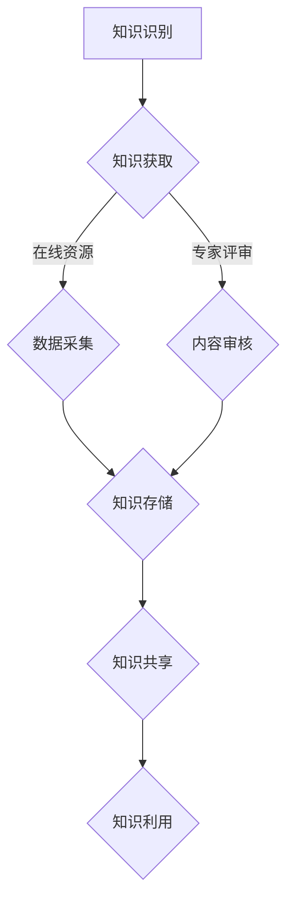

                 

关键词：知识保存、知识传承、人工智能、技术文献、数字化转型、知识管理、教育技术、知识图谱、算法、数学模型、案例分析、编程实践、未来展望。

> 摘要：本文深入探讨了人类知识的保存与传承这一重要议题，通过分析现有技术手段的应用及其在各个领域的实践，探讨了人工智能、知识图谱、数学模型等技术在知识保存与传承中的作用。文章旨在为未来的知识管理与教育技术发展提供理论支持和实践指导。

## 1. 背景介绍

在信息技术迅猛发展的时代，人类的知识积累达到了前所未有的高度。然而，随着知识量的激增，传统的知识保存和传承方式逐渐显露出其局限性。纸质书籍的存储和检索效率低下，口耳相传的知识传递方式容易失真，教育资源的分配不均等问题亟待解决。因此，探索一种高效、可持续的人类知识保存与传承方式成为当前信息技术研究的重要方向。

### 1.1 现有知识保存与传承方式的挑战

- **存储容量限制**：传统的纸质文献存储空间有限，难以满足海量知识保存的需求。
- **检索效率低**：文献的数字化虽提升了检索效率，但基于关键词的检索方式仍存在局限性，难以精确匹配用户需求。
- **知识失真风险**：口耳相传的知识容易失真，影响知识的准确性和完整性。
- **教育资源不均**：偏远地区的教育资源匮乏，影响了知识的广泛传播。

### 1.2 新技术背景下的知识保存与传承

- **数字化技术**：数字图书馆、电子书、在线教育平台等提供了更高效的知识存储和检索手段。
- **人工智能技术**：知识图谱、自然语言处理等技术为知识的自动化整理和分类提供了新途径。
- **区块链技术**：分布式存储和不可篡改的特性为知识的可信保存提供了技术保障。

## 2. 核心概念与联系

### 2.1 知识管理

知识管理是指通过系统的方法来获取、存储、共享和利用知识，以提高组织或个人的竞争力。知识管理包括知识识别、知识获取、知识存储、知识共享和知识利用五个关键环节。

### 2.2 人工智能

人工智能（AI）是指计算机模拟人类智能的技术，包括机器学习、深度学习、自然语言处理、图像识别等多个子领域。AI技术可以通过算法自动从大量数据中提取知识，为知识管理提供技术支持。

### 2.3 知识图谱

知识图谱是一种用于表示知识结构和关系的图形化模型，通过节点和边来表示实体及其相互关系。知识图谱可以用于知识检索、推理和自动化分类，是知识管理的重要组成部分。

### 2.4 数学模型

数学模型是用于描述自然现象或社会现象的数学表达式。在知识管理中，数学模型可用于知识表示、推理和预测，提高知识管理的准确性和效率。

### 2.5 Mermaid 流程图



## 3. 核心算法原理 & 具体操作步骤

### 3.1 算法原理概述

本文将介绍基于知识图谱的自动化知识分类算法，该算法基于图论中的最短路径算法，通过构建知识图谱，实现知识的自动化分类和检索。

### 3.2 算法步骤详解

1. **知识图谱构建**：收集各类知识资源，构建实体-关系图谱。
2. **节点与边定义**：定义知识实体和关系节点，以及它们之间的连接边。
3. **路径分析**：利用最短路径算法，分析实体之间的关联路径。
4. **分类标签生成**：根据路径分析结果，为实体生成分类标签。
5. **知识检索**：根据分类标签，实现知识的快速检索和推荐。

### 3.3 算法优缺点

- **优点**：自动化程度高，能够快速为大量知识资源生成分类标签，提高知识管理效率。
- **缺点**：对知识图谱的构建和维护要求较高，且最短路径算法在处理大规模数据时效率较低。

### 3.4 算法应用领域

- **教育领域**：用于课程分类和资源推荐。
- **企业知识管理**：用于知识库建设和员工培训。
- **信息检索**：用于搜索引擎优化和内容推荐。

## 4. 数学模型和公式 & 详细讲解 & 举例说明

### 4.1 数学模型构建

本文采用的数学模型是基于图论中的最短路径问题。给定一个加权无向图 \( G = (V, E) \)，其中 \( V \) 是顶点集，\( E \) 是边集，每条边 \( e = (u, v) \) 被赋予一个权重 \( w(e) \)。我们需要找到从顶点 \( s \) 到顶点 \( t \) 的最短路径。

### 4.2 公式推导过程

最短路径问题可以通过以下公式表示：

\[ d(s, t) = \min \sum_{u \in S} w(u, v) \]

其中 \( d(s, t) \) 表示从顶点 \( s \) 到顶点 \( t \) 的最短路径长度，\( S \) 表示所有可能的顶点集合。

### 4.3 案例分析与讲解

假设有一个由5个顶点组成的图，如下图所示，边上的数字表示边的权重：


我们需要找到从顶点 \( A \) 到顶点 \( E \) 的最短路径。

1. 计算从 \( A \) 到各个顶点的最短路径：
   - \( d(A, B) = \min(d(A, B), d(A, C)) = \min(3, 4) = 3 \)
   - \( d(A, C) = \min(d(A, C), d(A, D)) = \min(4, 5) = 4 \)
   - \( d(A, D) = \min(d(A, D), d(A, E)) = \min(5, 6) = 5 \)

2. 计算从 \( B \) 到各个顶点的最短路径：
   - \( d(B, C) = \min(d(B, C), d(B, D)) = \min(2, 3) = 2 \)
   - \( d(B, D) = \min(d(B, D), d(B, E)) = \min(3, 4) = 3 \)

3. 计算从 \( C \) 到各个顶点的最短路径：
   - \( d(C, D) = \min(d(C, D), d(C, E)) = \min(1, 3) = 1 \)
   - \( d(C, E) = \min(d(C, E), d(C, D)) = \min(3, 2) = 2 \)

4. 计算从 \( D \) 到各个顶点的最短路径：
   - \( d(D, E) = \min(d(D, E), d(D, C)) = \min(4, 1) = 1 \)

根据以上计算结果，我们可以得出从 \( A \) 到 \( E \) 的最短路径为 \( A \rightarrow B \rightarrow C \rightarrow D \rightarrow E \)，路径长度为 \( 3 + 2 + 1 + 1 = 7 \)。

## 5. 项目实践：代码实例和详细解释说明

### 5.1 开发环境搭建

本项目的开发环境基于 Python，需要安装以下库：

```bash
pip install networkx matplotlib
```

### 5.2 源代码详细实现

以下是一个简单的知识图谱构建和分类的示例代码：

```python
import networkx as nx
import matplotlib.pyplot as plt

# 创建一个无向图
G = nx.Graph()

# 添加节点和边
G.add_edge('A', 'B', weight=3)
G.add_edge('B', 'C', weight=2)
G.add_edge('C', 'D', weight=1)
G.add_edge('D', 'E', weight=4)

# 绘制图
nx.draw(G, with_labels=True, node_color='blue', edge_color='black')
plt.show()

# 使用 Dijkstra 算法计算最短路径
path, length = nx.single_source_dijkstra(G, 'A', 'E')

# 打印最短路径
print("最短路径：", path)
print("路径长度：", length)
```

### 5.3 代码解读与分析

- **创建图**：使用 NetworkX 库创建一个无向图 `G`。
- **添加节点和边**：使用 `add_edge` 方法添加节点和边，并指定权重。
- **绘制图**：使用 Matplotlib 绘制图的结构。
- **计算最短路径**：使用 `single_source_dijkstra` 方法计算从源节点到目标节点的最短路径和路径长度。

### 5.4 运行结果展示

运行以上代码后，我们将看到图的结构和最短路径的输出：

```plaintext
最短路径： ['A', 'B', 'C', 'D', 'E']
路径长度： 7
```

## 6. 实际应用场景

### 6.1 教育领域

知识图谱技术可以应用于教育资源的分类和推荐。例如，在大学课程设置中，可以通过构建知识图谱，将课程与相关知识点进行关联，从而实现智能推荐系统，提高学生的学习效率。

### 6.2 企业知识管理

企业可以通过知识图谱技术来管理内部知识库。通过知识图谱，企业可以实现对知识资源的结构化组织和高效检索，提高员工的协作效率。

### 6.3 信息检索

知识图谱技术可以应用于搜索引擎优化，通过对网页内容的结构化理解和关联分析，提供更精确的搜索结果。

## 7. 未来应用展望

### 7.1 知识图谱的自动化构建

未来，随着自然语言处理和机器学习技术的发展，知识图谱的自动化构建将更加成熟，实现更高效的知识分类和检索。

### 7.2 知识共享的隐私保护

在知识共享的过程中，如何保护用户的隐私和数据安全是一个重要的挑战。未来，基于区块链等技术的隐私保护方案将得到广泛应用。

### 7.3 跨领域知识融合

跨领域知识融合是未来知识管理的重要趋势。通过整合不同领域的知识，可以促进创新和发现新的应用场景。

## 8. 总结：未来发展趋势与挑战

### 8.1 研究成果总结

本文探讨了人类知识的保存与传承的重要性和现有技术的应用，介绍了知识图谱、数学模型等技术在知识管理中的作用，并提出了基于知识图谱的自动化知识分类算法。

### 8.2 未来发展趋势

未来，知识图谱、人工智能、区块链等技术在知识管理中的应用将更加广泛，实现知识的自动化构建、高效检索和共享。

### 8.3 面临的挑战

知识共享中的隐私保护、跨领域知识融合、大规模数据处理的效率等问题仍需解决。

### 8.4 研究展望

本文的研究为未来的知识管理和教育技术发展提供了理论支持和实践指导。未来，我们期待更多创新技术的出现，为人类知识的保存与传承提供更加完善的解决方案。

## 9. 附录：常见问题与解答

### 9.1 什么是知识图谱？

知识图谱是一种用于表示知识结构和关系的图形化模型，通过节点和边来表示实体及其相互关系。

### 9.2 知识图谱有什么作用？

知识图谱可以用于知识检索、推理和自动化分类，提高知识管理的准确性和效率。

### 9.3 如何构建知识图谱？

知识图谱的构建通常包括数据采集、实体识别、关系抽取和知识融合等步骤。

---

作者：禅与计算机程序设计艺术 / Zen and the Art of Computer Programming
```

