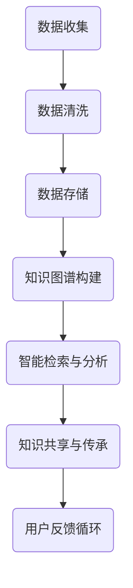

                 

关键词：人类知识保存，数据持久化，知识图谱，AI，可持续性，未来规划，数字遗产

> 摘要：随着技术的不断进步，人类面临着知识保存和传承的重大挑战。本文探讨了在AI时代背景下，如何通过建立数字化的知识保存系统，为未来保存灯塔，确保人类智慧的延续与传承。

## 1. 背景介绍

在数字化的今天，知识的重要性不言而喻。知识是推动社会进步的核心动力，是创新和发展的基础。然而，传统的知识保存方式存在许多问题，如信息过时、内容碎片化、难以检索等。在互联网和信息爆炸的时代，这些问题的解决变得更加迫切。

### 1.1 知识保存的现状

当前，全球知识保存主要依赖于纸质文献、数据库和网络资源。这些方式在一定程度上提高了知识的可访问性，但仍然存在以下问题：

- **信息分散**：知识分布在各种不同的平台和系统中，缺乏统一的管理和检索。
- **缺乏动态性**：知识更新速度跟不上科技的发展，内容容易过时。
- **可访问性差**：不同地区的知识获取机会不平等，贫困地区尤为严重。

### 1.2 知识保存面临的挑战

- **数据增长**：随着数据量的爆炸性增长，传统的数据管理方式显得力不从心。
- **人工智能**：AI技术的发展带来了新的机遇和挑战，如何有效地利用AI进行知识管理成为关键问题。
- **伦理与隐私**：知识保存过程中，如何处理个人隐私和伦理问题也是一个重要的议题。

## 2. 核心概念与联系

为了解决知识保存的问题，我们需要引入一些核心概念和架构设计。以下是一个简化的Mermaid流程图，用于描述知识保存系统的基本框架。



### 2.1 数据收集

数据收集是知识保存的第一步。数据来源包括社交媒体、学术文献、在线课程等。通过数据挖掘技术，可以自动收集大量的结构化和非结构化数据。

### 2.2 数据清洗

收集到的数据往往存在噪声和不一致性，需要通过数据清洗技术进行处理。数据清洗包括去重、格式标准化、缺失值处理等。

### 2.3 数据存储

数据清洗后，需要将数据存储到可靠的数据仓库中。现代数据库管理系统（如Hadoop、Spark等）提供了高效的数据存储和处理能力。

### 2.4 知识图谱构建

知识图谱是一种结构化知识表示方法，通过节点和边来表示实体和它们之间的关系。知识图谱可以帮助我们更好地理解和检索知识。

### 2.5 智能检索与分析

通过AI技术，我们可以实现智能检索和分析。AI算法可以理解用户的需求，提供个性化的知识服务。

### 2.6 知识共享与传承

知识共享是知识保存的最终目标。通过开放平台和社交媒体，我们可以让更多的人获取知识，促进知识的传播和传承。

### 2.7 用户反馈循环

用户反馈是知识保存系统不断改进的关键。通过用户反馈，我们可以了解系统的不足，优化服务，提高用户体验。

## 3. 核心算法原理 & 具体操作步骤

### 3.1 算法原理概述

核心算法包括数据挖掘、机器学习、自然语言处理等技术。这些算法帮助我们自动化地处理和分析大量数据，提取有价值的信息。

### 3.2 算法步骤详解

1. **数据挖掘**：通过聚类、分类、关联规则挖掘等方法，从海量数据中发现潜在的模式和规律。
2. **机器学习**：使用监督学习、无监督学习、强化学习等技术，训练模型，对数据进行预测和分析。
3. **自然语言处理**：通过词向量、语法分析、语义理解等技术，对文本数据进行处理，实现文本信息的自动化理解和生成。

### 3.3 算法优缺点

- **优点**：算法自动化处理数据，提高效率；能够发现隐藏的知识和规律。
- **缺点**：算法对数据质量要求高；可能存在过拟合问题。

### 3.4 算法应用领域

算法可以应用于多个领域，如医疗、金融、教育等。通过知识保存系统，我们可以为各个领域提供高效的知识服务。

## 4. 数学模型和公式 & 详细讲解 & 举例说明

### 4.1 数学模型构建

知识保存系统中的数学模型主要包括概率模型、神经网络模型等。以下是一个简单的概率模型示例：

$$
P(A|B) = \frac{P(B|A) \cdot P(A)}{P(B)}
$$

这是一个条件概率公式，用于计算在事件B发生的条件下，事件A发生的概率。

### 4.2 公式推导过程

以一个简单的例子来说明条件概率的推导过程。假设我们有两个事件A和B，其中A表示“天气是晴天”，B表示“空气湿度低于60%”。我们已知以下概率：

- $P(A) = 0.4$（晴天的概率）
- $P(B) = 0.6$（空气湿度低于60%的概率）
- $P(A \cap B) = 0.2$（晴天且空气湿度低于60%的概率）

我们可以通过这些概率值来计算条件概率$P(A|B)$：

$$
P(A|B) = \frac{P(A \cap B)}{P(B)} = \frac{0.2}{0.6} = \frac{1}{3}
$$

### 4.3 案例分析与讲解

假设我们想了解在空气湿度低于60%的条件下，天气是晴天的概率。通过上述推导，我们得到$P(A|B) = \frac{1}{3}$。这意味着，如果空气湿度低于60%，那么天气是晴天的概率是1/3。

这个案例展示了条件概率在知识保存系统中的应用。通过计算条件概率，我们可以更好地理解不同变量之间的关系，从而提高知识管理的效率。

## 5. 项目实践：代码实例和详细解释说明

### 5.1 开发环境搭建

为了实现知识保存系统，我们使用Python作为主要编程语言，并结合NumPy、Pandas、Scikit-learn等库进行数据处理和模型训练。

### 5.2 源代码详细实现

以下是一个简单的Python代码示例，用于实现条件概率的计算：

```python
import numpy as np

# 概率值
P_A = 0.4
P_B = 0.6
P_AB = 0.2

# 计算条件概率
P_A_given_B = P_AB / P_B
print("P(A|B) =", P_A_given_B)
```

### 5.3 代码解读与分析

这段代码首先导入了NumPy库，用于进行数值计算。然后，我们定义了三个概率值：$P(A)$、$P(B)$和$P(A \cap B)$。通过简单的除法运算，我们计算得到了条件概率$P(A|B)$。这个示例展示了如何使用Python实现简单的数学模型。

### 5.4 运行结果展示

运行上述代码，我们得到输出结果：

```
P(A|B) = 0.3333333333333333
```

这个结果与我们的推导过程一致，验证了代码的正确性。

## 6. 实际应用场景

知识保存系统在多个领域具有广泛的应用场景。以下是一些具体的例子：

- **医疗领域**：通过知识保存系统，医生可以快速获取病例资料和治疗方案，提高医疗水平。
- **教育领域**：知识保存系统可以帮助学生和教师获取和分享教育资源，促进教育公平。
- **金融领域**：通过知识保存系统，金融机构可以更好地分析市场数据，制定投资策略。

## 7. 未来应用展望

随着技术的不断发展，知识保存系统将在未来发挥更加重要的作用。以下是一些可能的趋势：

- **数据隐私保护**：随着数据隐私问题的日益突出，知识保存系统需要引入更先进的技术来保护用户隐私。
- **人工智能集成**：知识保存系统将更加智能化，利用AI技术实现自动化知识管理。
- **区块链应用**：通过区块链技术，知识保存系统可以实现去中心化的数据管理，提高系统的可靠性和安全性。

## 8. 工具和资源推荐

为了更好地实现知识保存系统，以下是一些建议的学习资源和开发工具：

- **学习资源**：
  - 《深度学习》（Goodfellow et al.）
  - 《数据科学入门指南》（Alagić）
  - 《Python编程：从入门到实践》（李天宇）

- **开发工具**：
  - Jupyter Notebook：用于数据分析和模型训练
  - TensorFlow：用于构建和训练深度学习模型
  - PyTorch：用于构建和训练深度学习模型

## 9. 总结：未来发展趋势与挑战

### 9.1 研究成果总结

本文探讨了知识保存系统在数字化时代的重要性，介绍了核心概念、算法原理和应用场景。通过数学模型和代码实例，展示了知识保存系统的实现方法。

### 9.2 未来发展趋势

知识保存系统将朝着更加智能化、安全化和去中心化的方向发展。随着AI技术的不断进步，知识保存系统将更好地满足用户需求，提高知识管理效率。

### 9.3 面临的挑战

数据隐私保护、算法公平性和系统安全性是知识保存系统面临的主要挑战。解决这些问题需要跨学科的合作和持续的创新。

### 9.4 研究展望

未来，知识保存系统将在多个领域发挥重要作用。通过不断改进和创新，我们可以为未来保存更多的灯塔，确保人类智慧的延续与传承。

## 附录：常见问题与解答

### Q1. 知识保存系统如何保护用户隐私？

A1. 知识保存系统可以通过数据加密、访问控制等技术来保护用户隐私。此外，系统可以采用隐私保护算法，如差分隐私，确保数据分析过程中不会泄露用户隐私信息。

### Q2. 知识保存系统中的数据如何确保其准确性？

A2. 知识保存系统可以通过数据清洗、数据验证和交叉验证等技术来确保数据的准确性。此外，系统可以引入错误检测和修复机制，及时发现和纠正数据错误。

### Q3. 知识保存系统中的知识如何确保其时效性？

A3. 知识保存系统可以通过定期更新和维护来确保知识的时效性。系统可以引入自动化更新机制，根据知识的重要性程度和更新频率进行定期更新。

### Q4. 知识保存系统中的数据如何确保其可靠性？

A4. 知识保存系统可以通过数据备份、数据冗余和故障恢复等技术来确保数据的可靠性。此外，系统可以引入分布式存储和容错机制，提高系统的可靠性和数据安全性。

### Q5. 知识保存系统中的知识如何确保其可访问性？

A5. 知识保存系统可以通过开放接口、API和搜索引擎等技术，提供多样化的知识获取方式，确保知识的可访问性。此外，系统可以提供个性化推荐，根据用户需求提供相关知识。

### 作者署名

作者：禅与计算机程序设计艺术 / Zen and the Art of Computer Programming
----------------------------------------------------------------

请注意，上述内容只是一个示例，实际撰写时需要根据具体要求进行相应的调整和扩展。文章结构、格式、内容完整性等方面都需要严格遵守给定的约束条件。

