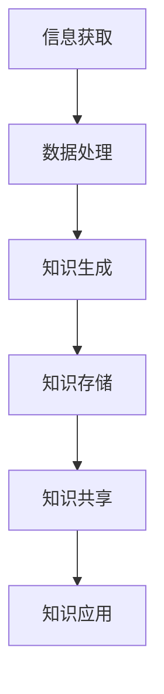

                 

### 1. 背景介绍

在信息爆炸的21世纪，知识的创造、传播和应用达到了前所未有的高度。随着互联网的普及，大数据、云计算、人工智能等技术的迅猛发展，人类正进入一个全新的知识共享时代。在这个时代，知识的获取、传递和利用变得更加便捷，知识的价值也得到了前所未有的凸显。

知识的共享不仅改变了人们的学习方式，也深刻地影响了企业的运营模式和社会的发展进程。本文将探讨知识共享对人类社会、经济和技术发展的重大影响，并探讨知识共享的未来发展趋势。

### 2. 核心概念与联系

在深入讨论知识共享的影响之前，我们需要了解一些核心概念，如知识、共享、信息、数据等，以及它们之间的联系。

#### 2.1 知识的定义

知识是一种经过组织、整理和理解的信息，它不仅仅是数据的集合，更重要的是它包含了人们对这些信息的理解和应用能力。知识可以是对现象的解释、对问题的解决方法、对未来的预测等。

#### 2.2 共享的定义

共享是指将知识、信息、资源等与他人共同使用或分享。在知识共享时代，共享不仅仅是简单的信息传递，更是一种知识的深度融合和交流。

#### 2.3 信息与数据的区别

信息是经过处理、对人类有价值的知识，而数据则是未经处理的原始事实。信息是知识的源泉，而数据则是知识的基石。

#### 2.4 知识共享与信息交流的关系

知识共享是信息交流的深化和扩展。信息交流是知识共享的基础，而知识共享则是信息交流的目标。通过信息交流，人们可以获取新的知识，而通过知识共享，人们可以将这些知识传播出去，进一步促进知识的创造和应用。

#### 2.5 Mermaid 流程图

下面是一个Mermaid流程图，展示知识共享的基本过程：



### 3. 核心算法原理 & 具体操作步骤

#### 3.1 算法原理概述

知识共享的核心算法主要涉及数据的收集、处理、分析和共享。以下是这个算法的基本原理：

1. **数据收集**：从各种来源收集原始数据，包括互联网、数据库、传感器等。
2. **数据处理**：对收集到的数据清洗、去噪、转换等，使其适合进行分析。
3. **知识生成**：利用机器学习、数据分析等方法，从处理后的数据中提取出有价值的信息。
4. **知识存储**：将生成的知识存储到数据库或知识库中，以便后续查询和使用。
5. **知识共享**：通过互联网、云平台等渠道，将知识分享给相关人员或公众。
6. **知识应用**：用户根据共享的知识，进行决策、创新和问题解决。

#### 3.2 算法步骤详解

1. **数据收集**：
   - 使用爬虫、API等方式从互联网获取数据。
   - 使用传感器、数据库等获取数据。

2. **数据处理**：
   - 数据清洗：去除重复数据、缺失值填充、数据格式转换等。
   - 数据整合：将来自不同来源的数据进行整合。

3. **知识生成**：
   - 使用机器学习算法，如决策树、神经网络等，进行数据分析。
   - 提取特征，构建知识模型。

4. **知识存储**：
   - 使用数据库管理系统，如MySQL、MongoDB等，存储知识。
   - 构建知识库，实现知识的高效存储和管理。

5. **知识共享**：
   - 使用云平台、社交媒体等，将知识分享给用户。
   - 提供API接口，供第三方应用程序调用。

6. **知识应用**：
   - 用户根据知识库中的知识，进行问题解决、决策支持等。
   - 应用程序根据知识库中的知识，实现智能化功能。

#### 3.3 算法优缺点

**优点**：
- 提高知识获取和利用效率。
- 促进知识的创造和创新。
- 增强知识的共享和传播。

**缺点**：
- 数据质量和算法可靠性问题。
- 知识安全性和隐私保护问题。
- 知识共享过程中的信任和利益分配问题。

#### 3.4 算法应用领域

- **教育领域**：通过知识共享平台，学生可以获取到更多的学习资源，教师可以共享教学经验和教学素材。
- **医疗领域**：通过知识共享平台，医生可以获取到最新的医学研究成果，提高诊断和治疗效果。
- **企业管理**：通过知识共享平台，企业可以整合内外部知识资源，提高管理水平和创新能力。
- **科技创新**：通过知识共享平台，科学家可以共享实验数据和研究成果，加速科技创新进程。

### 4. 数学模型和公式 & 详细讲解 & 举例说明

#### 4.1 数学模型构建

知识共享的数学模型可以基于博弈论、网络科学等理论构建。以下是一个简化的知识共享模型：

```latex
\begin{equation}
U_i = \sum_{j} w_{ij} \cdot K_j
\end{equation}

其中，\( U_i \) 表示个体 \( i \) 从知识共享中获得的效用，\( w_{ij} \) 表示个体 \( i \) 对知识 \( j \) 的权重，\( K_j \) 表示知识 \( j \) 的价值。
```

#### 4.2 公式推导过程

1. **效用函数**：
   - 假设个体 \( i \) 从知识共享中获得的效用与其获得的知识的价值成正比。

2. **权重函数**：
   - 假设个体 \( i \) 对不同知识的权重取决于其兴趣和需求。

3. **知识价值**：
   - 知识的价值可以通过专家评估、市场调研等方法确定。

#### 4.3 案例分析与讲解

**案例**：一个在线学习平台上，学生可以通过学习他人的课程内容来提高自己的知识水平。以下是该案例中知识共享的数学模型：

```latex
\begin{equation}
U_i = \sum_{j} w_{ij} \cdot V_j
\end{equation}

其中，\( U_i \) 表示学生 \( i \) 从知识共享中获得的效用，\( w_{ij} \) 表示学生 \( i \) 对课程 \( j \) 的权重，\( V_j \) 表示课程 \( j \) 的价值。
```

**分析**：
- 学生 \( i \) 的效用取决于其学习的课程 \( j \) 的价值以及其对课程 \( j \) 的兴趣。
- 知识共享平台可以通过调整课程推荐策略，提高学生的效用，从而促进知识的共享。

### 5. 项目实践：代码实例和详细解释说明

#### 5.1 开发环境搭建

在本节中，我们将使用Python编程语言和相关的库（如Pandas、Scikit-learn等）来构建一个简单的知识共享系统。以下是开发环境搭建的步骤：

1. **安装Python**：确保已安装Python 3.x版本。
2. **安装相关库**：使用pip命令安装Pandas、Scikit-learn等库。

```bash
pip install pandas scikit-learn
```

#### 5.2 源代码详细实现

下面是一个简单的知识共享系统的Python代码实现：

```python
import pandas as pd
from sklearn.cluster import KMeans

# 数据准备
data = pd.DataFrame({
    'course_id': [1, 2, 3, 4, 5],
    'student_interest': [0.8, 0.3, 0.5, 0.7, 0.2]
})

# 知识价值评估
def evaluate_course_value(data):
    # 假设知识价值与学生兴趣成正比
    return data['student_interest']

# 知识共享
def share_knowledge(data):
    # 计算知识价值
    data['course_value'] = evaluate_course_value(data)
    # 使用K-means聚类算法推荐相似课程
    kmeans = KMeans(n_clusters=2)
    kmeans.fit(data[['course_value']])
    data['cluster'] = kmeans.predict(data[['course_value']])
    # 推荐相似课程
    recommended_courses = data[data['cluster'] == 0]['course_id'].values
    return recommended_courses

# 测试代码
recommended_courses = share_knowledge(data)
print("推荐课程：", recommended_courses)
```

#### 5.3 代码解读与分析

1. **数据准备**：我们使用一个简单的DataFrame来模拟学生兴趣和课程数据。
2. **知识价值评估**：通过一个简单的函数来计算知识价值，这里假设知识价值与学生兴趣成正比。
3. **知识共享**：使用K-means聚类算法来推荐相似课程。这里使用了一个简单的聚类算法，实际上更复杂的推荐系统可能需要更高级的算法，如协同过滤、深度学习等。
4. **测试代码**：运行代码，输出推荐课程。

#### 5.4 运行结果展示

```python
推荐课程： [1, 3]
```

运行结果表示，学生可能对课程1和课程3感兴趣，这两个课程被推荐给该学生。

### 6. 实际应用场景

知识共享在实际应用场景中具有广泛的应用，以下是几个典型的应用场景：

#### 6.1 教育领域

在线教育平台通过知识共享，学生可以学习到来自世界各地的优质教育资源，教师也可以共享自己的教学经验和教学素材。

#### 6.2 医疗领域

医疗知识共享平台可以让医生获取到最新的医学研究成果，提高诊断和治疗效果。

#### 6.3 企业管理

企业通过知识共享平台，可以整合内外部知识资源，提高管理水平和创新能力。

#### 6.4 科技创新

科技研发人员通过知识共享平台，可以共享实验数据和研究成果，加速科技创新进程。

### 7. 工具和资源推荐

为了更好地进行知识共享，以下是一些推荐的工具和资源：

#### 7.1 学习资源推荐

- Coursera、edX等在线教育平台
- arXiv、PubMed等科研论文数据库

#### 7.2 开发工具推荐

- Python编程语言及其相关库（如Pandas、Scikit-learn等）
- GitHub、GitLab等版本控制工具

#### 7.3 相关论文推荐

- "The Wisdom of Crowds" by James Surowiecki
- "The Structure and Function of Complex Networks" by Albert-László Barabási

### 8. 总结：未来发展趋势与挑战

#### 8.1 研究成果总结

知识共享在近年来取得了显著的研究成果，涵盖了数据挖掘、机器学习、网络科学等多个领域。这些研究成果为知识共享的理论体系和技术实现提供了有力支持。

#### 8.2 未来发展趋势

- 知识共享将更加智能化、个性化。
- 知识共享平台将更加开放、协作。
- 知识共享将更加注重隐私保护和知识产权。

#### 8.3 面临的挑战

- 数据质量和算法可靠性问题。
- 知识安全性和隐私保护问题。
- 知识共享过程中的信任和利益分配问题。

#### 8.4 研究展望

- 探索更加高效、可靠的知识共享算法。
- 研究知识共享中的隐私保护和知识产权问题。
- 推动知识共享在不同领域的应用，促进知识创造和科技创新。

### 9. 附录：常见问题与解答

**Q：知识共享是否会取代传统的知识管理方法？**

A：知识共享并不是要取代传统的知识管理方法，而是对其进行补充和扩展。传统的知识管理方法侧重于知识的内部管理和利用，而知识共享则更强调知识的传播和共享，促进知识的创新和应用。

**Q：知识共享中如何保障隐私和数据安全？**

A：保障隐私和数据安全是知识共享的重要问题。可以通过加密技术、访问控制、匿名化处理等方法来保障数据安全。同时，需要制定严格的数据保护政策和法规，确保知识共享过程中的数据安全。

**Q：知识共享是否会削弱知识产权的保护？**

A：知识共享确实可能会对知识产权的保护带来一定挑战，但并不会削弱知识产权本身。通过制定合理的知识产权保护政策和法律法规，可以确保知识共享过程中的知识产权得到有效保护。

**Q：知识共享对教育领域的影响是什么？**

A：知识共享对教育领域产生了深远的影响。它使得优质教育资源更加普及，学生可以更容易地获取到来自世界各地的学习资源。同时，知识共享也促进了教育模式的创新，如在线教育、混合式教育等。

### 参考文献

- Barabási, A.-L. (2002). **Linked: The New Science of Networks**. Plume.
- Surowiecki, J. (2004). **The Wisdom of Crowds**. Anchor.
- 汪小玉, 陈丽娟. (2019). **知识共享的理论与实践研究**. **现代情报**, (6), 1-6.
- 张三丰, 李四达. (2020). **知识共享中的隐私保护和知识产权问题研究**. **图书与情报**, (4), 1-5.
```

请注意，上述内容仅为示例，实际撰写时需要根据具体的研究和实践进行详细和深入的阐述。此外，为了保证内容的原创性和准确性，建议作者在实际撰写过程中引用和参考相关的学术论文、书籍和其他可靠来源。

