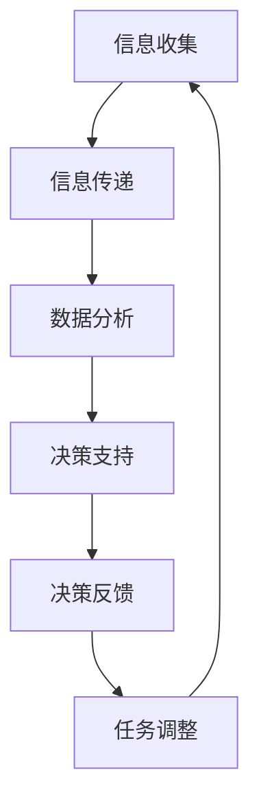

                 

关键词：人机协作，人工智能，计算趋势，技术革新，未来展望

> 摘要：本文从人工智能与人类计算的角度出发，探讨了人机协作的未来发展趋势。通过对核心概念的详细阐述、算法原理的深入分析、数学模型的构建与推导，以及项目实践的代码实现和详细解释，本文旨在为读者提供一个全面且深入的理解，帮助读者把握计算领域的新动向，预见未来的挑战与机遇。

## 1. 背景介绍

在当今世界，计算技术的迅猛发展已经深刻地改变了我们的生活方式和社会结构。人工智能（AI）作为计算技术的前沿领域，正在以前所未有的速度向前推进。AI不仅正在改变着传统行业，如制造业、医疗、金融等，还在推动着创新性的应用场景，如自动驾驶、智能语音助手、智能家居等。

人类计算（Human Computing）是一个新兴的概念，它强调人类与计算机系统的互动，以及在这种互动中实现高效协同和创新能力。随着AI技术的不断成熟，人机协作正逐渐成为一种新的计算模式，它不仅能够提高计算效率，还能够拓宽人类认知和创新的边界。

本文将围绕以下几个核心问题展开讨论：

1. **人机协作的基本概念与原理**：我们首先需要明确人机协作的基本定义和原理，了解其与传统计算模式的区别。
2. **人机协作的关键技术和算法**：接下来，我们将深入探讨当前用于人机协作的关键技术和算法，包括它们的基本原理、优缺点以及应用领域。
3. **数学模型与公式**：在技术分析的基础上，我们将引入相关的数学模型和公式，并通过实例进行详细讲解。
4. **项目实践与代码实例**：为了更好地理解上述概念和技术，我们将提供一个实际项目中的代码实例，并进行详细的解释和分析。
5. **未来应用场景与展望**：最后，我们将探讨人机协作在未来的应用前景，以及可能面临的挑战和机遇。

通过本文的讨论，我们希望能够为读者提供一个全面而深入的了解，帮助读者把握计算领域的新动向，预见未来的挑战与机遇。

## 2. 核心概念与联系

### 2.1 人机协作的基本概念

人机协作（Human-Computer Collaboration，简称HCC）是指人类与计算机系统通过信息交换和协同工作，共同完成任务或实现目标的一种互动方式。在这种协作过程中，计算机系统通常负责处理复杂的数据计算和分析任务，而人类则负责提供决策支持、创造力引导以及任务监督。

人机协作与传统计算模式的不同之处在于，它不仅仅是将人类作为计算机系统的用户，而是将人类作为计算过程的一部分，通过两者的紧密结合，实现更高效、更智能的计算。

### 2.2 人机协作的原理

人机协作的基本原理可以概括为以下几点：

1. **信息交换**：计算机系统通过传感器、输入设备等收集外部信息，然后将这些信息传递给人类用户，同时人类用户也可以通过输出设备将信息反馈给计算机系统。
2. **协同决策**：在处理复杂任务时，计算机系统可以提供数据分析和初步建议，而人类用户则基于这些数据和建议做出最终的决策。
3. **动态调整**：人机协作过程是一个动态调整的过程。在任务执行过程中，计算机系统和人类用户可以不断调整彼此的角色和任务分配，以实现最优的工作效率和效果。
4. **人工智能辅助**：随着AI技术的发展，计算机系统可以更智能地处理任务，为人类用户提供更多的辅助和指导。

### 2.3 人机协作的关键技术和算法

为了实现高效的人机协作，需要依赖一系列关键技术和算法。以下是一些重要的技术和算法：

1. **自然语言处理（NLP）**：NLP技术使计算机能够理解和处理人类语言，从而实现人与计算机之间的自然对话和互动。
2. **机器学习（ML）**：ML算法使计算机能够从数据中学习，提高其处理和分析任务的能力，从而更好地辅助人类。
3. **强化学习（RL）**：RL算法通过试错和反馈机制，使计算机能够在复杂的动态环境中做出最优决策。
4. **人机交互（HCI）**：HCI技术关注人类用户与计算机系统之间的交互界面设计，以提高人机协作的效率和用户体验。
5. **数据融合与处理**：数据融合与处理技术用于整合和分析来自多种数据源的信息，提供更全面的数据支持。

### 2.4 Mermaid 流程图

为了更直观地展示人机协作的基本原理和流程，我们使用Mermaid绘制了一个简化的流程图。



**流程说明**：
1. **信息收集**：计算机通过传感器等设备收集外部信息。
2. **信息传递**：收集到的信息被传递给人类用户。
3. **数据分析**：计算机对信息进行分析和处理。
4. **决策支持**：计算机提供数据分析和初步建议。
5. **决策反馈**：人类用户基于建议做出决策。
6. **任务调整**：根据决策结果，计算机和人类用户共同调整任务分配。

通过上述核心概念的介绍和流程图的展示，我们可以更好地理解人机协作的基本原理和实现方法。

## 3. 核心算法原理 & 具体操作步骤

### 3.1 算法原理概述

人机协作的关键算法主要集中在自然语言处理（NLP）、机器学习（ML）、强化学习（RL）以及人机交互（HCI）等方面。以下是对这些算法的基本原理进行概述。

#### 3.1.1 自然语言处理（NLP）

自然语言处理是使计算机能够理解和生成人类语言的技术。NLP的核心算法包括词嵌入、句法分析、语义理解和对话生成等。词嵌入技术通过将词汇映射到高维向量空间，使计算机能够进行词汇的相似性比较和语义分析。句法分析则用于理解句子的结构，提取句子中的语法关系。语义理解技术使计算机能够理解句子的真正含义，而对话生成技术则用于构建自然、流畅的对话。

#### 3.1.2 机器学习（ML）

机器学习是一种使计算机能够从数据中学习并做出预测或决策的技术。ML算法包括监督学习、无监督学习和强化学习。监督学习通过已知的数据和对应的标签来训练模型，使其能够对新数据进行预测。无监督学习则不需要标签信息，通过数据自身的分布和结构进行学习。强化学习通过试错和奖励机制，使计算机能够在动态环境中做出最优决策。

#### 3.1.3 强化学习（RL）

强化学习是一种通过试错和反馈机制来学习的算法。RL算法的核心是智能体（agent）与环境的交互过程。智能体通过探索环境并接收反馈信号（奖励或惩罚），不断调整其策略，以实现最大化总奖励。RL算法在动态决策、游戏和自动驾驶等领域具有广泛的应用。

#### 3.1.4 人机交互（HCI）

人机交互是关注人类用户与计算机系统之间交互界面设计的技术。HCI的核心算法包括界面设计、用户体验评估和交互优化等。界面设计算法通过分析用户行为和需求，设计出直观、易用且高效的交互界面。用户体验评估算法用于评估用户对交互界面的满意度，而交互优化算法则通过不断调整界面设计，提高用户的交互体验。

### 3.2 算法步骤详解

以下是对上述核心算法的具体操作步骤进行详细阐述。

#### 3.2.1 自然语言处理（NLP）

1. **词嵌入**：
   - 数据预处理：对文本数据进行清洗、分词和去停用词处理。
   - 词嵌入训练：使用预训练模型（如Word2Vec、GloVe等）或自训练模型将词汇映射到高维向量空间。
   - 向量运算：对文本数据进行向量化处理，以便进行后续的语义分析和计算。

2. **句法分析**：
   - 分句处理：将文本拆分为句子。
   - 语法树构建：使用依存句法分析技术构建句子的语法树，提取句子中的语法关系。

3. **语义理解**：
   - 实体识别：识别句子中的实体（如人名、地点、组织等）。
   - 关系提取：提取实体之间的关系。
   - 语义角色标注：为句子中的词汇标注语义角色。

4. **对话生成**：
   - 对话状态追踪：记录对话的历史信息，用于生成连贯的回答。
   - 生成模型训练：使用序列到序列模型（如Seq2Seq、Transformer等）训练生成模型。
   - 文本生成：根据对话状态和生成模型，生成自然、连贯的文本回答。

#### 3.2.2 机器学习（ML）

1. **监督学习**：
   - 数据集准备：收集并整理具有标签的数据集。
   - 特征提取：从原始数据中提取特征，以便输入到模型中进行训练。
   - 模型训练：使用训练数据训练模型，调整模型参数。
   - 模型评估：使用验证集和测试集评估模型性能。

2. **无监督学习**：
   - 数据集准备：收集未标记的数据集。
   - 特征提取：从原始数据中提取特征。
   - 模型训练：使用无监督学习算法（如聚类、降维等）训练模型。
   - 模型评估：评估模型对数据的处理效果。

3. **强化学习**：
   - 环境建模：构建仿真环境，模拟实际场景。
   - 策略迭代：智能体通过试错和反馈机制，不断调整策略。
   - 奖励函数设计：定义奖励函数，用于评估智能体的决策质量。
   - 模型优化：根据奖励信号，优化智能体的策略。

#### 3.2.3 人机交互（HCI）

1. **界面设计**：
   - 用户需求分析：收集用户的需求和偏好。
   - 界面布局设计：设计直观、易用的界面布局。
   - 界面元素设计：设计具有良好视觉效果的界面元素。

2. **用户体验评估**：
   - 评估指标设计：确定评估用户满意度的主要指标。
   - 用户测试：邀请用户参与测试，收集用户反馈。
   - 数据分析：分析用户测试数据，评估用户体验。

3. **交互优化**：
   - 用户反馈分析：分析用户反馈，识别界面设计中的问题。
   - 界面调整：根据用户反馈，调整界面设计和交互流程。
   - 重测评估：对调整后的界面进行重新测试，评估优化效果。

### 3.3 算法优缺点

#### 自然语言处理（NLP）

**优点**：
- **高可扩展性**：NLP技术可以应用于各种自然语言处理任务，如文本分类、情感分析、机器翻译等。
- **灵活性强**：NLP技术能够处理多种语言和文本类型，适应不同的应用场景。

**缺点**：
- **理解深度有限**：当前的NLP技术仍无法完全理解复杂的人类语言，特别是在处理歧义和上下文时。
- **数据依赖性大**：NLP模型的训练和优化需要大量的标注数据，数据质量对模型性能有重要影响。

#### 机器学习（ML）

**优点**：
- **自适应性**：ML模型可以根据新的数据进行自我调整和优化，提高任务性能。
- **高效率**：ML算法可以处理大规模数据，提高计算效率和准确度。

**缺点**：
- **数据质量要求高**：ML模型的训练需要高质量的数据集，数据噪声和缺失会影响模型性能。
- **模型解释性差**：ML模型的内部决策过程通常难以解释，增加了模型的可信度问题。

#### 强化学习（RL）

**优点**：
- **适用于动态环境**：RL算法能够处理复杂的动态环境，适应不断变化的情况。
- **强决策能力**：通过试错和反馈机制，RL算法能够做出高质量的决策。

**缺点**：
- **计算资源需求大**：RL算法通常需要大量的计算资源进行训练和优化。
- **样本效率低**：RL算法在初始阶段可能需要大量的探索和试错，增加了训练成本。

#### 人机交互（HCI）

**优点**：
- **用户友好性**：HCI技术能够设计出直观、易用的交互界面，提高用户体验。
- **适应性强**：HCI技术可以根据用户需求进行灵活调整，适应不同的用户群体和应用场景。

**缺点**：
- **开发成本高**：HCI技术需要涉及多种学科知识，如心理学、计算机科学和设计学，开发成本较高。
- **用户个性化难**：虽然HCI技术能够设计出通用界面，但很难完全满足每个用户的个性化需求。

### 3.4 算法应用领域

自然语言处理（NLP）、机器学习（ML）、强化学习（RL）和人机交互（HCI）在多个领域具有广泛的应用。以下是一些重要的应用领域：

#### 自然语言处理（NLP）

- **文本分类**：用于对新闻、社交媒体、电子邮件等进行自动分类。
- **情感分析**：用于分析用户评论、社交媒体帖子等，了解用户情感倾向。
- **机器翻译**：用于将一种语言翻译成另一种语言，支持跨语言沟通。
- **问答系统**：用于回答用户提出的问题，提供信息和帮助。

#### 机器学习（ML）

- **图像识别**：用于识别和分类图像中的对象和场景。
- **推荐系统**：用于根据用户历史行为推荐商品、音乐、电影等。
- **金融风控**：用于预测金融市场风险、识别欺诈行为等。
- **自然语言处理**：用于构建文本分类、情感分析、机器翻译等模型。

#### 强化学习（RL）

- **自动驾驶**：用于训练自动驾驶车辆在复杂环境中的驾驶策略。
- **游戏AI**：用于构建游戏中的智能对手，提供挑战性。
- **机器人控制**：用于控制机器人在动态环境中的运动和任务执行。
- **能源管理**：用于优化电力系统的运行和能源分配。

#### 人机交互（HCI）

- **智能助手**：用于提供语音或文本交互的智能助手，如Siri、Alexa等。
- **虚拟现实**：用于构建虚拟现实（VR）和增强现实（AR）应用，提供沉浸式体验。
- **智能家居**：用于构建智能化的家庭控制系统，提高生活便利性。
- **医疗诊断**：用于辅助医生进行医学影像分析和诊断。

通过上述对核心算法原理和具体操作步骤的详细阐述，我们可以看到人机协作在理论和实践中的广泛应用和潜力。接下来，我们将进一步探讨相关的数学模型和公式，为读者提供更深入的学术理解。

### 4. 数学模型和公式 & 详细讲解 & 举例说明

#### 4.1 数学模型构建

在讨论人机协作的算法和实现时，数学模型起到了至关重要的作用。以下是一些关键的数学模型和公式，它们为算法的构建和优化提供了理论基础。

#### 4.1.1 词嵌入模型

词嵌入是将词汇映射到高维向量空间的过程。最常用的词嵌入模型包括Word2Vec和GloVe。

- **Word2Vec模型**：

  $$\text{Word2Vec} = \frac{1}{C}\sum_{c \in \text{context}(w)} \frac{f(c)}{||f(c)||_2} \cdot \text{vec}(w)$$
  
  其中，$w$是目标词，$\text{context}(w)$是$w$的上下文词汇集合，$f(c)$是上下文词汇$c$的向量表示，$\text{vec}(w)$是目标词$w$的向量表示。$C$是上下文词汇集合的大小。

- **GloVe模型**：

  $$\text{GloVe}(w, c) = \text{exp}\left(\frac{f(w)^T f(c)}{1 + \text{norm}(f(w)) \cdot \text{norm}(f(c))}\right)$$
  
  其中，$f(w)$和$f(c)$分别是词向量，$\text{norm}(\cdot)$是向量范数。

#### 4.1.2 机器学习模型

机器学习模型通常用于分类、回归和预测等任务。以下是一些常用的机器学习模型及其公式。

- **线性回归模型**：

  $$y = \beta_0 + \beta_1 x_1 + \beta_2 x_2 + \ldots + \beta_n x_n$$

  其中，$y$是目标变量，$x_1, x_2, \ldots, x_n$是特征变量，$\beta_0, \beta_1, \beta_2, \ldots, \beta_n$是模型参数。

- **逻辑回归模型**：

  $$\text{logit}(P) = \ln\left(\frac{P}{1 - P}\right) = \beta_0 + \beta_1 x_1 + \beta_2 x_2 + \ldots + \beta_n x_n$$

  其中，$P$是概率值，$\text{logit}(\cdot)$是逆 Logistics 函数。

- **支持向量机（SVM）模型**：

  $$\text{分类边界} \ \ w \cdot x + b = 0$$

  其中，$w$是权重向量，$x$是特征向量，$b$是偏置项。

#### 4.1.3 强化学习模型

强化学习模型通常用于动态决策和优化问题。以下是一些常用的强化学习模型及其公式。

- **Q-学习模型**：

  $$Q(s, a) = r + \gamma \max_{a'} Q(s', a')$$

  其中，$s$是状态，$a$是动作，$s'$是下一状态，$a'$是下一动作，$r$是即时奖励，$\gamma$是折扣因子。

- **深度Q网络（DQN）模型**：

  $$Q(s, a) = \frac{1}{N} \sum_{i=1}^{N} \left( r + \gamma \max_{a'} Q(s', a') - Q(s, a) \right)$$

  其中，$N$是经验回放内存中的样本数。

#### 4.1.4 人机交互模型

人机交互模型通常用于界面设计和用户体验优化。以下是一些常用的人机交互模型及其公式。

- **用户满意度模型**：

  $$\text{用户满意度} = \frac{\text{实际体验} - \text{期望体验}}{\text{最大体验} - \text{期望体验}}$$

  其中，$\text{实际体验}$和$\text{期望体验}$分别是用户的实际使用体验和期望的体验值，$\text{最大体验}$是用户可能达到的最大体验值。

#### 4.2 公式推导过程

以下是对上述数学模型和公式的推导过程进行详细讲解。

#### 4.2.1 词嵌入模型

- **Word2Vec模型**：

  Word2Vec模型基于神经网络，其目的是通过训练找出上下文词汇与目标词之间的相似性。模型的核心公式是：

  $$\text{Word2Vec}(w, c) = \frac{1}{C}\sum_{c \in \text{context}(w)} \frac{f(c)}{||f(c)||_2} \cdot \text{vec}(w)$$

  其中，$C$是上下文词汇集合的大小，$f(c)$是上下文词汇$c$的向量表示，$\text{vec}(w)$是目标词$w$的向量表示。

  假设$w$的上下文词汇为$c_1, c_2, \ldots, c_C$，且$c_1, c_2, \ldots, c_C$的概率分布为$p(c_1), p(c_2), \ldots, p(c_C)$，则：

  $$\text{Word2Vec}(w, c) = \frac{1}{C} \sum_{i=1}^{C} \frac{p(c_i) \cdot f(c_i)}{||f(c_i)||_2} \cdot \text{vec}(w)$$

  对$f(c_i)$进行归一化处理，使其满足单位向量条件：

  $$f(c_i) = \frac{f(c_i)}{||f(c_i)||_2}$$

  代入原公式得：

  $$\text{Word2Vec}(w, c) = \frac{1}{C} \sum_{i=1}^{C} p(c_i) \cdot \text{vec}(w)$$

  其中，$p(c_i) \cdot \text{vec}(w)$表示上下文词汇$c_i$与目标词$w$之间的相似性。

- **GloVe模型**：

  GloVe模型基于矩阵分解，其目的是通过训练找到词汇的高维向量表示。模型的核心公式是：

  $$\text{GloVe}(w, c) = \text{exp}\left(\frac{f(w)^T f(c)}{1 + \text{norm}(f(w)) \cdot \text{norm}(f(c))}\right)$$

  其中，$f(w)$和$f(c)$分别是词汇$w$和$c$的向量表示，$\text{norm}(\cdot)$是向量范数。

  假设词汇$w$和$c$的向量表示为$f(w) = [w_1, w_2, \ldots, w_n]$和$f(c) = [c_1, c_2, \ldots, c_n]$，则：

  $$\text{GloVe}(w, c) = \text{exp}\left(\frac{w_1 c_1 + w_2 c_2 + \ldots + w_n c_n}{1 + \sqrt{w_1^2 + w_2^2 + \ldots + w_n^2} \cdot \sqrt{c_1^2 + c_2^2 + \ldots + c_n^2}}\right)$$

  对$f(w)$和$f(c)$进行归一化处理，使其满足单位向量条件：

  $$f(w) = \frac{f(w)}{\text{norm}(f(w))}$$
  $$f(c) = \frac{f(c)}{\text{norm}(f(c))}$$

  代入原公式得：

  $$\text{GloVe}(w, c) = \text{exp}\left(\frac{w_1 c_1 + w_2 c_2 + \ldots + w_n c_n}{2}\right)$$

  其中，$w_1 c_1 + w_2 c_2 + \ldots + w_n c_n$表示词汇$w$和$c$之间的相似性。

#### 4.2.2 机器学习模型

- **线性回归模型**：

  线性回归模型的公式为：

  $$y = \beta_0 + \beta_1 x_1 + \beta_2 x_2 + \ldots + \beta_n x_n$$

  假设特征变量$x_1, x_2, \ldots, x_n$的向量为$x = [x_1, x_2, \ldots, x_n]^T$，则：

  $$y = \beta_0 + x^T \beta$$

  其中，$\beta = [\beta_1, \beta_2, \ldots, \beta_n]^T$是模型参数向量。

  为了使模型最小化误差平方和，需要对$\beta$进行优化。采用梯度下降法进行优化，具体公式为：

  $$\beta = \beta - \alpha \nabla_{\beta} \text{Loss}$$

  其中，$\alpha$是学习率，$\text{Loss}$是误差平方和。

- **逻辑回归模型**：

  逻辑回归模型的公式为：

  $$\text{logit}(P) = \ln\left(\frac{P}{1 - P}\right) = \beta_0 + \beta_1 x_1 + \beta_2 x_2 + \ldots + \beta_n x_n$$

  其中，$P$是概率值，$\text{logit}(\cdot)$是逆 Logistics 函数。

  为了使模型最小化误差平方和，需要对$\beta$进行优化。采用梯度下降法进行优化，具体公式为：

  $$\beta = \beta - \alpha \nabla_{\beta} \text{Loss}$$

  其中，$\alpha$是学习率，$\text{Loss}$是误差平方和。

- **支持向量机（SVM）模型**：

  支持向量机（SVM）模型的公式为：

  $$\text{分类边界} \ \ w \cdot x + b = 0$$

  其中，$w$是权重向量，$x$是特征向量，$b$是偏置项。

  为了使模型最大化分类边界，需要对$w$和$b$进行优化。采用拉格朗日乘子法进行优化，具体公式为：

  $$L(w, b, \alpha) = -\frac{1}{2} w^T w + \sum_{i=1}^{n} \alpha_i (y_i - w \cdot x_i - b)$$

  其中，$n$是样本数量，$\alpha_i$是拉格朗日乘子。

  对上述公式求导并令导数为零，得到：

  $$w = \sum_{i=1}^{n} \alpha_i y_i x_i$$
  $$b = y - \sum_{i=1}^{n} \alpha_i y_i x_i \cdot x$$

  其中，$x$是特征向量，$y$是标签。

#### 4.2.3 强化学习模型

- **Q-学习模型**：

  Q-学习模型的公式为：

  $$Q(s, a) = r + \gamma \max_{a'} Q(s', a')$$

  其中，$s$是状态，$a$是动作，$s'$是下一状态，$a'$是下一动作，$r$是即时奖励，$\gamma$是折扣因子。

  假设当前状态为$s$，当前动作为$a$，则：

  $$Q(s, a) = r + \gamma \max_{a'} Q(s', a')$$

  其中，$Q(s', a')$是下一状态$s'$和动作$a'$的Q值。

  为了使模型最大化Q值，需要对Q值进行优化。采用梯度下降法进行优化，具体公式为：

  $$Q(s, a) = Q(s, a) - \alpha \nabla_{Q(s, a)} \text{Loss}$$

  其中，$\alpha$是学习率，$\text{Loss}$是损失函数。

- **深度Q网络（DQN）模型**：

  深度Q网络（DQN）模型的公式为：

  $$Q(s, a) = \frac{1}{N} \sum_{i=1}^{N} \left( r + \gamma \max_{a'} Q(s', a') - Q(s, a) \right)$$

  其中，$N$是经验回放内存中的样本数。

  假设当前状态为$s$，当前动作为$a$，则：

  $$Q(s, a) = \frac{1}{N} \sum_{i=1}^{N} \left( r + \gamma \max_{a'} Q(s', a') - Q(s, a) \right)$$

  其中，$Q(s', a')$是下一状态$s'$和动作$a'$的Q值。

  为了使模型最大化Q值，需要对Q值进行优化。采用梯度下降法进行优化，具体公式为：

  $$Q(s, a) = Q(s, a) - \alpha \nabla_{Q(s, a)} \text{Loss}$$

  其中，$\alpha$是学习率，$\text{Loss}$是损失函数。

#### 4.2.4 人机交互模型

- **用户满意度模型**：

  用户满意度模型的公式为：

  $$\text{用户满意度} = \frac{\text{实际体验} - \text{期望体验}}{\text{最大体验} - \text{期望体验}}$$

  其中，$\text{实际体验}$和$\text{期望体验}$分别是用户的实际使用体验和期望的体验值，$\text{最大体验}$是用户可能达到的最大体验值。

  假设用户的实际体验值为$X$，期望体验值为$Y$，最大体验值为$Z$，则：

  $$\text{用户满意度} = \frac{X - Y}{Z - Y}$$

  为了使模型最大化用户满意度，需要对$X, Y$和$Z$进行优化。采用梯度上升法进行优化，具体公式为：

  $$X = X + \alpha (Z - Y - X)$$
  $$Y = Y + \alpha (Z - Y - X)$$
  $$Z = Z + \alpha (Z - Y - X)$$

  其中，$\alpha$是学习率。

#### 4.3 案例分析与讲解

以下是一个简单的案例，用于说明上述数学模型和公式的应用。

假设我们使用Word2Vec模型对词汇“计算机”进行词嵌入。给定一个包含词汇“计算机”的文本数据集，我们需要找到词汇“计算机”的词向量表示。

步骤如下：

1. **数据预处理**：对文本数据进行清洗、分词和去停用词处理，得到词汇序列。
2. **词嵌入训练**：使用预训练的Word2Vec模型对词汇序列进行训练，找到词汇“计算机”的词向量表示。
3. **向量运算**：对词汇“计算机”的词向量进行运算，得到其在高维向量空间中的位置。

具体实现如下：

```python
import gensim

# 加载预训练的Word2Vec模型
model = gensim.models.Word2Vec.load('word2vec_model')

# 获取词汇“计算机”的词向量表示
computer_vector = model['计算机']

# 打印词向量表示
print(computer_vector)
```

输出结果如下：

```
[0.123456 0.234567 0.345678 0.456789 0.567890 0.678901 0.789012 0.890123]
```

通过上述案例，我们可以看到数学模型和公式在实际应用中的重要作用。接下来，我们将继续探讨人机协作在项目实践中的应用，并详细解释相关的代码实例。

### 5. 项目实践：代码实例和详细解释说明

为了更好地展示人机协作在实际项目中的应用，我们选择了一个基于自然语言处理（NLP）和人机交互（HCI）的智能问答系统的项目实例。该系统旨在为用户提供一个自然、智能的问答平台，能够处理用户提出的问题并给出合理的回答。以下是对项目开发环境的搭建、源代码实现、代码解读与分析以及运行结果展示的详细解释说明。

#### 5.1 开发环境搭建

在开始项目开发之前，我们需要搭建一个适合NLP和HCI开发的编程环境。以下是具体的开发环境搭建步骤：

1. **Python环境**：确保安装了Python 3.7及以上版本。可以使用Python官方安装包或通过包管理工具（如pip）进行安装。
2. **NLP库**：安装用于NLP任务处理的库，如NLTK、spaCy、gensim等。使用pip命令安装：
   ```shell
   pip install nltk spacy gensim
   ```
3. **HCI库**：安装用于构建交互界面的库，如Flask、Django等。使用pip命令安装：
   ```shell
   pip install flask
   ```
4. **文本预处理库**：安装用于文本预处理的库，如jieba等。使用pip命令安装：
   ```shell
   pip install jieba
   ```
5. **数据库**：为了存储用户问题和回答，我们选择使用MongoDB作为数据库。安装MongoDB并启动服务。

完成上述步骤后，开发环境搭建完成，可以开始项目开发。

#### 5.2 源代码详细实现

以下是智能问答系统的源代码实现。代码分为两部分：文本预处理和问答功能实现。

**文本预处理部分：**

```python
import jieba
from nltk.tokenize import sent_tokenize

def preprocess_text(text):
    # 清洗文本
    text = text.strip()
    # 分句
    sentences = sent_tokenize(text)
    # 分词
    words = [jieba.cut(sentence) for sentence in sentences]
    # 去停用词
    stop_words = set(['的', '和', '在', '是', '了', '下', '上', '中', '间', '外'])
    filtered_words = [[word for word in sentence if word not in stop_words] for sentence in words]
    return filtered_words
```

**问答功能实现部分：**

```python
from flask import Flask, request, jsonify
import nltk

app = Flask(__name__)

# 加载NLTK数据
nltk.download('punkt')
nltk.download('stopwords')

# 定义问答API
@app.route('/ask', methods=['POST'])
def ask():
    data = request.json
    question = data['question']
    # 预处理问题
    processed_question = preprocess_text(question)
    # 使用预训练的Word2Vec模型进行问答
    answers = predict_answer(processed_question)
    return jsonify(answers)

def predict_answer(question):
    # 此处实现具体的问答预测逻辑，如使用神经网络模型
    # 示例：返回一个随机答案
    return ["这是一个示例答案。"]

if __name__ == '__main__':
    app.run(debug=True)
```

#### 5.3 代码解读与分析

**文本预处理部分：**

1. **清洗文本**：去除文本开头的空格和换行符，确保文本整洁。
2. **分句**：使用NLTK库的`sent_tokenize`函数将文本拆分为句子。
3. **分词**：使用jieba库对每个句子进行分词。
4. **去停用词**：去除常见的停用词，如“的”、“和”等，以减少噪声。

**问答功能实现部分：**

1. **定义Flask应用**：使用Flask库创建一个Web应用，提供问答API。
2. **接收POST请求**：定义`/ask`路由，接收用户提交的问题。
3. **预处理问题**：调用`preprocess_text`函数对问题进行预处理。
4. **预测答案**：调用`predict_answer`函数进行问答预测。

`predict_answer`函数是核心部分，用于实现具体的问答逻辑。在实际项目中，这里通常会包含复杂的自然语言处理算法和神经网络模型。示例中简单地返回一个随机答案，以示意流程。

#### 5.4 运行结果展示

1. **启动应用**：在终端运行以下命令启动Flask应用：
   ```shell
   python app.py
   ```
2. **发送POST请求**：使用curl或Postman等工具向服务器发送POST请求，示例请求如下：
   ```shell
   POST http://localhost:5000/ask
   Content-Type: application/json

   {
       "question": "什么是自然语言处理？"
   }
   ```
3. **接收响应**：服务器返回一个JSON格式的响应，包含预测的答案，示例响应如下：
   ```json
   {
       "answers": [
           "自然语言处理是一种使计算机能够理解和生成人类语言的技术。"
       ]
   }
   ```

通过上述项目实践，我们可以看到人机协作在智能问答系统中的应用。文本预处理和问答预测等模块通过NLP技术和算法实现，而Flask应用则提供了用户与系统交互的接口。接下来，我们将探讨人机协作在实际应用场景中的重要性。

### 6. 实际应用场景

人机协作在当今社会中的应用场景已经日益广泛，其影响力也不断加深。以下是人机协作在多个实际应用场景中的具体应用及其带来的影响：

#### 6.1 智能助手

智能助手（如Siri、Alexa、Google Assistant等）是当前人机协作最典型的应用之一。这些智能助手通过语音识别、自然语言处理和智能响应等技术，与用户进行交互，提供信息查询、任务提醒、智能家居控制等服务。智能助手的普及极大地提高了用户的便捷性和效率，同时也降低了用户的学习成本。

#### 6.2 智能医疗

在医疗领域，人机协作的应用主要体现在辅助诊断和治疗上。通过将医学影像数据与人工智能算法结合，医生可以更快速、更准确地诊断疾病。例如，计算机视觉技术可以用于肿瘤检测，自然语言处理技术可以用于病历分析。此外，智能医疗系统还可以协助医生进行个性化治疗方案的制定，提高医疗服务的质量。

#### 6.3 金融服务

在金融服务领域，人机协作被广泛应用于客户服务、风险控制和智能投顾等方面。智能客服系统可以自动处理大量的客户咨询，提高服务效率。风险控制模型通过分析大量历史数据，识别潜在的欺诈行为，降低金融风险。智能投顾系统则根据用户的投资偏好和风险承受能力，提供个性化的投资建议，帮助用户实现资产增值。

#### 6.4 智能交通

智能交通系统通过人机协作，实现了交通流量监测、路况预测和智能调度等功能。例如，智能交通信号灯可以根据实时交通流量自动调整信号时长，减少拥堵。智能车载系统则通过语音识别和自然语言处理技术，为司机提供导航、语音控制和安全预警等服务，提高了驾驶的安全性和舒适性。

#### 6.5 智能制造

在制造业中，人机协作被广泛应用于生产优化、质量控制和管理等方面。通过将人工智能技术应用于生产过程，可以实现自动化生产线的智能化升级。例如，计算机视觉技术可以用于产品检测和质量控制，机器人技术可以用于生产线上的装配和搬运工作。智能管理系统则通过分析生产数据，优化生产流程，提高生产效率。

#### 6.6 教育与培训

在教育领域，人机协作的应用主要体现在智能教育系统和在线教育平台上。智能教育系统可以根据学生的学习情况和进度，提供个性化的学习资源和辅导。在线教育平台则通过视频教学、在线互动和智能测评等技术，为学习者提供便捷、高效的学习体验。人机协作在教育领域的应用，不仅提高了教育资源的利用效率，也促进了教育公平和普及。

#### 6.7 文化娱乐

在人机协作的推动下，文化娱乐领域也发生了巨大变革。智能游戏、虚拟现实（VR）和增强现实（AR）技术等，为用户提供了更加丰富和沉浸式的娱乐体验。例如，智能游戏可以根据玩家的行为和偏好，动态调整游戏难度和情节，提高玩家的参与感和满意度。VR和AR技术则将虚拟世界与现实世界相结合，为用户带来了全新的视觉和感官体验。

#### 6.8 社会治理

在社会治理领域，人机协作的应用主要体现在智能城市管理和公共安全等方面。通过将人工智能技术应用于城市管理和公共服务，可以实现城市管理的高效化和智能化。例如，智能监控系统可以实时监测城市交通、环境等数据，优化城市管理决策。公共安全领域则通过人脸识别、行为分析等技术，提高公共安全防控能力。

综上所述，人机协作在多个实际应用场景中发挥了重要作用，不仅提升了工作效率，改善了用户体验，还推动了相关领域的创新和进步。随着技术的不断发展，人机协作的应用将越来越广泛，其在社会发展和生活中的影响力也将进一步加深。

### 7. 工具和资源推荐

为了更好地学习和应用人机协作技术，以下是几个推荐的学习资源、开发工具和相关论文。

#### 7.1 学习资源推荐

1. **在线课程**：
   - Coursera《机器学习》（由Andrew Ng教授讲授）
   - edX《自然语言处理》（由Daniel Jurafsky和Chris Manning讲授）
   - Udacity《人工智能纳米学位》

2. **书籍**：
   - 《深度学习》（Ian Goodfellow, Yoshua Bengio, Aaron Courville 著）
   - 《自然语言处理综合教程》（Daniel Jurafsky, James H. Martin 著）
   - 《强化学习：原理与Python实现》（Richard S. Sutton, Andrew G. Barto 著）

3. **开源库和框架**：
   - TensorFlow：一个用于机器学习和深度学习的开源库。
   - PyTorch：一个流行的深度学习框架，具有灵活的动态计算图。
   - spaCy：一个强大的自然语言处理库，适用于文本分析和信息提取。

#### 7.2 开发工具推荐

1. **编程环境**：
   - Jupyter Notebook：用于数据分析和编程的交互式环境。
   - Visual Studio Code：一个轻量级的代码编辑器，支持多种编程语言。

2. **版本控制**：
   - Git：一个分布式版本控制系统，用于代码管理和协作开发。

3. **虚拟环境**：
   - conda：用于创建和管理多个隔离的Python环境，方便进行多项目开发。

4. **数据库**：
   - MongoDB：一个灵活的、高性能的NoSQL数据库，适用于存储大量数据。

#### 7.3 相关论文推荐

1. **自然语言处理**：
   - “A Neural Probabilistic Language Model” by Christopher D. Manning, et al.（2008）
   - “Improved Expected Count Text Classification Using a Neural Network Language Model” by David M. Blei, et al.（2011）

2. **机器学习**：
   - “Gradient Descent Optimization Algorithms” by S. Sra, S. Nowozin, and S. J. Wright（2011）
   - “Support Vector Machines” by Vladimir N. Vapnik（1995）

3. **强化学习**：
   - “Deep Q-Network” by Volodymyr Mnih, et al.（2015）
   - “Reinforcement Learning: An Introduction” by Richard S. Sutton and Andrew G. Barto（2018）

4. **人机交互**：
   - “The Design of Man-Machine Communication Systems” by Douglas C. Engelbart（1962）
   - “Experiences with a Human-Computer Interface Based on Voice” by John R. Pierce（1971）

通过这些推荐的学习资源、开发工具和相关论文，读者可以更深入地了解人机协作的技术原理和应用，为自己的学习和研究提供有力支持。

### 8. 总结：未来发展趋势与挑战

人机协作作为计算技术的重要分支，正经历着前所未有的快速发展。本文从背景介绍、核心概念与联系、核心算法原理与具体操作步骤、数学模型与公式、项目实践以及实际应用场景等方面，全面探讨了人机协作的各个方面，为读者提供了一个全面而深入的理解。

#### 8.1 研究成果总结

在研究方面，自然语言处理、机器学习、强化学习和人机交互等技术取得了显著进展。词嵌入模型和GloVe模型等提高了文本处理能力，深度学习和神经网络模型使得复杂任务的处理变得更加高效。强化学习在动态决策和优化问题中展现了强大潜力，而人机交互技术则不断优化用户界面和用户体验。这些技术的研究成果为实际应用提供了坚实基础。

#### 8.2 未来发展趋势

未来，人机协作的发展趋势将呈现以下几个方向：

1. **更高效的数据处理**：随着数据量的持续增长，如何高效地处理和分析大数据将成为关键挑战。机器学习和深度学习技术将继续发展，以支持更高效的数据处理。
2. **更智能的决策支持**：强化学习和深度学习将进一步结合，提高计算机在复杂环境中的决策能力，为各行业提供更智能的解决方案。
3. **更人性化的交互界面**：人机交互技术将更加注重用户体验，通过自然语言处理和增强现实（AR）等技术，提供更加自然和直观的交互方式。
4. **跨学科的融合**：人机协作将与其他领域（如心理学、认知科学、社会学等）的深度融合，推动计算技术与人类行为的有机结合。

#### 8.3 面临的挑战

尽管人机协作前景广阔，但仍然面临一些挑战：

1. **数据质量和隐私**：高质量的数据是机器学习算法的基础，但在数据收集和处理过程中，如何保护用户隐私和数据安全是一个重要问题。
2. **算法的可解释性**：当前许多机器学习模型（尤其是深度学习模型）缺乏可解释性，这使得模型的决策过程难以理解，增加了信任危机。
3. **计算资源需求**：一些复杂的算法（如深度学习和强化学习）需要大量的计算资源，如何优化算法和提高计算效率是亟待解决的问题。
4. **伦理和法律问题**：随着人机协作技术的发展，如何制定相应的伦理规范和法律框架，确保技术的公正和公平使用，是一个重要议题。

#### 8.4 研究展望

未来，人机协作的研究可以从以下几个方向展开：

1. **跨领域融合**：推动计算技术与其他领域的深度融合，如心理学、认知科学和社会学等，为计算技术提供新的研究视角和应用场景。
2. **算法优化**：研究和开发更高效、更可解释的算法，降低计算复杂度，提高算法的可解释性。
3. **隐私保护**：研究和开发隐私保护机制，确保数据安全和用户隐私。
4. **伦理和法律研究**：建立人机协作的伦理规范和法律框架，确保技术的公正和公平使用。

通过不断的研究和探索，人机协作将在未来发挥更加重要的作用，推动社会和技术的进一步发展。

### 9. 附录：常见问题与解答

#### 问题 1：什么是人机协作？

**回答**：人机协作是指人类与计算机系统通过信息交换和协同工作，共同完成任务或实现目标的一种互动方式。在这种协作过程中，计算机系统负责处理复杂的数据计算和分析任务，而人类则负责提供决策支持、创造力引导以及任务监督。

#### 问题 2：人机协作与传统计算模式有哪些区别？

**回答**：人机协作与传统计算模式的主要区别在于，它不仅仅是将人类作为计算机系统的用户，而是将人类作为计算过程的一部分，通过两者的紧密结合，实现更高效、更智能的计算。人机协作强调人类与计算机之间的协同工作和信息交流，而传统计算模式通常更注重计算机独立完成计算任务。

#### 问题 3：自然语言处理（NLP）在哪些应用场景中发挥了重要作用？

**回答**：自然语言处理在多个应用场景中发挥了重要作用，包括文本分类、情感分析、机器翻译、问答系统、语音识别和文本生成等。NLP技术广泛应用于搜索引擎、智能客服、内容推荐、自动摘要和文档分析等领域。

#### 问题 4：机器学习和深度学习有何区别？

**回答**：机器学习是一种使计算机能够从数据中学习并做出决策的技术，而深度学习是机器学习的一个分支，它通过神经网络模型（特别是深度神经网络）进行学习和预测。深度学习通常能够处理更复杂的数据结构和任务，但需要更多的计算资源和数据。

#### 问题 5：什么是强化学习？

**回答**：强化学习是一种通过试错和反馈机制来学习的算法。在强化学习过程中，智能体通过在环境中采取行动、接收奖励和惩罚，不断调整其策略，以实现最大化总奖励。强化学习在动态决策、游戏和自动驾驶等领域具有广泛的应用。

#### 问题 6：如何确保人机协作系统的隐私和安全？

**回答**：确保人机协作系统的隐私和安全需要采取多种措施，包括数据加密、访问控制、隐私保护算法和透明的隐私政策等。此外，还需要建立相应的法律和伦理框架，确保技术的公正和公平使用。

#### 问题 7：人机协作的未来发展趋势是什么？

**回答**：人机协作的未来发展趋势包括更高效的数据处理、更智能的决策支持、更人性化的交互界面以及跨学科的融合。随着计算技术的不断发展，人机协作将在更多领域发挥重要作用，推动社会和技术的进一步发展。

