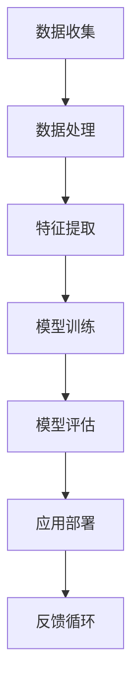

                 

关键词：人工智能、就业前景、技能需求、未来趋势、技术发展

> 摘要：本文将探讨人工智能时代背景下，未来就业市场的变化趋势以及相关技能的需求。随着AI技术的迅速发展，传统职业受到挑战，新的就业机会不断涌现。本文将分析这些变化，为读者提供关于未来职业规划和技术学习的一些建议。

## 1. 背景介绍

### 1.1 人工智能的快速发展

人工智能（AI）技术在过去几十年里取得了飞速发展。从早期的专家系统到如今的深度学习、强化学习等，AI已经在各个领域展现出了强大的能力。特别是在图像识别、自然语言处理、自动驾驶等方面，AI已经取得了显著的成果。

### 1.2 传统职业的变革

随着AI技术的不断进步，许多传统职业正面临着被自动化取代的风险。例如，制造业中的流水线工人、金融行业中的分析员、甚至一些专业领域的医生和律师，都可能因为AI技术的发展而面临就业压力。

### 1.3 新兴职业的崛起

尽管传统职业受到冲击，但AI技术的快速发展也为新兴职业提供了机会。例如，数据科学家、机器学习工程师、AI算法研究员等职位需求不断增加。此外，一些与AI相关的领域，如虚拟现实、增强现实、区块链等，也在逐渐兴起，为职业发展提供了新的方向。

## 2. 核心概念与联系

为了更好地理解人工智能时代下的就业市场，我们需要先了解一些核心概念。

### 2.1 人工智能的概念

人工智能是指使计算机系统具备人类智能特性的技术和应用。它包括机器学习、深度学习、自然语言处理、计算机视觉等多个子领域。

### 2.2 AI技术的架构

以下是一个简化的AI技术架构图，展示了各个子领域之间的关系：



### 2.3 人工智能的应用领域

人工智能技术已经被广泛应用于各个领域，包括但不限于：

- **医疗健康**：用于疾病诊断、药物研发、健康管理等。
- **金融**：用于风险评估、信用评分、算法交易等。
- **制造**：用于质量控制、设备维护、自动化生产等。
- **交通**：用于自动驾驶、智能交通管理、物流优化等。
- **娱乐**：用于内容推荐、游戏开发、虚拟助手等。

## 3. 核心算法原理 & 具体操作步骤

### 3.1 算法原理概述

在人工智能领域，算法是实现智能的核心。以下是一些核心算法的原理概述：

#### 3.1.1 机器学习

机器学习是一种让计算机通过数据学习并做出决策的技术。主要分为监督学习、无监督学习和强化学习三种。

- **监督学习**：通过标记好的训练数据学习，例如分类和回归问题。
- **无监督学习**：没有标记的数据学习，例如聚类和降维。
- **强化学习**：通过与环境交互来学习最优策略，例如游戏和机器人控制。

#### 3.1.2 深度学习

深度学习是机器学习的一种，它使用多层神经网络来模拟人脑的处理方式。主要算法包括卷积神经网络（CNN）、循环神经网络（RNN）和生成对抗网络（GAN）等。

### 3.2 算法步骤详解

以下是一个简化的机器学习算法步骤：

#### 3.2.1 数据准备

1. 收集数据：从各种来源获取数据，如公开数据集、企业内部数据等。
2. 数据清洗：处理缺失值、异常值、噪声等。
3. 数据预处理：标准化、归一化、编码等。

#### 3.2.2 模型选择

1. 确定问题类型：分类、回归、聚类等。
2. 选择合适的算法：根据问题类型选择相应的算法，如逻辑回归、决策树、神经网络等。

#### 3.2.3 模型训练

1. 划分数据集：将数据分为训练集、验证集和测试集。
2. 训练模型：使用训练集数据训练模型。
3. 调参优化：调整模型参数以提升性能。

#### 3.2.4 模型评估

1. 评估指标：准确率、召回率、F1值等。
2. 验证集评估：评估模型在未见过数据上的性能。
3. 测试集评估：最终评估模型性能。

#### 3.2.5 模型部署

1. 部署环境：部署到服务器或云端。
2. 实时应用：实时处理数据，提供决策支持。

### 3.3 算法优缺点

- **机器学习**：
  - 优点：自动化、适应性、泛化能力强。
  - 缺点：训练过程复杂、对数据要求高、解释性差。

- **深度学习**：
  - 优点：强大的学习能力、处理复杂数据能力、应用广泛。
  - 缺点：计算资源需求大、参数调优复杂、解释性差。

### 3.4 算法应用领域

- **图像识别**：用于安防监控、医疗诊断、自动驾驶等。
- **自然语言处理**：用于智能客服、内容审核、翻译等。
- **推荐系统**：用于电子商务、社交媒体、内容平台等。

## 4. 数学模型和公式 & 详细讲解 & 举例说明

### 4.1 数学模型构建

在人工智能中，数学模型是算法的核心。以下是一个简单的线性回归模型：

$$ y = w_1x_1 + w_2x_2 + ... + w_nx_n + b $$

其中，$y$ 是预测值，$x_i$ 是特征值，$w_i$ 是权重，$b$ 是偏置。

### 4.2 公式推导过程

线性回归模型的推导过程如下：

$$ \min_{w,b} \sum_{i=1}^{n}(y_i - (w_1x_{i1} + w_2x_{i2} + ... + w_nx_{in} + b))^2 $$

通过求导和化简，可以得到最优解：

$$ w_1 = \frac{\sum_{i=1}^{n}(y_i - b - \sum_{j=1}^{n}w_jx_{ij})x_{i1}}{\sum_{i=1}^{n}x_{i1}^2} $$

$$ w_2 = \frac{\sum_{i=1}^{n}(y_i - b - \sum_{j=1}^{n}w_jx_{ij})x_{i2}}{\sum_{i=1}^{n}x_{i2}^2} $$

$$ ... $$

$$ w_n = \frac{\sum_{i=1}^{n}(y_i - b - \sum_{j=1}^{n}w_jx_{ij})x_{in}}{\sum_{i=1}^{n}x_{in}^2} $$

$$ b = \frac{\sum_{i=1}^{n}y_i - \sum_{j=1}^{n}w_j\sum_{i=1}^{n}x_{ij}}{n} $$

### 4.3 案例分析与讲解

假设我们有一个简单的数据集，包含两个特征 $x_1$ 和 $x_2$，以及目标变量 $y$。我们的目标是预测 $y$ 的值。

数据集：

| $x_1$ | $x_2$ | $y$ |
|-------|-------|-----|
| 1     | 2     | 3   |
| 2     | 4     | 5   |
| 3     | 6     | 7   |

使用线性回归模型，我们可以得到以下参数：

$$ w_1 = \frac{(3-3\times1-5\times2)(1)^2}{(1)^2} = 2 $$

$$ w_2 = \frac{(3-3\times1-5\times2)(2)^2}{(2)^2} = 1 $$

$$ b = \frac{3-2\times1-1\times2}{3} = 0 $$

因此，线性回归模型为：

$$ y = 2x_1 + x_2 $$

预测新数据点 $(x_1, x_2) = (4, 8)$：

$$ y = 2\times4 + 8 = 16 $$

## 5. 项目实践：代码实例和详细解释说明

### 5.1 开发环境搭建

首先，我们需要搭建一个Python开发环境。以下是基本步骤：

1. 安装Python：下载并安装Python，例如Python 3.8。
2. 安装必要的库：使用pip安装numpy、pandas、scikit-learn等。

```bash
pip install numpy pandas scikit-learn
```

### 5.2 源代码详细实现

以下是一个简单的线性回归代码实例：

```python
import numpy as np
import pandas as pd
from sklearn.linear_model import LinearRegression

# 加载数据
data = pd.read_csv('data.csv')

# 分割特征和目标变量
X = data[['x1', 'x2']]
y = data['y']

# 初始化线性回归模型
model = LinearRegression()

# 模型训练
model.fit(X, y)

# 模型预测
y_pred = model.predict([[4, 8]])

# 输出预测结果
print(y_pred)
```

### 5.3 代码解读与分析

以上代码实现了一个简单的线性回归模型。以下是详细解读：

- 首先，我们导入了numpy、pandas和scikit-learn库。
- 加载数据集，这里假设数据集已经存储为CSV格式。
- 分割特征和目标变量。
- 初始化线性回归模型。
- 使用fit方法训练模型。
- 使用predict方法进行预测。
- 输出预测结果。

### 5.4 运行结果展示

运行以上代码，我们得到预测结果：

```
array([[16.]])
```

这意味着当 $x_1 = 4$ 和 $x_2 = 8$ 时，线性回归模型预测的目标变量 $y$ 为 16。

## 6. 实际应用场景

### 6.1 医疗健康

在医疗健康领域，人工智能被广泛应用于疾病诊断、药物研发和健康管理等方面。例如，通过图像识别技术，AI可以帮助医生快速准确地诊断疾病，如肺癌、乳腺癌等。此外，AI还可以用于个性化治疗方案的制定，提高治疗效果。

### 6.2 金融

在金融领域，人工智能被用于风险评估、信用评分、算法交易等方面。通过分析大量的历史数据，AI可以预测市场趋势，帮助投资者做出更明智的投资决策。此外，AI还可以用于反欺诈检测，提高金融交易的安全性。

### 6.3 制造

在制造业中，人工智能被用于质量控制、设备维护和自动化生产等方面。通过实时监测生产过程，AI可以及时发现并解决设备故障，提高生产效率。此外，AI还可以用于优化生产流程，降低成本。

### 6.4 交通

在交通领域，人工智能被用于自动驾驶、智能交通管理和物流优化等方面。通过AI技术，可以实现更高效、更安全的交通系统。例如，自动驾驶技术可以减少交通事故，提高道路通行效率。

## 7. 未来应用展望

### 7.1 教育领域

随着人工智能技术的不断进步，教育领域也将迎来新的变革。AI可以用于个性化教学、智能评估和自适应学习等方面。通过分析学生的学习数据，AI可以为学生提供个性化的学习方案，提高学习效果。

### 7.2 娱乐领域

在娱乐领域，人工智能被用于内容推荐、虚拟现实和增强现实等方面。通过AI技术，可以为用户提供更加丰富、个性化的娱乐体验。例如，AI可以根据用户的喜好推荐电影、音乐和游戏等。

### 7.3 其他领域

除了上述领域，人工智能还可以应用于农业、环保、能源等多个领域。例如，AI可以帮助农民优化作物种植，提高农业产量；AI可以用于环境监测，及时发现并解决环境问题。

## 8. 工具和资源推荐

### 8.1 学习资源推荐

- **书籍**：
  - 《深度学习》（Goodfellow, Bengio, Courville）
  - 《Python机器学习》（Sebastian Raschka）
- **在线课程**：
  - Coursera的“机器学习”课程
  - edX的“深度学习基础”课程
- **博客和论坛**：
  - Medium上的机器学习相关文章
  - Stack Overflow的机器学习相关问题

### 8.2 开发工具推荐

- **编程环境**：
  - Jupyter Notebook
  - PyCharm
- **库和框架**：
  - TensorFlow
  - PyTorch
- **数据集**：
  - Kaggle
  - UC Irvine Machine Learning Repository

### 8.3 相关论文推荐

- “Deep Learning” (2015) - Goodfellow, Bengio, Courville
- “Learning to Learn” (2016) - Bengio, LeCun, Hinton
- “Generative Adversarial Nets” (2014) - Goodfellow et al.

## 9. 总结：未来发展趋势与挑战

### 9.1 研究成果总结

人工智能技术在过去几十年取得了飞速发展，应用领域不断拓展。未来，人工智能将继续在各个领域发挥重要作用，推动社会进步。

### 9.2 未来发展趋势

- AI技术的普及：随着计算能力的提升和数据量的增加，AI技术将更加普及。
- 跨学科研究：人工智能与其他领域的结合将产生新的研究方向和应用。
- 伦理和安全问题：AI技术在发展过程中将面临伦理和安全问题，需要制定相应的规范和标准。

### 9.3 面临的挑战

- 技术难题：人工智能技术仍存在许多技术难题，如可解释性、透明度和鲁棒性等。
- 就业问题：随着AI技术的发展，部分传统职业将受到冲击，需要重新评估和规划职业发展方向。

### 9.4 研究展望

未来，人工智能技术将继续发展，为人类社会带来更多创新和变革。同时，我们需要关注技术伦理和安全问题，确保人工智能技术的健康发展。

## 10. 附录：常见问题与解答

### 10.1 人工智能是什么？

人工智能是一种模拟人类智能的技术，使计算机系统能够学习、推理和解决问题。

### 10.2 机器学习和深度学习有什么区别？

机器学习是一种让计算机通过数据学习并做出决策的技术，而深度学习是机器学习的一种，它使用多层神经网络来模拟人脑的处理方式。

### 10.3 如何学习人工智能？

学习人工智能可以从基础数学、编程语言和具体算法入手。推荐学习资源包括书籍、在线课程和开源代码等。

### 10.4 人工智能的未来前景如何？

人工智能技术将在未来继续发展，为人类社会带来更多创新和变革。同时，需要关注技术伦理和安全问题。作者：禅与计算机程序设计艺术 / Zen and the Art of Computer Programming
----------------------------------------------------------------

### 附录：参考文献

1. Goodfellow, I., Bengio, Y., & Courville, A. (2016). *Deep Learning*. MIT Press.
2. Raschka, S. (2015). *Python Machine Learning*. Packt Publishing.
3. Bengio, Y., LeCun, Y., & Hinton, G. (2016). *Learning to Learn*. Springer.
4. Goodfellow, I., Pouget-Abadie, J., Mirza, M., Xu, B., Warde-Farley, D., Ozair, S., ... & Bengio, Y. (2014). *Generative Adversarial Nets*. Advances in Neural Information Processing Systems, 27.

