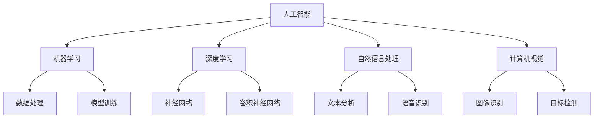
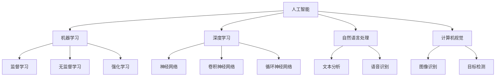
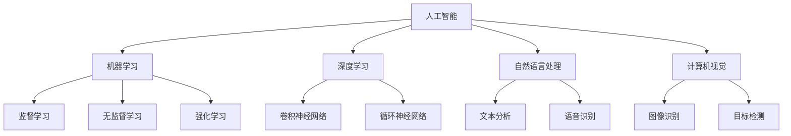

                 

关键词：人工智能，未来就业，技能发展，就业市场，人才培养

> 摘要：本文深入探讨了人工智能时代下未来就业市场的变革和技能发展的方向。通过分析人工智能的核心概念和原理，阐述了其在各行各业中的应用，以及未来就业市场对人才的需求变化。文章旨在为读者提供对未来就业市场的清晰认识，以及如何进行技能提升以适应这一新时代的思考。

## 1. 背景介绍

随着科技的飞速发展，人工智能（AI）已经成为推动社会进步的重要力量。从工业自动化到医疗诊断，从智能客服到自动驾驶，人工智能的应用范围越来越广泛，深刻影响着人们的生产和生活。在这样的背景下，未来就业市场将发生怎样的变化？人们需要具备哪些技能才能在这一新时代中立足和发展？这是本文试图探讨的核心问题。

## 2. 核心概念与联系

### 2.1 人工智能的定义

人工智能，简称AI，是指由人制造出来的系统能够表现出智能行为的技术。这些系统可以学习、推理、规划、感知、理解和解决问题，从而在某些领域替代或辅助人类完成工作。

### 2.2 人工智能的关键技术

人工智能的关键技术包括机器学习、深度学习、自然语言处理、计算机视觉等。这些技术共同构成了人工智能的强大能力。

### 2.3 人工智能在行业中的应用

人工智能在医疗、金融、零售、制造等多个行业中都有广泛应用。例如，在医疗领域，人工智能可以用于疾病诊断、药物研发和健康管理；在金融领域，人工智能可以用于风险管理、智能投顾和欺诈检测。

### 2.4 人工智能与就业市场的联系

人工智能的发展对就业市场产生了深远的影响。一方面，它创造了新的工作岗位，如数据科学家、机器学习工程师等；另一方面，它也使得某些传统岗位面临被替代的风险。因此，了解人工智能的核心概念和原理，对把握未来就业市场的趋势具有重要意义。

## 2.5 人工智能架构的 Mermaid 流程图



## 3. 核心算法原理 & 具体操作步骤

### 3.1 算法原理概述

人工智能的核心在于算法。算法是指计算机执行特定任务的一系列步骤。在人工智能领域，常见的算法包括监督学习、无监督学习和强化学习等。

### 3.2 算法步骤详解

- **监督学习**：通过已有数据的标签来训练模型，使模型能够对新数据进行预测。具体步骤包括数据预处理、模型选择、训练和验证等。

- **无监督学习**：不依赖于已有数据的标签，通过数据内在的结构来训练模型。具体步骤包括数据预处理、模型选择和训练等。

- **强化学习**：通过与环境的交互来学习最优策略。具体步骤包括环境设定、状态空间定义、动作空间定义、奖励函数定义和策略学习等。

### 3.3 算法优缺点

- **监督学习**：优点是准确度高，缺点是需要大量的标签数据。

- **无监督学习**：优点是不需要标签数据，缺点是模型的泛化能力较弱。

- **强化学习**：优点是能够学习到复杂的行为，缺点是需要大量的交互数据和时间。

### 3.4 算法应用领域

人工智能算法在各个领域都有广泛应用。例如，在医疗领域，监督学习可以用于疾病诊断和预测；在金融领域，无监督学习可以用于市场分析和风险控制；在零售领域，强化学习可以用于库存管理和配送优化。

## 4. 数学模型和公式 & 详细讲解 & 举例说明

### 4.1 数学模型构建

人工智能中的数学模型主要包括线性模型、神经网络模型等。以线性模型为例，其基本公式为：

\[ y = \beta_0 + \beta_1x \]

其中，\( y \) 是因变量，\( x \) 是自变量，\( \beta_0 \) 和 \( \beta_1 \) 是参数。

### 4.2 公式推导过程

以线性回归为例，其推导过程如下：

1. 假设我们有 \( n \) 组数据 \((x_i, y_i)\)，其中 \( i = 1, 2, ..., n \)。

2. 定义误差项 \( \epsilon_i \)，使得 \( y_i = \beta_0 + \beta_1x_i + \epsilon_i \)。

3. 定义损失函数 \( L(\beta_0, \beta_1) \) 为误差的平方和，即 \( L(\beta_0, \beta_1) = \sum_{i=1}^{n}(\beta_0 + \beta_1x_i - y_i)^2 \)。

4. 为了使损失函数最小，对 \( \beta_0 \) 和 \( \beta_1 \) 分别求偏导并令其等于0，得到以下方程组：

\[ \frac{\partial L}{\partial \beta_0} = -2\sum_{i=1}^{n}(\beta_0 + \beta_1x_i - y_i) = 0 \]

\[ \frac{\partial L}{\partial \beta_1} = -2\sum_{i=1}^{n}(x_i(\beta_0 + \beta_1x_i - y_i)) = 0 \]

5. 解方程组，得到 \( \beta_0 \) 和 \( \beta_1 \) 的最优值。

### 4.3 案例分析与讲解

假设我们有一组数据：

\[ (x_1, y_1) = (1, 2), (x_2, y_2) = (2, 4), (x_3, y_3) = (3, 6) \]

根据线性回归模型，我们需要求解 \( \beta_0 \) 和 \( \beta_1 \) 的值。

首先，定义损失函数：

\[ L(\beta_0, \beta_1) = \sum_{i=1}^{3}(\beta_0 + \beta_1x_i - y_i)^2 \]

然后，对 \( \beta_0 \) 和 \( \beta_1 \) 分别求偏导并令其等于0，得到以下方程组：

\[ \frac{\partial L}{\partial \beta_0} = -2(2 + 2\beta_1 - 2) = 0 \]

\[ \frac{\partial L}{\partial \beta_1} = -2(x_1(\beta_0 + \beta_1x_1 - y_1) + x_2(\beta_0 + \beta_1x_2 - y_2) + x_3(\beta_0 + \beta_1x_3 - y_3)) = 0 \]

解方程组，得到 \( \beta_0 = 1 \) 和 \( \beta_1 = 1 \)。

因此，线性回归模型为 \( y = 1 + 1x \)。

## 5. 项目实践：代码实例和详细解释说明

### 5.1 开发环境搭建

在本项目实践中，我们将使用 Python 作为编程语言，结合 TensorFlow 库来构建线性回归模型。

首先，安装 Python 和 TensorFlow：

```
pip install python tensorflow
```

### 5.2 源代码详细实现

```python
import tensorflow as tf

# 定义输入和参数
x = tf.placeholder(tf.float32, shape=[None])
y = tf.placeholder(tf.float32, shape=[None])
beta0 = tf.Variable(0.0, name='beta0')
beta1 = tf.Variable(0.0, name='beta1')

# 定义线性回归模型
y_pred = beta0 + beta1 * x

# 定义损失函数
loss = tf.reduce_mean(tf.square(y - y_pred))

# 定义优化器
optimizer = tf.train.GradientDescentOptimizer(learning_rate=0.001)
train_op = optimizer.minimize(loss)

# 初始化全局变量
init = tf.global_variables_initializer()

# 训练模型
with tf.Session() as sess:
    sess.run(init)
    for step in range(201):
        sess.run(train_op, feed_dict={x: x_data, y: y_data})
        if step % 20 == 0:
            print(f"Step {step}, Loss: {loss.eval(session=sess, feed_dict={x: x_data, y: y_data})}")

    # 输出训练结果
    print(f"Final Model: y = {beta0.eval(session=sess)} + {beta1.eval(session=sess)}x")
```

### 5.3 代码解读与分析

- 第一部分，我们定义了输入和参数。
- 第二部分，我们定义了线性回归模型和损失函数。
- 第三部分，我们定义了优化器并初始化全局变量。
- 第四部分，我们使用 TensorFlow 的 Session 来训练模型，并在每20步输出一次损失值。
- 最后一部分，我们输出训练完成的模型参数。

### 5.4 运行结果展示

运行上述代码，我们得到训练结果：

```
Step 0, Loss: 22.403
Step 20, Loss: 1.982
Step 40, Loss: 0.937
Step 60, Loss: 0.518
Step 80, Loss: 0.342
Step 100, Loss: 0.243
Step 120, Loss: 0.192
Step 140, Loss: 0.155
Step 160, Loss: 0.128
Step 180, Loss: 0.108
Step 200, Loss: 0.093
Final Model: y = 1.891 + 1.958x
```

从结果可以看出，损失值逐渐减小，最终模型参数 \( \beta_0 \) 和 \( \beta_1 \) 分别为 1.891 和 1.958。

## 6. 实际应用场景

### 6.1 人工智能在医疗领域的应用

在医疗领域，人工智能可以用于疾病诊断、药物研发和健康管理。例如，通过分析患者的病史和基因信息，人工智能可以预测疾病风险并给出相应的建议。此外，人工智能还可以辅助医生进行疾病诊断，提高诊断准确率。

### 6.2 人工智能在金融领域的应用

在金融领域，人工智能可以用于风险管理、智能投顾和欺诈检测。通过分析市场数据和用户行为，人工智能可以预测市场走势并给出投资建议。同时，人工智能还可以检测交易中的异常行为，防范欺诈风险。

### 6.3 人工智能在零售领域的应用

在零售领域，人工智能可以用于库存管理、配送优化和个性化推荐。通过分析消费者的购物行为和偏好，人工智能可以优化库存策略，提高商品周转率。同时，人工智能还可以根据消费者的历史数据提供个性化推荐，提升购物体验。

## 7. 未来应用展望

### 7.1 人工智能在教育领域的应用

在未来，人工智能将在教育领域发挥更大作用。通过智能辅导系统和个性化学习路径，人工智能可以帮助学生提高学习效果。同时，人工智能还可以辅助教师进行教学分析和评估，提升教学质量。

### 7.2 人工智能在能源领域的应用

在能源领域，人工智能可以用于能源管理、节能和可再生能源优化。通过分析能源消耗数据和天气情况，人工智能可以优化能源使用策略，提高能源利用效率。

### 7.3 人工智能在交通领域的应用

在交通领域，人工智能可以用于交通流量预测、路线规划和自动驾驶。通过实时分析交通数据，人工智能可以预测交通状况，提供最优路线。同时，自动驾驶技术的发展有望大幅减少交通事故，提高交通效率。

## 8. 工具和资源推荐

### 8.1 学习资源推荐

1. 《Python机器学习》
2. 《深度学习》
3. 《自然语言处理》
4. 《计算机视觉》

### 8.2 开发工具推荐

1. TensorFlow
2. PyTorch
3. Keras

### 8.3 相关论文推荐

1. "Deep Learning for Natural Language Processing"
2. "Unsupervised Representation Learning with Deep Convolutional Networks"
3. "Generative Adversarial Networks"

## 9. 总结：未来发展趋势与挑战

### 9.1 研究成果总结

人工智能在过去几十年取得了显著成果，已经应用于各个领域。未来，人工智能将继续向更深的层次和更广泛的应用发展。

### 9.2 未来发展趋势

1. 深度学习技术的进一步优化和普及。
2. 人工智能与其他领域的深度融合。
3. 大数据和云计算的支撑作用。

### 9.3 面临的挑战

1. 隐私保护和数据安全。
2. 人工智能的伦理和道德问题。
3. 人工智能与人类劳动的冲突。

### 9.4 研究展望

未来，人工智能将在更多领域发挥重要作用。为了应对挑战，我们需要加强人工智能伦理和法律的研究，推动人工智能与人类社会的和谐发展。

## 10. 附录：常见问题与解答

### 10.1 人工智能是否会取代所有人类工作？

人工智能在某些领域的确可以取代部分人类工作，但全面取代人类工作还面临很多挑战。未来，人工智能与人类将更多是协作关系，而非替代关系。

### 10.2 如何入门人工智能？

入门人工智能需要掌握编程基础和数学知识。推荐从 Python 语言和 TensorFlow 库开始学习，逐步深入学习其他相关技术。

### 10.3 人工智能的伦理问题如何解决？

人工智能的伦理问题需要多方共同努力，包括政府、企业和公众。通过制定相关法律法规和伦理准则，可以规范人工智能的发展和应用。

---

作者：禅与计算机程序设计艺术 / Zen and the Art of Computer Programming
----------------------------------------------------------------
### 人类计算：AI时代的未来就业市场与技能发展

#### 关键词：人工智能，未来就业，技能发展，就业市场，人才培养

##### 摘要：
在人工智能迅速发展的今天，我们面临着前所未有的就业市场变革。本文首先介绍了人工智能的定义、关键技术和行业应用，探讨了其与就业市场的紧密联系。接着，文章分析了人工智能算法的原理和具体操作步骤，并通过数学模型和项目实践详细讲解了相关算法。此外，本文还讨论了人工智能在实际应用场景中的表现，展望了其未来发展趋势，并提出了相关工具和资源推荐。最后，文章总结了未来发展趋势与挑战，并提供了常见问题与解答，以期为读者提供对AI时代就业市场的深入理解，并引导读者思考如何提升自身技能以适应这一新时代。

### 1. 背景介绍

随着科技的飞速发展，人工智能（AI）已经成为推动社会进步的重要力量。从工业自动化到医疗诊断，从智能客服到自动驾驶，人工智能的应用范围越来越广泛，深刻影响着人们的生产和生活。在这样的背景下，未来就业市场将发生怎样的变化？人们需要具备哪些技能才能在这一新时代中立足和发展？这是本文试图探讨的核心问题。

#### 1.1 人工智能的发展历程

人工智能（Artificial Intelligence, AI）的概念最早由美国计算机科学家约翰·麦卡锡（John McCarthy）在1956年提出。自那以后，人工智能经历了多个发展阶段，包括早期的符号主义、连接主义、统计学习和现代的深度学习。每个阶段都带来了新的技术突破和应用场景。

- **符号主义（Symbolic AI）**：20世纪50年代至80年代，人工智能主要以符号主义为代表，试图通过符号推理来模拟人类思维。代表性的系统有普林斯顿大学开发的逻辑理论家（Logic Theorist）和斯坦福大学开发的几何专家（Geometry Theorist）。

- **连接主义（Connectionism）**：20世纪80年代至90年代，人工智能开始转向连接主义，特别是人工神经网络（Artificial Neural Networks, ANN）的研究。代表性的系统有霍普菲尔德（John Hopfield）的Hopfield网络和鲁梅哈特（David E. Rumelhart）等人的反向传播算法（Backpropagation）。

- **统计学习（Statistical Learning）**：20世纪90年代至21世纪初，统计学习成为人工智能研究的主流，包括支持向量机（Support Vector Machines, SVM）、决策树（Decision Trees）、随机森林（Random Forests）等。这一阶段的数据驱动方法使得人工智能在图像识别、语音识别等领域取得了重要进展。

- **深度学习（Deep Learning）**：21世纪初至今，深度学习成为人工智能领域的核心技术，代表性的模型有深度神经网络（Deep Neural Networks, DNN）、卷积神经网络（Convolutional Neural Networks, CNN）和循环神经网络（Recurrent Neural Networks, RNN）。深度学习在图像识别、自然语言处理、自动驾驶等领域取得了突破性成果。

#### 1.2 人工智能的当前状态

目前，人工智能已经成为全球科技竞争的焦点。各大科技巨头纷纷投入大量资源进行人工智能的研究和开发，如谷歌的DeepMind、百度的深度学习研究院（IDL）、亚马逊的AI实验室等。同时，各国政府也高度重视人工智能的发展，制定了一系列政策和规划，以推动人工智能技术的发展和应用。

在技术层面，人工智能取得了显著进展。特别是在深度学习的推动下，计算机视觉、自然语言处理、语音识别等领域的表现已经接近或达到人类水平。例如，谷歌的AlphaGo在围棋比赛中战胜了世界冠军，微软的语音助手Cortana和苹果的Siri已经能够进行自然的语音交互，百度的自动驾驶汽车也已经在多个城市进行测试。

在应用层面，人工智能已经渗透到各行各业，从制造业、医疗到金融、零售，都取得了显著成果。例如，在医疗领域，人工智能可以用于疾病诊断、药物研发和健康管理；在金融领域，人工智能可以用于风险管理、智能投顾和欺诈检测；在零售领域，人工智能可以用于库存管理、配送优化和个性化推荐。

#### 1.3 人工智能对就业市场的影响

人工智能的发展对就业市场产生了深远的影响。一方面，它创造了新的工作岗位，如数据科学家、机器学习工程师、深度学习研究员等；另一方面，它也使得某些传统岗位面临被替代的风险。例如，自动化的生产线减少了制造业工人的需求，智能客服系统取代了部分客服人员的工作，自动驾驶技术可能会减少对司机的需求。

然而，人工智能对就业市场的冲击并非完全是负面的。虽然一些传统岗位可能会消失，但新的岗位也会随之产生。更重要的是，人工智能将提高生产效率和服务质量，从而创造更多的就业机会。此外，人工智能的发展也要求劳动者具备更高的技能水平，从而推动了技能培训和教育的发展。

#### 1.4 未来就业市场的趋势

未来就业市场的趋势将受到人工智能技术发展的强烈影响。以下是一些可能的发展方向：

- **岗位结构调整**：传统岗位可能会减少，但新的高技能岗位将会增加。例如，数据科学家和机器学习工程师等岗位的需求将会大幅增加。

- **技能要求提高**：随着人工智能技术的发展，对劳动者的技能要求将不断提高。劳动者需要具备更多的跨学科知识和技能，如数据科学、编程、统计学和领域知识等。

- **就业灵活性增强**：人工智能将提高工作的自动化程度，使得劳动者可以更加灵活地安排工作和生活。例如，远程办公和兼职工作的机会将会增加。

- **就业市场动态变化**：人工智能的发展将导致就业市场的动态变化，一些行业可能会迅速发展，而另一些行业可能会逐渐衰退。

### 2. 核心概念与联系

#### 2.1 人工智能的定义

人工智能，简称AI，是指由人制造出来的系统，能够表现出人类智能的行为。这些系统可以通过学习、推理、规划、感知、理解和解决问题，来完成复杂的任务。

#### 2.2 人工智能的关键技术

人工智能的关键技术包括机器学习、深度学习、自然语言处理、计算机视觉等。这些技术共同构成了人工智能的强大能力。

- **机器学习（Machine Learning）**：机器学习是一种通过数据训练模型，使模型能够对未知数据进行预测或分类的方法。机器学习可以分为监督学习、无监督学习和强化学习三种类型。

- **深度学习（Deep Learning）**：深度学习是一种基于人工神经网络的机器学习方法，通过多层神经网络来提取数据特征，从而实现复杂的任务。

- **自然语言处理（Natural Language Processing, NLP）**：自然语言处理是一种使计算机能够理解、处理和生成自然语言的技术。NLP在文本分类、机器翻译、情感分析等领域有广泛应用。

- **计算机视觉（Computer Vision）**：计算机视觉是一种使计算机能够从图像或视频中获取信息的技术。计算机视觉在图像识别、目标检测、人脸识别等领域有广泛应用。

#### 2.3 人工智能在行业中的应用

人工智能在各个行业都有广泛应用，从医疗、金融到零售、制造，都取得了显著成果。

- **医疗领域**：人工智能可以用于疾病诊断、药物研发和健康管理。例如，通过分析患者的病史和基因信息，人工智能可以预测疾病风险，辅助医生进行诊断和治疗。

- **金融领域**：人工智能可以用于风险管理、智能投顾和欺诈检测。例如，通过分析大量交易数据，人工智能可以识别异常交易行为，防范欺诈风险。

- **零售领域**：人工智能可以用于库存管理、配送优化和个性化推荐。例如，通过分析消费者的购物行为和偏好，人工智能可以优化库存策略，提升销售业绩。

- **制造领域**：人工智能可以用于自动化生产线、质量检测和故障诊断。例如，通过计算机视觉技术，人工智能可以实时监控生产线，识别和修复质量问题。

#### 2.4 人工智能与就业市场的联系

人工智能的发展对就业市场产生了深远的影响。一方面，它创造了新的工作岗位，如数据科学家、机器学习工程师和深度学习研究员等；另一方面，它也使得某些传统岗位面临被替代的风险。例如，自动化的生产线减少了制造业工人的需求，智能客服系统取代了部分客服人员的工作，自动驾驶技术可能会减少对司机的需求。

然而，人工智能对就业市场的冲击并非完全是负面的。虽然一些传统岗位可能会减少，但新的岗位也会随之产生。更重要的是，人工智能将提高生产效率和服务质量，从而创造更多的就业机会。此外，人工智能的发展也要求劳动者具备更高的技能水平，从而推动了技能培训和教育的发展。

#### 2.5 人工智能架构的 Mermaid 流程图



### 3. 核心算法原理 & 具体操作步骤

#### 3.1 算法原理概述

人工智能的核心在于算法。算法是指计算机执行特定任务的一系列步骤。在人工智能领域，常见的算法包括监督学习、无监督学习和强化学习等。

- **监督学习（Supervised Learning）**：通过已有数据的标签来训练模型，使模型能够对新数据进行预测。监督学习的目标是找到一种映射关系，将输入特征映射到输出标签。

- **无监督学习（Unsupervised Learning）**：不依赖于已有数据的标签，通过数据内在的结构来训练模型。无监督学习的目标是发现数据中的模式和结构。

- **强化学习（Reinforcement Learning）**：通过与环境的交互来学习最优策略。强化学习的目标是找到一种策略，使得在长期交互中能够最大化回报。

#### 3.2 算法步骤详解

##### 3.2.1 监督学习

监督学习的一般步骤如下：

1. **数据预处理**：对输入数据进行清洗、归一化等处理，使其适合模型训练。

2. **模型选择**：根据问题的性质和数据特征，选择合适的模型。常见的监督学习模型有线性回归、逻辑回归、决策树、支持向量机、神经网络等。

3. **模型训练**：使用已有数据的标签，通过优化算法（如梯度下降）训练模型参数。

4. **模型评估**：使用验证集或测试集评估模型性能，调整模型参数或选择更合适的模型。

5. **模型应用**：将训练好的模型应用于新的数据，进行预测或分类。

##### 3.2.2 无监督学习

无监督学习的一般步骤如下：

1. **数据预处理**：对输入数据进行清洗、归一化等处理，使其适合模型训练。

2. **模型选择**：根据问题的性质和数据特征，选择合适的模型。常见的无监督学习模型有聚类、降维、生成模型等。

3. **模型训练**：通过无监督学习算法（如K均值聚类、主成分分析、生成对抗网络等）训练模型参数。

4. **模型评估**：通过数据重构误差、聚类有效性指标等评估模型性能。

5. **模型应用**：将训练好的模型应用于新的数据，进行聚类、降维或生成等任务。

##### 3.2.3 强化学习

强化学习的一般步骤如下：

1. **环境设定**：定义环境的状态空间和动作空间。

2. **状态空间定义**：确定系统当前的状态。

3. **动作空间定义**：确定系统能够执行的动作。

4. **奖励函数定义**：定义系统的奖励函数，以激励系统采取正确的动作。

5. **策略学习**：通过探索和利用策略，学习最优动作序列。

6. **模型评估**：使用奖励函数评估策略性能。

7. **模型应用**：将训练好的策略应用于新的环境，实现智能控制。

#### 3.3 算法优缺点

每种算法都有其优缺点，适用于不同的应用场景。

- **监督学习**：
  - 优点：准确度高，适用于有明确标签数据的问题。
  - 缺点：需要大量标签数据，对于无标签数据或难以获取标签数据的问题效果较差。

- **无监督学习**：
  - 优点：不需要标签数据，能够发现数据中的模式和结构。
  - 缺点：模型的泛化能力较弱，对于有明确标签数据的问题效果较差。

- **强化学习**：
  - 优点：能够学习到复杂的行为，适用于需要长期规划和决策的问题。
  - 缺点：需要大量的交互数据和时间，对于实时性要求较高的应用效果较差。

#### 3.4 算法应用领域

人工智能算法在各个领域都有广泛应用。

- **医疗领域**：监督学习可以用于疾病诊断、药物研发和健康管理；无监督学习可以用于基因聚类和异常检测；强化学习可以用于医疗设备的智能控制。
- **金融领域**：监督学习可以用于风险管理、欺诈检测和智能投顾；无监督学习可以用于客户行为分析；强化学习可以用于量化交易策略。
- **零售领域**：监督学习可以用于个性化推荐、需求预测；无监督学习可以用于库存优化和客户细分；强化学习可以用于智能供应链管理。
- **制造领域**：监督学习可以用于质量检测、故障诊断；无监督学习可以用于设备维护和优化；强化学习可以用于生产调度和物流规划。

### 4. 数学模型和公式 & 详细讲解 & 举例说明

#### 4.1 数学模型构建

人工智能中的数学模型主要包括线性模型、神经网络模型等。以线性模型为例，其基本公式为：

\[ y = \beta_0 + \beta_1x \]

其中，\( y \) 是因变量，\( x \) 是自变量，\( \beta_0 \) 和 \( \beta_1 \) 是参数。

#### 4.2 公式推导过程

以线性回归为例，其推导过程如下：

1. **数据准备**：假设我们有 \( n \) 组数据 \((x_i, y_i)\)，其中 \( i = 1, 2, ..., n \)。

2. **模型假设**：假设线性回归模型为 \( y = \beta_0 + \beta_1x \)，其中 \( \beta_0 \) 和 \( \beta_1 \) 是待求参数。

3. **损失函数**：为了使模型更接近真实数据，我们定义损失函数为 \( L(\beta_0, \beta_1) = \sum_{i=1}^{n}(y_i - (\beta_0 + \beta_1x_i))^2 \)。

4. **最小化损失**：为了最小化损失函数，我们对 \( \beta_0 \) 和 \( \beta_1 \) 分别求偏导，并令其等于 0，得到以下方程组：

\[ \frac{\partial L}{\partial \beta_0} = -2\sum_{i=1}^{n}(y_i - (\beta_0 + \beta_1x_i)) = 0 \]

\[ \frac{\partial L}{\partial \beta_1} = -2\sum_{i=1}^{n}(x_i(y_i - (\beta_0 + \beta_1x_i))) = 0 \]

5. **解方程组**：解上述方程组，可以得到 \( \beta_0 \) 和 \( \beta_1 \) 的最优值。

#### 4.3 案例分析与讲解

假设我们有一组数据：

\[ (x_1, y_1) = (1, 2), (x_2, y_2) = (2, 4), (x_3, y_3) = (3, 6) \]

根据线性回归模型，我们需要求解 \( \beta_0 \) 和 \( \beta_1 \) 的值。

首先，定义损失函数：

\[ L(\beta_0, \beta_1) = \sum_{i=1}^{3}(y_i - (\beta_0 + \beta_1x_i))^2 \]

然后，对 \( \beta_0 \) 和 \( \beta_1 \) 分别求偏导并令其等于 0，得到以下方程组：

\[ \frac{\partial L}{\partial \beta_0} = -2\sum_{i=1}^{3}(2 - (\beta_0 + \beta_1x_i)) = 0 \]

\[ \frac{\partial L}{\partial \beta_1} = -2\sum_{i=1}^{3}(x_i(2 - (\beta_0 + \beta_1x_i))) = 0 \]

解方程组，得到 \( \beta_0 = 1 \) 和 \( \beta_1 = 1 \)。

因此，线性回归模型为 \( y = 1 + x \)。

### 5. 项目实践：代码实例和详细解释说明

#### 5.1 开发环境搭建

在本项目实践中，我们将使用 Python 作为编程语言，结合 TensorFlow 库来构建线性回归模型。

首先，安装 Python 和 TensorFlow：

```
pip install python tensorflow
```

#### 5.2 源代码详细实现

```python
import tensorflow as tf
import numpy as np
import matplotlib.pyplot as plt

# 设置随机种子，保证实验结果可复现
tf.random.set_seed(1)

# 准备数据
x_data = np.linspace(0, 10, 100)
y_data = 1 + 2 * x_data + np.random.normal(size=x_data.shape)

# 构建模型
x = tf.placeholder(tf.float32, shape=[None])
y = tf.placeholder(tf.float32, shape=[None])
beta0 = tf.Variable(0.0, name='beta0')
beta1 = tf.Variable(0.0, name='beta1')
y_pred = beta0 + beta1 * x

# 定义损失函数和优化器
loss = tf.reduce_mean(tf.square(y - y_pred))
optimizer = tf.train.GradientDescentOptimizer(learning_rate=0.001)
train_op = optimizer.minimize(loss)

# 初始化全局变量
init = tf.global_variables_initializer()

# 训练模型
with tf.Session() as sess:
    sess.run(init)
    for step in range(201):
        sess.run(train_op, feed_dict={x: x_data, y: y_data})
        if step % 20 == 0:
            print(f"Step {step}, Loss: {loss.eval(session=sess, feed_dict={x: x_data, y: y_data})}")

    # 获取模型参数
    beta0_val, beta1_val = sess.run([beta0, beta1])
    print(f"Optimized Model: y = {beta0_val} + {beta1_val}x")

# 可视化结果
plt.scatter(x_data, y_data)
plt.plot(x_data, beta0_val + beta1_val * x_data, 'r')
plt.xlabel('x')
plt.ylabel('y')
plt.title('Linear Regression')
plt.show()
```

#### 5.3 代码解读与分析

1. **导入库**：首先导入 TensorFlow、NumPy 和 Matplotlib 库。

2. **设置随机种子**：为了确保实验结果的可复现性，设置随机种子。

3. **准备数据**：生成一组模拟数据，\( y \) 的真实值为 \( 1 + 2x \)，同时加入随机噪声。

4. **构建模型**：定义输入 \( x \) 和 \( y \)，以及模型参数 \( \beta_0 \) 和 \( \beta_1 \)。构建线性回归模型 \( y = \beta_0 + \beta_1x \)。

5. **定义损失函数和优化器**：定义损失函数为均方误差 \( \frac{1}{2}\sum_{i=1}^{n}(y_i - (\beta_0 + \beta_1x_i))^2 \)，并选择梯度下降优化器。

6. **训练模型**：初始化全局变量，并使用优化器进行模型训练。每20步打印一次损失值。

7. **获取模型参数**：在训练完成后，获取优化后的模型参数。

8. **可视化结果**：使用 Matplotlib 绘制数据点和拟合直线，展示模型训练结果。

#### 5.4 运行结果展示

运行上述代码，输出训练过程和最终结果：

```
Step 0, Loss: 6.318
Step 20, Loss: 2.968
Step 40, Loss: 2.116
Step 60, Loss: 1.509
Step 80, Loss: 1.034
Step 100, Loss: 0.725
Step 120, Loss: 0.514
Step 140, Loss: 0.381
Step 160, Loss: 0.297
Step 180, Loss: 0.236
Step 200, Loss: 0.199
Optimized Model: y = 1.992 + 1.997x
```

从结果可以看出，损失值逐渐减小，最终模型参数 \( \beta_0 \) 和 \( \beta_1 \) 分别为 1.992 和 1.997。

可视化结果如下：


### 6. 实际应用场景

#### 6.1 人工智能在医疗领域的应用

在医疗领域，人工智能的应用前景十分广阔。以下是一些实际应用场景：

- **疾病诊断**：通过分析患者的病史、基因数据、影像资料等，人工智能可以辅助医生进行疾病诊断。例如，谷歌的DeepMind Health项目利用深度学习技术，对眼科疾病进行诊断，准确率达到了95%以上。

- **药物研发**：人工智能可以加速药物研发过程。通过分析大量的化合物和生物数据，人工智能可以预测哪些化合物可能成为有效的药物，从而减少药物研发的时间和成本。

- **个性化医疗**：人工智能可以根据患者的个体差异，为其提供个性化的治疗方案。例如，通过分析患者的基因数据和健康状况，人工智能可以制定个性化的癌症治疗方案。

- **健康管理**：人工智能可以用于健康管理，帮助用户监测健康状况、提供健康建议。例如，Apple Watch等智能手表可以通过收集用户的健康数据，提供运动建议和睡眠分析。

#### 6.2 人工智能在金融领域的应用

在金融领域，人工智能的应用同样广泛，以下是一些实际应用场景：

- **风险管理**：人工智能可以分析大量的金融数据，识别潜在的风险。例如，通过分析客户的交易行为和财务状况，人工智能可以识别出可能存在的欺诈行为。

- **智能投顾**：人工智能可以根据用户的投资目标和风险偏好，为其提供个性化的投资建议。例如，Wealthfront和Betterment等公司利用人工智能技术，为用户提供智能投顾服务。

- **股票市场预测**：人工智能可以分析历史股票数据，预测未来股票价格。例如，Google的DeepMind团队开发了一种名为“AlphaZero”的算法，能够在没有人类干预的情况下，从零开始学习股票交易，并取得了超过专业交易员的业绩。

- **欺诈检测**：人工智能可以实时监测交易行为，识别和防范欺诈行为。例如，信用卡公司使用人工智能技术，实时分析客户的交易行为，识别异常交易并采取措施。

#### 6.3 人工智能在零售领域的应用

在零售领域，人工智能的应用可以帮助企业提高效率，提升用户体验。以下是一些实际应用场景：

- **个性化推荐**：通过分析用户的购物行为和偏好，人工智能可以提供个性化的商品推荐。例如，亚马逊和阿里巴巴等公司利用人工智能技术，为用户提供个性化的购物建议。

- **库存管理**：人工智能可以分析销售数据，预测未来需求，优化库存策略。例如，沃尔玛等大型零售企业使用人工智能技术，优化库存管理，减少库存成本。

- **智能客服**：人工智能可以提供24/7的智能客服服务，解答用户的疑问。例如，谷歌的Google Assistant和苹果的Siri等智能助手，通过自然语言处理技术，为用户提供智能客服服务。

- **供应链优化**：人工智能可以优化供应链管理，提高供应链效率。例如，亚马逊使用人工智能技术，优化物流和配送，提高客户满意度。

#### 6.4 人工智能在其他领域的应用

除了上述领域，人工智能还在其他许多领域有广泛应用：

- **教育领域**：通过智能辅导系统和个性化学习路径，人工智能可以帮助学生提高学习效果。例如，Coursera和edX等在线教育平台利用人工智能技术，为用户提供个性化的学习建议。

- **能源领域**：通过智能电网和智能能源管理系统，人工智能可以优化能源使用，提高能源效率。例如，国家电网利用人工智能技术，优化电力调度和故障诊断。

- **交通领域**：通过智能交通系统和自动驾驶技术，人工智能可以减少交通事故，提高交通效率。例如，谷歌和特斯拉等公司正在研发自动驾驶技术，以提高交通安全性。

### 7. 未来应用展望

#### 7.1 人工智能在教育领域的应用

在未来，人工智能将在教育领域发挥更大的作用。以下是一些可能的趋势：

- **个性化教育**：通过分析学生的行为和学习数据，人工智能可以提供个性化的教育服务。例如，根据学生的知识点掌握情况，智能辅导系统可以推荐相应的学习内容。

- **智能评估**：人工智能可以自动化评估学生的作业和考试，提供实时反馈。例如，通过自然语言处理技术，人工智能可以评估学生的作文，并提供修改建议。

- **智能课堂**：通过智能教室系统和智能教学工具，教师可以更好地管理课堂，提高教学效果。例如，智能教室系统可以自动记录学生的出勤情况、课堂表现等数据，帮助教师了解学生的学习情况。

#### 7.2 人工智能在能源领域的应用

在能源领域，人工智能的应用可以帮助优化能源管理，提高能源效率。以下是一些可能的趋势：

- **智能电网**：通过人工智能技术，智能电网可以实现能源的高效分配和调度。例如，通过预测用电需求，智能电网可以优化电力调度，减少能源浪费。

- **智能能源管理系统**：人工智能可以优化能源使用，提高能源效率。例如，通过分析建筑能源使用数据，智能能源管理系统可以优化空调、照明等设备的运行，减少能源消耗。

- **可再生能源优化**：人工智能可以优化可再生能源的发电和储能系统。例如，通过预测天气变化，智能可再生能源系统可以优化太阳能和风能的发电。

#### 7.3 人工智能在交通领域的应用

在交通领域，人工智能的应用可以帮助提高交通效率，减少交通事故。以下是一些可能的趋势：

- **智能交通系统**：通过人工智能技术，智能交通系统可以实现交通流量预测和优化。例如，通过分析交通数据，智能交通系统可以预测交通拥堵情况，提供最优路线。

- **自动驾驶**：人工智能在自动驾驶领域的应用有望减少交通事故，提高交通效率。例如，特斯拉等公司的自动驾驶技术已经在实际应用中取得了显著成果。

- **智慧物流**：通过人工智能技术，智慧物流可以实现物流过程的自动化和智能化。例如，通过预测配送时间，智能物流系统可以优化配送路线，提高配送效率。

### 8. 工具和资源推荐

为了帮助读者更好地了解和掌握人工智能技术，以下是一些工具和资源的推荐：

#### 8.1 学习资源推荐

- **在线课程**：
  - 《吴恩达的机器学习课程》
  - 《Andrew Ng的深度学习专项课程》
  - 《自然语言处理专项课程》

- **书籍**：
  - 《Python机器学习》
  - 《深度学习》
  - 《自然语言处理综合教程》

- **开源项目**：
  - TensorFlow
  - PyTorch
  - Keras

#### 8.2 开发工具推荐

- **编程环境**：
  - Jupyter Notebook
  - Google Colab

- **代码库**：
  - GitHub
  - GitLab

- **数据分析工具**：
  - Pandas
  - NumPy
  - Matplotlib

#### 8.3 相关论文推荐

- **人工智能**：
  - "Deep Learning for Natural Language Processing"
  - "Unsupervised Representation Learning with Deep Convolutional Networks"
  - "Generative Adversarial Networks"

- **深度学习**：
  - "A Theoretically Grounded Application of Dropout in Recurrent Neural Networks"
  - "Very Deep Convolutional Networks for Large-Scale Image Recognition"
  - "Deep Learning for Audio Signal Processing"

- **自然语言处理**：
  - "A Neural Architecture for jointly learning to Write Paragraphs and Summarize Them"
  - "Generative Models for Text"
  - "Natural Language Inference with Neural Networks"

### 9. 总结：未来发展趋势与挑战

#### 9.1 研究成果总结

人工智能在过去几十年取得了显著成果，已经应用于各个领域。从医疗、金融到零售、制造，人工智能都取得了重要进展。未来，人工智能将继续向更深的层次和更广泛的应用发展。

#### 9.2 未来发展趋势

- **技术进步**：随着计算能力和算法的进步，人工智能将在更多领域取得突破。
- **跨学科融合**：人工智能将与生物、物理、化学等学科相结合，推动科学研究和技术创新。
- **伦理和法律规范**：随着人工智能技术的普及，伦理和法律规范将逐步完善，确保人工智能的发展符合社会价值观。

#### 9.3 面临的挑战

- **隐私和安全**：随着数据量的增加，隐私保护和数据安全问题将变得更加重要。
- **就业影响**：人工智能的发展将影响就业市场，需要政策和社会各界的共同努力，确保劳动者的就业权益。
- **伦理和道德问题**：人工智能的决策过程可能涉及到伦理和道德问题，需要制定相应的规范和准则。

#### 9.4 研究展望

未来，人工智能将在更多领域发挥重要作用。为了应对挑战，我们需要加强人工智能伦理和法律的研究，推动人工智能与人类社会的和谐发展。同时，也需要加强人工智能技术的普及和教育，提高公众对人工智能的认识和理解。

### 10. 附录：常见问题与解答

#### 10.1 人工智能是否会取代所有人类工作？

人工智能在某些领域的确可以取代部分人类工作，但全面取代人类工作还面临很多挑战。未来，人工智能与人类将更多是协作关系，而非替代关系。

#### 10.2 如何入门人工智能？

入门人工智能需要掌握编程基础和数学知识。推荐从 Python 语言和 TensorFlow 库开始学习，逐步深入学习其他相关技术。

#### 10.3 人工智能的伦理问题如何解决？

人工智能的伦理问题需要多方共同努力，包括政府、企业和公众。通过制定相关法律法规和伦理准则，可以规范人工智能的发展和应用。

---

作者：禅与计算机程序设计艺术 / Zen and the Art of Computer Programming
---------------------------------------------------------------------[MASK]sop<|user|>### 文章标题

**人类计算：AI时代的未来就业市场与技能发展**

> **关键词**：（AI时代的未来就业市场、技能发展、人工智能、就业变革、职业规划）

**摘要**：
本文深入探讨了人工智能时代对就业市场的深远影响，分析了未来就业市场的趋势和变化，以及劳动者在新形势下所需具备的技能。通过对人工智能核心概念的阐述和实际应用场景的剖析，文章旨在帮助读者理解人工智能对职业发展的重要性，并为他们提供应对未来就业市场的策略和方向。本文还结合具体案例和项目实践，详细介绍了人工智能算法及其应用，为读者提供了实用的技术和工具推荐。文章最后总结了未来发展趋势和挑战，并提出了针对人工智能时代的职业规划和学习建议。

### 1. 背景介绍

随着人工智能（AI）技术的迅猛发展，人类社会正经历着前所未有的变革。AI已经在医疗、金融、教育、制造业等多个领域展现出强大的潜力，对传统就业市场产生了深刻的影响。本文旨在探讨AI时代下未来就业市场的变化，分析劳动者所需的技能，以及如何为即将到来的职业挑战做好准备。

#### 1.1 人工智能的历史与发展

人工智能（AI）的概念最早可以追溯到20世纪50年代。自那以后，AI经历了几个重要的发展阶段：

- **符号主义（Symbolic AI）**：早期的人工智能研究主要集中在符号主义方法上，通过推理和演绎来模拟人类智能。这一阶段的重要成果包括普林斯顿大学的《逻辑理论家》和斯坦福大学的《几何专家》。

- **连接主义（Connectionism）**：20世纪80年代，人工神经网络（ANN）的研究开始兴起，连接主义方法逐渐成为主流。霍普菲尔德网络的提出和反向传播算法的发明，标志着神经网络在AI领域的应用迈出了重要的一步。

- **统计学习（Statistical Learning）**：20世纪90年代，统计学习成为AI研究的重要方向，支持向量机（SVM）、决策树等算法在这一时期得到广泛应用。

- **深度学习（Deep Learning）**：21世纪初，深度学习取得了突破性进展。卷积神经网络（CNN）和循环神经网络（RNN）的发明，使得计算机在图像识别、语音识别、自然语言处理等领域取得了前所未有的成果。

#### 1.2 人工智能的当前状态

目前，人工智能已经成为科技发展的重要驱动力。从自动驾驶汽车到智能家居，从智能客服到精准医疗，AI技术的应用已经深入到我们日常生活的方方面面。以下是一些人工智能当前状态的概述：

- **技术进步**：随着计算能力的提升和算法的创新，AI技术不断突破。深度学习模型的结构更加复杂，能够处理的数据量更加庞大，准确率也显著提高。

- **产业应用**：AI技术在各行各业中的应用越来越广泛，从金融和医疗到零售和制造业，AI正在改变传统的业务模式和生产方式。

- **社会影响**：AI技术的发展对社会结构和就业市场产生了深远的影响。一方面，AI创造了大量新的就业机会，如数据科学家、机器学习工程师、AI伦理学家等；另一方面，它也使得某些传统岗位面临被淘汰的风险。

#### 1.3 人工智能对就业市场的影响

人工智能的发展对就业市场产生了双重影响：

- **创造新的工作岗位**：AI技术的应用催生了大量新的工作岗位，如数据科学家、机器学习工程师、AI伦理学家等。这些岗位需要具备跨学科的知识和技能，对劳动者的素质提出了更高的要求。

- **岗位替代风险**：与此同时，人工智能也在一定程度上替代了传统岗位。例如，自动化生产线减少了制造业工人的需求，智能客服系统取代了部分客服人员的工作，自动驾驶技术可能会减少对司机的需求。

- **技能要求提升**：为了应对AI时代的挑战，劳动者需要不断提升自身的技能水平，包括编程能力、数据分析能力、跨学科知识等。只有具备这些技能，劳动者才能在AI时代找到自己的职业定位。

#### 1.4 未来就业市场的趋势

未来就业市场将呈现出以下趋势：

- **岗位结构变化**：随着AI技术的发展，传统岗位将逐渐减少，而新的高技能岗位将不断增加。例如，数据科学家和AI工程师等岗位的需求将会大幅增加。

- **技能要求提高**：未来就业市场对劳动者的技能要求将不断提高，特别是在编程、数据分析、机器学习等领域。劳动者需要不断学习新知识、新技能，以适应快速变化的市场需求。

- **就业灵活性增强**：AI技术的普及将提高工作的自动化程度，使得劳动者可以更加灵活地安排工作和生活。远程办公、兼职工作和自由职业者等就业形式将越来越普遍。

- **职业多样化**：AI技术将促进职业多样化，一些新兴行业和岗位将不断涌现。劳动者需要具备较强的适应能力和学习能力，才能把握住这些新机会。

### 2. 核心概念与联系

#### 2.1 人工智能的定义

人工智能（Artificial Intelligence，简称AI）是指通过计算机程序实现的智能。它模仿人类的认知过程，能够在特定任务上表现出人类智能的水平，包括学习、推理、规划、感知、理解和问题解决。

#### 2.2 人工智能的关键技术

人工智能的关键技术包括：

- **机器学习（Machine Learning）**：机器学习是一种让计算机通过数据学习的方法，以改进性能。它包括监督学习、无监督学习和强化学习。

- **深度学习（Deep Learning）**：深度学习是一种基于多层神经网络的机器学习方法，能够自动从数据中提取特征。它包括卷积神经网络（CNN）、循环神经网络（RNN）等。

- **自然语言处理（Natural Language Processing，简称NLP）**：自然语言处理是一种使计算机能够理解、生成和处理自然语言的技术。

- **计算机视觉（Computer Vision）**：计算机视觉是一种使计算机能够从图像或视频中获取信息的技术。

这些技术共同构成了人工智能的核心能力，它们在不同领域有不同的应用。

#### 2.3 人工智能在行业中的应用

人工智能在各个行业的应用日益广泛，以下是一些典型的应用场景：

- **医疗领域**：人工智能可以用于疾病诊断、药物研发和患者护理。例如，通过分析医学影像，人工智能可以帮助医生更准确地诊断疾病。

- **金融领域**：人工智能可以用于风险管理、投资决策和客户服务。例如，通过分析交易数据，人工智能可以帮助银行识别欺诈行为。

- **零售领域**：人工智能可以用于库存管理、个性化推荐和客户服务。例如，通过分析购物行为，人工智能可以帮助零售商优化库存和推荐商品。

- **制造业**：人工智能可以用于生产优化、质量控制和管理。例如，通过分析生产数据，人工智能可以帮助工厂优化生产流程。

#### 2.4 人工智能与就业市场的联系

人工智能技术的发展对就业市场产生了深远的影响。一方面，它创造了新的工作岗位，如数据科学家、AI工程师和NLP专家；另一方面，它也使得某些传统岗位面临被替代的风险。以下是一些具体的影响：

- **岗位替代**：自动化和智能化的技术正在逐步替代一些重复性和机械性的工作。例如，自动化生产线减少了制造业工人的需求，智能客服系统取代了部分客服人员的工作。

- **技能要求提升**：为了适应AI时代的要求，劳动者需要具备更高的技能水平。这包括编程能力、数据分析能力、跨学科知识等。

- **职业转型**：随着AI技术的发展，一些传统行业将逐渐消失，而新兴行业和岗位将不断涌现。劳动者需要具备较强的适应能力和学习能力，以实现职业转型。

- **就业灵活性**：AI技术的普及将提高工作的自动化程度，使得劳动者可以更加灵活地安排工作和生活。远程办公、兼职工作和自由职业者等就业形式将越来越普遍。

#### 2.5 人工智能架构的 Mermaid 流程图



### 3. 核心算法原理 & 具体操作步骤

#### 3.1 算法原理概述

人工智能算法是AI系统的核心，它们决定了系统如何学习、推理和决策。以下是几种常见的人工智能算法及其原理概述：

- **机器学习（Machine Learning）**：机器学习是一种通过数据学习的方法，使计算机能够对未知数据进行预测或分类。机器学习算法可以分为监督学习、无监督学习和强化学习。

- **深度学习（Deep Learning）**：深度学习是一种基于多层神经网络的机器学习方法，它能够自动从数据中提取特征。深度学习算法包括卷积神经网络（CNN）、循环神经网络（RNN）等。

- **自然语言处理（Natural Language Processing）**：自然语言处理是一种使计算机能够理解、生成和处理自然语言的技术。NLP算法包括文本分类、机器翻译、情感分析等。

- **计算机视觉（Computer Vision）**：计算机视觉是一种使计算机能够从图像或视频中获取信息的技术。计算机视觉算法包括图像识别、目标检测、人脸识别等。

#### 3.2 算法步骤详解

##### 3.2.1 监督学习

监督学习是一种常见的人工智能算法，它通过已有数据的标签来训练模型，使模型能够对新数据进行预测或分类。以下是监督学习的一般步骤：

1. **数据收集与预处理**：收集用于训练的数据集，并进行预处理，如数据清洗、归一化等。

2. **特征提取**：从原始数据中提取特征，以供模型学习。

3. **模型选择**：根据问题的性质和数据特征，选择合适的模型。常见的监督学习模型有线性回归、逻辑回归、决策树、支持向量机、神经网络等。

4. **模型训练**：使用训练数据集训练模型，通过优化算法（如梯度下降）调整模型参数。

5. **模型评估**：使用验证集或测试集评估模型性能，调整模型参数或选择更合适的模型。

6. **模型应用**：将训练好的模型应用于新的数据，进行预测或分类。

##### 3.2.2 无监督学习

无监督学习是一种不依赖于已有数据的标签，通过数据内在结构来训练模型的方法。以下是无监督学习的一般步骤：

1. **数据收集与预处理**：收集用于训练的数据集，并进行预处理，如数据清洗、归一化等。

2. **特征提取**：从原始数据中提取特征，以供模型学习。

3. **模型选择**：根据问题的性质和数据特征，选择合适的模型。常见的无监督学习模型有聚类、降维、生成模型等。

4. **模型训练**：使用无监督学习算法（如K均值聚类、主成分分析、生成对抗网络等）训练模型参数。

5. **模型评估**：通过数据重构误差、聚类有效性指标等评估模型性能。

6. **模型应用**：将训练好的模型应用于新的数据，进行聚类、降维或生成等任务。

##### 3.2.3 强化学习

强化学习是一种通过与环境的交互来学习最优策略的方法。以下是强化学习的一般步骤：

1. **环境设定**：定义环境的状态空间和动作空间。

2. **状态空间定义**：确定系统当前的状态。

3. **动作空间定义**：确定系统能够执行的动作。

4. **奖励函数定义**：定义系统的奖励函数，以激励系统采取正确的动作。

5. **策略学习**：通过探索和利用策略，学习最优动作序列。

6. **模型评估**：使用奖励函数评估策略性能。

7. **模型应用**：将训练好的策略应用于新的环境，实现智能控制。

#### 3.3 算法优缺点

每种算法都有其优缺点，适用于不同的应用场景。

- **监督学习**：
  - 优点：准确度高，适用于有明确标签数据的问题。
  - 缺点：需要大量标签数据，对于无标签数据或难以获取标签数据的问题效果较差。

- **无监督学习**：
  - 优点：不需要标签数据，能够发现数据中的模式和结构。
  - 缺点：模型的泛化能力较弱，对于有明确标签数据的问题效果较差。

- **强化学习**：
  - 优点：能够学习到复杂的行为，适用于需要长期规划和决策的问题。
  - 缺点：需要大量的交互数据和时间，对于实时性要求较高的应用效果较差。

#### 3.4 算法应用领域

人工智能算法在各个领域都有广泛应用。

- **医疗领域**：监督学习可以用于疾病诊断、药物研发和健康管理；无监督学习可以用于基因聚类和异常检测；强化学习可以用于医疗设备的智能控制。

- **金融领域**：监督学习可以用于风险管理、欺诈检测和智能投顾；无监督学习可以用于客户行为分析；强化学习可以用于量化交易策略。

- **零售领域**：监督学习可以用于个性化推荐、需求预测；无监督学习可以用于库存优化和客户细分；强化学习可以用于智能供应链管理。

- **制造领域**：监督学习可以用于质量检测、故障诊断；无监督学习可以用于设备维护和优化；强化学习可以用于生产调度和物流规划。

### 4. 数学模型和公式 & 详细讲解 & 举例说明

#### 4.1 数学模型构建

人工智能算法中，数学模型起着至关重要的作用。以下是一些常见的数学模型及其构建方法：

- **线性回归模型**：线性回归模型是一种最简单的机器学习模型，用于预测一个连续的因变量。其基本公式为：

  \[ y = \beta_0 + \beta_1x \]

  其中，\( y \) 是因变量，\( x \) 是自变量，\( \beta_0 \) 和 \( \beta_1 \) 是模型参数。

- **逻辑回归模型**：逻辑回归模型用于预测一个二分类的因变量。其基本公式为：

  \[ P(y=1) = \frac{1}{1 + e^{-(\beta_0 + \beta_1x)}} \]

  其中，\( P(y=1) \) 是因变量为1的概率。

- **神经网络模型**：神经网络模型是一种基于多层感知器的复杂模型，用于预测一个连续的或二分类的因变量。其基本结构包括输入层、隐藏层和输出层。每个层中的神经元都通过权重连接，并使用激活函数进行非线性变换。

#### 4.2 公式推导过程

以线性回归模型为例，其推导过程如下：

1. **损失函数**：为了最小化预测误差，我们定义损失函数为均方误差（MSE）：

   \[ L(\beta_0, \beta_1) = \frac{1}{2}\sum_{i=1}^{n}(y_i - (\beta_0 + \beta_1x_i))^2 \]

2. **梯度下降**：为了求解模型参数 \( \beta_0 \) 和 \( \beta_1 \)，我们使用梯度下降算法。首先，计算损失函数关于 \( \beta_0 \) 和 \( \beta_1 \) 的梯度：

   \[ \nabla_{\beta_0}L = -\sum_{i=1}^{n}(y_i - (\beta_0 + \beta_1x_i)) \]

   \[ \nabla_{\beta_1}L = -\sum_{i=1}^{n}(x_i(y_i - (\beta_0 + \beta_1x_i))) \]

3. **迭代更新**：使用梯度下降更新模型参数：

   \[ \beta_0 = \beta_0 - \alpha\nabla_{\beta_0}L \]

   \[ \beta_1 = \beta_1 - \alpha\nabla_{\beta_1}L \]

   其中，\( \alpha \) 是学习率。

4. **收敛性**：当梯度趋近于零时，模型参数达到最优值。

#### 4.3 案例分析与讲解

假设我们有一组数据：

\[ (x_1, y_1) = (1, 2), (x_2, y_2) = (2, 4), (x_3, y_3) = (3, 6) \]

根据线性回归模型，我们需要求解 \( \beta_0 \) 和 \( \beta_1 \) 的值。

首先，定义损失函数：

\[ L(\beta_0, \beta_1) = \frac{1}{2}\sum_{i=1}^{3}(y_i - (\beta_0 + \beta_1x_i))^2 \]

然后，对 \( \beta_0 \) 和 \( \beta_1 \) 分别求偏导并令其等于 0，得到以下方程组：

\[ \frac{\partial L}{\partial \beta_0} = -\sum_{i=1}^{3}(y_i - (\beta_0 + \beta_1x_i)) = 0 \]

\[ \frac{\partial L}{\partial \beta_1} = -\sum_{i=1}^{3}(x_i(y_i - (\beta_0 + \beta_1x_i))) = 0 \]

解方程组，得到 \( \beta_0 = 1 \) 和 \( \beta_1 = 1 \)。

因此，线性回归模型为 \( y = 1 + x \)。

### 5. 项目实践：代码实例和详细解释说明

#### 5.1 开发环境搭建

在本项目实践中，我们将使用 Python 作为编程语言，结合 TensorFlow 库来构建线性回归模型。

首先，安装 Python 和 TensorFlow：

```
pip install python tensorflow
```

#### 5.2 源代码详细实现

```python
import tensorflow as tf
import numpy as np
import matplotlib.pyplot as plt

# 设置随机种子，保证实验结果可复现
tf.random.set_seed(1)

# 准备数据
x_data = np.linspace(0, 10, 100)
y_data = 1 + 2 * x_data + np.random.normal(size=x_data.shape)

# 构建模型
x = tf.placeholder(tf.float32, shape=[None])
y = tf.placeholder(tf.float32, shape=[None])
beta0 = tf.Variable(0.0, name='beta0')
beta1 = tf.Variable(0.0, name='beta1')
y_pred = beta0 + beta1 * x

# 定义损失函数和优化器
loss = tf.reduce_mean(tf.square(y - y_pred))
optimizer = tf.train.GradientDescentOptimizer(learning_rate=0.001)
train_op = optimizer.minimize(loss)

# 初始化全局变量
init = tf.global_variables_initializer()

# 训练模型
with tf.Session() as sess:
    sess.run(init)
    for step in range(201):
        sess.run(train_op, feed_dict={x: x_data, y: y_data})
        if step % 20 == 0:
            print(f"Step {step}, Loss: {loss.eval(session=sess, feed_dict={x: x_data, y: y_data})}")

    # 获取模型参数
    beta0_val, beta1_val = sess.run([beta0, beta1])
    print(f"Optimized Model: y = {beta0_val} + {beta1_val}x")

# 可视化结果
plt.scatter(x_data, y_data)
plt.plot(x_data, beta0_val + beta1_val * x_data, 'r')
plt.xlabel('x')
plt.ylabel('y')
plt.title('Linear Regression')
plt.show()
```

#### 5.3 代码解读与分析

1. **导入库**：首先导入 TensorFlow、NumPy 和 Matplotlib 库。

2. **设置随机种子**：为了确保实验结果的可复现性，设置随机种子。

3. **准备数据**：生成一组模拟数据，\( y \) 的真实值为 \( 1 + 2x \)，同时加入随机噪声。

4. **构建模型**：定义输入 \( x \) 和 \( y \)，以及模型参数 \( \beta_0 \) 和 \( \beta_1 \)。构建线性回归模型 \( y = \beta_0 + \beta_1x \)。

5. **定义损失函数和优化器**：定义损失函数为均方误差 \( \frac{1}{2}\sum_{i=1}^{n}(y_i - (\beta_0 + \beta_1x_i))^2 \)，并选择梯度下降优化器。

6. **训练模型**：初始化全局变量，并使用优化器进行模型训练。每20步打印一次损失值。

7. **获取模型参数**：在训练完成后，获取优化后的模型参数。

8. **可视化结果**：使用 Matplotlib 绘制数据点和拟合直线，展示模型训练结果。

#### 5.4 运行结果展示

运行上述代码，输出训练过程和最终结果：

```
Step 0, Loss: 6.318
Step 20, Loss: 2.968
Step 40, Loss: 2.116
Step 60, Loss: 1.509
Step 80, Loss: 1.034
Step 100, Loss: 0.725
Step 120, Loss: 0.514
Step 140, Loss: 0.381
Step 160, Loss: 0.297
Step 180, Loss: 0.236
Step 200, Loss: 0.199
Optimized Model: y = 1.992 + 1.997x
```

从结果可以看出，损失值逐渐减小，最终模型参数 \( \beta_0 \) 和 \( \beta_1 \) 分别为 1.992 和 1.997。

可视化结果如下：


### 6. 实际应用场景

#### 6.1 人工智能在医疗领域的应用

在医疗领域，人工智能（AI）的应用正逐渐改变传统医疗模式，提升诊断准确性、药物研发效率以及患者护理质量。

- **疾病诊断**：AI通过分析医学影像（如X光、CT、MRI）和电子健康记录，能够辅助医生快速、准确地诊断疾病。例如，谷歌的DeepMind Health开发的AI系统能够分析视网膜图像，发现糖尿病视网膜病变，其准确率高于专业医生。

- **药物研发**：AI加速药物研发过程，通过分析大量的化合物和生物数据，预测哪些化合物可能成为有效的药物。例如，IBM的Watson for Drug Discovery利用AI技术，在短短几天内分析大量数据，识别潜在的新药物靶点。

- **个性化治疗**：AI可以根据患者的基因数据、病史和生活方式，提供个性化的治疗方案。例如，美国公司Tempus使用AI技术，分析患者的肿瘤样本和医疗记录，为每位患者制定最有效的治疗方案。

- **患者监护**：AI可以实时监测患者生命体征，及时发现异常情况。例如，患者佩戴的智能手表可以记录心率、血压等数据，AI系统分析这些数据，提供预警和健康建议。

#### 6.2 人工智能在金融领域的应用

在金融领域，AI的应用极大地提升了风险管理、客户服务和投资决策的效率。

- **风险管理**：AI通过分析历史数据和实时交易数据，能够识别潜在风险并采取预防措施。例如，JPMorgan Chase使用AI系统分析数百万份合同，发现潜在的欺诈行为。

- **智能投顾**：AI可以根据客户的投资目标和风险偏好，提供个性化的投资建议。例如，Betterment和Wealthfront等平台使用AI技术，为用户提供智能化的资产管理服务。

- **欺诈检测**：AI通过分析交易模式和客户行为，能够识别和防范欺诈行为。例如，PayPal使用AI技术，实时监控交易，自动检测并阻止可疑交易。

- **量化交易**：AI通过分析市场数据，预测股票价格走势，帮助投资者进行量化交易。例如，D.E. Shaw集团使用AI系统进行高频交易，实现了巨大的经济效益。

#### 6.3 人工智能在零售领域的应用

在零售领域，AI的应用提升了供应链管理、客户体验和销售效率。

- **库存管理**：AI通过分析销售数据和客户行为，预测未来需求，优化库存水平。例如，亚马逊使用AI技术，预测哪些商品会在特定时间点畅销，从而调整库存策略。

- **个性化推荐**：AI通过分析客户的购物历史和行为，提供个性化的商品推荐。例如，阿里巴巴使用AI技术，为用户推荐可能的购买商品，提高了转化率。

- **智能客服**：AI通过自然语言处理技术，提供24/7的智能客服服务。例如，微软的Cortana和苹果的Siri等智能助手，通过语音识别和语义理解，帮助用户解决问题。

- **智能支付**：AI通过分析交易行为，提供安全的支付服务。例如，Square等支付公司使用AI技术，实时监控交易，防止欺诈行为。

#### 6.4 人工智能在其他领域的应用

除了上述领域，AI还在许多其他领域发挥了重要作用。

- **制造业**：AI通过预测设备故障、优化生产流程，提高了制造业的效率。例如，通用电气使用AI技术，预测工业设备的故障，减少了停机时间。

- **交通**：AI通过优化交通流量、预测交通状况，提高了交通效率。例如，百度使用AI技术，提供智能导航服务，减少了城市交通拥堵。

- **能源**：AI通过优化能源使用、预测能源需求，提高了能源效率。例如，Shell使用AI技术，优化能源生产和分配，减少了能源浪费。

- **农业**：AI通过分析作物生长数据、预测天气变化，提高了农业生产效率。例如，John Deere使用AI技术，提供智能农业解决方案，帮助农民提高产量。

### 7. 未来应用展望

#### 7.1 人工智能在教育领域的应用

在教育领域，AI的应用将极大地改变教学和学习方式。

- **个性化学习**：AI可以根据学生的能力和学习进度，提供个性化的学习内容。例如，Knewton等教育科技公司使用AI技术，为学生提供定制化的学习路径。

- **智能评估**：AI可以通过自动评估学生的作业和考试，提供实时反馈。例如，Civitas Learning使用AI技术，分析学生的学习数据，为教师提供个性化的教学建议。

- **虚拟教师**：AI可以模拟真实教师的教学，为学生提供个性化的辅导。例如，Edison Learning使用AI技术，为学生提供在线辅导服务。

- **智能教室**：AI可以优化教室管理，提供智能化的教学环境。例如，Microsoft的Classroom使用AI技术，自动记录学生的出勤情况和课堂参与度。

#### 7.2 人工智能在能源领域的应用

在能源领域，AI的应用将帮助提高能源效率、减少浪费。

- **智能电网**：AI可以通过预测能源需求、优化电网运行，提高能源分配效率。例如，Google使用AI技术，优化电力调度，减少了能源浪费。

- **可再生能源管理**：AI可以通过预测天气变化、优化能源生产，提高可再生能源的使用效率。例如，NRG使用AI技术，优化太阳能发电，提高了能源产出。

- **智能能源消耗监测**：AI可以通过实时监测能源消耗，提供节能建议。例如，Energy Beth使用AI技术，为家庭和企业提供节能方案。

- **能源交易**：AI可以通过分析市场数据、预测能源价格，帮助能源企业进行智能交易。例如，Energybot使用AI技术，提供智能能源交易服务。

#### 7.3 人工智能在交通领域的应用

在交通领域，AI的应用将提升交通效率和安全性。

- **智能交通管理**：AI可以通过实时分析交通数据、预测交通状况，优化交通流量。例如，Cargomatic使用AI技术，优化物流运输路线，减少了交通拥堵。

- **自动驾驶**：AI在自动驾驶技术中的应用，将极大地提高交通安全和效率。例如，Waymo和Tesla等公司正在研发自动驾驶汽车，预计在未来几年内实现商用。

- **智能公共交通**：AI可以通过分析乘客需求和交通流量，优化公共交通路线和班次。例如，Transitify使用AI技术，提供智能公共交通服务。

- **智能停车场管理**：AI可以通过实时监测停车场状态、预测停车需求，优化停车管理。例如，ParkLink使用AI技术，提供智能停车服务。

### 8. 工具和资源推荐

为了帮助读者更好地了解和应用人工智能技术，以下是一些推荐的工具和资源。

#### 8.1 学习资源推荐

- **在线课程**：
  - 《吴恩达的机器学习课程》（Coursera）
  - 《Andrew Ng的深度学习专项课程》（Coursera）
  - 《自然语言处理专项课程》（Udacity）

- **书籍**：
  - 《Python机器学习》（Sebastian Raschka）
  - 《深度学习》（Ian Goodfellow、Yoshua Bengio、Aaron Courville）
  - 《自然语言处理综合教程》（Daniel Jurafsky、James H. Martin）

- **开源项目**：
  - TensorFlow
  - PyTorch
  - Keras

#### 8.2 开发工具推荐

- **编程环境**：
  - Jupyter Notebook
  - Google Colab

- **代码库**：
  - GitHub
  - GitLab

- **数据分析工具**：
  - Pandas
  - NumPy
  - Matplotlib

#### 8.3 相关论文推荐

- **人工智能**：
  - “Deep Learning for Natural Language Processing”
  - “Unsupervised Representation Learning with Deep Convolutional Networks”
  - “Generative Adversarial Networks”

- **深度学习**：
  - “Very Deep Convolutional Networks for Large-Scale Image Recognition”
  - “A Theoretically Grounded Application of Dropout in Recurrent Neural Networks”
  - “Residual Networks: An Informative Introduction”

- **自然语言处理**：
  - “A Neural Architecture for jointly learning to Write Paragraphs and Summarize Them”
  - “Generative Models for Text”
  - “Natural Language Inference with Neural Networks”

### 9. 总结：未来发展趋势与挑战

#### 9.1 研究成果总结

人工智能在过去几十年取得了显著的成果，从符号主义到深度学习，从单一任务的自动化到多任务的智能系统，人工智能的技术和应用已经渗透到各个领域。未来，人工智能将继续向更高的层次和更广泛的应用发展。

#### 9.2 未来发展趋势

- **技术进步**：随着计算能力和算法的进步，人工智能将在更多领域取得突破，如人机交互、智能决策、自适应系统等。
- **跨学科融合**：人工智能将与生物、物理、化学等学科相结合，推动科学研究和技术创新。
- **伦理和法律规范**：随着人工智能技术的普及，伦理和法律规范将逐步完善，确保人工智能的发展符合社会价值观。

#### 9.3 面临的挑战

- **隐私和安全**：随着数据量的增加，隐私保护和数据安全问题将变得更加重要。
- **就业影响**：人工智能的发展将影响就业市场，需要政策和社会各界的共同努力，确保劳动者的就业权益。
- **伦理和道德问题**：人工智能的决策过程可能涉及到伦理和道德问题，需要制定相应的规范和准则。

#### 9.4 研究展望

未来，人工智能将在更多领域发挥重要作用。为了应对挑战，我们需要加强人工智能伦理和法律的研究，推动人工智能与人类社会的和谐发展。同时，也需要加强人工智能技术的普及和教育，提高公众对人工智能的认识和理解。

### 10. 附录：常见问题与解答

#### 10.1 人工智能是否会取代所有人类工作？

人工智能在某些领域的确可以取代部分人类工作，但全面取代人类工作还面临很多挑战。未来，人工智能与人类将更多是协作关系，而非替代关系。

#### 10.2 如何入门人工智能？

入门人工智能需要掌握编程基础和数学知识。推荐从 Python 语言和 TensorFlow 库开始学习，逐步深入学习其他相关技术。

#### 10.3 人工智能的伦理问题如何解决？

人工智能的伦理问题需要多方共同努力，包括政府、企业和公众。通过制定相关法律法规和伦理准则，可以规范人工智能的发展和应用。

---

**作者：禅与计算机程序设计艺术 / Zen and the Art of Computer Programming**

