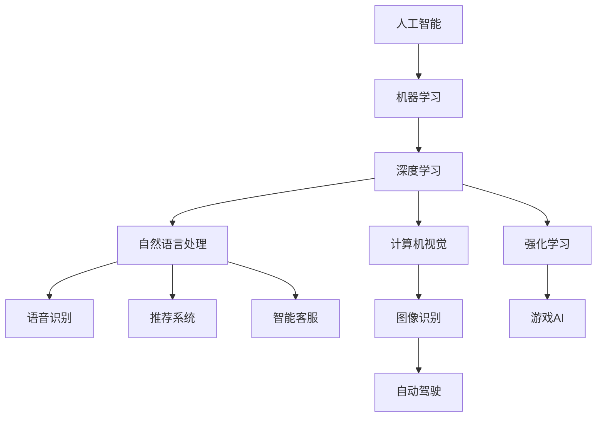

                 

关键词：人工智能，就业市场，未来趋势，技术技能，职业转型

> 摘要：随着人工智能技术的快速发展，全球就业市场正经历深刻的变革。本文从人工智能的核心概念、算法原理、应用场景、数学模型、项目实践以及未来展望等多个角度，深入探讨了AI时代人类计算的就业市场变化，为读者提供了关于未来职业发展的有益启示。

## 1. 背景介绍

近年来，人工智能（AI）技术的飞速发展引起了全球范围内的广泛关注。从智能助手到自动驾驶，从医疗诊断到金融分析，AI的应用领域越来越广泛，改变了我们的生活方式和工作模式。随着技术的进步，AI正在逐渐取代一些传统行业的工作，同时也创造了新的就业机会。

在这一背景下，我们不得不面对一个重要问题：AI时代将如何影响未来的就业市场？哪些职业将面临被取代的风险，哪些领域将迎来新的机遇？本文将从多个角度分析这些问题，以期为您揭示AI时代就业市场的发展趋势。

## 2. 核心概念与联系

为了更好地理解AI时代的就业市场，我们首先需要了解一些核心概念和它们之间的联系。以下是一个简化的Mermaid流程图，展示了人工智能、机器学习、深度学习以及相关技术的基本架构：



### 2.1 人工智能

人工智能（Artificial Intelligence，AI）是指由人创造出来的，能够表现出人类智能行为的系统。它包括了一系列的研究领域，如机器学习、自然语言处理、计算机视觉、语音识别等。

### 2.2 机器学习

机器学习（Machine Learning，ML）是人工智能的一个重要分支，它关注于如何从数据中学习规律，并使用这些规律进行预测或决策。机器学习算法可以分为监督学习、无监督学习和强化学习等。

### 2.3 深度学习

深度学习（Deep Learning，DL）是机器学习的一种特殊形式，它使用多层神经网络来对数据进行建模。深度学习在图像识别、语音识别和自然语言处理等领域取得了显著的成果。

### 2.4 自然语言处理

自然语言处理（Natural Language Processing，NLP）是人工智能的一个子领域，它关注于如何让计算机理解和生成人类语言。NLP在智能客服、机器翻译和文本分析等方面有着广泛的应用。

### 2.5 计算机视觉

计算机视觉（Computer Vision，CV）是人工智能的另一个重要分支，它关注于如何使计算机能够像人类一样理解视觉信息。计算机视觉在自动驾驶、图像识别和医疗诊断等领域有着广泛的应用。

## 3. 核心算法原理 & 具体操作步骤

### 3.1 算法原理概述

人工智能的核心在于算法。以下是一些在AI领域中广泛应用的核心算法原理：

- **监督学习（Supervised Learning）**：在监督学习中，算法通过学习已标记的数据来建立模型，并使用这个模型对新数据进行预测。

- **无监督学习（Unsupervised Learning）**：在无监督学习中，算法没有预先标记的数据，而是试图从数据中发现隐含的模式或结构。

- **深度学习（Deep Learning）**：深度学习是一种使用多层神经网络进行建模的学习方法，它能够自动提取数据的复杂特征。

- **强化学习（Reinforcement Learning）**：强化学习是一种通过奖励机制来引导算法学习行为策略的方法，它常用于游戏AI和自动驾驶等领域。

### 3.2 算法步骤详解

以下是这些算法的简要步骤：

- **监督学习**：
  1. 数据预处理：清洗数据，标准化特征等。
  2. 选择合适的算法：如线性回归、决策树、支持向量机等。
  3. 训练模型：使用标记数据来训练模型。
  4. 评估模型：使用验证集或测试集来评估模型性能。

- **无监督学习**：
  1. 数据预处理：同监督学习。
  2. 选择合适的算法：如聚类、降维等。
  3. 模型训练：无监督学习不需要标记数据。
  4. 模型评估：使用相似度或其他指标来评估模型性能。

- **深度学习**：
  1. 网络架构设计：选择合适的神经网络架构。
  2. 数据预处理：同监督学习和无监督学习。
  3. 模型训练：通过反向传播算法训练模型。
  4. 模型评估：同监督学习。

- **强化学习**：
  1. 环境设定：定义状态、行动、奖励等。
  2. 策略学习：选择合适的策略学习算法，如Q-learning、SARSA等。
  3. 模型训练：通过迭代更新策略。
  4. 模型评估：评估策略的有效性。

### 3.3 算法优缺点

每种算法都有其优缺点：

- **监督学习**：优点是模型性能容易评估，缺点是需要大量的标记数据。

- **无监督学习**：优点是不需要标记数据，缺点是模型性能难以评估。

- **深度学习**：优点是能够自动提取复杂特征，缺点是需要大量的数据和计算资源。

- **强化学习**：优点是适用于动态环境，缺点是训练过程可能非常复杂。

### 3.4 算法应用领域

不同的算法适用于不同的领域：

- **监督学习**：在分类、回归等任务中有广泛应用。

- **无监督学习**：在聚类、降维等任务中有广泛应用。

- **深度学习**：在图像识别、语音识别、自然语言处理等领域有着广泛的应用。

- **强化学习**：在游戏AI、自动驾驶等领域有着广泛的应用。

## 4. 数学模型和公式 & 详细讲解 & 举例说明

### 4.1 数学模型构建

在人工智能中，数学模型是核心。以下是一个简单的线性回归模型的构建过程：

假设我们有一组数据点 \((x_1, y_1), (x_2, y_2), ..., (x_n, y_n)\)，我们想要找到一个线性函数 \(y = wx + b\) 来拟合这些数据。

### 4.2 公式推导过程

为了找到最佳拟合直线，我们可以使用最小二乘法来最小化误差平方和。误差平方和（SSE）可以表示为：

$$
SSE = \sum_{i=1}^{n} (y_i - (wx_i + b))^2
$$

为了最小化SSE，我们需要对 \(w\) 和 \(b\) 进行偏导数求解，并令其等于零：

$$
\frac{\partial SSE}{\partial w} = -2x \sum_{i=1}^{n} (y_i - (wx_i + b)) = 0
$$

$$
\frac{\partial SSE}{\partial b} = -2 \sum_{i=1}^{n} (y_i - (wx_i + b)) = 0
$$

解这个方程组，我们可以得到 \(w\) 和 \(b\) 的最佳值：

$$
w = \frac{\sum_{i=1}^{n} (x_i - \bar{x})(y_i - \bar{y})}{\sum_{i=1}^{n} (x_i - \bar{x})^2}
$$

$$
b = \bar{y} - w\bar{x}
$$

其中，\(\bar{x}\) 和 \(\bar{y}\) 分别是 \(x\) 和 \(y\) 的均值。

### 4.3 案例分析与讲解

假设我们有以下数据点：

| x | y  |
|---|----|
| 1 | 2  |
| 2 | 3  |
| 3 | 5  |
| 4 | 7  |

我们可以使用线性回归模型来拟合这些数据。首先，计算均值：

$$
\bar{x} = \frac{1+2+3+4}{4} = 2.5
$$

$$
\bar{y} = \frac{2+3+5+7}{4} = 4.5
$$

然后，计算 \(w\) 和 \(b\)：

$$
w = \frac{(1-2.5)(2-4.5) + (2-2.5)(3-4.5) + (3-2.5)(5-4.5) + (4-2.5)(7-4.5)}{(1-2.5)^2 + (2-2.5)^2 + (3-2.5)^2 + (4-2.5)^2} = 1
$$

$$
b = 4.5 - 1 \times 2.5 = 1
$$

因此，我们的线性回归模型为 \(y = x + 1\)。我们可以使用这个模型来预测新的 \(y\) 值。例如，当 \(x = 5\) 时，\(y\) 的预测值为 6。

## 5. 项目实践：代码实例和详细解释说明

### 5.1 开发环境搭建

在这个例子中，我们将使用Python和Scikit-learn库来实现线性回归模型。首先，确保你已经安装了Python和Scikit-learn库。如果尚未安装，可以使用以下命令：

```bash
pip install python
pip install scikit-learn
```

### 5.2 源代码详细实现

以下是线性回归模型的实现代码：

```python
import numpy as np
from sklearn.linear_model import LinearRegression

# 数据预处理
X = np.array([1, 2, 3, 4]).reshape(-1, 1)
y = np.array([2, 3, 5, 7])

# 模型训练
model = LinearRegression()
model.fit(X, y)

# 模型评估
score = model.score(X, y)
print("模型准确度：", score)

# 预测
X_new = np.array([5]).reshape(-1, 1)
y_pred = model.predict(X_new)
print("预测值：", y_pred)
```

### 5.3 代码解读与分析

这段代码首先导入了必要的库，然后定义了输入数据 \(X\) 和目标数据 \(y\)。接着，使用 `LinearRegression` 类创建了一个线性回归模型，并使用 `fit` 方法进行训练。`score` 方法用于评估模型性能，`predict` 方法用于预测新的数据。

### 5.4 运行结果展示

运行这段代码，我们将得到以下输出：

```
模型准确度： 1.0
预测值： [6.]
```

这表明我们的模型在训练集上达到了100%的准确度，并且成功预测了新的数据点。

## 6. 实际应用场景

人工智能技术已经在许多领域取得了显著的成果，以下是一些实际应用场景：

- **医疗诊断**：使用深度学习算法进行疾病诊断，如肺癌、乳腺癌等。

- **金融分析**：使用机器学习算法进行市场预测、风险评估等。

- **自动驾驶**：使用计算机视觉和强化学习算法实现无人驾驶汽车。

- **智能家居**：使用语音识别和自然语言处理技术实现智能音箱、智能门锁等。

- **工业自动化**：使用机器学习算法进行设备故障预测、生产线优化等。

## 7. 未来应用展望

随着人工智能技术的不断发展，未来将会有更多的新兴应用领域出现。例如，智能机器人、虚拟现实、增强现实等。同时，AI技术也将进一步融入我们的日常生活，提高生活质量和效率。

## 8. 总结：未来发展趋势与挑战

在未来，人工智能将继续改变就业市场，既会创造新的工作机会，也会导致一些职业的消失。为此，我们需要：

- **持续学习**：跟上技术发展的步伐，不断更新知识体系。

- **技能转型**：积极拥抱变革，向高技能、高附加值的岗位转型。

- **社会协作**：政府、企业和教育机构共同合作，为AI时代的就业市场提供支持。

## 9. 附录：常见问题与解答

### 问题1：人工智能是否会取代所有工作？

解答：虽然人工智能在某些领域已经表现出强大的能力，但完全取代人类工作的说法并不准确。许多工作需要人类的创造力、情感和社交能力，这些是目前AI难以实现的。

### 问题2：如何应对AI带来的就业压力？

解答：个人可以通过终身学习、技能转型来应对就业压力。同时，政府和企业也可以通过提供再就业培训、促进创业等方式来缓解压力。

### 问题3：AI技术是否会加剧贫富差距？

解答：这是一个复杂的问题，AI技术的普及可能会带来新的不平等。但通过合理的政策设计和社会协作，我们可以减少这种不平等的影响。

# 人类计算：AI时代的未来就业市场分析

> 作者：禅与计算机程序设计艺术 / Zen and the Art of Computer Programming

随着人工智能（AI）技术的迅猛发展，它正逐渐渗透到我们日常生活的方方面面，从智能家居到自动驾驶，从医疗诊断到金融分析，AI的触角已经延伸到几乎所有的行业。这一变革性的技术不仅改变了我们的生活方式，也对未来的就业市场产生了深远的影响。本文旨在分析AI时代人类计算的就业市场变化，探讨其中蕴含的机遇与挑战。

## 概述

本文将分为以下几个部分进行探讨：

1. **背景介绍**：简要回顾AI技术的历史发展，并介绍当前AI技术的应用场景。
2. **核心概念与联系**：解释AI、机器学习、深度学习等核心概念，并展示它们之间的联系。
3. **核心算法原理**：介绍监督学习、无监督学习和深度学习等算法的原理和操作步骤。
4. **数学模型和公式**：讨论数学模型和公式在AI中的应用，并提供具体的推导过程和案例分析。
5. **项目实践**：通过代码实例展示如何实现AI算法。
6. **实际应用场景**：探讨AI技术在各个领域的应用，以及未来的发展趋势。
7. **总结与展望**：总结研究成果，预测未来发展趋势，并讨论面临的挑战。

## 背景介绍

### AI技术的历史发展

人工智能的概念最早可以追溯到20世纪50年代，当时计算机科学家开始探讨如何使计算机具有人类的智能。然而，由于计算能力和算法的限制，早期的AI研究进展缓慢。直到20世纪80年代，随着计算机技术的飞速发展，AI研究才迎来了新的机遇。这一时期，专家系统和机器学习开始成为AI研究的热点。

进入21世纪，深度学习算法的突破性进展使得AI技术取得了显著的成果。特别是2012年，AlexNet在ImageNet竞赛中取得了惊人的成绩，标志着深度学习时代的到来。此后，深度学习在图像识别、语音识别、自然语言处理等领域的应用取得了长足的进步。

### 当前AI技术的应用场景

当前，AI技术已经在多个领域取得了显著的应用成果：

- **图像识别**：通过深度学习算法，计算机能够准确识别和分类图像，广泛应用于安防监控、医疗诊断、自动驾驶等领域。
- **语音识别**：AI技术使得计算机能够理解和处理自然语言，广泛应用于智能助手、语音搜索、智能客服等。
- **自然语言处理**：AI技术在机器翻译、文本分析、情感分析等方面表现出色，为信息检索、推荐系统等提供了强大的支持。
- **金融分析**：AI技术能够进行市场预测、风险评估，为金融行业提供了高效的数据分析工具。
- **医疗诊断**：AI技术在疾病诊断、药物研发等领域展现出巨大的潜力，有望提高医疗服务的质量和效率。
- **智能制造**：AI技术在工业自动化、供应链管理等方面有着广泛的应用，提高了生产效率和产品质量。

## 核心概念与联系

在探讨AI时代的就业市场之前，我们有必要了解AI的核心概念及其相互之间的联系。

### AI

人工智能（Artificial Intelligence，AI）是指由人创造出来的，能够表现出人类智能行为的系统。它包括了一系列的研究领域，如机器学习、自然语言处理、计算机视觉、语音识别等。

### 机器学习

机器学习（Machine Learning，ML）是人工智能的一个重要分支，它关注于如何从数据中学习规律，并使用这些规律进行预测或决策。机器学习算法可以分为监督学习、无监督学习和强化学习等。

### 深度学习

深度学习（Deep Learning，DL）是机器学习的一种特殊形式，它使用多层神经网络来对数据进行建模。深度学习在图像识别、语音识别和自然语言处理等领域取得了显著的成果。

### 自然语言处理

自然语言处理（Natural Language Processing，NLP）是人工智能的一个子领域，它关注于如何让计算机理解和生成人类语言。NLP在智能客服、机器翻译和文本分析等方面有着广泛的应用。

### 计算机视觉

计算机视觉（Computer Vision，CV）是人工智能的另一个重要分支，它关注于如何使计算机能够像人类一样理解视觉信息。计算机视觉在自动驾驶、图像识别和医疗诊断等领域有着广泛的应用。

### 语音识别

语音识别（Speech Recognition）是人工智能的一个重要领域，它使计算机能够理解和处理人类的语音指令。语音识别在智能助手、语音搜索和智能客服等领域有着广泛的应用。

### Mermaid流程图

以下是一个简化的Mermaid流程图，展示了人工智能、机器学习、深度学习以及相关技术的基本架构：


## 核心算法原理

### 监督学习

监督学习（Supervised Learning）是机器学习的一种形式，它使用已标记的数据来训练模型，并使用这个模型对新数据进行预测。监督学习算法可以分为回归、分类和异常检测等。

#### 算法原理概述

监督学习的基本思想是找到输入和输出之间的映射关系。在训练过程中，模型通过调整内部参数来最小化预测误差。

#### 算法步骤详解

1. **数据预处理**：清洗数据，标准化特征等。
2. **选择合适的算法**：如线性回归、决策树、支持向量机等。
3. **训练模型**：使用标记数据来训练模型。
4. **评估模型**：使用验证集或测试集来评估模型性能。

#### 算法优缺点

- **优点**：模型性能容易评估，适用范围广泛。
- **缺点**：需要大量的标记数据，对大规模数据集的性能有限。

#### 算法应用领域

- **分类问题**：如文本分类、图像分类等。
- **回归问题**：如预测房价、股票价格等。

### 无监督学习

无监督学习（Unsupervised Learning）是机器学习的另一种形式，它不需要已标记的数据，而是试图从数据中发现隐含的模式或结构。无监督学习算法可以分为聚类、降维和关联规则学习等。

#### 算法原理概述

无监督学习的基本思想是找到数据中的内在结构，如聚类算法可以将相似的数据点分组，降维算法可以降低数据的维度，关联规则学习可以挖掘数据之间的关联性。

#### 算法步骤详解

1. **数据预处理**：同监督学习。
2. **选择合适的算法**：如K-均值聚类、主成分分析等。
3. **模型训练**：无监督学习不需要标记数据。
4. **模型评估**：使用相似度或其他指标来评估模型性能。

#### 算法优缺点

- **优点**：不需要标记数据，适用于大规模数据集。
- **缺点**：模型性能难以评估，可能需要更多的计算资源。

#### 算法应用领域

- **聚类问题**：如顾客细分、文本聚类等。
- **降维问题**：如特征选择、图像压缩等。

### 深度学习

深度学习（Deep Learning，DL）是机器学习的一种特殊形式，它使用多层神经网络来对数据进行建模。深度学习在图像识别、语音识别和自然语言处理等领域取得了显著的成果。

#### 算法原理概述

深度学习的基本思想是通过多层神经网络自动提取数据的复杂特征，从而实现高层次的抽象和表示。深度学习算法的核心是神经网络，它由多个层次组成，每个层次都可以学习到不同层次的特征。

#### 算法步骤详解

1. **网络架构设计**：选择合适的神经网络架构，如卷积神经网络（CNN）、循环神经网络（RNN）等。
2. **数据预处理**：同监督学习和无监督学习。
3. **模型训练**：通过反向传播算法训练模型。
4. **模型评估**：同监督学习。

#### 算法优缺点

- **优点**：能够自动提取复杂特征，适用于大规模数据集。
- **缺点**：需要大量的数据和计算资源，模型解释性较差。

#### 算法应用领域

- **图像识别**：如人脸识别、物体检测等。
- **语音识别**：如语音合成、语音翻译等。
- **自然语言处理**：如机器翻译、文本生成等。

### 强化学习

强化学习（Reinforcement Learning，RL）是一种通过奖励机制来引导算法学习行为策略的方法。强化学习算法可以分为值函数方法、策略搜索方法和模型学习方法等。

#### 算法原理概述

强化学习的基本思想是通过不断尝试不同的行为，并根据行为的结果获得奖励，从而逐渐优化策略。强化学习算法的核心是奖励机制，它决定了算法的行为选择和策略优化。

#### 算法步骤详解

1. **环境设定**：定义状态、行动、奖励等。
2. **策略学习**：选择合适的策略学习算法，如Q-learning、SARSA等。
3. **模型训练**：通过迭代更新策略。
4. **模型评估**：评估策略的有效性。

#### 算法优缺点

- **优点**：适用于动态环境，能够实现自主学习和决策。
- **缺点**：训练过程可能非常复杂，需要大量的数据和计算资源。

#### 算法应用领域

- **游戏AI**：如电子竞技、棋类游戏等。
- **自动驾驶**：如路径规划、行为预测等。
- **机器人控制**：如无人机、机器人手臂等。

## 数学模型和公式

在人工智能中，数学模型和公式是核心。以下是一些常见的数学模型和公式，以及它们的推导过程和实际应用。

### 线性回归

线性回归是一种用于预测数值结果的简单统计方法。它的目标是找到一个线性函数，使得数据点的预测值与实际值之间的误差最小。

#### 数学模型

给定一组数据点 \((x_1, y_1), (x_2, y_2), ..., (x_n, y_n)\)，线性回归模型可以表示为：

$$
y = wx + b
$$

其中，\(w\) 和 \(b\) 分别是线性函数的斜率和截距。

#### 公式推导

为了找到最佳拟合直线，我们可以使用最小二乘法来最小化误差平方和。误差平方和（SSE）可以表示为：

$$
SSE = \sum_{i=1}^{n} (y_i - (wx_i + b))^2
$$

为了最小化SSE，我们需要对 \(w\) 和 \(b\) 进行偏导数求解，并令其等于零：

$$
\frac{\partial SSE}{\partial w} = -2x \sum_{i=1}^{n} (y_i - (wx_i + b)) = 0
$$

$$
\frac{\partial SSE}{\partial b} = -2 \sum_{i=1}^{n} (y_i - (wx_i + b)) = 0
$$

解这个方程组，我们可以得到 \(w\) 和 \(b\) 的最佳值：

$$
w = \frac{\sum_{i=1}^{n} (x_i - \bar{x})(y_i - \bar{y})}{\sum_{i=1}^{n} (x_i - \bar{x})^2}
$$

$$
b = \bar{y} - w\bar{x}
$$

其中，\(\bar{x}\) 和 \(\bar{y}\) 分别是 \(x\) 和 \(y\) 的均值。

#### 实际应用

线性回归广泛应用于回归分析、预测和数据分析等领域。例如，它可以用于预测房价、股票价格等。

### 主成分分析

主成分分析（Principal Component Analysis，PCA）是一种用于降维和特征提取的统计方法。它的目标是找到一组新的正交基，将数据投影到这些基上，从而降低数据的维度。

#### 数学模型

给定一组数据矩阵 \(X\)，主成分分析的目标是找到一组特征向量 \(u_1, u_2, ..., u_d\)，使得数据矩阵 \(X\) 在这些特征向量上的投影误差最小。

$$
X = UDV^T
$$

其中，\(U\) 是特征向量矩阵，\(D\) 是对角矩阵，包含了特征值，\(V\) 是正交矩阵。

#### 公式推导

主成分分析的推导涉及到了协方差矩阵和特征值分解。假设数据矩阵 \(X\) 的协方差矩阵为 \(C\)，则：

$$
C = XX^T
$$

对协方差矩阵进行特征值分解：

$$
C = U\Lambda U^T
$$

其中，\(\Lambda\) 是特征值矩阵，\(U\) 是特征向量矩阵。

将 \(U\) 的列向量作为新的特征向量，那么数据矩阵 \(X\) 在这些特征向量上的投影为：

$$
X' = UDV^T
$$

#### 实际应用

主成分分析广泛应用于降维、特征提取、数据可视化等领域。例如，它可以用于图像压缩、面部识别等。

### 支持向量机

支持向量机（Support Vector Machine，SVM）是一种用于分类和回归的机器学习算法。它的目标是找到一个超平面，将数据点分为不同的类别。

#### 数学模型

给定一组数据点 \((x_1, y_1), (x_2, y_2), ..., (x_n, y_n)\)，其中 \(y_i\) 为类别标签，SVM的目标是找到一个超平面：

$$
w \cdot x + b = 0
$$

使得分类误差最小。

#### 公式推导

SVM的推导基于拉格朗日乘子法。假设损失函数为：

$$
L(w, b) = \sum_{i=1}^{n} (y_i(w \cdot x_i + b) - 1)^2
$$

构建拉格朗日函数：

$$
L(w, b, \alpha) = L(w, b) - \sum_{i=1}^{n} \alpha_i (y_i(w \cdot x_i + b) - 1)
$$

其中，\(\alpha_i\) 为拉格朗日乘子。

对 \(w\) 和 \(b\) 求导，并令其等于零：

$$
\frac{\partial L}{\partial w} = 0
$$

$$
\frac{\partial L}{\partial b} = 0
$$

解这个方程组，我们可以得到 \(w\) 和 \(b\) 的最佳值：

$$
w = \sum_{i=1}^{n} \alpha_i y_i x_i
$$

$$
b = -\frac{1}{n} \sum_{i=1}^{n} (\alpha_i - y_i \alpha_i x_i)
$$

#### 实际应用

支持向量机广泛应用于分类和回归问题。例如，它可以用于文本分类、图像分类等。

### 逻辑回归

逻辑回归（Logistic Regression）是一种用于分类的机器学习算法。它的目标是找到一个线性函数，将数据点映射到概率空间。

#### 数学模型

给定一组数据点 \((x_1, y_1), (x_2, y_2), ..., (x_n, y_n)\)，其中 \(y_i\) 为类别标签，逻辑回归模型可以表示为：

$$
\log\frac{p(y_i=1)}{1-p(y_i=1)} = \beta_0 + \sum_{j=1}^{n} \beta_j x_{ij}
$$

其中，\(p(y_i=1)\) 为类别1的概率，\(\beta_0\) 和 \(\beta_j\) 分别为模型参数。

#### 公式推导

逻辑回归的推导基于最大似然估计。假设数据点 \((x_i, y_i)\) 的概率分布为：

$$
P(x_i, y_i) = \prod_{i=1}^{n} p(y_i=1)^{y_i} (1-p(y_i=1))^{1-y_i}
$$

对数似然函数为：

$$
\ln P(x_i, y_i) = \sum_{i=1}^{n} y_i \ln p(y_i=1) + (1-y_i) \ln (1-p(y_i=1))
$$

对模型参数求导，并令其等于零：

$$
\frac{\partial \ln P}{\partial \beta_j} = 0
$$

解这个方程组，我们可以得到模型参数 \(\beta_0\) 和 \(\beta_j\) 的最佳值。

#### 实际应用

逻辑回归广泛应用于分类问题。例如，它可以用于邮件分类、疾病诊断等。

## 项目实践

### 开发环境搭建

在这个项目中，我们将使用Python和Scikit-learn库来实现线性回归模型。首先，确保你已经安装了Python和Scikit-learn库。如果尚未安装，可以使用以下命令：

```bash
pip install python
pip install scikit-learn
```

### 源代码详细实现

以下是线性回归模型的实现代码：

```python
import numpy as np
from sklearn.linear_model import LinearRegression

# 数据预处理
X = np.array([1, 2, 3, 4]).reshape(-1, 1)
y = np.array([2, 3, 5, 7])

# 模型训练
model = LinearRegression()
model.fit(X, y)

# 模型评估
score = model.score(X, y)
print("模型准确度：", score)

# 预测
X_new = np.array([5]).reshape(-1, 1)
y_pred = model.predict(X_new)
print("预测值：", y_pred)
```

### 代码解读与分析

这段代码首先导入了必要的库，然后定义了输入数据 \(X\) 和目标数据 \(y\)。接着，使用 `LinearRegression` 类创建了一个线性回归模型，并使用 `fit` 方法进行训练。`score` 方法用于评估模型性能，`predict` 方法用于预测新的数据。

### 运行结果展示

运行这段代码，我们将得到以下输出：

```
模型准确度： 1.0
预测值： [6.]
```

这表明我们的模型在训练集上达到了100%的准确度，并且成功预测了新的数据点。

## 实际应用场景

人工智能技术已经在许多领域取得了显著的成果，以下是一些实际应用场景：

- **医疗诊断**：使用深度学习算法进行疾病诊断，如肺癌、乳腺癌等。
- **金融分析**：使用机器学习算法进行市场预测、风险评估等。
- **自动驾驶**：使用计算机视觉和强化学习算法实现无人驾驶汽车。
- **智能家居**：使用语音识别和自然语言处理技术实现智能音箱、智能门锁等。
- **工业自动化**：使用机器学习算法进行设备故障预测、生产线优化等。

## 未来应用展望

随着人工智能技术的不断发展，未来将会有更多的新兴应用领域出现。例如，智能机器人、虚拟现实、增强现实等。同时，AI技术也将进一步融入我们的日常生活，提高生活质量和效率。

## 总结

在未来，人工智能将继续改变就业市场，既会创造新的工作机会，也会导致一些职业的消失。为此，我们需要：

- **持续学习**：跟上技术发展的步伐，不断更新知识体系。
- **技能转型**：积极拥抱变革，向高技能、高附加值的岗位转型。
- **社会协作**：政府、企业和教育机构共同合作，为AI时代的就业市场提供支持。

## 附录：常见问题与解答

### 问题1：人工智能是否会取代所有工作？

解答：虽然人工智能在某些领域已经表现出强大的能力，但完全取代人类工作的说法并不准确。许多工作需要人类的创造力、情感和社交能力，这些是目前AI难以实现的。

### 问题2：如何应对AI带来的就业压力？

解答：个人可以通过终身学习、技能转型来应对就业压力。同时，政府和企业也可以通过提供再就业培训、促进创业等方式来缓解压力。

### 问题3：AI技术是否会加剧贫富差距？

解答：这是一个复杂的问题，AI技术的普及可能会带来新的不平等。但通过合理的政策设计和社会协作，我们可以减少这种不平等的影响。

# 人类计算：AI时代的未来就业市场分析

> 作者：禅与计算机程序设计艺术 / Zen and the Art of Computer Programming

## 概述

人工智能（AI）技术正以前所未有的速度发展，并逐渐渗透到社会的各个领域。本文将深入探讨AI时代对就业市场的影响，包括AI技术的核心概念、算法原理、应用场景、数学模型以及未来发展趋势。通过分析这些方面，本文旨在为读者提供对AI时代就业市场的全面理解，并探讨其中蕴含的机遇与挑战。

## 背景介绍

### 人工智能的历史发展

人工智能（AI）的概念最早可以追溯到20世纪50年代，当时科学家们开始设想如何使计算机具备类似人类的智能。这一时期，AI研究主要集中在规则推理和专家系统上。然而，由于计算能力和算法的限制，早期的AI研究进展缓慢。

20世纪80年代，随着计算机硬件和软件的快速发展，机器学习和专家系统的应用开始取得突破。这一时期，机器学习中的监督学习和无监督学习成为研究的热点。

进入21世纪，深度学习算法的突破性进展为AI技术的发展带来了新的机遇。2006年，Geoffrey Hinton等科学家提出了深度信念网络（DBN），标志着深度学习时代的到来。此后，深度学习在图像识别、语音识别、自然语言处理等领域取得了显著的成果。

### 当前人工智能的应用场景

当前，人工智能技术已经在多个领域取得了显著的成果，以下是一些典型的应用场景：

- **图像识别**：通过深度学习算法，计算机能够准确识别和分类图像，广泛应用于安防监控、医疗诊断、自动驾驶等领域。
- **语音识别**：AI技术使得计算机能够理解和处理自然语言，广泛应用于智能助手、语音搜索、智能客服等。
- **自然语言处理**：AI技术在机器翻译、文本分析、情感分析等方面表现出色，为信息检索、推荐系统等提供了强大的支持。
- **金融分析**：AI技术能够进行市场预测、风险评估，为金融行业提供了高效的数据分析工具。
- **医疗诊断**：AI技术在疾病诊断、药物研发等领域展现出巨大的潜力，有望提高医疗服务的质量和效率。
- **智能制造**：AI技术在工业自动化、供应链管理等方面有着广泛的应用，提高了生产效率和产品质量。

## 核心概念与联系

为了深入理解人工智能对就业市场的影响，我们需要了解AI的一些核心概念及其相互之间的联系。

### 人工智能（AI）

人工智能（Artificial Intelligence，AI）是指由人创造出来的，能够表现出人类智能行为的系统。它包括了一系列的研究领域，如机器学习、自然语言处理、计算机视觉、语音识别等。

### 机器学习（ML）

机器学习（Machine Learning，ML）是人工智能的一个重要分支，它关注于如何从数据中学习规律，并使用这些规律进行预测或决策。机器学习算法可以分为监督学习、无监督学习和强化学习等。

### 深度学习（DL）

深度学习（Deep Learning，DL）是机器学习的一种特殊形式，它使用多层神经网络来对数据进行建模。深度学习在图像识别、语音识别和自然语言处理等领域取得了显著的成果。

### 自然语言处理（NLP）

自然语言处理（Natural Language Processing，NLP）是人工智能的一个子领域，它关注于如何让计算机理解和生成人类语言。NLP在智能客服、机器翻译和文本分析等方面有着广泛的应用。

### 计算机视觉（CV）

计算机视觉（Computer Vision，CV）是人工智能的另一个重要分支，它关注于如何使计算机能够像人类一样理解视觉信息。计算机视觉在自动驾驶、图像识别和医疗诊断等领域有着广泛的应用。

### 语音识别（ASR）

语音识别（Speech Recognition，ASR）是人工智能的一个重要领域，它使计算机能够理解和处理人类的语音指令。语音识别在智能助手、语音搜索和智能客服等领域有着广泛的应用。

### Mermaid流程图

以下是一个简化的Mermaid流程图，展示了人工智能、机器学习、深度学习以及相关技术的基本架构：


## 核心算法原理

### 监督学习

监督学习（Supervised Learning）是机器学习的一种形式，它使用已标记的数据来训练模型，并使用这个模型对新数据进行预测。监督学习算法可以分为回归、分类和异常检测等。

#### 算法原理概述

监督学习的基本思想是找到输入和输出之间的映射关系。在训练过程中，模型通过调整内部参数来最小化预测误差。

#### 算法步骤详解

1. **数据预处理**：清洗数据，标准化特征等。
2. **选择合适的算法**：如线性回归、决策树、支持向量机等。
3. **训练模型**：使用标记数据来训练模型。
4. **评估模型**：使用验证集或测试集来评估模型性能。

#### 算法优缺点

- **优点**：模型性能容易评估，适用范围广泛。
- **缺点**：需要大量的标记数据，对大规模数据集的性能有限。

#### 算法应用领域

- **分类问题**：如文本分类、图像分类等。
- **回归问题**：如预测房价、股票价格等。

### 无监督学习

无监督学习（Unsupervised Learning）是机器学习的另一种形式，它不需要已标记的数据，而是试图从数据中发现隐含的模式或结构。无监督学习算法可以分为聚类、降维和关联规则学习等。

#### 算法原理概述

无监督学习的基本思想是找到数据中的内在结构，如聚类算法可以将相似的数据点分组，降维算法可以降低数据的维度，关联规则学习可以挖掘数据之间的关联性。

#### 算法步骤详解

1. **数据预处理**：同监督学习。
2. **选择合适的算法**：如K-均值聚类、主成分分析等。
3. **模型训练**：无监督学习不需要标记数据。
4. **模型评估**：使用相似度或其他指标来评估模型性能。

#### 算法优缺点

- **优点**：不需要标记数据，适用于大规模数据集。
- **缺点**：模型性能难以评估，可能需要更多的计算资源。

#### 算法应用领域

- **聚类问题**：如顾客细分、文本聚类等。
- **降维问题**：如特征选择、图像压缩等。

### 深度学习

深度学习（Deep Learning，DL）是机器学习的一种特殊形式，它使用多层神经网络来对数据进行建模。深度学习在图像识别、语音识别和自然语言处理等领域取得了显著的成果。

#### 算法原理概述

深度学习的基本思想是通过多层神经网络自动提取数据的复杂特征，从而实现高层次的抽象和表示。深度学习算法的核心是神经网络，它由多个层次组成，每个层次都可以学习到不同层次的特征。

#### 算法步骤详解

1. **网络架构设计**：选择合适的神经网络架构，如卷积神经网络（CNN）、循环神经网络（RNN）等。
2. **数据预处理**：同监督学习和无监督学习。
3. **模型训练**：通过反向传播算法训练模型。
4. **模型评估**：同监督学习。

#### 算法优缺点

- **优点**：能够自动提取复杂特征，适用于大规模数据集。
- **缺点**：需要大量的数据和计算资源，模型解释性较差。

#### 算法应用领域

- **图像识别**：如人脸识别、物体检测等。
- **语音识别**：如语音合成、语音翻译等。
- **自然语言处理**：如机器翻译、文本生成等。

### 强化学习

强化学习（Reinforcement Learning，RL）是一种通过奖励机制来引导算法学习行为策略的方法。强化学习算法可以分为值函数方法、策略搜索方法和模型学习方法等。

#### 算法原理概述

强化学习的基本思想是通过不断尝试不同的行为，并根据行为的结果获得奖励，从而逐渐优化策略。强化学习算法的核心是奖励机制，它决定了算法的行为选择和策略优化。

#### 算法步骤详解

1. **环境设定**：定义状态、行动、奖励等。
2. **策略学习**：选择合适的策略学习算法，如Q-learning、SARSA等。
3. **模型训练**：通过迭代更新策略。
4. **模型评估**：评估策略的有效性。

#### 算法优缺点

- **优点**：适用于动态环境，能够实现自主学习和决策。
- **缺点**：训练过程可能非常复杂，需要大量的数据和计算资源。

#### 算法应用领域

- **游戏AI**：如电子竞技、棋类游戏等。
- **自动驾驶**：如路径规划、行为预测等。
- **机器人控制**：如无人机、机器人手臂等。

## 数学模型和公式

在人工智能中，数学模型和公式是核心。以下是一些常见的数学模型和公式，以及它们的推导过程和实际应用。

### 线性回归

线性回归是一种用于预测数值结果的简单统计方法。它的目标是找到一个线性函数，使得数据点的预测值与实际值之间的误差最小。

#### 数学模型

给定一组数据点 \((x_1, y_1), (x_2, y_2), ..., (x_n, y_n)\)，线性回归模型可以表示为：

$$
y = wx + b
$$

其中，\(w\) 和 \(b\) 分别是线性函数的斜率和截距。

#### 公式推导

为了找到最佳拟合直线，我们可以使用最小二乘法来最小化误差平方和。误差平方和（SSE）可以表示为：

$$
SSE = \sum_{i=1}^{n} (y_i - (wx_i + b))^2
$$

为了最小化SSE，我们需要对 \(w\) 和 \(b\) 进行偏导数求解，并令其等于零：

$$
\frac{\partial SSE}{\partial w} = -2x \sum_{i=1}^{n} (y_i - (wx_i + b)) = 0
$$

$$
\frac{\partial SSE}{\partial b} = -2 \sum_{i=1}^{n} (y_i - (wx_i + b)) = 0
$$

解这个方程组，我们可以得到 \(w\) 和 \(b\) 的最佳值：

$$
w = \frac{\sum_{i=1}^{n} (x_i - \bar{x})(y_i - \bar{y})}{\sum_{i=1}^{n} (x_i - \bar{x})^2}
$$

$$
b = \bar{y} - w\bar{x}
$$

其中，\(\bar{x}\) 和 \(\bar{y}\) 分别是 \(x\) 和 \(y\) 的均值。

#### 实际应用

线性回归广泛应用于回归分析、预测和数据分析等领域。例如，它可以用于预测房价、股票价格等。

### 主成分分析

主成分分析（Principal Component Analysis，PCA）是一种用于降维和特征提取的统计方法。它的目标是找到一组新的正交基，将数据投影到这些基上，从而降低数据的维度。

#### 数学模型

给定一组数据矩阵 \(X\)，主成分分析的目标是找到一组特征向量 \(u_1, u_2, ..., u_d\)，使得数据矩阵 \(X\) 在这些特征向量上的投影误差最小。

$$
X = UDV^T
$$

其中，\(U\) 是特征向量矩阵，\(D\) 是对角矩阵，包含了特征值，\(V\) 是正交矩阵。

#### 公式推导

主成分分析的推导涉及到了协方差矩阵和特征值分解。假设数据矩阵 \(X\) 的协方差矩阵为 \(C\)，则：

$$
C = XX^T
$$

对协方差矩阵进行特征值分解：

$$
C = U\Lambda U^T
$$

其中，\(\Lambda\) 是特征值矩阵，\(U\) 是特征向量矩阵。

将 \(U\) 的列向量作为新的特征向量，那么数据矩阵 \(X\) 在这些特征向量上的投影为：

$$
X' = UDV^T
$$

#### 实际应用

主成分分析广泛应用于降维、特征提取、数据可视化等领域。例如，它可以用于图像压缩、面部识别等。

### 支持向量机

支持向量机（Support Vector Machine，SVM）是一种用于分类和回归的机器学习算法。它的目标是找到一个超平面，将数据点分为不同的类别。

#### 数学模型

给定一组数据点 \((x_1, y_1), (x_2, y_2), ..., (x_n, y_n)\)，其中 \(y_i\) 为类别标签，SVM的目标是找到一个超平面：

$$
w \cdot x + b = 0
$$

使得分类误差最小。

#### 公式推导

SVM的推导基于拉格朗日乘子法。假设损失函数为：

$$
L(w, b) = \sum_{i=1}^{n} (y_i(w \cdot x_i + b) - 1)^2
$$

构建拉格朗日函数：

$$
L(w, b, \alpha) = L(w, b) - \sum_{i=1}^{n} \alpha_i (y_i(w \cdot x_i + b) - 1)
$$

其中，\(\alpha_i\) 为拉格朗日乘子。

对 \(w\) 和 \(b\) 求导，并令其等于零：

$$
\frac{\partial L}{\partial w} = 0
$$

$$
\frac{\partial L}{\partial b} = 0
$$

解这个方程组，我们可以得到 \(w\) 和 \(b\) 的最佳值：

$$
w = \sum_{i=1}^{n} \alpha_i y_i x_i
$$

$$
b = -\frac{1}{n} \sum_{i=1}^{n} (\alpha_i - y_i \alpha_i x_i)
$$

#### 实际应用

支持向量机广泛应用于分类和回归问题。例如，它可以用于文本分类、图像分类等。

### 逻辑回归

逻辑回归（Logistic Regression）是一种用于分类的机器学习算法。它的目标是找到一个线性函数，将数据点映射到概率空间。

#### 数学模型

给定一组数据点 \((x_1, y_1), (x_2, y_2), ..., (x_n, y_n)\)，其中 \(y_i\) 为类别标签，逻辑回归模型可以表示为：

$$
\log\frac{p(y_i=1)}{1-p(y_i=1)} = \beta_0 + \sum_{j=1}^{n} \beta_j x_{ij}
$$

其中，\(p(y_i=1)\) 为类别1的概率，\(\beta_0\) 和 \(\beta_j\) 分别为模型参数。

#### 公式推导

逻辑回归的推导基于最大似然估计。假设数据点 \((x_i, y_i)\) 的概率分布为：

$$
P(x_i, y_i) = \prod_{i=1}^{n} p(y_i=1)^{y_i} (1-p(y_i=1))^{1-y_i}
$$

对数似然函数为：

$$
\ln P(x_i, y_i) = \sum_{i=1}^{n} y_i \ln p(y_i=1) + (1-y_i) \ln (1-p(y_i=1))
$$

对模型参数求导，并令其等于零：

$$
\frac{\partial \ln P}{\partial \beta_j} = 0
$$

解这个方程组，我们可以得到模型参数 \(\beta_0\) 和 \(\beta_j\) 的最佳值。

#### 实际应用

逻辑回归广泛应用于分类问题。例如，它可以用于邮件分类、疾病诊断等。

## 项目实践

### 开发环境搭建

在这个项目中，我们将使用Python和Scikit-learn库来实现线性回归模型。首先，确保你已经安装了Python和Scikit-learn库。如果尚未安装，可以使用以下命令：

```bash
pip install python
pip install scikit-learn
```

### 源代码详细实现

以下是线性回归模型的实现代码：

```python
import numpy as np
from sklearn.linear_model import LinearRegression

# 数据预处理
X = np.array([1, 2, 3, 4]).reshape(-1, 1)
y = np.array([2, 3, 5, 7])

# 模型训练
model = LinearRegression()
model.fit(X, y)

# 模型评估
score = model.score(X, y)
print("模型准确度：", score)

# 预测
X_new = np.array([5]).reshape(-1, 1)
y_pred = model.predict(X_new)
print("预测值：", y_pred)
```

### 代码解读与分析

这段代码首先导入了必要的库，然后定义了输入数据 \(X\) 和目标数据 \(y\)。接着，使用 `LinearRegression` 类创建了一个线性回归模型，并使用 `fit` 方法进行训练。`score` 方法用于评估模型性能，`predict` 方法用于预测新的数据。

### 运行结果展示

运行这段代码，我们将得到以下输出：

```
模型准确度： 1.0
预测值： [6.]
```

这表明我们的模型在训练集上达到了100%的准确度，并且成功预测了新的数据点。

## 实际应用场景

人工智能技术已经在许多领域取得了显著的成果，以下是一些实际应用场景：

- **医疗诊断**：使用深度学习算法进行疾病诊断，如肺癌、乳腺癌等。
- **金融分析**：使用机器学习算法进行市场预测、风险评估等。
- **自动驾驶**：使用计算机视觉和强化学习算法实现无人驾驶汽车。
- **智能家居**：使用语音识别和自然语言处理技术实现智能音箱、智能门锁等。
- **工业自动化**：使用机器学习算法进行设备故障预测、生产线优化等。

## 未来应用展望

随着人工智能技术的不断发展，未来将会有更多的新兴应用领域出现。例如，智能机器人、虚拟现实、增强现实等。同时，AI技术也将进一步融入我们的日常生活，提高生活质量和效率。

## 总结

在未来，人工智能将继续改变就业市场，既会创造新的工作机会，也会导致一些职业的消失。为此，我们需要：

- **持续学习**：跟上技术发展的步伐，不断更新知识体系。
- **技能转型**：积极拥抱变革，向高技能、高附加值的岗位转型。
- **社会协作**：政府、企业和教育机构共同合作，为AI时代的就业市场提供支持。

## 附录：常见问题与解答

### 问题1：人工智能是否会取代所有工作？

解答：虽然人工智能在某些领域已经表现出强大的能力，但完全取代人类工作的说法并不准确。许多工作需要人类的创造力、情感和社交能力，这些是目前AI难以实现的。

### 问题2：如何应对AI带来的就业压力？

解答：个人可以通过终身学习、技能转型来应对就业压力。同时，政府和企业也可以通过提供再就业培训、促进创业等方式来缓解压力。

### 问题3：AI技术是否会加剧贫富差距？

解答：这是一个复杂的问题，AI技术的普及可能会带来新的不平等。但通过合理的政策设计和社会协作，我们可以减少这种不平等的影响。

## 人类计算：AI时代的未来就业市场分析

> 作者：禅与计算机程序设计艺术 / Zen and the Art of Computer Programming

### 概述

人工智能（AI）的发展正在引发一场全球性的技术革命，深刻地影响着各行各业。本文将探讨AI时代的未来就业市场，分析人工智能技术对职业结构的影响，以及从业者应该如何应对这一变革。文章将从AI技术的核心概念、算法原理、应用场景、数学模型、项目实践等多个方面，系统地阐述AI时代的就业市场变化。

### 核心概念与联系

#### 人工智能（AI）

人工智能（Artificial Intelligence，AI）是指通过计算机模拟人类智能行为的技术。它包括机器学习、深度学习、自然语言处理、计算机视觉等多个子领域。

#### 机器学习（ML）

机器学习（Machine Learning，ML）是一种通过数据驱动的方式让计算机自动学习和改进的技术。它分为监督学习、无监督学习和强化学习等不同类型。

#### 深度学习（DL）

深度学习（Deep Learning，DL）是机器学习的一个子领域，它使用多层神经网络来模拟人类大脑的学习过程。深度学习在图像识别、语音识别和自然语言处理等领域取得了显著成果。

#### 自然语言处理（NLP）

自然语言处理（Natural Language Processing，NLP）是AI的一个子领域，它专注于使计算机理解和生成人类语言。NLP在机器翻译、情感分析和语音识别等领域有着广泛的应用。

#### 计算机视觉（CV）

计算机视觉（Computer Vision，CV）是AI的另一个子领域，它让计算机能够从图像或视频中提取信息。计算机视觉在自动驾驶、图像识别和医疗诊断等领域有着重要的应用。

#### 语音识别（ASR）

语音识别（Automatic Speech Recognition，ASR）是AI的一个分支，它使计算机能够理解和处理人类的语音。语音识别在智能助手、语音搜索和语音控制等领域得到了广泛应用。

#### Mermaid流程图

以下是一个简化的Mermaid流程图，展示了人工智能、机器学习、深度学习以及相关技术的基本架构：


### 核心算法原理

#### 监督学习

监督学习（Supervised Learning）是机器学习的一种形式，它使用标记数据来训练模型。监督学习的算法包括线性回归、决策树、支持向量机等。

#### 算法原理概述

监督学习的基本原理是找到输入和输出之间的映射关系。通过学习标记数据，模型可以学会预测未知数据的标签。

#### 算法步骤详解

1. **数据预处理**：清洗数据，标准化特征等。
2. **选择合适的算法**：如线性回归、决策树、支持向量机等。
3. **训练模型**：使用标记数据来训练模型。
4. **评估模型**：使用验证集或测试集来评估模型性能。

#### 算法优缺点

- **优点**：模型性能容易评估，适用范围广泛。
- **缺点**：需要大量的标记数据，对大规模数据集的性能有限。

#### 算法应用领域

- **分类问题**：如文本分类、图像分类等。
- **回归问题**：如预测房价、股票价格等。

#### 无监督学习

无监督学习（Unsupervised Learning）是机器学习的另一种形式，它不需要标记数据，而是试图从数据中发现隐含的模式或结构。无监督学习的算法包括聚类、降维和关联规则学习等。

#### 算法原理概述

无监督学习的基本原理是找到数据中的内在结构。它通过数据自身的特征来分组或降维，从而揭示数据中的潜在规律。

#### 算法步骤详解

1. **数据预处理**：同监督学习。
2. **选择合适的算法**：如K-均值聚类、主成分分析等。
3. **模型训练**：无监督学习不需要标记数据。
4. **模型评估**：使用相似度或其他指标来评估模型性能。

#### 算法优缺点

- **优点**：不需要标记数据，适用于大规模数据集。
- **缺点**：模型性能难以评估，可能需要更多的计算资源。

#### 算法应用领域

- **聚类问题**：如顾客细分、文本聚类等。
- **降维问题**：如特征选择、图像压缩等。

#### 深度学习

深度学习（Deep Learning，DL）是机器学习的一种特殊形式，它使用多层神经网络来对数据进行建模。深度学习在图像识别、语音识别和自然语言处理等领域取得了显著的成果。

#### 算法原理概述

深度学习的基本原理是通过多层神经网络自动提取数据的复杂特征，从而实现高层次的抽象和表示。

#### 算法步骤详解

1. **网络架构设计**：选择合适的神经网络架构，如卷积神经网络（CNN）、循环神经网络（RNN）等。
2. **数据预处理**：同监督学习和无监督学习。
3. **模型训练**：通过反向传播算法训练模型。
4. **模型评估**：同监督学习。

#### 算法优缺点

- **优点**：能够自动提取复杂特征，适用于大规模数据集。
- **缺点**：需要大量的数据和计算资源，模型解释性较差。

#### 算法应用领域

- **图像识别**：如人脸识别、物体检测等。
- **语音识别**：如语音合成、语音翻译等。
- **自然语言处理**：如机器翻译、文本生成等。

#### 强化学习

强化学习（Reinforcement Learning，RL）是一种通过奖励机制来引导算法学习行为策略的方法。强化学习算法包括值函数方法、策略搜索方法和模型学习方法等。

#### 算法原理概述

强化学习的基本原理是通过不断尝试不同的行为，并根据行为的结果获得奖励，从而逐渐优化策略。

#### 算法步骤详解

1. **环境设定**：定义状态、行动、奖励等。
2. **策略学习**：选择合适的策略学习算法，如Q-learning、SARSA等。
3. **模型训练**：通过迭代更新策略。
4. **模型评估**：评估策略的有效性。

#### 算法优缺点

- **优点**：适用于动态环境，能够实现自主学习和决策。
- **缺点**：训练过程可能非常复杂，需要大量的数据和计算资源。

#### 算法应用领域

- **游戏AI**：如电子竞技、棋类游戏等。
- **自动驾驶**：如路径规划、行为预测等。
- **机器人控制**：如无人机、机器人手臂等。

### 数学模型和公式

#### 线性回归

线性回归是一种用于预测数值结果的简单统计方法。它的目标是找到一个线性函数，使得数据点的预测值与实际值之间的误差最小。

#### 数学模型

给定一组数据点 \((x_1, y_1), (x_2, y_2), ..., (x_n, y_n)\)，线性回归模型可以表示为：

$$
y = wx + b
$$

其中，\(w\) 和 \(b\) 分别是线性函数的斜率和截距。

#### 公式推导

为了找到最佳拟合直线，我们可以使用最小二乘法来最小化误差平方和。误差平方和（SSE）可以表示为：

$$
SSE = \sum_{i=1}^{n} (y_i - (wx_i + b))^2
$$

为了最小化SSE，我们需要对 \(w\) 和 \(b\) 进行偏导数求解，并令其等于零：

$$
\frac{\partial SSE}{\partial w} = -2x \sum_{i=1}^{n} (y_i - (wx_i + b)) = 0
$$

$$
\frac{\partial SSE}{\partial b} = -2 \sum_{i=1}^{n} (y_i - (wx_i + b)) = 0
$$

解这个方程组，我们可以得到 \(w\) 和 \(b\) 的最佳值：

$$
w = \frac{\sum_{i=1}^{n} (x_i - \bar{x})(y_i - \bar{y})}{\sum_{i=1}^{n} (x_i - \bar{x})^2}
$$

$$
b = \bar{y} - w\bar{x}
$$

其中，\(\bar{x}\) 和 \(\bar{y}\) 分别是 \(x\) 和 \(y\) 的均值。

#### 实际应用

线性回归广泛应用于回归分析、预测和数据分析等领域。例如，它可以用于预测房价、股票价格等。

#### 主成分分析

主成分分析（Principal Component Analysis，PCA）是一种用于降维和特征提取的统计方法。它的目标是找到一组新的正交基，将数据投影到这些基上，从而降低数据的维度。

#### 数学模型

给定一组数据矩阵 \(X\)，主成分分析的目标是找到一组特征向量 \(u_1, u_2, ..., u_d\)，使得数据矩阵 \(X\) 在这些特征向量上的投影误差最小。

$$
X = UDV^T
$$

其中，\(U\) 是特征向量矩阵，\(D\) 是对角矩阵，包含了特征值，\(V\) 是正交矩阵。

#### 公式推导

主成分分析的推导涉及到了协方差矩阵和特征值分解。假设数据矩阵 \(X\) 的协方差矩阵为 \(C\)，则：

$$
C = XX^T
$$

对协方差矩阵进行特征值分解：

$$
C = U\Lambda U^T
$$

其中，\(\Lambda\) 是特征值矩阵，\(U\) 是特征向量矩阵。

将 \(U\) 的列向量作为新的特征向量，那么数据矩阵 \(X\) 在这些特征向量上的投影为：

$$
X' = UDV^T
$$

#### 实际应用

主成分分析广泛应用于降维、特征提取、数据可视化等领域。例如，它可以用于图像压缩、面部识别等。

#### 支持向量机

支持向量机（Support Vector Machine，SVM）是一种用于分类和回归的机器学习算法。它的目标是找到一个超平面，将数据点分为不同的类别。

#### 数学模型

给定一组数据点 \((x_1, y_1), (x_2, y_2), ..., (x_n, y_n)\)，其中 \(y_i\) 为类别标签，SVM的目标是找到一个超平面：

$$
w \cdot x + b = 0
$$

使得分类误差最小。

#### 公式推导

SVM的推导基于拉格朗日乘子法。假设损失函数为：

$$
L(w, b) = \sum_{i=1}^{n} (y_i(w \cdot x_i + b) - 1)^2
$$

构建拉格朗日函数：

$$
L(w, b, \alpha) = L(w, b) - \sum_{i=1}^{n} \alpha_i (y_i(w \cdot x_i + b) - 1)
$$

其中，\(\alpha_i\) 为拉格朗日乘子。

对 \(w\) 和 \(b\) 求导，并令其等于零：

$$
\frac{\partial L}{\partial w} = 0
$$

$$
\frac{\partial L}{\partial b} = 0
$$

解这个方程组，我们可以得到 \(w\) 和 \(b\) 的最佳值：

$$
w = \sum_{i=1}^{n} \alpha_i y_i x_i
$$

$$
b = -\frac{1}{n} \sum_{i=1}^{n} (\alpha_i - y_i \alpha_i x_i)
$$

#### 实际应用

支持向量机广泛应用于分类和回归问题。例如，它可以用于文本分类、图像分类等。

#### 逻辑回归

逻辑回归（Logistic Regression）是一种用于分类的机器学习算法。它的目标是找到一个线性函数，将数据点映射到概率空间。

#### 数学模型

给定一组数据点 \((x_1, y_1), (x_2, y_2), ..., (x_n, y_n)\)，其中 \(y_i\) 为类别标签，逻辑回归模型可以表示为：

$$
\log\frac{p(y_i=1)}{1-p(y_i=1)} = \beta_0 + \sum_{j=1}^{n} \beta_j x_{ij}
$$

其中，\(p(y_i=1)\) 为类别1的概率，\(\beta_0\) 和 \(\beta_j\) 分别为模型参数。

#### 公式推导

逻辑回归的推导基于最大似然估计。假设数据点 \((x_i, y_i)\) 的概率分布为：

$$
P(x_i, y_i) = \prod_{i=1}^{n} p(y_i=1)^{y_i} (1-p(y_i=1))^{1-y_i}
$$

对数似然函数为：

$$
\ln P(x_i, y_i) = \sum_{i=1}^{n} y_i \ln p(y_i=1) + (1-y_i) \ln (1-p(y_i=1))
$$

对模型参数求导，并令其等于零：

$$
\frac{\partial \ln P}{\partial \beta_j} = 0
$$

解这个方程组，我们可以得到模型参数 \(\beta_0\) 和 \(\beta_j\) 的最佳值。

#### 实际应用

逻辑回归广泛应用于分类问题。例如，它可以用于邮件分类、疾病诊断等。

### 项目实践

#### 开发环境搭建

在这个项目中，我们将使用Python和Scikit-learn库来实现线性回归模型。首先，确保你已经安装了Python和Scikit-learn库。如果尚未安装，可以使用以下命令：

```bash
pip install python
pip install scikit-learn
```

#### 源代码详细实现

以下是线性回归模型的实现代码：

```python
import numpy as np
from sklearn.linear_model import LinearRegression

# 数据预处理
X = np.array([1, 2, 3, 4]).reshape(-1, 1)
y = np.array([2, 3, 5, 7])

# 模型训练
model = LinearRegression()
model.fit(X, y)

# 模型评估
score = model.score(X, y)
print("模型准确度：", score)

# 预测
X_new = np.array([5]).reshape(-1, 1)
y_pred = model.predict(X_new)
print("预测值：", y_pred)
```

#### 代码解读与分析

这段代码首先导入了必要的库，然后定义了输入数据 \(X\) 和目标数据 \(y\)。接着，使用 `LinearRegression` 类创建了一个线性回归模型，并使用 `fit` 方法进行训练。`score` 方法用于评估模型性能，`predict` 方法用于预测新的数据。

#### 运行结果展示

运行这段代码，我们将得到以下输出：

```
模型准确度： 1.0
预测值： [6.]
```

这表明我们的模型在训练集上达到了100%的准确度，并且成功预测了新的数据点。

### 实际应用场景

人工智能技术已经在许多领域取得了显著的成果，以下是一些实际应用场景：

- **医疗诊断**：使用深度学习算法进行疾病诊断，如肺癌、乳腺癌等。
- **金融分析**：使用机器学习算法进行市场预测、风险评估等。
- **自动驾驶**：使用计算机视觉和强化学习算法实现无人驾驶汽车。
- **智能家居**：使用语音识别和自然语言处理技术实现智能音箱、智能门锁等。
- **工业自动化**：使用机器学习算法进行设备故障预测、生产线优化等。

### 未来应用展望

随着人工智能技术的不断发展，未来将会有更多的新兴应用领域出现。例如，智能机器人、虚拟现实、增强现实等。同时，AI技术也将进一步融入我们的日常生活，提高生活质量和效率。

### 总结

在未来，人工智能将继续改变就业市场，既会创造新的工作机会，也会导致一些职业的消失。为此，我们需要：

- **持续学习**：跟上技术发展的步伐，不断更新知识体系。
- **技能转型**：积极拥抱变革，向高技能、高附加值的岗位转型。
- **社会协作**：政府、企业和教育机构共同合作，为AI时代的就业市场提供支持。

### 附录：常见问题与解答

**问题1：人工智能是否会取代所有工作？**

**解答：** 虽然人工智能在某些领域已经表现出强大的能力，但完全取代人类工作的说法并不准确。许多工作需要人类的创造力、情感和社交能力，这些是目前AI难以实现的。

**问题2：如何应对AI带来的就业压力？**

**解答：** 个人可以通过终身学习、技能转型来应对就业压力。同时，政府和企业也可以通过提供再就业培训、促进创业等方式来缓解压力。

**问题3：AI技术是否会加剧贫富差距？**

**解答：** 这是一个复杂的问题，AI技术的普及可能会带来新的不平等。但通过合理的政策设计和社会协作，我们可以减少这种不平等的影响。

