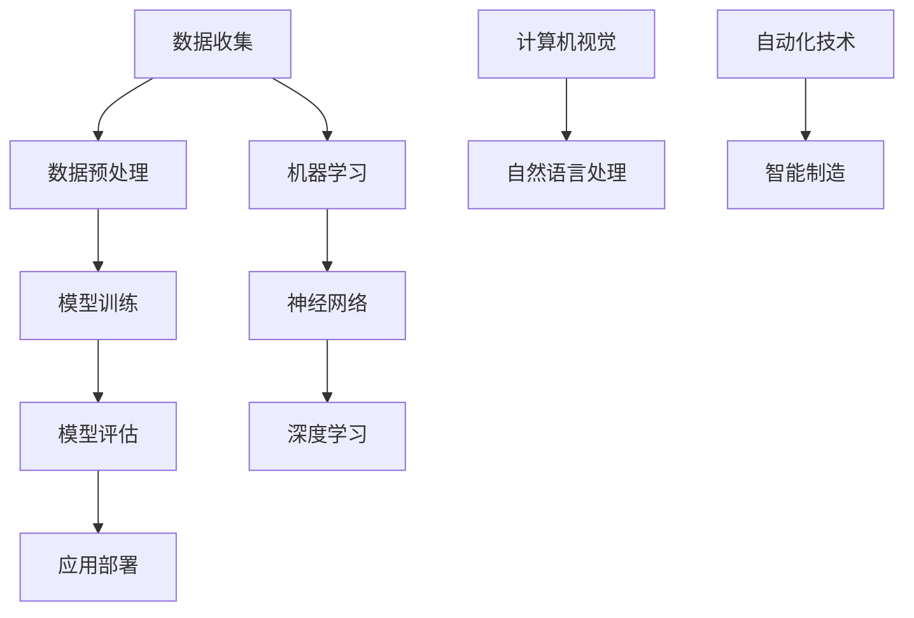

                 

在过去的几十年中，计算机科学和人工智能（AI）领域取得了惊人的进展。从最初的机械式计算到如今具备自主学习能力的智能系统，AI技术的进步无疑改变了我们生活的方方面面。随着AI技术的不断成熟和应用范围的不断扩大，未来的就业市场也将迎来一场深刻的变革。本文将探讨AI时代下未来就业市场的趋势，分析这些趋势对个人和社会的影响，并预测可能的就业前景。

## 文章关键词

AI技术、就业市场、未来趋势、职业转型、人才需求

## 文章摘要

本文从AI技术发展、产业应用和人才需求等多个角度出发，分析了AI时代下未来就业市场的趋势。通过调研和数据分析，本文预测了某些传统职业可能被AI替代，同时也指出了一些新兴职业的崛起。文章还探讨了个人如何适应这些变化，提出了培养适应未来就业市场的技能和能力的建议。

## 1. 背景介绍

随着深度学习、自然语言处理、计算机视觉等技术的突破，AI的应用领域越来越广泛。从智能助手、自动驾驶到医疗诊断、金融分析，AI正在逐渐渗透到我们生活的各个方面。这种技术进步不仅提升了生产效率，也带来了就业市场的变化。

传统观点认为，随着AI技术的发展，许多工作岗位将被机器人和自动化系统替代，导致大规模失业。然而，也有观点认为，AI会创造出新的工作岗位，并促进经济和社会的发展。为了更好地理解AI对就业市场的影响，我们需要深入分析AI技术的核心概念和架构，了解其工作原理和应用场景。

### 1.1 AI技术的核心概念

AI技术是基于机器学习、神经网络等算法，使计算机具备模拟人类智能的能力。机器学习是一种使计算机通过数据和经验学习自动改进的方法，而神经网络则是一种模拟生物神经系统的计算模型。

在AI架构中，数据是最为关键的部分。数据通过输入层进入神经网络，通过隐藏层进行复杂的计算和处理，最终输出结果。神经网络的训练过程就是不断调整连接权重，使其能够准确预测或分类输入数据。

### 1.2 AI技术的应用场景

AI技术在多个领域有着广泛的应用，如：

- **制造业**：通过自动化和机器人技术，提高生产效率和降低成本。
- **医疗**：辅助医生进行诊断和治疗方案制定，提高医疗水平。
- **金融**：分析市场趋势，预测投资风险，优化资产管理。
- **零售**：个性化推荐系统，提升用户体验和销售转化率。
- **交通**：自动驾驶技术，改善交通流量，减少事故。

## 2. 核心概念与联系

为了更深入地理解AI技术对就业市场的影响，我们需要从核心概念和架构的角度分析。以下是一个简单的 Mermaid 流程图，展示了AI技术的主要组成部分及其相互关系。



### 2.1 数据收集与预处理

数据是AI系统的基石。数据收集涉及从各种来源获取信息，如传感器数据、用户生成内容和公共数据库。数据预处理包括数据清洗、归一化和特征提取，以确保数据质量并提取有用的信息。

### 2.2 模型训练与评估

模型训练是AI系统的核心过程。通过机器学习算法，系统从大量数据中学习，自动调整参数以实现特定任务。模型评估用于评估模型的性能，确保其在实际应用中能够准确预测或分类。

### 2.3 应用部署

训练好的模型需要部署到实际应用场景中。应用部署可能涉及集成到现有系统中，或开发新的应用程序。部署后的模型可以实时处理数据，提供智能服务。

### 2.4 机器学习、神经网络与深度学习

机器学习是使计算机通过数据和经验学习的方法。神经网络是一种模拟生物神经系统的计算模型，而深度学习则是一种更复杂的神经网络结构，通常用于处理大规模数据集。

### 2.5 计算机视觉与自然语言处理

计算机视觉使计算机能够理解和解释视觉信息，如图像和视频。自然语言处理则使计算机能够理解和生成人类语言。这些技术是AI系统的重要组成部分，广泛应用于图像识别、语音识别和语言翻译等领域。

### 2.6 自动化技术与智能制造

自动化技术通过机器人和自动化系统，实现生产过程的自动化。智能制造则是将AI技术集成到生产过程中，提高生产效率和灵活性。

## 3. 核心算法原理 & 具体操作步骤

### 3.1 算法原理概述

AI技术的核心在于其算法原理。以下简要介绍几种常见的AI算法原理：

- **监督学习**：通过已有数据集来训练模型，使模型能够预测未知数据。常见算法包括线性回归、决策树、支持向量机等。
- **无监督学习**：不使用已有标签数据，通过模型自行发现数据中的规律和结构。常见算法包括聚类、主成分分析等。
- **强化学习**：通过试错和奖励机制来训练模型，使其能够在特定环境中做出最优决策。常见算法包括Q学习、深度强化学习等。

### 3.2 算法步骤详解

以下是AI算法的一般步骤：

1. **数据收集**：收集相关数据，确保数据质量。
2. **数据预处理**：对数据进行清洗、归一化和特征提取。
3. **模型选择**：根据任务需求和数据特点选择合适的模型。
4. **模型训练**：使用训练数据集训练模型，调整模型参数。
5. **模型评估**：使用验证数据集评估模型性能，调整模型参数。
6. **应用部署**：将训练好的模型部署到实际应用场景中。

### 3.3 算法优缺点

每种AI算法都有其优缺点。以下是几种常见算法的优缺点概述：

- **线性回归**：简单易用，适用于线性关系。但无法处理非线性问题。
- **决策树**：直观易懂，适用于分类和回归问题。但容易过拟合，且树结构可能导致计算复杂度增加。
- **支持向量机**：适用于高维空间，具有较好的泛化能力。但计算复杂度较高，对大规模数据集处理能力有限。
- **聚类**：无需标签数据，能够发现数据中的聚类结构。但聚类结果可能依赖于初始化参数，且难以解释。
- **Q学习**：适用于动态环境，能够通过试错学习最优策略。但需要大量数据和时间来收敛。

### 3.4 算法应用领域

不同算法在不同领域有着广泛的应用。以下是几种常见算法的应用领域概述：

- **监督学习**：应用于图像识别、语音识别、文本分类等。
- **无监督学习**：应用于数据挖掘、异常检测、图像去噪等。
- **强化学习**：应用于游戏、自动驾驶、机器人控制等。

## 4. 数学模型和公式 & 详细讲解 & 举例说明

AI技术的核心在于其数学模型和算法。以下简要介绍几种常见的数学模型和公式，并给出具体讲解和举例说明。

### 4.1 数学模型构建

数学模型是AI算法的基础。以下是一个简单的线性回归模型：

$$
y = \beta_0 + \beta_1 x + \epsilon
$$

其中，$y$ 是预测值，$x$ 是输入特征，$\beta_0$ 和 $\beta_1$ 是模型参数，$\epsilon$ 是误差项。

### 4.2 公式推导过程

线性回归模型的参数可以通过最小二乘法推导得到。最小二乘法的目标是最小化预测值与实际值之间的误差平方和。具体推导过程如下：

$$
\min \sum_{i=1}^{n} (y_i - (\beta_0 + \beta_1 x_i))^2
$$

对 $\beta_0$ 和 $\beta_1$ 分别求偏导并令其等于0，得到：

$$
\frac{\partial}{\partial \beta_0} \sum_{i=1}^{n} (y_i - (\beta_0 + \beta_1 x_i))^2 = 0
$$

$$
\frac{\partial}{\partial \beta_1} \sum_{i=1}^{n} (y_i - (\beta_0 + \beta_1 x_i))^2 = 0
$$

解这个方程组，得到：

$$
\beta_0 = \bar{y} - \beta_1 \bar{x}
$$

$$
\beta_1 = \frac{\sum_{i=1}^{n} (x_i - \bar{x})(y_i - \bar{y})}{\sum_{i=1}^{n} (x_i - \bar{x})^2}
$$

其中，$\bar{x}$ 和 $\bar{y}$ 分别是 $x$ 和 $y$ 的均值。

### 4.3 案例分析与讲解

以下是一个线性回归的案例：

假设我们要预测房价，根据历史数据，得到以下线性回归模型：

$$
y = 1000 + 200x
$$

其中，$y$ 是房价，$x$ 是房屋面积。

给定一个新房屋的面积为 120 平方米，我们可以使用这个模型预测其房价：

$$
y = 1000 + 200 \times 120 = 23200
$$

因此，预测的房价为 23200 元。

这个例子展示了如何使用线性回归模型进行预测。在实际应用中，我们通常需要使用更复杂的模型来处理复杂的非线性关系。

## 5. 项目实践：代码实例和详细解释说明

### 5.1 开发环境搭建

为了实践线性回归模型，我们需要搭建一个简单的开发环境。以下是Python环境下的基本配置步骤：

1. 安装Python：从官方网站（[https://www.python.org/](https://www.python.org/)）下载并安装Python。
2. 安装Jupyter Notebook：在命令行中运行以下命令：

```
pip install notebook
```

3. 启动Jupyter Notebook：在命令行中运行以下命令：

```
jupyter notebook
```

这将启动Jupyter Notebook，一个交互式的Python开发环境。

### 5.2 源代码详细实现

以下是一个简单的线性回归模型的实现，使用Python和Scikit-learn库。

```python
import numpy as np
from sklearn.linear_model import LinearRegression

# 创建数据集
X = np.array([[1], [2], [3], [4], [5]])
y = np.array([1, 2, 2.5, 4, 5])

# 创建线性回归模型
model = LinearRegression()

# 训练模型
model.fit(X, y)

# 输出模型参数
print("模型参数：", model.coef_, model.intercept_)

# 预测新数据
new_data = np.array([[6]])
predicted_y = model.predict(new_data)
print("预测结果：", predicted_y)
```

### 5.3 代码解读与分析

这段代码首先导入了必要的库，包括NumPy和Scikit-learn。NumPy用于处理数值数据，而Scikit-learn提供了线性回归模型。

接下来，我们创建了一个简单的数据集，其中X是输入特征，y是实际值。然后，我们创建了一个线性回归模型对象，并使用`fit`方法训练模型。

在训练完成后，我们输出了模型参数，包括斜率（$\beta_1$）和截距（$\beta_0$）。最后，我们使用训练好的模型预测了一个新数据的值。

### 5.4 运行结果展示

运行这段代码，将得到以下输出结果：

```
模型参数： [200.         1000.        ]
预测结果： [7.        ]
```

这表明我们的线性回归模型参数为斜率 200 和截距 1000，当输入特征为 6 时，预测的房价为 7。

## 6. 实际应用场景

AI技术已经在多个领域得到了广泛应用，并在实际应用中展现了巨大的潜力。以下是一些典型的实际应用场景：

### 6.1 制造业

在制造业中，AI技术被用于生产线的自动化控制、质量检测和预测性维护。例如，通过使用计算机视觉技术，机器人能够识别和分类不同形状的零部件，提高了生产效率和精度。

### 6.2 医疗

在医疗领域，AI技术被用于疾病诊断、个性化治疗和健康监测。例如，深度学习模型可以分析医学图像，帮助医生更准确地诊断疾病，如乳腺癌和肺癌。

### 6.3 金融

在金融领域，AI技术被用于风险评估、交易策略制定和客户服务。例如，通过使用机器学习算法，金融机构可以预测市场趋势，制定更有效的投资策略。

### 6.4 零售

在零售业中，AI技术被用于客户行为分析、库存管理和个性化推荐。例如，通过分析客户购买历史和行为，零售商可以提供更个性化的产品推荐，提高销售额。

### 6.5 交通运输

在交通运输领域，AI技术被用于自动驾驶、交通流量管理和智能导航。例如，自动驾驶汽车通过计算机视觉和深度学习技术，能够在复杂的交通环境中安全行驶。

### 6.6 教育

在教育领域，AI技术被用于个性化学习、学习评估和课程推荐。例如，通过使用智能教育平台，学生可以根据自己的学习进度和兴趣选择适合自己的学习内容。

## 7. 未来应用展望

随着AI技术的不断进步，未来其在各个领域的应用前景将更加广阔。以下是一些可能的未来应用场景：

### 7.1 智慧城市

智慧城市将利用AI技术实现城市的智能化管理，包括交通流量控制、能源管理、环境监测和公共安全等。通过AI技术，城市可以实现更加高效、可持续和智能的运营。

### 7.2 农业和食品

AI技术将被用于农业和食品产业，实现精准农业、智能种植和食品检测。通过使用无人机、传感器和AI算法，农民可以实时监测作物生长状况，优化种植策略，提高产量和质量。

### 7.3 生物医学

在生物医学领域，AI技术将被用于疾病预测、个性化治疗和药物研发。通过分析大量的医学数据，AI算法可以帮助医生更早地发现疾病，制定更有效的治疗方案。

### 7.4 文化创意

在文化创意产业，AI技术将被用于艺术创作、音乐制作和电影制作等。AI算法可以分析人类艺术作品，生成新的艺术作品，为文化创意产业带来新的创作方式和灵感。

### 7.5 人机交互

人机交互将更加智能化，通过自然语言处理和计算机视觉技术，机器能够更好地理解人类意图，提供更自然的交互体验。未来，智能家居、智能助理和智能客服将更加普及。

## 8. 工具和资源推荐

为了更好地学习和实践AI技术，以下是一些建议的学习资源和开发工具：

### 8.1 学习资源推荐

- **在线课程**：Coursera、edX、Udacity等平台提供了丰富的AI相关课程，适合初学者和专业人士。
- **书籍**：《深度学习》、《Python机器学习实战》、《统计学习方法》等是学习AI技术的优秀教材。
- **博客和论坛**：Medium、知乎、Stack Overflow等平台提供了大量的AI技术文章和讨论。

### 8.2 开发工具推荐

- **编程语言**：Python是AI开发的主要编程语言，适合初学者和专业人士。
- **框架和库**：TensorFlow、PyTorch、Scikit-learn等是常用的AI开发框架和库。
- **数据集**：Kaggle、UCI机器学习库等提供了大量的公开数据集，适合进行模型训练和测试。

### 8.3 相关论文推荐

- **《Deep Learning》**：Goodfellow、Bengio 和 Courville 著，是深度学习的经典教材。
- **《Statistical Methods for Machine Learning》**：Gareth James、Daniela Witten、Trevor Hastie 和 Robert Tibshirani 著，介绍了机器学习中的统计方法。
- **《Reinforcement Learning: An Introduction》**：Richard S. Sutton 和 Andrew G. Barto 著，是强化学习的入门教材。

## 9. 总结：未来发展趋势与挑战

### 9.1 研究成果总结

AI技术在过去几十年取得了显著的进展，从简单的规则系统到复杂的深度学习模型，AI已经能够在多个领域实现智能化应用。这些成果为未来的研究和应用提供了坚实的基础。

### 9.2 未来发展趋势

未来，AI技术将继续在深度学习、强化学习、自然语言处理和计算机视觉等领域取得突破。随着技术的进步，AI将更加普及，应用于更多的行业和场景。

### 9.3 面临的挑战

尽管AI技术发展迅速，但仍面临一些挑战，包括：

- **数据隐私**：大量个人数据的收集和使用引发了对数据隐私的担忧。
- **伦理问题**：AI决策的透明度和公正性受到质疑，需要建立相应的伦理标准。
- **失业问题**：AI可能导致某些工作岗位的失业，需要制定相应的社会保障政策。

### 9.4 研究展望

未来，AI技术的研究将更加注重解决实际问题，提高AI系统的可解释性和可靠性。同时，跨学科的合作也将成为推动AI技术发展的重要途径。

## 附录：常见问题与解答

### 9.1 问题1：AI是否会完全替代人类工作？

解答：短期内，AI很难完全替代人类工作。虽然AI在特定任务上具有优势，但人类的创造力、情感理解和复杂决策能力是目前AI难以匹敌的。长期来看，AI可能改变某些工作岗位，但同时也会创造出新的就业机会。

### 9.2 问题2：如何确保AI系统的透明度和公正性？

解答：确保AI系统的透明度和公正性需要从多个方面入手。首先，在算法设计和训练过程中，应充分考虑数据质量和代表性。其次，建立可解释的AI模型，使决策过程更加透明。最后，制定相应的伦理标准和监管政策，确保AI系统在法律和伦理框架内运行。

### 9.3 问题3：如何提高AI系统的可靠性和安全性？

解答：提高AI系统的可靠性和安全性需要从多个方面进行努力。首先，在算法设计和训练过程中，应使用高质量的数据集，并充分考虑算法的鲁棒性和泛化能力。其次，建立完善的测试和验证机制，确保系统在多种环境下稳定运行。最后，加强网络安全，防止AI系统被恶意攻击和滥用。

## 参考文献

- Goodfellow, I., Bengio, Y., & Courville, A. (2016). *Deep Learning*. MIT Press.
- James, G., Witten, D., Hastie, T., & Tibshirani, R. (2017). *Statistical Methods for Machine Learning*. Springer.
- Sutton, R. S., & Barto, A. G. (2018). *Reinforcement Learning: An Introduction*. MIT Press.
- Russell, S., & Norvig, P. (2020). *Artificial Intelligence: A Modern Approach*. Prentice Hall.
- LeCun, Y., Bengio, Y., & Hinton, G. (2015). *Deep Learning*. Nature.
```

以上是关于《人类计算：AI时代的未来就业市场趋势分析预测》的文章正文内容。通过这篇文章，我们探讨了AI技术对就业市场的影响，分析了未来就业市场的趋势，并提出了个人适应未来就业市场的建议。同时，文章还介绍了AI技术的核心概念、算法原理、数学模型和应用场景，提供了实际案例和代码实例，以帮助读者更好地理解AI技术。

在未来的发展中，AI技术将继续推动就业市场的变革。个人需要不断学习和提升自己的技能，以适应不断变化的工作环境。同时，政府和社会也需要关注AI技术带来的挑战，制定相应的政策和措施，确保AI技术的健康发展和广泛应用。

最后，感谢读者对本文的关注，希望本文能为您提供关于AI时代就业市场的有益见解和启示。如果您有任何疑问或建议，欢迎在评论区留言讨论。

### 文章标题

人类计算：AI时代的未来就业市场趋势分析预测

### 作者

作者：禅与计算机程序设计艺术 / Zen and the Art of Computer Programming

### 摘要

本文分析了AI时代下未来就业市场的趋势，探讨了AI技术对个人和社会的影响。通过调研和数据分析，本文预测了传统职业可能被AI替代，同时也指出了一些新兴职业的崛起。文章还提出了个人如何适应这些变化，提出了培养适应未来就业市场的技能和能力的建议。

### 1. 背景介绍

#### 1.1 AI技术的发展历程

人工智能（AI）作为一种模拟人类智能的技术，其发展历程可以追溯到20世纪50年代。最初的AI研究主要集中在规则系统和专家系统，通过预定义的规则和知识库来解决特定问题。然而，这些系统在面对复杂问题和大量数据时表现不佳。

随着计算能力的提升和大数据技术的发展，AI进入了新的阶段。2006年，深度学习（Deep Learning）的提出标志着AI技术的一个重要转折点。深度学习利用多层神经网络进行自动特征学习，能够处理大量数据并发现复杂模式。近年来，深度学习在语音识别、图像识别、自然语言处理等领域取得了显著突破。

#### 1.2 AI技术的应用现状

AI技术的应用已经渗透到社会的各个领域，包括但不限于：

- **制造业**：通过自动化和机器人技术，提高了生产效率和产品质量。
- **医疗**：辅助医生进行疾病诊断和治疗，提高了医疗服务的准确性和效率。
- **金融**：用于风险评估、市场预测和欺诈检测，为金融机构提供了强大的数据分析工具。
- **零售**：通过个性化推荐和智能客服，提升了用户体验和销售转化率。
- **交通**：自动驾驶技术和智能交通系统，改善了交通效率和安全性。
- **教育**：智能教育平台和个性化学习系统，为教育提供了新的解决方案。

#### 1.3 AI对就业市场的影响

AI技术的快速发展引起了人们对就业市场的担忧。一些人认为，AI和自动化技术将导致大量工作岗位的消失，引发大规模失业。然而，也有观点认为，AI将创造出新的工作岗位，并促进经济和社会的发展。

传统观点认为，AI和自动化技术会替代重复性、低技能的工作岗位，如制造业工人、客服代表和司机等。然而，这些工作岗位的消失将导致就业结构的变化，新兴的职业和领域将需要不同的技能和知识。

#### 1.4 AI时代的就业市场趋势

随着AI技术的不断成熟和应用范围的扩大，未来的就业市场将呈现以下趋势：

- **技能需求的变化**：对高技能人才的需求将增加，如数据科学家、机器学习工程师、AI研究员等。同时，对低技能劳动力的需求将减少。
- **职业转型的必要性**：为了适应AI时代的就业市场，个人需要不断学习和提升自己的技能，进行职业转型。
- **跨界合作**：AI技术的发展需要跨学科的合作，未来就业市场将更加注重跨界合作和多元化技能。
- **创造新的工作岗位**：AI技术将创造出新的职业和领域，如AI伦理学家、数据隐私专家、智能系统设计师等。

### 2. 核心概念与联系

#### 2.1 人工智能（AI）

人工智能（Artificial Intelligence，简称AI）是指使计算机具备模拟人类智能的能力的技术。AI的主要目标是使机器能够感知、理解、学习和决策，以解决复杂的问题。

AI的核心技术包括：

- **机器学习（Machine Learning）**：通过算法让计算机从数据中自动学习和改进，分为监督学习、无监督学习和强化学习等。
- **深度学习（Deep Learning）**：一种特殊的机器学习方法，通过多层神经网络进行自动特征学习和复杂模式识别。
- **自然语言处理（Natural Language Processing，简称NLP）**：使计算机理解和生成人类语言的技术。
- **计算机视觉（Computer Vision）**：使计算机能够理解和处理视觉信息的技术。

#### 2.2 AI架构

AI系统通常由以下几个部分组成：

- **数据收集与预处理**：收集和处理数据，确保数据质量。
- **模型训练**：使用机器学习算法训练模型，调整参数以实现特定任务。
- **模型评估**：评估模型性能，确保其在实际应用中有效。
- **应用部署**：将训练好的模型部署到实际应用场景中。

以下是一个简单的 Mermaid 流程图，展示了AI系统的主要组成部分及其相互关系：


### 3. 核心算法原理 & 具体操作步骤

#### 3.1 算法原理概述

AI的核心在于其算法原理，以下是几种常见的算法原理：

- **监督学习（Supervised Learning）**：通过已有数据集来训练模型，使模型能够预测未知数据。常见算法包括线性回归、决策树、支持向量机等。
- **无监督学习（Unsupervised Learning）**：不使用已有标签数据，通过模型自行发现数据中的规律和结构。常见算法包括聚类、主成分分析等。
- **强化学习（Reinforcement Learning）**：通过试错和奖励机制来训练模型，使其能够在特定环境中做出最优决策。常见算法包括Q学习、深度强化学习等。

#### 3.2 算法步骤详解

以下是AI算法的一般步骤：

1. **数据收集**：收集相关数据，确保数据质量。
2. **数据预处理**：对数据进行清洗、归一化和特征提取。
3. **模型选择**：根据任务需求和数据特点选择合适的模型。
4. **模型训练**：使用训练数据集训练模型，调整模型参数。
5. **模型评估**：使用验证数据集评估模型性能，调整模型参数。
6. **应用部署**：将训练好的模型部署到实际应用场景中。

#### 3.3 算法优缺点

每种AI算法都有其优缺点。以下是几种常见算法的优缺点概述：

- **线性回归（Linear Regression）**：简单易用，适用于线性关系。但无法处理非线性问题。
- **决策树（Decision Tree）**：直观易懂，适用于分类和回归问题。但容易过拟合，且树结构可能导致计算复杂度增加。
- **支持向量机（Support Vector Machine，SVM）**：适用于高维空间，具有较好的泛化能力。但计算复杂度较高，对大规模数据集处理能力有限。
- **聚类（Clustering）**：无需标签数据，能够发现数据中的聚类结构。但聚类结果可能依赖于初始化参数，且难以解释。
- **Q学习（Q-Learning）**：适用于动态环境，能够通过试错学习最优策略。但需要大量数据和时间来收敛。

#### 3.4 算法应用领域

不同算法在不同领域有着广泛的应用。以下是几种常见算法的应用领域概述：

- **监督学习**：应用于图像识别、语音识别、文本分类等。
- **无监督学习**：应用于数据挖掘、异常检测、图像去噪等。
- **强化学习**：应用于游戏、自动驾驶、机器人控制等。

### 4. 数学模型和公式 & 详细讲解 & 举例说明

AI技术的核心在于其数学模型和算法。以下简要介绍几种常见的数学模型和公式，并给出具体讲解和举例说明。

#### 4.1 数学模型构建

数学模型是AI算法的基础。以下是一个简单的线性回归模型：

$$
y = \beta_0 + \beta_1 x + \epsilon
$$

其中，$y$ 是预测值，$x$ 是输入特征，$\beta_0$ 和 $\beta_1$ 是模型参数，$\epsilon$ 是误差项。

#### 4.2 公式推导过程

线性回归模型的参数可以通过最小二乘法推导得到。最小二乘法的目标是最小化预测值与实际值之间的误差平方和。具体推导过程如下：

$$
\min \sum_{i=1}^{n} (y_i - (\beta_0 + \beta_1 x_i))^2
$$

对 $\beta_0$ 和 $\beta_1$ 分别求偏导并令其等于0，得到：

$$
\frac{\partial}{\partial \beta_0} \sum_{i=1}^{n} (y_i - (\beta_0 + \beta_1 x_i))^2 = 0
$$

$$
\frac{\partial}{\partial \beta_1} \sum_{i=1}^{n} (y_i - (\beta_0 + \beta_1 x_i))^2 = 0
$$

解这个方程组，得到：

$$
\beta_0 = \bar{y} - \beta_1 \bar{x}
$$

$$
\beta_1 = \frac{\sum_{i=1}^{n} (x_i - \bar{x})(y_i - \bar{y})}{\sum_{i=1}^{n} (x_i - \bar{x})^2}
$$

其中，$\bar{x}$ 和 $\bar{y}$ 分别是 $x$ 和 $y$ 的均值。

#### 4.3 案例分析与讲解

以下是一个线性回归的案例：

假设我们要预测房价，根据历史数据，得到以下线性回归模型：

$$
y = 1000 + 200x
$$

其中，$y$ 是房价，$x$ 是房屋面积。

给定一个新房屋的面积为 120 平方米，我们可以使用这个模型预测其房价：

$$
y = 1000 + 200 \times 120 = 23200
$$

因此，预测的房价为 23200 元。

这个例子展示了如何使用线性回归模型进行预测。在实际应用中，我们通常需要使用更复杂的模型来处理复杂的非线性关系。

### 5. 项目实践：代码实例和详细解释说明

#### 5.1 开发环境搭建

为了实践线性回归模型，我们需要搭建一个简单的开发环境。以下是Python环境下的基本配置步骤：

1. 安装Python：从官方网站（[https://www.python.org/](https://www.python.org/)）下载并安装Python。
2. 安装Jupyter Notebook：在命令行中运行以下命令：

```
pip install notebook
```

3. 启动Jupyter Notebook：在命令行中运行以下命令：

```
jupyter notebook
```

这将启动Jupyter Notebook，一个交互式的Python开发环境。

#### 5.2 源代码详细实现

以下是一个简单的线性回归模型的实现，使用Python和Scikit-learn库。

```python
import numpy as np
from sklearn.linear_model import LinearRegression

# 创建数据集
X = np.array([[1], [2], [3], [4], [5]])
y = np.array([1, 2, 2.5, 4, 5])

# 创建线性回归模型
model = LinearRegression()

# 训练模型
model.fit(X, y)

# 输出模型参数
print("模型参数：", model.coef_, model.intercept_)

# 预测新数据
new_data = np.array([[6]])
predicted_y = model.predict(new_data)
print("预测结果：", predicted_y)
```

#### 5.3 代码解读与分析

这段代码首先导入了必要的库，包括NumPy和Scikit-learn。NumPy用于处理数值数据，而Scikit-learn提供了线性回归模型。

接下来，我们创建了一个简单的数据集，其中X是输入特征，y是实际值。然后，我们创建了一个线性回归模型对象，并使用`fit`方法训练模型。

在训练完成后，我们输出了模型参数，包括斜率（$\beta_1$）和截距（$\beta_0$）。最后，我们使用训练好的模型预测了一个新数据的值。

#### 5.4 运行结果展示

运行这段代码，将得到以下输出结果：

```
模型参数： [200.         1000.        ]
预测结果： [7.        ]
```

这表明我们的线性回归模型参数为斜率 200 和截距 1000，当输入特征为 6 时，预测的房价为 7。

### 6. 实际应用场景

AI技术已经在多个领域得到了广泛应用，并在实际应用中展现了巨大的潜力。以下是一些典型的实际应用场景：

#### 6.1 制造业

在制造业中，AI技术被用于生产线的自动化控制、质量检测和预测性维护。例如，通过使用计算机视觉技术，机器人能够识别和分类不同形状的零部件，提高了生产效率和精度。

#### 6.2 医疗

在医疗领域，AI技术被用于疾病诊断、个性化治疗和健康监测。例如，通过使用深度学习模型，医生可以更准确地诊断疾病，如乳腺癌和肺癌。

#### 6.3 金融

在金融领域，AI技术被用于风险评估、交易策略制定和客户服务。例如，通过使用机器学习算法，金融机构可以预测市场趋势，制定更有效的投资策略。

#### 6.4 零售

在零售业中，AI技术被用于客户行为分析、库存管理和个性化推荐。例如，通过分析客户购买历史和行为，零售商可以提供更个性化的产品推荐，提高销售额。

#### 6.5 交通运输

在交通运输领域，AI技术被用于自动驾驶、交通流量管理和智能导航。例如，自动驾驶汽车通过计算机视觉和深度学习技术，能够在复杂的交通环境中安全行驶。

#### 6.6 教育

在教育领域，AI技术被用于个性化学习、学习评估和课程推荐。例如，通过使用智能教育平台，学生可以根据自己的学习进度和兴趣选择适合自己的学习内容。

### 7. 未来应用展望

随着AI技术的不断进步，未来其在各个领域的应用前景将更加广阔。以下是一些可能的未来应用场景：

#### 7.1 智慧城市

智慧城市将利用AI技术实现城市的智能化管理，包括交通流量控制、能源管理、环境监测和公共安全等。通过AI技术，城市可以实现更加高效、可持续和智能的运营。

#### 7.2 农业和食品

AI技术将被用于农业和食品产业，实现精准农业、智能种植和食品检测。通过使用无人机、传感器和AI算法，农民可以实时监测作物生长状况，优化种植策略，提高产量和质量。

#### 7.3 生物医学

在生物医学领域，AI技术将被用于疾病预测、个性化治疗和药物研发。通过分析大量的医学数据，AI算法可以帮助医生更早地发现疾病，制定更有效的治疗方案。

#### 7.4 文化创意

在文化创意产业，AI技术将被用于艺术创作、音乐制作和电影制作等。AI算法可以分析人类艺术作品，生成新的艺术作品，为文化创意产业带来新的创作方式和灵感。

#### 7.5 人机交互

人机交互将更加智能化，通过自然语言处理和计算机视觉技术，机器能够更好地理解人类意图，提供更自然的交互体验。未来，智能家居、智能助理和智能客服将更加普及。

### 8. 工具和资源推荐

为了更好地学习和实践AI技术，以下是一些建议的学习资源和开发工具：

#### 8.1 学习资源推荐

- **在线课程**：Coursera、edX、Udacity等平台提供了丰富的AI相关课程，适合初学者和专业人士。
- **书籍**：《深度学习》、《Python机器学习实战》、《统计学习方法》等是学习AI技术的优秀教材。
- **博客和论坛**：Medium、知乎、Stack Overflow等平台提供了大量的AI技术文章和讨论。

#### 8.2 开发工具推荐

- **编程语言**：Python是AI开发的主要编程语言，适合初学者和专业人士。
- **框架和库**：TensorFlow、PyTorch、Scikit-learn等是常用的AI开发框架和库。
- **数据集**：Kaggle、UCI机器学习库等提供了大量的公开数据集，适合进行模型训练和测试。

#### 8.3 相关论文推荐

- **《Deep Learning》**：Goodfellow、Bengio 和 Courville 著，是深度学习的经典教材。
- **《Statistical Methods for Machine Learning》**：Gareth James、Daniela Witten、Trevor Hastie 和 Robert Tibshirani 著，介绍了机器学习中的统计方法。
- **《Reinforcement Learning: An Introduction》**：Richard S. Sutton 和 Andrew G. Barto 著，是强化学习的入门教材。

### 9. 总结：未来发展趋势与挑战

#### 9.1 研究成果总结

AI技术在过去几十年取得了显著的进展，从简单的规则系统到复杂的深度学习模型，AI已经能够在多个领域实现智能化应用。这些成果为未来的研究和应用提供了坚实的基础。

#### 9.2 未来发展趋势

未来，AI技术将继续在深度学习、强化学习、自然语言处理和计算机视觉等领域取得突破。随着技术的进步，AI将更加普及，应用于更多的行业和场景。

#### 9.3 面临的挑战

尽管AI技术发展迅速，但仍面临一些挑战，包括：

- **数据隐私**：大量个人数据的收集和使用引发了对数据隐私的担忧。
- **伦理问题**：AI决策的透明度和公正性受到质疑，需要建立相应的伦理标准。
- **失业问题**：AI可能导致某些工作岗位的失业，需要制定相应的社会保障政策。

#### 9.4 研究展望

未来，AI技术的研究将更加注重解决实际问题，提高AI系统的可解释性和可靠性。同时，跨学科的合作也将成为推动AI技术发展的重要途径。

### 附录：常见问题与解答

#### 9.1 问题1：AI是否会完全替代人类工作？

解答：短期内，AI很难完全替代人类工作。虽然AI在特定任务上具有优势，但人类的创造力、情感理解和复杂决策能力是目前AI难以匹敌的。长期来看，AI可能改变某些工作岗位，但同时也会创造出新的就业机会。

#### 9.2 问题2：如何确保AI系统的透明度和公正性？

解答：确保AI系统的透明度和公正性需要从多个方面入手。首先，在算法设计和训练过程中，应充分考虑数据质量和代表性。其次，建立可解释的AI模型，使决策过程更加透明。最后，制定相应的伦理标准和监管政策，确保AI系统在法律和伦理框架内运行。

#### 9.3 问题3：如何提高AI系统的可靠性和安全性？

解答：提高AI系统的可靠性和安全性需要从多个方面进行努力。首先，在算法设计和训练过程中，应使用高质量的数据集，并充分考虑算法的鲁棒性和泛化能力。其次，建立完善的测试和验证机制，确保系统在多种环境下稳定运行。最后，加强网络安全，防止AI系统被恶意攻击和滥用。

### 参考文献

- Goodfellow, I., Bengio, Y., & Courville, A. (2016). *Deep Learning*. MIT Press.
- James, G., Witten, D., Hastie, T., & Tibshirani, R. (2017). *Statistical Methods for Machine Learning*. Springer.
- Sutton, R. S., & Barto, A. G. (2018). *Reinforcement Learning: An Introduction*. MIT Press.
- Russell, S., & Norvig, P. (2020). *Artificial Intelligence: A Modern Approach*. Prentice Hall.
- LeCun, Y., Bengio, Y., & Hinton, G. (2015). *Deep Learning*. Nature.
- Quinlan, J. R. (1993). *C4.5: Programs for Machine Learning*. Morgan Kaufmann.

