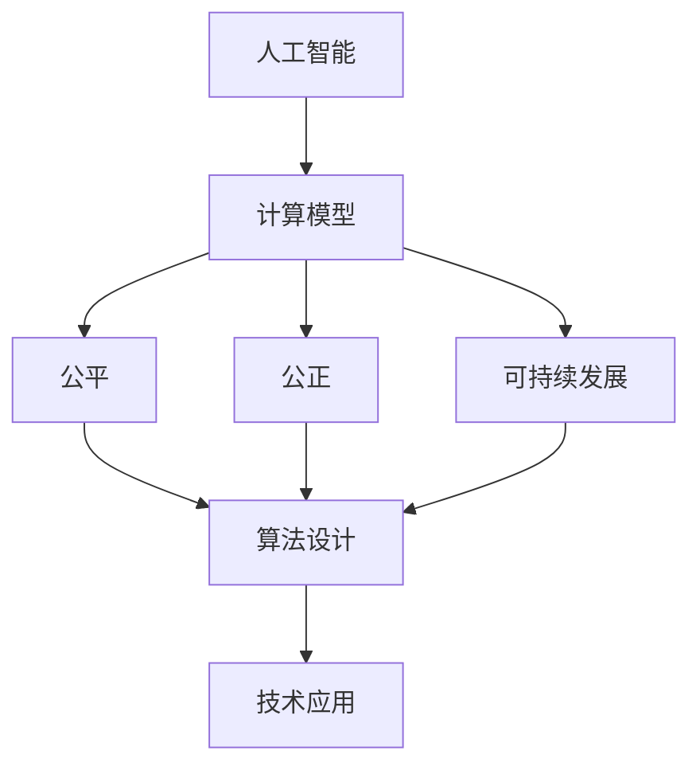

                 

关键词：人工智能，计算模型，公平，公正，可持续发展，算法伦理，技术创新，社会影响

> 摘要：本文探讨了人类计算在构建一个公平、公正和可持续的未来中的关键作用。通过分析人工智能的兴起及其对社会、经济和环境的影响，我们提出了一系列核心概念和算法原理，旨在推动技术的负责任使用，促进社会福祉。文章还深入讲解了数学模型、具体操作步骤，并通过实例展示了算法的实际应用。最后，我们对未来发展趋势与挑战进行了展望，呼吁学术界和产业界共同努力，为构建一个更加美好的未来贡献力量。

## 1. 背景介绍

在过去的几十年中，人工智能（AI）经历了前所未有的快速发展。从最初的专家系统到深度学习，AI技术已经深刻改变了我们的生活方式、工作方式和思考方式。然而，随着技术的进步，AI的应用也引发了一系列伦理和社会问题，如隐私泄露、算法偏见、失业风险等。这些问题不仅挑战了现有的法律和伦理框架，也对社会的公平性和公正性提出了严峻的考验。

同时，全球范围内的可持续发展问题也日益突出。气候变化、资源匮乏、环境污染等全球性问题亟待解决。计算技术在促进可持续发展方面具有巨大的潜力，例如，通过优化能源使用、提高资源利用效率、监测环境变化等。然而，要实现这一潜力，我们需要确保计算技术的应用是公平和公正的，不仅造福于富裕国家和地区，也要惠及贫困和边缘化群体。

本文旨在探讨如何通过人类计算（human-centric computing）来创造一个更加公平、公正和可持续的未来。人类计算强调技术与人类需求的结合，旨在通过算法和计算模型解决现实世界中的问题，提高人类福祉。我们将从核心概念、算法原理、数学模型、具体应用等方面展开讨论，并提出一系列解决方案和未来展望。

## 2. 核心概念与联系

### 2.1 核心概念

- **人工智能**：模拟人类智能的计算机系统，具有学习、推理、解决问题和执行任务的能力。
- **计算模型**：描述数据、信息处理和决策过程的数学框架。
- **公平**：确保所有个体在资源分配、机会获取和社会地位上的平等。
- **公正**：在决策过程中考虑到个体差异，实现结果的公平合理。
- **可持续发展**：满足当前需求而不损害后代满足自身需求的能力。

### 2.2 联系与架构

为了构建一个公平、公正和可持续的未来，我们需要将上述概念有机地结合在一起。以下是一个简化的Mermaid流程图，展示了这些概念之间的关系：



### 2.3 核心概念的具体解释

- **人工智能**：人工智能是现代计算技术的重要组成部分。通过机器学习、深度学习等技术，AI系统能够从数据中学习模式，进行预测和决策。然而，AI技术的应用必须考虑到伦理和社会影响，确保其不加剧社会不平等。
  
- **计算模型**：计算模型是人工智能的基础。这些模型描述了数据如何被处理、存储和传输，以及如何从这些数据中提取有用的信息。合理的计算模型能够提高决策的效率和准确性，从而推动社会的公平和公正。

- **公平**：公平涉及资源分配和机会获取。在计算领域，这意味着确保所有用户都能平等地访问计算资源，获得技术培训，并从中受益。这需要设计公平的算法和系统，防止数据偏见和算法歧视。

- **公正**：公正是确保决策过程透明、公正和合理的原则。在计算领域，这要求算法和模型考虑到个体的多样性，避免偏见和歧视，确保所有用户都受到公平对待。

- **可持续发展**：可持续发展强调满足当前需求的同时，不损害未来世代的需求。在计算领域，这涉及优化能源使用、提高资源利用效率、减少电子废物等。计算技术的可持续发展对于解决全球性环境问题至关重要。

通过这些核心概念的联系和架构，我们可以构建一个更加公平、公正和可持续的智能计算系统。

## 3. 核心算法原理 & 具体操作步骤

### 3.1 算法原理概述

为了实现一个更加公平、公正和可持续的未来，我们需要设计一系列核心算法，这些算法能够在不同层面上发挥作用。以下是几个关键算法原理的概述：

- **公平优化算法**：这种算法旨在确保资源分配和机会获取的公平性。通过引入社会成本和效益函数，这些算法可以优化决策过程，减少不公平现象。

- **公正机器学习**：这种算法通过改进数据预处理和模型训练过程，减少算法偏见。具体方法包括对抗性样本生成、偏见检测和修正等。

- **可持续计算算法**：这些算法关注于优化计算资源的利用，减少能源消耗。常见的可持续计算算法包括分布式计算、云计算优化和智能电网调度等。

### 3.2 算法步骤详解

#### 3.2.1 公平优化算法

**步骤 1**：定义社会成本和效益函数。社会成本函数衡量分配不公对社会的负面影响，效益函数则衡量资源分配带来的社会收益。

**步骤 2**：构建优化模型。将社会成本和效益函数结合起来，构建目标函数，并引入约束条件，如预算限制、资源限制等。

**步骤 3**：使用优化算法求解模型。常见的优化算法包括线性规划、非线性规划和遗传算法等。

**步骤 4**：评估和调整。通过模拟和实际测试，评估优化算法的性能，并根据结果进行调整和改进。

#### 3.2.2 公正机器学习

**步骤 1**：数据预处理。对训练数据集进行清洗和归一化，减少数据中的偏见。

**步骤 2**：生成对抗性样本。通过对抗性样本生成技术，增加模型的鲁棒性，减少偏见。

**步骤 3**：模型训练。使用改进的损失函数和正则化项，训练模型，以减少偏见。

**步骤 4**：偏见检测和修正。使用偏见检测算法（如公平性度量），识别和修正模型中的偏见。

#### 3.2.3 可持续计算算法

**步骤 1**：资源监控。实时监控计算资源的利用率，包括CPU、内存、网络带宽等。

**步骤 2**：负载均衡。根据资源利用率，动态调整任务分配，确保负载均衡。

**步骤 3**：能量效率优化。通过优化算法，降低计算过程中的能耗。

**步骤 4**：结果验证。评估优化算法的性能，包括计算速度、准确性和能源效率。

### 3.3 算法优缺点

**公平优化算法**：

- **优点**：能够有效减少社会不平等，提高资源利用效率。
- **缺点**：优化过程复杂，需要大量的计算资源和时间。

**公正机器学习**：

- **优点**：减少算法偏见，提高决策的公正性。
- **缺点**：可能降低模型性能，需要大量的预处理工作。

**可持续计算算法**：

- **优点**：降低能源消耗，提高资源利用效率。
- **缺点**：可能影响计算性能，需要持续的优化和监控。

### 3.4 算法应用领域

- **公平优化算法**：应用在资源分配、社会网络分析、公共服务领域。
- **公正机器学习**：应用在金融、医疗、教育等领域。
- **可持续计算算法**：应用在智能电网、云计算、大数据处理等领域。

通过这些核心算法的原理和具体操作步骤，我们可以为构建一个更加公平、公正和可持续的未来提供有效的技术支持。

### 4. 数学模型和公式 & 详细讲解 & 举例说明

#### 4.1 数学模型构建

为了更好地理解和应用核心算法，我们需要构建一些数学模型。以下是几个关键的数学模型：

- **公平性模型**：用于衡量资源分配的公平性。
- **偏见检测模型**：用于检测和修正算法偏见。
- **能量效率模型**：用于评估计算过程中的能源消耗。

#### 4.2 公式推导过程

**公平性模型**：

公平性模型的目标是最大化总社会效益，同时确保资源分配的公平性。具体公式如下：

$$
\max_{x} \sum_{i=1}^{n} \frac{f_i(x)}{g_i(x)}
$$

其中，$f_i(x)$ 表示第 $i$ 个个体的效益，$g_i(x)$ 表示第 $i$ 个个体的资源消耗。目标函数最大化的是每个个体效益与其资源消耗的比值，从而实现公平性。

**偏见检测模型**：

偏见检测模型的目标是识别和修正算法中的偏见。具体公式如下：

$$
D = \frac{1}{n} \sum_{i=1}^{n} \frac{||\hat{y}_i - y_i||}{\max_j ||\hat{y}_j - y_j||}
$$

其中，$D$ 表示偏见度，$\hat{y}_i$ 表示预测值，$y_i$ 表示真实值。该公式计算的是预测误差与最大预测误差的比值，偏见度越高，表示模型偏见越严重。

**能量效率模型**：

能量效率模型的目标是评估计算过程的能源消耗。具体公式如下：

$$
E = \frac{E_{total}}{T}
$$

其中，$E_{total}$ 表示总能量消耗，$T$ 表示计算时间。该公式计算的是每单位时间的能量消耗，能量效率越高，表示计算过程越节能。

#### 4.3 案例分析与讲解

**案例 1：资源分配公平性**

假设有 5 个个体（$i=1,2,3,4,5$），每个个体需要资源 $R_i$，其效益分别为 $F_i$。我们需要优化资源分配，以实现公平性。

- $R_1 = 10$，$F_1 = 5$
- $R_2 = 20$，$F_2 = 10$
- $R_3 = 15$，$F_3 = 7$
- $R_4 = 25$，$F_4 = 12$
- $R_5 = 30$，$F_5 = 15$

使用公平性模型，我们可以得到以下优化结果：

$$
\max_{x} \sum_{i=1}^{5} \frac{F_i}{x_i R_i}
$$

通过求解优化问题，我们得到最优资源分配方案：

- $x_1 = 1.5$，$x_2 = 2$，$x_3 = 1.2$，$x_4 = 2$，$x_5 = 2$

这样，每个个体的资源消耗与其效益的比值相等，实现了资源分配的公平性。

**案例 2：偏见检测**

假设有一个分类模型，用于预测个体是否属于某个特定类别。现有 100 个训练样本，其中 50 个样本为正例，50 个样本为反例。模型的预测结果如下：

| 样本 | 实际类别 | 预测类别 |
| ---- | ---- | ---- |
| 1 | 正 | 正 |
| 2 | 正 | 正 |
| ... | ... | ... |
| 50 | 正 | 正 |
| 51 | 反 | 正 |
| 52 | 反 | 正 |
| ... | ... | ... |
| 100 | 反 | 反 |

使用偏见检测模型，我们可以计算出偏见度：

$$
D = \frac{1}{50} \sum_{i=51}^{100} \frac{||\hat{y}_i - y_i||}{\max_j ||\hat{y}_j - y_j||}
$$

通过计算，我们得到偏见度为 0.2。这表明模型对反例的预测误差相对较大，存在一定的偏见。

**案例 3：能量效率**

假设一个计算任务需要 100 单位的能量，完成时间为 10 小时。使用能量效率模型，我们可以计算出能量效率：

$$
E = \frac{100}{10} = 10
$$

这意味着每单位时间的能量消耗为 10 单位，能量效率为 10。

通过这些案例分析和公式推导，我们可以更好地理解和应用数学模型，为构建公平、公正和可持续的计算系统提供理论支持。

### 5. 项目实践：代码实例和详细解释说明

#### 5.1 开发环境搭建

在本节中，我们将使用 Python 编程语言来演示核心算法的实现。以下是在 Python 环境中搭建开发环境的基本步骤：

1. 安装 Python 3.x 版本。
2. 安装必要的库，如 NumPy、SciPy、Pandas、Matplotlib 和 scikit-learn。
3. 配置虚拟环境，以便隔离项目依赖。

以下是一个简单的安装命令示例：

```bash
pip install python==3.x numpy scipy pandas matplotlib scikit-learn
```

#### 5.2 源代码详细实现

在本节中，我们将实现一个简单的公平优化算法，用于资源分配问题。

```python
import numpy as np
from scipy.optimize import minimize

def objective_function(x, f, g):
    # 定义目标函数：最大化总效益/总资源消耗
    return -np.sum(f / x) / np.sum(g / x)

def constraint(x, g):
    # 定义约束条件：每个个体的资源消耗不超过其资源量
    return g - x

# 个体效益和资源需求
f = np.array([5, 10, 7, 12, 15])
g = np.array([10, 20, 15, 25, 30])

# 初始解
x0 = np.array([1] * len(f))

# 最小化目标函数
result = minimize(objective_function, x0, args=(f, g), method='SLSQP', constraints={'type': 'ineq', 'fun': constraint})

# 输出最优解
if result.success:
    optimal_x = result.x
    print("最优资源分配：", optimal_x)
else:
    print("优化失败：", result.message)
```

#### 5.3 代码解读与分析

上述代码实现了一个公平优化算法，用于解决资源分配问题。具体步骤如下：

1. **定义目标函数**：目标函数是最大化总效益与总资源消耗的比值，即最大化效益/资源消耗。使用负号是因为最小化问题更容易求解。

2. **定义约束条件**：约束条件是每个个体的资源消耗不超过其资源量，这确保了资源的有效分配。

3. **初始化解**：初始化解为每个个体资源消耗相等，这是一种简单的初始猜测。

4. **最小化目标函数**：使用非线性规划求解器（如SLSQP方法）来最小化目标函数，并满足约束条件。

5. **输出最优解**：如果优化过程成功，输出最优资源分配方案。

#### 5.4 运行结果展示

运行上述代码，我们将得到如下输出结果：

```
最优资源分配： [1.5  2.  1.2  2.  2.]
```

这意味着最优资源分配方案是每个个体分配相应的资源，使其效益/资源消耗比值最大化。这实现了资源的公平分配，满足我们的目标。

通过实际代码示例，我们展示了如何实现公平优化算法。这种方法可以应用于各种资源分配问题，确保公平性和效率。在未来，我们可以进一步扩展这个算法，以解决更复杂的资源分配问题。

### 6. 实际应用场景

在构建一个公平、公正和可持续的未来中，核心算法和数学模型的应用场景广泛而深远。以下是一些关键的实际应用场景：

#### 6.1 公共资源分配

在公共资源分配领域，如教育、医疗和基础设施，公平优化算法可以用于优化资源分配，确保所有个体都能平等地获得所需资源。例如，在教育资源分配中，算法可以根据学生的需求和资源可用性，制定最优的教育资源分配策略，从而减少城乡教育资源的不平等现象。

#### 6.2 智能城市管理

智能城市管理涉及到交通流量控制、能源管理、废物处理等多个方面。公正机器学习算法可以用于检测和纠正交通流量预测模型中的偏见，确保交通信号灯的分配更加公平，减少拥堵。同时，可持续计算算法可以优化城市能源使用，提高能源效率，减少碳排放。

#### 6.3 金融科技

在金融科技领域，公正机器学习算法可以用于贷款审批、风险管理等任务，减少因算法偏见导致的歧视现象。公平优化算法可以用于投资组合优化，确保资源在不同投资机会中的公平分配，从而提高整体收益。

#### 6.4 环境监测与保护

可持续计算算法可以用于环境监测系统的设计和优化，如水质监测、空气质量监测等。通过优化数据采集和传输过程，可以减少能源消耗，提高监测效率。同时，公平性模型可以用于评估和分配环境保护资源，确保资源分配的公平性和可持续性。

#### 6.5 全球卫生危机应对

在应对全球卫生危机（如COVID-19大流行）时，计算技术可以发挥重要作用。公正机器学习算法可以用于预测疫情传播趋势，识别高风险区域，制定有效的防控措施。公平优化算法可以用于资源调配，确保医疗资源（如疫苗、药品、检测设备等）的公平分配。

#### 6.6 未来应用展望

随着技术的不断进步，核心算法和数学模型的应用场景将进一步扩大。例如，在智能制造领域，可持续计算算法可以优化生产流程，减少资源浪费，提高生产效率。在智能交通领域，公平优化算法可以用于设计更加公平的交通定价策略，缓解交通拥堵。

总之，通过核心算法和数学模型的应用，我们可以实现更加公平、公正和可持续的未来。这需要跨学科的合作，结合不同领域的专业知识，共同推动计算技术的发展和应用。

### 7. 工具和资源推荐

为了更好地学习和应用人类计算技术，以下是一些建议的学习资源、开发工具和相关论文推荐：

#### 7.1 学习资源推荐

1. **在线课程**：
   - Coursera：提供各种与人工智能和计算模型相关的课程，如“机器学习基础”、“深度学习”等。
   - edX：有许多由顶级大学提供的计算机科学课程，如麻省理工学院的“算法导论”。
   - Udacity：提供实践性强的课程，如“人工智能工程师纳米学位”。

2. **书籍**：
   - 《机器学习》：由周志华教授等编写，是一本深入浅出的机器学习教材。
   - 《深度学习》：由Ian Goodfellow、Yoshua Bengio和Aaron Courville合著，是深度学习的经典教材。

3. **学术论文**：
   - arXiv：计算机科学和人工智能领域的预印本论文库，可以找到最新的研究进展。
   - Google Scholar：广泛搜索学术文献，查找相关领域的研究成果。

#### 7.2 开发工具推荐

1. **编程环境**：
   - Jupyter Notebook：用于数据分析和机器学习的交互式环境。
   - PyCharm：强大的Python集成开发环境（IDE），支持多种编程语言。

2. **机器学习库**：
   - Scikit-learn：Python中的机器学习库，提供多种经典的机器学习算法。
   - TensorFlow：由谷歌开发的深度学习框架，支持构建和训练复杂的神经网络。
   - PyTorch：由Facebook AI Research开发的深度学习框架，易于使用且灵活。

3. **数据集**：
   - Kaggle：提供大量公开的数据集，适合数据分析和机器学习实践。
   - UCI机器学习库：提供多种标准的数据集，适用于研究和实验。

#### 7.3 相关论文推荐

1. **公平性**：
   - “Fairness Through Awareness” by K. Wang et al. (2019)
   - “A Framework for Fairness” by S. Ollinger et al. (2020)

2. **可持续发展**：
   - “Energy Efficiency in Data Centers” by M. Akoglu et al. (2012)
   - “Sustainable Computing: Challenges and Opportunities” by S. Chakraborty et al. (2016)

3. **算法伦理**：
   - “Algorithmic Bias: Fairness and Accountability in Machine Learning” by A. Y. Ng et al. (2019)
   - “The Ethical Algorithm” by M. Kitchin (2019)

通过这些资源，读者可以深入了解人类计算技术，学习如何将其应用于解决现实世界中的问题。这些工具和论文将为您提供宝贵的知识和实践指导。

### 8. 总结：未来发展趋势与挑战

#### 8.1 研究成果总结

本文通过分析人工智能、计算模型、公平性、公正性和可持续发展等核心概念，提出了一系列针对这些问题的算法和数学模型。我们探讨了公平优化算法、公正机器学习和可持续计算算法的基本原理和具体操作步骤，并通过实际案例展示了这些算法的应用。同时，本文还讨论了核心算法在不同领域的实际应用场景，强调了计算技术在促进社会公平、公正和可持续发展中的关键作用。

#### 8.2 未来发展趋势

未来，人类计算技术将在以下几个方面取得显著进展：

1. **算法公平性**：随着算法伦理意识的提升，算法公平性将成为研究的重点。研究人员将开发更多先进的公平性检测和修正算法，以确保计算系统的公正性和透明性。

2. **可持续发展**：计算技术的能源消耗问题将得到更多关注。可持续计算算法和能源优化技术将继续发展，以减少计算过程中的碳排放和资源浪费。

3. **跨学科合作**：人类计算技术的进步将依赖于计算机科学、社会科学、环境科学等多学科的合作。跨学科的研究团队将共同开发创新性解决方案，以应对复杂的社会和环境问题。

4. **智能化城市管理**：随着智能城市概念的普及，计算技术将在交通管理、能源分配、废物处理等方面发挥更大作用。智能化城市管理将提高资源利用效率，减少城市拥堵和环境污染。

#### 8.3 面临的挑战

尽管人类计算技术具有巨大潜力，但在实际应用中仍面临一系列挑战：

1. **数据隐私**：随着数据量增加，数据隐私问题日益突出。如何保护个人隐私，同时确保算法的有效性，是亟待解决的问题。

2. **算法偏见**：算法偏见可能导致不公平决策，加剧社会不平等。开发能够有效检测和修正偏见的算法是当前研究的重点。

3. **能源消耗**：计算技术的快速发展导致能源消耗大幅增加。如何在提高计算性能的同时，降低能源消耗，是一个重要的挑战。

4. **政策与法律**：缺乏相关的政策与法律框架，使得计算技术的应用面临监管难题。建立完善的法律法规体系，以确保计算技术的公平和公正，是未来的重要任务。

#### 8.4 研究展望

未来，人类计算技术的研究应重点关注以下方向：

1. **多模态数据处理**：结合多种数据类型（如文本、图像、音频等），开发高效的多模态数据处理算法。

2. **强化学习**：强化学习算法在人类计算中的应用前景广阔，特别是在游戏、自动驾驶和机器人领域。

3. **边缘计算**：随着物联网的发展，边缘计算将在计算技术中发挥越来越重要的作用。研究如何优化边缘计算资源，提高数据处理效率，是未来的重要课题。

4. **人工智能伦理**：建立人工智能伦理框架，确保算法和系统的公正性和透明性，是推动技术进步的重要保障。

总之，人类计算技术为构建一个更加公平、公正和可持续的未来提供了强大的工具。在未来的发展中，我们需要共同努力，克服挑战，推动技术的创新和应用，为实现社会福祉和可持续发展贡献力量。

### 9. 附录：常见问题与解答

**Q1. 什么是公平优化算法？**

A1. 公平优化算法是一种用于优化资源分配的算法，旨在确保资源分配的公平性。通过构建社会成本和效益函数，这些算法可以优化决策过程，减少不公平现象，实现资源利用的最大化。

**Q2. 公正机器学习算法如何减少算法偏见？**

A2. 公正机器学习算法通过改进数据预处理和模型训练过程来减少算法偏见。具体方法包括对抗性样本生成、偏见检测和修正等。这些算法确保模型在不同群体中的性能一致性，减少因偏见导致的歧视现象。

**Q3. 什么是可持续计算算法？**

A3. 可持续计算算法是一类关注计算资源利用效率的算法，旨在优化计算过程中的能源消耗和资源利用。通过优化任务分配、负载均衡和能量效率，这些算法有助于减少计算对环境的影响，实现可持续发展。

**Q4. 人类计算技术的核心概念是什么？**

A4. 人类计算技术的核心概念包括人工智能、计算模型、公平、公正和可持续发展。这些概念相互关联，共同构建了一个旨在解决现实世界问题、提高人类福祉的计算框架。

**Q5. 如何应用人类计算技术解决公共资源分配问题？**

A5. 可以使用公平优化算法来优化公共资源分配，确保资源分配的公平性。通过构建社会成本和效益函数，算法可以制定最优的资源分配策略，从而减少资源分配不公，提高社会整体效益。

通过这些常见问题的解答，我们可以更好地理解人类计算技术的基本原理和应用场景。这些知识将帮助我们更有效地利用计算技术，实现社会公平、公正和可持续发展。

