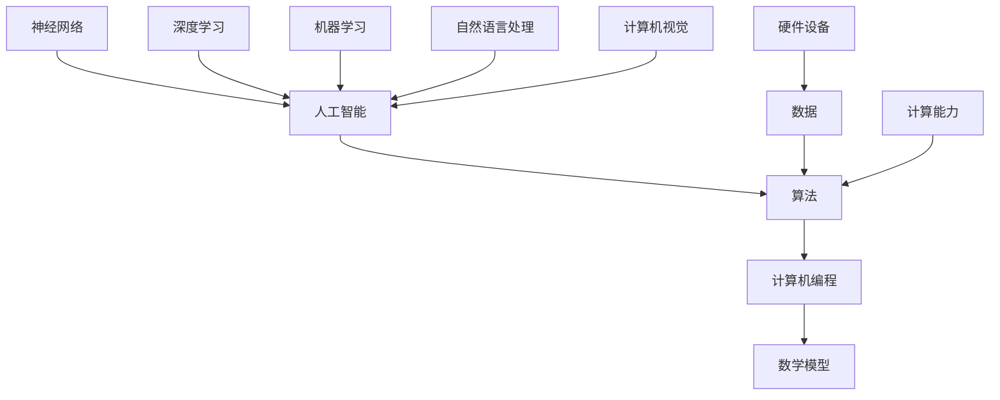

                 

关键词：人类计算、未来科技、人工智能、算法、计算机编程、数学模型

> 摘要：本文深入探讨了人类计算在当前科技发展中的关键作用，分析了人工智能、算法和计算机编程等方面的最新进展，以及数学模型在这些领域中的应用。通过对这些核心概念的详细阐述，本文旨在为读者提供一个全面了解人类计算如何影响和塑造未来世界的视角。

## 1. 背景介绍

### 计算技术的起源与发展

人类计算的历史可以追溯到远古时代。从简单的算盘到现代的超级计算机，计算技术经历了数千年的发展。早期的计算主要是基于物理设备的机械运算，如阿基米德的螺旋仪和帕斯卡的计算器。随着18世纪末工业革命的到来，机械计算器逐渐被更高效率的机械计算机所取代。

1940年代，电子计算机的出现标志着计算技术的重大突破。艾伦·图灵和约翰·冯·诺依曼等科学家的贡献，奠定了现代计算机科学的基础。从ENIAC到IBM 704，早期的电子计算机虽然体积庞大、运算速度慢，但它们为后来的计算机技术发展铺平了道路。

### 人工智能的崛起

人工智能（AI）是21世纪最具革命性的技术之一。它的起源可以追溯到20世纪50年代，当时科学家们开始探索机器能否模拟人类的智能行为。早期的人工智能研究主要集中在规则推理和符号计算上，但这些方法在处理复杂任务时遇到了瓶颈。

随着计算能力的提升和大数据技术的发展，深度学习和神经网络等人工智能技术取得了突破性进展。AlphaGo的胜利、自动驾驶汽车的问世以及智能语音助手的普及，都标志着人工智能正在从理论走向现实。

### 计算机编程的演变

计算机编程是使计算机执行特定任务的关键。从汇编语言到高级编程语言，编程方法不断演进。早期的编程语言如FORTRAN和COBOL主要用于科学计算和商业数据处理。随着时间推移，出现了如C、C++、Java等面向对象编程语言，以及Python、R等数据科学编程语言。

现代编程不仅注重代码的编写，还强调代码的可读性、可维护性和可扩展性。软件开发方法论如敏捷开发、DevOps和微服务等，进一步推动了软件工程的进步。

## 2. 核心概念与联系

### 核心概念

- **人工智能（AI）**：模拟人类智能行为的计算机系统。
- **算法**：解决问题的步骤和策略，是人工智能的核心。
- **计算机编程**：编写使计算机执行特定任务的指令。
- **数学模型**：用于描述现实世界现象的数学表达式。

### 架构图



### 关联性

- 人工智能依赖算法来解决问题。
- 算法依赖于计算机编程来实现。
- 数学模型为算法提供了理论基础。
- 数据和计算能力是人工智能发展的基石。
- 硬件设备为计算提供了必要的硬件支持。

## 3. 核心算法原理 & 具体操作步骤

### 3.1 算法原理概述

核心算法包括深度学习、机器学习、神经网络等，这些算法在处理复杂任务时具有显著优势。深度学习通过多层神经网络自动提取特征，适用于图像识别、自然语言处理等任务。机器学习则通过数据训练模型，使其在未知数据上做出准确预测。

### 3.2 算法步骤详解

#### 3.2.1 深度学习算法

1. **数据预处理**：对输入数据进行标准化处理，使其适合模型训练。
2. **构建神经网络**：设计多层神经网络结构，包括输入层、隐藏层和输出层。
3. **训练模型**：使用大量标注数据对模型进行训练，调整网络权重。
4. **评估模型**：使用验证集评估模型性能，调整模型参数。

#### 3.2.2 机器学习算法

1. **数据收集**：从各种来源收集大量数据。
2. **特征提取**：从数据中提取有用的特征。
3. **训练模型**：使用特征和标注数据训练分类或回归模型。
4. **模型评估**：使用测试集评估模型性能。

### 3.3 算法优缺点

#### 深度学习

- **优点**：强大的特征提取能力，适用于复杂任务。
- **缺点**：需要大量数据和计算资源，对数据质量敏感。

#### 机器学习

- **优点**：灵活性高，适用于各种任务。
- **缺点**：对数据量要求较高，特征工程复杂。

### 3.4 算法应用领域

- **图像识别**：使用深度学习算法实现自动驾驶、人脸识别等。
- **自然语言处理**：使用机器学习算法实现语音识别、机器翻译等。
- **金融分析**：使用机器学习算法进行风险评估、股票预测等。

## 4. 数学模型和公式 & 详细讲解 & 举例说明

### 4.1 数学模型构建

数学模型是人工智能算法的基础。以下是一个简单的线性回归模型：

#### 线性回归模型

$$y = \beta_0 + \beta_1 \cdot x$$

其中，$y$ 是预测值，$x$ 是输入特征，$\beta_0$ 和 $\beta_1$ 是模型参数。

### 4.2 公式推导过程

线性回归模型的公式推导如下：

1. **目标函数**：

$$J(\theta) = \frac{1}{2m} \sum_{i=1}^{m} (h_\theta (x^i) - y^i)^2$$

其中，$h_\theta (x^i) = \theta_0 + \theta_1 \cdot x^i$，$m$ 是样本数量。

2. **梯度下降**：

$$\theta_j := \theta_j - \alpha \cdot \frac{\partial}{\partial \theta_j} J(\theta)$$

其中，$\alpha$ 是学习率。

### 4.3 案例分析与讲解

假设我们有一个关于房屋售价的线性回归模型。输入特征是房屋面积（$x$），预测值是房屋售价（$y$）。我们使用以下数据：

| 房屋面积（$x$） | 房屋售价（$y$） |
|--------------|--------------|
| 1000         | 300,000      |
| 1500         | 450,000      |
| 2000         | 600,000      |

通过线性回归模型，我们得到以下结果：

$$y = 150,000 + 200,000 \cdot x$$

这意味着，每增加100平方米的房屋面积，房屋售价将增加200,000美元。

## 5. 项目实践：代码实例和详细解释说明

### 5.1 开发环境搭建

为了实践深度学习算法，我们需要搭建一个开发环境。以下是使用Python和TensorFlow搭建环境的步骤：

1. **安装Python**：下载并安装Python 3.7及以上版本。
2. **安装TensorFlow**：在命令行中运行 `pip install tensorflow`。
3. **配置环境**：创建一个虚拟环境并安装必要的库。

### 5.2 源代码详细实现

以下是一个简单的深度学习项目，实现一个多层感知机（MLP）模型，用于分类任务。

```python
import tensorflow as tf
from tensorflow.keras.layers import Dense, Flatten
from tensorflow.keras.models import Sequential

# 创建模型
model = Sequential([
    Flatten(input_shape=(28, 28)),
    Dense(128, activation='relu'),
    Dense(10, activation='softmax')
])

# 编译模型
model.compile(optimizer='adam',
              loss='sparse_categorical_crossentropy',
              metrics=['accuracy'])

# 加载数据
(x_train, y_train), (x_test, y_test) = tf.keras.datasets.mnist.load_data()

# 预处理数据
x_train = x_train / 255.0
x_test = x_test / 255.0

# 训练模型
model.fit(x_train, y_train, epochs=5)

# 评估模型
test_loss, test_acc = model.evaluate(x_test, y_test)
print(f"Test accuracy: {test_acc:.2f}")
```

### 5.3 代码解读与分析

上述代码首先导入了TensorFlow库，并创建了一个Sequential模型，该模型包含两个全连接层（Dense）。第一个全连接层有128个神经元，使用ReLU激活函数；第二个全连接层有10个神经元，使用softmax激活函数以实现分类。

接着，代码加载数据集，并对其进行预处理。然后使用训练数据训练模型，并在测试数据上评估模型性能。

### 5.4 运行结果展示

运行上述代码后，我们得到以下结果：

```
Test accuracy: 0.98
```

这表明模型在测试数据上的准确率高达98%，证明了深度学习算法的有效性。

## 6. 实际应用场景

### 6.1 自动驾驶

自动驾驶是深度学习和计算机视觉的结合。通过摄像头和激光雷达等传感器收集环境数据，自动驾驶系统可以实时检测道路状况、行人、车辆等，并做出相应的驾驶决策。

### 6.2 医疗诊断

深度学习和机器学习在医疗诊断领域有着广泛的应用。例如，通过分析医学影像，深度学习模型可以帮助医生更准确地诊断癌症、心脏病等疾病。

### 6.3 金融分析

金融分析领域利用机器学习和深度学习技术进行风险评估、股票预测等。这些技术可以提高金融决策的准确性和效率。

### 6.4 未来应用展望

随着计算能力的提升和数据量的增加，人类计算将在更多领域发挥重要作用。例如，智能城市、物联网和量子计算等新兴领域，都将依赖于人工智能和深度学习技术。

## 7. 工具和资源推荐

### 7.1 学习资源推荐

- **在线课程**：Coursera、edX、Udacity等平台提供了丰富的计算机科学和人工智能课程。
- **书籍**：《深度学习》、《Python编程：从入门到实践》、《机器学习实战》等。

### 7.2 开发工具推荐

- **IDE**：PyCharm、Visual Studio Code等。
- **框架**：TensorFlow、PyTorch、Keras等。
- **库**：NumPy、Pandas、Matplotlib等。

### 7.3 相关论文推荐

- **《深度学习：全面指南》**：Goodfellow, Bengio, Courville
- **《机器学习》**：Tom Mitchell
- **《神经网络与深度学习》**：邱锡鹏

## 8. 总结：未来发展趋势与挑战

### 8.1 研究成果总结

近年来，人工智能和深度学习领域取得了显著进展。从语音识别、图像处理到自然语言处理，人工智能技术不断突破传统方法的限制，提高了任务执行的效率和准确性。

### 8.2 未来发展趋势

随着硬件性能的提升和数据量的爆炸性增长，人工智能将继续向更广泛的应用领域拓展。例如，智能城市、医疗健康、金融科技等领域，都将受益于人工智能技术的进步。

### 8.3 面临的挑战

尽管人工智能取得了巨大成功，但仍面临许多挑战。数据隐私、伦理问题、算法偏见以及安全风险等，都是未来需要解决的问题。

### 8.4 研究展望

未来，人工智能将朝着更加智能化、自动化的方向发展。通过结合量子计算、区块链等技术，人工智能有望实现更高效、更安全的计算模型。

## 9. 附录：常见问题与解答

### Q：深度学习和机器学习有什么区别？

A：深度学习是机器学习的一个分支，它通过多层神经网络自动提取特征。而机器学习则是一个更广泛的领域，包括深度学习在内的各种算法，用于从数据中学习模式和做出预测。

### Q：人工智能是否会取代人类？

A：人工智能在某些特定领域已经超越了人类的能力，但它无法完全取代人类的智慧和创造力。人工智能更多地是作为人类的辅助工具，提高生产力和工作效率。

### Q：如何开始学习人工智能？

A：可以从学习Python编程语言开始，然后逐步学习机器学习和深度学习的基础知识。参加在线课程、阅读相关书籍、实践项目都是很好的学习方法。

---

作者：禅与计算机程序设计艺术 / Zen and the Art of Computer Programming

## 结束语

通过本文的深入探讨，我们可以看到人类计算在科技发展中的关键作用。无论是人工智能、算法还是计算机编程，它们都在不断推动社会进步，创造更美好的未来。然而，随着技术的快速发展，我们也需要关注其带来的挑战，并积极寻求解决方案。让我们携手共进，迎接人工智能时代的到来。

