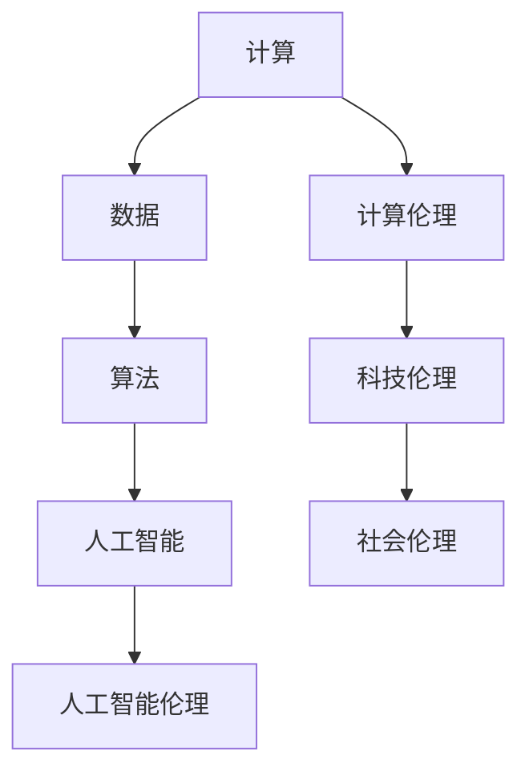

                 

关键词：人工智能、伦理、科技、计算、未来、平衡

> 摘要：本文旨在探讨人工智能（AI）技术的迅猛发展与伦理问题之间的平衡。通过分析人类计算的本质，探讨AI如何影响我们的生活方式，并提出一系列策略以确保科技与伦理的和谐共存。

## 1. 背景介绍

随着人工智能技术的飞速发展，我们已经进入了一个人机协作的新时代。从自动驾驶汽车到智能助手，AI已经深入到我们日常生活的方方面面。然而，这一科技进步的同时，也引发了一系列伦理问题，如隐私保护、数据安全、就业替代等。因此，如何在这场科技革命中寻求伦理与科技的平衡，成为我们不得不面对的重要课题。

### 1.1 人工智能的历史与现状

人工智能的概念可以追溯到20世纪50年代，当时科学家们首次提出了“机器智能”的概念。经过数十年的发展，人工智能已经从理论研究逐步走向实际应用。目前，深度学习、自然语言处理、计算机视觉等领域取得了显著的成果，推动了AI技术的广泛应用。

### 1.2 人工智能对社会的影响

人工智能的快速发展给社会带来了深远的影响。一方面，它极大地提高了生产力，推动了各行各业的变革。另一方面，AI也引发了一系列伦理问题，如数据隐私、算法偏见、道德责任等。

## 2. 核心概念与联系

在探讨人工智能与伦理问题时，我们需要了解几个核心概念，包括计算、数据、算法、人工智能伦理等。下面是一个用Mermaid绘制的流程图，展示了这些概念之间的联系。



### 2.1 计算与数据

计算是人工智能的基础，而数据是计算的原料。在数据驱动的人工智能时代，数据的收集、处理、分析和应用变得尤为重要。然而，这也引发了数据隐私和安全的挑战。

### 2.2 算法与人工智能

算法是人工智能的核心，它决定了AI系统的性能和应用范围。算法的透明性、可解释性和公平性是AI伦理的重要问题。

### 2.3 人工智能伦理

人工智能伦理关注的是AI系统对社会和个体的影响。它涉及多个方面，如隐私保护、算法公正、道德责任等。

### 2.4 计算伦理与科技伦理

计算伦理和科技伦理是人工智能伦理的两个重要分支。计算伦理关注计算过程中的道德问题，而科技伦理则关注科技对社会的影响。

## 3. 核心算法原理 & 具体操作步骤

### 3.1 算法原理概述

在探讨人工智能与伦理问题时，常用的算法包括深度学习、神经网络、自然语言处理等。这些算法的基本原理是通过学习大量的数据，从中提取规律，从而实现特定任务。

### 3.2 算法步骤详解

以深度学习为例，其基本步骤包括：

1. 数据收集与预处理
2. 网络架构设计
3. 模型训练
4. 模型评估与优化
5. 模型部署与应用

### 3.3 算法优缺点

每种算法都有其优缺点。例如，深度学习在处理大规模数据时表现优秀，但训练过程复杂，对计算资源要求高。而传统机器学习算法则相对简单，但性能可能不如深度学习。

### 3.4 算法应用领域

人工智能算法在各个领域都有广泛的应用，如医疗诊断、自动驾驶、金融风控、智能客服等。这些应用不仅提高了生产效率，也为我们的日常生活带来了便利。

## 4. 数学模型和公式 & 详细讲解 & 举例说明

### 4.1 数学模型构建

在人工智能中，常用的数学模型包括线性回归、逻辑回归、神经网络等。下面以线性回归为例，介绍其数学模型的构建。

### 4.2 公式推导过程

线性回归的公式推导如下：

$$
y = \beta_0 + \beta_1x + \epsilon
$$

其中，$y$ 是因变量，$x$ 是自变量，$\beta_0$ 和 $\beta_1$ 是模型参数，$\epsilon$ 是误差项。

### 4.3 案例分析与讲解

假设我们要预测某个地区的房价，自变量是房屋面积。我们可以通过线性回归模型来建立预测模型。

首先，收集大量房屋面积和对应房价的数据，然后使用线性回归算法进行模型训练。最后，通过模型参数来预测未知房屋的房价。

## 5. 项目实践：代码实例和详细解释说明

### 5.1 开发环境搭建

首先，我们需要安装Python环境，并安装相关的库，如NumPy、Pandas、Scikit-learn等。

### 5.2 源代码详细实现

下面是一个简单的线性回归代码示例：

```python
import numpy as np
from sklearn.linear_model import LinearRegression

# 数据加载和预处理
data = np.loadtxt("data.csv", delimiter=",")
X = data[:, :1]
y = data[:, 1]

# 模型训练
model = LinearRegression()
model.fit(X, y)

# 模型评估
score = model.score(X, y)
print(f"Model score: {score}")

# 模型预测
predicted_price = model.predict([[100]])
print(f"Predicted price: {predicted_price[0]}")
```

### 5.3 代码解读与分析

这段代码首先加载了房屋面积和房价的数据，然后使用线性回归算法进行模型训练。接着，评估模型性能，并使用模型进行房价预测。

### 5.4 运行结果展示

运行代码后，我们得到了模型评分和预测的房价。这表明我们的线性回归模型可以用于预测房屋价格。

## 6. 实际应用场景

人工智能技术在实际应用中具有广泛的前景。例如，在医疗领域，AI可以帮助医生进行疾病诊断和治疗方案推荐；在金融领域，AI可以用于风险控制和欺诈检测；在制造业，AI可以用于生产优化和设备故障预测。

## 6.4 未来应用展望

随着人工智能技术的不断发展，我们可以预见其在更多领域的应用。例如，在教育领域，AI可以帮助个性化教学和智能评估；在能源领域，AI可以用于智能电网和可再生能源管理。

## 7. 工具和资源推荐

### 7.1 学习资源推荐

- 《深度学习》 - Ian Goodfellow、Yoshua Bengio和Aaron Courville
- 《Python机器学习》 - Sebastian Raschka
- 《自然语言处理与深度学习》 -张宇星

### 7.2 开发工具推荐

- TensorFlow
- PyTorch
- Keras

### 7.3 相关论文推荐

- "Deep Learning: A Brief History" - Ian Goodfellow
- "A Theoretical Survey of Natural Language Processing" - Christopher D. Manning和Heidi J. Schmidt

## 8. 总结：未来发展趋势与挑战

### 8.1 研究成果总结

人工智能技术已经取得了显著的成果，但在伦理、隐私、算法公正等方面仍面临许多挑战。

### 8.2 未来发展趋势

随着AI技术的不断发展，我们可以预见其在更多领域的应用，如医疗、金融、教育等。

### 8.3 面临的挑战

人工智能技术的快速发展也带来了一系列伦理问题，如数据隐私、算法偏见、道德责任等。

### 8.4 研究展望

在未来，我们需要更多的研究和探索，以解决人工智能与伦理之间的平衡问题，确保科技的发展符合人类的利益。

## 9. 附录：常见问题与解答

### 9.1 什么是人工智能？

人工智能是一种模拟人类智能的技术，通过算法和计算模型来实现机器学习、自然语言处理、计算机视觉等功能。

### 9.2 人工智能会取代人类吗？

目前的人工智能技术还无法完全取代人类，但在某些特定领域，如数据处理、模式识别等，AI已经展示了其强大的能力。

### 9.3 如何确保人工智能的伦理？

确保人工智能的伦理需要从多个方面进行考虑，包括数据隐私、算法公正、道德责任等。这需要政府、企业、学者和公众共同努力。

### 9.4 人工智能会对就业产生什么影响？

人工智能可能会取代一些简单重复的工作，但同时也会创造新的就业机会，如AI系统维护、算法设计等。

### 9.5 如何在科技与伦理之间寻求平衡？

在科技与伦理之间寻求平衡需要多方面的努力，包括政策制定、技术研发、公众教育等。通过合理的制度安排和价值观引导，我们可以确保科技的发展符合人类的利益。

---

作者：禅与计算机程序设计艺术 / Zen and the Art of Computer Programming

在撰写这篇文章的过程中，我深刻感受到了人工智能与伦理之间的微妙平衡。作为人工智能技术的推动者，我们需要时刻关注其对社会的影响，并努力确保技术的发展符合人类的利益。在未来的发展中，我相信我们有能力克服这些挑战，实现科技与伦理的和谐共存。让我们共同期待一个更加美好的未来。

