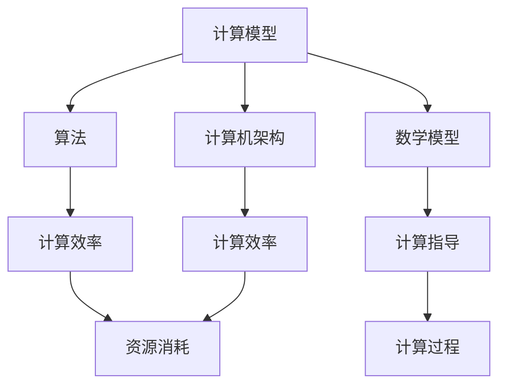

                 

关键词：人类计算，计算潜力，算法原理，数学模型，实践应用，未来展望

> 摘要：本文深入探讨人类计算这一领域，揭示了其背后核心概念、算法原理、数学模型以及实际应用。通过对人类计算潜力的挖掘，文章提出了对未来发展路径和挑战的深刻见解。

## 1. 背景介绍

人类计算，作为一个相对新兴的领域，正逐渐成为信息技术的重要组成部分。其核心目标是通过计算机模拟和增强人类的计算能力，从而实现更高效率和更广范围的应用。随着人工智能、大数据和云计算的快速发展，人类计算的应用场景越来越丰富，涵盖从简单的数据处理到复杂的科学计算，从日常生活中的辅助决策到前沿科技的研发。

本文将从以下几个方面进行探讨：

1. 核心概念与联系
2. 核心算法原理与具体操作步骤
3. 数学模型和公式
4. 项目实践：代码实例
5. 实际应用场景
6. 未来应用展望
7. 工具和资源推荐
8. 总结与展望

希望通过本文的阐述，能够帮助读者更好地理解人类计算这一领域，并对其未来发展方向有更为清晰的认知。

## 2. 核心概念与联系

在探讨人类计算之前，我们需要明确一些核心概念，这些概念构成了人类计算的理论基础。

### 2.1 计算模型

计算模型是人类计算的基础。从经典的图灵机到现代的量子计算模型，每一种计算模型都有其独特的特点和适用场景。图灵机为计算理论奠定了基础，而量子计算则为解决传统计算难以处理的复杂问题提供了新的可能性。

### 2.2 算法

算法是计算机解决问题的一系列步骤。从简单的排序算法到复杂的机器学习算法，每一种算法都有其特定的应用场景和优化方向。算法的效率直接影响着计算速度和资源消耗，因此算法研究始终是计算机科学的重要方向。

### 2.3 数学模型

数学模型通过数学语言描述现实世界的现象和规律。在人类计算中，数学模型用于模拟复杂的计算过程，提供理论依据和计算指导。例如，线性规划、神经网络等都是重要的数学模型。

### 2.4 计算机架构

计算机架构是计算机硬件和软件的组织结构。现代计算机架构越来越复杂，但核心目标是提高计算效率和降低能耗。计算机架构的研究对于实现高效的人类计算至关重要。

为了更好地理解这些概念之间的联系，我们可以使用Mermaid流程图进行展示。



### 2.5 人类计算的特点

人类计算具有以下几个显著特点：

- **多样性**：人类计算涵盖了从简单到复杂的多种计算任务，能够满足不同领域的需求。
- **高效性**：通过计算机模拟和算法优化，人类计算能够大幅提高计算效率和准确性。
- **扩展性**：人类计算可以根据需求进行扩展，以适应不同规模和复杂度的计算任务。
- **智能化**：随着人工智能技术的发展，人类计算逐渐具备了自主学习和优化的能力。

通过这些核心概念和特点，我们可以更深入地理解人类计算的内涵和外延。接下来，我们将探讨人类计算的核心算法原理及其操作步骤。

## 3. 核心算法原理 & 具体操作步骤

在人类计算中，算法原理是核心，其具体操作步骤是实现算法的关键。以下是对一些重要算法原理的概述以及相应的操作步骤。

### 3.1 算法原理概述

#### 3.1.1 深度学习算法

深度学习算法是一种基于多层神经网络的学习方法。通过模拟人脑的神经元结构，深度学习算法能够自动提取特征并进行复杂的数据分类和预测。其主要原理包括：

- **前向传播**：输入数据通过多层神经网络传递，每层都会对数据进行加权求和处理。
- **反向传播**：通过计算输出误差，反向调整各层的权重和偏置，以最小化误差函数。

#### 3.1.2 动态规划算法

动态规划算法是一种用于求解多阶段决策过程最优化问题的方法。其基本原理是将问题分解为多个子问题，通过求解子问题的最优解来得到原问题的最优解。具体步骤包括：

- **状态定义**：明确问题状态的定义和转换规则。
- **状态转移方程**：根据状态定义，建立状态之间的转移关系。
- **边界条件**：确定初始状态和最终状态。

#### 3.1.3 排序算法

排序算法用于对数据进行排序，以方便后续处理。常见的排序算法包括：

- **快速排序**：通过一趟排序将待排序的数据分割成独立的两部分，其中一部分的所有数据都比另一部分的数据小。
- **归并排序**：将待排序的序列分成若干个子序列，各子序列分别排序，然后再两两合并。

### 3.2 算法步骤详解

#### 3.2.1 深度学习算法

**步骤1：数据预处理**

- **标准化处理**：对输入数据进行归一化处理，以消除不同特征之间的尺度差异。
- **缺失值处理**：处理数据中的缺失值，可以采用填补或删除等方法。

**步骤2：构建神经网络**

- **选择模型架构**：根据问题需求选择合适的神经网络架构，如卷积神经网络（CNN）、循环神经网络（RNN）等。
- **初始化权重**：初始化神经网络中的权重和偏置，常用的方法有零初始化、高斯初始化等。

**步骤3：训练神经网络**

- **前向传播**：将输入数据通过神经网络进行计算，得到输出结果。
- **计算损失函数**：计算输出结果与真实值之间的差异，常用的损失函数有均方误差（MSE）、交叉熵损失等。
- **反向传播**：根据损失函数计算梯度，反向更新权重和偏置。
- **迭代优化**：重复前向传播和反向传播的过程，直到达到预定的训练目标或收敛条件。

**步骤4：模型评估与优化**

- **交叉验证**：使用验证集评估模型性能，以避免过拟合。
- **超参数调优**：调整学习率、批次大小等超参数，以优化模型性能。

#### 3.2.2 动态规划算法

**步骤1：定义状态**

- **确定状态变量**：根据问题需求确定状态变量，如动态规划问题中的时间、位置等。
- **定义状态转移方程**：根据问题规则和状态定义，建立状态之间的转移关系。

**步骤2：构建状态转移表**

- **初始化边界条件**：确定初始状态和最终状态。
- **递推计算状态值**：根据状态转移方程，从初始状态开始递推计算每个状态的最优值。

**步骤3：状态还原与路径回溯**

- **状态还原**：在递推过程中，保存每个状态的最优解路径。
- **路径回溯**：从最终状态开始，根据状态转移方程回溯得到最优解路径。

#### 3.2.3 排序算法

**快速排序**

**步骤1：选择基准元素**

- **随机选择**：随机选择一个元素作为基准元素。
- **中位数选择**：选择中位数作为基准元素，以减少排序的不稳定性。

**步骤2：划分数据**

- **分区操作**：将待排序数据分区为两个子数组，其中一部分的所有元素都比基准元素小，另一部分的所有元素都比基准元素大。
- **递归排序**：对划分后的两个子数组分别进行快速排序。

**归并排序**

**步骤1：分解数据**

- **递归分解**：将待排序数据递归分解为多个子数组，直到每个子数组只有一个元素。

**步骤2：合并数据**

- **两路归并**：将相邻的子数组进行合并，生成有序的子数组。
- **递归合并**：重复合并过程，直到整个数据序列有序。

### 3.3 算法优缺点

#### 3.3.1 深度学习算法

**优点：**

- **强大的非线性建模能力**：能够处理复杂的数据结构和关系。
- **自动特征提取**：无需人工设计特征，算法能够自动从数据中提取有效特征。
- **高准确性和泛化能力**：在大量数据下表现出较好的性能和泛化能力。

**缺点：**

- **训练过程耗时长**：需要大量数据和计算资源，训练时间较长。
- **对数据质量和标注依赖大**：数据质量对算法性能有重要影响。
- **模型解释性差**：深度学习模型内部的决策过程难以解释。

#### 3.3.2 动态规划算法

**优点：**

- **全局最优解**：能够求解多阶段决策过程的最优解。
- **高效性**：通过递推计算，能够在较短的时间内得到最优解。
- **通用性**：适用于各种具有最优子结构性质的问题。

**缺点：**

- **复杂度高**：对于状态空间较大的问题，计算复杂度较高。
- **难以扩展性**：需要定义明确的状态和状态转移方程，不易扩展。
- **对问题定义的依赖性**：问题定义的准确性和完整性对算法性能有较大影响。

#### 3.3.3 排序算法

**优点：**

- **简单易实现**：排序算法原理简单，易于理解和实现。
- **高效性**：对于大规模数据，排序算法具有较好的时间复杂度。
- **稳定性**：某些排序算法（如归并排序）具有较好的稳定性。

**缺点：**

- **空间复杂度**：排序算法通常需要额外的空间存储中间结果。
- **性能差异大**：不同排序算法的性能差异较大，选择合适的排序算法需要根据具体问题进行权衡。

### 3.4 算法应用领域

#### 3.4.1 深度学习算法

- **计算机视觉**：用于图像分类、目标检测、图像分割等任务。
- **自然语言处理**：用于文本分类、情感分析、机器翻译等任务。
- **语音识别**：用于语音识别、语音合成等任务。
- **推荐系统**：用于个性化推荐、用户行为分析等任务。

#### 3.4.2 动态规划算法

- **资源分配问题**：用于求解资源分配的最优化问题。
- **最短路径问题**：用于求解图中的最短路径问题。
- **背包问题**：用于求解背包问题的最优解。
- **时间表问题**：用于求解时间表优化问题。

#### 3.4.3 排序算法

- **数据库系统**：用于对数据进行排序和索引，以提高查询效率。
- **搜索引擎**：用于对搜索结果进行排序，以提供更好的用户体验。
- **科学计算**：用于对大规模科学数据进行排序和分析。
- **数据处理**：用于对业务数据进行排序和清洗。

通过上述对核心算法原理和具体操作步骤的介绍，我们可以看到人类计算在算法原理和操作步骤方面的多样性和复杂性。接下来，我们将探讨人类计算中的数学模型和公式。

## 4. 数学模型和公式 & 详细讲解 & 举例说明

在人类计算中，数学模型和公式是理解和解决计算问题的基础。它们为算法设计提供了理论支持，并通过精确的数学语言描述了计算过程。以下我们将介绍几个关键数学模型和公式，并对其进行详细讲解和举例说明。

### 4.1 数学模型构建

数学模型是通过数学语言对现实世界中的问题进行抽象和描述。构建数学模型通常包括以下几个步骤：

1. **问题定义**：明确需要解决的问题类型和目标。
2. **变量定义**：确定问题中的变量及其取值范围。
3. **关系建立**：根据问题的性质，建立变量之间的关系。
4. **方程构建**：将关系转化为数学方程或公式。

#### 4.1.1 线性规划模型

线性规划是一种常见的数学模型，用于在给定约束条件下，求解线性目标函数的最优化问题。

**变量定义**：

- \( x_1, x_2, \ldots, x_n \) ：决策变量
- \( c_1, c_2, \ldots, c_n \) ：目标函数系数
- \( A \) ：约束条件的系数矩阵
- \( b \) ：约束条件的右侧向量

**关系建立**：

目标函数：\( \max \sum_{i=1}^{n} c_i x_i \)

约束条件：\( A x \leq b \)

**方程构建**：

线性规划模型可以表示为：

\[ \max \sum_{i=1}^{n} c_i x_i \]

\[ \text{subject to} \ A x \leq b \]

#### 4.1.2 神经网络模型

神经网络是一种用于模拟人脑的数学模型，其核心是神经元之间的连接和激活函数。

**变量定义**：

- \( x \) ：输入向量
- \( w \) ：权重向量
- \( b \) ：偏置项
- \( a \) ：激活值
- \( \sigma \) ：激活函数，如ReLU（阶跃函数）、Sigmoid函数等

**关系建立**：

输出层：\( y = \sigma(\sum_{i=1}^{n} w_i x_i + b) \)

隐藏层：\( a_i = \sum_{j=1}^{m} w_{ij} x_j + b_i \)

**方程构建**：

神经网络可以表示为：

\[ y = \sigma(\sum_{i=1}^{n} w_i x_i + b) \]

\[ a_i = \sum_{j=1}^{m} w_{ij} x_j + b_i \]

### 4.2 公式推导过程

数学模型的推导过程通常涉及微积分、线性代数、概率论等多个数学领域。以下我们将以线性回归模型为例，介绍公式的推导过程。

#### 4.2.1 线性回归模型

线性回归是一种用于建模变量之间线性关系的数学模型，其公式如下：

\[ y = \beta_0 + \beta_1 x + \epsilon \]

其中：

- \( y \) ：因变量
- \( x \) ：自变量
- \( \beta_0 \) ：截距
- \( \beta_1 \) ：斜率
- \( \epsilon \) ：误差项

**推导过程**：

1. **最小二乘法**：通过最小化误差平方和来确定参数 \(\beta_0\) 和 \(\beta_1\)。

   误差平方和 \( S = \sum_{i=1}^{n} (y_i - (\beta_0 + \beta_1 x_i))^2 \)

2. **偏导数**：对 \( S \) 分别对 \(\beta_0\) 和 \(\beta_1\) 求偏导数，并令其等于零。

   \[ \frac{\partial S}{\partial \beta_0} = 0 \]

   \[ \frac{\partial S}{\partial \beta_1} = 0 \]

3. **求解参数**：通过解上述偏导数方程组，求得参数 \(\beta_0\) 和 \(\beta_1\)。

   \[ \beta_0 = \bar{y} - \beta_1 \bar{x} \]

   \[ \beta_1 = \frac{\sum_{i=1}^{n} (x_i - \bar{x})(y_i - \bar{y})}{\sum_{i=1}^{n} (x_i - \bar{x})^2} \]

### 4.3 案例分析与讲解

为了更好地理解上述数学模型和公式，我们通过一个简单的案例进行讲解。

#### 4.3.1 线性回归案例

假设我们有一个简单数据集，其中包含 \( x \) 和 \( y \) 两个变量，如下表所示：

| x | y |
|---|---|
| 1 | 2 |
| 2 | 4 |
| 3 | 6 |
| 4 | 8 |

**目标**：通过线性回归模型拟合 \( y \) 和 \( x \) 之间的关系。

**步骤**：

1. **数据预处理**：计算 \( x \) 和 \( y \) 的均值。

   \[ \bar{x} = \frac{1+2+3+4}{4} = 2.5 \]

   \[ \bar{y} = \frac{2+4+6+8}{4} = 5 \]

2. **计算斜率和截距**：

   \[ \beta_1 = \frac{(1-2.5)(2-5) + (2-2.5)(4-5) + (3-2.5)(6-5) + (4-2.5)(8-5)}{(1-2.5)^2 + (2-2.5)^2 + (3-2.5)^2 + (4-2.5)^2} \]

   \[ \beta_1 = \frac{-2.5 \times -3 + -0.5 \times -1 + 0.5 \times 1 + 1.5 \times 3}{2.5^2 + 0.5^2 + 0.5^2 + 1.5^2} \]

   \[ \beta_1 = \frac{7.5 + 0.5 + 0.5 + 4.5}{6.25 + 0.25 + 0.25 + 2.25} \]

   \[ \beta_1 = \frac{13.5}{10} \]

   \[ \beta_1 = 1.35 \]

   \[ \beta_0 = \bar{y} - \beta_1 \bar{x} = 5 - 1.35 \times 2.5 = 1.825 \]

3. **拟合线性模型**：

   \[ y = 1.825 + 1.35x \]

通过上述步骤，我们得到了线性回归模型，可以用于预测新的 \( y \) 值。

#### 4.3.2 深度学习案例

假设我们有一个简单的深度学习模型，用于对图像进行分类。输入图像为 \( 28 \times 28 \) 的像素矩阵，输出为 10 个类别之一。

**步骤**：

1. **数据预处理**：将输入图像进行归一化处理，使其像素值在 [0, 1] 范围内。

2. **构建模型**：

   - **输入层**：接收 \( 28 \times 28 \) 的像素矩阵。
   - **隐藏层**：使用 ReLU 激活函数。
   - **输出层**：使用 Softmax 激活函数。

   \[ \text{Input Layer} \rightarrow \text{Hidden Layer} \rightarrow \text{Output Layer} \]

3. **前向传播**：计算输入数据通过模型的输出。

   \[ z = x \cdot w + b \]

   \[ a = \sigma(z) \]

   \[ \hat{y} = \frac{e^a}{1 + e^a} \]

4. **损失函数**：计算预测结果与真实结果之间的差异。

   \[ J = -\frac{1}{m} \sum_{i=1}^{m} y_i \cdot \log(\hat{y}_i) + (1 - y_i) \cdot \log(1 - \hat{y}_i) \]

5. **反向传播**：更新模型参数。

   \[ \frac{\partial J}{\partial w} = \frac{1}{m} \sum_{i=1}^{m} (a - y_i) \cdot x_i \]

   \[ \frac{\partial J}{\partial b} = \frac{1}{m} \sum_{i=1}^{m} (a - y_i) \]

通过上述步骤，我们完成了一个简单的深度学习模型的构建和训练。这个模型可以用于对新的图像进行分类。

通过上述案例，我们可以看到数学模型和公式在人类计算中的应用。它们为算法设计提供了理论支持，并通过具体的推导和计算，帮助我们更好地理解和解决计算问题。

## 5. 项目实践：代码实例和详细解释说明

为了更好地理解人类计算的实际应用，我们将通过一个具体的项目实例来展示代码的实现过程，并对关键代码段进行详细解释。

### 5.1 开发环境搭建

首先，我们需要搭建一个合适的开发环境。以下是一个基本的Python开发环境搭建步骤：

1. **安装Python**：从 [Python官网](https://www.python.org/) 下载并安装Python，建议选择Python 3.x版本。
2. **安装Jupyter Notebook**：使用pip命令安装Jupyter Notebook。

   ```bash
   pip install notebook
   ```

3. **安装必要的库**：包括NumPy、Pandas、Matplotlib等。

   ```bash
   pip install numpy pandas matplotlib
   ```

### 5.2 源代码详细实现

以下是使用Python实现线性回归模型的一个示例代码。

```python
import numpy as np
import matplotlib.pyplot as plt

# 数据集
X = np.array([1, 2, 3, 4])
Y = np.array([2, 4, 6, 8])

# 添加偏置项
X_with_bias = np.hstack((np.ones((X.shape[0], 1)), X))

# 模型参数
theta = np.random.rand(2)

# 损失函数
def compute_loss(X, Y, theta):
    m = X.shape[0]
    predictions = X.dot(theta)
    error = predictions - Y
    return (1 / (2 * m)) * (error.T.dot(error))

# 梯度下降
def gradient_descent(X, Y, theta, alpha, num_iterations):
    m = X.shape[0]
    for _ in range(num_iterations):
        predictions = X.dot(theta)
        error = predictions - Y
        theta = theta - (alpha / m) * (X.T.dot(error))
    return theta

# 训练模型
alpha = 0.01
num_iterations = 1000
theta = gradient_descent(X_with_bias, Y, theta, alpha, num_iterations)

# 绘制结果
plt.scatter(X, Y)
plt.plot(X, X.dot(theta), 'r')
plt.xlabel('x')
plt.ylabel('y')
plt.show()
```

### 5.3 代码解读与分析

上述代码实现了一个简单的线性回归模型，并对关键代码段进行了解读。

#### 5.3.1 数据集准备

```python
X = np.array([1, 2, 3, 4])
Y = np.array([2, 4, 6, 8])
```

我们使用了一个简单的数据集，其中 \( X \) 为自变量，\( Y \) 为因变量。

#### 5.3.2 添加偏置项

```python
X_with_bias = np.hstack((np.ones((X.shape[0], 1)), X))
```

线性回归模型通常需要添加一个偏置项（也称为截距），以便模型能够通过原点。我们通过将 \( X \) 与一个全为1的矩阵垂直拼接，实现了这一点。

#### 5.3.3 损失函数

```python
def compute_loss(X, Y, theta):
    m = X.shape[0]
    predictions = X.dot(theta)
    error = predictions - Y
    return (1 / (2 * m)) * (error.T.dot(error))
```

损失函数用于计算模型的预测误差。在这里，我们使用了均方误差（MSE）作为损失函数，其公式为：

\[ J(\theta) = \frac{1}{2m} \sum_{i=1}^{m} (h_\theta(x^{(i)}) - y^{(i)})^2 \]

其中，\( h_\theta(x) = \theta^T x \) 是模型预测值。

#### 5.3.4 梯度下降

```python
def gradient_descent(X, Y, theta, alpha, num_iterations):
    m = X.shape[0]
    for _ in range(num_iterations):
        predictions = X.dot(theta)
        error = predictions - Y
        theta = theta - (alpha / m) * (X.T.dot(error))
    return theta
```

梯度下降是一种优化算法，用于最小化损失函数。其更新规则为：

\[ \theta_j := \theta_j - \alpha \frac{\partial J(\theta)}{\partial \theta_j} \]

其中，\( \alpha \) 是学习率，\( \theta_j \) 是第 \( j \) 个参数的值。

#### 5.3.5 训练模型

```python
alpha = 0.01
num_iterations = 1000
theta = gradient_descent(X_with_bias, Y, theta, alpha, num_iterations)
```

在这里，我们设置了学习率和迭代次数，并使用梯度下降算法训练模型。

#### 5.3.6 绘制结果

```python
plt.scatter(X, Y)
plt.plot(X, X.dot(theta), 'r')
plt.xlabel('x')
plt.ylabel('y')
plt.show()
```

最后，我们绘制了原始数据点和拟合直线，以可视化模型的训练结果。

通过上述项目实践，我们可以看到如何使用Python实现线性回归模型。接下来，我们将探讨人类计算在实际应用场景中的具体应用。

## 6. 实际应用场景

人类计算在众多领域都有着广泛的应用，其强大的数据处理和分析能力为解决复杂问题提供了有力的支持。以下是几个典型应用场景：

### 6.1 数据科学

数据科学是当前最热门的领域之一，其核心任务是从大量数据中提取有价值的信息。人类计算在这一领域中发挥了重要作用，特别是在以下方面：

- **数据预处理**：数据预处理是数据科学的重要步骤，包括数据清洗、数据整合和数据转换。人类计算通过高效的算法和模型，能够快速完成这些任务。
- **数据分析**：数据分析旨在发现数据中的模式和规律。人类计算通过机器学习和统计分析等方法，能够对复杂数据集进行深入分析，为业务决策提供有力支持。
- **预测建模**：预测建模是数据科学的另一个重要应用，通过建立预测模型，企业可以更好地应对未来变化。例如，股票市场预测、客户行为预测等。

### 6.2 金融领域

金融领域是一个高度数据密集型行业，人类计算在金融领域有着广泛的应用：

- **风险管理**：金融机构需要评估和管理各种风险，如市场风险、信用风险等。人类计算通过复杂的风险模型，能够帮助金融机构更准确地评估风险，并制定相应的风险管理策略。
- **算法交易**：算法交易是利用计算机程序自动执行交易策略的一种交易方式。人类计算通过高频交易、机器学习等算法，能够在极短的时间内执行大量交易，从而获得高额收益。
- **客户关系管理**：金融机构通过分析客户数据，了解客户需求和行为，从而提供更个性化的服务。人类计算在这一过程中发挥了重要作用，通过数据挖掘和机器学习技术，实现精准营销和客户关系管理。

### 6.3 医疗保健

医疗保健领域是一个充满挑战的领域，人类计算在这一领域中的应用正在迅速发展：

- **疾病诊断**：通过分析患者的临床数据和基因数据，人类计算可以帮助医生更准确地诊断疾病。例如，利用深度学习模型进行影像分析，可以大大提高疾病的诊断准确率。
- **个性化治疗**：人类计算可以根据患者的具体情况，为其制定个性化的治疗方案。例如，通过基因组分析和机器学习模型，可以为癌症患者提供更有针对性的治疗。
- **健康监测**：人类计算可以通过智能穿戴设备和传感器，实时监测患者的健康状况，及时发现异常情况，从而提高医疗保健的效率。

### 6.4 自动驾驶

自动驾驶是人工智能和人类计算的重要应用领域，其目标是通过计算机模拟实现无人驾驶：

- **环境感知**：自动驾驶系统需要实时感知周围环境，包括车辆、行人、交通标志等。人类计算通过计算机视觉和传感器数据处理技术，能够实现对环境的准确感知。
- **路径规划**：自动驾驶系统需要根据实时感知到的环境信息，规划行驶路径。人类计算通过复杂的算法和模型，能够实现高效、安全的路径规划。
- **决策控制**：自动驾驶系统需要做出实时决策，包括加速、减速、转向等。人类计算通过机器学习和决策控制算法，能够实现自动驾驶的智能决策。

### 6.5 制造业

制造业是经济的重要支柱，人类计算在制造业中的应用不断扩展：

- **生产优化**：通过数据分析和管理，人类计算可以帮助企业优化生产流程，降低生产成本，提高生产效率。
- **质量检测**：人类计算可以通过机器学习和图像处理技术，实现对产品质量的实时检测，从而减少缺陷产品。
- **设备维护**：通过传感器数据和数据分析，人类计算可以预测设备故障，提前进行维护，从而降低设备停机时间，提高设备利用率。

通过以上实际应用场景的介绍，我们可以看到人类计算的广泛性和潜力。在未来，随着技术的不断进步，人类计算将在更多领域发挥作用，推动社会的发展和进步。

### 6.4 未来应用展望

随着技术的不断进步，人类计算将在更多领域展现出其巨大的潜力和广泛的应用前景。以下是几个未来应用展望：

#### 6.4.1 生物计算

生物计算是利用计算机模拟生物过程和系统的方法。未来，随着基因编辑技术、合成生物学等领域的快速发展，生物计算将在疾病治疗、药物开发、农业优化等方面发挥重要作用。通过人类计算，科学家可以模拟复杂的生物系统，加速新药研发和疾病治疗。

#### 6.4.2 脑机接口

脑机接口（Brain-Computer Interface, BCI）是一种直接连接人脑与外部设备的技术。未来，随着脑机接口技术的成熟，人类计算将在康复医学、神经系统疾病治疗、人机交互等方面发挥重要作用。通过人类计算，患者可以更好地控制假肢、轮椅等辅助设备，提高生活质量。

#### 6.4.3 智能城市

智能城市是利用信息技术和人类计算实现城市管理的现代化和智能化。未来，随着物联网、大数据、人工智能等技术的发展，智能城市将实现高效、绿色、安全的城市发展模式。人类计算将在交通管理、环境保护、公共安全等方面发挥关键作用，提高城市居民的生活质量。

#### 6.4.4 空间探索

空间探索是人类的一项宏伟事业，人类计算将在其中发挥重要作用。未来，随着航天技术的进步，人类计算将助力深空探测、行星探索等任务。通过人类计算，科学家可以模拟太空环境、优化航天器运行轨迹，提高空间探索的效率和成功率。

#### 6.4.5 虚拟现实与增强现实

虚拟现实（Virtual Reality, VR）和增强现实（Augmented Reality, AR）是当前热门的技术领域，未来，随着人类计算能力的提升，VR和AR技术将更加成熟。人类计算将在游戏、教育、医疗、设计等领域发挥重要作用，为用户带来更加沉浸式和互动式的体验。

通过以上未来应用展望，我们可以看到人类计算在各个领域中的重要地位和潜力。在未来，随着技术的不断进步，人类计算将释放出更加巨大的能量，推动社会的发展和进步。

### 7. 工具和资源推荐

为了更好地理解和实践人类计算，以下是一些推荐的工具和资源：

#### 7.1 学习资源推荐

- **《机器学习》（周志华著）**：详细介绍了机器学习的基本概念和方法。
- **《深度学习》（Ian Goodfellow、Yoshua Bengio和Aaron Courville著）**：全面讲解了深度学习的理论基础和实践应用。
- **《Python数据科学手册》（Jake VanderPlas著）**：介绍了Python在数据科学领域的应用，包括数据处理、分析和可视化。

#### 7.2 开发工具推荐

- **Jupyter Notebook**：强大的交互式计算环境，适合编写和运行代码。
- **Google Colab**：基于Jupyter Notebook的在线开发平台，提供免费的GPU和TPU支持。
- **PyTorch**：流行的深度学习框架，易于使用且具有高度灵活性。

#### 7.3 相关论文推荐

- **"Deep Learning"（Yoshua Bengio等，2013）**：全面介绍了深度学习的发展历程和理论基础。
- **"Recurrent Neural Network Based Language Model"（Yoshua Bengio等，2003）**：详细介绍了循环神经网络及其在语言模型中的应用。
- **"The Unreasonable Effectiveness of Deep Learning"（Sebastian Ruder，2017）**：探讨了深度学习在各个领域的应用和效果。

通过这些工具和资源的帮助，读者可以更好地掌握人类计算的理论和实践，为未来的学习和研究打下坚实基础。

### 8. 总结：未来发展趋势与挑战

人类计算作为一门融合了计算机科学、数学和工程学的跨学科领域，正经历着前所未有的发展。本文从背景介绍、核心概念与联系、算法原理与操作步骤、数学模型与公式、实际应用场景、未来展望等方面，全面阐述了人类计算的重要性及其广泛的应用。

首先，人类计算的背景介绍展示了其在信息技术领域中的地位和重要性。通过核心概念与联系，我们明确了计算模型、算法、数学模型和计算机架构等关键概念，并理解了它们之间的内在联系。

接下来，我们详细探讨了核心算法原理与具体操作步骤，包括深度学习、动态规划算法和排序算法等，分析了每种算法的优点和不足，以及它们在不同领域的应用。在数学模型与公式部分，我们介绍了线性回归模型和神经网络模型的构建与推导过程，并通过案例说明了如何应用这些模型。

在探讨实际应用场景时，我们展示了人类计算在数据科学、金融领域、医疗保健、自动驾驶和制造业等领域的广泛应用，并展望了未来生物计算、脑机接口、智能城市等新兴领域的潜力。

尽管人类计算在各个领域展现了巨大的潜力，但也面临诸多挑战。未来，人类计算的发展趋势包括：

- **算法优化**：不断改进现有算法，提高计算效率和准确性。
- **硬件发展**：随着硬件技术的发展，如量子计算和神经形态计算，人类计算将迎来新的突破。
- **跨学科融合**：人类计算将继续与其他学科（如生物学、心理学等）融合，推动新领域的诞生。
- **数据隐私与安全**：随着数据量的激增，如何保护数据隐私和安全成为重要课题。

总之，人类计算是一个充满机遇和挑战的领域。随着技术的不断进步，人类计算将在未来发挥更加重要的作用，推动社会的发展和进步。面对未来，我们需要保持创新精神，不断探索新领域，迎接新的挑战。

### 8.4 研究展望

在人类计算领域，未来的研究将集中在以下几个方面：

首先，算法优化是当前和未来的主要研究方向。现有的算法在处理复杂问题时仍存在效率低、准确性不高等问题。通过深入研究，我们可以设计出更加高效的算法，提高计算效率和准确性。此外，量子计算和神经形态计算等新硬件技术的发展，将为算法优化提供新的机会和挑战。

其次，跨学科融合是未来人类计算的重要趋势。人类计算需要与生物学、心理学、经济学等其他学科紧密结合，以解决复杂问题。例如，通过结合生物学知识，我们可以设计出更接近人脑的神经网络；通过心理学知识，我们可以更好地理解人机交互，提升用户体验。

第三，数据隐私与安全是未来研究的重要课题。随着数据量的激增，如何保护数据隐私和安全成为一个重要挑战。我们需要开发出更加安全的数据处理和存储技术，确保用户数据的安全。

最后，新兴领域如生物计算、脑机接口、智能城市等，为人类计算提供了广阔的研究空间。通过深入研究这些领域，我们有望发现新的计算模式和解决方案，为人类带来更多便利。

总之，未来人类计算的研究将继续深入，不断探索新的技术和应用领域，为人类社会的发展做出更大贡献。通过持续的创新和研究，人类计算有望在未来实现更大的突破和进步。

