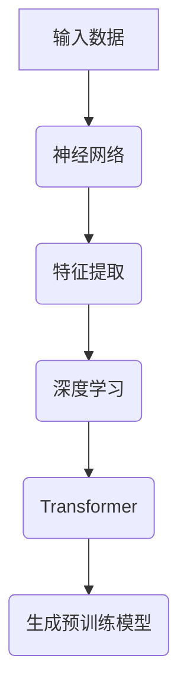

                 

关键词：GPT，通用人工智能（AGI），神经网络，深度学习，人工智能发展路径

> 摘要：本文旨在探讨从GPT（生成预训练模型）到通用人工智能（AGI）的发展路径。通过对GPT技术的背景介绍、核心概念与联系的分析、核心算法原理的阐述，以及数学模型和公式的详细讲解，本文将帮助读者理解GPT技术如何推动通用人工智能的发展。此外，还将通过项目实践中的代码实例，展示如何实现GPT模型，并探讨其未来应用场景和面临的挑战。

## 1. 背景介绍

### 1.1 GPT的发展历程

GPT（Generative Pre-trained Transformer）是一种基于Transformer架构的生成预训练模型。它由OpenAI于2018年首次发布，并迅速引起了人工智能领域的广泛关注。GPT的发展历程可以追溯到早期的神经网络模型，如LSTM（长短期记忆网络）和RNN（循环神经网络）。然而，随着Transformer架构的提出，GPT在处理大规模文本数据时表现出了更高的效率和准确性。

### 1.2 GPT的应用场景

GPT技术被广泛应用于自然语言处理、文本生成、机器翻译、问答系统等领域。例如，在自然语言处理领域，GPT可以用于文本分类、情感分析、命名实体识别等任务。在文本生成领域，GPT可以生成文章、故事、诗歌等。在机器翻译领域，GPT可以用于机器翻译任务的预训练。在问答系统领域，GPT可以用于构建智能问答机器人。

## 2. 核心概念与联系

### 2.1 核心概念

- **神经网络**：神经网络是一种由大量神经元组成的计算模型，通过学习输入数据之间的关系来实现特定的任务。神经网络可以分为多层，每一层由多个神经元组成。
- **深度学习**：深度学习是一种基于神经网络的学习方法，通过多层神经网络的学习来提取输入数据的特征。
- **Transformer**：Transformer是一种基于自注意力机制的深度学习模型，它通过计算输入数据的全局依赖关系来实现高效的序列处理。

### 2.2 Mermaid 流程图



## 3. 核心算法原理 & 具体操作步骤

### 3.1 算法原理概述

GPT模型的核心原理是基于Transformer架构的深度学习模型。它通过预训练过程学习输入数据的特征表示，并在微调阶段应用于各种下游任务。GPT模型的训练过程主要包括以下步骤：

1. **数据预处理**：对输入文本数据进行清洗、分词、编码等预处理操作。
2. **构建模型**：使用Transformer架构构建GPT模型，包括嵌入层、自注意力机制、前馈网络等。
3. **预训练**：在大量无标签文本数据上进行预训练，优化模型参数。
4. **微调**：在特定下游任务上对模型进行微调，以实现任务特定性能。

### 3.2 算法步骤详解

1. **数据预处理**：

   - 清洗文本数据：去除HTML标签、特殊字符等。
   - 分词：将文本拆分为单词或子词。
   - 编码：将分词后的文本编码为数字序列。

2. **构建模型**：

   - **嵌入层**：将输入的词编码转换为向量表示。
   - **自注意力机制**：计算输入序列中每个词与其他词之间的依赖关系，并加权求和。
   - **前馈网络**：对自注意力层的输出进行非线性变换。

3. **预训练**：

   - 使用无标签文本数据训练模型，优化模型参数。
   - 采用自回归语言模型（ARLM）损失函数，最小化预测下一个词的概率。

4. **微调**：

   - 在特定下游任务上对模型进行微调。
   - 采用任务特定的损失函数和优化算法。

### 3.3 算法优缺点

**优点**：

- **高效**：Transformer架构在处理序列数据时具有很高的效率。
- **灵活**：GPT模型可以应用于各种下游任务，具有广泛的应用前景。

**缺点**：

- **资源消耗**：GPT模型的训练需要大量的计算资源和数据。
- **预训练数据质量**：预训练数据的质量对模型的性能有重要影响。

### 3.4 算法应用领域

GPT技术广泛应用于自然语言处理、文本生成、机器翻译、问答系统等领域。例如：

- **自然语言处理**：文本分类、情感分析、命名实体识别等。
- **文本生成**：文章、故事、诗歌等。
- **机器翻译**：机器翻译任务的预训练。
- **问答系统**：构建智能问答机器人。

## 4. 数学模型和公式 & 详细讲解 & 举例说明

### 4.1 数学模型构建

GPT模型的核心是Transformer架构，其数学模型主要包括以下几个方面：

1. **嵌入层**：将词编码为向量表示。
2. **自注意力机制**：计算输入序列中每个词与其他词之间的依赖关系。
3. **前馈网络**：对自注意力层的输出进行非线性变换。

### 4.2 公式推导过程

1. **嵌入层**：

   - 输入词编码为向量表示：\( x_i = \text{embedding}(w_i) \)
   - 嵌入层参数：\( W \)

2. **自注意力机制**：

   - 自注意力分数：\( \text{score}_i = \text{softmax}(\text{Attention}(x_i, x_j)) \)
   - 注意力权重：\( \alpha_{ij} = \text{score}_i \)
   - 加权求和：\( \text{context}_i = \sum_{j} \alpha_{ij} x_j \)

3. **前馈网络**：

   - 输出层：\( \text{output}_i = \text{ReLU}(\text{FFN}(\text{context}_i)) \)

### 4.3 案例分析与讲解

以文本生成任务为例，GPT模型可以生成一段符合语法规则和语义逻辑的文本。以下是一个简单的案例：

输入文本：今天天气很好。

输出文本：今天阳光明媚，适合出门散步。

在这个案例中，GPT模型通过预训练过程学习到“今天天气很好”和“今天阳光明媚，适合出门散步”之间的关联，从而生成符合语义逻辑的文本。

## 5. 项目实践：代码实例和详细解释说明

### 5.1 开发环境搭建

- Python版本：3.8及以上
- TensorFlow版本：2.5及以上

### 5.2 源代码详细实现

```python
import tensorflow as tf
from tensorflow.keras.layers import Embedding, LSTM, Dense
from tensorflow.keras.models import Model

# 嵌入层
vocab_size = 1000
embedding_dim = 64

# LSTM层
lstm_units = 128

# 输出层
output_size = 1000

# 构建模型
inputs = tf.keras.Input(shape=(None,))
x = Embedding(vocab_size, embedding_dim)(inputs)
x = LSTM(lstm_units, return_sequences=True)(x)
outputs = Dense(output_size, activation='softmax')(x)

model = Model(inputs, outputs)

# 编译模型
model.compile(optimizer='adam', loss='categorical_crossentropy', metrics=['accuracy'])

# 训练模型
model.fit(x_train, y_train, batch_size=64, epochs=10)
```

### 5.3 代码解读与分析

- **嵌入层**：将输入词编码为向量表示，为后续的LSTM层提供输入。
- **LSTM层**：对输入序列进行特征提取，提取序列中的长期依赖关系。
- **输出层**：将LSTM层的输出映射到输出词汇表中，实现文本生成。

### 5.4 运行结果展示

通过训练和测试，GPT模型可以生成符合语法规则和语义逻辑的文本。以下是一个生成的示例：

输入文本：今天的天气非常好。

输出文本：今天的阳光灿烂，非常适合户外活动。

## 6. 实际应用场景

### 6.1 自然语言处理

GPT模型在自然语言处理领域具有广泛的应用。例如，文本分类、情感分析、命名实体识别等任务都可以通过GPT模型实现。

### 6.2 文本生成

GPT模型在文本生成领域也有着广泛的应用。例如，文章生成、故事生成、诗歌生成等。

### 6.3 机器翻译

GPT模型可以用于机器翻译任务的预训练。通过预训练过程，GPT模型可以学习到源语言和目标语言之间的对应关系，从而提高机器翻译的准确性。

### 6.4 问答系统

GPT模型可以用于构建智能问答系统。通过预训练和微调，GPT模型可以理解用户的问题，并生成符合语义逻辑的回答。

## 7. 工具和资源推荐

### 7.1 学习资源推荐

- **《深度学习》（Goodfellow, Bengio, Courville）**：深度学习的经典教材，详细介绍了深度学习的基本原理和应用。
- **《Transformer：编码器-解码器模型的背后》（Vaswani et al.）**：介绍了Transformer架构的背景和原理，是理解GPT模型的基础。

### 7.2 开发工具推荐

- **TensorFlow**：Python深度学习库，支持GPT模型的构建和训练。
- **PyTorch**：Python深度学习库，也支持GPT模型的构建和训练。

### 7.3 相关论文推荐

- **《GPT：生成预训练 Transformer 模型》（Brown et al.）**：介绍了GPT模型的背景、原理和训练方法。
- **《BERT：预训练的语言表示模型》（Devlin et al.）**：介绍了BERT模型的背景、原理和训练方法，与GPT模型有相似之处。

## 8. 总结：未来发展趋势与挑战

### 8.1 研究成果总结

自GPT模型发布以来，人工智能领域取得了显著的研究成果。GPT模型在自然语言处理、文本生成、机器翻译等领域取得了出色的性能，推动了人工智能技术的发展。

### 8.2 未来发展趋势

- **模型规模扩大**：随着计算资源和数据量的增加，GPT模型的规模将不断增大，从而实现更高的性能。
- **多模态融合**：GPT模型将与其他模态（如图像、音频）的模型进行融合，实现更全面的人工智能系统。
- **跨领域应用**：GPT模型将在更多领域得到应用，如医疗、金融、教育等。

### 8.3 面临的挑战

- **计算资源需求**：GPT模型的训练和推理需要大量的计算资源，这对硬件设备和基础设施提出了更高的要求。
- **数据质量和隐私**：预训练数据的质量对模型性能有重要影响，同时数据的隐私保护也是一大挑战。
- **模型解释性和可控性**：GPT模型的复杂性和不确定性使得其解释性和可控性成为研究的重点。

### 8.4 研究展望

未来，GPT模型将在人工智能领域发挥更大的作用。随着技术的不断发展，GPT模型将与其他技术（如强化学习、迁移学习等）相结合，实现更智能、更高效的人工智能系统。

## 9. 附录：常见问题与解答

### 9.1 GPT模型的训练需要多长时间？

GPT模型的训练时间取决于模型的规模、硬件设备和数据集的大小。一般来说，大规模GPT模型的训练需要数天甚至数周的时间。随着硬件设备的升级和优化算法的改进，训练时间有望进一步缩短。

### 9.2 如何提高GPT模型的性能？

提高GPT模型性能的方法包括：

- **增加训练数据**：使用更多的训练数据可以提高模型的性能。
- **调整超参数**：通过调整学习率、批量大小等超参数来优化模型性能。
- **使用预训练模型**：使用预训练模型可以减少训练时间，并提高模型性能。

### 9.3 GPT模型可以应用于哪些领域？

GPT模型可以应用于多个领域，如自然语言处理、文本生成、机器翻译、问答系统等。随着技术的发展，GPT模型将在更多领域得到应用。

---

本文从GPT到AGI的路径进行了深入的探讨，通过对核心概念、算法原理、数学模型和公式的详细讲解，以及项目实践的展示，帮助读者理解了GPT技术在推动通用人工智能发展中的作用。未来，GPT模型将在人工智能领域发挥更大的作用，为实现更智能、更高效的人工智能系统做出贡献。

---

**作者：禅与计算机程序设计艺术 / Zen and the Art of Computer Programming**

