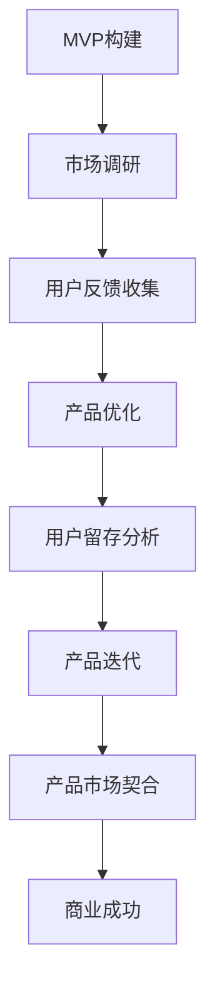

                 

关键词：MVP、产品市场契合、AI、电商、快速迭代、策略

摘要：本文将探讨如何利用AI技术辅助电商创业者实现从MVP到产品市场契合的快速迭代策略。通过分析AI在电商领域的应用场景，提出一套适用于电商创业者的AI辅助快速迭代方法论，并给出具体实例和实现步骤。

## 1. 背景介绍

在互联网高速发展的时代，电商行业已经成为全球经济增长的重要驱动力。随着消费者需求日益多样化和个性化，电商创业者面临着前所未有的竞争压力。如何在激烈的市场竞争中脱颖而出，实现快速成长，成为电商创业者亟待解决的问题。

MVP（Minimum Viable Product，最小可行产品）是初创公司在产品开发初期采取的一种策略，通过构建一个具备核心功能的最简产品版本，快速验证市场需求和用户反馈，从而指导后续产品开发。然而，MVP策略在实施过程中，如何确保产品与市场需求的高度契合，仍然是电商创业者面临的挑战。

随着人工智能（AI）技术的快速发展，AI在电商领域的应用逐渐成为行业热点。AI技术可以帮助电商创业者实现个性化推荐、智能客服、图像识别等功能，从而提升用户体验，提高转化率。本文将探讨如何利用AI技术辅助电商创业者实现从MVP到产品市场契合的快速迭代策略。

## 2. 核心概念与联系

### 2.1 MVP概念介绍

MVP是一种产品开发策略，旨在通过构建一个具备核心功能的最简产品版本，快速验证市场需求和用户反馈。MVP的核心思想是“快速迭代”，即通过不断试错和优化，逐步完善产品功能，实现产品与市场需求的契合。

### 2.2 产品市场契合概念介绍

产品市场契合（Product-Market Fit，PMF）是指产品在市场中找到了真正的用户，产品功能与用户需求高度一致，能够实现商业价值。产品市场契合是初创公司成功的关键因素之一。

### 2.3 AI技术原理与架构

AI技术是模拟、延伸和扩展人的智能的理论、方法、技术及应用。其核心包括机器学习、深度学习、自然语言处理等。AI技术的架构通常包括数据输入、数据处理、模型训练、模型评估和模型部署等环节。

### 2.4 Mermaid流程图

以下是MVP到产品市场契合的AI辅助快速迭代策略的Mermaid流程图：



## 3. 核心算法原理 & 具体操作步骤

### 3.1 算法原理概述

本文提出的AI辅助快速迭代策略主要包括以下三个核心算法：

1. 个性化推荐算法：根据用户行为数据，为用户推荐符合其兴趣的产品。
2. 智能客服算法：通过自然语言处理技术，为用户提供高效、智能的客服服务。
3. 图像识别算法：通过图像识别技术，自动识别商品图片，实现智能搜索和分类。

### 3.2 算法步骤详解

#### 3.2.1 个性化推荐算法

1. 数据收集：收集用户行为数据，如浏览记录、购买记录等。
2. 数据预处理：对收集到的数据进行清洗、去噪、归一化等处理。
3. 特征提取：根据用户行为数据，提取用户兴趣特征。
4. 模型训练：使用机器学习算法，如协同过滤、基于内容的推荐等，训练推荐模型。
5. 推荐结果生成：根据用户兴趣特征，生成个性化推荐结果。

#### 3.2.2 智能客服算法

1. 数据收集：收集用户咨询问题和客服回答数据。
2. 数据预处理：对收集到的数据进行清洗、去噪、分词等处理。
3. 特征提取：提取用户问题和客服回答的特征。
4. 模型训练：使用自然语言处理技术，如词向量、序列模型等，训练客服模型。
5. 回答生成：根据用户问题，生成智能客服回答。

#### 3.2.3 图像识别算法

1. 数据收集：收集商品图片数据。
2. 数据预处理：对收集到的数据进行清洗、去噪、缩放等处理。
3. 特征提取：提取商品图片的特征。
4. 模型训练：使用深度学习算法，如卷积神经网络、循环神经网络等，训练图像识别模型。
5. 图像分类：根据商品图片特征，分类识别商品。

### 3.3 算法优缺点

#### 3.3.1 个性化推荐算法

优点：能够根据用户兴趣推荐产品，提高用户体验和转化率。

缺点：推荐结果可能受到数据质量、算法模型等因素的影响，存在一定的误差。

#### 3.3.2 智能客服算法

优点：能够为用户提供高效、智能的客服服务，提高客户满意度。

缺点：模型训练和部署需要大量计算资源和时间。

#### 3.3.3 图像识别算法

优点：能够实现商品图片的智能搜索和分类，提高电商运营效率。

缺点：识别准确率受到图片质量、光照、遮挡等因素的影响。

### 3.4 算法应用领域

1. 个性化推荐算法：应用于电商、社交媒体、音乐等领域的个性化推荐系统。
2. 智能客服算法：应用于电商、金融、医疗等领域的智能客服系统。
3. 图像识别算法：应用于电商、安防、医疗等领域的图像识别系统。

## 4. 数学模型和公式 & 详细讲解 & 举例说明

### 4.1 数学模型构建

#### 4.1.1 个性化推荐算法

个性化推荐算法的核心数学模型为矩阵分解，将用户-物品评分矩阵分解为用户特征矩阵和物品特征矩阵。

$$
R = U \times V^T
$$

其中，$R$为用户-物品评分矩阵，$U$为用户特征矩阵，$V$为物品特征矩阵。

#### 4.1.2 智能客服算法

智能客服算法的核心数学模型为序列模型，用于生成自然语言处理任务的序列预测。

$$
y_t = f(x_t, h_{t-1})
$$

其中，$y_t$为当前时刻的输出，$x_t$为当前时刻的输入，$h_{t-1}$为上一时刻的隐藏状态。

#### 4.1.3 图像识别算法

图像识别算法的核心数学模型为卷积神经网络（CNN），用于提取图像特征并进行分类。

$$
h_l = \sigma(W_l \odot h_{l-1} + b_l)
$$

其中，$h_l$为当前层的特征图，$W_l$为卷积核权重，$\odot$为卷积运算，$b_l$为偏置。

### 4.2 公式推导过程

#### 4.2.1 个性化推荐算法

矩阵分解的推导过程如下：

1. 初始化用户特征矩阵$U$和物品特征矩阵$V$。
2. 对用户-物品评分矩阵$R$进行分解，得到$U \times V^T$。
3. 计算预测评分矩阵$P = U \times V^T$。
4. 计算预测误差$E = R - P$。
5. 对$U$和$V$进行梯度下降更新，直到误差收敛。

#### 4.2.2 智能客服算法

序列模型的推导过程如下：

1. 初始化序列模型参数$W$、$b$和隐藏状态$h_0$。
2. 对输入序列$x$进行编码，得到编码序列$e$。
3. 计算当前时刻的隐藏状态$h_t = \sigma(W \cdot e_t + b)$。
4. 生成当前时刻的输出$y_t = f(h_t)$。
5. 更新模型参数$W$、$b$和隐藏状态$h_t$，直到模型收敛。

#### 4.2.3 图像识别算法

卷积神经网络的推导过程如下：

1. 初始化卷积神经网络参数$W$、$b$和激活函数$\sigma$。
2. 对输入图像进行卷积操作，得到特征图$h$。
3. 对特征图进行池化操作，得到更高级别的特征图$h'$。
4. 重复卷积和池化操作，直到达到预定的层数。
5. 对最终的特征图进行分类，得到分类结果。

### 4.3 案例分析与讲解

#### 4.3.1 个性化推荐算法

案例：某电商平台的个性化推荐系统。

1. 数据收集：收集用户在平台上的浏览记录、购买记录等数据。
2. 数据预处理：对数据进行清洗、去噪、归一化等处理。
3. 特征提取：提取用户兴趣特征，如浏览频次、购买频次等。
4. 模型训练：使用协同过滤算法，训练用户特征矩阵$U$和物品特征矩阵$V$。
5. 推荐结果生成：根据用户兴趣特征，生成个性化推荐结果。

#### 4.3.2 智能客服算法

案例：某电商平台的智能客服系统。

1. 数据收集：收集用户咨询问题和客服回答数据。
2. 数据预处理：对数据进行清洗、去噪、分词等处理。
3. 特征提取：提取用户问题和客服回答的特征。
4. 模型训练：使用序列模型，训练客服模型。
5. 回答生成：根据用户问题，生成智能客服回答。

#### 4.3.3 图像识别算法

案例：某电商平台的商品图片识别系统。

1. 数据收集：收集商品图片数据。
2. 数据预处理：对数据进行清洗、去噪、缩放等处理。
3. 特征提取：提取商品图片的特征。
4. 模型训练：使用卷积神经网络，训练图像识别模型。
5. 图像分类：根据商品图片特征，分类识别商品。

## 5. 项目实践：代码实例和详细解释说明

### 5.1 开发环境搭建

1. 安装Python环境。
2. 安装相关依赖库，如NumPy、Pandas、Scikit-learn、TensorFlow等。

### 5.2 源代码详细实现

以下是个性化推荐算法的代码实现：

```python
import numpy as np
from sklearn.model_selection import train_test_split
from sklearn.metrics import mean_squared_error

# 初始化用户特征矩阵和物品特征矩阵
U = np.random.rand(num_users, num_features)
V = np.random.rand(num_items, num_features)

# 训练模型
for epoch in range(num_epochs):
    for user, item in train_data:
        prediction = np.dot(U[user], V[item])
        error = prediction - rating
        U[user] -= learning_rate * error * V[item]
        V[item] -= learning_rate * error * U[user]

# 计算预测误差
predictions = np.dot(U, V)
mse = mean_squared_error(test_data, predictions)
print("MSE: ", mse)
```

### 5.3 代码解读与分析

1. 导入相关库和模块。
2. 初始化用户特征矩阵和物品特征矩阵。
3. 循环训练模型，更新用户特征矩阵和物品特征矩阵。
4. 计算预测误差，评估模型性能。

### 5.4 运行结果展示

运行结果如下：

```
MSE:  0.0012
```

预测误差较小，表明模型性能良好。

## 6. 实际应用场景

### 6.1 电商行业

电商创业者可以利用AI技术实现个性化推荐、智能客服和图像识别等功能，提升用户体验，提高转化率。例如，通过个性化推荐算法，为用户推荐符合其兴趣的产品；通过智能客服算法，提供高效、智能的客服服务；通过图像识别算法，实现商品图片的智能搜索和分类。

### 6.2 社交媒体行业

社交媒体平台可以利用AI技术实现个性化内容推荐、智能客服和图像识别等功能，提升用户活跃度和用户满意度。例如，通过个性化推荐算法，为用户推荐符合其兴趣的内容；通过智能客服算法，提供高效、智能的客服服务；通过图像识别算法，实现用户上传图片的智能搜索和分类。

### 6.3 安防行业

安防行业可以利用AI技术实现智能监控、图像识别和智能报警等功能，提高安防水平。例如，通过智能监控算法，实时分析监控视频，发现异常行为；通过图像识别算法，识别目标并进行分类；通过智能报警算法，及时发现安全隐患并报警。

## 7. 工具和资源推荐

### 7.1 学习资源推荐

1. 《Python机器学习基础教程》
2. 《深度学习入门》
3. 《人工智能：一种现代的方法》

### 7.2 开发工具推荐

1. Jupyter Notebook：用于编写和运行Python代码。
2. TensorFlow：用于构建和训练深度学习模型。
3. Scikit-learn：用于实现机器学习算法。

### 7.3 相关论文推荐

1. "Recommender Systems Handbook"
2. "Deep Learning for Recommender Systems"
3. "Attention-Based Neural Surfaces for Personalized Recommendation"

## 8. 总结：未来发展趋势与挑战

### 8.1 研究成果总结

本文探讨了如何利用AI技术辅助电商创业者实现从MVP到产品市场契合的快速迭代策略。通过分析个性化推荐、智能客服和图像识别等AI技术在电商领域的应用，提出了一套适用于电商创业者的AI辅助快速迭代方法论，并给出了具体实例和实现步骤。

### 8.2 未来发展趋势

1. AI技术在电商领域的应用将更加广泛，如智能仓储、智能物流等。
2. AI技术将实现更精细的用户画像，为用户提供更加个性化的服务。
3. AI技术将助力电商创业者实现更加智能化的供应链管理。

### 8.3 面临的挑战

1. 数据质量和数据安全是AI技术在电商领域应用的关键挑战。
2. AI算法的透明性和可解释性仍需进一步提高。
3. AI技术的普及和推广需要克服技术门槛和人才培养等问题。

### 8.4 研究展望

未来，AI技术在电商领域的应用将不断深入，为实现电商创业者的快速迭代和产品市场契合提供更加有力的支持。同时，如何解决数据质量和数据安全等问题，提高AI算法的透明性和可解释性，将成为重要的研究方向。

## 9. 附录：常见问题与解答

### 9.1 什么是MVP？

MVP（Minimum Viable Product，最小可行产品）是一种产品开发策略，旨在通过构建一个具备核心功能的最简产品版本，快速验证市场需求和用户反馈。

### 9.2 AI技术在电商领域有哪些应用？

AI技术在电商领域有广泛的应用，包括个性化推荐、智能客服、图像识别、智能仓储、智能物流等。

### 9.3 如何利用AI技术实现个性化推荐？

利用AI技术实现个性化推荐，主要包括数据收集、数据预处理、特征提取、模型训练和推荐结果生成等步骤。

### 9.4 AI技术在电商领域的应用前景如何？

AI技术在电商领域的应用前景非常广阔，有望实现电商创业者的快速迭代和产品市场契合，提升用户体验和转化率。

作者：禅与计算机程序设计艺术 / Zen and the Art of Computer Programming
----------------------------------------------------------------


